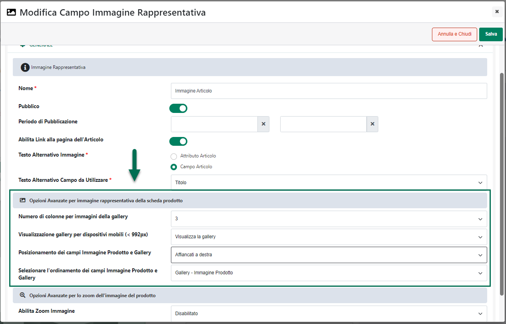
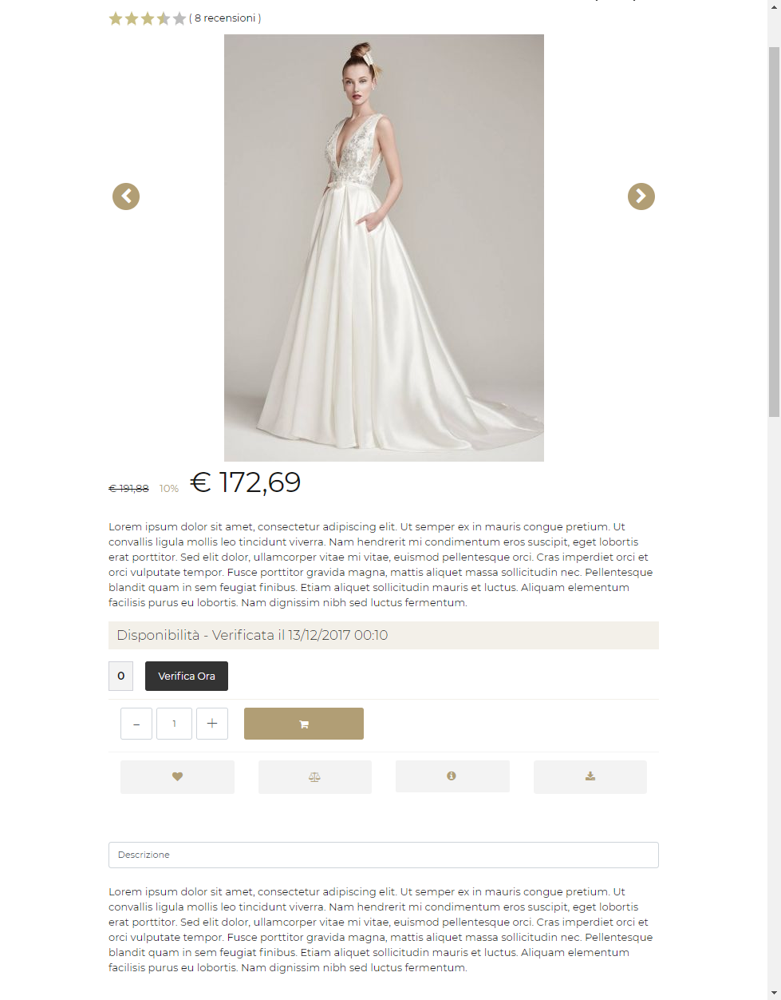
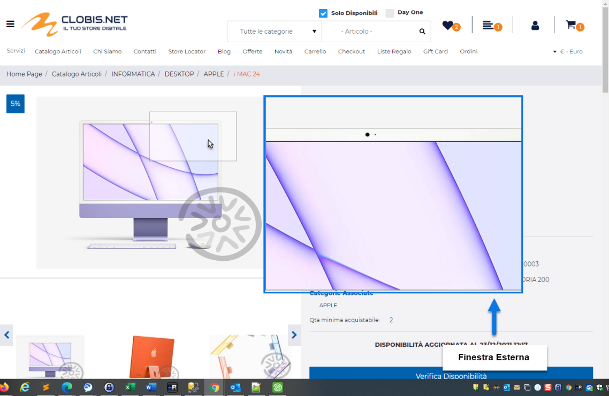
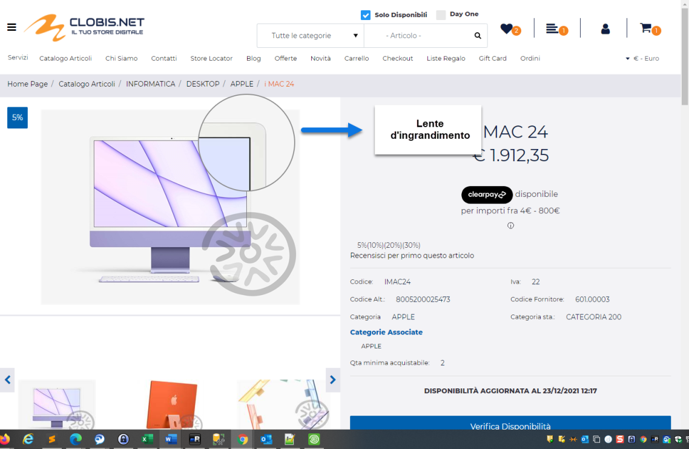
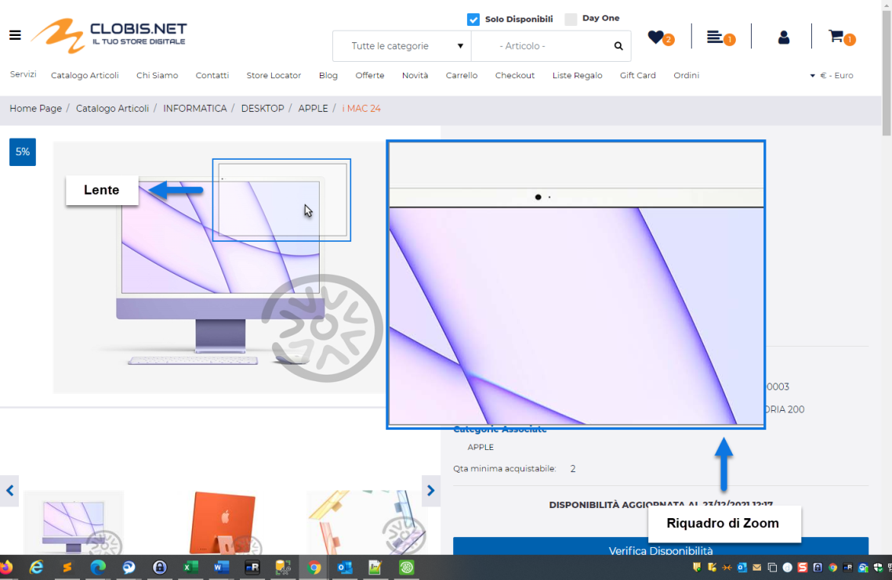

# CONFIGURAZIONE

Una volta inserito il Componente all'interno della pagina web, verrà
aperta in automatico **la sua maschera di gestione e configurazione**

suddivisa in varie sezioni.

All'interno della sezione "**Dati Componente**" sarà possibile inserire
il contenuto e settare i principali parametri di configurazione del
componente.

In particolare, per la tipologia di Componente in questione, sarà
possibile impostare un valore per i seguenti parametri:

**Nome:** consente di definire un nome per il Componente che si sta
editando

**Pubblico (selezionato a default):** consente di impostare la
visibilità del componente lato sito web. Se selezionato il
corrispondente componente verrà correttamente pubblicato e visualizzato
all'interno del sito. Nel caso in cui invece tale parametro non sia
selezionato, il corrispondente componente passerà in modalità "Offline",
sarà quindi visibile all'interno del Wizard, dove potrà essere
normalmente gestito, ma non verrà pubblicato e visualizzato all'interno
del sito.

**Periodo di Pubblicazione:** consente di associare al Componente in
oggetto uno specifico periodo di pubblicazione, definendone l'effettiva
data di pubblicazione e la corrispondente data di oscuramento.

Nel primo dei due campi disponibili occorrerà quindi indicare,
utilizzando l'apposito calendario, la data di inizio pubblicazione. Nel
secondo campo andrà invece specificata la data di fine pubblicazione.

> **ATTENZIONE!** Le date indicate all'interno di questi campi verranno
> considerate solo ed esclusivamente nel caso in cui il precedente
> parametro "Pubblico" sia stato selezionato

**Testo Alternativo Immagine:** consente di personalizzare gli attributi
**title** e **alt** relativi all'immagine articolo, utilizzando per essi
lo stesso valore utilizzato anche per il Componente "Titolo" oppure il
valore di un Attributo Articolo appositamente creato.

In particolare dunque nel caso in cui il campo in esame sia impostato
sul valore:

- **Campo Articolo:** sarà possibile selezionare dal sottostante menu a
  tendina ("**Testo Alternativo Campo da Utilizzare**") la sola opzione
  **Titolo.**

> In queste condizioni gli attributi **title** e **alt** dell'immagine
> articolo verranno valorizzati con la stessa informazione utilizzata
> anche per il Componente Titolo.

- **Attributo Articolo:** sarà possibile selezionare dal sottostante
  menu a tendina ("**Testo Alternativo Attributo da Utilizzare**") uno
  qualsiasi degli Attributi Articolo (siano essi di tipo Mexal o
  Passweb) precedentemente codificati all'interno della corrispondente
  sezione del Wizard.

> In queste condizioni gli attributi "title" e "alt" dell'immagine
> articolo verranno valorizzati con il valore impostato per l'attributo
> selezionato

La sotto sezione "**Opzioni Avanzate per immagine rappresentativa della
scheda prodotto**" consente di settare i parametri di configurazione
relativi alla galleria delle immagini secondarie.

Nello specifico dunque il parametro

**Numero di colonne per immagini della gallery:** consente di indicare
il numero di immagini che dovranno essere visualizzate
contemporaneamente all'interno della "Galleria delle immagini
secondarie"

**Visualizzazione gallery per dispositivi mobili (\< 992px):** consente
di decidere se, in corrispondenza di risoluzioni inferiori ai 992 px,
dovrà essere visualizzata la sola Immagine Principale oppure l'Immagine
Principale e la Galleria delle Immagini secondarie. E' possibile
selezionare uno dei seguenti valori:

- **Non visualizzare la gallery:** in queste condizioni, nel momento in
  cui il dispositivo di visualizzazione del sito dovesse avere una
  risoluzione inferiore ai 992 px, verrà visualizzata solamente
  l'immagine principale.

> Il passaggio da un'immagine all'altra sarà comunque garantito da due
> frecce di navigazione (verso destra e verso sinistra) poste ai lati
> dell'immagine stessa.

- **Visualizza la gallery:** in queste condizioni anche per risoluzioni
  inferiori ai 992 px il componente manterrà comunque sia l'immagine
  principale che la galleria delle immagini secondarie conservando, di
  fatto, la stessa tipologia di visualizzazione che lo caratterizza
  anche per risoluzioni superiori ai 992px

**Posizionamento dei campi Immagine Prodotto e Gallery**: consente di
definire come dovranno essere posizionati i due elementi principali del
componente ossia l' Immagine Principale e la Galleria delle immagini
secondarie.

E' possibile selezionare uno dei seguenti valori:

- Affiancati a destra

- Affiancati a sinistra

- Affiancati e giustificati

- Affiancati e opposti

- Centrati e affiancati

- Centrati e Incolonnati

- Incolonnati a destra

- Incolonnati a sinistra

- Custom

Con posizionamenti Affiancati è possibile sviluppare la galleria delle
immagini secondarie, ed il corrispondente slider, in verticale.

Con posizionamenti Incolonnati è invece possibile sviluppare la galleria
delle immagini secondarie ed il corrispondente slider in orizzontale.

**ATTENZIONE!** Nel caso in cui si decidesse di utilizzare uno dei
preset presenti in elenco poi il posizionamento degli elementi sarà
esattamente quello indicato e non potrà essere modificato in alcun modo.

**L'opzione Custom consente invece di non applicare nessun preset
particolare.** **In queste condizioni dunque il posizionamento dei vari
elementi potrà essere variato liberamente agendo sulle corrette
proprietà CSS mediante lo style editor di Passweb e/o mediante i
relativi strumenti di editing avanzato.**

**Selezionare l'ordinamento dei campi Immagine Prodotto e Gallery:**
consente di decidere se il componente dovrà essere sviluppato
visualizzando prima l'Immagine Principale e poi la Galleria delle
immagini secondarie o viceversa

**ATTENZIONE!** Anche in questo caso l'opzione Custom, non attiva nessun
tipo di preset per cui l'ordine di visualizzazione dei rispettivi
elementi potrà essere variato liberamente agendo sulle corrette
proprietà CSS mediante lo style editor di Passweb e/o mediante i
relativi strumenti di editing avanzato.

Infine, all'interno della sotto sezione "**Opzioni avanzate per lo zoom
dell'Immagine del prodotto**" sarà possibile attivare e configurare
l'effetto di zoom sull'Immagine Principale del prodotto.

Nello specifico dunque il parametro

**Abilita Zoom Immagine:** consente di abilitare / disabilitare
l'effetto di zoom sulla relativa immagine prodotto.

**Tipo di zoom:** consente di impostare la tipologia di zoom da
attivare. E' possibile selezionare uno dei seguenti valori:

- **Finestra esterna:** selezionando questa opzione il riquadro di zoom
  verrà posizionato esternamente all'immagine principale della galleria

- **Interno**: selezionando questa opzione il riquadro di zoom verrà
  posizionato internamente all'immagine principale della galleria

- **Lente:** selezionando questa opzione non verrà impostato nessun
  riquadro di zoom ma l'effetto sarà implementato mediante l'utilizzo di
  una lente di ingrandimento da poter spostare direttamente
  sull'immagine principale della galleria

**ATTENZIONE!** Per un funzionamento ottimale dello zoom si consiglia di
utilizzare immagini originali (principale e secondarie) tutte delle
stesse dimensioni

**Posizione dell'immagine zoomata:** solo per "Tipo di zoom = Finestra
Esterna"

Consente di impostare la posizione (**Alto / Basso / Destra /
Sinistra)** in cui dovrà essere visualizzato il riquadro di zoom
rispetto all'immagine principale della galleria.

**Altezza / Larghezza della finestra dello zoom:** solo per "Tipo di
zoom = Finestra Esterna"

Consente di impostare le dimensioni (altezza / larghezza) del riquadro
di zoom. Tali dimensioni verranno prese in considerazione solo nel
momento in cui il successivo parametro "**Tipo di zoom**" sia impostato
sul valore "**Finestra Esterna**"

**Offset orizzontale / verticale della finestra dell'immagine:** solo
per "Tipo di zoom = Finestra Esterna"

Consente di impostare un offset di scostamento orizzontale / verticale
della finestra di zoom rispetto all'immagine del prodotto.

**Tipo di cursore lente:** consente di impostare la tipologia del
puntatore visualizzato all'interno della lente utilizzata per
individuare la porzione dell'immagine principale da zoomare. E'
possibile selezionare uno dei seguenti valori:

- **Classico:** selezionando questa opzione il puntatore all'interno
  della lente sarà il classico puntatore di sistema

- **Crocino:** selezionando questa opzione il puntatore all'interno
  della lente sarà un mirino a forma di croce

**Forma della lente:** solo per "Tipo di zoom = Finestra Esterna" oppure
per "Tipo di zoom = Finestra Lente"

Consente di impostare la forma da utilizzare per il riquadro della lente

**Scroll zoom**: consente di abilitare o meno la gestione della scala di
zoom direttamente dalla rotellina del mouse. E' possibile selezionare
una delle seguenti opzioni:

- **Abilitato:** selezionando questa opzione sarà poi possibile
  aumentare o diminuire il livello di zoom utilizzando direttamente la
  rotellina del mouse.

> **ATTENZIONE!** nel momento in cui il livello di zoom impostato con la
> rotellina del mouse dovesse essere tale da superare le dimensioni
> originali dell'immagini, questa risulterà inevitabilmente "sgranata"

- **Disabilitato**: selezionando questa opzione il livello di zoom sarà
  fissato ad una scala di 1:1 rispetto quelle che sono le dimensioni
  originali della relativa immagine e non sarà possibile ne aumentarlo
  ne tanto meno diminuirlo

In relazione all'effetto di zoom attivabile e configurabile attraverso i
parametri sopra analizzati è bene poi fare alcune considerazioni di
fondamentale importanza:

- L'attivazione dell'effetto di zoom disabilita automaticamente la
  possibilità di far partire la galleria delle immagini a tutto schermo
  cliccando sull'immagine principale (tale possibilità rimarrà quindi
  attiva solo per le miniature presenti in galleria)

- L'attivazione dell'effetto di zoom presuppone, ovviamente, l'utilizzo
  di immagini originali di dimensioni maggiori rispetto a quelle
  impostate nei corrispondenti parametri presenti all'interno della
  maschera "**Lista delle tipologie di immagini nel Catalogo**"
  precedentemente analizzata

- L'immagine visualizzata all'interno del riquadro di zoom sarà sempre
  l'immagine originale caricata, per l'articolo in esame, all'interno
  del gestionale o direttamente dal backend di Passweb. Le immagini
  stampate all'interno della pagina web saranno invece quelle
  opportunamente ridimensionate da Passweb stesso sulla base delle
  impostazioni settate all'interno della maschera "**Lista delle
  tipologie di immagini nel Catalogo**". Questo consente di ridurre il
  peso complessivo della pagina web e di caricare, generalmente, le
  immagini originali solo quando effettivamente richieste (in realtà la
  prima immagine originale sarà già presente all'interno della pagina
  web).

- Indipendentemente da quanto indicato al punto precedente **è sempre
  bene utilizzare immagini originali con un peso contenuto (al massimo
  poche centinaia di kb)** in modo tale da non appesantire troppo la
  pagina web rallentandone poi il caricamento

- Le impostazioni inziali dello zoom sono tali da non "sgranare"
  l'immagine originale, mantenendone quindi inalterata la qualità.\
  Volendo potrebbe anche essere possibile aumentare o diminuire il
  livello di zoom utilizzando la rotellina del mouse. In questo caso nel
  momento in cui il livello di zoom impostato dovesse essere tale da
  superare le dimensioni originali dell'immagine stessa questa
  risulterà, ovviamente, sgranata

- Indipendentemente dalle impostazioni settate, l'effetto di zoom sarà
  attivo solo per risoluzioni superiori ai 768px. Nei dispositivi mobile
  tale effetto risulterà quindi disabilitato.

**NOTA BENE:** per maggiori informazioni relativamente alle sezioni
"**Avanzate e Animazioni**", "**Distribuzione**" e "**Protezione**",
presenti nella maschera di gestione e configurazione di tutti i
componenti Passweb, si veda anche il capitolo " Varianti Responsive --
Configurazione Componenti -- Caratteristiche Generali " di questo
manuale.

