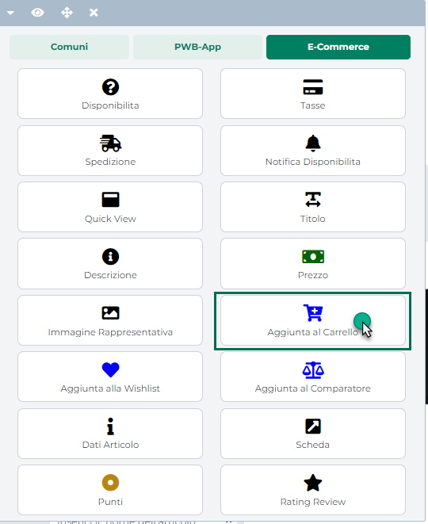

# COMPONENTI E-COMMERCE -- AGGIUNTA AL CARRELLO

Il Componente **"Aggiunta al Carrello"**

consente di inserire all'interno del corrispondente Componente Ecommerce
di primo livello (es. Catalogo Ecommerce, Popolarità Prodotto, Scheda
Prodotto ecc...), tutti gli elementi necessari per poter definire la
quantità dello specifico articolo che si intende acquistare (campo
quantità, pulsanti incrementali ecc...) e per poter inserire l'articolo
stesso in Carrello (pulsante Aggiungi)

> **NOTA BENE:** nel caso in cui ad effettuare l'ordine sia un Agente
> (Ecommerce Mexal) il componente "Aggiungi al Carrello" verrà
> visualizzato solo ed esclusivamente dopo che l'Agente stesso avrà
> effettuato la login per conto di uno dei suoi clienti

Rilasciando il Componente nella posizione desiderata verrà visualizzata
**la sua maschera di gestione e configurazione**

suddivisa in varie sezioni.

All'interno della sezione "**Dati Componente**" sarà possibile inserire
il contenuto e settare i principali parametri di configurazione del
componente.

In particolare, per la tipologia di Componente in questione, sarà
possibile impostare un valore per i seguenti parametri:

- **Nome:** consente di impostare un nome per il Componente che si sta
  editando.

- **Pubblico (selezionato a default):** consente di impostare la
  visibilità del componente lato sito web. Se selezionato il
  corrispondente componente verrà correttamente pubblicato e
  visualizzato all'interno del sito. Nel caso in cui invece tale
  parametro non sia selezionato, il corrispondente componente passerà in
  modalità "Offline", sarà quindi visibile all'interno del Wizard, dove
  potrà essere normalmente gestito, ma non verrà pubblicato e
  visualizzato all'interno del sito.

- **Periodo di Pubblicazione:** consente di associare al Componente in
  oggetto uno specifico periodo di pubblicazione, definendone
  l'effettiva data di pubblicazione e la corrispondente data di
  oscuramento.

> Nel primo dei due campi disponibili occorrerà quindi indicare,
> utilizzando l'apposito calendario, la data di inizio pubblicazione.
> Nel secondo campo andrà invece specificata la data di fine
> pubblicazione.
>
> **ATTENZIONE!** Le date indicate all'interno di questi campi verranno
> considerate solo ed esclusivamente nel caso in cui il precedente
> parametro "Pubblico" sia stato selezionato

- **Title:** consente di indicare una stringa che verrà poi utilizzata
  come attributo title del componente e visualizzata quindi nel tooltip
  che comparirà al passaggio del mouse sul pulsante di "Aggiungi in
  carrello"

- **Visualizza sempre il messaggio quando si aggiunge l'articolo:**
  selezionando questo parametro dopo aver aggiunto un articolo in
  carrello verrà sempre visualizzato un apposito messaggio di notifica
  per avvisare l'utente dell'avvenuta operazione (indipendentemente dal
  fatto che nella stessa pagina sia presente o meno anche il componente
  Carrellino).

> **ATTENZIONE**! Il messaggio di notifica può essere personalizzato
> inserendo l'apposito codice HTML all'interno del campo "**Aggiunta**"
> presente nella sezione "Gestione Testi / Messaggi del Sito" in
> corrispondenza del componente "**Aggiunta al Carrello**"

> In relazione a quelli che sono i contenuti del pop up di aggiunta in
> carrello occorre poi sottolineare che le quantità ed il subtotale
> eventualmente mostrati al suo interno dipenderanno anche dalle
> impostazioni settate per il parametro "**Gestione articoli in carrello
> / wishlist**" presente alla pagina "**Configurazione Catalogo**" del
> Wizard (menu "*Catalogo -- Catalogo Mexal / Ho.Re.Ca.*") e quindi dal
> fatto che l'aggiunta in carrello del prodotto selezionato vada a
> creare una nuova riga articolo oppure ad aggiornare una riga dello
> stesso prodotto già presente in carrello.
>
> In particolare nel momento in cui il parametro **Gestione articoli in
> carrello / wishlist** dovesse essere impostato sull'opzione:

- **Nuova riga articolo**: quantità e subtotale presenti nel pop up di
  aggiunta in carrello saranno sempre riferite alla quantità del
  prodotto che è stato effettivamente aggiunto indipendentemente dal
  fatto che in carrello siano già presenti o meno altre righe dello
  stesso prodotto.

> In queste condizioni dunque se dovessimo andare ad aggiungere in
> carrello, per due volte consecutive, un prodotto dal prezzo unitario
> pari a 38.61€ in quantità 2, in entrambi i casi verrà visualizzato un
> pop up del tipo di quello di seguito riportato

> in cui cioè la quantità indicata sarà sempre pari a 2 e il subtotale
> sarà sempre pari a 77.22€ (2 x 38.61)

- **Modifica riga articolo**: quantità e subtotale presenti nel pop up
  di aggiunta faranno riferimento alle condizioni della riga del
  prodotto in esame eventualmente già presente in carrello.

> In queste condizioni dunque se dovessimo andare ad aggiungere in
> carrello, per due volte consecutive, un prodotto dal prezzo unitario
> pari a 38.61€ in quantità 2, supponendo anche che inizialmente tale
> prodotto non sia presente in carrello, la prima volta otterremo un pop
> up analogo al precedente quindi con quantità pari a 2 e subtotale pari
> a 77.22€.
>
> La seconda volta invece, considerando che l'articolo aggiunto è già
> presente in carrello in quantità 2, all'interno del pop up di aggiunta
> verrà indicata una quantità pari a 4 (perché quell'articolo è ora
> presente in carrello in un\'unica riga di quantità 4) e un subtotale
> pari a 154.44€ (4 x 38.61)
>
> Unica eccezione a quanto sopra indicato è quella rappresentata dai
> Campionari Configurabili che, in quanto tali, una volta aggiunti in
> carrello andranno sempre a creare una nuova riga. Per essi dunque il
> pop up di aggiunta in carrello farà sempre riferimento alla quantità
> di prodotto effettivamente aggiunto in quel momento, indipendentemente
> dalle impostazioni settate per il parametro **Gestione articoli in
> carrello / wishlist**
>
> **ATTENZIONE!** Nel momento in cui il parametro "**Visualizza sempre
> il messaggio quando si aggiunge l'articolo** " non dovesse essere
> selezionato, l'evento utilizzato dall'applicazione per notificare
> all'utente l'avvenuto inserimento in carrello dell'articolo sarà
> diverso a seconda del fatto che nella stessa pagina sia presente o
> meno anche il componente Carrellino. Nello specifico:

- **nel caso in cui nella pagina in questione non sia presente un
  componente carrellino** a seguito dell'aggiunta di una articolo in
  carrello verrà visualizzato lo stesso messaggio di notifica
  precedentemente evidenziato

- **nel caso in cui nella pagina in questione sia presente anche un
  componente carrellino**, a seguito dell'inserimento di un articolo in
  carrello non verrà visualizzato nessun messaggio ma verrà avviata una
  specifica animazione per notificare all'utente l'avvenuto inserimento.

<!-- -->

- **Tempo di chiusura popup messaggio (ms):** consente di indicare
  l'intervallo di tempo (in millisecondi) trascorso il quale il popup di
  aggiunta in carrello si chiuderà in maniera automatica

- **Visualizza pulsanti incrementali (+/-):** consente di attivare i
  pulsanti + e -, posti immediatamente ai lati del campo di input per
  l'inserimento della quantità articoli da aggiungere in carrello e
  mediante i quali poter incrementare/decrementare di un'unità alla
  volta questa stessa quantità.

- **Step Incrementale dei pulsanti (+/-):** consente di definire se
  l'incremento delle quantità da aggiungere in carrello mediante i
  relativi pulsanti incrementali dovrà avvenire per step decimali o per
  singole unità.

- **Imposta la quantità di default dopo l'inserimento:** consente, se
  selezionato, di reimpostare automaticamente il valore iniziale nel
  campo di input delle quantità dopo che l'articolo è stato aggiunto in
  carrello

- **Posizionamento dei campi delle quantità:** consente di posizionare
  gli elementi utilizzati per definire le quantità degli articoli da
  inserire in carrello, secondo uno schema prestabilito.

> Nello specifico, gli elementi soggetti al tipo di posizionamento
> impostato mediante questo parametro saranno:

- Pulsante "meno"

- Pulsante "più"

- Campo di input delle quantità

- Pulsante Aggiungi

> E' possibile selezionare uno dei seguenti valori:

- Affiancati a destra

- Affiancati a sinistra

- Affiancati e giustificati

- Affiancati e opposti

- Centrati e affiancati

- Centrati e Incolonnati

- Incolonnati a destra

- Incolonnati a sinistra

- Custom

> **ATTENZIONE!** Nel caso in cui si decidesse di utilizzare uno dei
> preset presenti in elenco poi il posizionamento degli elementi sarà
> esattamente quello indicato e non potrà essere modificato in alcun
> modo.
>
> **L'opzione Custom consente invece di non applicare nessun preset
> particolare.** **In queste condizioni dunque il posizionamento dei
> vari elementi potrà essere variato liberamente agendo sulle corrette
> proprietà CSS mediante lo style editor di Passweb e/o mediante i
> relativi strumenti di editing avanzato.**

- **Ordinamento di visualizzazione dei campi delle quantità**:
  visualizzato solo nel caso in cui il precedente parametro non sia
  stato impostato sul valore Custom.

> Consente di definire l'ordine di visualizzazione degli elementi
> utilizzati per definire le quantità degli articoli da inserire in
> carrello, permettendo dunque, già in fase di configurazione del
> componente stesso di decidere quale elemento dovrà essere visualizzato
> prima e quale dopo.
>
> **ATTENZIONE**! Anche in questo caso l'opzione Custom, non attiva
> nessun tipo di preset per cui l'ordine di visualizzazione dei
> rispettivi elementi potrà essere variato liberamente agendo sulle
> corrette proprietà CSS mediante lo style editor di Passweb e/o
> mediante i relativi strumenti di editing avanzato.

- **Posizionamento del campo minimal o esteso rispetto ai campi delle
  quantità:** tale parametro ha effetto solo ed esclusivamente per
  articoli a Taglie / Colori e consente di posizionare i controlli per
  la selezione della specifica taglia /colore, rispetto a quelli per
  l'inserimento delle quantità, secondo uno schema prestabilito.

> Il fatto di visualizzare, all'interno di componenti di primo livello,
> come ad esempio il Catalogo Ecommerce, i controlli minimali o estesi
> per la selezione delle taglie / colori, dipende da come è stato
> impostato il parametro "**Grafica Negozio**" presente all'interno
> della maschera "**Modifica Serie**" alla pagina "*Catalogo -- Gestione
> Articoli -- Taglie e Colori*" del Wizard
>
> **ATTENZIONE!** all'interno del componente "**Lista Regalo**",
> indipendentemente dal valore assegnato al parametro "Grafica Negozio",
> per articolo a Taglie / Colori verrà utilizzata sempre la "Grafica
> Estesa" con la possibilità di indicare il valore 0 nel corrispondente
> campo di input per evitare di inserire in carrello una determinata
> taglia\\colore dell'articolo in questione
>
> Nello specifico poi, gli elementi soggetti al tipo di posizionamento
> impostato mediante questo parametro saranno:

- Campi minimal o esteso

- Campi delle quantità

> E' possibile selezionare uno dei seguenti valori:

- Affiancati a destra

- Affiancati a sinistra

- Affiancati e giustificati

- Affiancati e opposti

- Centrati e affiancati

- Centrati e Incolonnati

- Incolonnati a destra

- Incolonnati a sinistra

- Custom

> **ATTENZIONE!** Nel caso in cui si decidesse di utilizzare uno dei
> preset presenti in elenco poi il posizionamento degli elementi sarà
> esattamente quello indicato e non potrà essere modificato in alcun
> modo.
>
> **L'opzione Custom consente invece di non applicare nessun preset
> particolare.** **In queste condizioni dunque il posizionamento dei
> vari elementi potrà essere variato liberamente agendo sulle corrette
> proprietà CSS mediante lo style editor di Passweb e/o mediante i
> relativi strumenti di editing avanzato.**
>
> Negli esempi in figura è stato selezionato il posizionamento
> "Incolonnati a sinistra"

- **Ordinamento di visualizzazione dei campi minimal o esteso e
  quantità:** visualizzato solo nel caso in cui il precedente parametro
  non sia stato impostato sul valore Custom.

> Consente di definire l'ordine di visualizzazione dei controlli per la
> selezione della specifica taglia /colore, rispetto a quelli per
> l'inserimento delle quantità permettendo dunque, già in fase di
> configurazione del componente stesso di decidere quale elemento dovrà
> essere visualizzato prima e quale dopo.
>
> **ATTENZIONE**! Anche in questo caso l'opzione Custom, non attiva
> nessun tipo di preset per cui l'ordine di visualizzazione dei
> rispettivi elementi potrà essere variato liberamente agendo sulle
> corrette proprietà CSS mediante lo style editor di Passweb e/o
> mediante i relativi strumenti di editing avanzato.

- **Colonne in cui visualizzare i campi estesi:** nel caso in cui sia
  stato scelto come layout di visualizzazione dei controlli per la
  selezione delle Taglie / Colori da aggiungere in carrello quello
  corrispondente alla "Grafica Estesa", le varie taglie / colori
  verranno disposte all'interno di una griglia responsiva.

> Mediante questo parametro è possibile decidere quante colonne dovrà
> avere tale griglia e quindi quante taglie dovranno essere collocate su
> ciascuna riga.
>
> In ogni caso il comportamento responsivo della griglia è tale per cui
> in corrispondenza di risoluzioni inferiori ai 992 px la griglia stessa
> si linearizzerà posizionando tutte le colonne, e con esse le
> rispettive taglie, una sotto l'altra

- **Colore dell'animazione sulle Taglie/Colori (solo Ecommerce Mexal):**
  consente di impostare il colore dell'animazione che verrà avviata per
  articoli a taglie/colori gestiti con "Grafica Negozio" di tipo
  "Estesa", nel momento in cui un utente dovesse tentare di inserire in
  carrello questi articoli senza aver specificato, per almeno una taglia
  o un colore gestito, una quantità diversa da 0.

> Per maggiori informazioni in merito si veda anche la sezione di questo
> manuale relativa alla gestione delle taglie/colori (*Catalogo --
> Gestione Articoli -- Gestione Taglie/Colori*)

- **Pagina di destinazione all'inserimento di un articolo in carrello:**
  consente di specificare la pagina del sito cui l'utente verrà
  automaticamente ridiretto dopo aver cliccato sul pulsante "Aggiungi al
  Carrello" ed aver completato la corrispondente azione.

> La ridirezione automatica verso una specifica pagina potrebbe
> impiegare un secondo in maniera tale da consentire ad eventuali
> animazioni collegate all'aggiunta dell'articolo in carrello di
> terminare correttamente.
>
> Nel caso in cui non sia presente nella stessa pagina in cui è inserito
> il componente "Aggiungi al Carrello" anche il componente "Carrellino",
> l'aggiunta di un articolo in carrello non comporterà l'avvio di
> nessuna animazione. In queste condizioni quindi dopo aver aggiunto
> l'articolo in carrello verrà visualizzato un messaggio relativo
> all'esito positivo dell'operazione e successivamente l'utente verrà
> ridiretto verso la specifica pagina di destinazione.
>
> Infine nel caso in cui la quantità dello specifico articolo che si
> desidera inserire in carrello superi la quantità massima acquistabile
> per quello stesso articolo, non verrà effettuata nessun redirect
> automatico, indipendentemente da quanto impostato per il campo in
> questione

In relazione al componente in esame va infine considerate anche che:

- Nel caso in cui il componente dovesse essere inserito all'interno di
  un **Campionario / Composto Configurabile**, nella maschera di
  configurazione verranno visualizzati, oltre a quelli standard, i soli
  parametri relativi alla gestione delle quantità

- Nel caso in cui il componente dovesse essere inserito all'interno di
  un Componente **Lista Regalo** accanto al campo di input utilizzato
  per inserire la quantità da acquistare verrà visualizzato anche un
  ulteriore campo all'interno del quale sarà indicata la quantità
  attualmente ricevuta, per il relativo articolo, dal gestore della
  lista.

> **In queste condizioni, inoltre, la quantità visualizzata a default
> nel campo di input sarà data dalla differenza tra la quantità
> desiderata e quella ricevuta.**

Il pulsante "**Salva**" nella parte alta della maschera consentirà di
salvare le modifiche apportate al Componente in oggetto.

**NOTA BENE:** per maggiori informazioni relativamente alle sezioni
"**Avanzate e Animazioni**", "**Distribuzione**" e "**Protezione**",
presenti nella maschera di gestione e configurazione di tutti i
componenti Passweb, si veda anche il capitolo " Varianti Responsive --
Configurazione Componenti -- Caratteristiche Generali " di questo
manuale.

Una volta inserito il componente all'interno, ad esempio, del "Catalogo
Ecommerce", relativamente poi alla sua effettiva presenza all'interno
delle celle dei singoli articoli e alle quantità, intere o decimali, che
sarà possibile inserire attraverso l'apposito campo di input, occorre
fare le seguenti considerazioni:

- Il componente "Aggiungi al Carrello", all'interno di componenti quali
  "Catalogo Ecommerce", "Offerte/Novità", "Risultati Ricerca",
  "Abbinati" ecc... verrà visualizzato, con il relativo campo di input
  per l'inserimento delle quantità da acquistare, solo ed esclusivamente
  per quegli articoli che sono effettivamente acquistabili direttamente
  da questo tipo di componenti. Ciò significa quindi che, ad esempio,
  per articoli con la funzionalità di "**Prezzo a richiesta**" attivata
  (quindi non acquistabili direttamente dal sito) il componente Aggiungi
  al Carello, sebbene inserito lato Wizard, non verrà mai visualizzato
  sul Front End del sito (all'interno dei componenti indicati).

- **Per articoli gestiti a Taglie/Colori (Ecommerce Mexal)** la modalità
  di visualizzazione del componente "Aggiungi al Carrello" all'interno
  di componenti quali "Catalogo Ecommerce", "Offerte/Novità", "Risultati
  Ricerca", "Abbinati" ecc... dipende da come è stato impostato il
  parametro "**Grafica Negozio**" presente all'interno della maschera
  "**Modifica Serie**" alla pagina "*Catalogo -- Gestione Articoli --
  Taglie e Colori*" del Wizard e relativo ovviamente alla serie di
  taglie/colori cui appartiene lo specifico articolo.

> Dipendentemente dunque dalle impostazioni di questo parametro, per
> questo tipo di articoli sarà possibile **visualizzare**

- **Solo il pulsante aggiungi al carrello:** in questo caso cliccando su
  questo pulsante l'utente verrà ricondotto alla relativa pagina
  Prodotto dove dovrà definire la quantità dell'articolo da inserire in
  ordine per la specifica taglia o per lo specifico colore (secondo le
  modalità stabilite dal parametro "Grafica Prodotto" e definite in fase
  di configurazione della serie cui appartiene l'articolo in esame)

- **Il pulsante Aggiungi al Carrello con i relativi campi di input** per
  poter specificare direttamente da questi componenti e senza dover
  dunque necessariamente passare dalla scheda prodotto, la/le quantità
  da inserire in ordine per la specifica taglia/colore.

> **NOTA BENE:** per maggiori informazioni in merito alla gestione degli
> articoli a taglie/colori si veda anche la corrispondente sezione di
> questo manuale ("Catalogo -- Gestione Articoli -- Gestione
> Taglie/Colori").

- **Per articoli padri di struttura (Ecommerce Mexal) o articoli
  Prototipo (Ecommerce Ho.Re.Ca.)**, all'interno di componenti quali
  "Catalogo Ecommerce", "Offerte/Novità", "Risultati Ricerca",
  "Abbinati" ecc...verrà visualizzato in ogni caso solo ed
  esclusivamente il pulsante "Aggiungi al Carrello" senza il relativo
  campo di input delle quantità. Anche in questo caso dunque cliccando
  su questo pulsante l'utente verrà ricondotto alla relativa pagina
  Prodotto dove dovrà definire la specifica configurazione dell'articolo
  che intende acquistare prima di poterlo effettivamente inserire in
  carrello.

- Il componente "Aggiungi in Carrello" **consente l'acquisto dei vari
  articoli in quantità intere o decimali** in perfetto accordo con le
  impostazioni settate per lo specifico articolo direttamente
  all'interno del gestionale (**Ecommerce Mexal**) o nella sua
  Anagrafica Passweb (**Ecommerce Ho.Re.Ca.**)

