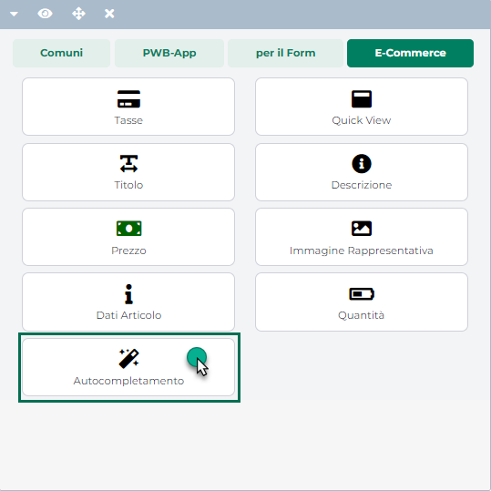
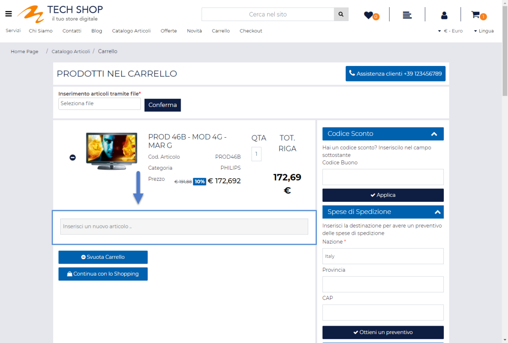
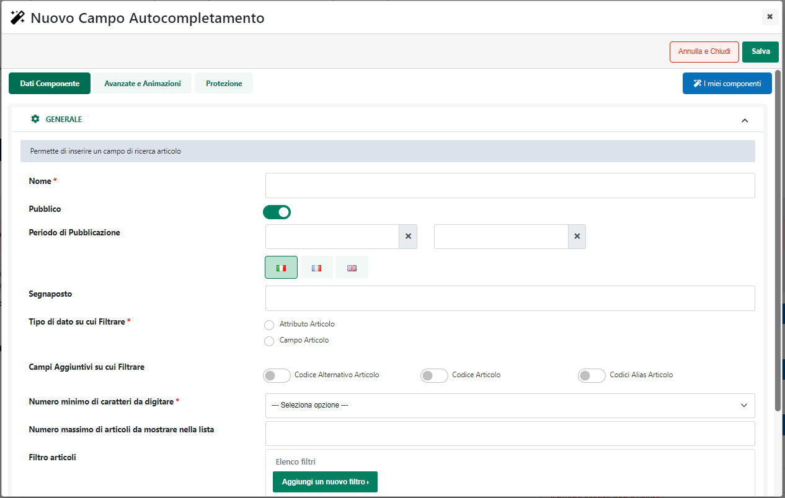
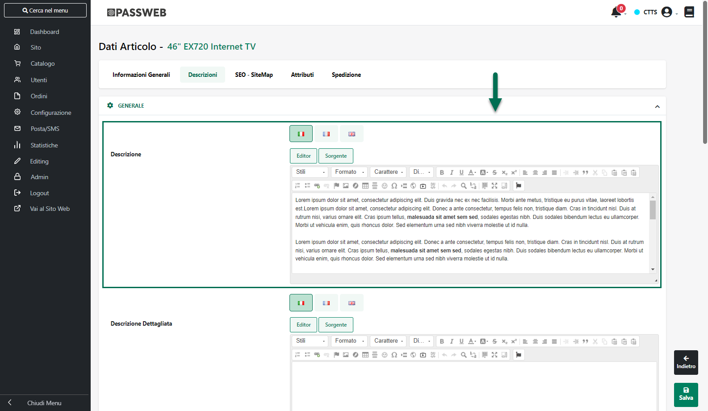
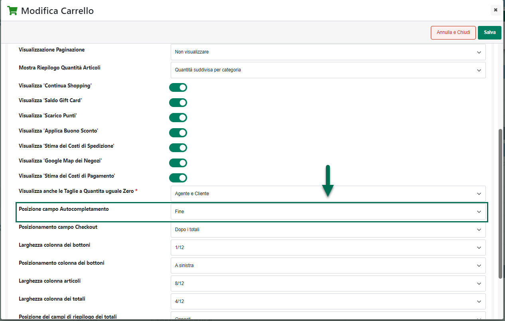
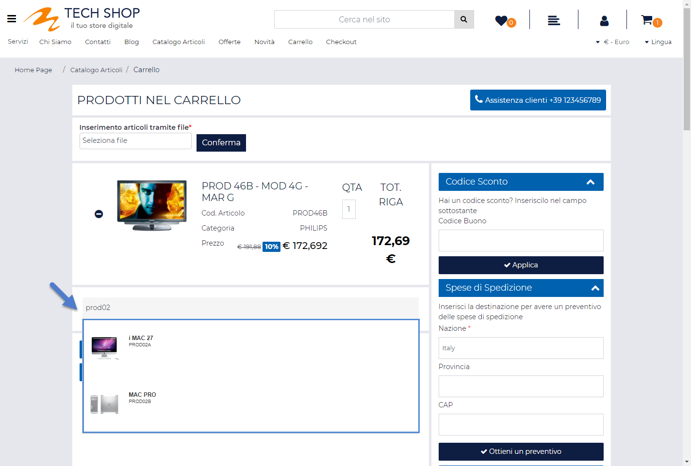
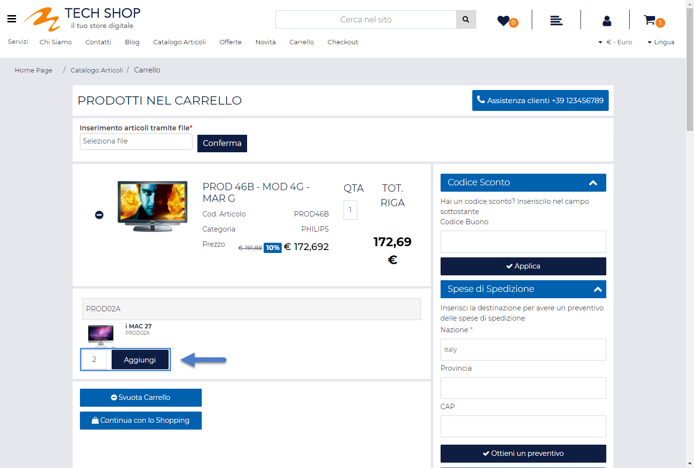
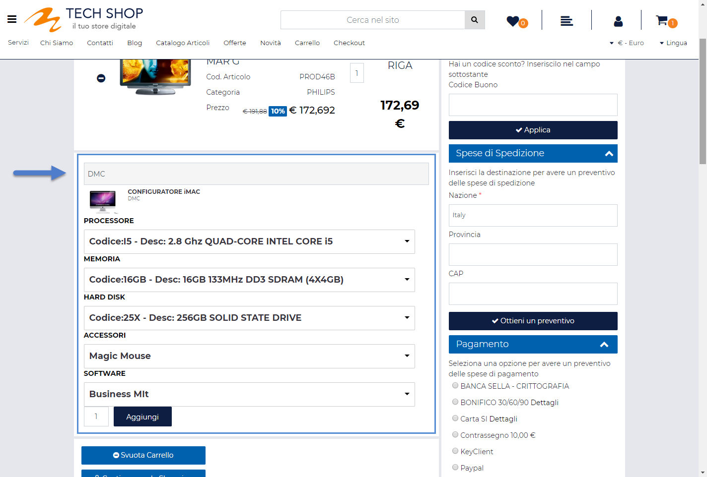
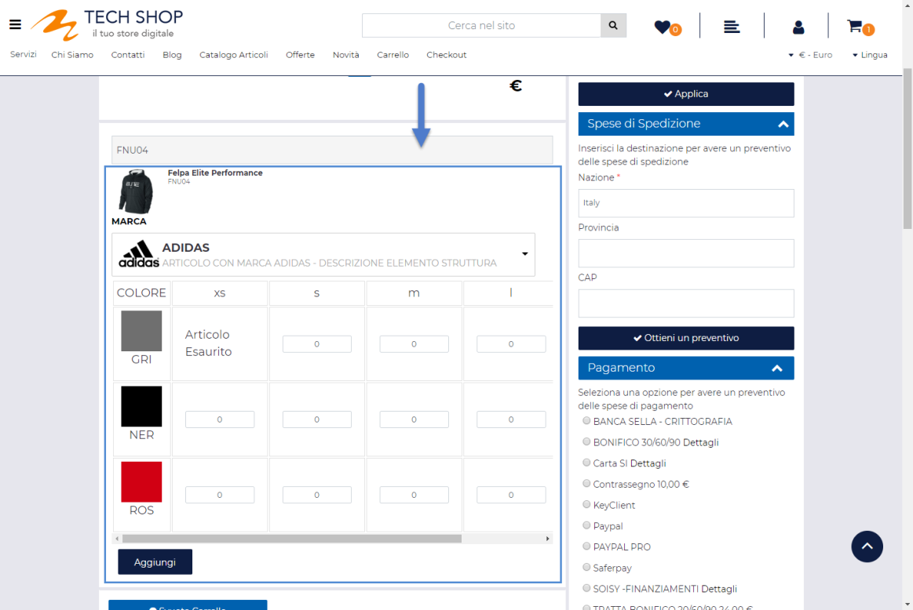
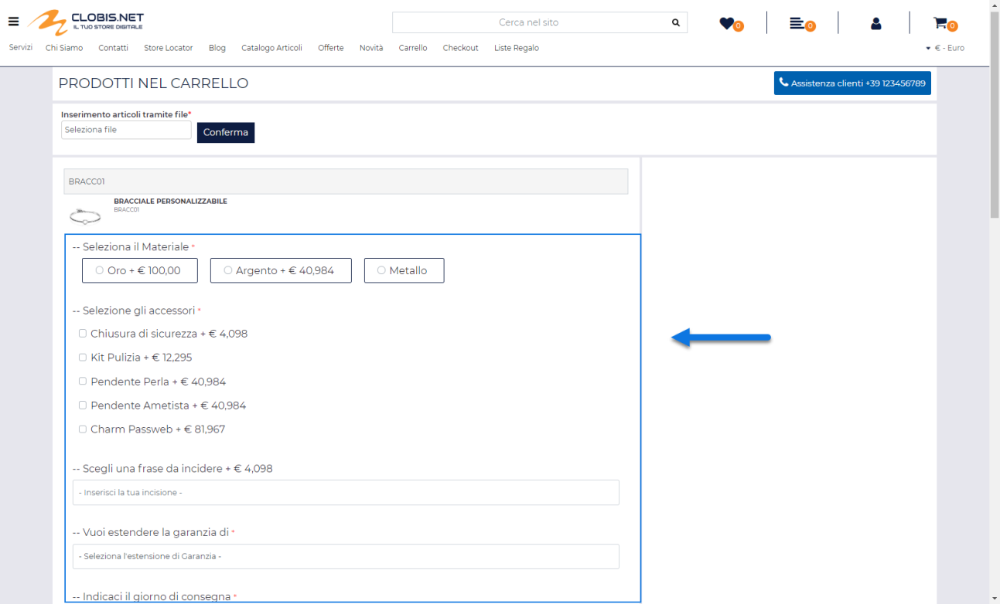

# COMPONENTI E-COMMERCE -- AUTOCOMPLETAMENTO (CARRELLO CUSTOM)

Il Componente " **Autocompletamento**" **può essere utilizzato
unicamente all'interno del componente Ecommerce di primo livello
"Carrello Custom".**

dove consente di inserire un modulo mediante il quale gli utenti avranno
la possibilità di ricercare ed aggiungere nuovi articoli a quelli
attualmente presenti in Carrello operando per questo direttamente dalla
stessa pagina Carrello e senza dover quindi necessariamente passare da
componenti quali il Catalogo Ecommerce, le Offerte / Novità, la Scheda
Prodotto ecc...

Rilasciando il Componente nella posizione desiderata verrà visualizzata
**la sua maschera di gestione e configurazione**

suddivisa in varie sezioni.

All'interno della sezione "**Dati Componente**" sarà possibile inserire
il contenuto e settare i principali parametri di configurazione del
componente.

In particolare, per la tipologia di Componente in questione, sarà
possibile impostare un valore per i seguenti parametri:

- **Nome:** consente di impostare un nome per il Componente che si sta
  editando.

- **Pubblico (selezionato a default):** consente di impostare la
  visibilità del componente lato sito web. Se selezionato il
  corrispondente componente verrà correttamente pubblicato e
  visualizzato all'interno del sito. Nel caso in cui invece tale
  parametro non sia selezionato, il corrispondente componente passerà in
  modalità "Offline", sarà quindi visibile all'interno del Wizard, dove
  potrà essere normalmente gestito, ma non verrà pubblicato e
  visualizzato all'interno del sito.

- **Periodo di Pubblicazione:** consente di associare al Componente in
  oggetto uno specifico periodo di pubblicazione, definendone
  l'effettiva data di pubblicazione e la corrispondente data di
  oscuramento.

> Nel primo dei due campi disponibili occorrerà quindi indicare,
> utilizzando l'apposito calendario, la data di inizio pubblicazione.
> Nel secondo campo andrà invece specificata la data di fine
> pubblicazione.
>
> **ATTENZIONE!** Le date indicate all'interno di questi campi verranno
> considerate solo ed esclusivamente nel caso in cui il precedente
> parametro "Pubblico" sia stato selezionato

- **Segnaposto:** permette di definire il testo che verrà poi inserito
  **come segnaposto** e quindi visualizzato all'interno del campo di
  input utilizzato dagli utenti per ricercare gli articoli da aggiungere
  in carrello

> **ATTENZIONE!** Al click dell'utente sul campo in esame il testo
> indicato scomparirà consentendo quindi all'utente di inserire il
> valore desiderato.

- **Tipo di dato su cui Filtrare:** consente di indicare lo specifico
  campo Mexal o lo specifico Attributo Passweb su cui dovrà essere
  realizzato il filtro di ricerca degli articoli da aggiungere
  direttamente in carrello.

> In particolare selezionando l'opzione **"Campo Articolo"** sarà poi
> possibile decidere di effettuare la ricerca degli articoli da inserire
> in carrello anche sulla base di uno dei campi indicati all'interno del
> successivo parametro **"Campo su cui Filtrare"**.
>
> In questo senso è possibile selezionare uno dei seguenti valori

- **Titolo:** selezionando questo valore, sarà poi possibile ricercare
  gli articoli da inserire direttamente in carrello anche sulla base di
  quello che è il valore per essi inserito all'interno del campo
  "Descrizione" della loro Anagrafica gestionale

> Per i siti Ecommerce collegati a Mexal nel caso di gestione in
> multilingua, dipendentemente dalla lingua di partenza del sito, la
> ricerca verrà effettuata sul valore del corrispondente campo Mexal in
> italiano o in lingua. Ovviamente questo tipo di gestione richiede che
> siano state correttamente impostate in Mexal le descrizioni in lingua
> dei vari articoli e che sia stata stabilita in Passweb una specifica
> corrispondenza tra le lingue del sito e i codici della **"Tabella
> Lingue Estere"** di Mexal (per maggiori informazioni in merito si veda
> anche il capitolo *"Configurazione -- Parametri Paese Lingua e Valuta
> -- Gestione Lingua"* di questo manuale)

- **Descrizione**: selezionando questo valore sarà poi possibile
  ricercare gli articoli da inserire direttamente in carrello anche
  sulla base di quello che è il contenuto per essi inserito all'interno
  del campo "Descrizione" qui di seguito riportato, contenuto questo
  che, peri siti Ecommerce collegati a Mexal, può essere prelevato
  direttamente da Docuvision

> Nel caso in cui il parametro in esame sia stato impostato invece sul
> valore **"Attributo Articolo"** sarà poi possibile decidere di
> effettuare la ricerca degli articoli da inserire in carrello anche
> sulla base di uno degli Attributi Passweb attualmente codificati e
> indicati all'interno del successivo camp **"Attributo su cui
> filtrare"**
>
> **NOTA BENE:** per maggiori informazioni relativamente alla gestione
> degli Attributi Articolo ed al processo di categorizzazione degli
> articoli gestiti all'interno del sito si rimanda alla relativa sezione
> di questo manuale (Catalogo -- Gestione Attributi Articoli).

- **Campi aggiuntivi su cui filtrare:** consente di attivare /
  disattivare ulteriori campi gestionali (oltre a quello indicato in
  corrispondenza dei precedenti parametri) sulla base dei quali dovrà
  poi funzionare il filtro di ricerca degli articoli da aggiungere
  direttamente in carrello.

> Dipendentemente dunque da quanto settato per il parametro in oggetto
> la ricerca degli articoli da aggiungere direttamente in carrello
> potrebbe essere effettuata anche sulla base del Codice Articolo, del
> Codice Alternativo o del Codice Alias
>
> **ATTENZIONE!** Nel momento in cui nessuno dei campi presenti in
> corrispondenza di questo parametro dovesse essere selezionato, la
> ricerca degli articoli da inserire direttamente in carrello verrà
> effettuata esclusivamente sulla base di quanto indicato in
> corrispondenza dei parametri "Tipo di da su cui filtrare" e "Campo /
> Attributo su cui filtrare"

- **Numero minimo di caratteri da digitare:** consente di specificare,
  selezionandolo da un apposito menu a tendina, l'esatto numero di
  caratteri che dovranno necessariamente essere digitati, all'interno
  del relativo campo di input, prima di poter visualizzare l'elenco dei
  possibili articoli da inserire direttamente in carrello.

- **Numero massimo di articoli da mostrare nella lista**: consente di
  impostare il numero massimo di articoli che dovranno essere
  visualizzati nell'elenco dei possibili prodotti da inserire
  direttamente in carrello.

> **Nel caso in cui non venga impostato alcun valore all'interno di
> questo campo verranno mostrati sempre tutti gli articoli che
> soddisfano la ricerca impostata**
>
> Per massimizzare le prestazioni del sito è quindi consigliabile
> visualizzare contemporaneamente un numero ragionevole di articoli

- **Filtro Articoli:** consente di impostare una condizione di
  prefiltraggio mediante la quale poter stabilire quali articoli
  dovranno comparire o meno all'interno del componente.

> Per maggiori informazioni relativamente alla creazione di un filtro
> articoli si veda anche la sezione *"Utenti -- Gruppi Utenti Sito --
> Filtri Utente e Filtri Articolo -- Filtri Articolo"* di questo
> manuale.

- **Colore dell'animazione sui campi obbligatori:** consente di
  specificare il colore da utilizzare nell'animazione che verrà avviata
  nel momento in cui si tenti di inserire in carrello un articolo
  strutturato non completamente configurato

- **Set Opzioni -- Riferimento Articoli Strutturati**: consente di
  specificare se il componente "Set Opzioni" visualizzato nel momento in
  cui l'articolo da aggiungere in carrello dovesse essere un articolo
  strutturato con associato un Set di Opzioni, dovrà essere inserito e
  gestito sul padre di struttura o su eventuali figli e,
  conseguentemente, se poter personalizzare in maniera differente ogni
  singolo articolo figlio o se utilizzare invece le stesse
  personalizzazioni impostate sul padre anche per tutti i figli
  eventualmente acquistati (opzione questa che richiede l'utilizzo del
  configuratore tabellare)

> Nello specifico sarà quindi possibile selezionare una delle seguenti
> opzioni:

- **Figlio**: in questo caso il componente "Set Opzioni" verrà gestito
  sui figli di struttura. Prima di poterlo visualizzare sarà quindi
  necessario completare la configurazione di un determinato articolo
  figlio.

> **ATTENZIONE!** L'opzione in esame dovrà essere selezionata nel
> momento in cui l'esigenza dovesse essere quella di personalizzare in
> maniera diversa ogni singolo articolo figlio e richiede, ovviamente,
> l'associazione del set opzioni direttamente sui figli di struttura
>
> In queste condizioni occorre inoltre ricordare che:

- nel momento in cui, per la struttura in esame, dovesse essere gestito
  il configuratore tabellare il componente "Set Opzioni" verrà inserito
  automaticamente nelle celle della tabella in maniera tale da poter
  avere a disposizione le diverse opzioni di personalizzazione per ogni
  singolo figlio

- considerando che il componente "Set Opzioni" avrà come riferimento il
  singolo articolo figlio, eventuali maggiorazioni di prezzo dovute alle
  personalizzazioni impostate verranno applicate direttamente sul prezzo
  di partenza del singolo articolo figlio. Ogni articolo figlio aggiunto
  in carrello potrà quindi avere una specifica personalizzazione ed un
  suo specifico prezzo dovuto, appunto, alla personalizzazione
  effettuata

  - **Padre**: in questo caso il componente "Set Opzioni" verrà gestito
    direttamente sul padre di struttura e, in conseguenza di ciò, verrà
    visualizzato immediatamente senza dover per forza di cose impostare
    prima di tutto una determinata configurazione di prodotto finito.

> **ATTENZIONE!** L'opzione in esame dovrà essere selezionata solo nel
> momento in cui l'esigenza dovesse essere quella di riportare in
> maniera automatica le stesse esatte personalizzazioni fatte sul padre
> di struttura anche sui figli eventualmente acquistati e richiede,
> ovviamente, l'associazione del set opzioni sia sul padre di struttura
> che sui relativi figli
>
> In queste condizioni occorre inoltre ricordare che:

- nel momento in cui, per la struttura in esame, dovesse essere gestito
  il configuratore tabellare il componente "Set Opzioni" verrà
  visualizzato al di fuori della tabella del configuratore

- considerando che il componente "Set di Opzioni" avrà come riferimento
  l'articolo padre di struttura, eventuali maggiorazioni di prezzo,
  dovute alla personalizzazioni impostate, verranno applicate sul prezzo
  di partenza dell'articolo padre. Ogni articolo figlio aggiunto in
  carrello avrà quindi la stessa personalizzazione impostata sul padre e
  il suo stesso prezzo

<!-- -->

- **Posizionamento dei Campi:** consente di posizionare gli elementi
  principali del componente secondo uno schema prestabilito.

> Nello specifico, gli elementi soggetti al tipo di posizionamento
> impostato mediante questo parametro saranno:

- Il campo di input per l'inserimento della quantità articolo da
  aggiungere in carrello

- Il configuratore (visualizzato solo per articoli strutturati)

- Il pulsante di aggiunta in carrello

> E' possibile selezionare uno dei seguenti valori:

- Affiancati a destra

- Affiancati a sinistra

- Affiancati e giustificati

- Affiancati e opposti

- Centrati e affiancati

- Centrati e Incolonnati

- Incolonnati a destra

- Incolonnati a sinistra

- Custom

> **ATTENZIONE!** Nel caso in cui si decidesse di utilizzare uno dei
> preset presenti in elenco poi il posizionamento degli elementi sarà
> esattamente quello indicato e non potrà essere modificato in alcun
> modo.
>
> **L'opzione Custom consente invece di non applicare nessun preset
> particolare.** **In queste condizioni dunque il posizionamento dei
> vari elementi potrà essere variato liberamente agendo sulle corrette
> proprietà CSS mediante lo style editor di Passweb e/o mediante i
> relativi strumenti di editing avanzato.**

- **Ordinamento di visualizzazione dei campi:** visualizzato solo nel
  caso in cui il precedente parametro non sia stato impostato sul valore
  Custom.

> Consente di definire l'ordine di visualizzazione degli elementi
> principali del componente in esame, permettendo dunque, già in fase di
> configurazione del componente stesso di decidere quale elemento dovrà
> essere visualizzato prima e quale dopo.
>
> **ATTENZIONE!** Anche in questo caso l'opzione Custom, non attiva
> nessun tipo di preset per cui l'ordine di visualizzazione dei
> rispettivi elementi potrà essere variato liberamente agendo sulle
> corrette proprietà CSS mediante lo style editor di Passweb e/o
> mediante i relativi strumenti di editing avanzato.

Il pulsante "**Salva**" nella parte alta della maschera consentirà di
salvare le modifiche apportate al Componente in oggetto.

**NOTA BENE:** per maggiori informazioni relativamente alle sezioni
"**Avanzate e Animazioni**", "**Distribuzione**" e "**Protezione**",
presenti nella maschera di gestione e configurazione di tutti i
componenti Passweb, si veda anche il capitolo " Varianti Responsive --
Configurazione Componenti -- Caratteristiche Generali " di questo
manuale.

Una volta inserito e configurato il componente, nel Carrello Custom
verrà visualizzata una riga aggiuntiva contenente un campo di input che
l'utente potrà utilizzare per ricercare gli articoli da inserire
direttamente in carrello.

Tale Riga verrà posizionata come prima riga del carrello, come ultima
riga o appena prima delle promozioni dipendentemente da quanto impostato
per il parametro "**Posizione Campo Autocompletamento**" presente nella
maschera di configurazione del Carrello Custom

L'utilizzo del modulo di ricerca ed inserimento rapido è estremamente
semplice.

Inserendo un numero di caratteri pari a quello indicato all'interno del
campo "**Numero minimo di caratteri da digitare**, verrà infatti
visualizzato un elenco filtrato di articoli che contengono i caratteri
digitati dall'utente, nel loro codice, nel loro codice alternativo (per
siti collegati a Mexal) o nell'ulteriore campo / attributo indicato
anch'esso in fase di configurazione del componente.

**Nota Bene!** Per i siti collegati ad uno dei gestionali Ho.Re.Ca.
saranno esclusi da questo elenco eventuali trattamenti prenotabili via
web

Nello specifico, i caratteri digitati dall'utente dovranno essere i
caratteri iniziali del codice o del codice alternativo, oppure una
sottostringa dell'ulteriore campo/attributo indicato in fase di
configurazione del componente.

**ATTENZIONE!** Nel caso in cui il sito sia stato impostato per gestire
l'acquisto dei vari articoli "solo se disponibili", all'interno di
questo elenco verranno mostrati, tra gli articoli che soddisfano il
filtro, solo quelli disponibili e quindi effettivamente acquistabili.

Per maggiori informazioni relativamente alle possibili modalità di
acquisto degli articoli presenti in catalogo, in relazione alla loro
attuale disponibilità all'interno del database di Passweb, si veda anche
la sezione "*Catalogo -- Configurazione Parametri Catalogo -- Catalogo
Mexal / Ho.Re.Ca. - Disponibilità*" di questo manuale

Allo stesso modo, e per le stesse ragioni, l'elenco dei possibili
articoli da aggiungere in carrello non conterrà neppure quegli articoli
per i quali è stata attivata la funzionalità di "Prezzo a Richiesta".

Il template utilizzato per la visualizzazione dei risultati può essere
personalizzato sia graficamente che a livello di contenuti. Per maggiori
informazioni in questo senso si rimanda al successivo capitolo di questo
manuale

Una volta selezionato uno degli articoli presenti in elenco, verrà poi
visualizzato un'ulteriore campo di input mediante il quale poter
impostare la quantità con cui quello specifico articolo dovrà essere
inserito in carrello oltre, ovviamente, al relativo pulsante di
aggiunta.

Premendo quindi il pulsante **"Aggiungi"** verranno avviati tutti i
controlli relativi ad eventuali quantità massime o minime effettivamente
acquistabili per quello specifico articolo, verrà aggiunta in carrello
una nuova riga, verranno aggiornati totali e verranno anche applicate
eventuali promozioni che soddisfino le condizioni attuali del carrello.

**ATTENZIONE!** Per ogni articolo inserito mediante il modulo in oggetto
verrà sempre e comunque creata una nuova riga articolo indipendentemente
dal fatto che l'articolo stesso fosse già presente o meno in Carrello ed
indipendentemente anche da quanto specificato per il campo "Gestione
Articoli in Carrello" presente alla pagina "Catalogo -- Configurazione
Parametri Catalogo" del Wizard

**Nel caso in cui l'articolo selezionato sia gestito a taglie/colori**
verrà sempre visualizzata, per il pulsante di Aggiunta in Carrello, la
grafica Estesa con la possibilità quindi di indicare immediatamente la
quantità di ogni singola taglia / colore da inserire in carrello (se
presente verrà mostrato anche il Colore o l'Immagine Background
associata alla specifica taglia / colore)

**ATTENZIONE!** Nel caso in cui il sito sia stato impostato per gestire
l'acquisto dei vari articoli "solo se disponibili" verranno visualizzate
in questa fase solo ed esclusivamente le taglie/colori effettivamente
disponibili e quindi acquistabili

**Nel momento in cui l'articolo selezionato dovesse essere, invece, un
padre di struttura** verrà visualizzato, per prima cosa, il
configuratore, in maniera tale da consentire all'utente di selezionare
le diverse possibili opzioni indicando quindi l'esatto prodotto finito
che dovrà essere inserire in carello

La modalità di visualizzazione del configuratore dipenderà, anche
all'interno del componente di "Autocompletamento", da come è stato
impostato il parametro "**Modalità di Visualizzazione**" in fase di
configurazione della struttura all'interno del Wizard.

Nel caso in cui per la struttura in esame sia stata impostata una
modalità di visualizzazione lineare una volta selezionata una delle
opzioni disponibili per tutti i campi del configuratore (e indicata
quindi una specifica configurazione di prodotto finito) verrà
visualizzato il campo relativo alle quantità con il pulsante per
aggiungere l'articolo in carrello.

Nel caso in cui per la struttura in esame sia stata impostata invece una
visualizzazione tabellare (Tabella Esplosa, Tabella Esplosa Divisa o
Tabella Matrice) questa stessa visualizzazione verrà riproposta, per il
configuratore, anche all'interno del componente di Autocompletamento
**dove però all'interno delle varie celle verrà visualizzato sempre e
soltanto il campo di input necessario per indicare la quantità da
aggiungere in carrello** **più eventuali set di opzioni**

**Infine, nel momento in cui l'articolo selezionato dovesse essere un
prodotto personalizzabile**, verranno visualizzate, per prima cosa,
tutte le opzioni definite per il Set associato all'articolo stesso

Una volta effettuate le personalizzazioni richieste il pulsante
"**Aggiungi**" permetterà di inserire l'articolo in carrello.

