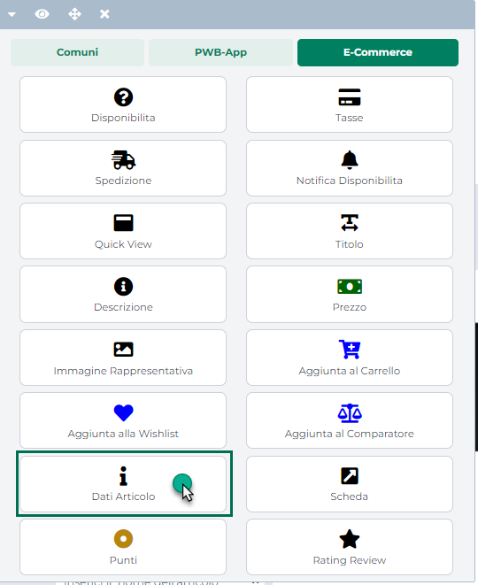
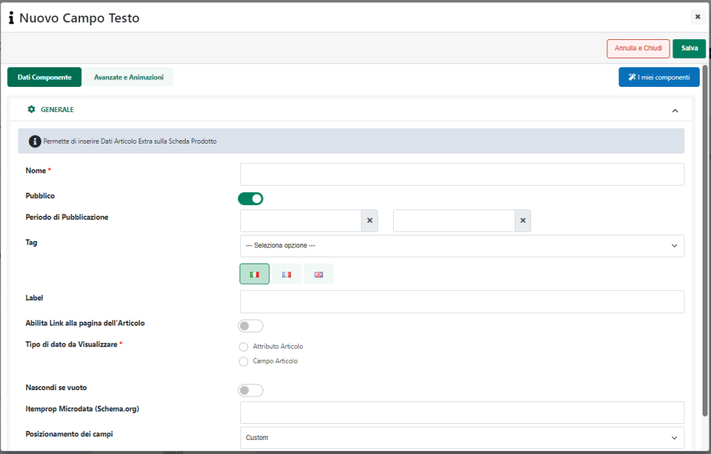
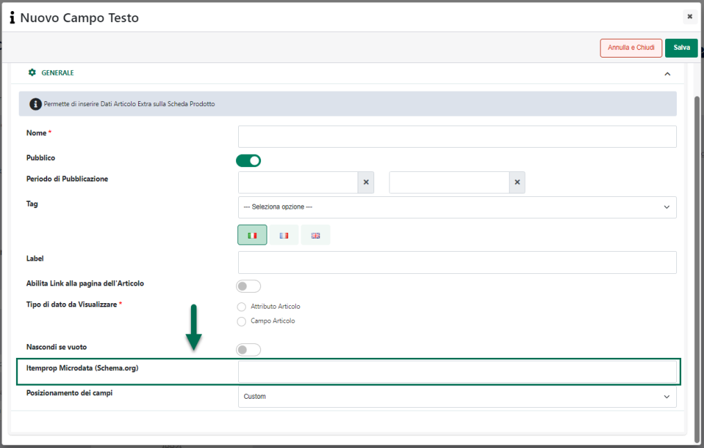

# COMPONENTI E-COMMERCE -- DATI ARTICOLO

Attraverso il Componente **"Dati Articolo"**

{width="2.5340277777777778in"
height="3.1041666666666665in"}

è possibile inserire all'interno del corrispondente componente Ecommerce
di primo livello diversi tipi di informazioni, informazioni queste che
potranno essere prelevate direttamente dal gestionale (campi
dell'Anagrafica Articoli Mexal/Ho.Re.Ca. e/o Attributi articolo di tipo
Mexal) oppure editate direttamente all'interno di Passweb (Descrizione
HTML e/o Attributi Articolo di tipo Passweb).

**A differenza dunque dei componenti fino ad ora esaminati, il
Componente "Dati Articolo" non corrisponde solo ed esclusivamente ad uno
specifico campo del gestionale, ma starà all'utente, in fase di
configurazione del Componente stesso, decidere a quale campo
Mexal/Ho.Re.Ca. o a quale Attributo Articolo farlo corrispondere.**

Rilasciando infatti il Componente nella posizione desiderata verrà
visualizzata **la sua maschera di gestione e configurazione**

{width="4.607638888888889in"
height="2.9506944444444443in"}

suddivisa in varie sezioni.

All'interno della sezione "**Dati Componente**" sarà possibile inserire
il contenuto e settare i principali parametri di configurazione del
componente.

In particolare, per la tipologia di Componente in questione, sarà
possibile impostare un valore per i seguenti parametri:

- **Nome:** consente di definire un nome per il Componente che si sta
  editando

- **Pubblico (selezionato a default):** consente di impostare la
  visibilità del componente lato sito web. Se selezionato il
  corrispondente componente verrà correttamente pubblicato e
  visualizzato all'interno del sito. Nel caso in cui invece tale
  parametro non sia selezionato, il corrispondente componente passerà in
  modalità "Offline", sarà quindi visibile all'interno del Wizard, dove
  potrà essere normalmente gestito, ma non verrà pubblicato e
  visualizzato all'interno del sito.

- **Periodo di Pubblicazione:** consente di associare al Componente in
  oggetto uno specifico periodo di pubblicazione, definendone
  l'effettiva data di pubblicazione e la corrispondente data di
  oscuramento.

> Nel primo dei due campi disponibili occorrerà quindi indicare,
> utilizzando l'apposito calendario, la data di inizio pubblicazione.
> Nel secondo campo andrà invece specificata la data di fine
> pubblicazione.
>
> **ATTENZIONE!** Le date indicate all'interno di questi campi verranno
> considerate solo ed esclusivamente nel caso in cui il precedente
> parametro "Pubblico" sia stato selezionato

- **Tag:** consente di selezionare lo specifico Tag che verrà poi
  utilizzato per generare il markup HTML del relativo componente.

> **A default viene utilizzato un Tag "div"**. Grazie a questo parametro
> è invece possibile decidere di utilizzare uno qualsiasi dei Tag h1,
> h2, h3, h4, h5, h6

- **Label:** consente di impostare una label che verrà poi visualizzata
  all'interno del sito in corrispondenza del componente in oggetto

- **Abilita link alla pagina dell'Articolo:** se selezionato consente di
  attivare sul componente un link di collegamento alla relativa pagina
  prodotto. Per ovvie ragioni questo parametro non sarà presente nel
  caso in cui il componente in oggetto sia inserito all'interno della
  scheda prodotto

- **Tipo di dato da Visualizzare:** consente di decidere se il
  componente Dati Articolo dovrà corrispondere ad un campo
  dell'Anagrafica Articoli del gestionale (opzione **Campo Articolo**) ,
  oppure a uno specifico Attributo Articolo (opzione **Attributo
  Articolo)**

> Per maggiori informazioni relativamente ai diversi possibili tipi di
> dato che si possono visualizzare mediante il componente in oggetto si
> veda anche quanto indicato nel successivo capitolo di questo manuale
> ("*Tipi di dato da visualizzare*")

- **Nascondi se vuoto**: consente, se selezionato, di non visualizzare
  il componente in esame nel momento in cui dovesse essere privo di
  contenuti.

- **Itemprop Microdata (Schema.org):** consente di indicare il nome
  della proprietà (**itemprop**) che dovrà essere utilizzata per
  integrare i Microdati del prodotto, aggiungendo quindi ulteriori
  informazioni rispetto a quelle standard che possono invece essere
  attivate mediante gli appositi parametri presenti all'interno della
  sezione "**Rich Snippets**" alla pagina "*Sito -- Preferenze --
  Integrazioni*" del Wizard

> Supponendo quindi di voler utilizzare il componente "Dati articolo"
> per mappare, ad esempio, la marca del prodotto e di voler gestire
> questa informazione anche a livello di Microdati, sarà necessario
> inserire all'interno del campo in esame la proprietà "**brand**".

{width="4.607638888888889in"
height="2.938888888888889in"}

> In queste condizioni il valore mappato dal componente verrà racchiuso
> all'interno di un frammento di codice del tipo di quello qui di
> seguito indicato
>
> **\<** span **itemprop=\"brand\"** \>SAMSUNG\< /span \>
>
> utile per indicare agli spider dei motori di ricerca che "Samsung",
> nel caso specifico, è esattamente la marca del prodotto in esame.
>
> **ATTENZIONE!** La proprietà indicata verrà inserita nel markup del
> componente "Dati Articolo" solo nel caso in cui questo sia stato
> inserito all\'interno di un componente "Catalogo" o "Scheda Prodotto"
> e solo nel caso in cui sia stato anche selezionato il parametro
> **"Schema Product"** presente all'interno della sezione "Rich Snippet"
> alla pagina "*Sito -- Preferenze -- Integrazioni*" del Wizard
>
> Per maggiori informazioni in merito ai Rich Snippets si veda anche
> quanto indicato all'interno del capitolo "*Sito -- Preferenze --
> Integrazioni -- Rich Snippets*" di questo manuale. Per quel che
> riguarda invece le proprietà (itemprop) gestite da Schema.org in
> merito a quelli che possono essere i prodotti di un sito Ecommerce si
> faccia riferimento a quanto indicato al seguente link
> <http://schema.org/Product>

- **Posizionamento dei Campi:** consente di posizionare gli elementi
  principali del componente secondo uno schema prestabilito.

> Nello specifico, gli elementi soggetti al tipo di posizionamento
> impostato mediante questo parametro saranno:

- La label del campo

- Il testo del campo

> È possibile selezionare uno dei seguenti valori:

- Affiancati a destra

- Affiancati a sinistra

- Affiancati e giustificati

- Affiancati e opposti

- Centrati e affiancati

- Centrati e Incolonnati

- Incolonnati a destra

- Incolonnati a sinistra

- Custom

> **ATTENZIONE!** Nel caso in cui si decidesse di utilizzare uno dei
> preset presenti in elenco poi il posizionamento degli elementi sarà
> esattamente quello indicato e non potrà essere modificato in alcun
> modo.
>
> **L'opzione Custom consente invece di non applicare nessun preset
> particolare.** **In queste condizioni dunque il posizionamento dei
> vari elementi potrà essere variato liberamente agendo sulle corrette
> proprietà CSS mediante lo style editor di Passweb e/o mediante i
> relativi strumenti di editing avanzato.**

- **Ordinamento di visualizzazione dei campi:** visualizzato solo nel
  caso in cui il precedente parametro non sia stato impostato sul valore
  Custom.

> Consente di definire l'ordine di visualizzazione degli elementi
> principali del componente in esame, permettendo dunque, già in fase di
> configurazione del componente stesso di decidere quale elemento dovrà
> essere visualizzato prima e quale dopo.
>
> **ATTENZIONE!** Anche in questo caso l'opzione Custom, non attiva
> nessun tipo di preset per cui l'ordine di visualizzazione dei
> rispettivi elementi potrà essere variato liberamente agendo sulle
> corrette proprietà CSS mediante lo style editor di Passweb e/o
> mediante i relativi strumenti di editing avanzato.

Il pulsante "**Salva**" nella parte alta della maschera consentirà di
salvare le modifiche apportate al Componente in oggetto.

**NOTA BENE:** per maggiori informazioni relativamente alle sezioni
"**Avanzate e Animazioni**" e "**Protezione**", presenti nella maschera
di gestione e configurazione di tutti i componenti Passweb, si veda
anche il capitolo "Varianti Responsive -- Configurazione Componenti --
Caratteristiche Generali" di questo manuale.

