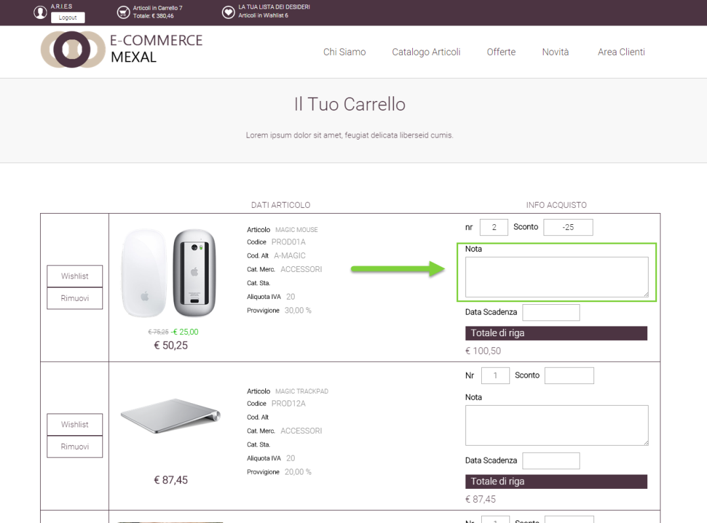
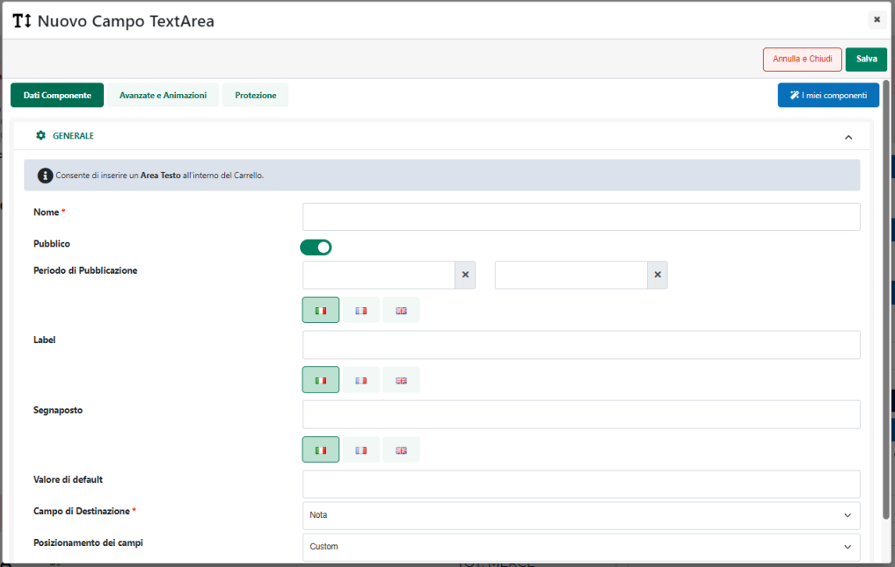

# COMPONENTI PER IL FORM -- CAMPO AREA DI TESTO

Il Componente per il form **"Campo Area di Testo"**

{width="2.5395833333333333in"
height="2.5458333333333334in"}

può essere inserito all'interno dei seguenti componenti Ecommerce di
primo livello:

- **Carrello Custom**

- **Reso Custom (RMA)**

- **Wishlist Custom**

Permette di gestire un campo di input mediante il quale poter inserire
note di riga per ogni singolo articolo.

{width="4.889583333333333in"
height="3.6256944444444446in"}

**ATTENZIONE!** Nel caso di articoli "Campionario / Box" (configurabili
e non) il campo in esame verrà visualizzato solo ed esclusivamente sul
"padre" e non sui singoli componenti del Campionario / Box

Rilasciando il Componente nella posizione desiderata verrà visualizzata
**la sua maschera di gestione e configurazione**

{width="4.6194444444444445in"
height="2.938888888888889in"}

suddivisa in varie sezioni.

All'interno della sezione "**Dati Componente**" è possibile settare i
principali parametri di configurazione del componente stesso.

In particolare, per la tipologia di Componente in questione, è possibile
impostare un valore per i seguenti parametri:

- **Nome:** consente di impostare un nome per il Componente che si sta
  editando.

- **Pubblico (selezionato a default):** consente di impostare la
  visibilità del componente lato sito web. Se selezionato il
  corrispondente componente verrà correttamente pubblicato e
  visualizzato all'interno del sito. Nel caso in cui invece tale
  parametro non sia selezionato, il corrispondente componente passerà in
  modalità "Offline", sarà quindi visibile all'interno del Wizard, dove
  potrà essere normalmente gestito, ma non verrà pubblicato e
  visualizzato all'interno del sito.

- **Periodo di Pubblicazione:** consente di associare al Componente in
  oggetto uno specifico periodo di pubblicazione, definendone
  l'effettiva data di pubblicazione e la corrispondente data di
  oscuramento.

> Nel primo dei due campi disponibili occorrerà quindi indicare,
> utilizzando l'apposito calendario, la data di inizio pubblicazione.
> Nel secondo campo andrà invece specificata la data di fine
> pubblicazione.
>
> **ATTENZIONE!** Le date indicate all'interno di questi campi verranno
> considerate solo ed esclusivamente nel caso in cui il precedente
> parametro "Pubblico" sia stato selezionato

- **Label:** consente di impostare un'etichetta che verrà visualizzata a
  fianco del corrispondente campo di input

- **Segnaposto:** permette di definire un testo da utilizzare **come
  segnaposto** da poter visualizzare all'interno del campo di input.

> **ATTENZIONE!** Al click dell'utente sul campo in esame il testo
> indicato scomparirà consentendo quindi all'utente di inserire il
> valore desiderato. Quanto indicato all'interno di questo campo non
> verrà quindi considerato alla conferma del form.

- **Valore di default:** consente di indicare un testo che verrà
  utilizzato (e visualizzato) **come valore di default** per il campo in
  esame.

> **ATTENZIONE!** A differenza di quanto indicato per il precedente
> parametro "Segnaposto", il testo inserito all'interno del campo
> "Valore di default" **non scomparirà** in automatico al click
> dell'utente sul campo di input ma, al contrario, verrà considerato
> come se fosse un vero e proprio valore indicato dall\'utente stesso in
> fase di compilazione.

- **Campo di destinazione:** consente di impostare la destinazione e,
  conseguentemente, la finalità del relativo campo di input per cui,
  sulla base di quanto precedentemente indicato, l'unico valore
  selezionabile per questo parametro sarà **"Nota"**

<!-- -->

- **Posizionamento dei Campi:** consente di posizionare gli elementi
  principali del componente secondo uno schema prestabilito.

> Nello specifico, gli elementi soggetti al tipo di posizionamento
> impostato mediante questo parametro saranno:

- La label

- Il Controllo (ossia il Campo di input)

- Il Messaggio di errore

> E' possibile selezionare uno dei seguenti valori:

- Affiancati a destra

- Affiancati a sinistra

- Affiancati e giustificati

- Affiancati e opposti

- Centrati e affiancati

- Centrati e Incolonnati

- Incolonnati a destra

- Incolonnati a sinistra

- Custom

> **ATTENZIONE!** Nel caso in cui si decidesse di utilizzare uno dei
> preset presenti in elenco poi il posizionamento degli elementi sarà
> esattamente quello indicato e non potrà essere modificato in alcun
> modo.
>
> **L'opzione Custom consente invece di non applicare nessun preset
> particolare.** **In queste condizioni dunque il posizionamento dei
> vari elementi potrà essere variato liberamente agendo sulle corrette
> proprietà CSS mediante lo style editor di Passweb e/o mediante i
> relativi strumenti di editing avanzato.**

- **Ordinamento di visualizzazione dei campi:** visualizzato solo nel
  caso in cui il precedente parametro non sia stato impostato sul valore
  Custom.

> Consente di definire l'ordine di visualizzazione degli elementi
> principali del componente in esame, permettendo dunque, già in fase di
> configurazione del componente stesso di decidere quale elemento dovrà
> essere visualizzato prima e quale dopo.
>
> **ATTENZIONE!** Anche in questo caso l'opzione Custom, non attiva
> nessun tipo di preset per cui l'ordine di visualizzazione dei
> rispettivi elementi potrà essere variato liberamente agendo sulle
> corrette proprietà CSS mediante lo style editor di Passweb e/o
> mediante i relativi strumenti di editing avanzato.

Il pulsante "**Salva**" nella parte alta della maschera consentirà di
salvare le modifiche apportate al Componente in oggetto.

**ATTENZIONE!** **Nel caso in cui si desideri dare la possibilità di
inserire delle note di riga in carrello ai soli Agenti** sarà
necessario, per prima cosa, creare un apposito gruppo utenti contenente
i soli Agenti abilitati ad accedere al sito e, successivamente, agire
sui permessi di visibilità (sezione "Protezione") di questo stesso
componente.

**ATTENZIONE!** **Se inserito all'interno di una "Wishlist Custom"** il
componente in oggetto verrà poi visualizzato, sul front end del sito
solo ed esclusivamente nel caso in cui la Wishlist selezionata sia di
tipo "**Lista Regalo**". Per maggiori informazioni relativamente alla
gestione delle "Liste Regalo" si veda anche la sezione " *Varianti Sito
Responsive -- Lista Componenti Ecommerce -- Componente Lista Regalo*" di
questo manuale.

**NOTA BENE:** per maggiori informazioni relativamente alle sezioni
"Avanzate e Animazioni" e "Protezione", presenti nella maschera di
gestione e configurazione di tutti i componenti Passweb, si veda anche
il capitolo " Varianti Responsive -- Configurazione Componenti --
Caratteristiche Generali " di questo manuale.

