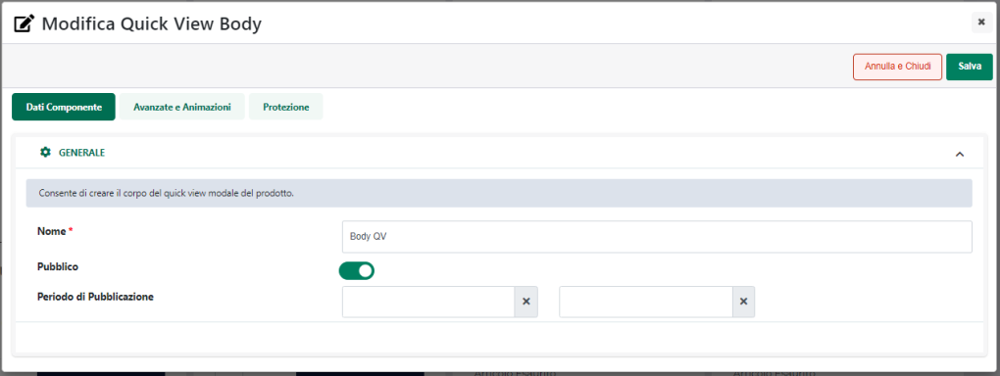

# COMPONENTI E-COMMERCE -- QUICK VIEW HEADER / BODY / FOOTER

I componenti "**Quick View Header**", "**Quick View Body**", "**Quick
View Footer**" possono essere utilizzati solo ed esclusivamente
all'interno del componente "Quick View"

e consentono di suddividere la finestra modale, utilizzata per
visualizzare questa particolare tipologia di componenti, in tre distinte
sezioni:

- **Quick View Header:** consente di inserire all'interno della finestra
  di quick view un contenitore per gestire le informazioni in testata

- **Quick View Body:** consente di inserire all'interno della finestra
  di quick view un contenitore per gestire le informazioni di corpo

- **Quick View Footer:** consente di inserire all'interno della finestra
  di quick view un contenitore per gestire le informazioni da collocare
  all'interno del piede

**ATTENZIONE!** Almeno uno tra i tre componenti sopra indicati dovrà
essere necessariamente inserito nella finestra di quick view

**E' infatti all'interno dei componenti "Quick View Header" , "Quick
View Body", "Quick View Footer" che andranno poi inserite le
informazioni Ecommerce (Titolo, Descrizione, Immagine ecc ...)
necessarie per costruire la scheda di dettaglio del relativo articolo**

Per maggiori informazioni relativamente al componente "Quick View" si
veda anche la corrispondente sezione di questo manuale "*Varianti
Responsive Lista Componenti Ecommerce -- Componente Quick View*"

Rilasciando uno di questi Componenti nella posizione desiderata
all'interno della pagina, verrà visualizzata **la sua maschera di
gestione e configurazione**

suddivisa in varie sezioni.

All'interno della sezione "**Dati Componente**" sarà possibile inserire
il contenuto e settare i principali parametri di configurazione del
componente.

In particolare, per la tipologia di Componente in questione, sarà
possibile impostare un valore per i seguenti parametri:

**Nome:** consente di definire un nome per il Componente che si sta
editando

**Pubblico (selezionato a default):** consente di impostare la
visibilità del componente lato sito web. Se selezionato il
corrispondente componente verrà correttamente pubblicato e visualizzato
all'interno del sito. Nel caso in cui invece tale parametro non sia
selezionato, il corrispondente componente passerà in modalità "Offline",
sarà quindi visibile all'interno del Wizard, dove potrà essere
normalmente gestito, ma non verrà pubblicato e visualizzato all'interno
del sito

**Periodo di Pubblicazione:** consente di associare al Componente in
oggetto uno specifico periodo di pubblicazione, definendone l'effettiva
data di pubblicazione e la corrispondente data di oscuramento.

Nel primo dei due campi disponibili occorrerà quindi indicare,
utilizzando l'apposito calendario, la data di inizio pubblicazione. Nel
secondo campo andrà invece specificata la data di fine pubblicazione.

**ATTENZIONE!** Le date indicate all'interno di questi campi verranno
considerate solo ed esclusivamente nel caso in cui il precedente
parametro "Pubblico" sia stato selezionato

Ciascuno di questi componenti altro non è quindi se non un semplice
contenitore vuoto all'interno del quale, come detto, andranno poi
inserite le diverse informazioni sull'articolo.

Una volta inserito quindi uno di questi componenti all'interno della
finestra di quick view per poterlo poi personalizzare sarà necessario,
attivare la modalità di gestione dei componenti, portarsi sul Componente
in esame e, alla comparsa del R.O.C. cliccare sull'icona "**Accedi ai
componenti interni"**

**Per maggiori informazioni relativamente alla gestione dei Componenti
di tipo Contenitore si veda anche il corrispondente capitolo di questo
manuale ("Live Editing per Varianti Responsive -- Componenti --
Componenti di tipo Contenitore")**

In particolare all'interno di questi componenti sarà possibile inserire:

- **Componenti Comuni:** contiene componenti generici che potranno
  essere utilizzati per completare graficamente il componente in esame.
  Per maggiori informazioni relativamente all'utilizzo di questi
  componenti si vedano le corrispondenti sezioni di questo manuale.

- **Componenti E-Commerce:** contiene tutti i componenti E-Commerce,
  ossia quei componenti necessari per abilitare e gestire determinate
  funzionalità (es. "Aggiunta al Carrello") oltre che, ovviamente, per
  poter definire che tipo di informazioni gestionali dovranno essere
  visualizzate per lo specifico articolo.

> **NOTA BENE:** per maggiori informazioni relativamente a come gestire
> i Componenti Ecommerce interni al componente "Scheda Prodotto" si veda
> la corrispondente sezione di questo manuale (Live Editing per Varianti
> Responsive -- Lista Componenti E-Commerce -- Componenti Interni ai
> Componenti Ecommerce).

