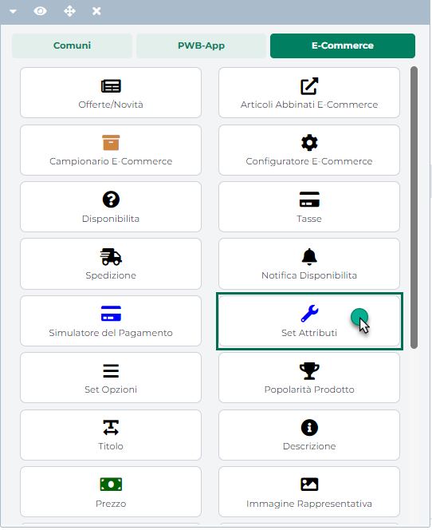
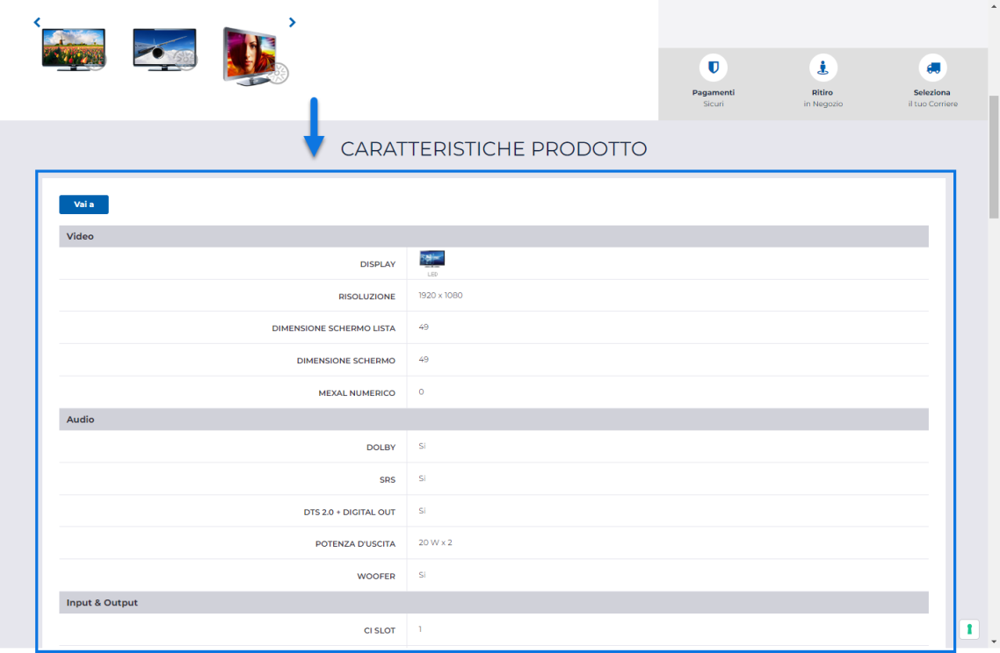
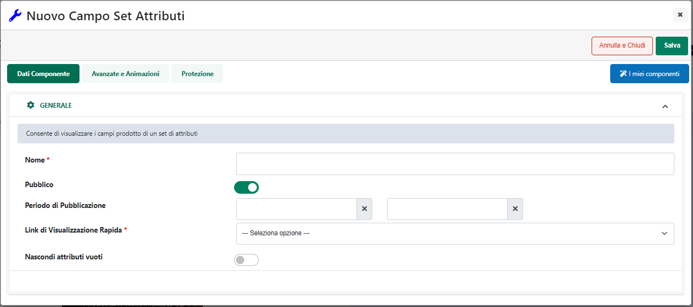
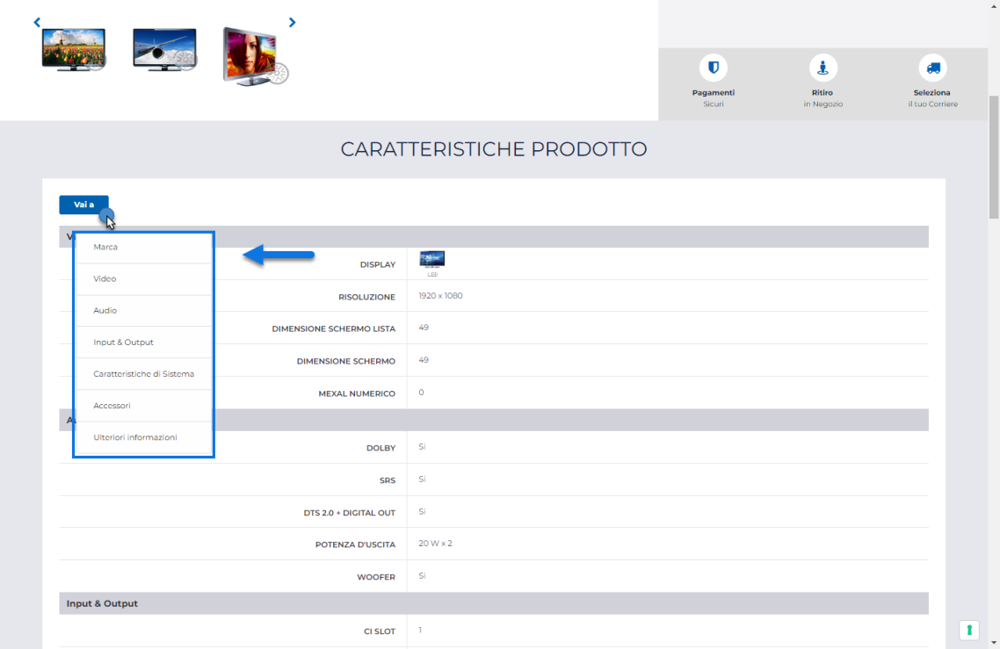
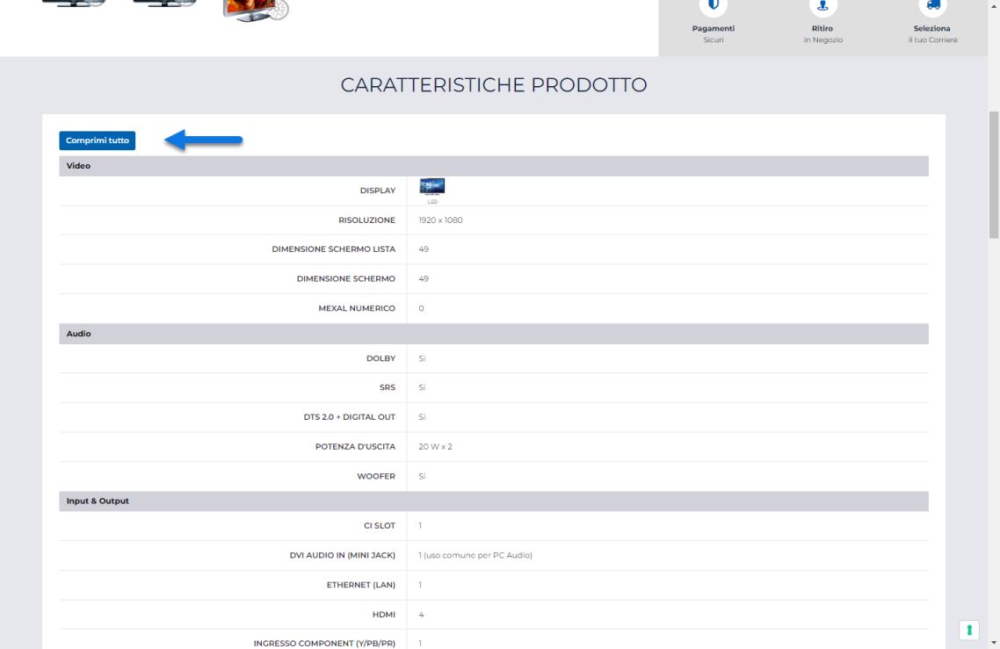
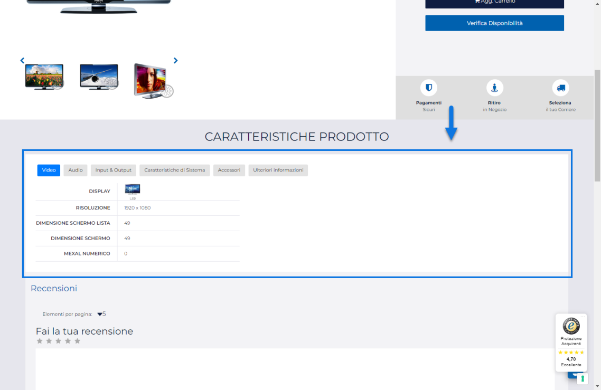
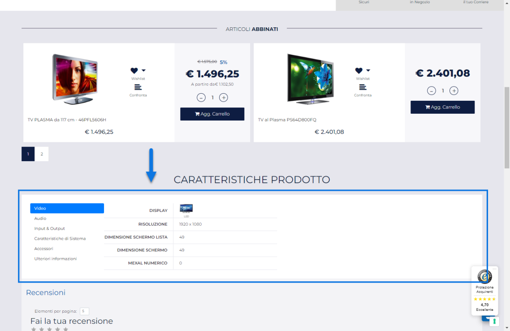

# COMPONENTI E-COMMERCE -- SET ATTIRIBUTI (SCHEDA PRODOTTO E COMPARATORE)

Il Componente **"Set Attributi"**

**può essere inserito unicamente all'interno dei componenti Ecommerce di
primo livello "Scheda Prodotto" e "Comparatore"**.

In particolare grazie a questo componente sarà possibile inserire
all'interno dei suddetti componenti Ecommerce di primo livello, in un
colpo solo, tutti gli Attributi Articolo (siano essi di tipo Mexal o di
tipo Passweb) presenti nel Set associato alla categoria merceologica di
appartenenza dello specifico articolo e configurati in maniera tale da
dover esser visualizzati all'interno di questo componente (parametro
"Visualizza nel componente Set Attributi" del singolo attributo
impostato a SI).

**ATTENZIONE! Nel caso di articoli associati a più categorie
merceologiche verrà considerato il set di attributi relativo alla
categoria merceologica principale, vale a dire quella associata
all'articolo stesso direttamente all'interno del relativo gestionale
Passepartout.**

Tali attributi verranno inoltre raggruppati, all'interno del componente,
sulla base dei Gruppi di Attributi codificati nella corrispondente
sezione del Wizard ed ad associati allo specifico Set.

> **NOTA BENE:** per maggiori informazioni relativamente alla gestione
> degli Attributi Articolo ed al processo di categorizzazione degli
> articoli gestiti all'interno del sito si rimanda alla relativa sezione
> di questo manuale (Catalogo -- Gestione Attributi Articoli).

Per poter visualizzare dunque un certo Attributo Articolo all'interno
della scheda prodotto è possibile procedere in due modi differenti:

1.  Inserire nella Scheda Prodotto il componente Dati Articolo
    precedentemente considerato facendolo poi corrispondere
    all'Attributo Articolo desiderato.

2.  Codificare l'Attributo desiderato in maniera tale da poterlo
    visualizzare all'interno del componente "Set di Attributi"
    (parametro "**Visualizza nel componente Set Attributi**"
    dell'attributo stesso impostato a **SI**) ed inserire poi questo
    componente nella scheda prodotto.

> Ovviamente in queste condizioni nella scheda prodotto verrà
> visualizzato non solo l'attributo desiderato ma tutti quelli
> configurati per essere visualizzati all'interno del relativo Set.

> **NOTA BENE:** per articoli non associati ad alcuna categoria
> merceologica oppure associati ad una categoria merceologica priva di
> Set Attributi, il componente in oggetto risulterà vuoto.

Sulla base di quanto detto dunque, a differenza del componente Dati
Articolo precedentemente analizzato, il componente "Set Attributi" in se
non dovrà corrispondere a uno specifico campo del gestionale o a uno
specifico Attributo Articolo (saranno gli elementi al suo interno a
realizzare questa corrispondenza).

Rilasciando il Componente nella posizione desiderata all'interno della
pagina web, verrà visualizzata **la sua maschera di gestione e
configurazione**

suddivisa in varie sezioni.

All'interno della sezione "**Dati Componente**" sarà possibile inserire
il contenuto e settare i principali parametri di configurazione del
componente.

In particolare, per la tipologia di Componente in questione, sarà
possibile impostare un valore per i seguenti parametri:

**Nome:** consente di specificare il nome del Componente che si sta
realizzando

**Pubblico:** consente di impostare la visibilità lato sito web del
componente che si sta realizzando.

**Periodo di Pubblicazione:** consente di associare al Componente in
oggetto uno specifico periodo di pubblicazione, definendone l'effettiva
data di pubblicazione e la corrispondente data di oscuramento.

Nel primo dei due campi disponibili occorrerà quindi indicare,
utilizzando l'apposito calendario, la data di inizio pubblicazione. Nel
secondo campo andrà invece specificata la data di fine pubblicazione.

> **ATTENZIONE!** Le date indicate all'interno di questi campi verranno
> considerate solo ed esclusivamente nel caso in cui il precedente
> parametro "Pubblico" sia stato selezionato

**Link di visualizzazione rapida (solo nel caso in cui il Set Attributi
sia inserito all'interno di una scheda prodotto):** consente di
abilitare o meno all'interno del componente alcuni controlli per
facilitarne la visualizzazione e la navigazione. E' possibile
selezionare una delle seguenti opzioni:

- **Vai a:** selezionando questa opzione, nella parte alta del
  componente verrà visualizzato un pulsante **"Vai a"**,
  personalizzabile all'interno della sezione "Gestione Testi/Messaggi
  del Sito" agendo sulla voce "Set Attributi".

> Cliccando su di esso verrà visualizzata una finestra contenente
> l'elenco dei gruppi facenti parte del Set di Attributi in oggetto

> Cliccando sul nome di uno dei gruppi presenti all'interno di questa
> finestra verrà eseguito lo scrolling automatico della pagina fino al
> raggiungimento del gruppo selezionato

- **Comprimi:** selezionando questa opzione, nella parte alta del
  componente verrà visualizzata un pulsante **"Comprimi tutto"**,
  personalizzabile all'interno della sezione "Gestione Testi/Messaggi
  del Sito" agendo sulla voce "Set Attributi".

> Cliccando su questo pulsante tutti i Gruppi di Attributi presenti
> all'interno del componente in oggetto si comprimeranno automaticamente
> e l'etichetta assumerà il valore **"Espandi tutto"** in maniera tale
> da consentire all'utente di scatenare la procedura inversa e riaprire
> quindi tutti i Gruppi di Attributi

- **Vai a & Comprimi:** selezionando questa opzione , nella parte alta
  del componente verranno visualizzati entrambi i pulsanti
  precedentemente analizzati con le relative funzionalità.

- **Tabs Orizzontale :** selezionando questa opzione i vari gruppi di
  attributi verranno organizzati su Tabs disposti orizzontalmente

- **Tabs Verticali:** selezionando questa opzione i vari gruppi di
  attributi verranno organizzati su Tabs disposti in verticale

> **ATTENZIONE!** Nel momento in cui nel Set di attributi dovessero
> essere presenti, oltre a determinati Gruppi, anche degli Attributi
> singoli (non appartenenti cioè a nessun Gruppo in maniera specifica)
> questi verranno inseriti (tanto nella visualizzazione con Tabs
> Orizzontali quanto in quella con Tabs Verticali) all'interno di un
> Gruppo fittizio la cui label potrà essere personalizzata dalla sezione
> "**Testi / Messaggi del Sito**" agendo sul campo "**Gruppo Generico**"
> presente, ovviamente, nella maschera di configurazione dei testi
> relativi al componente "Set Attributi"

**ATTENZIONE!** Nel caso in cui il set attributi dovesse essere inserito
all'interno del componente "Comparatore", il parametro di configurazione
"Link di visualizzazione rapida" non verrà visualizzato per cui, in
queste condizioni, i dati presenti all'interno del set attributi
verranno visualizzati sempre in una semplice tabella e non sarà
possibile interagire con essi in alcun modo.

**Nascondi attributi vuoti:** consente se selezionato di non
visualizzare all'interno del set quegli attributi che non risultano
essere valorizzati.

**ATTENZIONE!** Il parametro "Nascondi attributi vuoti" ha effetto solo
nel caso in cui il componente "Set Attributi" non sia inserito
all'interno del componente "Comparatore". In questo caso infatti
verranno visualizzati sempre tutti gli attributi presenti all'interno
del set indipendentemente dal fatto che siano stati valorizzati o meno.

**NOTA BENE:** per maggiori informazioni relativamente alle sezioni
"**Avanzate e Animazioni"** e "**Protezione**", presenti nella maschera
di gestione e configurazione di tutti i componenti Passweb, si veda
anche il capitolo " Varianti Responsive -- Configurazione Componenti --
Caratteristiche Generali " di questo manuale.

