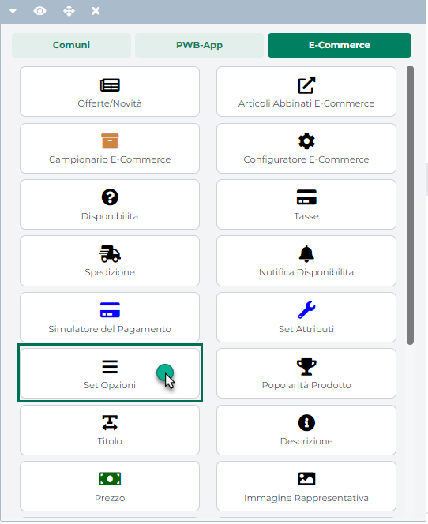
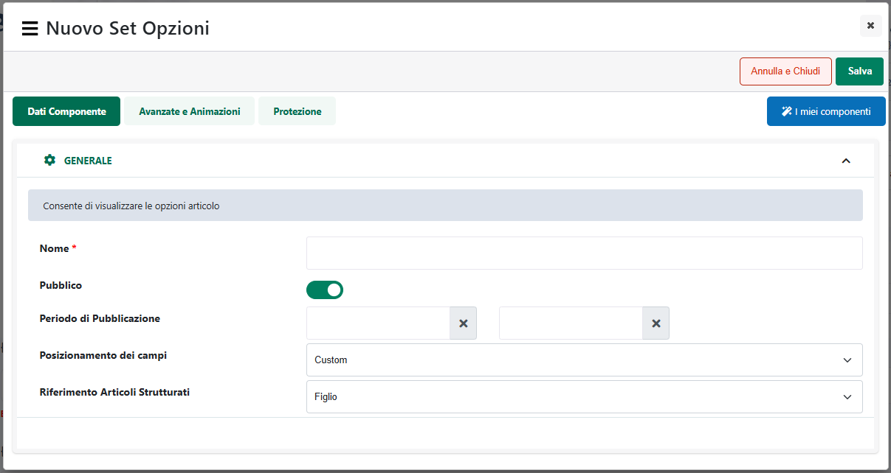
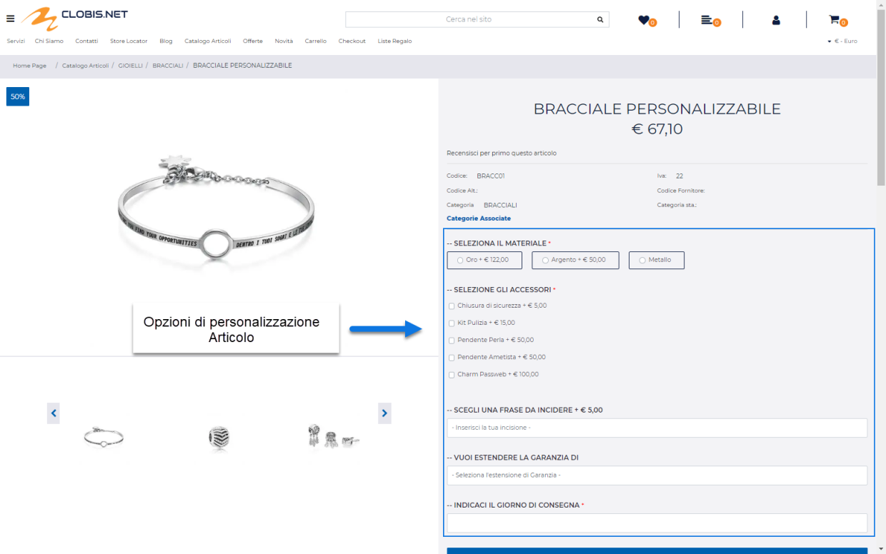
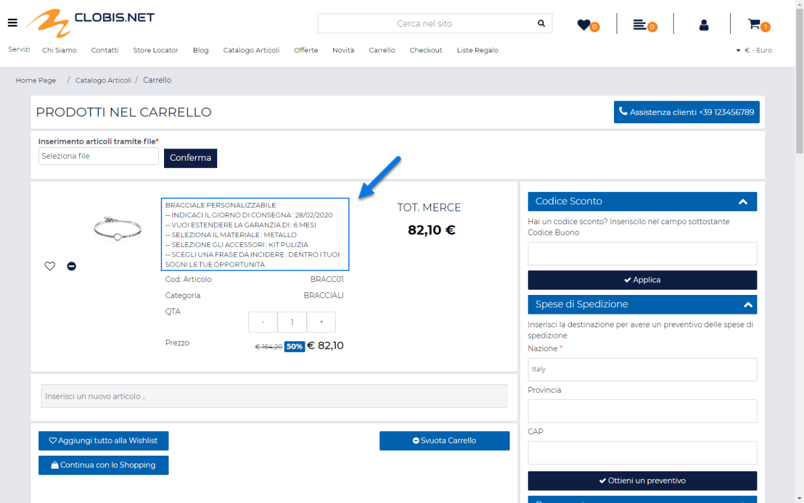
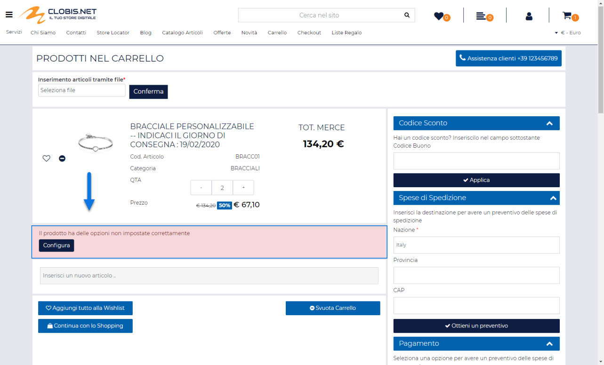
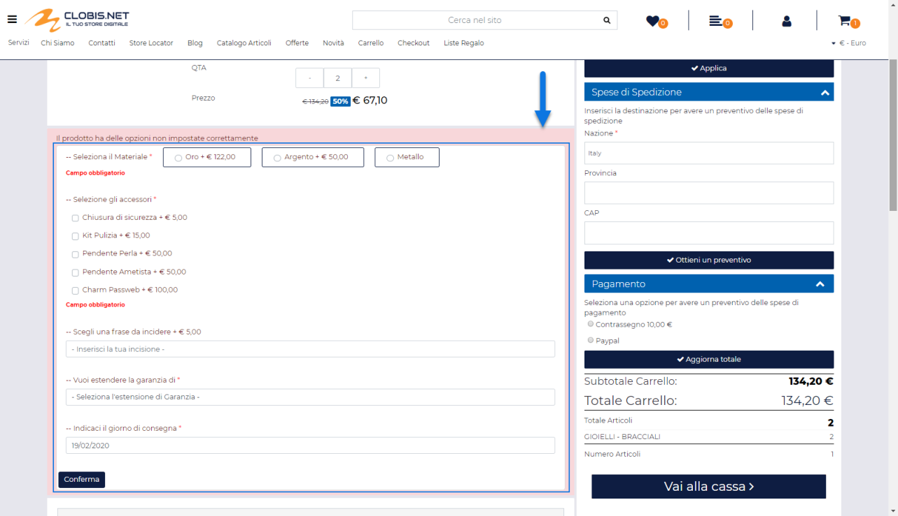
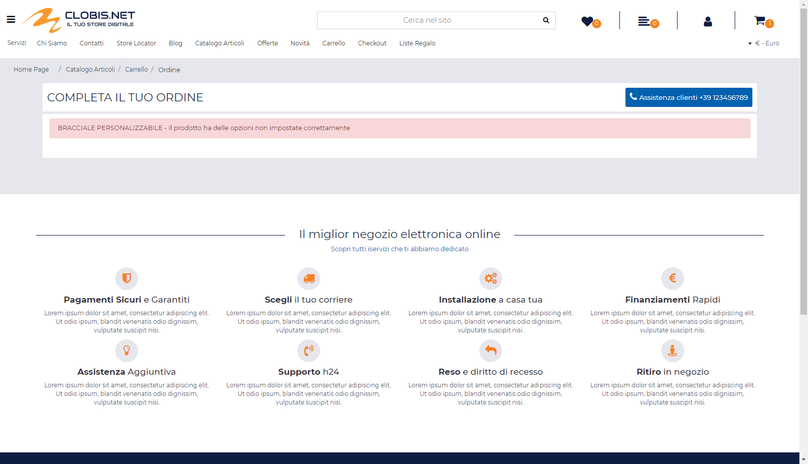
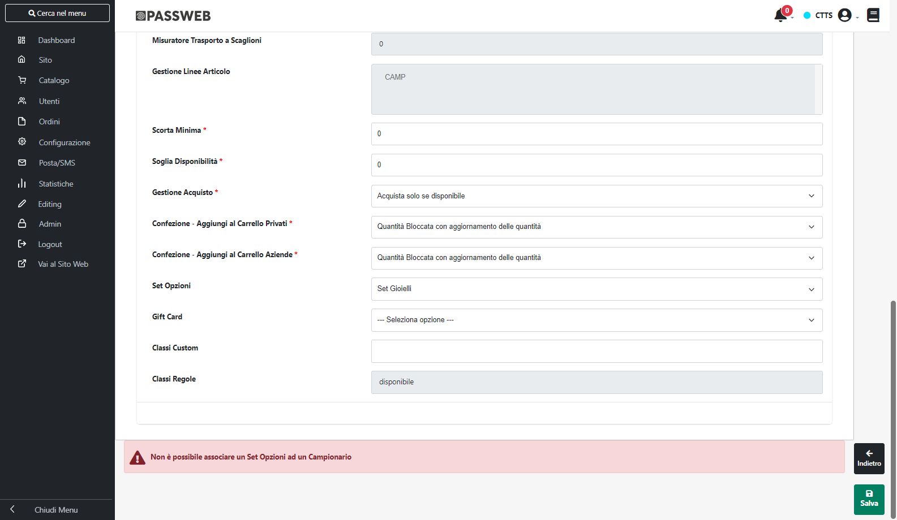

# COMPONENTI E-COMMERCE -- SET OPZIONI

Il Componente **"Set Opzioni"**

può essere inserito unicamente all'interno dei seguenti componenti
Ecommerce:

- Scheda Prodotto

- Configuratore

- Campionario

- Selezione Regalo

e consente di visualizzare le cosiddette **custom option**, ossia le
eventuali opzioni di personalizzazione del relativo prodotto.

**ATTENZIONE! Il componente Set Opzioni è disponibile unicamente per
Varianti Sito Responsive. Nel caso in cui il sito dovesse essere ancora
gestito con una Variante non Responsiva si consiglia quindi di non
attivare questa funzionalità e, soprattutto, di non associare eventuali
set di opzioni a nessuno degli articoli presenti all'interno del sito.**

Supponiamo, ad esempio, di dover vendere all'interno del sito un
bracciale dando anche ai clienti che decidono di acquistarlo la
possibilità di incidere su di esso una frase personalizzata, oppure una
torta dando ai clienti la possibilità di inviarci l'immagine da dover
poi riprodurre sulla torta stessa.

Entrambe queste esigenze potranno essere risolte creando, all'interno
del gestionale, articoli semplici ai quali poi andare ad aggiungere
direttamente in Passweb le relative opzioni di personalizzazione,
opzioni queste che, nello specifico, potrebbero essere configurate,
sulla scheda del prodotto, da una parte come un campo di input che
l'utente potrà usare per inserire la frase da incidere (scelta questa
che magari potrebbe anche incrementare il prezzo finale del prodotto), e
dall'altra parte come un campo di tipo file che l'utente potrà
utilizzare per allegare all'ordine della torta l'immagine da riprodurre.

La prima cosa da fare per gestire questo tipo di esigenze sarà dunque
quella di creare appositi set (insiemi) di opzioni di personalizzazione
da associare poi agli articoli presenti all'interno del sito (per
maggiori informazioni in merito alla creazione e alla gestione dei Set
di Opzioni si veda anche il relativo capitolo di questo manuale
"*Catalogo -- Opzioni Articoli*")

Una volta creati questi set e associati agli articoli che potranno
effettivamente essere personalizzati, le custom option dovranno poi
essere inserite all'interno del sito mediante l'utilizzo del componente
"**Set Opzioni**"

**ATTENZIONE!** Il componente Set Opzioni verrà visualizzato solo ed
esclusivamente nel caso in cui all'articolo in esame sia stato
effettivamente associato un ben determinato Set di Opzioni

Rilasciando il Componente nella posizione desiderata all'interno della
pagina web, verrà visualizzata **la sua maschera di gestione e
configurazione**

suddivisa in varie sezioni.

All'interno della sezione "**Dati Componente**" sarà possibile inserire
il contenuto e settare i principali parametri di configurazione del
componente.

In particolare, per la tipologia di Componente in questione, sarà
possibile impostare un valore per i seguenti parametri:

**Nome:** consente di specificare il nome del Componente che si sta
realizzando

**Pubblico:** consente di impostare la visibilità lato sito web del
componente che si sta realizzando.

**Periodo di Pubblicazione:** consente di associare al Componente in
oggetto uno specifico periodo di pubblicazione, definendone l'effettiva
data di pubblicazione e la corrispondente data di oscuramento.

Nel primo dei due campi disponibili occorrerà quindi indicare,
utilizzando l'apposito calendario, la data di inizio pubblicazione. Nel
secondo campo andrà invece specificata la data di fine pubblicazione.

> **ATTENZIONE!** Le date indicate all'interno di questi campi verranno
> considerate solo ed esclusivamente nel caso in cui il precedente
> parametro "Pubblico" sia stato selezionato

**Posizionamento dei campi:** consente di posizionare le custom option
presenti all'interno del componente secondo uno schema prestabilito.

E' possibile selezionare uno dei seguenti valori:

- Affiancati a destra

- Affiancati a sinistra

- Affiancati e giustificati

- Affiancati e opposti

- Centrati e affiancati

- Centrati e Incolonnati

- Incolonnati a destra

- Incolonnati a sinistra

- Custom

**ATTENZIONE!** Nel caso in cui si decidesse di utilizzare uno dei
preset presenti in elenco poi il posizionamento degli elementi sarà
esattamente quello indicato e non potrà essere modificato in alcun modo.

**L'opzione Custom consente invece di non applicare nessun preset
particolare.** **In queste condizioni dunque il posizionamento delle
Custom Option potrà essere variato liberamente agendo sulle corrette
proprietà CSS mediante lo style editor di Passweb e/o mediante i
relativi strumenti di editing avanzato.**

**Riferimento Articoli Strutturati**: questo parametro verrà
visualizzato solo nel caso in cui il componente "Set Opzioni" sia stato
inserito all'interno di una "Scheda Prodotto" e verrà preso in
considerazione solo per articoli strutturati.

Consente di specificare se il componente "Set Opzioni" dovrà essere
inserito e gestito sul padre di struttura o su eventuali figli e,
conseguentemente, se poter personalizzare in maniera differente ogni
singolo articolo figlio o se utilizzare invece le stesse
personalizzazioni impostate sul padre anche per tutti i figli
eventualmente acquistati (opzione questa che richiede l'utilizzo del
configuratore tabellare)

Nello specifico sarà quindi possibile selezionare una delle seguenti
opzioni:

- **Figlio (opzione di default)**: in questo caso il componente "Set
  Opzioni" verrà gestito sui figli di struttura. Prima di poterlo
  visualizzare sarà quindi necessario completare la configurazione di un
  determinato articolo figlio agganciando così la relativa scheda
  prodotto.

> **ATTENZIONE! L'opzione in esame dovrà essere selezionata nel momento
> in cui l'esigenza dovesse essere quella di personalizzare in maniera
> diversa ogni singolo articolo figlio e richiede, ovviamente,
> l'associazione del set opzioni direttamente sui figli di struttura**
>
> In queste condizioni occorre inoltre ricordare che:

- nel momento in cui, per la struttura in esame, dovesse essere gestito
  il configuratore tabellare il componente "Set Opzioni" dovrà essere
  inserito all'interno del configuratore stesso in maniera tale da poter
  avere poi a disposizione le diverse opzioni di personalizzazione per
  ogni singolo figlio presente in tabella

- considerando che il componente "Set Opzioni" avrà come riferimento il
  singolo articolo figlio, eventuali maggiorazioni di prezzo dovute alle
  personalizzazioni impostate verranno applicate direttamente sul prezzo
  di partenza del singolo articolo figlio. Ogni articolo figlio aggiunto
  in carrello potrà quindi avere una specifica personalizzazione ed un
  suo specifico prezzo dovuto, appunto, alla personalizzazione
  effettuata

<!-- -->

- **Padre**: in questo caso il componente "Set Opzioni" verrà gestito
  direttamente sul padre di struttura e, in conseguenza di ciò, verrà
  visualizzato immediatamente senza dover per forza di cose impostare
  prima di tutto una determinata configurazione di prodotto finito.

> **ATTENZIONE!** **L'opzione in esame dovrà essere selezionata solo nel
> momento in cui l'esigenza dovesse essere quella di riportare in
> maniera automatica le stesse esatte personalizzazioni fatte sul padre
> di struttura anche sui figli eventualmente acquistati e richiede,
> ovviamente, l'associazione del set opzioni sia sul padre di struttura
> che sui relativi figli**
>
> In queste condizioni occorre inoltre ricordare che:

- nel momento in cui, per la struttura in esame, dovesse essere gestito
  il configuratore tabellare il componente "Set Opzioni" dovrà essere
  comunque inserito al di fuori del configuratore stesso

- considerando che il componente "Set di Opzioni" avrà come riferimento
  l'articolo padre di struttura, eventuali maggiorazioni di prezzo,
  dovute alla personalizzazioni impostate, verranno applicate sul prezzo
  di partenza dell'articolo padre. Ogni articolo figlio aggiunto in
  carrello avrà quindi la stessa personalizzazione impostata sul padre e
  il suo stesso prezzo

**NOTA BENE:** per maggiori informazioni relativamente alle sezioni
"**Avanzate e Animazioni**" e "**Protezione**", presenti nella maschera
di gestione e configurazione di tutti i componenti Passweb, si veda
anche il capitolo " Varianti Responsive -- Configurazione Componenti --
Caratteristiche Generali " di questo manuale.

Il pulsante "**Salva**" presente nella parte alta della maschera di
configurazione, consente di salvare le impostazioni settate e di
visualizzare quindi all'interno della pagina prodotto le eventuali
opzioni di personalizzazione dell'articolo

**ATTENZIONE!** Nel caso in cui ad un articolo sia stato associato un
set di opzioni, al componente "**Scheda prodotto**" verrà aggiunta
automaticamente la classe css "**setoptionproduct**" utile per
stilizzare la pagina prodotto di questi specifici articoli in maniera
diversa da quella di altre tipologie di prodotti.

Per ciascuna delle opzioni presenti all'interno del componente compare,
vicino alla relativa label, l'eventuale incremento di prezzo che la
selezione di quella determinata opzione comporterebbe (incremento questo
definito direttamente in fase di configurazione della singola opzione).

**In conseguenza di ciò ogni qualvolta dovesse essere valorizzata una
delle opzioni di personalizzazione presenti all'interno del componente,
il prezzo di vendita del relativo articolo verrà automaticamente
ricalcolato e aggiornato con l'eventuale maggiorazione**.

**ATTENZIONE!** Nel momento in cui all'articolo dovesse essere applicato
un determinato sconto, per evitare di applicarlo anche alle eventuali
opzione di personalizzazione, in fase di ricalcolo del prezzo tale
sconto verrà automaticamente nascosto.

**In ogni caso la maggiorazione di prezzo determinata dalla selezione di
una determinata opzione di personalizzazione,** **verrà calcolata sempre
a partire dal prezzo scontato (e mai da quello pieno).**

Allo stesso modo e per la stessa ragione, ovviamente, la corrispondente
riga dell'ordine inserito nel gestionale avrà direttamente il prezzo
finito dell'articolo ottenuto dal prezzo base (eventualmente scontato)
più le maggiorazioni (non soggette a sconto) generate dalle
personalizzazioni effettuate dall'utente in fase di acquisto.

Nel momento in cui per il Set di Opzioni associato all'articolo in esame
**dovessero essere state create delle Custom Option obbligatorie**,
all'interno di componenti quali "Catalogo Ecommerce", "Offerte /
Novità", "Popolarità Prodotto" ecc... comparirà il solo pulsante di
"Aggiungi in Carrello" senza la possibilità quindi di indicare l'esatta
quantità dell'articolo da acquistare.

In queste condizioni, cliccando sul pulsante di aggiunta in carrello
l'utente verrà automaticamente indirizzato sulla relativa pagina
prodotto dove avrà la possibilità di valorizzare le opzioni
obbligatorie, di indicare l'esatta quantità dell'articolo da acquistare
e di inserirlo effettivamente in carrello.

La stessa cosa avverrà ovviamente anche per i pulsanti di "Aggiunta alla
Wishlist" e di "Aggiunta al Comparatore". Nel caso in cui l'articolo
dovesse avere delle opzioni obbligatorie cliccando su questi pulsanti
l'utente verrà quindi ricondotto alla pagina prodotto dove potrà
valorizzare le opzioni obbligatorie e, successivamente, inserire
l'articolo in Wishlist e/o nel Comparatore.

All'interno del carrello verranno visualizzati, in corrispondenza del
componente "Titolo", tutti i valori selezionati per le varie opzioni di
personalizzazione

Nel caso in cui tra i valori selezionati dovessero essere presenti anche
delle opzioni di tipo File, cliccando sul relativo valore sarà possibile
effettuare il download del corrispondente allegato.

**ATTENZIONE!** **L'applicazione effettuerà automaticamente dei
controlli su tutte le opzioni indicate per gli articoli presenti in
carrello in maniera tale da evidenziare e risolvere eventuali
incongruenze legate a queste stesse opzioni**.

Potrebbero infatti verificarsi situazioni in cui, ad esempio, un utente
decida di riordinare determinati articoli personalizzabili a partire da
una vecchia fattura senza sapere che, nel frattempo, le opzioni relative
agli articoli presenti in quella stessa fattura possono essere cambiate
(alcune opzioni possono essere state rimosse, altre possono essere state
aggiunte o addirittura lo stesso articolo potrebbe non essere più
personalizzabile).

In questo senso dunque ogni volta che:

- Viene aggiunto in carrello un articolo personalizzabile

- Viene modificata una riga del carrello relativa ad un articolo
  personalizzabile

- Si passa dal Carrello al Checkout e in Carrello sono presenti articoli
  personalizzabili

Passweb si preoccuperà di verificare che tutte le opzioni coinvolte
siano effettivamente corrette apportando, nel caso in cui non lo
fossero, i seguenti correttivi:

- Se per un dato articolo le opzioni di personalizzazione dovessero
  essere diverse verranno mantenute solo quelle effettivamente gestite
  al momento dell'inserimento / modifica in carrello

- Se per un dato articolo non dovesse essere più gestito alcun Set, in
  fase di inserimento / modifica in carrello verranno automaticamente
  rimosse tutte le opzioni di personalizzazione

- Se per un dato articolo dovessero mancare delle opzioni definite come
  obbligatorie, verrà visualizzato in Carrello un apposito messaggio di
  errore

- Se per un dato articolo la tipologia di campo (TextField, TextArea,
  Radio ...) utilizzata per gestire un'opzione di personalizzazione
  dovesse essere diversa da quella attualmente impostata per la stessa
  opzione all'interno del Wizard, verrà visualizzato in Carrello un
  apposito messaggio di errore

- Se per un dato articolo dovessero essere utilizzate opzioni di
  personalizzazione di tipo "Numerico", "Decimale" o "Prezzo" e il loro
  valore dovesse essere inferiore al "Valore Minimo" o superiore al
  "Valore Massimo" attualmente impostati per queste stesse opzioni,
  verrà visualizzato in Carrello un apposito messaggio di errore

In queste condizioni assieme al messaggio di errore verrà visualizzato
anche un pulsante "**Configura**" grazie al quale poter risolvere,
direttamente dalla pagina carrello, i problemi evidenziati.

Cliccando su questo pulsante verranno infatti visualizzate le opzioni di
personalizzazione del relativo articolo

Una volta sistemati gli errori evidenziati cliccando sul pulsante
"**Conferma**" le nuove impostazioni verranno salvate sulla
corrispondente riga del carrello.

I messaggi di errore presenti in corrispondenza di articoli con
associate opzioni di personalizzazione non corrette possono essere
modificati e gestiti all'interno della sezione "Testi / Messaggi del
sito" agendo sull'elemento "**Opzioni errate**" del componente
"**Aggiunta al Carrello**\". Il testo del pulsante "Configura" può
invece essere personalizzato sempre all'interno della sezione "Testi /
Messaggi del sito" agendo questa volta però sull'elemento "**Pulsante
Configura Opzioni**" del componente "**Carrello Custom**"

Nel caso in cui eventuali problemi relativi alle opzioni di
personalizzazione dovessero essere riscontrati nella fase di passaggio
dal Carrello al Checkout verrà visualizzato un messaggio di "Errata
configurazione articolo"

e non si potrà procedere con l'ordine fintanto che non siano state
impostate correttamente tutte le opzioni di personalizzazione richieste.

Il messaggio di "Errata configurazione Articolo" potrà essere
personalizzato all'interno della sezione "Testi / Messaggi del sito"
agendo sull'elemento "**Opzioni errate**" del componente "**Aggiunta al
Carrello**\".

Un'ultima cosa di fondamentale importanza da mettere in evidenza,
infine, è quella che riguarda la gestione dei Set di opzioni su articoli
strutturati e campionari.

- Per quel che riguarda gli **articoli strutturati** occorre ricordare
  che la visualizzazione di eventuali opzioni di personalizzazione
  direttamente sul padre di struttura piuttosto che sulle singole
  configurazioni di prodotto finito dipenderà, come precedentemente
  evidenziato, dal parametro "**Riferimento Articoli Strutturati"** e
  quindi dal fatto di voler personalizzare in maniera differente ogni
  singolo articolo figlio oppure di voler impostare una volta soltanto
  le opzioni di personalizzazione sul padre e di riportarle poi
  identiche anche su tutti i figli eventualmente acquistati

> Detto questo occorre poi considerare anche che nel momento in cui si
> dovesse decidere di impostare il parametro "**Riferimento Articoli
> Strutturati**" sull'opzione "**Figlio**" l'eventuale set di opzioni
> associato comunque al padre di struttura verrà visualizzato per tutte
> le combinazioni di prodotti finiti corrispondenti ad articoli figli
> non esportati e gestiti all'interno del sito.
>
> Nel momento in cui, invece, una data combinazione di prodotto finito
> dovesse corrispondere ad un figlio effettivamente esportato e gestito
> anche all'interno del sito, selezionando tale combinazione verrà
> visualizzato l'eventuale set di opzioni associato in maniera specifica
> al relativo articolo (e che potrebbe anche essere diverso da quello
> inizialmente visualizzato per il padre di struttura). Se all'articolo
> figlio, esportato e gestito sul sito, non dovesse essere associato
> nessun set di opzioni non verrà visualizzata, ovviamente, nessuna
> opzione di personalizzazione.

- Nel caso in cui per articoli strutturati a taglie/colori dovesse
  essere utilizzato il configuratore tabellare e dovessero essere
  inserite in carrello contemporaneamente più taglie / colori ciascuna
  con opzioni di personalizzazione differenti, verranno create,
  ovviamente, righe d'ordine differenti.

- Per quel che riguarda gli **articoli Campionario** la prima cosa da
  tenere in considerazione è che, vista la natura di questa particolare
  tipologia di articoli, non sarà mai possibile associare un Set di
  Opzioni al Campionario in sé.

> Nel momento in cui si dovesse tentare infatti di associare un Set di
> Opzioni ad un campionario, operando ad esempio all'interno della
> maschera "Dati Articolo", verrà visualizzato un apposito messaggio di
> errore.

- Al contrario di quanto avviene sul Campionario è invece perfettamente
  possibile associare Set di Opzioni ai suoi componenti. In questo caso
  occorre però distinguere tra Campionari configurabili e non
  configurabili.

> Nel primo caso (**campionari configurabili**) sarà possibile gestire,
> direttamente dalla pagina prodotto, sui singoli componenti del
> campionario eventuali opzioni di personalizzazione dettate dal Set
> associato al singolo componente.
>
> Nel secondo caso (**campionari non configurabili**) all'interno della
> pagina prodotto non sarà mai possibile gestire eventuali opzioni di
> personalizzazione dei singoli componenti. Se però, ai singoli
> componenti del campionario non configurabile dovessero comunque essere
> associati dei set con opzioni di personalizzazione obbligatorie,
> passando in carrello verrà notificata l'assenza per questi componenti
> di tali opzioni e sarà quindi possibile, direttamente dalla stessa
> pagina carrello, personalizzare questi elementi prima di concludere
> l'ordine.

