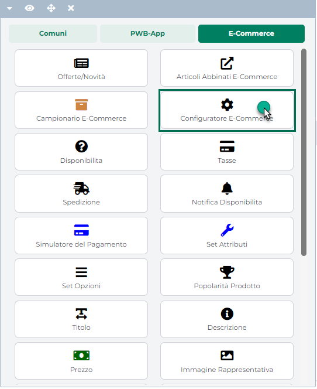

# COMPONENTI E-COMMERCE -- CONFIGURATORE (SCHEDA PRODOTTO)

**Il Componente "Configuratore E-commerce"**

**potrà essere inserito, per sua stessa natura, unicamente all'interno
del componente Ecommerce di primo livello "Scheda Prodotto".**

In particolare attraverso questo componente sarà possibile inserire
all'interno della Scheda Prodotto un insieme di controlli,
opportunamente personalizzabili, attraverso cui un utente del sito potrà
arrivare a configurarsi, partendo da un articolo padre strutturato e
scegliendo tra diverse possibili opzioni, un articolo con determinate
caratteristiche.

Tale componente è dunque indispensabile per poter gestire correttamente
all'interno del sito gli articoli strutturati (Ecommerce Mexal) o le
Varianti Articolo (Ecommerce Ho.Re.Ca.), offrendo agli utenti la
possibilità di decidere che caratteristiche dovrà avere l'articolo da
loro selezionato.

> **NOTA BENE:** per maggiori informazioni relativamente alla gestione e
> alla personalizzazione di questo componente si rimanda alla sezione
> "Live Editing per Varianti Responsive -- Lista Componenti Ecommerce --
> Componente Configuratore" di questo manuale.

