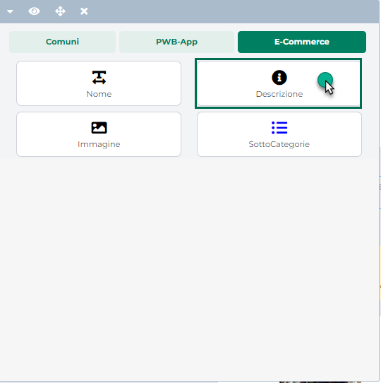
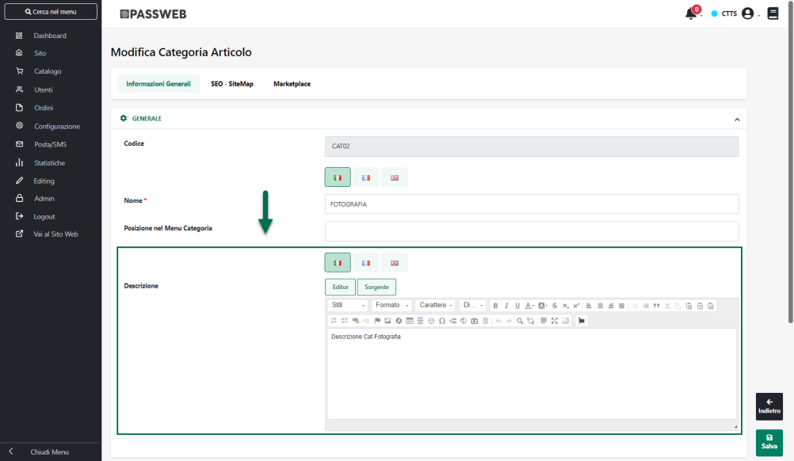
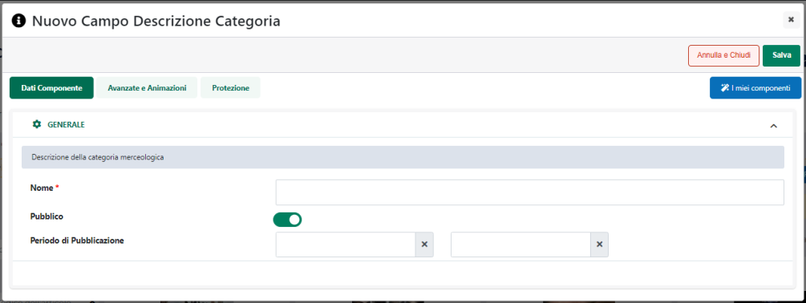

# COMPONENTI E-COMMERCE -- DESCRIZIONE (LISTA CATEGORIE E SCHEDA CATEGORIA)

Il Componente **"Descrizione"**

**gestibile all'interno dei componenti Ecommerce di primo livello "Lista
Categorie" e "Scheda Categoria",** permette visualizzare la descrizione
della corrispondente categoria merceologica.

Tale descrizione, anch'essa gestita in multilingua, dovrà essere
inserita necessariamente in Passweb all'interno del campo "Descrizione"
presente nella maschera di configurazione della relativa Categoria
Merceologica

> **NOTA BENE:** per maggiori informazioni relativamente a come
> associare una specifica descrizione ad ogni singola categoria
> merceologica gestita all'interno del sito, si veda anche la sezione
> "Catalogo -- Gestione Articoli" di questo manuale.

A livello di configurazione, gli unici parametri richiesti da questo
Componente saranno il nome del Componente stesso (campo "Nome") e la sua
visibilità lato sito web (campo "Pubblico"). Rilasciando infatti il
Componente nella posizione desiderata verrà visualizzata **la sua
maschera di gestione e configurazione**

suddivisa in varie sezioni.

All'interno della sezione "**Dati Componente**" sarà possibile inserire
il contenuto e settare i principali parametri di configurazione del
componente.

In particolare, per la tipologia di Componente in questione, sarà
possibile impostare un valore per i seguenti parametri:

**Nome:** consente di specificare il nome del Componente che si sta
realizzando

**Pubblico:** consente di impostare la visibilità lato sito web del
componente che si sta realizzando.

**Periodo di Pubblicazione:** consente di associare al Componente in
oggetto uno specifico periodo di pubblicazione, definendone l'effettiva
data di pubblicazione e la corrispondente data di oscuramento.

Nel primo dei due campi disponibili occorrerà quindi indicare,
utilizzando l'apposito calendario, la data di inizio pubblicazione. Nel
secondo campo andrà invece specificata la data di fine pubblicazione.

> **ATTENZIONE!** Le date indicate all'interno di questi campi verranno
> considerate solo ed esclusivamente nel caso in cui il precedente
> parametro "Pubblico" sia stato selezionato

**NOTA BENE:** per maggiori informazioni relativamente alle sezioni
"**Avanzate e Animazioni**" e "**Protezione**", presenti nella maschera
di gestione e configurazione di tutti i componenti Passweb, si veda
anche il capitolo " Varianti Responsive -- Configurazione Componenti --
Caratteristiche Generali " di questo manuale.

