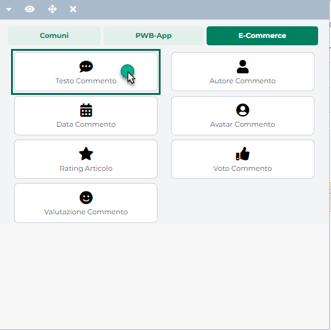
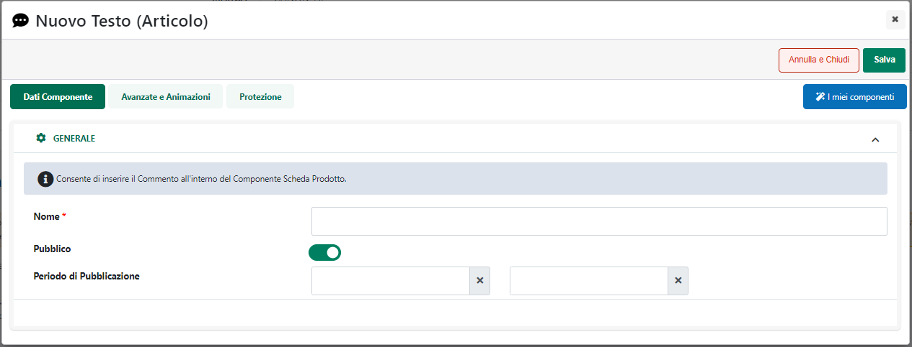

# COMPONENTI E-COMMERCE -- TESTO COMMENTO

Il Componente **"Testo Commento"**

{width="2.5340277777777778in"
height="2.5340277777777778in"}

può essere inserito solo ed esclusivamente all'interno di un componente
"**Commenti Associati**" e consente di visualizzare il contenuto di ogni
singolo commento presente in elenco

A livello di configurazione, una volta inserito il Componente
all'interno della pagina web, verrà aperta in automatico **la sua
maschera di gestione e configurazione**

{width="4.613194444444445in"
height="1.7666666666666666in"}

suddivisa in varie sezioni.

All'interno della sezione "**Dati Componente**" sarà possibile inserire
il contenuto e settare i principali parametri di configurazione del
componente.

In particolare, per la tipologia di Componente in questione, sarà
possibile impostare un valore per i seguenti parametri:

**Nome:** consente di indicare il nome del componente Data Commento che
si sta realizzando

**Pubblico (selezionato a default):** consente di impostare la
visibilità del componente lato sito web. Se selezionato il
corrispondente componente verrà correttamente pubblicato e visualizzato
all'interno del sito. Nel caso in cui invece tale parametro non sia
selezionato, il corrispondente componente passerà in modalità "Offline",
sarà quindi visibile all'interno del Wizard, dove potrà essere
normalmente gestito, ma non verrà pubblicato e visualizzato all'interno
del sito.

**Periodo di Pubblicazione:** consente di associare al Componente in
oggetto uno specifico periodo di pubblicazione, definendone l'effettiva
data di pubblicazione e la corrispondente data di oscuramento.

Nel primo dei due campi disponibili occorrerà quindi indicare,
utilizzando l'apposito calendario, la data di inizio pubblicazione. Nel
secondo campo andrà invece specificata la data di fine pubblicazione.

> **ATTENZIONE!** Le date indicate all'interno di questi campi verranno
> considerate solo ed esclusivamente nel caso in cui il precedente
> parametro "Pubblico" sia stato selezionato

Il pulsante "**Salva**" nella parte alta della maschera consentirà di
salvare le modifiche apportate al Componente in oggetto.

**NOTA BENE:** per maggiori informazioni relativamente alle sezioni
"**Avanzate e Animazioni**", "**Distribuzione**" e "**Protezione**",
presenti nella maschera di gestione e configurazione di tutti i
componenti Passweb, si veda anche il capitolo " Varianti Responsive --
Configurazione Componenti -- Caratteristiche Generali " di questo
manuale.

