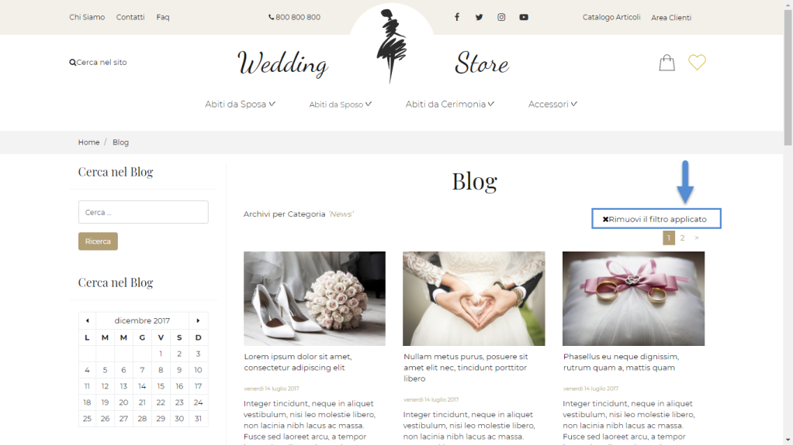

# CONFIGURAZIONE

Una volta inserito il Componente all'interno della pagina web, verrà
aperta in automatico **la sua maschera di gestione e configurazione**

attraverso cui poter impostare i principali parametri di configurazione
del componente stesso.

In particolare occorrerà impostare un valore per i seguenti campi:

**Nome** (obbligatorio), consente di inserire un nome per il Componente
Paragrafo che si sta realizzando

**Pubblico (selezionato a default):** consente di impostare la
visibilità del componente lato sito web.

**Periodo di Pubblicazione:** consente di associare al Componente in
oggetto uno specifico periodo di pubblicazione, definendone l'effettiva
data di pubblicazione e la corrispondente data di oscuramento.

**ATTENZIONE!** Per maggiori informazioni relativamente ai parametri
**Nome, Pubblico, Periodo di Pubblicazione** si veda anche quanto
indicato all'interno del capitolo "*Configurazione Componenti --
Caratteristiche generali* -- *Dati Componente* " di questo manuale

**Caricamento Javascript**: se selezionato, consente di caricare il
relativo componente in maniera asincrona al termine del caricamento
della pagina web.

**Statico**: consente di decidere se il componente in esame deve o meno
essere reso statico

**ATTENZIONE!** Per maggiori informazioni relativamente ai parametri
**Caricamento Javascript** e **Statico** si veda anche quanto indicato
all'interno del capitolo "*Configurazione Componenti -- Caratteristiche
generali* -- *Staticizzazione e caricamento asincrono*" di questo
manuale

**Visualizza Ricordami:** se attivato, consentirà di visualizzare
all'interno del pannello di Login un check box che, una volta
selezionato, permetterà di generare un cookie che verrà poi utilizzato
per consentire all'utente di effettuare automaticamente il login senza
dover reinserire le proprie credenziali in maniera manuale

**NOTA BENE:** affinché l'elemento "Ricordami" possa funzionare in
maniera corretta è necessario che il browser utilizzato dall'utente che
visita il sito abbia la gestione dei cookie attiva.

In questo modo dunque, nel momento in cui l'utente dovesse tornare
successivamente a visitare il sito, utilizzando ovviamente lo stesso
browser web, verrebbe automaticamente autenticato.

Il testo dell'etichetta visualizzata a fianco del check box in esame
("Ricordami") può essere personalizzato all'interno della sezione "Sito
-- Gestione/Testi Messaggi del sito" agendo per questo sul componente
"Login" (elemento "Etichetta Ricordami").

**Giorni di Scadenza:** consente di definire i giorni di scadenza del
cookie generato dal componente in esame e contenente le credenziali di
accesso al sito. Una volta trascorso il periodo indicato il cookie verrà
automaticamente eliminato dal browser e l'utente, per accedere al sito,
dovrà quindi digitare nuovamente le proprie credenziali.

**NOTA BENE:** nel caso in cui l'utente effettui l'accesso al sito senza
selezionare l'opzione "Ricordami" verranno automaticamente eliminati
eventuali cookie precedentemente creati dal componente stesso. In queste
condizioni quindi il successivo accesso al sito dovrà avvenire digitando
manualmente le relative credenziali di accesso.

**Pagina di destinazione all'autenticazione:** consente di specificare
la pagina del sito cui l'utente verrà automaticamente ridiretto una
volta effettuata l'autenticazione. Il pulsante "**Deseleziona**",
presente nella contestuale barra degli strumenti, consente di eliminare
l'associazione ad una specifica pagina cui effettuare il redirect
automatico.

**NOTA BENE:** nel caso in cui non venga indicata una specifica pagina
cui ridirigere automaticamente l'utente, una volta effettuato il login,
se abilitato ad accedere in area riservata l'utente verrà
automaticamente ricondotto in questa sezione del sito, in caso contrario
dopo aver effettuato l'autenticazione resterà all'interno della stessa
pagina.

Il pulsante **"Salva"** nella parte alta della maschera consentirà di
salvare le modifiche apportate al Componente in oggetto.

