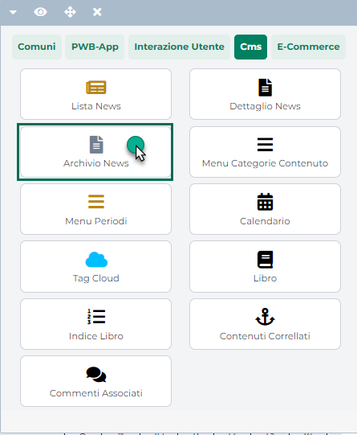

# COMPONENTE ARCHIVIO NEWS

Il componente "**Archivio News**" può essere utilizzato in una qualsiasi
pagina del sito

consente di gestire un archivio paginato di tutte le varie notizie
pubblicate all'interno del sito

**La principale differenza dunque tra un Componente "Archivio News" e un
componente "Lista News" è rappresentata dal fatto che mentre il primo
consente di visualizzare all'interno del sito tutte le news pubblicate,
anche quelle meno recenti, offrendo un apposito sistema di paginazione,
il secondo consente invece di visualizzare all'interno del sito solo un
ben preciso numero di notizie (definito dall'utente stesso in fase di
configurazione del componente).**

> **NOTA BENE:** per maggiori informazioni relativamente a come inserire
> lato Wizard le varie notizie che dovranno poi essere pubblicati
> all'interno del sito con l'aiuto dei componenti CMS, si veda anche la
> corrispondente sezione di questo manuale (Sito -- Gestione CMS).

**Per poter sfruttare appieno tutte le potenzialità della
componentistica CMS messa a disposizione da Passweb, sarà indispensabile
gestire all'interno del sito, almeno una pagina "Archivio" in cui
inserire il corrispondente componenti CMS.**

Occorre infatti considerare che i vari elementi che potranno poi essere
inseriti all'interno di un componente "Lista News" piuttosto che di un
componente "Dettaglio News" (Titolo, Autore, Categorie o Tag associati
ecc ...) hanno associati specifici automatismi gestiti dall'applicazione
e tali per cui, ad esempio, cliccando sul nome dell'autore del post,
l'utente del sito potrebbe essere automaticamente ricondotto alla
corrispondente pagina Archivio, ritrovandosi già impostato, sul
componente "Archivio News" presente all'interno di questa pagina, un
filtro per autore e visualizzando dunque solo ed esclusivamente le
notizie redatte da quello specifico autore.

