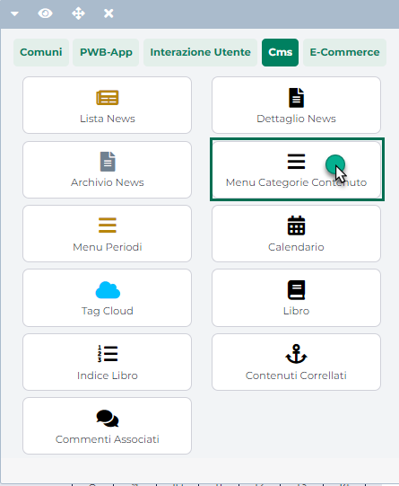

# CAMPO COGNOME

Consente di gestire il cognome dell'utente che compila il form di
richiesta informazioni

{width="5.723611111111111in"
height="3.33125in"}

**Tipologia di componente Passweb**: Campo di Testo

**PARAMETRI DI CONFIGURAZIONE DEL COMPONENTE**

**Id/Name** = cognome

**Tipo Valore** = Testo

**Obbligatorio** = Si

{width="4.417361111111111in"
height="2.9694444444444446in"}

Il valore inserito, in fase di compilazione del form, verrà poi
memorizzato nel relativo campo (**Cognome**) presente nel dettaglio
della richiesta inserita all'interno del gestionale

{width="5.723611111111111in"
height="3.33125in"}

