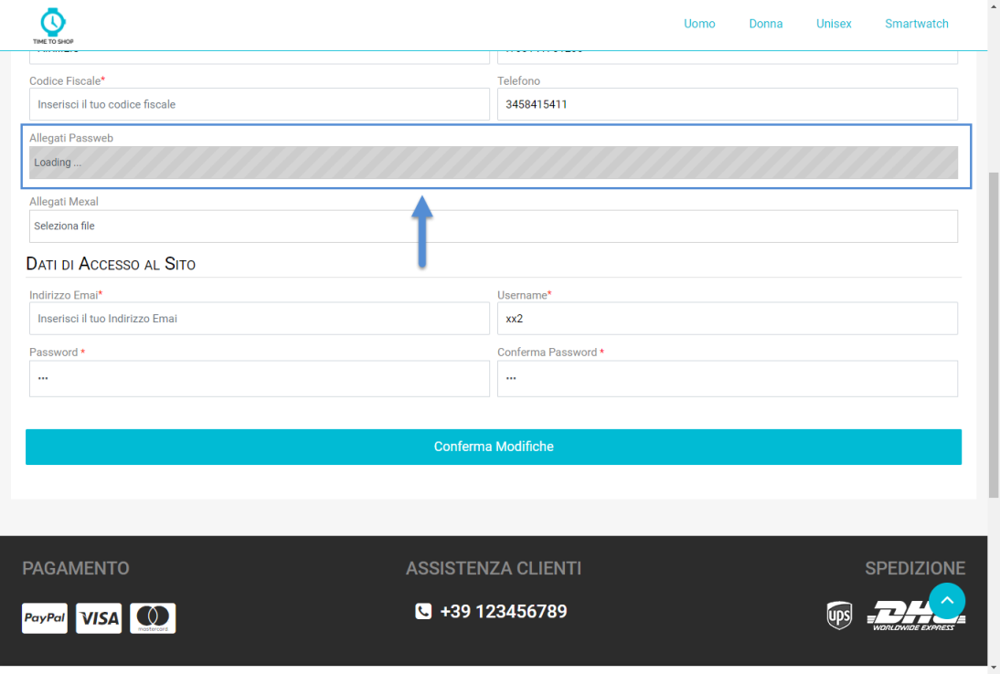
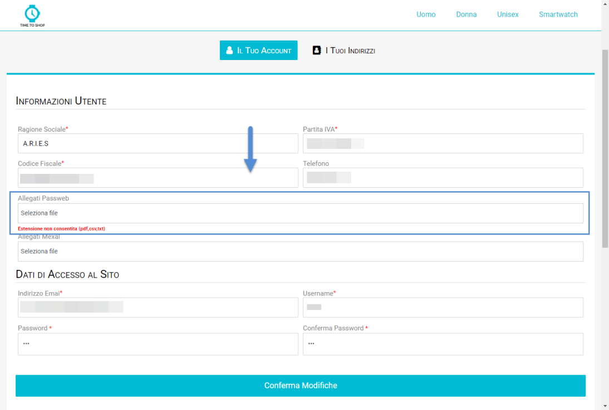

# GESTIONE MULTIPLI E CONFEZIONI

Per i siti Ecommerce collegati ad uno dei gestionali Ho.Re.Ca. il fatto
di poter vendere un determinato articolo a multipli (confezioni con un
certo numero di colli) o a confezioni (quantità propositiva) dipende
essenzialmente dalle impostazioni settate per l'articolo stesso
all'interno del gestionale e, nello specifico, da come è stato impostato
il parametro il parametro "**Tipo Confezione**" presente all'interno del
Tab "**Alias e Fornitori**" dell'anagrafica articolo

In particolare dunque nel caso in cui il campo in esame dovesse essere
impostato sul valore:

- **Multipla:** la quantità immessa nel successivo campo **"qta.
  conf."** andrà ad identificare l'unità di vendita riferita all' unità
  di misura. In queste condizioni dunque la vendita dell'articolo
  all'interno del sito avverrà per quantità multiple.

{width="5.863888888888889in"
height="3.5388888888888888in"}

> In conseguenza di ciò, nel momento in cui si dovesse decidere di
> acquistare, sul sito Ecommerce, l'articolo evidenziato in figura
> inserendo come quantità di acquisto il valore 3, si acquisterebbero
> allora 3 confezioni da 5 pezzi/colli ciascuna e **l'articolo sarebbe
> quindi venduto unicamente a multipli di 5**.
>
> **ATTENZIONE!** Questa impostazione andrà ad incidere, ovviamente, sul
> calcolo della Disponibilità Articolo, sul calcolo del Prezzo e sulla
> funzione di riordino da un documento esportato direttamente dal
> gestionale.
>
> **Per quel che riguarda il riordino occorre infatti considerare che
> nei gestionali Ho.Re.Ca. non è prevista la gestione dei colli.**
>
> In conseguenza di ciò anche se all'interno del sito sarà
> effettivamente possibile acquistare l'articolo precedentemente
> evidenziato in 3 confezioni da 5 pezzi/colli ciascuna, quando l'ordine
> verrà poi inserito nel gestionale, in corrispondenza della relativa
> riga del documento, non sarà gestita una quantità del tipo 3\*5 ma
> verrà inserita direttamente la quantità complessiva degli articoli
> acquistati ossia 15.
>
> In queste condizioni, quando il documento verrà poi riesportato
> all'interno del sito proporrà ovviamente gli stessi dati presenti sul
> gestionale per cui quella che inizialmente, per l'articolo in esame,
> era una quantità di 3\*5 diventerà ora una quantità di 15 unità.
>
> In ogni caso sul sito Ecommerce l'articolo continuerà ad essere ancora
> gestito a colli quindi nel momento in cui si dovesse effettuare un
> riordino dei prodotti presenti in quello stesso documento, in fase di
> aggiunta in carrello la quantità presente sulla riga articolo verrà
> divisa per il numero di elementi della confezione e nel nuovo ordine
> il prodotto verrà inserito ancora una volta in quantità di 3\*5

- **Confezione:** la quantità immessa nel successivo campo **"qta.
  conf."** verrà poi proposta, all'interno del gestionale, come quantità
  di default per l'acquisto dell'articolo in esame. Tale quantità,
  comunque, è solamente propositiva e potrà essere modificata secondo le
  specifiche esigenze dell'utente.

{width="5.863888888888889in"
height="3.5388888888888888in"}

> Supponendo dunque di aver inserito, come evidenziato in figura, in
> corrispondenza del campo " **qta. conf**" il valore 5 sarà poi
> possibile acquistare questo articolo in quantità 5 ma anche in
> qualsiasi altra quantità 3,4,6,13, 34 ecc. ... diversa da 5
>
> In queste condizioni, **lato Passweb,** la quantità effettivamente
> acquistabile per l'articolo in esame dipenderà invece dal fatto che ad
> effettuare l'ordine sia un utente Privato piuttosto che un utente di
> tipo Azienda, e da come è stato impostato il relativo parametro
> "**Aggiungi al carrello**" presente all'interno della sezione
> "**Gestione Confezioni**" alla pagina "*Catalogo -- Configurazione
> Parametri Catalogo -- Catalogo Ho.Re.Ca.*" del Wizard, oppure
> all'interno dell'Anagrafica Passweb del relativo articolo.

{width="5.792361111111111in"
height="3.532638888888889in"}

> Per maggiori informazioni in merito si veda anche la sezione
> "*Catalogo -- Configurazione Parametri Catalogo -- Catalogo Mexal --
> Ho.Re.Ca. -- Gestione Confezioni*" di questo manuale

