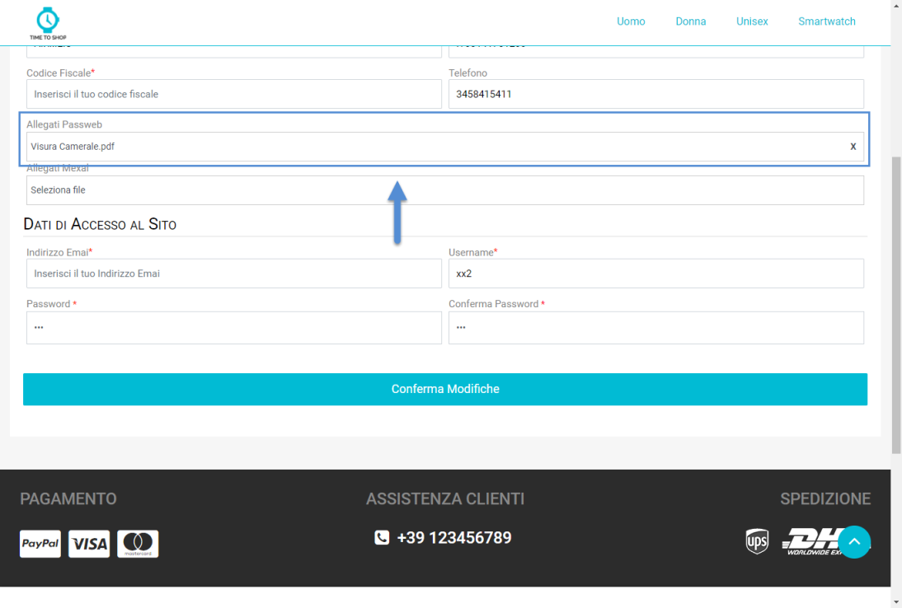

# FUNZIONALITA' DI GESTIONE UTENTI

Come per le Funzionalità di Gestione Articoli esaminate nei precedenti
capitoli di questo manuale, anche le Funzionalità di Gestione Utenti,
**nel caso di siti collegati ad uno dei gestionali Ho.Re.Ca. dovranno
essere attivate e gestite operando direttamente dal back end del sito
partendo, nello specifico, dall'Anagrafica Passweb di ogni singolo
utente**.

Considerando inoltre che per questa tipologia di siti non è prevista la
gestione di Agenti, e quindi di un Ecommerce Business to Business, le
funzionalità di gestione utenti attivabili direttamente da Wizard
saranno limitate alla possibilità di:

- Abilitare o meno un utente per l'accesso in Area Riservata.

- Impostare per ogni utente uno specifico Minimo d'Ordine.

- Impedire ad un'utente di effettuare l'autenticazione al sito e/o di
  effettuare nuovi ordini.

Ciascuna delle funzionalità sopra indicate è attivabile impostando un
apposito flag nell'Anagrafica Passweb del relativo utente.

Per maggiori informazioni in merito si veda quindi quanto indicato
all'interno della sezione di questo manuale relativa alla gestione degli
Utenti.

