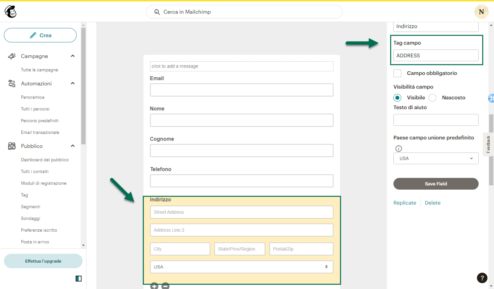
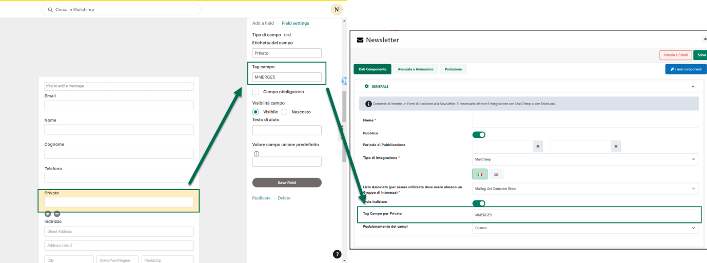
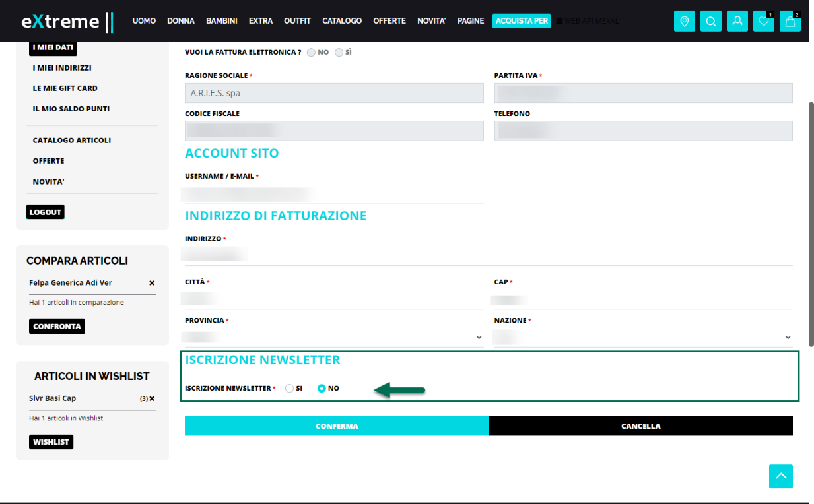
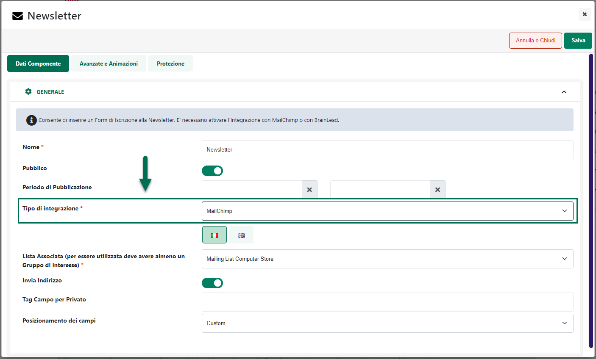

# WEB API PASSCOM

Come evidenziato nei precedenti capitoli di questo manuale, volendo, è
possibile abilitare il proprio sito Commercialista all'utilizzo delle
Web API Passcom. Per far questo sarà necessario:

- Verificare di utilizzare una versione Passcom superiore alla 2024D
  (per versioni inferiori alla 2024D l'utilizzo delle Web Api richiede
  necessariamente l'attivazione della suite MDS)

- Creare un utente abilitato all'utilizzo delle API e appartenente
  quindi al gruppo "**Servizi Web API**" (solo utenti di questo gruppo
  potranno infatti utilizzare i relativi servizi)

- Definire le Aziende dell'installazione per cui sarà effettivamente
  possibile utilizzare le Web Api.

> Per fare questo sarà necessario selezionare il Gruppo Utenti
> utilizzato per gestire l'utente Web Api e cliccare poi sul pulsante
> "**Impostazioni**" (F11) in maniera tale da accedere alla maschera
> "**Impostazioni Gruppo ...**" evidenziata in figura

> Il campo "**Aziende**" consentirà di indicare esattamente le aziende
> per cui sarà possibile utilizzare le Web Api.
>
> **ATTENZIONE!** nel caso in cui il campo "Aziende" dovesse essere
> lasciato vuoto, sarà poi possibile utilizzare le Web Api su tutte le
> aziende dell'installazione
>
> **Il consiglio, ovviamente, è sempre quello di abilitare l'utilizzo
> delle Web Api per tutte le aziende che saranno poi esportate e gestite
> anche all'interno del sito.**
>
> Se configurate in maniera corretta, le Web Api Passcom consentiranno
> infatti di attivare anche un sistema di notifiche mail e/o sms
> relativamente alla pubblicazione di nuovi documenti all'interno di una
> delle Classi Docuvision gestite sul sito. Per maggiori informazioni in
> merito si veda anche quanto indicato nel relativo capitolo di questo
> manuale ("*Siti Commercialista Area Riservata -- Documenti -- Ricerca
> Documenti Passcom -- Notifiche*")

Una volta attivato il servizio lato gestionale sarà poi necessario
portarsi sul Wizard del proprio sito Passweb alla pagina
"**Configurazione -- Configurazione Gestionale**" e impostare anche qui
i parametri richiesti all'interno della sezione Web API, parametri
questi che saranno diversi a seconda del fatto che Passcom sia
installato presso la Web Farm Passepartout o in locale presso il cliente

In ogni caso si tratterà comunque di impostare un valore per i seguenti
campi:

- **Login API:** username dell'utente Mexal abilitato all'utilizzo delle
  Web Api

- **Password API:** password dell'utente Mexal abilitato all'utilizzo
  delle Web Api

- **Base Address WebApi -- solo per installazioni locali:** indirizzo
  del server mexal più la porta su cui è in ascolto il servizio Web Api

> I valori necessari per costruire il Base Address possono essere
> ricavati all'interno della maschera gestionale "**Configurazione
> webapi**" ("*Servizi -- Configurazioni -- Configurazione moduli -- Web
> Api*")

> Supponendo dunque che i valori presenti all'interno dei campi
> evidenziati in figura siano rispettivamente mrossi e 9104 il Base
> Adress da inserire nel corrispondente campo Passweb sarà esattamente
> il seguente
>
> https://mrossi.passepartout.local:9104

**ATTENZIONE!** In ogni caso per maggiori informazioni relativamente al
Base Adress e, più in generale, all'attivazione e all'utilizzo delle API
Passcom si consiglia di fare sempre riferimento alla relativa
documentazione di prodotto

Una volta completata l'attivazione lato gestionale e inseriti anche i
parametri richiesti nella relativa maschera Passweb, per richiamare le
Web Api sarà sufficiente utilizzare gli strumenti di editing avanzato di
Passweb (Layout di pagina o Componente HTML) per effettuare chiamate
ajax in POST al server Passcom richiamando il seguente url

**/callWebApiMexal**

indicando anche i seguenti parametri:

- **\_path**: percorso della Web Api Passcom da richiamare

- **\_method**: metodo della Web Api. I valori ammessi sono GET, POST,
  PUT e DEL (fare riferimento al manuale delle WebAPI).

- **\_body**: parametro opzionale. Testo in formato json con i dati da
  passare alla Web Api

**ATTENZIONE!** Per maggiori informazioni relativamente ai percorsi
delle singole Web Api e/o ai relativi metodi ammessi per le singole
chiamate si consiglia di fare sempre riferimento alla relativa
documentazione di prodotto

Relativamente al formato dei risultati ritornati occorre tenere presente
che **la chiamata a "/callWebApiMexal" restituisce sempre un oggett**o
formato da:

- **status**: codice di stato. Campo numerico. Il valore del campo è 500
  se si è verificato un errore, 200 se la chiamata è stata effettuata
  correttamente

- **response**: Campo stringa. Se il codice di stato è 500, questo campo
  contiene il dettaglio dell'errore. Se il codice di stato è 200, il
  campo contiene invece il json restituito dalla Web Api in formato
  stringa.

- **location**: Campo stringa. In caso di inserimento di una nuova
  entità, in questo campo viene indicato il path dell'entità appena
  creata

