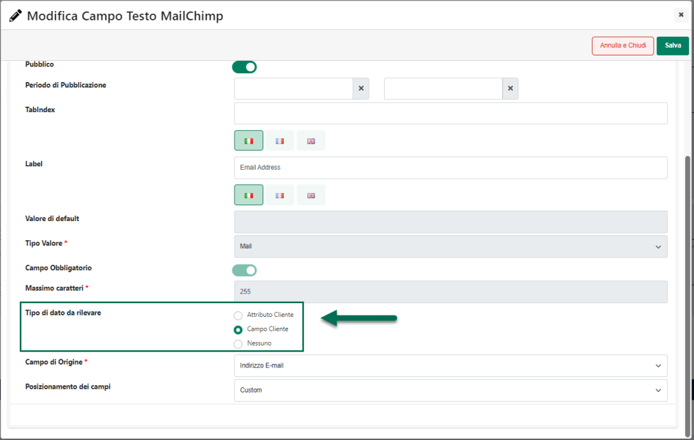
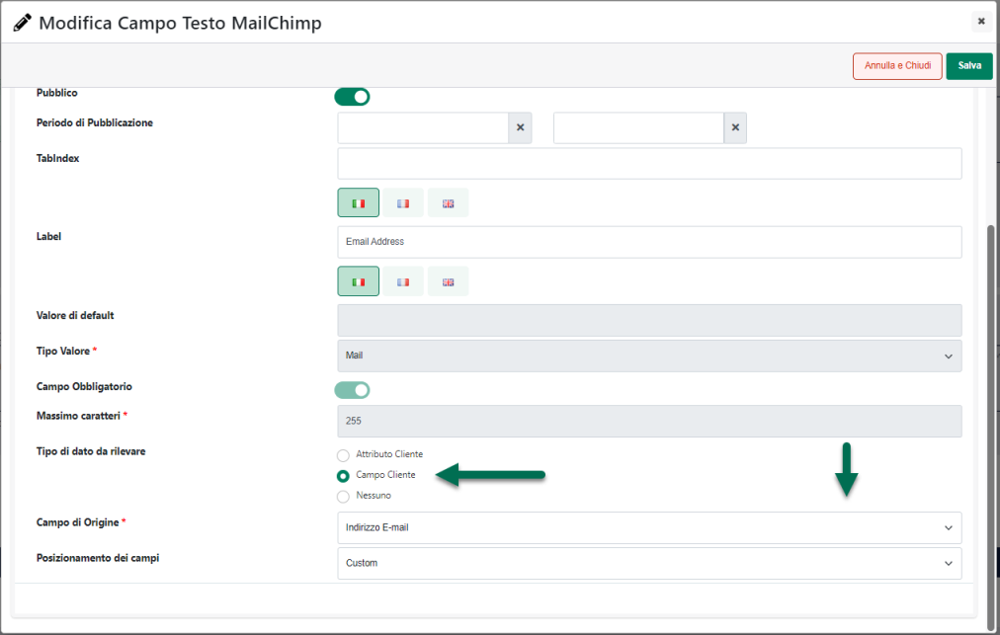
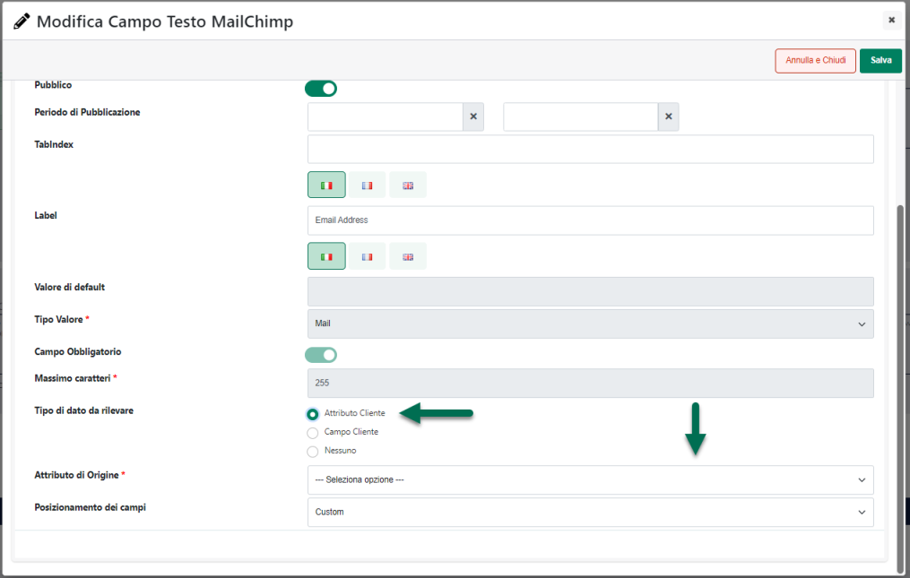
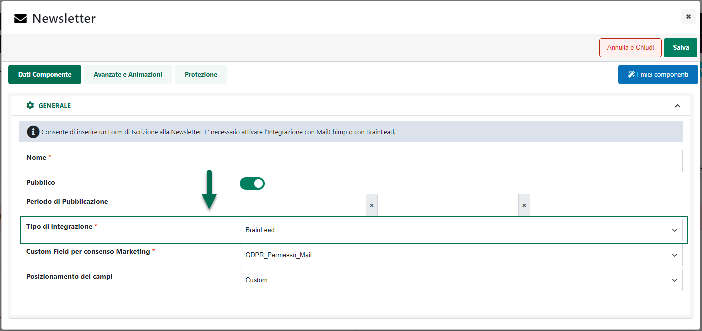

# GESTIONE PAESE

La pagina **"Gestione Paese"** consente di specificare l'elenco dei
paesi, e relative provincie, che dovranno essere gestiti dal proprio
sito Ecommerce.

**ATTENZIONE! In fase di registrazione al sito e/o di definizione degli
indirizzi di spedizione sarà possibile selezionare solo ed
esclusivamente uno dei paesi / province attivati all'interno di questa
sezione del Wizard**

**Va da sé quindi che utenti di paesi non gestiti, non avendo la
possibilità di indicare un indirizzo di fatturazione / spedizione non
potranno, ovviamente, effettuare acquisti all'interno del sito.**

La sezione **"Gestione dei Paesi"** consente di impostare l'elenco dei
paesi gestiti dal proprio sito Ecommerce specificando anche quello che
dovrà essere il "**Paese di default**" e il "**Paese Fiscale**"

Per poter attivare uno specifico paese è sufficiente selezionarlo
dall'elenco di sinistra (campo "**Paesi Usati**") ed inserirlo nel
riquadro di destra cliccando sulla piccola freccia verde rivolta verso
destra.

Allo stesso modo, per eliminare dall'elenco dei paesi gestiti uno
specifico paese, è sufficiente selezionarlo dall'elenco di destra e
reinserirlo nel riquadro di sinistra cliccando sulla piccola freccia
rossa rivolta verso sinistra

Una volta definito l'elenco dei paesi gestiti, il pulsante **"Salva",**
presente nella parte bassa della sezione "Gestione dei Paesi",
permetterà di salvare e di rendere permanenti le nuove impostazioni.

Il pulsante "**Importa Paesi**" (
 ) consente invece di indicare in maniera
massiva l'elenco dei paesi da attivare.

Cliccando su questo pulsante verrà quindi aperta la maschera "**File
Paesi Gestiti**" mediante la quale poter effettuare l'upload di un file
csv contenente le informazioni desiderate.

Nello specifico all'interno di questa sezione sarà necessario indicare:

- **File (csv-txt):** consente di selezionare il file txt o csv
  contenente l'elenco dei paesi da attivare

Affinchè la procedura di import possa funzionare in maniera corretta e i
paesi indicati all'interno del file possano essere attivati, dovranno
essere rispettate delle regole ben precise.

Nello specifico:

- Il file da importare deve avere estensione .csv o .txt

- Il file di importazione deve soddisfare le specifiche del formato
  RFC4180

- Il file deve essere privo di intestazione

- Il file deve contenere un record (quindi una riga) per ogni paese da
  attivare. **Il nome dei paesi dovrà coincidere esattamente con uno di
  quelli presenti nell'elenco di sinistra in corrispondenza del
  parametro "Paesi Usati" precedentemente analizzato**

> **[ESEMPIO]{.underline}**
>
> *France*
>
> *Germany*
>
> *Italy*
>
> *Luxembourg*
>
> *San Marino*

Il parametro "**Elimina Paesi non presenti nel file**" consente invece,
se selezionato, di eliminare dall'elenco dei paesi gestiti eventuali
paesi non indicati nel file di importazione

**L'appartenenza di un visitatore del sito ad uno specifico paese verrà
determinata, in prima istanza sulla base della lingua impostata sul
browser utilizzato per navigare il sito. Nel caso in cui tale lingua sia
priva dell'indicazione dello specifico paese, la provenienza del
visitatore verrà determinata invece sulla base del suo indirizzo IP.**

Come evidenziato all'interno della sezione "*Sito -- Gestione Lingue del
sito*" di questo manuale, occorre infatti ricordare che la lingua
impostata per il proprio browser potrebbe essere generica -- es. Inglese
-- oppure potrebbe essere riferita anche ad uno specifico paese -- es.
Inglese (Stati Uniti) --.

Ora, mentre per la visualizzazione dei testi del sito il fatto di
utilizzare una lingua generica piuttosto che una lingua riferita ad uno
specifico paese non ha molta importanza, nel senso che il sito, posto di
aver ovviamente gestito la lingua inglese, verrà aperto in tale lingua
sia che il browser utilizzato per visitarlo sia impostato con la lingua
Inglese o con quella Inglese (Stati Uniti), questa stessa impostazione
potrebbe invece avere effetti diversi per quel che riguarda la
geolocalizzazione delle valute, di eventuali gruppi di utenti definiti
proprio sulla base del paese di provenienza e per quel che riguarda
anche l'elenco dei paesi gestiti.

In questi casi infatti diventa di fondamentale importanza conoscere non
solo la lingua ma anche lo specifico paese di provenienza dell'utente.

In questo senso è quindi bene evidenziare che:

- nel caso in cui la lingua impostata per il browser utilizzato
  dall'utente faccia riferimento anche allo specifico paese -- es.
  Inglese (Stati Uniti) -- Passweb utilizzerà questa informazione per
  determinare la corretta valuta di gestione del sito, l'eventuale
  appartenenza dell'utente stesso ad uno dei gruppi definiti sulla base
  di specifici paesi oltre che per determinare se l'utente proviene o
  meno da uno dei paesi gestiti all'interno del sito.

- nel caso in cui la lingua impostata per il browser utilizzato
  dall'utente sia generica -- es. Inglese -- per determinare la corretta
  valuta di gestione, l'eventuale appartenenza dell'utente stesso ad uno
  dei gruppi definiti sulla base di specifici paesi oltre per
  determinare se l'utente proviene o meno da uno dei paesi gestiti
  all'interno del sito, Passweb utilizzerà l'indirizzo IP associato
  all'utente che sta navigando il sito stesso.

**ATTENZIONE! La corrispondenza Indirizzo IP -- Paese di provenienza è
determinata automaticamente da Passweb sulla base di un servizio
gratuito di tipo "light" la cui precisione potrebbe non essere quindi
garantita al 100% soprattutto in virtù di eventuali riassegnazioni degli
indirizzi IP da parte dei vari provider.**

I due campi "**Paese di default**" e "**Paese Fiscale**"

consentono rispettivamente di

- **Paese di Default:** consente di indicare, selezionandolo tra
  l'elenco dei paesi gestiti, quello da considerare come paese di
  Default e che dovrà quindi determinare la "Cultura" e le conseguenti
  impostazioni di visualizzazione nel caso in cui il paese di
  appartenenza dell'utente attualmente connesso al sito non rientri
  nell'elenco dei paesi gestiti

> **ATTENZIONE!** Nel caso in cui il paese di appartenenza dell'utente
> attualmente connesso non dovesse rientrare tra i paesi gestiti, verrà
> applicata la "Cultura" e le conseguenti impostazioni di
> visualizzazione relative al paese indicato in corrispondenza di questo
> parametro

- **Paese Fiscale:** consente di indicare, selezionandolo tra l'elenco
  dei paesi gestiti, quello che dovrà essere considerato come Paese
  Fiscale ossia quello in cui ha residenza fiscale (e conseguente
  partita iva) il proprietario del sito.

> **ATTENZIONE!** l'indicazione del Paese Fiscale diventa di
> fondamentale importanza nel momento in cui si dovesse decidere di
> aderire alla al servizio di **sportello unico OSS (One Stop Shop)**
> attivando dunque in Passweb la corrispondente gestione delle Tasse di
> tipo IVA.
>
> Il paese indicato in corrispondenza di questo parametro (tipicamente
> l'Italia) verrà infatti escluso dall'elenco dei paesi europei
> gestibili mediante OSS
>
> Per maggiori informazioni in merito si veda anche quanto indicato
> all'interno dei capitoli "*Ordini -- Tasse -- One Stop Shop (OSS)*" e
> "*Ordini -- Ordini -- Configurazione Ordini -- Impostazioni generali*"
> di questo manuale.

La sezione "**Gestione dei Distretti**", infine, consente di definire
l'elenco delle provincie gestite.

**ATTENZIONE! Come già per i Paesi, anche in questo caso, in fase di
registrazione al sito e/o di definizione degli indirizzi di spedizione
sarà possibile selezionare solo ed esclusivamente una delle provincie
effettivamente gestite.**

In questo caso nella list box di sinistra sono indicate tutte le
provincie dei Paesi attualmente gestiti (quelli presenti nella list box
di destra della sezione "Gestione dei Paesi").

**Nella list box di destra sono indicate invece le provincie attualmente
escluse, quelle cioè in relazione alle quali non sarà possibile definire
un indirizzo di spedizione e/o di fatturazione.**

A default sono quindi correttamente gestite tutte le province dei Paesi
effettivamente abilitati per il proprio sito Ecommerce.

Nel momento in cui si desideri disattivare alcune di queste provincie
(impendo di fatto agli utenti del sito di selezionarle in fase di
registrazione e/o di definizione degli indirizzi di spedizione) sarà
sufficiente selezionarle dall'elenco di sinistra ed inserirle in quello
di destra cliccando sulla piccola freccia rivolta verso destra.

Allo stesso modo nel momento in cui si dovesse riattivare una delle
provincie precedentemente escluse, sarà sufficiente selezionarla
dall'elenco di destra ed inserirla nuovamente in quello di sinistra
cliccando per questo sulla piccola freccia rivolta verso sinistra

Anche in questo caso, il pulsante **"Salva",** presente nella parte
bassa della sezione "Gestione dei Distretti", permetterà di salvare e di
rendere permanenti le nuove impostazioni.

