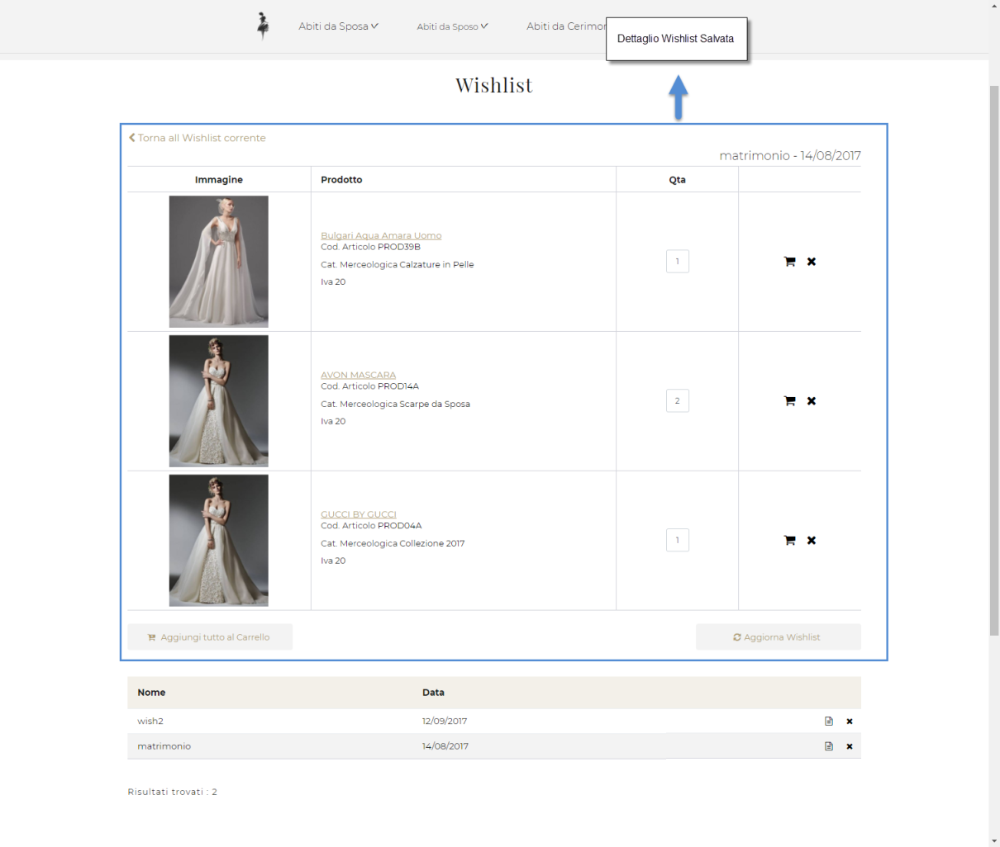
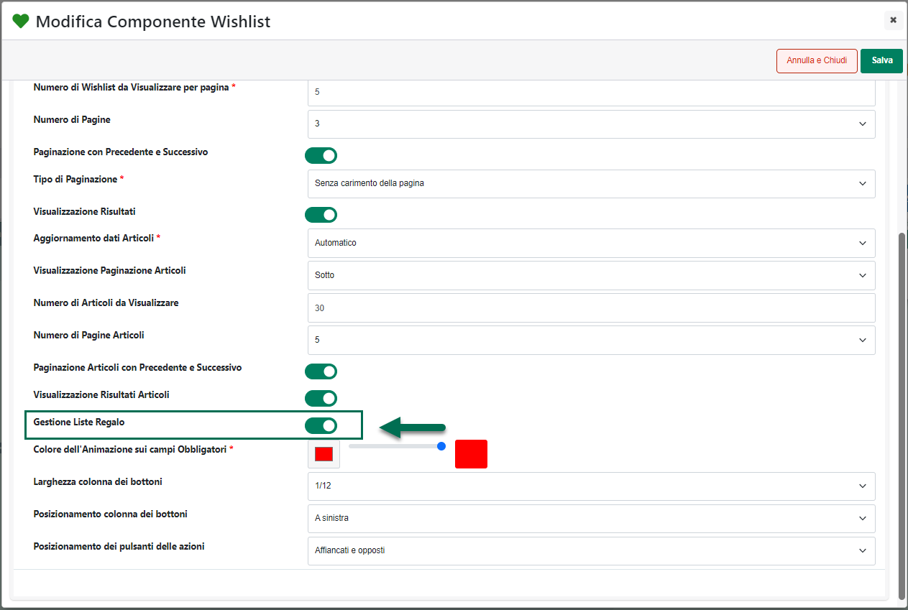

# GESTIONE SPRIX

La pagina **"Gestione Sprix"** accessibile, **solo per siti Ecommerce
collegati a Mexal**, dalla voce di menu principale **"Configurazione -
Sprix"** consente di definire una serie di eseguibili sprix che potranno
poi essere lanciati direttamente dall'Area Riservata del sito web
utilizzando i comandi dello Sprix Remoto o le Web Api Mexal.

Nello specifico sarà possibile definire due diversi tipi di sprix:

- **Sprix "standard"** che fanno riferimento a funzioni cablate
  all'interno dell'applicazione e che consentono, ad esempio, di
  visualizzare direttamente all'interno del sito informazioni relative
  allo scadenzario o all'estratto conto di specifici clienti.

> **Sprix di questo tipo verranno eseguiti solo ed esclusivamente
> mediante Sprix Remoto**

- **Sprix "personali"** che fanno riferimento cioè a specifici
  eseguibili creati direttamente dall'utente all'interno del gestionale

> A differenza degli sprix standard, quelli personali **potranno essere
> eseguiti mediante Sprix Remoto oppure mediante Web Api**

**ATTENZIONE!** in ogni caso il risultato delle elaborazioni effettuate
all'interno del gestionale dagli sprix richiamati da area riservata
verrà gestito sempre mediante il salvataggio, all'interno del sito, di
un apposito file.

All'interno della pagina viene visualizzata la maschera "**Gestione
Sprix**"

contenente l'elenco degli eseguibili attualmente codificati e
richiamabili quindi dall'Area Riservata del proprio sito web.

Il campo di ricerca attivabile cliccando sulla lente di ingrandimento,
presente in testata di ogni singola colonna, consente di filtrare i dati
in griglia sulla base dei valori presenti all'interno della colonna
stessa.

Una volta impostato un filtro di ricerca, per poterlo poi eliminare sarà
sufficiente cliccare sull'icona raffigurante una piccola lente di
ingrandimento con un -- all'interno (
 ) che comparirà in testata alla colonna
in corrispondenza della quale è stato impostato il filtro stesso.

Infine è anche possibile ordinare, in maniera crescente e/o decrescente,
gli elementi in griglia cliccando semplicemente sull'icona raffigurante
due piccole frecce posta anch' essa in testata ad ogni singola colonna
della griglia (
 )

I pulsanti presenti nella corrispondente barra degli strumenti
consentono rispettivamente di:

**Elimina** **(**
 **)**: consente di eliminare
definitivamente lo sprix attualmente selezionato in elenco.

**ATTENZIONE!** il pulsante "Elimina" consente, ovviamente, di eliminare
soltanto la mappatura dell'eseguibile all'interno del sito E-commerce.
L'eseguibile vero e proprio continuerà ad esistere all'interno del
gestionale ed è solo dal gestionale che potrà quindi essere fisicamente
eliminato.

**Modifica** **(**
 **)**: consente di modificare i
parametri di configurazione utilizzati per mappare lo sprix attualmente
selezionato in elenco

**Modifica Parametri**
**(** **)**: consente di accedere alla gestione
dei parametri dello sprix attualmente selezionato in elenco (per
maggiori informazioni in merito si vedano anche i successivi capitoli di
questo manuale)

**Nuovo**
**(** **)**: consente di mappare un nuovo sprix
(che, ovviamente, dovrà essere già stato creato all'interno del
gestionale)

Cliccando su questo pulsante verrà quindi visualizzata la maschera
"**Nuovo Sprix**"

all'interno della quale poter indicare, innanzitutto, un valore per il
parametro "Tipologia"

**Tipologia**: consente di definire la tipologia dello sprix che si
intende mappare e che dovrà quindi essere poi richiamato ed eseguito
dalla corrispondente sezione dell'Area Riservata del proprio sito
Ecommerce.

E' possibile selezionare una delle seguenti opzioni:

- **Estratto conto**: consente di mappare lo sprix "standard" utilizzato
  all'interno del gestionale per ottenere informazioni sull'estratto
  conto di un determinato cliente

- **Scadenzario**: consente di mappare lo sprix "standard" utilizzato
  all'interno del gestionale per ottenere informazioni sullo scadenzario
  di un determinato cliente

- **Altri**: consente di mappare uno sprix "personale" appositamente
  creato all'interno del gestionale

Dipendentemente dal valore impostato in corrispondenza di questo campo
sarà poi necessario andare a settare altri parametri di configurazione
oltre a costruire in un certo modo il form da utilizzare in Area
Riservata per passare i dati richiesti allo sprix che verrà poi eseguito
all'interno del gestionale.

Per maggiori informazioni in merito si veda quanto indicato nei
successivi capitoli di questo manuale

