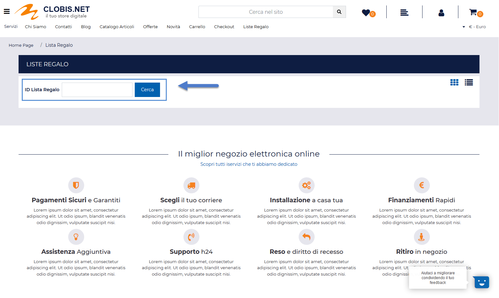
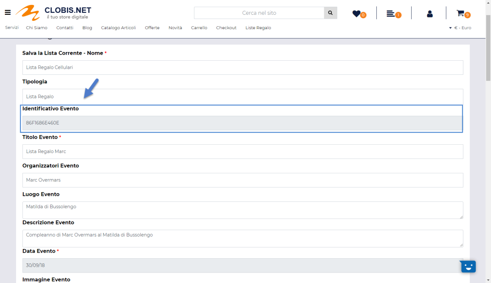
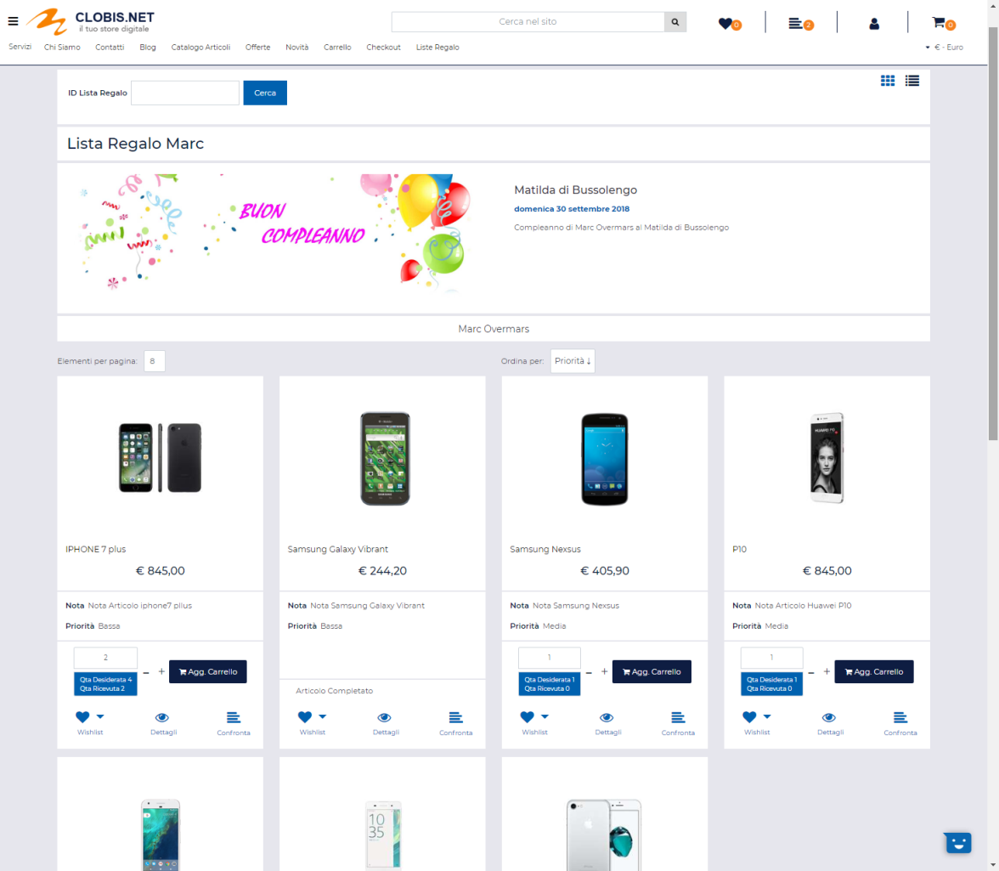
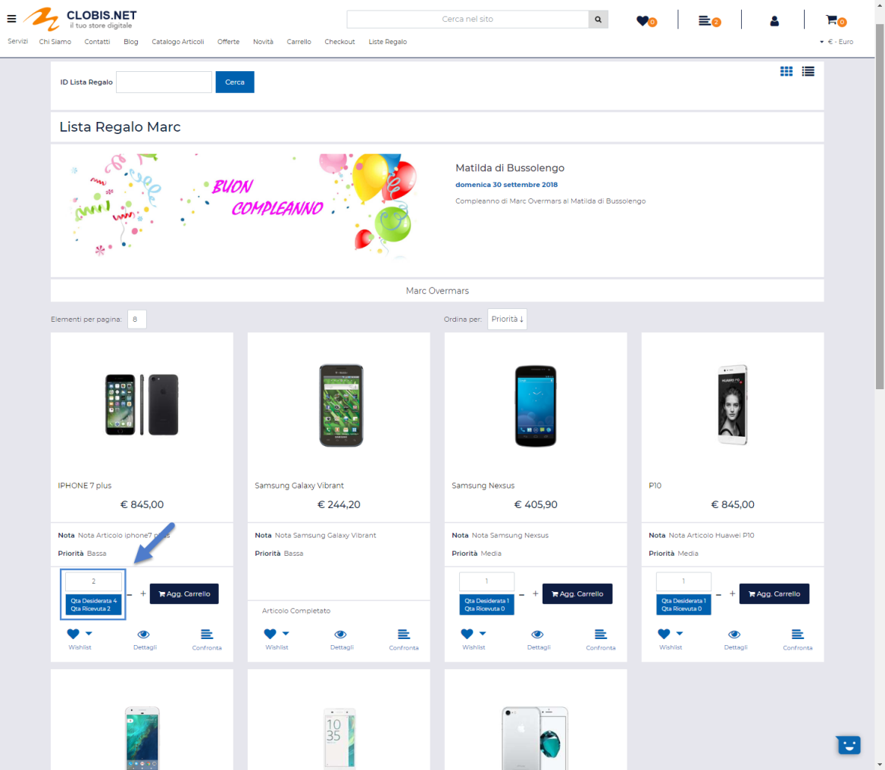
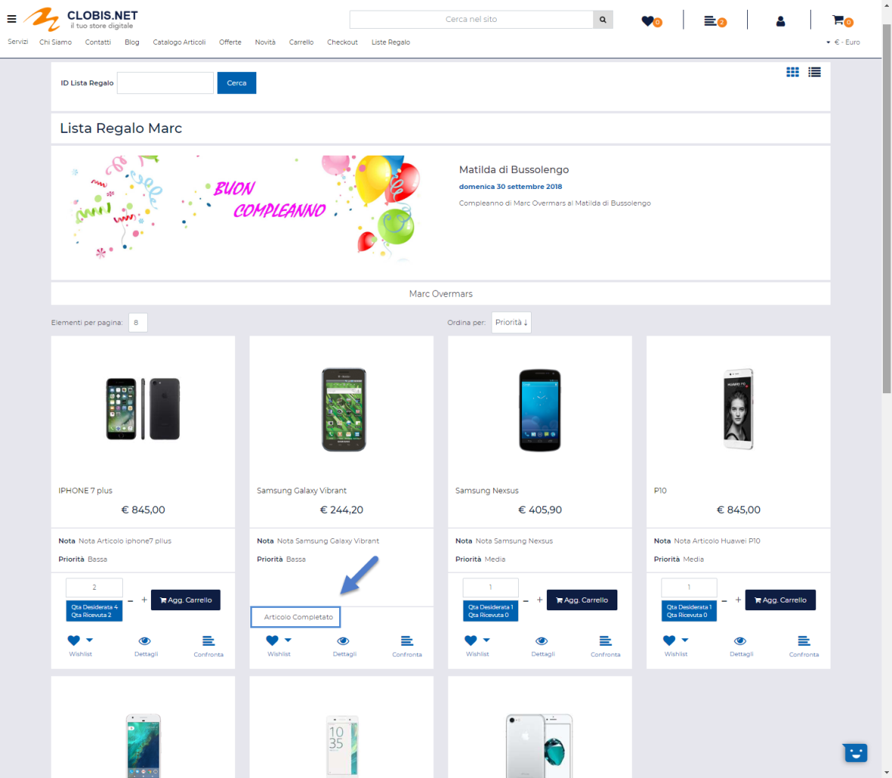

# MYDB

La pagina **"Campi MyDB"** accessibile, **solo per siti Ecommerce
collegati a Mexal**, dalla voce di menu principale **"Configurazione -
MyDB"** consente di definire e mappare i campi delle tabelle MyDB che
potranno poi essere utilizzati all'interno del sito per estendere le
anagrafiche di articoli e clienti.

In questo senso è di fondamentale importanza evidenziare che all'interno
di Passweb è possibile gestire **solo ed esclusivamente:**

- **tabelle di tipo "Anagrafica MyDB" che sono estensioni Standard o
  Riportabili delle tabelle Articoli e/o Clienti**

- **tabelle con Estensione Univoca** in cui per ogni singolo articolo /
  cliente viene definito un singolo record

Per maggiori informazioni relativamente a come poter creare e gestire
all'interno di Mexal questo tipo di elementi si rimanda all'apposita
documentazione di prodotto.

**ATTENZIONE! La voce di menu "MyDB" sarà visibile solo se la versione
del gestionale collegato al sito è maggiore o uguale alla 2021A
(v.80.5).**

Allo stesso modo sarà possibile accedere a questa specifica sezione del
Wizard solo nel caso in cui per l'utente attualmente loggato sia stato
opportunamente settato il permesso "**Gestione MyDB**" (gestibile alla
pagina "*Utenti -- Utenti Passweb -- Utenti*" del Wizard)

Una volta effettuato l'accesso a questa sezione del Wizard verrà quindi
visualizzata la maschera Campi MyDB

contenente l'elenco di tutti i campi delle tabelle MyDB attualmente
mappati (e utilizzabili quindi all'interno del proprio sito Passweb)

Il campo di ricerca attivabile cliccando sulla lente di ingrandimento,
presente in testata di ogni singola colonna, consente di filtrare i dati
in griglia sulla base dei valori presenti all'interno della colonna
stessa.

Una volta impostato un filtro di ricerca, per poterlo poi eliminare sarà
sufficiente cliccare sull'icona raffigurante una piccola lente di
ingrandimento con un -- all'interno (
 ) che comparirà in testata alla colonna
in corrispondenza della quale è stato impostato il filtro stesso.

Infine è anche possibile ordinare, in maniera crescente e/o decrescente,
gli elementi in griglia cliccando semplicemente sull'icona raffigurante
due piccole frecce posta anch' essa in testata ad ogni singola colonna
della griglia (
 )

I pulsanti presenti nella contestuale barra degli strumenti consentono
rispettivamente di:

- **Modifica Campo** **(**
   **):** consente di modificare la
  configurazione del campo attualmente selezionato in elenco.

> **ATTENZIONE!** Non tutti i parametri di un campo già creato possono
> essere modificati

- **Elimina Campo** **(**
   **):** consente di eliminare il campo
  attualmente selezionato in elenco

> **ATTENZIONE!** Non è possibile eliminare campi attualmente utilizzati
> all'interno del sito
>
> Nel momento in cui si tentasse quindi di eliminare un campo
> effettivamente utilizzato all'interno del sito, e quindi associato ad
> un determinato attributo (articolo o cliente), in fase di conferma
> verrà visualizzato un apposito messaggio di errore.

- **Aggiungi Campo** **(**
   **):** consente di creare un nuovo campo che dovrà
  poi essere mappato con uno dei campi delle tabelle MyDB presenti in
  Mexal ed effettivamente utilizzabile su Passweb.

**ATTENZIONE!** **Per creare e mappare all'interno di Passweb un nuovo
campo di una tabella MyDB è necessario, ovviamente, che il campo in
questione sia stato preventivamente creato all'interno di Mexal.**

Nei successivi capitoli di questo manuale verrà analizzata più nel
dettaglio la procedura da seguire per poter cerare questo tipo di campi
mappandoli con i corrispondenti campi delle tabelle MyDB di Mexal, e
come poterli poi utilizzare all'interno del proprio sito Ecommerce

