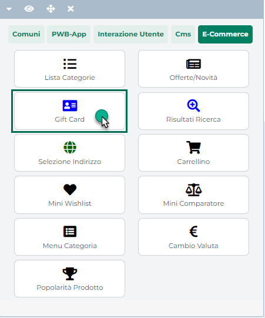

# TIPO DI ESTENSIONE

Consente di indicare se la tabella MyDB all'interno della quale si trova
il campo che si intende mappare è una tabella Riportabile o Standard
(cioè non riportabile sui documenti)

Quanto indicato in corrispondenza di questo parametro deve coincidere
esattamente con la tipologia di estensione dichiarata in Mexal per la
corrispondente tabella MyDB (campo **Tipo** **Estensione**)

E' possibile selezionare uno dei seguenti valori:

- **Riportabile**: tale opzione andrà selezionata nel momento in cui il
  parametro "**Tipo** **Estensione**" della tabella MyDB in cui si trova
  il campo che intendiamo mappare, dovesse essere stato impostato
  sull'analogo valore "**Riportabile**"

- **Standard**: tale opzione andrà selezionata nel momento in cui il
  parametro "**Tipo** **Estensione**" della tabella MyDB in cui si trova
  il campo che intendiamo mappare, dovesse essere stato impostato
  sull'analogo valore "**Standard**"

Anche in questo caso, nel momento in cui si dovesse tentare di creare un
nuovo campo Passweb appartenente ad una Tabella MyDB per cui è già stato
creato un altro campo, indicando ora per la stessa Tabella un "Tipo di
Estensione" diversa da quella dichiarata in precedenza, in fase di
salvataggio verrà ritornato un apposito messaggio di errore.

