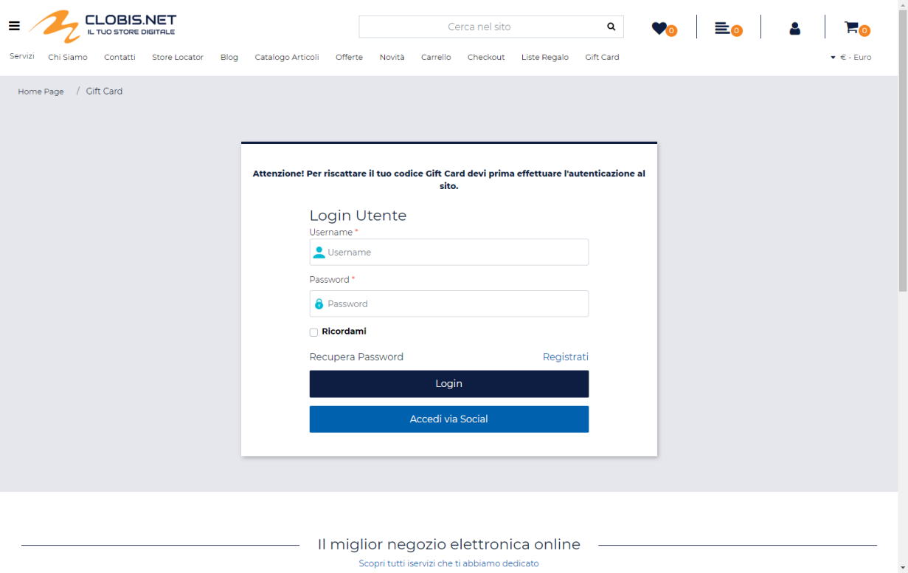
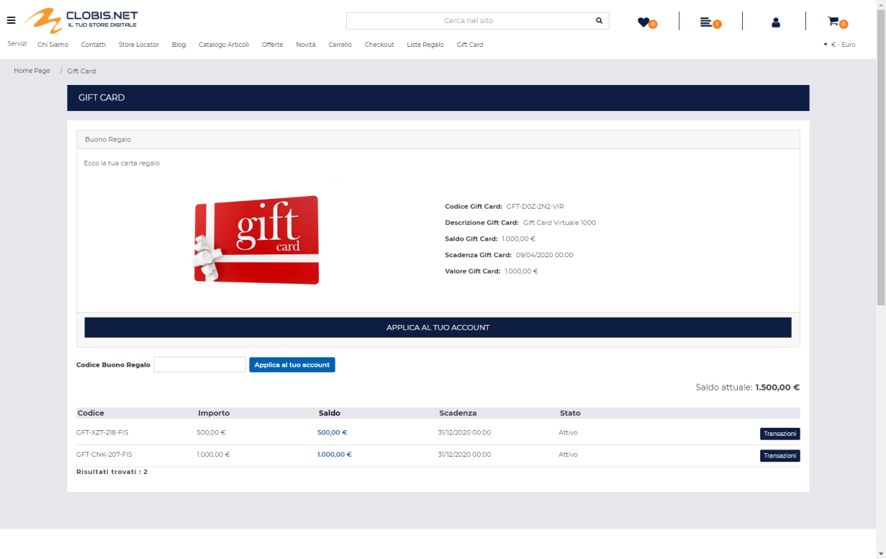
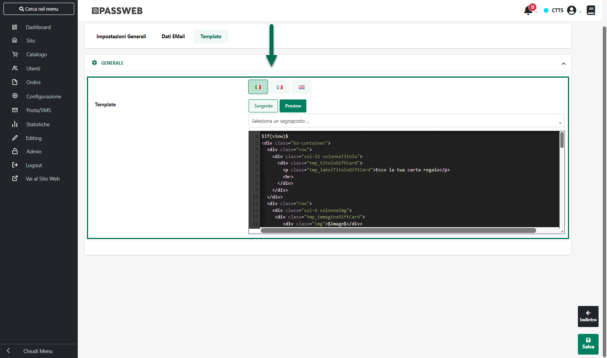
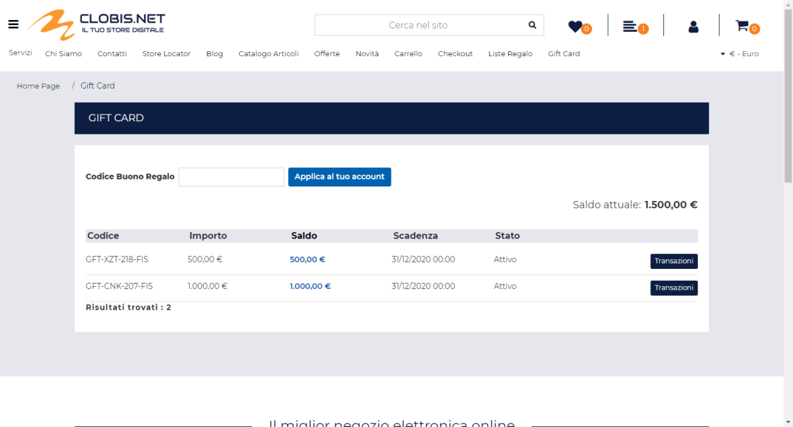
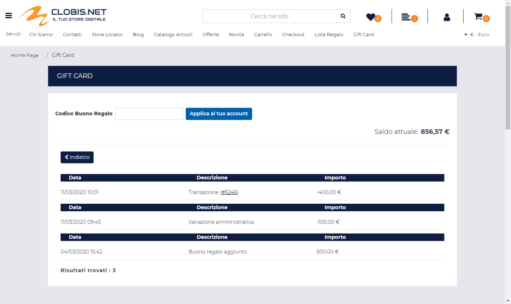

# RIPORTO

Consente di indicare in quale sezione del documento dovrà essere
riportato il campo che si intende mappare (disponibile, ovviamente, solo
per Tabelle MyDB Riportabili).

**ATTENZIONE! Il parametro "Riporto" è visibile solo nel caso in cui il
precedente campo "Tipo di Estensione" sia stato impostato sul valore
"Riportabile"**

L'unica opzione gestita è quella che consente di rendere il campo che si
intende mappare riportabile sulla Testata dei documenti Cliente.

In questo senso il parametro in esame dovrà quindi essere impostato in
maniera diversa a seconda del fatto che il campo MyDB da mappare sia
quello di una tabella definita come estensione dei campi Articolo o come
estensione dei campi Cliente (in ogni caso il valore inserito dovrà
essere coerente con quello indicato per il parametro "**Rip**" del
corrispondente campo MyDB)

Nel primo caso (**Tabella MyDB definita come estensione dei campo
Articolo**) l'unico valore possibile su cui impostare il parametro in
oggetto sarà **DMRT**

**ATTENZIONE!** In queste condizioni inoltre, lato Mexal, non è visibile
il corrispondente campo "**Rip**"

Nel secondo caso (**Tabella MyDB definita come estensione dei campi
Utente**) i valori ammessi saranno due. Nello specifico:

- Se la Tabella MyDB è stata definita come **estensione di campi
  Cliente** oppure come **estensione dei campi Fornitore** il parametro
  in oggetto dovrà essere impostato sul valore **DMTC.**

> Lo stesso valore, corrispondente all'opzione "**Testate Documenti
> Cliente**", dovrà comparire ovviamente anche in corrispondenza del
> parametro "**Rip**" del campo MyDB

- Se la Tabella MyDB è stata definita come **estensione di campi Cliente
  e Fornitore** il parametro in oggetto dovrà essere impostato sul
  valore **DMTX**

> In questo caso il parametro "**Rip**" del corrispondente campo MyDB
> dovrà essere impostato sul valore **DMT+** (corrispondente all'opzione
> "**Testate documenti cli / for**")

