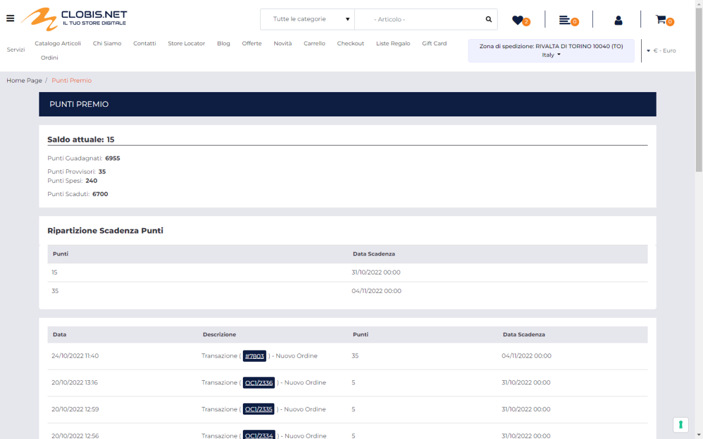

# TIPO

Consente di indicare la tipologia del campo MyDB che si intende mappare.

Il valore da inserire all'interno di questo campo dovrà quindi essere
coerente con quanto impostato in corrispondenza dell'omonimo parametro
del campo MyDB (campo **Tipo**)

E' possibile impostare uno dei seguenti valori:

- **Alfanumerico:** selezionando questa opzione il relativo campo MyDB
  dovrà contenere un dato alfanumerico e dovrà quindi essere, ad
  esempio, di tipo Alfanumerico, Alfanumerico maiuscolo, Didascalia ...

- **Numerico:** selezionando questa opzione il relativo campo MyDB dovrà
  contenere un numero intero e dovrà quindi essere di tipo Numerico (max
  ln:10)

- **Decimale**: selezionando questa opzione il relativo campo MyDB dovrà
  contenere un numero decimale e potrà quindi essere di tipo Numerico
  con virgola mobile o Numerico 0 (1/2/3/4/5/6) decimali

