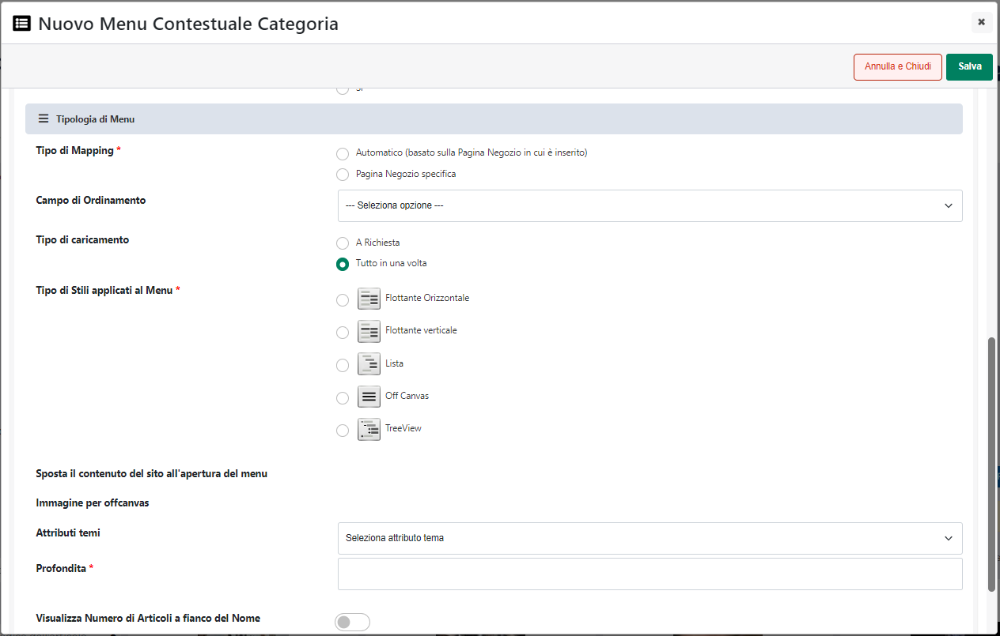
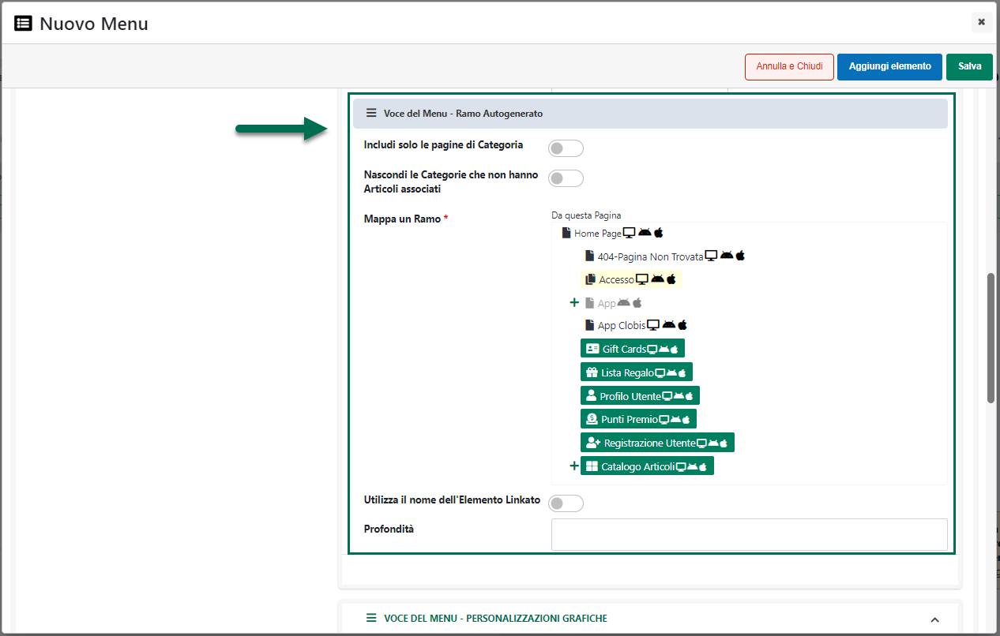

# FLUSH MANUALE

Impostando il parametro **Flush** sul valore "**Manuale**" il reset
della cache dovrà poi essere effettuato, quando necessario, direttamente
dall'amministratore del sito cliccando per questo sul pulsante **Flush
Cache** presente in corrispondenza della cache di pagina (sezione
"Tipologie di Cache") oppure sul pulsante **Reset Cache**
{width="0.6625in"
height="0.2076388888888889in"} (sezione "**Gestione Cache**")

{width="5.5777777777777775in"
height="3.5194444444444444in"}

**ATTENZIONE!** Questo tipo di impostazione potrebbe garantire tempi di
conservazione delle cache più lunghi e quindi prestazioni del sito più
elevate. Ovviamente andrebbe però abilitata solo nel momento in cui le
variazioni ai dati del sito (prezzi, immagini, informazioni articolo,
parametri di configurazione ...) dovessero avvenire con una frequenza
piuttosto bassa.

