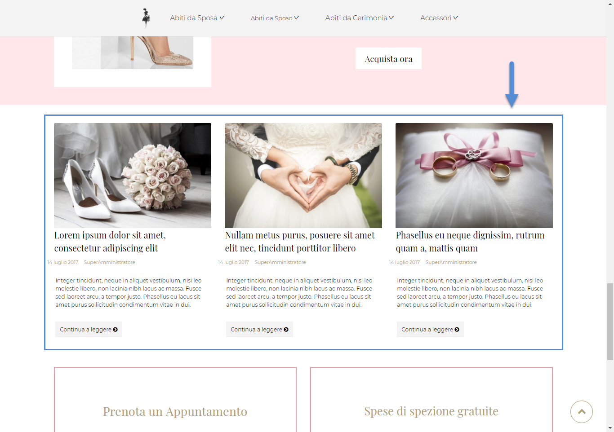
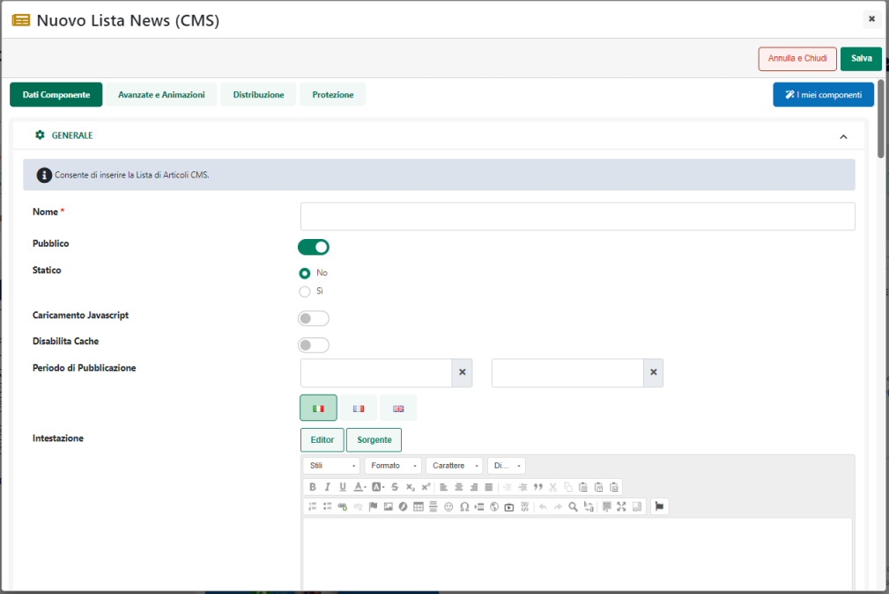
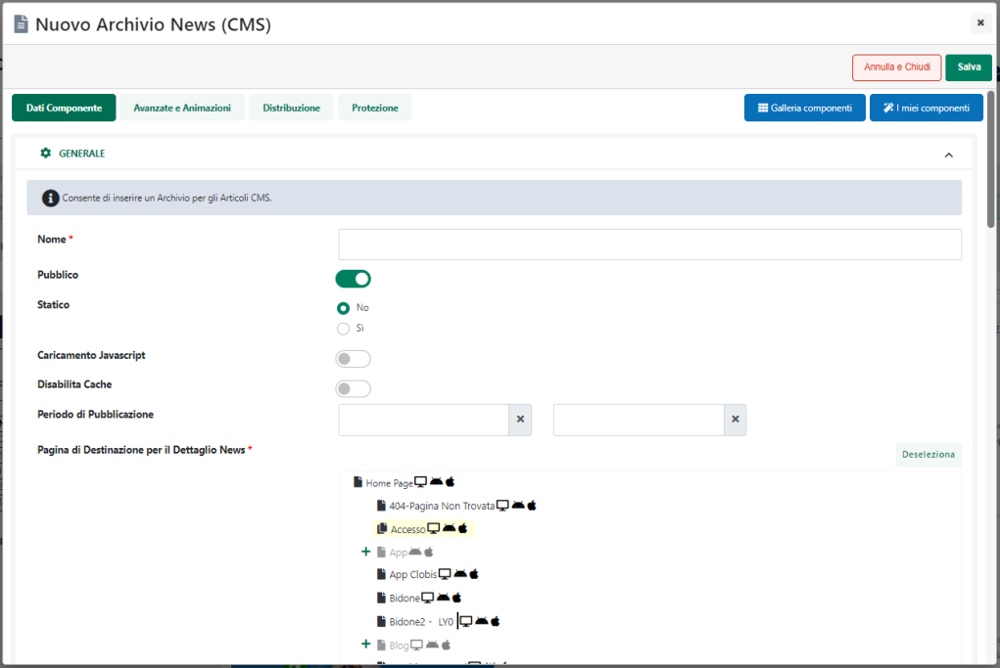

# IUBENDA

Nel momento in cui l'esigenza dovesse essere quella di attivare e
gestire il blocco preventivo dei cookie appoggiandosi alla piattaforma
di Iubenda (<https://www.iubenda.com> )sarà necessario:

1.  Configurare su Iubenda tutto il necessario per generare
    correttamente sia l'Informativa estesa (**Privacy Cookie Policy**)
    che il Banner necessario per gestire l'Informativa breve (**Cookie
    Solution**)

> In particolare in fase di generazione e configurazione della Cookie
> Solution di Iubenda sarà necessario, tra le altre cose:

- Accertarsi di aver abilitato la configurazione manuale

> In caso di configurazione automatica infatti lo snippet di codice
> fornito da Iubenda che dovrà poi essere inserito all'interno del sito
> potrebbe bloccare indistintamente tutti gli script compresi quelli
> indispensabili per un corretto funzionamento del sito stesso

- Accertarsi di aver correttamente selezionato il parametro "**Consenti
  un controllo specifico per categoria**" e di aver selezionato tutte le
  categorie di consenso per cui potrebbe poi essere possibile impostare
  in Passweb uno specifico valore di default

> Per maggiori informazioni relativamente a come configurare in Iubenda
> l'Informativa estesa e la Cookie Solution si rimanda alla specifica
> documentazione di prodotto presente sul relativo portale

2.  Una volta completata la configurazione della propria Cookie Solution
    sarà necessario prelevare dal sito di Iubenda il codice di
    integrazione

> ed inserirlo all'interno del campo "**Code Snippet Cookie**" presente
> alla pagina "**Sito -- Preferenze**" del Wizard (tab "**Tracciamento
> Dati**" sezione "**Blocco Preventivo**")

> **ATTENZIONE!** per poter garantire il corretto ordine di esecuzione
> dei vari script, e quindi la corretta implementazione della Consent
> Mode, è indispensabile che lo snippet di codice fornito da Iubenda sia
> inserito esattamente all'interno del campo evidenziato in figura

3.  Impostare il parametro "**Blocco Preventivo dei Cookie**" presente
    anch'esso alla pagina "**Sito -- Preferenze**" del Wizard (tab
    "**Tracciamento Dati**") sul valore "**Iubenda + Consent Mode (v2
    Base)**" o "**Iubenda + Consent Mode (v2 Avanzata)**"
    (dipendentemente dal fatto di voler gestire o meno la Consent Mode
    in modalità Base o Avanzata)

> **ATTENZIONE!** per maggiori informazioni in merito al funzionamento
> della Consent Mode e a cosa comporti effettivamente implementarla in
> modalità Base o Avanzata si rimanda a quanto indicato all'interno del
> capitolo "*Google Analytics -- Consent Mode*" di questo manuale
>
> L'impostazione di questo parametro garantisce che il blocco preventivo
> dei cookie effettuato da Iubenda funzioni correttamente in relazione
> a:

- Componenti nativi di Passweb che fanno uso di **Google Map** (es.
  Google Map, Store locator ecc...)

- Componente nativo di Passweb per la gestione dei **Video** (YouTube,
  Vimeo)

- **Video di YouTube o di Vimeo** inseriti nella pagina web mediante
  componenti Paragrafo, HTML o CMS e quindi mediante l'utilizzo
  esplicito di un tag \< iframe \> con src impostata sui domini
  [www.youtube.com](http://www.youtube.com) oppure su
  [www.vimeo.com](http://www.vimeo.com)

> **ATTENZIONE!** per maggiori informazioni in merito al blocco
> automatico di video YouTube o Vimeo non gestiti con il componente
> "Video" di Passweb si veda anche quanto indicato al punto 6

- Utilizzo di **Google Recaptcha** (mediante l'apposita funzione e i
  relativi componenti Passweb)

- Attivazione del tracciamento di **Google Analytics** (implementato
  mediante le funzionalità native di Passweb)

- Attivazione del tracciamento **Facebook** (implementato mediante le
  funzionalità native di Passweb)

- Attivazione del tracciamento **Brainlead** (implementato mediante le
  funzionalità native di Passweb)

> **ATTENZIONE!** Nel momento in cui si dovesse decidere di implementare
> un sistema di tracciamento come Google Analytics o Facebook Pixel
> esternamente a Passweb, sfruttando quindi sistemi come Google Tag
> Manager, Passweb non sarà più responsabile del blocco preventivo dei
> cookie, blocco questo che dovrà quindi essere implementato anch'esso
> esternamente alla piattaforma.
>
> In queste condizioni dunque nel momento in cui un visitatore dovesse
> accedere ad una pagina del sito in cui è presente, ad esempio, un
> componente Google Map o un Video YouTube, il blocco preventivo di
> Iubenda si preoccuperà di disattivare tali componenti impedendo quindi
> il rilascio dei relativi cookie fintanto che l'utente non decida di
> accettarne l'utilizzo cliccando sull'apposito pulsante presente
> all'interno del banner dell'Informativa Breve.
>
> Una volta accettato l'utilizzo dei cookie questi componenti verranno
> sbloccati e tutto tornerà a funzionare correttamente.

4.  Nel momento in cui si dovesse decidere di implementare all'interno
    del proprio sito l'integrazione con un qualunque altro servizio di
    terze parti che dovesse far uso di cookie non strettamente tecnici
    (es. Hotjar, Pulsanti social, live chat ...), l'amministratore del
    sito dovrà preoccuparsi di attivare, anche in merito a questi stessi
    servizi, il blocco preventivo dei cookie di Iubenda.

> **ATTENZIONE!** eventuali servizi di terze parti installati sul sito
> che dovessero rilasciare cookie non tecnici dovranno essere bloccati
> mediante operazioni di tagging manuale.
>
> **Non dovrà quindi mai essere attivata l'opzione di blocco automatico
> offerto dalla piattaforma terza, cosa questa che potrebbe
> compromettere il corretto funzionamento del sito.**
>
> **ATTENZIONE! Passweb non può sapere a priori quali servizi di terze
> parti l'utente ha deciso di attivare. In conseguenza di ciò sarà
> compito dell'amministratore del sito verificare se il servizio in
> questione utilizzi effettivamente dei cookie non tecnici, quali siano
> ed eventualmente gestirne il blocco preventivo.**
>
> In questo senso le operazioni da effettuare per attivare il blocco
> preventivo di script che potrebbero installare cookie, prevedono
> essenzialmente di apportare a tali script alcune semplici modifiche in
> maniera tale che Iubenda possa prevenirne l'esecuzione nei casi in cui
> non è stato ancora prestato il relativo consenso
>
> Nello specifico sarà necessario:

- **Applicare a questi script la classe "\_iub_cs_activate"**

- **Cambiare l'attributo type di questi script da text/javascript a
  text/plain** (o eventualmente aggiungere l'attributo type =
  "text/plain" se questo non dovesse essere presente)

> Supponendo quindi che lo script originale sia del tipo di quello di
> seguito indicato
>
> \<script **type = "text/javascript"** src= "file_javascript.js"\>
>
> ....
>
> \</script\>
>
> per poterne prevenire l'esecuzione nei casi in cui non è stato ancora
> prestato il consenso, questo stesso script dovrà essere modificato in
> questo modo
>
> \<script **type = "text/plain"** **class = "\_iub_cs_activate"**
> src=\"file_javascript.js\"\>
>
> ....
>
> \</script\>

5.  La stessa operazione di tagging manuale descritta al punto 4 dovrà
    essere utilizzata anche in relazione a specifici tag \< iframe \>
    inseriti nella pagina web mediante un componente "Paragrafo" o
    "HTML" e per i quali è stato verificato l'utilizzo di cookie non
    tecnici.

> In questo senso infatti occorre ricordare che in determinati casi
> anche l'utilizzo di un semplice \< iframe \> potrebbe portare al
> rilascio di cookie di profilazione o di terze parti che dovranno
> quindi essere sottoposti a blocco preventivo.
>
> **In queste condizioni per evitare il rilascio di cookie prima che
> l'utente abbia espresso il proprio consenso sarà necessario:**

- **Assegnare all'iframe la classe "\_iub_cs_activate"**

- **Assegnare all'iframe l'attributo "type = text/plain"**

- **Inserire il link sorgente dell'iframe nell'attributo
  "suppressedsrc"**

- **Valorizzare l'attributo src con la stringa
  "//cdn.iubenda.com/cookie_solution/empty.html"**

> Supponendo dunque che l'iframe originale per il quale abbiamo
> verificato l'utilizzo di cookie di profilazione sia del tipo
>
> \< iframe **type = "text/html"** src = "http://www.dominiosito.com" \>
> \< /iframe \>
>
> per poter applicare il blocco preventivo dei cookie dovrà essere
> modificato in questo modo
>
> \< iframe **type = "text/plain"** **class = "\_iub_cs_activate"**
> **src = "//cdn.iubenda.com/cookie_solution/empty.html" suppressedsrc =
> "http://www.dominiosito.com"** \>
>
> \< /iframe \>

6.  Fanno eccezione rispetto a quanto indicato al punto 5, i video di
    YouTube e di Vimeo inseriti all'interno della pagina web mediante
    componenti CMS, Paragrafo o HTML e quindi mediante l'utilizzo
    esplicito di un tag \< iframe \>

> In questo senso infatti occorre sottolineare che, attivando il blocco
> preventivo di Iubenda, Passweb effettuerà, in automatico, un controllo
> su tutti gli iframe presenti all'interno del sito che risultino avere
> la sorgente (attributo src) impostata sui seguenti domini:

- **www.youtube.com**

- **www.vimeo.com** con il parametro di querystring **dnt** assente o
  impostato sul valore **0** oppure sul valore **false**

> e, sempre in maniera automatica provvederà a sostituire il markup HTML
> di questi iframe con quello richiesto specificatamente da Iubenda per
> bloccare questo tipo di risorse.
>
> In questo senso è bene sottolineare anche che tanto YouTube quanto
> Vimeo offrono comunque la possibilità di incorporare video all'interno
> di una pagina web senza che questi rilascino cookie di profilazione e
> senza quindi che questi stessi video vengano eventualmente bloccati e
> non mostrati agli utenti che dovessero aver rifiutato l'utilizzo di
> cookie di profilazione (per maggiori informazioni in merito si veda
> anche quanto indicato all'interno del precedente capitolo
> "*Informativa Estesa o Cookie Policy*" di questo manuale).
>
> Nel momento in cui dunque il codice per embeddare i video di YouTube
> e/o di Vimeo all'interno della pagina web dovesse essere generato in
> maniera tale da non far rilasciare a questi video cookie di
> profilazione, il markup del corrispondente iframe non verrebbe
> modificato e i video stessi verrebbero sempre visualizzati
> indipendentemente dalle scelte fatte dagli utenti in materia di
> gestione dei cookie

**ATTENZIONE!** **Per maggiori informazioni relativamente a come poter
implementare con Iubenda il blocco di script o di elementi che
potrebbero installare cookie (anche nel caso in cui Iubenda dovesse
essere stato configurato per gestire il consenso per categoria) si
consiglia di fare riferimento sempre alla relativa guida presente sul
portale di Iubenda
(<https://www.iubenda.com/it/help/674-tagging-manuale-blocco-cookie>)**

