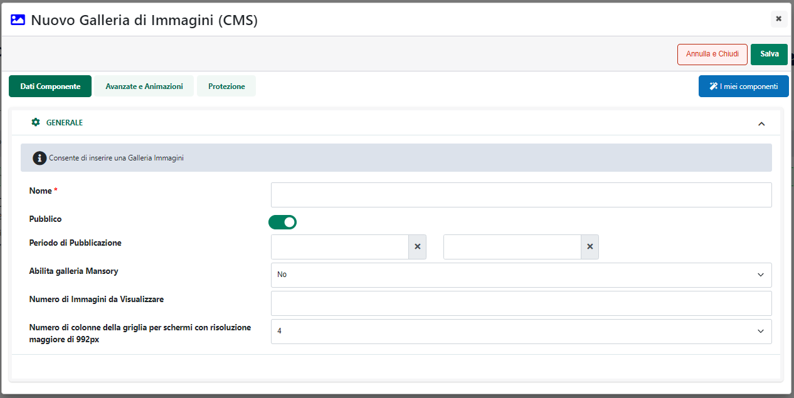

# ATTRIBUTI

La pagina **"Attributi"** accessibile dalla voce di menu ***"Catalogo --
Attributi Articoli -- Attributi"***, consente di definire e gestire i
singoli attributi, siano essi corrispondenti a specifici campi Mexal o
definiti direttamente all'interno di Passweb, che potranno poi essere
utilizzati per fornire maggiori informazioni sui prodotti presenti
all'interno del proprio sito e-commerce e/o per categorizzarli e
facilitarne quindi la ricerca all'interno del sito.

All'interno di questa pagina viene visualizzata la maschera **"Attributi
per il Catalogo"**

contenente l'elenco di Attributi che andranno a definire **l'anagrafica
articoli Passweb**.

Il campo di ricerca attivabile cliccando sulla lente di ingrandimento,
presente in testata di ogni singola colonna, consente di filtrare i dati
in griglia sulla base dei valori presenti all'interno della colonna
stessa.

Una volta impostato un filtro di ricerca, per poterlo poi eliminare sarà
sufficiente cliccare sull'icona raffigurante una piccola lente di
ingrandimento con un -- all'interno (
 ) che comparirà in testata alla colonna
in corrispondenza della quale è stato impostato il filtro stesso.

Infine è anche possibile ordinare, in maniera crescente e/o decrescente,
gli elementi in griglia cliccando semplicemente sull'icona raffigurante
due piccole frecce posta anch' essa in testata ad ogni singola colonna
della griglia (
 )

La colonna "**Campo Mexal**" consente di visualizzare il campo della
Videata Aggiuntiva Mexal con cui risulta mappato il corrispondente
Attributo Articolo

La colonna "**Riportabile**" permette di capire immediatamente se il
corrispondente Attributo è o meno "Riportabile" e quindi se sarà o meno
visualizzabile anche all'interno dei vari documenti (per maggiori
informazioni in merito agli Attributi Articolo Riportabili e a come
utilizzarli e visualizzarli anche all'interno dei vari documenti
gestionali si vedano i successivi capitoli di questo manuale).

**ATTENZIONE!** Gli Attributi Riportabili sono evidenziati in azzurro.

Dipendentemente dalla tipologia di sito considerata è possibile definire
due diverse tipologie di Attributi:

- **Attributi Mexal (solo per siti Ecommerce collegati a Mexal):** sono
  **Attributi Articolo corrispondenti a specifici campi Mexal.** Ogni
  attributo di questa categoria può corrispondere:

  - **ad uno specifico campo di un'apposita Videata Articoli (Aggiuntiva
    o Riportabile) di Mexal**.

  - **ad un campo MyDB che fa parte di una tabella di tipo "Anagrafica
    MyDB" utilizzata come estensione Standard o Riportabile delle
    tabelle Articolo**

> In Passweb sarà quindi necessario definire l'associazione tra questi
> attributi ed i relativi campi del gestionale mentre **la
> valorizzazione dell'attributo dovrà avvenire direttamente in Mexal.**

- **Attributi Passweb:** sono **Attributi Articolo definiti direttamente
  in Passweb.** La creazione e la gestione di questi attributi è
  demandata interamente a Passweb. Ogni attributo di questo tipo **dovrà
  quindi essere definito e valorizzato direttamente all'interno del
  Wizard** del proprio sito e-commerce.

In definitiva dunque all'interno di ogni sito e-commerce potrebbe essere
possibile visualizzare:

- **i principali campi dell'anagrafica articolo del gestionale (Mexal o
  Ho.Re.Ca.)**, utilizzando per questo il componente "Dati Articolo"
  mappato con uno dei campi dell'anagrafica articoli del gestionale
  disponibile anche su Passweb;

- **i campi delle videate articolo (aggiuntive o riportabili) di Mexal**
  per i quali è stato creato in Passweb un apposito Attributo Articolo
  di tipo Mexal, utilizzando per questo il componente "Dati Articolo"
  mappato su questo stesso Attributo, oppure utilizzando il componente
  "Set Attributi"

- **i campi MyDB** per i quali è stato creato in Passweb un apposito
  Attributo Articolo di tipo Mexal, utilizzando anche in questo caso il
  componente "Dati Articolo" mappato su questo stesso Attributo, oppure
  il componente "Set Attributi"

- **gli Attributi Articolo di tipo Passweb**, definiti e gestiti
  direttamente all'interno del Wizard del sito stesso, utilizzando anche
  in questo caso il componente "Dati Articolo", mappato questa volta con
  il corrispondente Attributo Articolo Passweb, oppure il componente
  "Set Attributi".

