# ATTRIBUTI MEXAL

Come precedentemente evidenziato, per i siti Ecommerce collegati a
Mexal, è possibile gestire anche degli **Attributi Mexal che, altro non
sono, se non Attributi Articolo corrispondenti a specifici campi
Mexal**.

Ogni attributo di questa categoria può corrispondere:

- ad uno specifico campo di un'apposita Videata Aggiuntiva / Anagrafica
  Articoli di Mexal.

- ad un campo MyDB che fa parte di una tabella di tipo "Anagrafica MyDB"
  utilizzata come estensione Standard o Riportabile delle tabelle
  Articolo

**ATTENZIONE! In Passweb è necessario definire l'associazione tra questi
attributi ed i relativi campi Mexal mentre la valorizzazione
dell'attributo dovrà necessariamente avvenire, articolo per articolo,
all'interno del gestionale.**

Per creare un nuovo Attributo Articolo di tipo Mexal è necessario, per
prima cosa, portarsi all'interno della pagina **"Attributi per il
Catalogo"** accessibile dalla voce di menu ***"Catalogo -- Attributi
Articoli -- Attributi"*** del Wizard e cliccare, successivamente, sul
pulsante **"Nuovo"**
(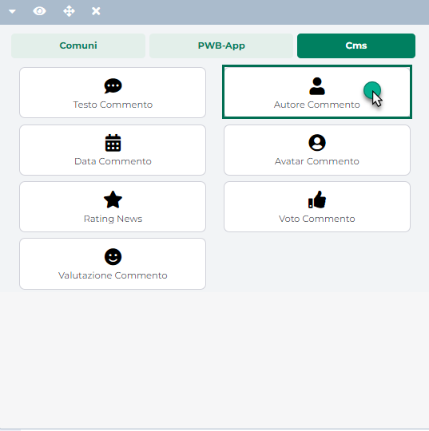 ) presente nella barra degli strumenti.
In questo modo verrà visualizzata la maschera **"Attributi"** attraverso
cui poter definire le caratteristiche dell'Attributo che si sta
realizzando.

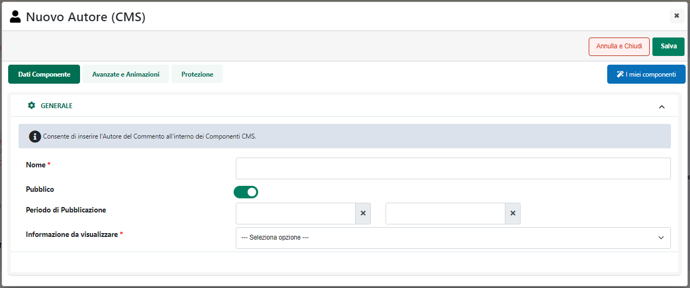

Nel caso in esame sarà poi necessario indicare un valore per i seguenti
parametri:

**Nome Attributo:** consente di definire il nome dell'Attributo Articolo
che si sta realizzando.

**Riportabile sul documento:** permette di indicare se l'Attributo Mexal
che si sta realizzando dovrà essere o meno mappato con il campo di una
**Videata Anagrafica Articoli** **o di una Tabella MyDB**
**Riportabile** in maniera tale da poter eventualmente utilizzare la
corrispondente informazione anche all'interno dei documenti gestionali.

In particolare nel caso in caso in cui il parametro in questione sia
stato:

- **Deselezionato**: il corrispondente Attributo Articolo potrà essere
  mappato:

  - con il campo di una Videata Aggiuntiva Articoli

  - con il campo di una Videata Anagrafica Riportabile o non
    Riportabile.

  - con il campo di una Tabella MyDB Riportabile o Standard

> In queste condizioni l'Attributo potrà quindi essere utilizzato
> all'interno del sito, ad esempio nelle varie celle del catalogo
> piuttosto che nella Scheda Prodotto, mediante il componente "Dati
> Articolo" ma non potrà in alcun modo essere utilizzato e visualizzato
> nel dettaglio dei documenti in corrispondenza delle relative righe
> articolo.

- **Selezionato:** il corrispondente Attributo Articolo dovrà essere
  mappato obbligatoriamente:

  - con il campo di una **Videata Anagrafica Articoli Riportabile di
    Mexal**

  - con il campo di una **Tabella MyDB Riportabile**

> In caso contrario al salvataggio dell'Attributo verrà visualizzato un'
> apposito messaggio di errore (es. "Attenzione! Il Campo Mexal non è
> riportabile")
>
> In queste condizioni l'Attributo oltre a poter essere visualizzato sul
> sito mediante il componente "Dati Articolo", come nel caso precedente,
> alla conferma dell'ordine verrà anche copiato nella relativa riga del
> documento e sarà quindi visualizzabile, **se valorizzato**, in
> corrispondenza di questa stessa riga nel dettaglio del Documento.

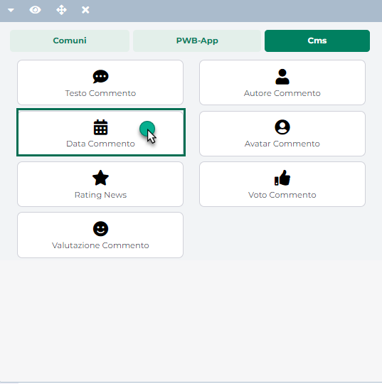

> **ATTENZIONE!** Per visualizzare questa informazione nel dettaglio del
> documento sul front end del sito, sarà necessario utilizzare il
> componente "Checkout Custom" ed inserire al suo interno un componente
> "Dati Articolo" mappato con l'Attributo in questione.
>
> Trattandosi di un Attributo Mexal, sarà possibile visualizzarne ed
> eventualmente modificarne il valore operando direttamente all'interno
> del gestionale. In questo senso sarà sufficiente aprire il dettaglio
> dell'ordine in arrivo dal sito, portarsi sulla relativa riga articolo
> (campo Descrizione), cliccare sul pulsante "**Dati aggiuntivi righe**"
> (Shift + F8) e selezionare la Videata Anagrafica o la Tabella MyDB
> all'interno della quale si trova il campo collegato all'Attributo
> Articolo in questione.

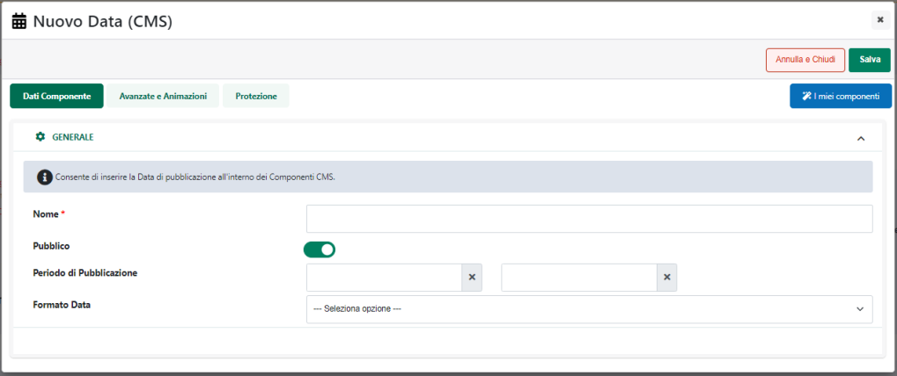

> In questo senso è bene sottolineare inoltre come **eventuali
> variazioni apportate ai valori di questi Attributi operando
> direttamente sul gestionale nel dettaglio di uno specifico ordine,
> verranno riportate sul sito solo ed esclusivamente alla prossima
> sincronizzazione utile e saranno in ogni caso valide solo ed
> esclusivamente per quello stesso specifico documento.**

**Sorgente Dati (solo per siti Ecommerce collegati a Mexal):** consente
di specificare la tipologia di Attributo che si intende realizzare.
**Nel caso in esame questo campo dovrà essere impostato, ovviamente, sul
valore "Mexal"** (come evidenziato nella figura di seguito riportata)

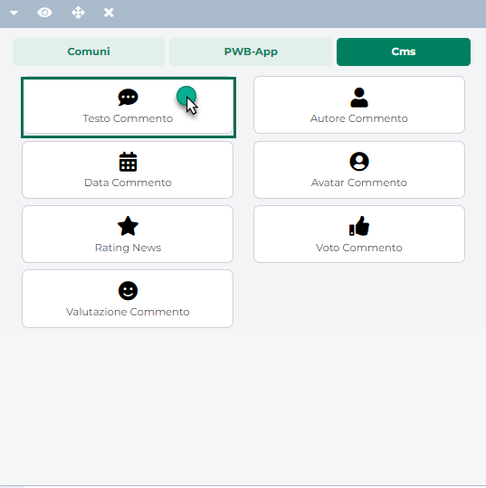

Una volta impostata la tipologia dell'attributo occorrerà poi settare
tutta una serie di altri parametri caratteristici della tipologia
stessa.

Nello specifico sarà quindi necessario impostare un valore anche per i
seguenti campi

**Etichetta del campo:** consente di specificare, in tutte le lingue
gestite all'interno del sito, l'etichetta identificativa dell'attributo
che si sta realizzando. Tale etichetta verrà poi visualizzata, in
corrispondenza dell'attributo stesso all'interno del componente **"Set
Attributi"**

**Campo Mexal:** consente di definire, per ciascuna delle lingue gestite
all'interno del sito, l'associazione tra l'Attributo che si sta
realizzando e uno dei campi Mexal disponibili.

In questo senso dal relativo menu a tendina sarà possibile selezionare:

- uno qualsiasi dei campi delle Videate Aggiuntive / Anagrafiche
  Articolo, opportunamente realizzate ed esportate sul sito

- uno qualsiasi dei campi MyDB precedentemente creati all'interno
  dell'apposita sezione del Wizard ("*Configurazione -- MyDB -- Campi
  MyDB*") e mappati ovviamente con campi di Tabelle MyDB di Mexal
  utilizzate come estensione dell'anagrafica articolo.

> Per maggiori informazioni relativamente alla gestione dei campi MyDB
> si veda anche quanto indicato all'interno del capitolo
> "*Configurazione -- MyDB*" di questo manuale

**ATTENZIONE!** Nel caso di siti in multilingua potrebbe essere
necessario creare e mappare uno specifico attributo per ciascuna lingua
gestita

**NOTA BENE:** tra i campi presenti all'interno del menu a tendina
potranno comparire, se attivati in maniera corretta, anche quelli
relativi alle Funzionalità Mexal "Ulteriore Descrizione 1/2/3". Per
maggiori informazioni relativamente all'attivazione di questi campi si
rimanda all'apposita sezione di questo manuale "Funzionalità Mexal --
Ulteriore Descrizione 1/2/3 (Articoli).

Nel caso in cui il campo di una Videata Aggiuntiva Articolo sia
effettivamente presente all'interno del gestionale ma non ancora nel
menu a tendina sopra evidenziato sarà necessario, per prima cosa,
allineare la base dati di Passweb con quella di Mexal attraverso
l'apposita funzione di "**Aggiornamento Attributi Mexal**" (si veda in
proposito il capitolo "*Configurazione -- Parametri Sincronizzazione*"
di questo manuale). Successivamente sarà necessaria anche una
sincronizzazione per consentire a Passweb di prelevare da Mexal i valori
corretti per il nuovo campo.

**Gestisci nelle combinazioni:** consente di decidere se l'attributo in
esame dovrà o meno essere considerato nella definizione delle
combinazioni create per il set di attributi cui l'attributo stesso
risulterà essere associato

Per maggiori informazioni relativamente ai Set di attributi e alle
Combinazioni di attributi ad essi associate set si veda anche il
relativo capitolo di questo manuale "*Catalogo -- Gestione Attributi
Articolo -- Set di Attributi*"

Per quel che riguarda invece la possibilità di visualizzare o meno
l'Attributo in esame all'interno del componenti "Set Attributi" e
"Filtro Set Attributi" si veda il successivo capitolo di questo manuale.

##### GESTIONE VISUALIZZAZIONE

La sezione **"Gestione Visualizzazione"** consente di specificare se
l'attributo in esame dovrà essere visualizzato o meno all'interno del
componente "Set Attributi" / "Filtro Set Attributi" e che tipo di
ordinamento dovrà essere utilizzato per i valori da esso assunti

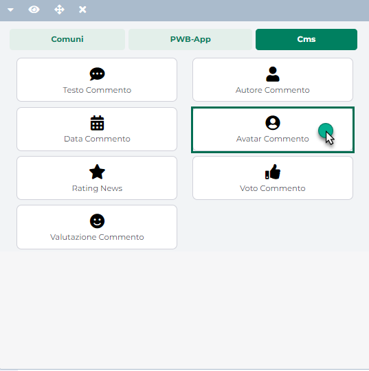

In questo senso dunque il parametro:

**Ordinamento Ricerca:** consente di indicare che tipo di ordinamento
(Alfabetico, Alfanumerico, Numerico) dovrà essere utilizzato per i
valori assunti dall'attributo in esame nel momento in cui questo stesso
attributo dovesse essere utilizzato come campo di filtro all'interno di
un pannello di ricerca articoli e dovesse essere visualizzato mediante
controlli di tipo "**Filtro Lista**", "**Filtro Indice**", "**Filtro
Checkbox**", "**Filtro Autocompletamento**"

Nel caso in cui il campo in esame dovesse essere lasciato vuoto, per i
valori assunti dal relativo attributo verrà utilizzato:

- un ordinamento di tipo Numerico per attributi Passweb di tipo "Numero"
  e per attributi Mexal collegati a campi numerici

- un ordinamento alfabetico in tutti gli altri casi

**ATTENZIONE!** Per ovvie ragioni un ordinamento di tipo numerico è
comunque ammesso solo su attributi numerici

In sostanza dunque, il campo "**Ordinamento Ricerca**" può rivelarsi
particolarmente utile, principalmente, in relazione ad attributi di tipo
testuale, offrendo all'utente la possibilità di scegliere tra
ordinamento alfabetico o alfanumerico e di ordinare quindi correttamente
valori del tipo "5 cm", "10 cm" ...

**Visualizza nel componente "Set Attributi"**: consente, se selezionato,
di rendere visibile il corrispondente attributo all'interno del
componente **"Set Attributi"**, componente questo che potrà essere
inserito all'interno della scheda prodotto dei vari articoli e che
consentirà di visualizzare in un colpo solo tutti gli attributi articolo
per i quali è stato selezionato il parametro in oggetto.

**Visualizza nel componente "Filtro Set Attributi"**: consente, se
impostato a **SI**, di visualizzare il corrispondente attributo
all'interno del pannello di ricerca articoli (componente "Filtro/Ricerca
Catalogo"), nel caso in cui sia stato inserito in questo stesso pannello
il componente **"Filtro Set Attributi"**.

**Tipo Campo di Ricerca (solo nel caso in cui il parametro "Visualizza
nel componente Filtro Set Attributi" sia stato impostato a SI)**:
consente di specificare il tipo di controllo che verrà utilizzato (lato
front-end) all'interno del componente "Filtro Set Attributi" per gestire
l'attributo in esame. E' possibile selezionare uno dei seguenti valori:

- **Testo:** all'interno del componente "Filtro Set Attributi" verrà
  visualizzato un semplice campo di input, nel quale l'utente dovrà
  digitare, per l'attributo in esame, il valore in base al quale
  effettuare una ricerca.

> In queste condizioni verranno inoltre visualizzati due ulteriori
> parametri "Segnaposto" e "Valore di Default" mediante i quali poter
> specificare rispettivamente

- **Segnaposto:** permette di definire un testo che verrà utilizzato
  **come segnaposto** all'interno del campo di input utilizzato per
  gestire, nel componente "Filtro Set Attributi", l'Attributo in esame

> **ATTENZIONE!** Al click dell'utente sul campo in esame il testo
> indicato scomparirà consentendo quindi all'utente di inserire il
> valore desiderato. Quanto indicato all'interno di questo campo non
> verrà quindi considerato alla conferma del form.

- **Valore di Default:** consente di indicare un testo che verrà
  utilizzato (e visualizzato) **come valore di default** per il campo di
  input utilizzato per gestire, nel componente "Filtro Set Attributi",
  l'Attributo in esame.

> **ATTENZIONE!** A differenza di quanto indicato per il precedente
> parametro "Segnaposto", il testo inserito all'interno del campo
> "Valore di default" **non scomparirà** in automatico al click
> dell'utente sul campo di input ma, al contrario, verrà considerato
> come se fosse un vero e proprio valore indicato dall\'utente stesso in
> fase di compilazione.
>
> Il valore indicato dall'utente all'interno di questi campi verrà
> effettivamente considerato nell'applicazione del filtro solo dopo aver
> cliccato sul relativo pulsante di ricerca.

- **Lista:** all'interno del componente "Filtro Set Attributi" verrà
  visualizzato un menu a tendina contenente l'elenco di tutti i
  possibili valori per l'attributo in esame, valori questi che l'utente
  del sito potrà utilizzare per effettuare le sue ricerche.

> In queste condizioni verranno inoltre visualizzati due ulteriori
> parametri "Valore di Default" e "Step" mediante i quali poter
> specificare

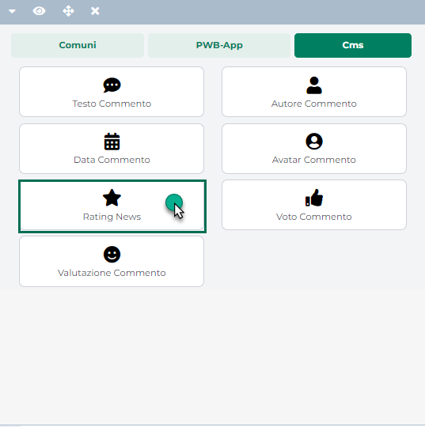

- **Valore di Default:** consente di indicare un testo che verrà
  utilizzato (e visualizzato) **come valore di default** per la select
  box utilizzata per gestire, nel componente "Filtro Set Attributi",
  l'Attributo in esame.

- **Step:** consente di indicare l'intervallo di definizione dei vari
  scaglioni che rappresenteranno poi le diverse possibili opzioni di
  scelta presenti all'interno del menu a tendina utilizzato per gestire,
  nel componente "Filtro Set Attributi", l'Attributo in esame.

> Supponendo dunque di impostare questo campo sul valore 100,
> all'interno del menu a tendina verranno visualizzate le seguenti
> opzioni: 0-100, 100-200, 200-300 ... L'utente potrà quindi ricercare
> tutti gli articoli per i quali l'attributo collegato al campo di
> ricerca in questione ha un valore compreso in uno dei range indicati
>
> Il valore del primo e dell'ultimo scaglione verranno determinati
> automaticamente sulla base de valori impostati sui vari articoli per
> l'attributo in esame.
>
> **ATTENZIONE!** Nel caso in cui lo step impostato dovesse essere tale
> da produrre un numero di scaglioni superiore a 100, all'interno del
> componente "Filtro Set Attributi" verrà visualizzato un apposito
> messaggio di errore e non verrà di fatto impostato nessun tipo di
> scaglione.
>
> **ATTENZIONE!** Per ovvie ragioni il campo Step potrà essere
> utilizzato solo ed esclusivamente su Attributi di tipo numerico. In
> caso contrario infatti, al salvataggio dell'Attributo, verrà ritornato
> un apposito messaggio di errore.

- **Slider:** all'interno del componente "Filtro Set Attributi" verrà
  visualizzato un controllo di tipo Slider mediante il quale poter
  consentire all'utente che naviga il sito di effettuare delle ricerche
  sulla base di attributi di tipo numerico.

> Le ricerche potranno essere effettuate impostando uno specifico valore
> minimo e/o massimo all'interno degli appositi campi di input, oppure
> impostando il range di ricerca mediante il trascinamento dei due
> piccoli pulsanti posti ai lati della barra visualizzata immediatamente
> al di sopra degli stessi campi di input.
>
> **ATTENZIONE!** Per ovvie ragioni il controllo di tipo Slider potrà
> essere utilizzato solo ed esclusivamente su Attributi di tipo
> numerico. In caso contrario infatti, al salvataggio dell'Attributo,
> verrà ritornato un apposito messaggio di errore.
>
> Per maggiori informazioni su questa particolare tipologia di controllo
> si veda anche la sezione "*Varianti Sito Responsive / Standard e
> Mobile -- Lista Componenti Ecommerce -- Componenti Interni ai
> Componenti Ecommerce -- Filtro Slider*" di questo manuale

- **Indice con/senza contatore di elementi:** all'interno del componente
  "Filtro Set Attributi" verrà visualizzato un elenco di tutti i
  possibili valori assunti dall'attributo in esame per i vari articoli
  gestiti all'interno del sito (eventualmente anche delle immagini).
  Ogni singola voce di questo elenco, se cliccata, consentirà di
  filtrare gli articoli in catalogo per l'attributo in esame e sulla
  base del valore selezionato. A fianco di ogni singola voce potrà
  inoltre comparire o meno (a seconda del fatto che l'indice sia con o
  senza contatore di elementi) l'esatto numero degli articoli in
  catalogo per i quali l'attributo in esame assume quello specifico
  valore.

- **Checkbox con/senza contatore di elementi:** all'interno del
  componente "Filtro Set Attributi" verrà visualizzato **un elenco a
  selezione multipla** (mediante relativo checkbox) di tutti i possibili
  valori assunti dall'attributo in esame per i vari articoli gestiti
  all'interno del sito. Ogni singola voce di questo elenco, se
  selezionata (flaggando l'apposito check), consentirà di filtrare gli
  articoli in catalogo sulla base del relativo valore.

> In questo caso inoltre l'elenco delle possibili opzioni di scelta è,
> come detto, a selezione multipla per cui è possibile selezionare anche
> due o più voci contemporaneamente.
>
> A fianco di ogni singola voce potrà inoltre comparire o meno (a
> seconda del fatto che il checkbox sia con o senza contatore di
> elementi) l'esatto numero degli articoli in catalogo per i quali
> l'attributo in esame assume quello specifico valore.

- **Toggle Switch con/senza contatore di elementi:** all'interno del
  componente "Filtro Set Attributi" verrà visualizzato **un elenco a
  selezione multipla** (mediante relativo controllo di tipo Toggle
  Switch On/Off) di tutti i possibili valori assunti dall'attributo in
  esame per i vari articoli gestiti all'interno del sito. Ogni singola
  voce di questo elenco, se selezionata (impostando su ON l'apposito
  controllo), consentirà di filtrare gli articoli in catalogo sulla base
  del relativo valore.

> In questo caso inoltre l'elenco delle possibili opzioni di scelta è,
> come detto, a selezione multipla per cui è possibile selezionare anche
> due o più voci contemporaneamente.
>
> A fianco di ogni singola voce potrà inoltre comparire o meno (a
> seconda del fatto che il Toggle Switch sia con o senza contatore di
> elementi) l'esatto numero degli articoli in catalogo per i quali
> l'attributo in esame assume quello specifico valore.

- **Autocompletamento:** all'interno del componente "Filtro Set
  Attributi" verrà inserito un campo di input ad autocompletamento in
  cui poter visualizzare una lista di possibili opzioni da selezionare
  sulla base del testo mano a mano digitato dall'utente

> In queste condizioni verranno inoltre visualizzati tre ulteriori
> parametri "Segnaposto", "Valore di Default" e "Numero minimo di
> caratteri da digitare" mediante i quali poter specificare
> rispettivamente

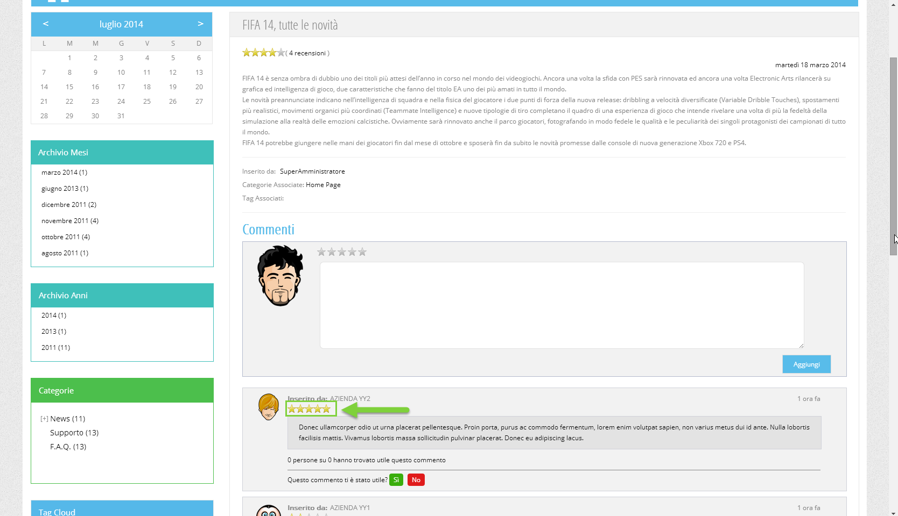

- **Segnaposto:** permette di definire un testo che verrà utilizzato
  **come segnaposto** all'interno del campo ad autocompletamento
  utilizzato per gestire, nel componente "Filtro Set Attributi",
  l'Attributo in esame

> **ATTENZIONE!** Al click dell'utente sul campo in esame il testo
> indicato scomparirà consentendo quindi all'utente di inserire il
> valore desiderato. Quanto indicato all'interno di questo campo non
> verrà quindi considerato alla conferma del form.

- **Valore di Default:** consente di indicare un testo che verrà
  utilizzato (e visualizzato) **come valore di default** per il campo ad
  autocompletamento utilizzato per gestire, nel componente "Filtro Set
  Attributi", l'Attributo in esame

> **ATTENZIONE!** A differenza di quanto indicato per il precedente
> parametro "Segnaposto", il testo inserito all'interno del campo
> "Valore di default" non scomparirà in automatico al click dell'utente
> sul campo di input ma, al contrario, verrà considerato come se fosse
> un vero e proprio valore indicato dall\'utente stesso in fase di
> compilazione.
>
> In queste condizioni, per poter visualizzare l'elenco delle possibili
> opzioni di scelta sarà quindi indispensabile apportare una qualche
> variazione ad eventuali "Valori di Default" gestiti per il campo in
> esame.

- **Numero minimo di caratteri da digitare:** permette di specificare,
  selezionandolo da un apposito menu a tendina, l'esatto numero di
  caratteri che dovranno necessariamente essere digitati dall'utente
  prima di poter visualizzare l'elenco delle possibili opzioni di scelta

**NOTA BENE**: per maggiori informazioni relativamente alla gestione dei
componenti "Set Attributi" e "Filtro Set Attributi" si rimanda alla
relativa sezione di questo manuale.

##### GESTIONE OPZIONI

Una volta impostati tutti i parametri di configurazione dell'attributo
il pulsante "**Salva**", presente nella parte bassa della maschera,
oltre ad effettuare il salvataggio dei dati impostati, creando di fatto
il nuovo attributo articolo, permetterà di visualizzare anche
un'ulteriore sezione di configurazione, la sezione "**Gestione
Opzioni**" all'interno della quale poter indicare tutti i valori che
l'attributo in esame potrà assumere per ogni singolo articolo gestito
all'interno del sito.

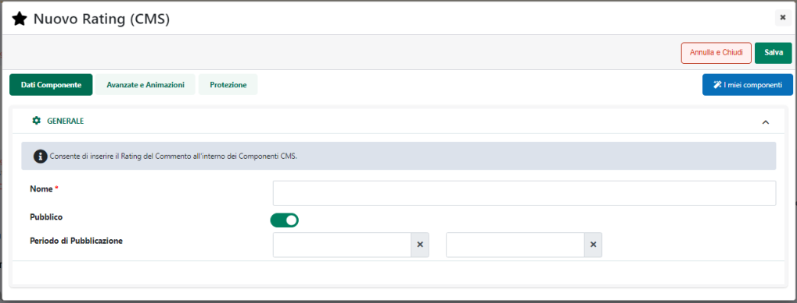

Il campo di ricerca attivabile cliccando sulla lente di ingrandimento,
presente in corrispondenza del campo "Valore" consente di filtrare i
dati in griglia sulla base del valore delle singole opzioni.

Una volta impostato un filtro di ricerca, per poterlo poi eliminare sarà
sufficiente cliccare sull'icona raffigurante una piccola lente di
ingrandimento con un -- all'interno (
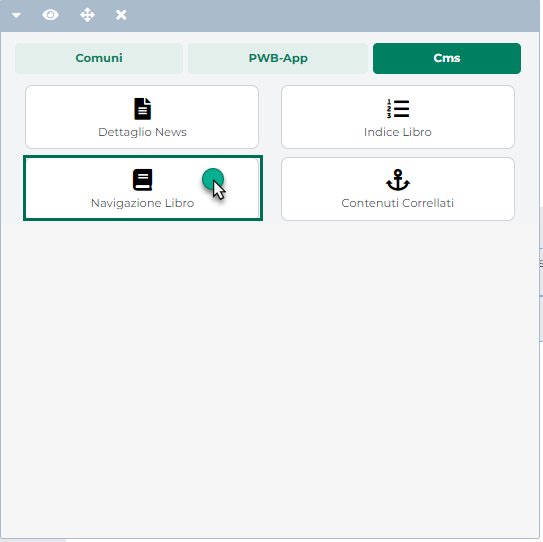 ) che comparirà in testata alla colonna
in corrispondenza della quale è stato impostato il filtro stesso.

Nel caso in questione (Attributi Articolo di tipo Mexal), all'interno di
questa sezione andranno impostati tutti i valori inseriti, nel relativo
campo del gestionale, per ogni singolo articolo gestito sul sito.

Per inserire un nuovo valore è sufficiente cliccare sul pulsante
raffigurante un piccolo +
(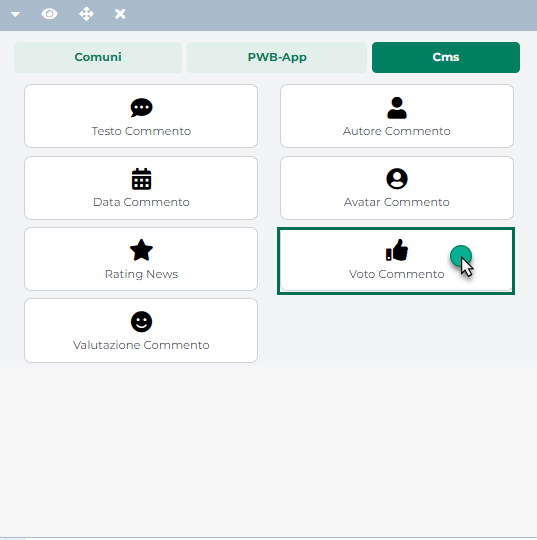 ) presente nella barra degli strumenti.

In questo modo verrà infatti visualizzata la maschera "**Nuova
Opzione**", all'interno della quale poter inserire (parametro
"**Etichetta del campo**") il valore desiderato per ognuna delle lingue
gestite all'interno del sito.

Gli altri due pulsanti presenti nella barra degli strumenti consentono
rispettivamente di:

**Esporta** (
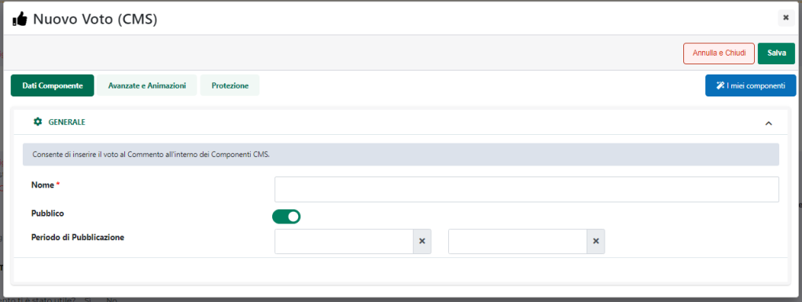 ): consente di esportare un file .csv
contenente tutti i valori attualmente presenti in elenco. Cliccando su
questo pulsante verrà visualizzata la maschera "**Esporta Valori**"

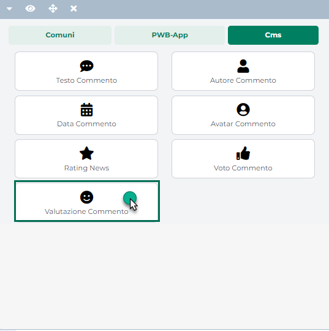

all'interno della quale poter indicare lo specifico carattere separatore
che dovrà essere utilizzato nella generazione del file di esportazione.

Il pulsante "Conferma" consente invece di avviare la procedura di
creazione ed esportazione del file

**Importa** (
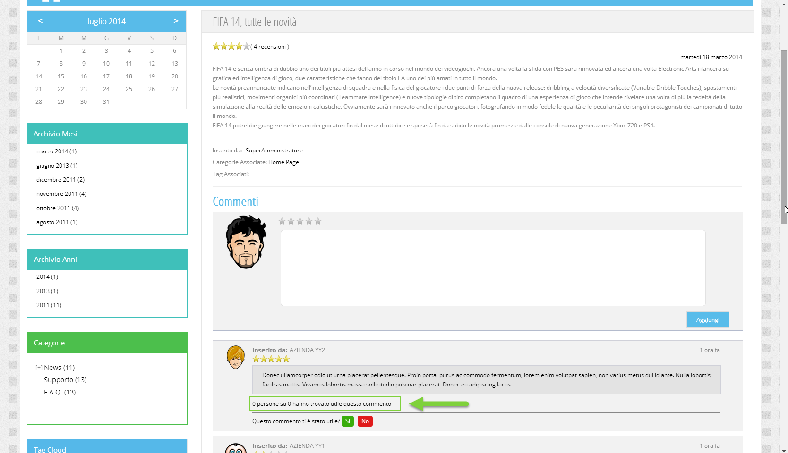 ) : consente di codificare in maniera
massiva i diversi possibili valori per l'attributo in oggetto
importandoli da un file .csv o .txt. Cliccando su questo pulsante verrà
visualizzata la maschera "**Importa Valori**"

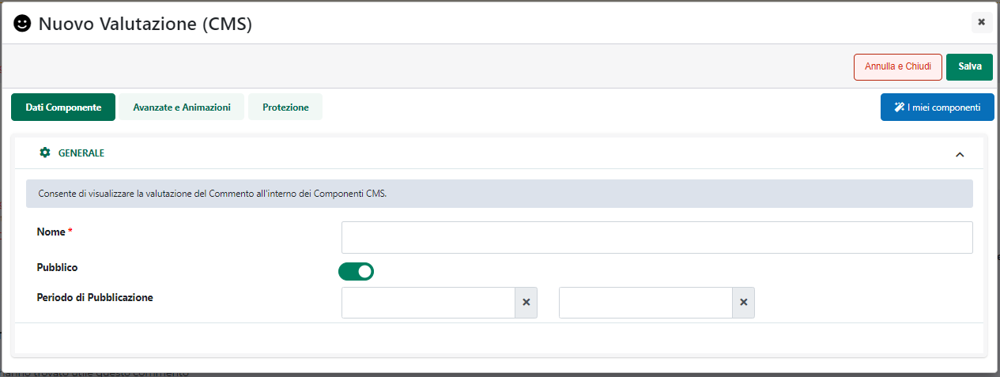

all'interno della quale poter selezionare il file da importare (campo
"**File (csv-txt)**").

Il campo "**Lingua di riferimento**" consente di definire,
selezionandola tra quelle attualmente gestite, la lingua i cui valori
dovranno essere utilizzati come chiave per determinare se i contenuti
del file di importazione dovranno andare in aggiunta o in modifica ad
eventuali valori già presenti in elenco.

**ATTENZIONE!** Il file di importazione deve sempre contenere la lingua
impostata come lingua di riferimento

Supponendo dunque di indicare come lingua di riferimento la lingua
Italiana, per ogni valore dell'attributo inserito nel file di
importazione in corrispondenza della lingua italiana, verrà valutato se
questo stesso valore è o meno presente tra i valori già inseriti in
elenco.

In caso positivo verranno aggiornati, per lo stesso elemento i valori
corrispondenti nelle altre lingue gestite. In caso negativo verrà invece
inserito un nuovo elemento in elenco

Il campo **Separatore**: consente di indicare, selezionandolo,
dall'apposito menu a tendina, il carattere che è stato utilizzato
all'interno del file di importazione come separatore per i vari campi

Il check "**Elimina valori non presenti nel file**" consente invece, se
selezionato, di eliminare eventuali valori precedentemente inseriti e
non presenti nel file di importazione.

**ATTENZIONE! l'eliminazione di uno dei valori presenti in elenco
determina anche la cancellazione di eventuali combinazioni di attributi
in cui questo stesso valore era stato utilizzato**

Affinchè la procedura di importazione possa terminare correttamente è
necessario che il file di importazione soddisfi le seguenti specifiche:

- L'intestazione, ossia la prima riga del file, deve contenere
  l'indicazione delle lingue gestite all'interno del sito, esattamente
  come queste stesse lingue sono indicate nella sezione "Sito --
  Gestione Lingue" del Wizard. Come carattere di separazione tra una
  lingua e l'altra è necessario utilizzare il carattere TAB.

- Ogni riga del file deve contenere un possibile valore dell'attributo
  in ciascuna delle lingue indicate nella riga di intestazione. Come
  carattere di separazione tra i diversi valori presenti su una stessa
  riga è necessario utilizzare il carattere TAB.

L'elenco dei possibili valori di un attributo diventerà poi di
fondamentale importanza nel momento in cui si dovesse decidere di
utilizzare l'attributo in esame all'interno di una serie di filtri di
ricerca in cascata vincolati sulla base di specifiche combinazioni di
attributi, combinazioni queste definite direttamente all'interno del
Wizard di Passweb.

I valori che un attributo potrà assumere in fase di creazione di una
particolare combinazione saranno infatti proprio quelli presenti
all'interno di questa stessa sezione.

In conseguenza di ciò è indispensabile, nel momento in cui si dovesse
decidere di utilizzare filtri di ricerca in cascata vincolati sulla base
di specifiche combinazioni di attributi, che **i valori inserirti
all'interno di questa sezione corrispondano esattamente con tutti i
diversi valori assunti da questo stesso attributo per gli articoli
gestiti all'interno del sito**

Per maggiori informazioni in merito alla gestione dei filtri di ricerca
vincolati in base a specifiche combinazioni di attributi si veda anche
il capitolo *"Live Editing -- Lista Componenti Ecommerce -- Componente
Ricerca--Ricerca Ecommerce -- Filtri di ricerca vincolati"* di questo
manuale.

