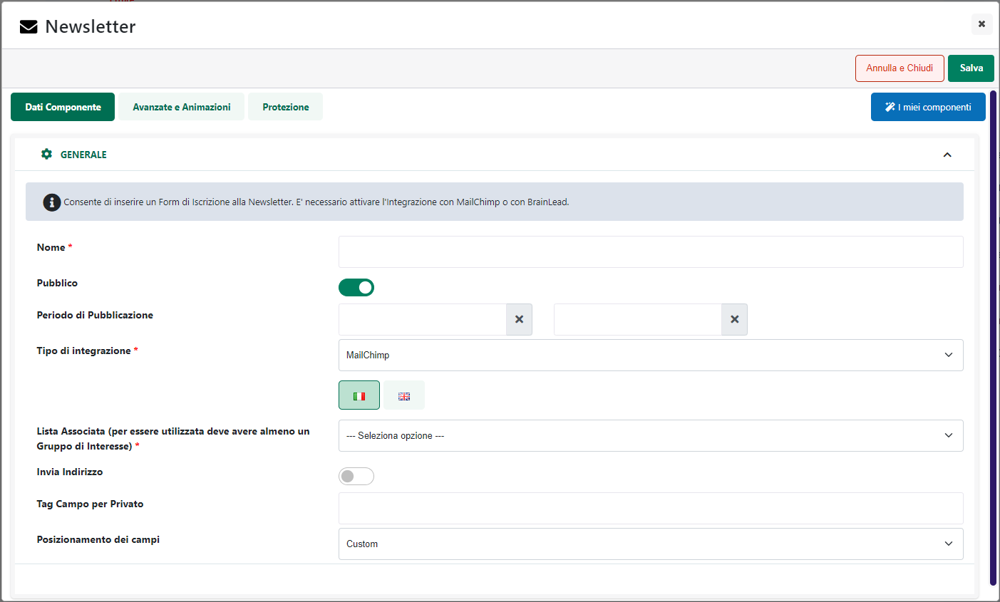
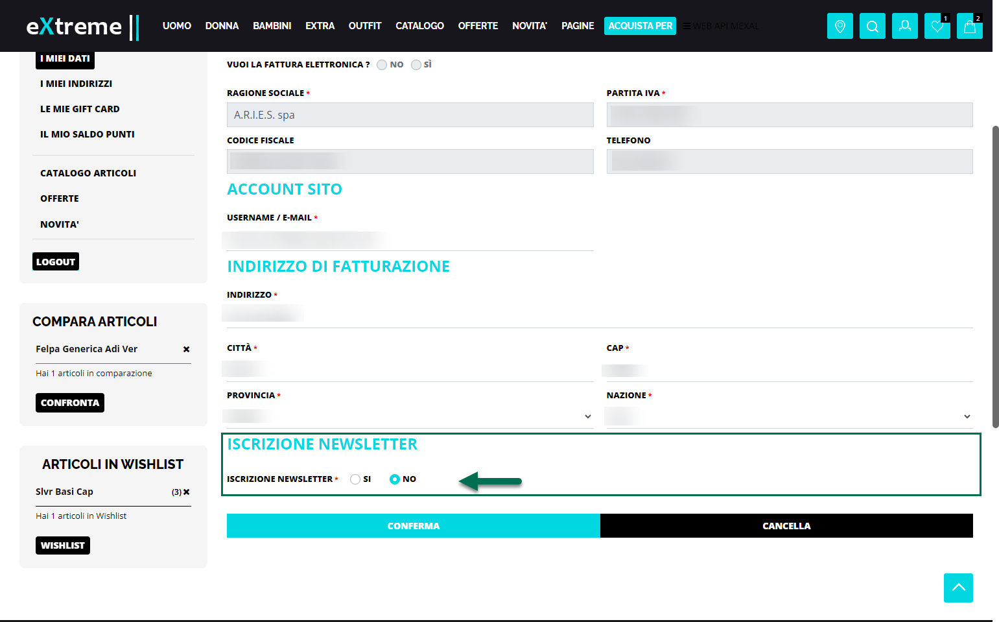
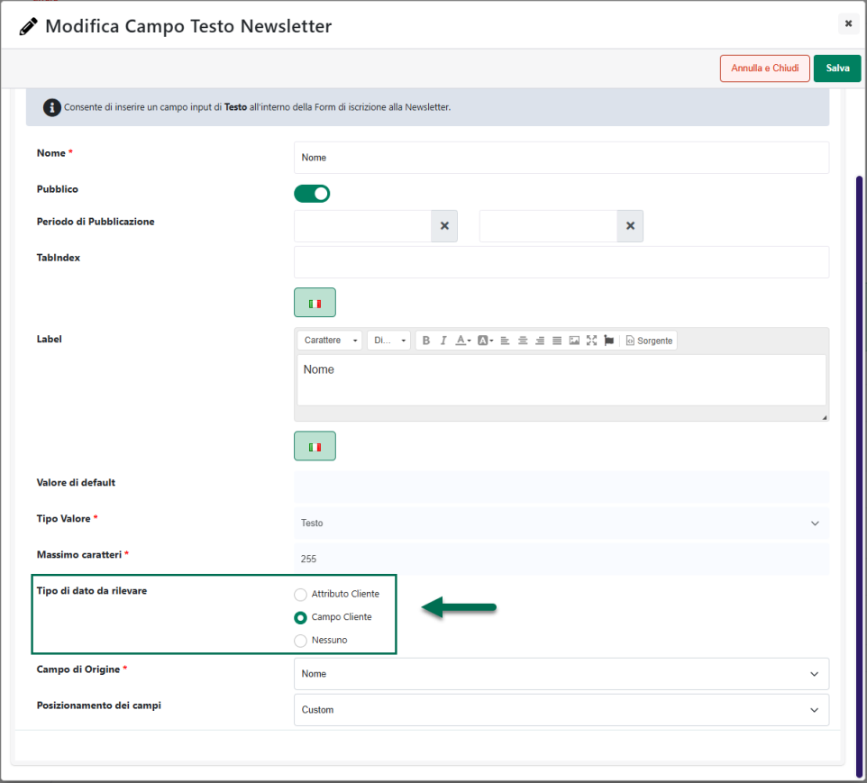
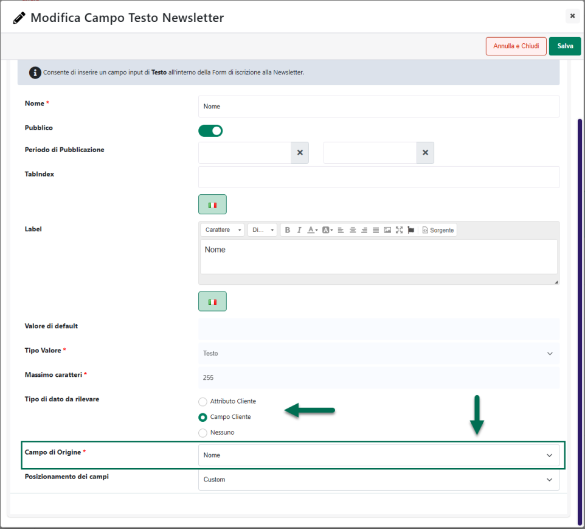
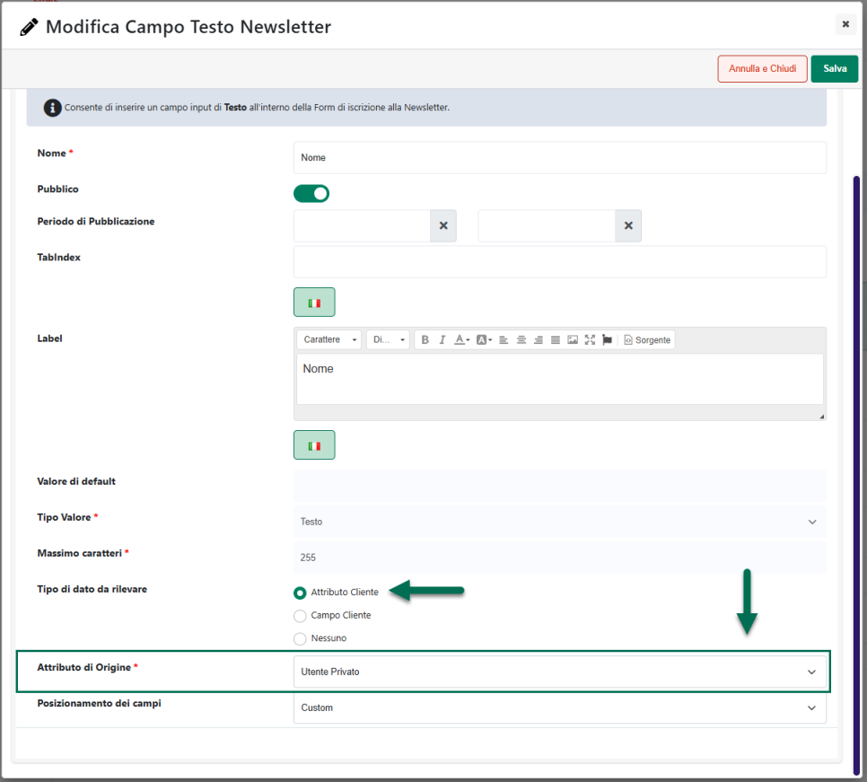

# CREAZIONE DI UN NUOVO SET DI OPZIONI

Nel momento in cui l'esigenza dovesse essere quella di creare un nuovo
Set di Opzioni, sarà necessario accedere alla maschera "Set Opzioni"
analizzata nel precedente capitolo di questo manuale e cliccare sul
pulsante **Nuovo**
( ) presente nella contestuale barra degli
strumenti.

In questo modo verrà infatti visualizzata la maschera "**Set di
Opzioni**"

all'interno della quale sarà possibile:

- Impostare i parametri di configurazione del Set -- pannello
  "**Generale**"

- Indicare la / le categorie merceologiche cui associare il Set--
  pannello "**Categorie Merceologiche**"

- Definire le opzioni del Set -- pannello "**Opzioni**"

##### CONFIGURAZIONE DEL SET

Il pannello "**Generale**" presente all'interno della maschera di
configurazione di un Set di Opzioni consente di impostare i principali
parametri di configurazione del Set in questione.

Nello specifico il campo:

**Nome Set**: consente di assegnare un nome al set che si sta
realizzando in maniera tale da poterlo poi distinguere tra tutti gli
altri set di opzioni gestiti all'interno del sito

**Descrizione**: consente di assegnare al set di opzioni che si sta
codificando, una specifica descrizione che verrà poi visualizzata sul
front end prima delle opzioni di personalizzazione

**Valuta di riferimento:** consente di impostare, selezionandola tra
quelle attualmente gestite all'interno del sito, la valuta di
riferimento da utilizzare nella determinazione degli importi che
verranno poi associati alle opzioni di personalizzazione presenti
all'interno del set

**Calcolo:** consente di definire la modalità di calcolo che dovrà
essere utilizzata per determinare il prezzo complessivo dell'articolo in
relazione alle personalizzazioni effettuate dall'utente.

È possibile selezionare uno dei seguenti valori:

- **Sommatoria:** selezionando questa opzione il prezzo finale verrà
  calcolato come somma tra il prezzo base dell'articolo e gli eventuali
  prezzi delle opzioni selezionate dall'utente in fase di
  personalizzazione.

> In queste condizioni, in corrispondenza di ogni opzione di
> personalizzazione, verrà visualizzato anche il relativo aumento di
> prezzo che l'opzione stessa andrà a determinare.

> Inoltre, nel caso in cui il prezzo della singola opzione dovesse
> variare in relazione alla quantità dell'articolo effettivamente
> aggiunta in carrello, in corrispondenza di questa stessa opzione sarà
> possibile visualizzare anche un messaggio più dettagliato per indicare
> all'utente, in maniera più precisa, quello che sarebbe effettivamente
> il prezzo della relativa opzione nel momento in cui la quantità
> dell'articolo inserita in carrello dovesse ricadere in determinato
> scaglione

> **ATTENZIONE!** nel caso in cui l'opzione dovesse essere gestita con
> un controllo di tipo List il messaggio in esame verrà visualizzato al
> di sotto del relativo controllo solo dopo aver selezionato uno
> specifico valore
>
> Il messaggio evidenziato in figura potrà essere personalizzato alla
> pagina "**Testi Messaggi del Sito / Testi dei Componenti**" del Wizard
> selezionando il componente "**Set Opzioni**" e agendo in
> corrispondenza dell'elemento "**Tooltip Quantità -- Prezzo**" (per
> maggiori informazioni in merito si veda anche quanto indicato
> all'interno del capitolo "*Sito -- Gestione Testi / Messaggi del Sito
> -- Personalizzazione del tooltip Quantità -- Prezzo per Set Opzioni*"
> di questo manuale)

- **Formula:** selezionando questa opzione verrà visualizzato
  un'ulteriore campo "**Formula**" all'interno del quale poter poi
  definire esattamente quella che dovrà essere la formula da utilizzare
  per calcolare il prezzo finale dell'articolo

> In queste condizioni, in corrispondenza delle singole opzioni di
> personalizzazione, non verrà visualizzato l'aumento di prezzo che
> l'opzione stessa andrà a determinare. Tale aumento infatti potrebbe
> variare, sulla base della formula impostata, anche in relazione alle
> selezioni e ai valori impostati per altre opzioni di
> personalizzazione.

**Formula:** visibile solo nel caso in cui il parametro "**Calcolo**"
sia stato impostato sull' omonimo valore "Formula". Come già
evidenziato, all'interno di questo campo sarà possibile definire
esattamente la formula che dovrà essere utilizzata per calcolare il
prezzo complessivo dell'articolo in relazione alle opzioni di
personalizzazione selezionate dall'utente.

In fase di definizione della formula è possibile utilizzare i seguenti
elementi:

- **operatori standard (+-\*/)**

- **elevatore a potenza (Pow)**

> [Esempio]{.underline}: supponendo di voler calcolare il valore
> dell'espressione "due alla terza" la formula da utilizzare dovrà
> essere:
>
> **Pow(2,3)**

- **radice quadrata (Sqrt)**

> [Esempio]{.underline}: supponendo di voler calcolare il valore
> dell'espressione "radice quadrata di 16" la formula da utilizzare
> dovrà essere:
>
> **Sqrt(16)**

- **modulo (%)**

> [Esempio]{.underline}: questo operatore dovrà essere utilizzato nella
> forma:
>
> **10%3**
>
> e consentirà di dividere il primo argomento per il secondo,
> restituendo come risultato solo il resto (nell'esempio indicato il
> risultato ottenuto sarà 1)

- **valore assoluto (Abs)**

> [Esempio]{.underline}: questo operatore dovrà essere utilizzato nella
> forma
>
> **Abs(-5)**
>
> e consentirà di ottenere come risultato il valore assoluto del numero
> indicato tra parentesi (nell'esempio indicato il risultato ottenuto
> sarà 5)

- **valore intero (Truncate)**

> [Esempio]{.underline}: questo operatore dovrà essere utilizzato nella
> forma
>
> **Truncate(5.2)**
>
> e consentirà di ottenere come risultato il valore intero del numero
> indicato tra parenesi (nell'esempio considerato il risultato ottenuto
> sarà 5)

- **valore intero superiore (Ceiling)**

> [Esempio]{.underline}: questo operatore dovrà essere utilizzato nella
> forma
>
> **Ceiling(5.2)**
>
> e consentirà di ottenere come risultato il valore intero
> immediatamente superiore al numero indicato tra parentesi
> (nell'esempio indicato il risultato ottenuto sarà 6)

- **parentesi tonde**

- **istruzione condizionale "if"**

> All'interno della formula è possibile utilizzare anche l'istruzione
> condizionale "if" come operatore ternario quindi nel formato
>
> **if(condizione, prezzo da applicare se condizione verificata, prezzo
> da applicare se condizione non verificata)**

**ATTENZIONE!** È fondamentale che come separatore dei decimali venga
utilizzato sempre e soltanto il "." (punto).

Nel caso in cui si dovesse utilizzare come separatore la "," (virgola)
la formula non risulterà essere corretta e il risultato ottenuto non
sarà quindi quello desiderato.

Il pulsante "**Aggiungi Segnaposto**" presente immediatamente al di
sotto del relativo campo di input consente di inserire all'interno della
formula per il calcolo del prezzo anche i seguenti elementi:

- **Prezzo Articolo(articlePrice):** consente di inserire all'interno
  della formula il prezzo base dell'articolo da personalizzare

- **Quantità articolo (articleQta):** consente di inserire all'interno
  della formula la quantità aggiunta in carrello per l'articolo in esame

> Grazie a questo segnaposto sarà quindi possibile utilizzare nella
> formula di calcolo del prezzo condizioni del tipo:
>
> **if(articleQta \> 3, 5, 10)** -- equivale alla condizione "Se la
> quantità dell'articolo inserita in carrello è maggiore di 3 allora il
> prezzo da applicare è 5€ altrimenti se la quantità dell'articolo
> inserita in carrello è minore o uguale a 3 il prezzo da applicare è di
> 10€"
>
> che consentono di variare il prezzo da applicare all'articolo in
> relazione alla quantità con cui quello stesso articolo viene
> effettivamente inserito in carrello.
>
> **ATTENZIONE!** nel momento in cui, in fase di definizione della
> formula, dovesse essere utilizzato il segnaposto della quantità, sul
> front end il prezzo dell'articolo verrà poi ricalcolato alla
> variazione della quantità aggiunta al carrello (esattamente allo
> stesso modo di quello che avviene, ad esempio, in caso di sconti in
> base alla quantità)

- **Prezzo Opzione xxx (prz(xxx)):** è presente una voce di questo tipo
  per ciascuna delle opzioni del Set.

> Consente di inserire all'interno della formula il prezzo della
> relativa opzione

- **Valore Opzione xxx (val(xxx))**: è presente una voce di questo tipo
  per ciascuna delle opzioni del Set.

> Consente di inserire all'interno della formula il valore assegnato
> dall'utente in fase di personalizzazione della relativa opzione.
>
> Considerando che i segnaposto di tipo "Valore Opzione" possono essere
> riferiti sia ad opzioni di tipo numerico (interi o decimali) che ad
> opzioni del Set di tipo testuale, in fase di definizione della formula
> da applicare per calcolare il prezzo dell'articolo (in relazione alle
> opzioni di personalizzazione selezionate dall'utente) potranno essere
> utilizzati anche i seguenti operatori

- **=, ==** : uguale a

- **!=, \<\>** : diverso da

- **\<** : Minore di

- **\<**= : Minore o uguale a

  - : Maggiore di

- **\>=** : Maggiore o uguale a

- **or, \|\|** : OR logico

- **and,&&** : AND logico

> Grazie a questi operatori sarà quindi possibile definire condizioni di
> questo tipo

- **if(val1 \<\> 'Valore Testuale', 10, 20)**

> equivale alla condizione: "se il valore immesso dall'utente in
> corrispondenza dell'opzione 1 è diverso dalla stringa 'Valore
> Testuale" il prezzo articolo è 10, altrimenti è 20

- **if(val2 \> 5, if(val3 = 'Valore Testuale', 10, 20), 30)**

> equivale alla condizione: "se il valore immesso dall'utente in
> corrispondenza dell'opzione 2 è maggiore di 5 allora valuta quanto
> immesso in corrispondenza dell'opzione 3. Se in corrispondenza
> dell'opzione 3 l'utente ha inserito esattamente la stringa 'Valore
> Testuale' allora il prezzo dell'articolo è 10, altrimenti è 20. Se
> invece il valore immesso in corrispondenza dell'opzione 2 è minore o
> uguale a 5 allora il prezzo articolo è 30
>
> **ATTENZIONE!** nel momento in cui l'esigenza dovesse essere quella
> testare il valore di un opzione di tipo testuale la stringa con cui
> eseguire il confronto dovrà essere inserita tra apici singoli

- **Se Opzione xxx (opt(xxx)):** presente per ciascuna delle opzioni
  attualmente gestite. Consente di inserire all'interno della formula
  una condizione che verrà verificata solo nel momento in cui l'opzione
  indicata sarà stata effettivamente valorizzata dall'utente.

> In questo caso all'interno della formula verrà quindi inserita
> un'istruzione del tipo di quella di seguito riportata
>
> **if(opt21, ,)**
>
> dove (opt21) è l'identificativo dell'opzione selezionata.
>
> Il calcolo del prezzo o le eventuali istruzioni da eseguire solo se
> l'opzione indicata venga effettivamente valorizzata dall'utente,
> andranno quindi inserite come secondo argomento (tra la prima e la
> seconda virgola) dell'operatore ternario if
>
> Allo stesso modo il calcolo del prezzo o le eventuali istruzioni da
> eseguire nel caso in cui l'opzione indicata non dovesse essere
> valorizzata, dovranno essere inserite come terzo argomento (quindi
> dopo la seconda virgola) dell'operatore ternario if
>
> **ATTENZIONE! Nel momento in cui si dovesse decidere di utilizzare
> all'interno della formula una condizione (segnaposto "Se Opzione")
> sarà poi necessario inserire effettivamente dei valori sia per il
> secondo che per il terzo argomento dell'operatore if** (indicando
> quindi esplicitamente quello che dovrà succedere sia nel caso in cui
> l'opzione indicata venga effettivamente valorizzata sia nel caso in
> cui non venga valorizzata)
>
> **In caso contrario potrebbero essere visualizzati sul front end del
> sito dei messaggi di errore.**

\*\*\*\*\*\*\*\*\*\*\*\*\*\*\*\*\*\*\*\*\*\*\*\*\*\*\*\*\*\*\*\*\*\*\*\*\*\*\*\*\*\*\*\*\*\*\*\*\*\*\*\*\*\*\*\*\*\*\*\*\*\*\*\*\*\*\*\*\*\*\*\*\*\*\*\*\*\*\*\*\*\*\*\*\*\*\*\*\*\*\*\*\*\*\*\*\*\*\*\*\*\*\*\*\*\*\*\*\*\*\*\*\*

**ESEMPIO: CALCOLO DEL PREZZO AL METRO QUADRO**

Supponiamo che il prezzo finale dell'articolo debba essere determinato
dalla somma tra una parte fissa e una variabile in relazione alla
superficie (m^2^) del prodotto che si intende effettivamente acquistare,
con un costo al metro quadro di 3€

Per soddisfare questo tipo di esigenza si potrebbe pensare di gestire
due distinte opzioni di personalizzazione **Altezza (m)** e **Larghezza
(m),** entrambe numeriche, e di impostare poi la formula di calcolo del
prezzo finale come di seguito indicato:

**Prezzo Articolo + ((Valore Opzione Altezza (m) \* Valore Opzione
Larghezza (m))\*3)**

\*\*\*\*\*\*\*\*\*\*\*\*\*\*\*\*\*\*\*\*\*\*\*\*\*\*\*\*\*\*\*\*\*\*\*\*\*\*\*\*\*\*\*\*\*\*\*\*\*\*\*\*\*\*\*\*\*\*\*\*\*\*\*\*\*\*\*\*\*\*\*\*\*\*\*\*\*\*\*\*\*\*\*\*\*\*\*\*\*\*\*\*\*\*\*\*\*\*\*\*\*\*\*\*\*\*\*\*\*\*\*\*\*

**Formula Misuratore Spedizione:** consente di impostare una formula per
il calcolo del misuratore che dovrà poi essere utilizzato, nella
determinazione delle spese di trasporto, nel momento in cui l'articolo
da personalizzare verrà effettivamente messo in ordine.

Ovviamente, questo tipo di formula varrà valutata solo nel caso in cui
in fase di checkout dovesse poi essere scelto un metodo di trasporto per
cui si è deciso di applicare delle "spese a scaglioni in base al campo
personalizzato".

**ATTENZIONE!** nel caso in cui il campo in esame dovesse invece essere
lasciato vuoto come eventuale misuratore per l'articolo da
personalizzare verrà utilizzato normalmente il misuratore definito
sull'articolo stesso.

In fase di definizione della formula è possibile utilizzare gli stessi
operatori utilizzabili anche per la Formula di calcolo del prezzo
compresa l'istruzione condizionale if da utilizzare sempre come
operatore ternario quindi nel formato

**if(condizione, valore misuratore da applicare se condizione
verificata, valore misuratore da applicare se condizione non
verificata)**

Il pulsante "**Aggiungi Segnaposto**" presente immediatamente al di
sotto del relativo campo di input consente di inserire all'interno della
formula per il calcolo del misuratore, oltre ai segnaposto "**Valore
Opzione xxx (val(xxx))**" e "**Se Opzione xxx (opt(xxx))"** già
esaminati in relazione alla Formula di calcolo del prezzo, anche:

- **Confezione (articlePack)**: consente di inserire all'interno della
  formula la quantità della confezione dell'articolo da personalizzare.

> **ATTENZIONE!** nel caso in cui l'articolo da personalizzare non
> dovesse essere gestito a confezioni il segnaposto "Confezione" verrà
> sostituito dal valore 1

- **Misuratore Spedizione (articleMeter)**: consente di inserire
  all'interno della formula il valore del misuratore specificato
  direttamente sull'articolo da personalizzare. Tale valore potrà
  cambiare, ovviamente, in relazione alla configurazione del metodo di
  trasporto effettivamente selezionato dall'utente in fase di checkout.
  Dipendentemente dunque da come sono stati impostati i parametri
  "**Tipo di campo**" e "**Campo**" presenti nella maschera di
  configurazione dello specifico metodo di trasporto

> il valore effettivamente inserito all'interno della formula potrà
> essere prelevato:

- dal campo "Misuratore" impostato direttamente all'interno del
  gestionale

- dal campo utilizzato per gestire il peso dell'articolo

- dal valore di uno specifico attributo

> Per maggiori informazioni in merito alla gestione delle "spese di
> trasporto con scaglioni in base al campo personalizzato" si rimanda a
> quanto indicato nel relativo capitolo di questo manuale ("*Ordini --
> Metodo di Trasporto -- Trasporti di tipo Passweb -- Parametri
> Generali*")
>
> **ATTENZIONE!** nel caso in cui per l'articolo da personalizzare non
> dovesse essere stato specificato nessun misuratore, il segnaposto in
> esame verrà sostituito dal valore 0

\*\*\*\*\*\*\*\*\*\*\*\*\*\*\*\*\*\*\*\*\*\*\*\*\*\*\*\*\*\*\*\*\*\*\*\*\*\*\*\*\*\*\*\*\*\*\*\*\*\*\*\*\*\*\*\*\*\*\*\*\*\*\*\*\*\*\*\*\*\*\*\*\*\*\*\*\*\*\*\*\*\*\*\*\*\*\*\*\*\*\*\*\*\*\*\*\*\*\*\*\*\*\*\*\*\*\*\*\*\*\*\*\*

**ESEMPIO**

Supponiamo di avere a che fare con un Set contenente le due opzioni
"Altezza" e "Larghezza", e supponiamo anche che l'esigenza sia quella di
utilizzare come misuratore per il calcolo delle spese di trasporto
l'area dell'articolo da personalizzare.

In queste condizioni la formula da inserire all'interno del campo
"Formula Misuratore Spedizione" potrebbe essere la seguente

**Valore Opzione Altezza \* Valore Opzione Larghezza**

\*\*\*\*\*\*\*\*\*\*\*\*\*\*\*\*\*\*\*\*\*\*\*\*\*\*\*\*\*\*\*\*\*\*\*\*\*\*\*\*\*\*\*\*\*\*\*\*\*\*\*\*\*\*\*\*\*\*\*\*\*\*\*\*\*\*\*\*\*\*\*\*\*\*\*\*\*\*\*\*\*\*\*\*\*\*\*\*\*\*\*\*\*\*\*\*\*\*\*\*\*\*\*\*\*\*\*\*\*\*\*\*\*

**Formula Minimo / Massimo Vendibile**: consente di impostare una
formula per determinare, in relazione anche a quelle che potrebbero
essere le diverse opzioni di configurazione selezionate dall'utente, la
quantità minima / massima vendibile per gli articoli che utilizzeranno
il Set di Opzioni in esame.

**ATTENZIONE!** nel caso in cui si dovesse decidere di non impostare
nessuna formula, in fase di inserimento dell'articolo in carrello, verrà
considerato il valore minimo / massimo eventualmente impostato per il
corrispondente articolo (indipendentemente dal tipo di personalizzazione
effettuata)

In fase di definizione della formula è possibile utilizzare gli stessi
operatori utilizzabili anche per la Formula di calcolo del prezzo
compresa l'istruzione condizionale if da utilizzare sempre come
operatore ternario quindi nel formato

**if(condizione, quantità minima/massima vendibile se condizione
verificata, quantità minima/massima vendibile se condizione non
verificata)**

Il pulsante "**Aggiungi Segnaposto**" presente immediatamente al di
sotto del relativo campo di input consente di inserire all'interno della
formula per il calcolo del minimo / massimo vendibile, oltre ai
segnaposto "**Valore Opzione xxx (val(xxx))**" e "**Se Opzione xxx
(opt(xxx))"** già esaminati in relazione alla Formula di calcolo del
prezzo, anche:

- **Minimo / Massimo Vendibile (articleMinSaleable /
  articleMaxSaleable):** consente di inserire all'interno della formula
  il valore della quantità minima / massima vendibile eventualmente
  impostato sul corrispondente articolo

- **Confezione (articlePack)**: consente di inserire all'interno della
  formula il numero di colli presenti nella confezione dell'articolo da
  personalizzare. Ovviamente nel caso in cui l'articolo da
  personalizzare non dovesse essere gestito a confezioni il segnaposto
  in questione verrà sostituito dal valore 1

**ATTENZIONE!** nel caso di articoli gestiti a confezione il risultato
della Formula definita in corrispondenza del campo in esame verrà diviso
per il numero di colli presenti nella confezione in modo tale da
ottenere l'effettiva quantità minima / massima vendibile

In sostanza dunque, se l'articolo dovesse essere gestito a confezione di
5 colli e il risultato della formula impostata in corrispondenza del
campo in esame dovesse essere 10, la quantità minima/massima di vendita
del prodotto sarebbe pari a2.

Altra cosa da tenere in considerazione, infine, è che **nel momento in
cui l'articolo che andrà ad utilizzare il Set di Opzioni in esame
dovesse appartenere ad un box (Campionario)**, le formule impostate in
corrispondenza dei campi "Formula Minimo / Massimo Vendibile" non
verranno prese in considerazione e questo perché non è proprio possibile
impostare, per articoli Campionario, una quantità minima o massima di
vendita.

\*\*\*\*\*\*\*\*\*\*\*\*\*\*\*\*\*\*\*\*\*\*\*\*\*\*\*\*\*\*\*\*\*\*\*\*\*\*\*\*\*\*\*\*\*\*\*\*\*\*\*\*\*\*\*\*\*\*\*\*\*\*\*\*\*\*\*\*\*\*\*\*\*\*\*\*\*\*\*\*\*\*\*\*\*\*\*\*\*\*\*\*\*\*\*\*\*\*\*\*\*\*\*\*\*\*\*\*\*\*\*\*\*

**ESEMPIO**

Supponiamo di dover gestire, per una maglietta (cod. PROD01)
eventualmente personalizzabile con la stampa di un logo, le seguenti
casistiche:

- nessuna personalizzazione 🡪 quantità minima vendibile = 1

- personalizzazione con inserimento logo da stampare 🡪 quantità minima
  vendibile 100

In definitiva, nel caso in cui si dovesse decidere di non personalizzare
la maglietta se ne potrà acquistare una quantità qualsiasi. Nel momento
in cui si dovesse decidere invece di personalizzarla fornendo anche il
logo da stamparci sopra sarà poi obbligatorio acquistarne almeno 100.

Per ottenere questo tipo di risultato sarà necessario:

- verificare di non aver impostato sull'articolo PROD01 nessuna quantità
  minima di vendita

- associare l'articolo PROD01 ad un Set con una sola opzione di
  personalizzazione (opt1) necessaria per gestire l'upload del logo da
  stampare

- configurare il Set di opzioni in esame impostando all'interno del
  campo "**Formula Minimo Vendibile**" la seguente formula:

> **if(opt1,100, articlePack)**

In questo modo infatti, nel caso in cui l'utente dovesse decidere di
personalizzare la maglietta utilizzando il campo per l'upload del logo
la condizione if(opt1) risulterebbe verificata e, in conseguenza di ciò,
la quantità minima vendibile verrebbe impostata a 100.

Al contrario, nel momento in cui l'utente dovesse decidere di non
personalizzare la maglietta, la condizione if(opt1) risulterebbe non
verificata e la quantità minima vendibile (considerato l'utilizzo del
segnaposto articlePack come terzo operatore dell'istruzione if) sarebbe
esattamente quella impostata sull'articolo ossia, nel caso in esame,
nessuna quantità minima di vendita.

\*\*\*\*\*\*\*\*\*\*\*\*\*\*\*\*\*\*\*\*\*\*\*\*\*\*\*\*\*\*\*\*\*\*\*\*\*\*\*\*\*\*\*\*\*\*\*\*\*\*\*\*\*\*\*\*\*\*\*\*\*\*\*\*\*\*\*\*\*\*\*\*\*\*\*\*\*\*\*\*\*\*\*\*\*\*\*\*\*\*\*\*\*\*\*\*\*\*\*\*\*\*\*\*\*\*\*\*\*\*\*\*\*

##### ASSOCIAZIONE DEL SET ALLE CATEGORIE MERCEOLOGICHE

Il pannello "**Categorie Merceologiche**" presente all'interno della
maschera di configurazione di un Set di Opzioni consente di indicare la
/ le categorie merceologiche cui associare il set di opzioni in esame

Il campo di ricerca presente immediatamente al disopra dell'albero delle
categorie consente, digitando almeno 3 caratteri, di filtrare le
categorie in elenco

**ATTENZIONE!** È possibile indicare per ogni categoria merceologica un
solo set di opzioni

**Inoltre l'associazione categoria merceologica -- set di opzioni verrà
inoltre considerata solo in fase di sincronizzazione** consentendo così
di associare automaticamente il set di opzioni in esame, ai nuovi
articoli importati a seguito della sincronizzazione e appartenenti,
ovviamente, alle categorie indicate.

Nel momento in cui l'esigenza dovesse essere quella di associare il set
di opzioni in esame agli articoli già su Passweb e appartenenti alle
categorie merceologiche indicate sarà necessario agire mediante il
pulsante "**Associa il set agli articoli**" visibile solo dopo aver
salvato il set che si sta realizzando

- **Associa il set agli articoli:** visibile solo dopo aver effettuato
  un primo salvataggio del set di opzioni. Consente di associare il set
  in esame a tutti gli articoli già presenti su Passweb e che hanno come
  categoria principale (ossia come categoria impostata sul gestionale)
  una di quelle indicate. Allo stesso tempo il set in esame verrà anche
  rimosso da tutti quegli articoli che hanno come categoria principale
  una categoria diversa da quelle indicate.

**ATTENZIONE!** Cliccando sul pulsante "Associa il set agli articoli"
potrebbero essere resettate eventuali associazioni set -- articolo
effettuate a livello di singolo prodotto

L'associazione di un set ad una Categoria Merceologica inoltre, può
essere fatto anche:

- Operando direttamente all'interno della maschera di configurazione
  della specifica categoria (sezione "**Opzioni della Categoria**")

> Anche in questo caso l'associazione impostata a livello di singola
> categoria merceologica verrà applicato solo ed esclusivamente alla
> sincronizzazione in relazione a eventuali nuovi articoli appartenenti
> alla categoria merceologica in esame.

- Mediante la procedura di importazione massiva dei dati di categoria
  gestendo, in questo senso, all'interno del file csv di importazione
  anche il campo "**setOpzioni**".

Volendo, infine, è possibile associare un set di opzioni di
personalizzazione anche a livello di singolo articolo agendo, nello
specifico:

- Direttamente all'interno della maschera "Dati Articolo" (campo "**Set
  Opzioni**")

> Ovviamente in queste condizioni l'associazione del Set di opzioni allo
> specifico articolo sarà immediata

- Mediante la procedura di importazione massiva dei dati articolo
  gestendo, in questo senso, all'interno del file csv di importazione
  anche la colonna "**setOpzioni**" corrispondente al campo "**Set
  Opzioni Custom**"

Per maggiori informazioni in merito a questo tipo di operazioni si
rimanda ai relativi capitoli di questo manuale ("*Catalogo -- Gestione
Articoli -- Articoli -- Categorie Merceologiche*" e "*Catalogo --
Gestione Articoli -- Articoli -- Anagrafica Articolo / Servizio*")

**ATTENZIONE!** L'effettiva associazione di un Set di Opzioni avviene a
livello di articolo per cui il Set impostato direttamente
sull'anagrafica del singolo prodotto avrà sempre priorità rispetto a
quanto indicato a livello di categoria merceologica a meno, ovviamente,
di non utilizzare il pulsante "Applica il set agli articoli" cosa questa
che potrebbe resettare eventuali impostazioni precedentemente applicate
a livello di singolo articolo

Una volta impostati tutti i parametri di configurazione, salvando il set
verrà visualizzata la sezione "**Opzioni**" all'interno della quale
poter definire e gestire le singole opzioni di personalizzazione che
andranno a comporre il Set in esame

##### OPZIONI DEL SET

Come evidenziato nel precedente capitolo di questo manuale ogni Set
potrà essere composto, ovviamente, da una o più opzioni di
personalizzazione.

**ATTENZIONE!** Per poter visualizzare e gestire le opzioni di un Set, è
necessario aver effettuato almeno un salvataggio del Set stesso

Una volta impostati tutti i parametri di configurazione, salvando il Set
verrà infatti visualizzatala sezione "**Opzioni**" all'interno della
quale poter definire e gestire le singole opzioni di personalizzazione
che andranno a comporre il Set in esame

I pulsanti presenti nella contestuale barra degli strumenti consentono
rispettivamente di:

**Modifica**
( ): consente di modificare l'opzione di
personalizzazione attualmente selezionata in elenco

**Elimina**
( ): consente di eliminare l'opzione di
personalizzazione attualmente selezionata in elenco

**Giù / Su**
(): consentono di modificare la posizione dell'opzione
di personalizzazione attualmente selezionata in elenco spostandola
rispettivamente verso il basso o verso l'alto.

**ATTENZIONE!** L'ordinamento impostato per le opzioni di
personalizzazione all'interno del Wizard, si rifletterà poi anche sul
front end del sito

In conseguenza di ciò l'opzione con **"Posizione"** uguale a 1 sarà, di
base, quella che verrà visualizzata, sul front end del sito, come primo
elemento all'interno del componente **"Set Opzioni"**

**Nuovo**
( ): consente di creare una nuova opzione
di personalizzazione.

Cliccando su questo pulsante verrà infatti visualizzata la maschera
**"Opzione"**

all'interno della quale poter impostare un valore per i seguenti
parametri:

**Tipo di Campo:** consente di definire il tipo di controllo da
utilizzare per gestire l'opzione di personalizzazione che si sta
codificando. E' possibile selezionare uno dei seguenti valori:

- **TextField:** in queste condizioni l'opzione di personalizzazione
  articolo verrà gestita mediante **un semplice campo di testo**. Utile
  nel caso in cui la personalizzazione consiste nella possibilità da
  parte dell'utente di indicare un breve testo (es. incisione) da
  inserire sul prodotto

- **TextArea:** in queste condizioni l'opzione di personalizzazione
  articolo verrà gestita mediante **una text area**. Utile nel caso in
  cui la personalizzazione consiste nella possibilità da parte
  dell'utente di associare all'articolo stesso un testo più o meno
  lungo.

- **Radio:** in queste condizioni l'opzione di personalizzazione
  articolo verrà gestita mediante **un controllo di tipo Radio Button**.
  Utile nel momento in cui la personalizzazione consiste nella
  possibilità da parte dell'utente di selezionare una sola tra N
  possibili opzioni preconfigurate.

- **List:** in queste condizioni l'opzione di personalizzazione articolo
  verrà gestita mediante **un controllo Select**. Utile nel momento in
  cui la personalizzazione consiste nella possibilità da parte
  dell'utente di selezionare una sola tra N possibili opzioni
  preconfigurate.

- **File:** in queste condizioni l'opzione di personalizzazione articolo
  verrà gestita mediante **un controllo di tipo File**. Utile nel
  momento in cui la personalizzazione consiste nella possibilità da
  parte dell'utente di allegare un determinato file al prodotto che sta
  acquistando (es. foto da riprodurre su di una torta).

- **Date:** in queste condizioni l'opzione di personalizzazione articolo
  verrà gestita mediante **un controllo di tipo Date Picker**. Utile nel
  momento in cui la personalizzazione consiste nella possibilità da
  parte dell'utente di selezionare specifica data (es. giorno di
  spedizione).

- **Checkbox:** in queste condizioni l'opzione di personalizzazione
  articolo verrà gestita mediante **un controllo di tipo Check Box**.
  Utile nel momento in cui la personalizzazione consiste nella
  possibilità da parte dell'utente di selezionare uno o più elementi
  all'interno di un elenco di N possibili opzioni preconfigurate.

**Classi addizionali:** consente di impostare una o più classi CSS che
verranno poi applicate al div contenitore della relativa opzione e che
potranno quindi essere utilizzate per stilizzarla graficamente

**Label Opzione:** consente di specificare, in ciascuna delle lingue
attualmente gestite, la label da utilizzare per l'opzione di
personalizzazione che si sta codificando

**Segnaposto:** solo per controlli di tipo **"Text Field"** e **"Text
Area"**. Consente di indicare, in ciascuna delle lingue attualmente
gestite, un testo che verrà poi utilizzato come segnaposto all'interno
del corrispondente campo di input

**Tipo Valore:** solo per controlli di tipo **"Text Field"**. Consente
di indicare il tipo di dato da gestire all'interno del corrispondente
campo di input. È possibile selezionare uno dei seguenti valori:

- **Testo:** in queste condizioni all'interno del campo di input
  utilizzato per gestire l'opzione di personalizzazione articolo potrà
  essere inserito un qualsiasi testo alfanumerico (maiuscolo o minuscolo
  non fa differenza)

- **Maiuscolo:** in queste condizioni all'interno del campo di input
  utilizzato per gestire l'opzione di personalizzazione articolo potrà
  essere inserito un qualsiasi testo alfanumerico maiuscolo

- **Numerico:** in queste condizioni all'interno del campo di input
  utilizzato per gestire l'opzione di personalizzazione articolo
  potranno essere inseriti solo ed esclusivamente numeri interi.

- **Decimale:** in queste condizioni all'interno del campo di input
  utilizzato per gestire l'opzione di personalizzazione articolo
  potranno essere inseriti indifferentemente numeri interi o decimali
  (utilizzando per questo il carattere , oppure il carattere . ).

- **Mail**: in queste condizioni all'interno del campo di input
  utilizzato per gestire l'opzione di personalizzazione articolo potrà
  essere inserito solamente un indirizzo di posta elettronica (un
  apposito controllo verificherà la corretta sintassi dell'indirizzo
  indicato)

- **Prezzo**: in queste condizioni il campo di input utilizzato per
  gestire l'opzione di personalizzazione dell'articolo consentirà
  all'utente di indicare esattamente il prezzo di acquisto di quello
  stesso articolo.

> Tale configurazione potrebbe rivelarsi particolarmente utile nel
> momento in cui l'articolo in esame dovesse essere ad esempio una
> "Carta Regalo" ad importo libero. La custom option consentirebbe
> infatti all'utente di indicare esattamente l'importo da caricare sulla
> relativa carta regalo
>
> **ATTENZIONE! Considerata la natura di questa opzione (e la
> conseguente possibilità da parte dell'utente di indicare esattamente
> il prezzo di acquisto del relativo articolo) è consigliabile
> utilizzarla con particolare attenzione.**
>
> Nel caso in cui dovessero essere inseriti dei valori all'interno dei
> successivi campi **"Valore Minimo"** e **"Valore Massimo"**, il prezzo
> inserito a front end in fase di personalizzazione dell'articolo, verrà
> accettato e validato solo se compreso nel range definito da questi
> stessi valori.
>
> **ATTENZIONE!** Gli importi indicati all'interno dei campi "Valore
> Minimo" e "Valore Massimo" vanno considerati nella valuta associata al
> Set in esame

**Valore minimo / massimo:** solo per controlli di tipo **"Text Field"**
con "**Tipo Valore**" impostato su "**Numerico**", "**Decimale**" o
"**Prezzo**"

Consentono di impostare un range di validazione per il numero inserito a
front end all'interno del corrispondente campo di input

Nel momento in cui si dovesse dunque decidere di valorizzare questi
campi, il numero inserito a front end in fase di personalizzazione
dell'articolo, verrà accettato e validato solo se compreso nel range
definito da questi stessi valori.

In queste condizioni inoltre, in corrispondenza del campo di input,
verrà visualizzato anche un apposito messaggio per informare l'utente
relativamente al range di valori accettati dal campo in esame

**Step:** solo per controlli di tipo **"Text Field"** con "**Tipo
Valore**" impostato su "**Numerico**", "**Decimale**" o "**Prezzo"**

Consente di impostare lo step di validazione per i valori che verranno
poi inseriti all'interno del corrispondente campo di input.

Nel momento in cui si dovesse dunque decidere di impostare per questo
parametro un valore diverso da zero, il numero inserito a front end in
fase di personalizzazione dell'articolo, verrà accettato e validato solo
nel caso in cui sia effettivamente un multiplo dello step indicato.

In queste condizioni inoltre, in corrispondenza del campo di input,
verrà visualizzato anche un apposito messaggio per informare l'utente
del fatto che il valore da inserire all'interno del campo dovrà essere
necessariamente un multiplo dello step indicato. Il testo in questione
potrà essere personalizzato alla pagina "**Gestione Testi / Messaggi del
Sito**" (componente "Form" campo "Step")

Nel caso in cui il campo in esame dovesse essere di tipo "Prezzo" a
fianco del testo utilizzato per indicare all'utente che sono ammessi
solo valori multipli dello step indicato, verrà visualizzato anche il
simbolo della valuta attualmente in uso all'interno del sito (**lo step
impostato sarà quindi lo stesso per tutte le valute gestite**)

**ATTENZIONE!** se, nella formula di calcolo del prezzo finale,
dovessero essere inseriti anche controlli di tipo "Text Field" con il
campo Step opportunamente valorizzato, il calcolo del prezzo verrà
effettuato, secondo quanto impostato in questa stessa formula, anche nel
caso in cui il valore inserito nei campi "Text Field" non dovesse essere
un multiplo dello step indicato. **In ogni caso, in queste condizioni,
non sarà comunque possibile aggiungere l'articolo in carrello.**

Nel momento in cui si dovesse infatti cliccare sul pulsante di aggiunta
in carrello, verranno applicati tutti i controlli di validazione del
form e se i valori inseriti in corrispondenza dei suddetti campi non
dovessero essere multipli dello step indicato verranno visualizzati gli
appositi messaggi di errore.

**Valore di default:** solo per controlli di tipo **"Text Field"** e
**"Text Area"**. Consente di indicare un testo che verrà utilizzato (e
visualizzato) **come valore di default** all'interno del corrispondente
campo di input.

**Condizione di visibilità**: consente di impostare una condizione in
base alla quale poter definire quando l'opzione di personalizzazione in
esame dovrà essere effettivamente visibile sul front end del sito.

Tale condizione potrà essere definita, sostanzialmente, sulla base dei
valori impostati per le altre opzioni di personalizzazione presenti
all'interno dello stesso set.

Cliccando sul pulsante "**Aggiungi Nuovo Filtro**" verranno infatti
visualizzate tutte le opzioni dello stesso set ad esclusione di quelle
per cui il parametro "**Tipo di Campo**" è stato impostato sul valore
"**Date**" o "**File**"

Una volta selezionata l'opzione desiderata sarà poi possibile impostare
il filtro da soddisfare affinché l'opzione di personalizzazione in esame
possa effettivamente essere visualizzata sul front end del sito

Nell'esempio rappresentato in figura, l'opzione in esame verrà
effettivamente visualizzata e proposta sul front end agli utenti del
sito, solo nel momento in cui l'opzione "**Seleziona gli Accessori**",
presente all'interno dello stesso set, dovesse essere impostata
esattamente sul valore "**Kit Pulizia"**

**ATTENZIONE!** Nel caso in cui non dovesse essere impostata nessuna
Condizione di Visibilità, l'opzione in esame sarà sempre visibile

**Campo Obbligatorio:** consente di indicare se l'opzione di
personalizzazione in esame dovrà o meno essere considerata come
obbligatoria al fine di poter inserire il relativo articolo in carrello
/ wishlist / comparatore.

**ATTENZIONE!** Tentando di aggiungere in carrello / wishlist /
comparatore un articolo con associato un set per cui sono state definite
opzioni di personalizzazione obbligatorie, l'utente verrà
automaticamente ricondotto alla relativa pagina prodotto dove sarà
necessario valorizzare tali opzioni prima di poter effettivamente
aggiungere l'articolo in carrello / wishlist / comparatore

**Condizione di obbligatorietà** -- visibile solo nel caso in cui il
parametro "Campo Obbligatorio" sia stato impostato sul valore "Si"

Consente di impostare una condizione in base alla quale poter definire
quando l'opzione di personalizzazione in esame dovrà essere
effettivamente obbligatoria.

Anche in questo caso la Condizione di Obbligatorietà potrà essere
definita, sostanzialmente, sulla base dei valori impostati per le altre
opzioni di personalizzazione presenti all'interno dello stesso set.

Cliccando sul pulsante "**Aggiungi Nuovo Filtro**" verranno infatti
visualizzate tutte le opzioni dello stesso set ad esclusione di quelle
per cui il parametro "**Tipo di Campo**" è stato impostato sul valore
"**Date**" o "**File**"

Una volta selezionata l'opzione desiderata sarà poi possibile impostare
il filtro da soddisfare affinché l'opzione di personalizzazione in esame
possa diventare effettivamente obbligatoria

Nell'esempio rappresentato in figura, l'opzione in esame diventerà
obbligatoria per poter aggiungere l'articolo in
carrello/wishlist/comparatore, solo nel momento in cui l'opzione
"**Seleziona il Materiale**", presente all'interno dello stesso set,
dovesse essere impostata esattamente sul valore "**Oro"**

**ATTENZIONE!** Eventuali Condizioni di Obbligatorietà verranno
applicate solo nel caso in cui l'opzione in esame sia effettivamente
visibile nel form di personalizzazione del prodotto

Ciò significa dunque che nel momento in cui, per una per determinata
opzione di personalizzazione, dovessero essere impostate sia una
condizione di visibilità che una di obbligatorietà, quest'ultima verrà
effettivamente applicata solo se è stata prima verificata anche la
condizione di visibilità e dunque solo se l'opzione in esame risulta
essere effettivamente visibile all'utente sul front end del sito

**ATTENZIONE!** Nel caso in cui non dovesse essere impostata nessuna
Condizione di Obbligatorietà, l'opzione in esame sarà considerata sempre
obbligatoria

**Dimensione Massima:** solo per controlli di tipo **"Text Field"**,
**"Text Area"** e **"File"**. Dipendentemente dal tipo di controllo
utilizzato consente:

- per controlli di tipo "Text Field", "Text Area" consente di indicare
  il numero massimo di caratteri accettati dal relativo campo di input

- per controlli di tipo "File" consente invece di indicare la dimensione
  massima (in byte) del file da poter allegare al corrispondente
  articolo

**Estensioni Consentite**: solo per controlli di tipo "**File**".
Consente di indicare le estensioni dei file per cui sarà effettivamente
consentito l'upload

**Tipo Prezzo:** solo per controlli di tipo **"Text Field"**, **"Text
Area"**, **"Data"** e **"File".** Come evidenziato nei precedenti
capitoli di questo manuale, ogni singola opzione di personalizzazione
potrà andare ad incrementare o meno il prezzo di acquisto del relativo
articolo. Il parametro in esame consente di indicare come dovrà essere
trattato l'eventuale incremento di prezzo legato alla selezione della
custom option in esame.

È possibile selezionare uno dei seguenti valori:

- **Fisso:** in queste condizioni sarà poi possibile indicare
  all'interno del successivo campo **Prezzo** l'importo che verrà
  aggiunto al prezzo di acquisto dell'articolo nel momento in cui
  l'utente dovesse selezionare l'opzione di personalizzazione in esame

- **Percentuale:** in queste condizioni l'importo da aggiungere nel
  momento in cui l'utente dovesse selezionare l'opzione di
  personalizzazione in esame, verrà calcolato come percentuale del
  prezzo di acquisto secondo il valore indicato all'interno del
  successivo campo **Prezzo**.

> **ATTENZIONE!** Nel caso in cui l'articolo dovesse essere soggetto a
> sconti quantità e/o a particolarità prezzo / sconto in base alla
> quantità, il prezzo di acquisto sulla base del quale calcolare
> l'incremento percentuale che determinerà la selezione di questa
> specifica opzione è, ovviamente, quello corrispondente al relativo
> scaglione
>
> Il campo "**Base Calcolo Percentuale**" consente, inoltre, di
> specificare su cosa dovrà essere calcolata la percentuale di
> incremento:

- **Con Iva:** la percentuale di incremento verrà calcolata sempre sul
  prezzo di acquisto dell'articolo comprensivo di IVA

- **Senza Iva:** la percentuale di incremento verrà calcolata sempre sul
  prezzo di acquisto dell'articolo IVA esclusa

- **Iva Cliente:** la percentuale di incremento verrà calcolata in
  maniera diversa a seconda del fatto che ad effettuare l'acquisto sia
  una persona fisica oppure un'azienda. Nel primo caso (persona fisica)
  l'incremento verrà calcolato sul prezzo di acquisto dell'articolo IVA
  compresa, nel secondo caso verrà invece calcolato sul prezzo di
  acquisto dell'articolo IVA esclusa

<!-- -->

- **Scaglioni:** in queste condizioni l'importo da aggiungere al prezzo
  di acquisto nel momento in cui l'utente dovesse selezionare l'opzione
  di personalizzazione in esame, potrà essere definito sulla base di
  determinati scaglioni personalizzabili in base alla quantità con cui
  lo stesso articolo verrà poi effettivamente inserito in carrello

> Selezionando questa opzione verrà infatti visualizzata la sezione
> "**Gestione Prezzi a Scaglioni**"

> all'interno della quale saranno elencati, sulla sinistra, gli
> scaglioni attualmente codificati e, sulla destra, le proprietà dello
> scaglione selezionato in elenco.
>
> Per codificare un nuovo scaglione sarà necessario cliccare sull'icona
> raffigurante un piccolo + (
>  ) e definirne poi le proprietà
> assegnando un valore ad ognuno dei parametri presenti nella maschera
> di destra
>
> In particolare sarà necessario specificare un valore per i seguenti
> campi:

- **Da**: consente di indicare la quantità di inizio range (campo
  obbligatorio)

- **A**: consente di indicare la quantità di fine range. Può anche non
  essere valorizzato per indicare la condizione "Oltre"

> **ATTENZIONE!** per entrare in un determinato range e applicare quindi
> le condizioni del relativo scaglione la quantità dell'articolo
> inserita in carrello dovrà essere maggiore o uguale al valore indicato
> in corrispondenza del campo "DA" e minore del valore indicato in
> corrispondenza del campo "A" (posto ovviamente che il campo A sia
> stato effettivamente valorizzato)

- **Tipo Prezzo**: consente di indicare come dovrà essere trattato
  l'eventuale incremento di prezzo nel momento in cui la quantità
  dell'articolo in carrello dovesse essere tale da far applicare lo
  scaglione in esame

> È possibile selezionare uno dei seguenti valori:

- **Fisso**: in queste condizioni sarà poi possibile indicare
  all'interno del successivo campo Prezzo l'importo esatto che dovrà
  essere aggiunto al prezzo di acquisto dell'articolo

- **Percentuale**: in queste condizioni l'importo da aggiungere nel
  momento in dovesse essere applicato lo scaglione in esame, verrà
  calcolato come percentuale del prezzo di acquisto secondo il valore
  indicato all'interno del successivo campo Prezzo.

> **ATTENZIONE!** nel caso in cui l'articolo dovesse essere soggetto a
> sconti quantità e/o a particolarità prezzo / sconto in base alla
> quantità, il prezzo di acquisto, sulla base del quale calcolare
> l'incremento percentuale, sarà ovviamente, quello determinato dal
> relativo sconto e/o dalla relativa particolarità

- **Base Calcolo Percentuale**: presente solo per "Tipo Prezzo =
  Percentuale".

> Consente di specificare su cosa dovrà essere calcolata la percentuale
> di incremento. E' possibile selezionare una delle seguenti opzioni:

- **Con Iva**: la percentuale di incremento verrà calcolata sempre sul
  prezzo di acquisto dell'articolo comprensivo di IVA

- **Senza Iva**: la percentuale di incremento verrà calcolata sempre sul
  prezzo di acquisto dell'articolo IVA esclusa

- **Iva Cliente**: la percentuale di incremento verrà calcolata in
  maniera diversa a seconda del fatto che ad effettuare l'acquisto sia
  una persona fisica oppure un'azienda. Nel primo caso (persona fisica)
  l'incremento verrà calcolato sul prezzo di acquisto dell'articolo IVA
  compresa, nel secondo caso verrà invece calcolato sul prezzo di
  acquisto dell'articolo IVA esclusa

**Applicazione IVA:** solo per controlli di tipo **"Text Field"**,
**"Text Area"**, **"Data"** e **"File"** e presente anche in fase di
definizione di eventuali scaglioni.

Consente di indicare se l'importo da aggiungere al prezzo di acquisto
dell'articolo, calcolato secondo i parametri precedentemente impostati,
dovrà essere considerato o meno comprensivo di IVA. È possibile
selezionare uno dei seguenti valori:

- **Ivato**: in questo caso l'importo da aggiungere al prezzo di
  acquisto dell'articolo verrà considerato **comprensivo di iva**. In
  conseguenza di ciò se ad effettuare l'ordine sul sito dovesse essere
  un privato (generando quindi un OX) l'incremento di prezzo coinciderà
  esattamente con il valore calcolato secondo i parametri
  precedentemente impostati.

> Nel caso in cui ad effettuare l'ordine fosse invece un utente di tipo
> azienda (generando quindi un OC) l'importo da aggiungere al prezzo di
> acquisto dell'articolo coinciderà con il valore calcolato secondo i
> parametri precedentemente impostati scorporato dell'iva, secondo
> l'aliquota in uso all'interno del gestionale (iva cliente,
> particolarità iva, iva articolo). L'iva così calcolata andrà ad
> influire sul totale della relativa voce presente nel piede del
> documento.

- **Non Ivato:** in questo caso l'importo da aggiungere al prezzo di
  acquisto dell'articolo verrà considerato **iva esclusa**. In
  conseguenza di ciò se ad effettuare l'ordine sul sito dovesse essere
  un privato (generando quindi un OX) l'importo da aggiungere al prezzo
  di acquisto dell'articolo coinciderà con il valore calcolato secondo i
  parametri precedentemente impostati maggiorato dell' iva calcolata
  secondo l'aliquota in uso all'interno del gestionale (iva cliente,
  particolarità iva, iva articolo).

> Nel caso in cui ad effettuare l'ordine sia invece un utente di tipo
> azienda (generando quindi un OC) l'importo da aggiungere al prezzo di
> acquisto dell'articolo coinciderà esattamente con il valore calcolato
> secondo i parametri precedentemente impostati. L'iva relativa
> all'incremento di prezzo verrà comunque calcolata e andrà ad influire
> sul totale della relativa voce presente nel piede del documento.

**Moltiplica il prezzo per gli elementi in confezione:** consente di
decidere se l'incremento di prezzo definito sulla base dei precedenti
parametri dovrà o meno essere moltiplicato per il numero di pezzi
presenti nella confezione del prodotto che si sta personalizzando

**ATTENZIONE!** Il parametro "**Moltiplica il prezzo per gli elementi in
confezione**", selezionato a default, ha effetto, ovviamente, solo nel
caso in cui il prodotto che si sta personalizzando dovesse essere
gestito a confezioni

**Gestione Valori:** solo per controlli di tipo **"List"**, **"Radio"**
e **"Check Box"**. All'interno di questa sezione sarà possibile indicare
le diverse possibili opzioni di scelta che verranno visualizzate sul
front end del sito all'interno del relativo controllo.

**ATTENZIONE!** Prima di poter inserire le possibili opzioni di scelta è
necessario aver effettuato almeno un salvataggio della custom option in
esame.

Nella parte sinistra della sezione "Gestione Valori" è riportato
l'elenco delle possibili opzioni di scelta che verranno poi visualizzate
sul front end del sito in relazione alla custom option in esame.

I pulsanti presenti nella contestuale barra degli strumenti consentono
rispettivamente di:

**Elimina**
( ): consente di eliminare l'opzione
attualmente selezionata in elenco

**Copia**
( ): consente di copiare l'opzione
attualmente selezionata in elenco

**Modifica**
( ): consente di modificare l'opzione attualmente
selezionata in elenco

**Sposta Su / Giù**
( /
 ): consente di spostare l'opzione
attualmente selezionata verso l'alto / il basso in modo tale da
riordinare le opzioni presenti in elenco secondo le specifiche esigenze
del caso

**Aggiungi**
( ): consente di aggiungere una nuova
opzione di selezione

Per ciascuna delle possibili opzioni di scelta sarà necessario indicare:

- **Valore:** consente di specificare il valore da salvare nella nota
  del gestionale nel momento in cui l'utente dovesse scegliere la
  corrispondente opzione.

- **Testo:** consente di indicare la label che dovrà essere
  visualizzata, sul front end del sito, in corrispondenza dell'opzione
  di scelta che si sta configurando.

> **ATTENZIONE!** Nel caso in cui il campo "Testo" venga lasciato vuoto,
> label e valore dell'opzione di scelta coincideranno entrambi con
> quanto inserito all'interno del campo Valore.

- **Immagine:** consente di selezionare un'Immagine da associare alla
  corrispondente opzione.

- **Selezionato:** flaggando questa casella l'opzione di scelta che si
  sta configurando apparirà sul sito già selezionato a default.

- **Tipo Prezzo:** consente di indicare se l'eventuale incremento di
  prezzo dell'articolo dovuto alla selezione della corrispondente
  opzione dovrà essere fisso, in percentuale o determinato sulla base di
  specifici scaglioni

- **Gestione Prezzi a Scaglioni** (solo per "Tipo Prezzo = Scaglioni").

> Consente di definire i vari scaglioni di prezzo in base alla quantità
> dell'articolo effettivamente presente in carrello (per maggiori
> informazioni relativamente a come poter definire i vari scaglioni si
> veda quanto detto precedentemente all'interno di questo stesso
> capitolo)

- **Prezzo:** dipendentemente da quanto indicato all'interno del
  precedente parametro, consente di indicare esattamente l'importo da
  aggiungere al prezzo di acquisto dell'articolo (Tipo Prezzo = Fisso)
  oppure la percentuale da utilizzare per determinare l'effettivo
  incremento di prezzo (Tipo Prezzo = Percentuale)

- **Base di calcolo:** visibile sono nel caso in cui il precedente
  parametro "Tipo Prezzo" sia stato impostato sul valore "Percentuale".
  Consente di specificare se la percentuale di incremento dovrà essere
  calcolata sempre sul prezzo dell'articolo comprensivo di iva, sempre
  sul prezzo dell'articolo iva esclusa oppure sul prezzo dell'articolo
  comprensivo di iva o iva esclusa a seconda del fatto che ad effettuare
  l'ordine sia un privato o un'azienda.

- **Applicazione Iva:** consente di indicare se l'importo da aggiungere
  al prezzo di acquisto dell'articolo, calcolato secondo i parametri
  precedentemente impostati, dovrà essere considerato o meno comprensivo
  di IVA

- **Moltiplica il prezzo per gli elementi in confezione:** consente di
  decidere se l'incremento di prezzo definito sulla base dei precedenti
  parametri dovrà o meno essere moltiplicato per il numero di pezzi
  presenti nella confezione del prodotto che si sta personalizzando

> **ATTENZIONE!** Il parametro "**Moltiplica il prezzo per gli elementi
> in confezione**", selezionato a default, ha effetto, ovviamente, solo
> nel caso in cui il prodotto che si sta personalizzando dovesse essere
> gestito a confezioni

Come evidenziato all'interno dei precedenti capitoli di questo manuale,
una volta creati i vari set, definite per ciascuno di essi le diverse
possibili opzioni di personalizzazione (custom option) e associati
questi stessi set agli articoli che potranno effettivamente essere
personalizzati, il passo successivo sarà quello di inserire all'interno
del sito il componente "**Set Opzioni**" (per maggiori informazioni
relativamente alla gestione di questo componente si rimanda al relativo
capitolo di questo manuale "*Varianti Sito Responsive -- Lista
Componenti Ecommerce -- Componente Set Opzioni*").

