# GESTIONE ARTICOLI -- ANAGRAFICA ARTICOLO / SERVIZIO

Selezionando una delle categorie merceologiche presenti nell'albero
verrà visualizzato, nella sezione destra della pagina, l'elenco di tutti
gli articoli/servizi appartenenti alla categoria merceologica in esame.

{width="5.552083333333333in"
height="3.4090277777777778in"}

L' icona raffigurante due piccole frecce posta in testata ad ogni
singola colonna (
{width="0.12361111111111112in"
height="0.14930555555555555in"} ) consente di ordinare in maniera
crescente e/o decrescente, sulla base dei dati presenti all'interno di
quella stessa colonna, i dati in tabella

Il campo di ricerca attivabile cliccando sulla lente di ingrandimento,
presente in testata di ogni singola colonna, consente invece di filtrare
i dati in griglia sulla base dei valori presenti all'interno della
colonna stessa.

Una volta impostato un filtro di ricerca, per poterlo poi eliminare sarà
sufficiente cliccare sull'icona raffigurante una piccola lente di
ingrandimento con un -- all'interno (
{width="7.777777777777778e-2in"
height="9.722222222222222e-2in"} ) che comparirà in testata alla colonna
in corrispondenza della quale è stato impostato il filtro stesso.

Volendo poi è anche possibile applicare filtri di ricerca più evoluti e
basati su campi non immediatamente visibili in griglia.

Il pulsante "**Filtri Avanzati**" (
{width="0.5131944444444444in"
height="0.175in"} ) presente nella barra degli strumenti, consente
infatti di aprire una sezione di ricerca contenete un query builder
utilizzabile per creare e customizzare il proprio filtro di ricerca

{width="5.558333333333334in"
height="3.4027777777777777in"}

Il pulsante "**Aggiungi un nuovo filtro**" consente di visualizzare
l'elenco dei campi su cui poter impostare la condizione di filtro.

{width="5.552083333333333in"
height="3.4090277777777778in"}

Oltre a campi articolo "standard" come Codice, Categoria Merceologica,
Offerta, Novità, Natura ... saranno disponibili e selezionabili anche
tutti gli attributi articolo attualmente in uso all'interno del sito.

Una volta selezionato il campo su cui impostare il filtro, sarà poi
necessario selezionare l'operatore relazionale (uguale, contiene, è in
...) da utilizzare all'interno del filtro stesso ed il valore che il
campo in esame dovrà assumere affinché la condizione impostata possa
essere effettivamente soddisfatta.

{width="5.552083333333333in"
height="3.4090277777777778in"}

In questo senso, ovviamente, gli operatori disponibili e le modalità di
inserimento del valore da soddisfare potranno cambiare in relazione alla
tipologia di campo su cui è stato impostato il filtro.

Nel caso in cui, ad esempio, il filtro dovesse essere impostato, come in
figura, sul campo "**Offerta**" gli operatori relazioni disponibili
saranno solo "**uguale**" e "**diverso da**" mentre il valore da
impostare potrà essere solo "**Vero**" o "**Falso**"

Impostando invece il filtro sul campo "**Natura**", gli operatori
relazioni disponibili saranno "**è in**" e "**non è in**" e, una volta
selezionato quello desiderato, cliccando sull'etichetta "**Nature**"
verrà aperta una piccola finestra contenente l'elenco delle Nature
attualmente gestite all'interno del sito.

{width="5.552083333333333in"
height="3.4090277777777778in"}

A questo punto sarà quindi sufficiente selezionare le Nature desiderate,
tra quelle presenti in elenco, e chiudere la finestra di selezione
cliccando in un qualsiasi altro punto del pannello di ricerca

**ATTENZIONE!** effettuare il click di chiusura all'interno del pannello
di ricerca e non nell'area più scura della pagina, cosa questa che,
oltre a chiudere la maschera di selezione delle Nature, chiuderebbe
anche l'interno pannello di ricerca

**È inoltre possibile concatenare tra loro due o più condizioni di
filtro, basate anche su più campi differenti, in maniera tale da
realizzare delle query più o meno complesse a seconda del tipo di
risultato che si desidera ottenere.**

Al termine di ogni condizione verrà infatti visualizzata una **"e"**,
corrispondente all'operatore logico "**AND"**, e utilizzata, a default,
per concatenare tra loro eventuali ulteriori condizioni che dovranno
essere considerate nella costruzione della query di ricerca degli
articoli.

Cliccando su questo elemento verranno visualizzati tutti gli operatori
logici da poter utilizzare nella costruzione della propria query.

{width="5.552083333333333in"
height="3.4090277777777778in"}

In questo senso, come precedentemente evidenziato, la **"e"**
corrisponderà all'operatore logico **AND** mentre la **"o"**
all'operatore logico **OR.** Le eventuali parentesi, poste prima o dopo
questi operatori, potranno essere utilizzate, esattamente come avviene
in algebra, per specificare quali condizioni dovranno essere valutate
prima e quali dopo.

{width="5.552083333333333in"
height="3.4090277777777778in"}

Il filtro rappresentato in figura consente, ad esempio, di ricercare
tutti gli articoli che appartengono ad una data categoria merceologica e
che risultano essere tra gli articoli in Offerta o tra le Novità.

Il pulsante "**Vai**" presente nella parte bassa del pannello di ricerca
consente di applicare il filtro impostato e chiudere automaticamente il
pannello stesso.

Infine, per poter eliminare i filtri di ricerca avanzati eventualmente
impostati è possibile procedere in due modi diversi:

- Aprire il pannello di ricerca dei filtri avanzati, eliminare tutte le
  condizioni di filtro eventualmente impostate cliccando per questo sul
  pulsante raffigurante un piccolo cestino (
  {width="0.24027777777777778in"
  height="0.2076388888888889in"} ) posto in corrispondenza di ogni
  singola condizione e cliccare, infine, sul pulsante "Vai"

- Cliccare sul pulsante "**Elimina filtri avanzati**" (
  {width="0.9548611111111112in"
  height="0.18819444444444444in"} ) che verrà visualizzato, una volta
  applicato un filtro di questo tipo, nella relativa barra degli
  strumenti

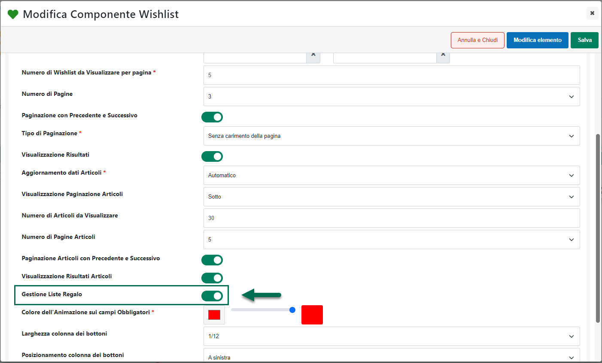{width="5.552083333333333in"
height="3.4090277777777778in"}

**ATTENZIONE! i filtri applicati mediante i campi di ricerca presenti in
testata alla griglia non sono compatibili con i filtri di ricerca
avanzati**

Ciò significa dunque che applicando un filtro di ricerca avanzato
verranno automaticamente eliminati eventuali filtri in colonna
precedentemente applicati e, allo stesso modo, applicando un filtro in
colonna verranno prima eliminati in maniera automatica eventuali filtri
avanzati

Il pulsante "**Colonne**" (
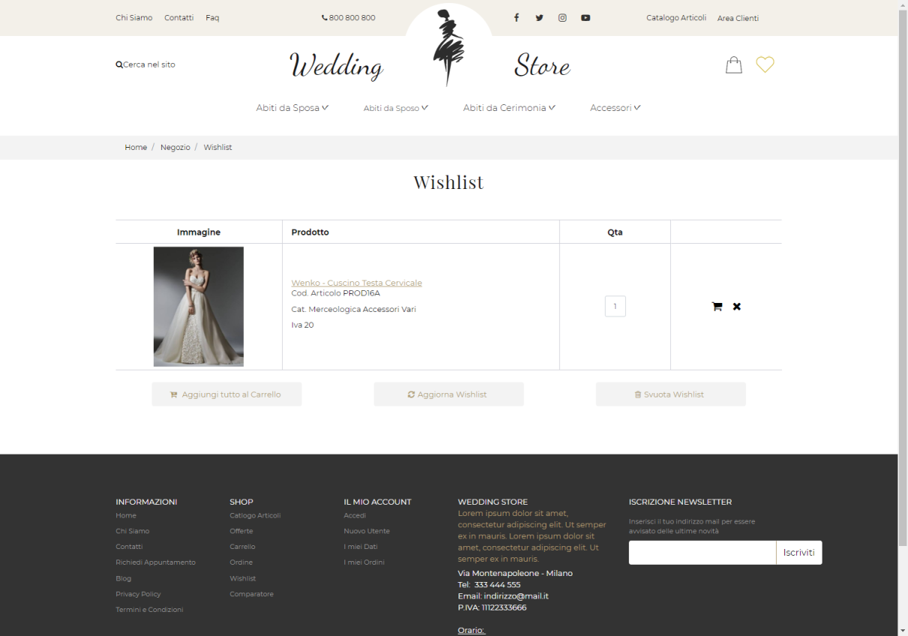{width="0.11666666666666667in"
height="0.11666666666666667in"} ), presente in testata, in
corrispondenza dell'ultima colonna della griglia articoli, consente di
decidere quali informazioni dovranno essere visualizzate direttamente in
tabella. Cliccando su questo pulsante verrà infatti visualizzata la
maschera "**Colonne**"

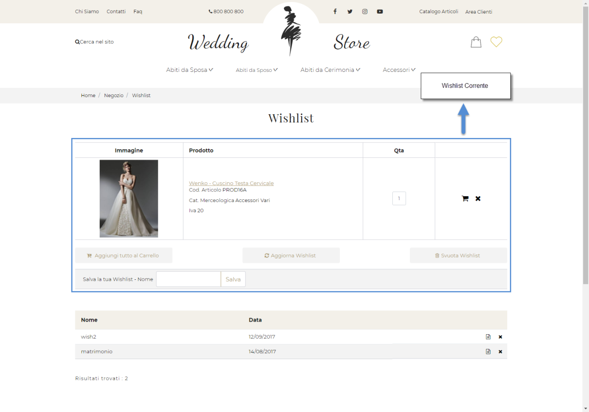{width="4.195138888888889in"
height="2.3506944444444446in"}

mediante la quale poter decidere quale campo attivare / disattivare e
conseguentemente quale informazione mostrare / nascondere.

I dati non presenti direttamente in tabella potranno comunque essere
visualizzati tra le "**ulteriori informazioni**" dell'articolo (oltre
che ovviamente nella relativa maschera di dettaglio) disponibili
cliccando sul pulsante raffigurante una piccola i (
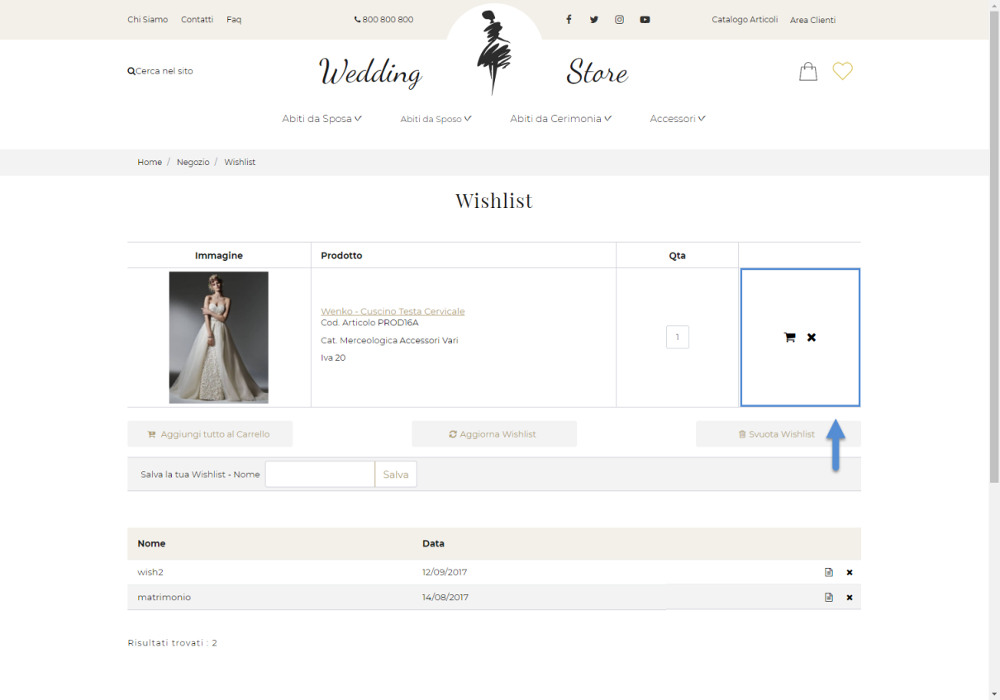{width="0.11666666666666667in"
height="0.11666666666666667in"} ) posto in corrispondenza di ogni
singola riga

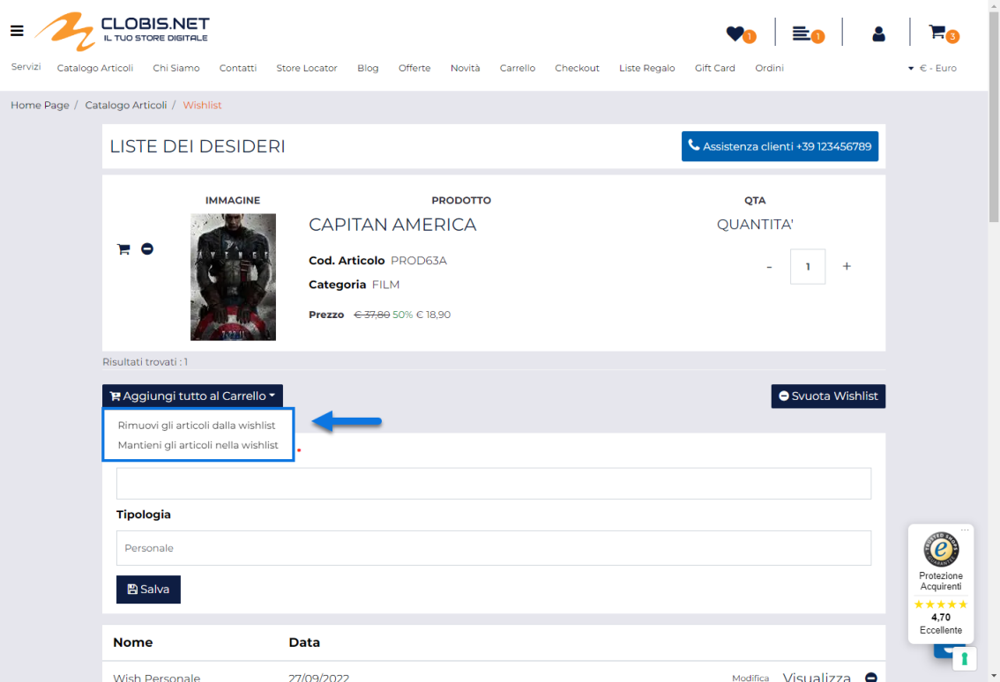{width="5.552083333333333in"
height="3.422222222222222in"}

In definitiva dunque, all'interno di questa maschera sarà possibile
visualizzare / nascondere per ogni singolo articolo le seguenti
informazioni:

- **Codice:** codice gestionale del prodotto -- visualizzato a default

- **Nome:** nome del prodotto (lo stesso che verrà poi utilizzato sul
  font end come "Titolo" dell'articolo) -- visualizzato a default

- **Set Opzioni:** eventuale set di opzioni cui associato all'articolo
  -- visualizzato a default

- **Tipologia:** tipologia dell'articolo (Strutturato, Taglie, Prototipo
  ...) -- visualizzato a default

- **Categoria Merceologica** di appartenenza definita all'interno del
  gestionale.

> **ATTENZIONE!** All'interno di questa sezione verrà visualizzata solo
> l'effettiva categoria di appartenenza del articolo. Per visualizzare
> eventuali categorie merceologiche secondarie associate allo stesso
> prodotto sarà necessario accedere alla sua anagrafica passweb

- **Categoria Statistica**

- **Natura**

- Eventuale **Struttura** di appartenenza

- Eventuale **Serie/Taglia**

- **Qta PWB**: quantità attualmente disponibile su Passweb

> **ATTENZIONE!** Nel valutare quella che per Passweb è la disponibilità
> attuale di un determinato prodotto occorre sempre tener conto:

- di quanto impostato alla pagina "**Catalogo -- Configurazione
  Parametri Catalogo**" all'interno della sezione "Disponibilità", sia
  in termini di **formula utilizzata** per il calcolo della
  disponibilità che in termini di **Scorta Minima** e di Magazzini
  selezionati

- del fatto che la quantità disponibile su Passweb **potrebbe essere
  determinata anche dall'attivazione, per lo specifico articolo, della
  gestione della sua unità di misura secondaria** e, conseguentemente,
  dal relativo fattore di conversione impostato direttamente sul
  gestionale.

> Per maggiori informazioni in merito alla gestione dell'unità di misura
> secondaria si veda anche quanto indicato nel relativo capitolo di
> questo manuale (*Configurazione -- Mexal Configurazione Gestionale --
> Attivazione Passweb -- Funzionalità Mexal Articoli -- Gestione unità
> di misura principale / secondaria*)

- **Data di primo aggiornamento:** coincidente con la data di creazione
  dell'articolo e quindi con la data in cui l'articolo stesso è stato
  esportato per la prima volta sul sito

- **Data di ultimo aggiornamento:** coincidente con l'ultima data in cui
  l'anagrafica del relativo articolo è stata variata in maniera manuale
  o a seguito di una sincronizzazione sito -- gestionale

Tornando alla barra degli strumenti, infine, oltre al pulsante "Filtri
Avanzati" precedentemente esaminato, potranno essere visualizzati anche
ulteriori pulsanti che consentono rispettivamente di:

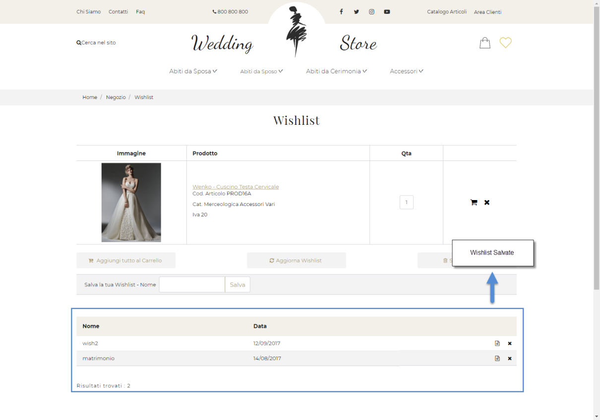{width="5.552083333333333in"
height="3.422222222222222in"}

**Risorse**
({width="0.35694444444444445in"
height="0.2013888888888889in"} ): consente di accedere all'elenco delle
risorse grafiche (immagini e schede tecniche) collegate all'articolo
attualmente selezionato in elenco

**Alias**
({width="0.24027777777777778in"
height="0.16875in"} ): consente di accedere all'elenco dei codici Alias
associati all'articolo attualmente selezionato in elenco

**Commenti**
({width="0.4222222222222222in"
height="0.175in"} ): consente di accedere ai commenti relativi
all'articolo attualmente selezionato in elenco.

**Abbinati** (
{width="0.35694444444444445in"
height="0.175in"} ): consente di accedere all'elenco di articoli
abbinati a quello attualmente selezionato in elenco.

**Modifica** (
{width="0.3958333333333333in"
height="0.18819444444444444in"} ): consente di accedere all'anagrafica
Passweb dell'articolo/servizio selezionato

**Elimina** (
{width="0.3506944444444444in"
height="0.18819444444444444in"} ): consente di eliminare l'articolo
attualmente selezionato dal database di Passweb.

**Link Carrello** (
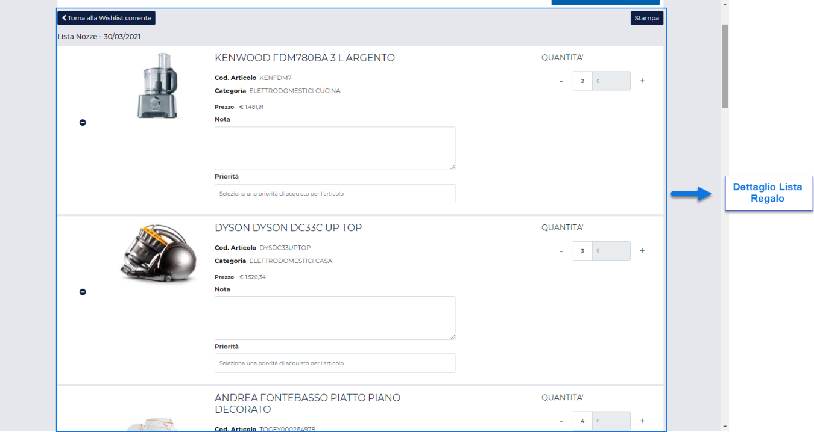{width="0.48055555555555557in"
height="0.175in"} ): consente di generare e copiare in clipboard un link
che potrà poi essere utilizzato per aggiungere automaticamente in
carrello (con **quantità unitaria**) l'articolo attualmente selezionato
in elenco.

In sostanza dunque nel momento in cui il link così generato dovesse
essere inserito nella barra degli indirizzi del browser oppure
all'interno di una pagina web e successivamente cliccato, l'utente verrà
automaticamente ridiretto alla pagina Carrello del sito dove troverà,
già inserito in quantità unitaria, il prodotto oggetto del link.

**ATTENZIONE!** il pulsante "Link Carrello" verrà visualizzato solo nel
caso in cui il prodotto selezionato in elenco dovesse essere un prodotto
finito.

Non sarà quindi possibile, per ovvie ragioni, generare un link di
aggiunta automatica in carrello per articoli di tipo spesa, modificatori
ne tanto meno per articoli padri di struttura o per articoli a taglie.

**Ulteriori operazioni** (
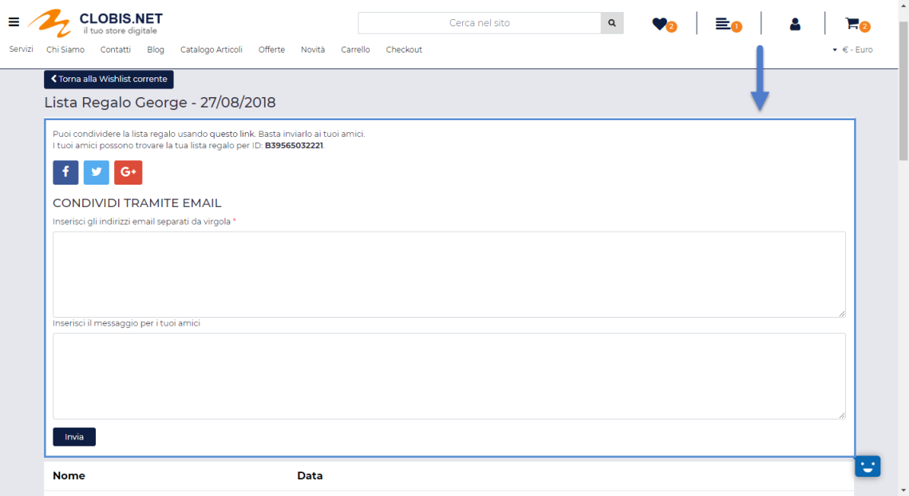{width="0.22083333333333333in"
height="0.175in"} ): consente, se cliccato, di aprire un piccolo menu
contestuale contenente una serie di altre funzioni relative agli
articoli gestiti all'interno del proprio sito

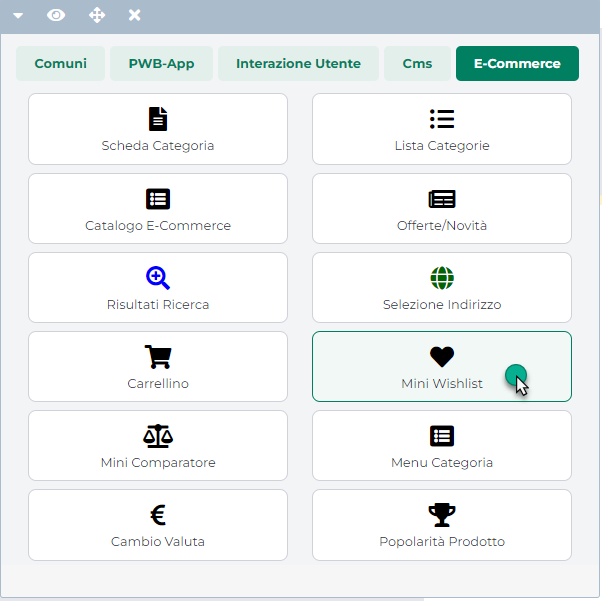{width="2.0388888888888888in"
height="2.129861111111111in"}

Nello specifico:

- **Esporta / Importa Box**: consente di esportare / importare
  all'interno di appositi file csv i dati relativi ai campionari e/o
  agli articoli composti dei gestionali Ho.Re.Ca. attualmente presenti
  all'interno del sito

- **Esporta / Importa**: consente di esportare/importare all'interno di
  appositi file i dati gestiti da Passweb relativamente agli articoli
  attualmente presenti all'interno del sito.

- **Importa Risorse**: consente di effettuare un import massivo delle
  risorse grafiche (immagini e schede tecniche) da associare agli
  articoli attualmente gestiti all'interno del sito.

Per maggiori informazioni relativamente a ciascuna delle operazioni
collegate ai pulsanti appena esaminati si vedano i successivi capitoli
di questo manuale.

##### GESTIONE RISORSE ARTICOLO

Per poter gestire direttamente dal Wizard di Passweb le varie risorse
(immagini e allegati/schede tecniche) associate ad uno qualsiasi degli
articoli presenti all'interno del sito, è sufficiente selezionare
l'articolo desiderato all'interno della maschera "Gestione Articoli", e
cliccare poi sul pulsante **Risorse**
({width="0.35694444444444445in"
height="0.2013888888888889in"} ) presente nella contestuale barra degli
strumenti.

Verrà quindi visualizzata la maschera **"Gestione Risorse -- Nome
Prodotto"**

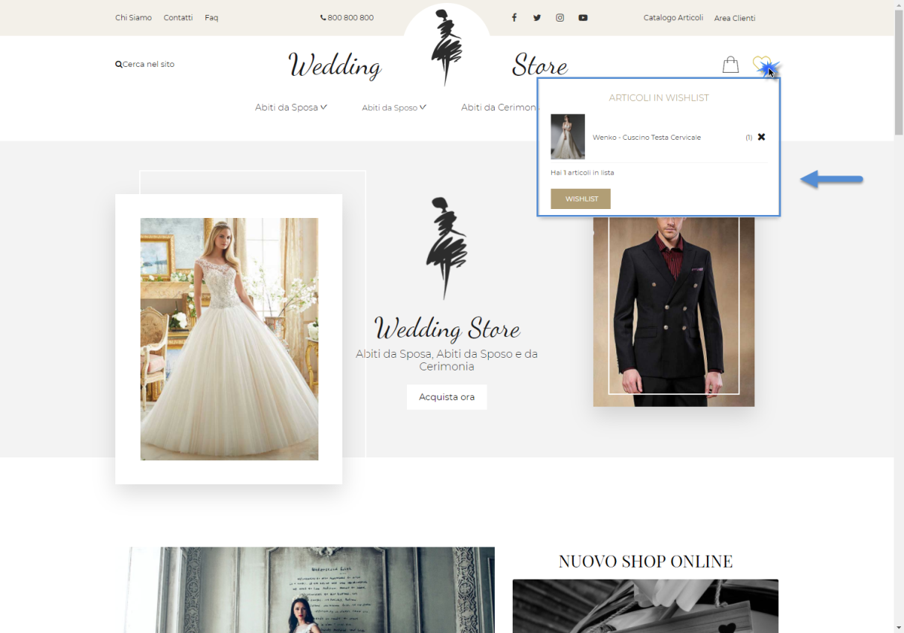{width="5.792361111111111in"
height="3.5131944444444443in"}

contenente tutte le immagini e le schede tecniche associate, all'interno
del gestionale o direttamente all'interno di Passweb, all'articolo in
esame.

> **NOTA BENE:** per maggiori informazioni relativamente alle modalità
> di associazione delle varie risorse agli articoli si veda anche il
> corrispondente capitolo "Configurazione Parametri Catalogo --
> Parametri Immagini - Associazione delle Immagini e delle Schede
> Tecniche allo specifico Articolo" di questo manuale.

Passando col mouse sopra una delle immagini collegate all'articolo verrà
visualizzata nella parte sinistra della maschera un'anteprima della
risorsa stessa.

I pulsanti presenti nella contestuale barra degli strumenti consentono
rispettivamente di:

**Cancella Risorsa**
({width="0.5909722222222222in"
height="0.175in"} ): consente di **eliminare dal sito** (ma ovviamente
**non dal gestionale**) la risorsa attualmente selezionata.

**ATTENZIONE!** Nel caso in cui l'esigenza dovesse essere quella di
eliminare dal sito, automaticamente, tutte le risorse che non risultano
essere più collegate, all'interno del gestionale, ad articoli gestiti
sul sito, sarà necessario lanciare l'apposita procedura di cancellazione
delle risorse inesistenti (solo per siti Ecommerce collegati a Mexal).
Per maggiori informazioni in merito si veda anche la sezione
"*Configurazione Gestionale -- Parametri Sincronizzazione --
Importazione Risorse Articolo*" di questo manuale.

**Aggiungi Risorsa**
({width="0.6236111111111111in"
height="0.18819444444444444in"} ): consente di **aggiungere** una nuova
risorsa all'articolo attualmente selezionato e/o di modificare una delle
risorse ad esso già associate.

**ATTENZIONE!** sono accettate solo ed esclusivamente immagini di peso
inferiore a 1 MB

In particolare dunque, cliccando su questo pulsante verrà visualizzata
la maschera **"Risorsa"** mediante la quale poter specificare tutte le
caratteristiche della risorsa che si vuole importare in Passweb ed
associare all'articolo attualmente selezionato.

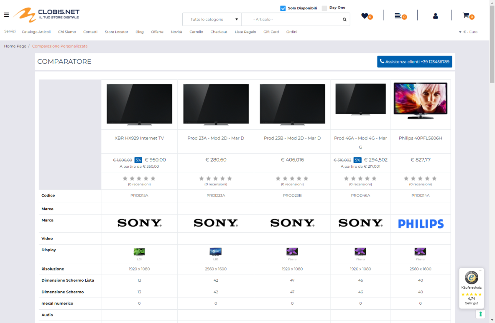{width="5.856944444444444in"
height="3.558333333333333in"}

- **File:** il pulsante "Scegli File" presente all'interno di questo
  campo consente di selezionare il file (immagine o scheda tecnica) da
  associare alla risorsa attualmente selezionata, ricercandolo
  all'interno di una qualsiasi cartella fisicamente presente sulla
  propria macchina o su di una qualsiasi altra macchina raggiungibile
  dalla propria installazione.

- **Tipo Risorsa:** consente di specificare il tipo di risorsa che si
  intende associare all'articolo attualmente selezionato. E' possibile
  indicare uno dei seguenti valori:

  - **Immagine:** selezionando questa opzione dovrà poi essere indicata
    anche la tipologia dell'immagine (Catalogo, Prodotto, Secondaria)
    che si intende caricare, ed eventualmente, nel caso di Immagini
    Secondarie, anche il suo progressivo.

  - **Scheda:** selezionando questa opzione dovrà poi essere indicato il
    progressivo della scheda che si intende caricare (essendo
    effettivamente possibile gestire più schede tecniche per uno stesso
    articolo) e la specifica lingua cui la scheda in esame dovrà essere
    associata (essendo effettivamente possibile anche gestire le schede
    tecniche per ciascuna delle lingue attivate).

<!-- -->

- **Tipo Immagine:** consente di specificare la tipologia dell'immagine
  che si intende associare all'articolo attualmente selezionato (**solo
  nel caso di "Tipo Risorsa = Immagine"**). E' possibile selezionare uno
  dei seguenti valori:

  - **Immagine Catalogo:** selezionando questa opzione l'immagine
    caricata verrà considerata come "Immagine Catalogo" ed utilizzata
    all'interno di componenti quali il Catalogo E-commerce, le
    Offerte/Novità ecc...

  - **Immagine Prodotto:** selezionando questa opzione l'immagine
    caricata verrà considerata come "Immagine principale della Scheda
    Prodotto" (solitamente è quella per la quale vengono impostate le
    dimensioni maggiori).

  - **Immagine Secondaria:** selezionando questa opzione l'immagine
    caricata verrà considerata come "Immagine secondaria della Scheda
    Prodotto" e visualizzata quindi tra le miniature della
    corrispondente galleria di immagini

- **Progressivo Immagine Secondaria**: consente di specificare il numero
  progressivo dell'immagine secondaria che si sta caricando (**solo nel
  caso di "Tipo Immagine = Immagine Secondaria"**). Tale progressivo
  servirà a determinare l'ordine di visualizzazione della specifica
  immagine all'interno della relativa galleria di immagini.

- **Progressivo Scheda:** consente di specificare, selezionandolo
  dall'apposito menu a tendina, il numero progressivo della scheda
  tecnica che si sta caricando (solo nel caso di "**Tipo Risorsa =
  Scheda"**)

- **Lingua Scheda:** consente di indicare la specifica lingua cui
  associare la scheda tecnica che si sta caricando (solo nel caso di
  **"Tipo Risorsa = Scheda"**). Verranno proposte tutte le lingue
  attivate e gestite sul sito.

Confermando i dati inseriti la nuova risorsa verrà caricata in Passweb
ed associata all'articolo in esame.

> **NOTA BENE:** nel caso in cui esista già una risorsa con le
> caratteristiche selezionate (ad esempio perché associata all'articolo
> in questione mediante Docuvision), questa verrà sovrascritta dalla
> nuova risorsa

**Nel caso di siti Ecommerce collegati a Mexal, se l'articolo in
questione dovesse essere un' articolo gestito a taglie/colori**
(collegato quindi alla tabella taglie di Mexal) selezionandolo
compariranno nella barra degli strumenti due ulteriori pulsanti:
"Collega Serie" e "Scollega Serie"

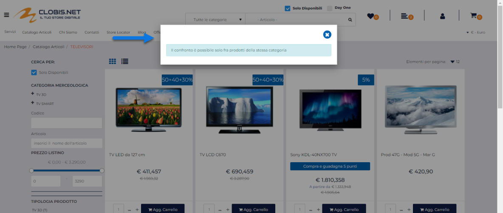{width="5.856944444444444in"
height="3.558333333333333in"}

**Collega Serie**
(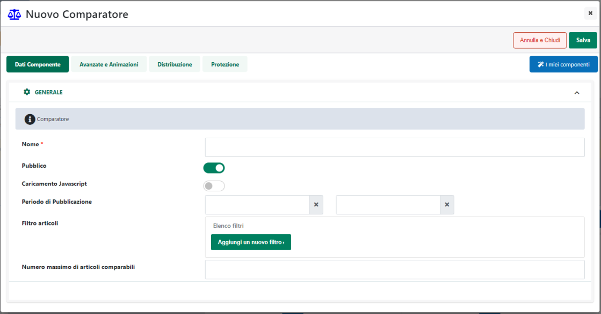{width="0.48680555555555555in"
height="0.16875in"} ): consente di associare l'immagine attualmente
selezionata ad uno specifico elemento (taglia o colore) della serie cui
appartiene l'articolo in questione.

**Scollega Serie**
({width="0.5326388888888889in"
height="0.18194444444444444in"} ): consente di eliminare l'associazione
tra l'immagine attualmente selezionata e uno specifico elemento della
serie.

**Le immagini non associate in maniera specifica a nessun elemento della
serie verranno sempre visualizzate all'interno della galleria immagini
della scheda prodotto.**

**Le immagini associate ad uno specifico elemento della serie verranno
invece visualizzate solo nel momento in cui verrà selezionato quello
specifico elemento (taglia o colore) modificando il valore della
select-box (se grafica minimale) o cliccando su una taglia (se grafica
estesa).**

**Nel caso di siti Ecommerce collegati ad un gestionale Ho.Re.Ca** gli
articoli a taglie/colori verranno invece gestiti come articoli
strutturati. In queste condizioni, se l'esigenza dovesse essere quella
di associare immagini diverse alle diverse taglie e/o ai diversi colori
di un articolo, sarà quindi necessario esportare sul sito i relativi
articoli figlio e assegnare direttamente ad essi le diverse immagini.

Per maggiori informazioni relativamente alla gestione di articoli a
taglie/colori in siti Ecommerce collegati a Mexal o a uno dei gestionali
Ho.Re.Ca si vedano anche i successivi capitoli "*Taglie/Colori*" e
"*Strutture*" di questo manuale

##### IMPORTAZIONE MASSIVA DELLE RISORSE ARTICOLO

Oltre a poter associare le risorse grafiche (immagini e schede tecniche)
ai vari articoli presenti all'interno del sito lavorando articolo per
articolo come descritto nel precedente capitolo di questo manuale,
volendo è anche possibile effettuare un'importazione massiva di tutte
queste risorse.

In questo senso cliccando sul pulsante **Importa Risorse**, disponibile
all'interno del menu "**Ulteriori operazioni**" (
{width="0.22083333333333333in"
height="0.175in"} )

{width="2.0388888888888888in"
height="2.129861111111111in"}

verrà visualizzata la maschera "**File Risorse Articoli**" all'interno
della quale poter indicare **il percorso di un file .zip** appositamente
creato e contenente tutte le risorse da associare ai vari articoli
oltre, ovviamente, ad un file .csv mediante il quale poter indicare
quale risorsa associare a quale articolo.

{width="5.804861111111111in"
height="3.5256944444444445in"}

**ATTENZIONE!** anche in questo caso saranno comunque accettate solo ed
esclusivamente immagini di peso inferiore a 1 MB

Gli ulteriori due parametri presenti all'interno di questa maschera
consentono rispettivamente di:

- **Separatore:** consente di indicare, selezionandolo, dall'apposito
  menu a tendina, il carattere che è stato utilizzato all'interno del
  file di importazione come separatore per i vari campi

- **Rimuovi le risorse non presenti nel file per gli articoli
  indicati:** consente, se selezionato, di rimuovere automaticamente le
  risorse non indicate in maniera specifica per gli articoli dichiarati
  all'interno del file di importazione.

> Supponendo dunque di importare un file csv come quello di seguito
> indicato:
>
> *codice;risorsa;tipo;progressivo;lingua*
>
> *articolo1;imgcatalogo.png;I;0;*
>
> e di essere nelle condizioni in cui per l'articolo1 siano già presenti
> le immagini con progressivi 0,1 e 2 selezionando il parametro in
> oggetto, al termine dell'importazione le risorse con progressivi 1 e 2
> relative all'articolo1 verranno automaticamente cancellate
>
> **ATTENZIONE! eventuali risorse associate ad articoli non indicati nel
> file di importazione non verranno assolutamente rimosse**
>
> Allo stesso modo nel momento in cui la procedura di importazione
> dovesse ritornare un errore di "**Risorsa non trovata**" dovuto al
> fatto che il file "imgcatalogo.png" indicato nel csv di importazione
> non è poi stato effettivamente incluso nello zip, l'immagine relativa
> al progressivo indicato (nell'esempio in questione quella con
> progressivo 0) non verrà eliminata.

Affinchè la procedura di import possa funzionare in maniera corretta e
le varie risorse possano essere associate ai relativi articoli dovranno
essere rispettate delle regole ben precise.

All'interno del file .zip dovranno essere presenti:

- **tutte le risorse grafiche** (immagini e schede tecniche) da
  associare ad articoli gestiti all'interno del sito

- **un file csv** appositamente realizzato e necessario per indicare
  quale risorsa associare a quale articolo.

Nello specifico poi per quel che riguarda il file csv:

- l'intestazione, ossia la prima riga del file, dovrà contenere i
  seguenti campi (nell'ordine indicato): **codice, risorsa, tipo,
  progressivo, lingua, taglia**

- per ogni record del file dovranno quindi essere inserite le seguenti
  informazioni (nell'ordine indicato):

  - **codice**: codice articolo

  - **risorsa**: nome del file con relativa estensione da associare
    all'articolo indicato nel precedente campo

  - **tipo**: tipo della risorsa. Può assumere i seguenti valori:

    - **I** nel caso in cui la risorsa da associare all'articolo sia un
      Immagine

    - **S** nel caso in cui la risorsa da associare all'articolo sia una
      Scheda Tecnica (es. file .pdf)

  - **progressivo**: numero indicante il progressivo della relativa
    immagine o della relativa scheda tecnica. Nel caso delle immagini
    utilizzando come progressivo il numero:

    - **0** la relativa immagine verrà utilizzata come **Immagine
      Catalogo**

    - **1** la relativa immagine verrà utilizzata come **Immagine
      Principale della Scheda Prodotto**

    - **da 2 a N** la relativa immagine verrà utilizzata come **Immagine
      Secondaria della Scheda Prodotto**

  - **lingua**: codice ISO a due lettere della lingua relativa alla
    scheda articolo (es. it)

  - **taglia (solo Ecommerce Mexal)**: indice presente nella tabella
    Taglie del gestionale in corrispondenza della specifica taglia cui
    collegare la risorsa in esame.

{width="4.285416666666666in"
height="2.045138888888889in"}

> Supponendo, in riferimento alla figura sopra riportata, di voler
> collegare una specifica immagine al colore "GRI" della serie 3 (Colori
> Cover) l'indice da utilizzare, nel relativo record del file di
> importazione, sarà il 2, quello cioè che corrisponde alla colonna in
> cui è posizionato l'elemento GRI
>
> **ATTENZIONE**! Ovviamente il campo Taglia andrà gestito solamente in
> corrispondenza di risorse di tipo immagine
>
> Valorizzando tale campo, l'immagine corrispondente verrà quindi
> collegata al corrispondente elemento della serie. Nel caso in cui
> invece, il campo Taglia dovesse essere lasciato vuoto, la
> corrispondente immagine non verrà collegata a nessun elemento della
> serie.

- Il carattere separatore dei vari campi deve essere esattamente quello
  indicato all'interno del campo "**Separatore**" presente nel form di
  importazione

- Nel caso in cui la risorsa da associare all'articolo sia un'immagine,
  non gestita in lingua e quindi priva di codice ISO, sarà comunque
  necessario inserire il carattere separatore in corrispondenza del
  relativo campo del record.

**ATTENZIONE! E' necessario effettuare direttamente lo zip delle risorse
grafiche e del file csv e non della cartella contenente tali file. Nel
caso in cui si dovesse infatti effettuare lo zip della cartella
contenente le risorse grafiche e il file csv la procedura di
importazione e associazione delle risorse non potrà terminare in maniera
corretta.**

**NOTA BENE:** per l'upload multiplo di risorse sono gestiti unicamente
file .zip. Non sono ammessi quindi altri formati di compressione (es.
file .rar).

Durante l\'importazione il file .zip verrà decompattato e le singole
risorse verranno associate ai relativi articoli secondo quanto indicato
nel file csv.

**ATTENZIONE!** Nel caso in cui all'interno del file .zip siano presenti
dei file con lo stesso nome già presenti all'interno del sito, questi
ultimi verranno sovrascritti.

Infine nel caso in cui durante la decompattazione dell'archivio
compresso si dovesse raggiungere il limite dello spazio su disco
(secondo quanto indicato dal contratto), le restanti risorse non
verranno importate.

##### ELIMINAZIONE DI UN ARTICOLO DA PASSWEB

Se necessario è possibile eliminare gli articoli attualmente gestiti
all'interno del sito operando direttamente dal Wizard di Passweb.

Per far questo è sufficiente selezionare l'articolo desiderato
all'interno della maschera "Gestione Articoli", e cliccare poi sul
pulsante **Elimina**
({width="0.3506944444444444in"
height="0.18819444444444444in"} )

Operando in questo modo l'articolo selezionato verrà però rimosso solo
ed esclusivamente dal database di Passweb, mentre non verranno apportate
variazioni, ovviamente, ai suoi parametri di configurazione presenti
all'interno del gestionale.

Ciò significa che, in queste condizioni, ad una successiva
sincronizzazione l'articolo potrebbe anche essere riesportato e
comparire nuovamente all'interno del sito.

**ATTENZIONE!** **La procedura corretta per l' eliminazione definitiva
di un articolo dal sito è quella che prevede di agire direttamente
all'interno del gestionale impostando l'articolo stesso in modo tale che
non venga più esportato e gestito all'interno del sito.**

##### IMPORTAZIONE / ESPORTAZIONE DEI DATI ARTICOLO TRAMITE FILE

Tipicamente in un sito Ecommerce collegato con un gestionale
Passepartout i dati relativi agli articoli gestiti vengono prelevati
automaticamente, alla sincronizzazione, dal gestionale stesso.

Considerando però che Passweb offre la possibilità di estendere queste
informazioni mediante la creazione di appositi Attributi Articolo
potrebbe essere particolarmente utile importare / esportare queste
informazioni in blocco mediante l'upload / download di un apposito file.

In questo il pulsante **Importa**, disponibile all'interno del menu
"**Ulteriori operazioni**" (
{width="0.22083333333333333in"
height="0.175in"} )

{width="2.0388888888888888in"
height="2.129861111111111in"}

consente di caricare in maniera massiva i dati gestiti da Passweb
relativamente agli articoli attualmente presenti all'interno del sito.

Cliccando su questo pulsante verrà quindi visualizzata la maschera
**"File Dati Articolo"** mediante la quale poter effettuare l'upload del
file contenente le informazioni desiderate.

{width="5.804861111111111in"
height="3.5256944444444445in"}

Nello specifico all'interno di questa sezione sarà necessario indicare:

- **File (csv-txt):** consente di selezionare il file txt o csv da
  uplodare e contenente i dati da associare ai vari articoli gestiti
  all'interno del sito

- **Lingua**: consente di indicare la lingua del sito a cui dovranno
  fare riferimento i dati presenti all'interno del file di importazione

- **Separatore**: consente di indicare, selezionandolo, dall'apposito
  menu a tendina, il carattere che è stato utilizzato all'interno del
  file di importazione come separatore per i vari campi

Affinchè la procedura di import possa funzionare in maniera corretta e i
dati contenuti nel file possano essere associati ai relativi articoli,
dovranno essere rispettate delle regole ben precise. Nello specifico

- Prima di avviare la procedura di import dovranno già essere stati
  creati all'interno di Passweb, tutti gli attributi articolo da
  valorizzare attraverso questa procedura.

- Il file da importare deve avere estensione .csv o .txt

- Il carattere separatore dei vari campi deve essere esattamente quello
  indicato all'interno del campo "**Separatore**" presente nel form di
  importazione.

- L'intestazione, ossia la prima riga del file, deve necessariamente
  contenere l'elenco dei nomi dei campi articolo che dovranno poi essere
  valorizzati con i dati presenti all'interno del file stesso. **Il nome
  dei campi non è case sensitive**

> Supponendo di aver scelto come carattere separatore il TAB,
> l'intestazione del file dovrà avere una struttura del tipo
>
> **NOME CAMPO1 (TAB) NOME CAMPO2 (TAB) ..... (TAB) NOME CAMPON**
>
> Allo stesso modo le righe dei dati dovranno avere una struttura del
> tipo
>
> **VALORE1 (TAB) VALORE2(TAB) .... (TAB) VALOREN**

- Il primo campo del file dovrà essere obbligatoriamente il **Codice
  dell'Articolo**. La presenza di questo campo è ovviamente
  **indispensabile** in quanto è quella che assicurerà poi
  l'associazione dei dati ai relativi articoli.

> **NOTA BENE:** se all'interno del file da importare non è presente il
> CODICE ARTICOLO e/o se i codici inseriti all'interno di questo campo
> non coincidono con quelli degli articoli effettivamente presenti
> all'interno del sito la procedura di import non valorizzerà,
> ovviamente, alcun campo dati
>
> **E' possibile utilizzare all'interno del codice articolo il carattere
> jolly ?** in maniera tale da poter associare i dati presenti
> all'interno di una stessa riga a più articoli contemporaneamente.
>
> Utilizzando ad esempio il codice articolo "AGLIANIC???" i dati
> presenti nel file in corrispondenza di questa riga verranno associati
> a tutti gli articoli presenti all'interno del sito che hanno un codice
> lungo 11 caratteri e che iniziano con la strina "AGLIANIC"

- **Il file di importazione deve soddisfare le specifiche del formato
  RFC4180.**

> **ATTENZIONE!** In questo senso è quindi necessario che il valore dei
> campi contenenti interruzioni di riga, e/o lo stesso carattere
> utilizzato anche come separatore sia necessariamente racchiuso da
> virgolette.
>
> **Inoltre nel caso in cui il valore di un campo abbia al suo interno
> elementi racchiusi da doppi apici (come potrebbe ad esempio avvenire
> nel caso di codice HTML) sarà necessario racchiudere tra virgolette
> oltre all'intero campo anche questi stessi elementi**.
>
> Supponendo, ad esempio, di aver scelto come carattere separatore il ;
> e di voler importare un file csv con i soli campi CODICE e
> DESCRIZIONE, potrebbero configurarsi le seguenti casistiche:
>
> 1 -- Il campo DESCRIZIONE non contiene il carattere ; 🡪 il valore di
> questo campo **NON dovrà essere racchiuso da virgolette**
>
> **ART01;Descrizione ART01**
>
> 2 -- Il campo DESCRIZIONE contiene il carattere ; 🡪 il valore di
> questo campo **dovrà essere racchiuso da virgolette**
>
> **ART01;"Descrizione ART01 contenente un ; che deve essere gestito"**
>
> 3 -- Il campo DESCRIZONE contiene dei doppi apici 🡪 sarà necessario
> racchiudere tra virgolette **sia l'intero campo che l'elemento
> presente al suo interno e racchiuso da doppi apici**
>
> **ART01;"il campo descrizione contiene ""doppi apici"" che devono
> essere gestiti"**
>
> 4 -- Il campo DESCRIZONE contiene un new line (ritorno a capo) 🡪 il
> valore di questo campo **dovrà essere racchiuso da virgolette**
>
> **ART01;"il campo descrizione contiene un**
>
> **new line che deve essere gestito"**
>
> **ATTENZIONE!** Eventuali descrizioni degli articoli non devono essere
> necessariamente allineate tutte su una riga, possono essere utilizzati
> dei new line (ritorno a capo) facendo però attenzione a racchiudere il
> valore di questi campi da doppi apici

- E' necessario creare file distinti per le diverse lingue gestite
  all'interno del sito. In fase di importazione sarà poi possibile, come
  visto, indicare la specifica lingua cui il file fa riferimento.

- Oltre al campo CODICE, gli ulteriori campi articolo gestiti, e che
  potranno quindi essere valorizzati in maniera massiva attraverso
  questa procedura, sono i seguenti (**viene indicato il nome del campo
  da inserire nella riga di intestazione del file e il tipo di valore da
  utilizzare nei vari record del file stesso**):

> **[SITI ECOMMERCE COLLEGATI A MEXAL]{.underline}**

- titolo (valore testuale) -- **solo nel caso in cui si sia scelto
  gestire il titolo (ed eventualmente il permalink) delle pagine
  prodotto utilizzando come tipo di dato l'opzione "Passweb".**

- categoriaMerceologica (valore testuale) -- consente di associare al
  relativo articolo una o più Categorie Merceologiche secondarie

> Per maggiori informazioni in merito all'associazione, lato Passweb, di
> più categorie merceologiche allo stesso articolo si veda anche la
> successiva sezione "*Associazione di un articolo a più categorie
> merceologiche*" di questo manuale.
>
> **ATTENZIONE! i valori relativi a questo campo, e che verranno poi
> inserti nei vari record del file, dovranno coincidere con i codici
> delle Categorie Merceologiche effettivamente gestite all'interno del
> sito. Inoltre nel momento in cui un articolo dovesse essere associato
> a due o più categorie merceologiche secondarie, i codici di tali
> categorie dovranno essere separati da punto e virgola ;**
>
> Considerando quanto precedentemente indicato relativamente alle
> specifiche di costruzione del file, nel momento in cui si dovesse
> decidere di utilizzare il carattere ; come separatore di campi e si
> volessero associare massivamente più categorie merceologiche ad un
> determinato articolo i codici di tali categorie oltre ad essere
> separati da ; dovranno anche essere racchiusi da doppi apici come
> nell'esempio di seguito riportato.
>
> **Es. "codiceCategoria1;codiceCategoria2; ... codiceCategoriaN"**

- descrizione (valore testuale)

- descrizioneDettagliata (valore testuale)

- descrizioneHtml (valore testuale )

- descrizioneHtml2 (valore testuale )

- descrizioneHtml3 (valore testuale )

- scortaMinima -- consente di impostare per il relativo articolo il
  valore della sua "Scorta Minima"

- sogliaDisponibilita -- consente di impostare per il relativo articolo
  il valore della sua "Soglia Disponibilità"

- dispDba -- da considerarsi solo per articoli di tipo DBA -- Consente
  di specificare come dovrà essere gestito il calcolo della
  disponibilità per il corrispondente articolo di tipo DBA. Può assumere
  i seguenti valori:

  - Dba -- consente di calcolare la disponibilità del prodotto basandosi
    sui progressivi dell'articolo stesso

  - Componenti -- consente di calcolare la disponibilità del prodotto
    facendo riferimento alle disponibilità dei singoli componenti

- qtaConfezioneType: consente di specificare come dovrà essere venduto
  l'articolo nel caso in cui ad effettuare l'ordine sia un utente di
  Privato e nel caso in cui l'articolo in esame sia un articolo gestito
  a Confezioni. Può assumere i seguenti valori:

  - Propositiva

  - Bloccata

  - BloccataAutomatica

  - Singola

- qtaConfezioneTypeAziende: consente di specificare come dovrà essere
  venduto l'articolo nel caso in cui ad effettuare l'ordine sia un
  utente di tipo Azienda e nel caso in cui l'articolo in esame sia un
  articolo gestito a Confezioni. Può assumere i seguenti valori:

  - Propositiva

  - Bloccata

  - BloccataAutomatica

  - Singola

- setOpzioni (valore testuale): consente di indicare il nome del set di
  opzioni di personalizzazione da associare all'articolo in esame

- giftCard (valore testuale): consente di indicare il nome della Gift
  Card da associare all'articolo in esame

- classiCustom (valore testuale): consente di indicare le classi CSS
  (separate l'una dall'altra da uno spazio) che dovranno essere
  assegnate poi all'articolo in esame

- boxConfigurabile (valore testuale): consente di indicare se l'articolo
  esame è o meno un campionario configurabile. Sono ammessi i valori SI
  e NO. Nel momento in cui non dovesse essere valorizzato l'articolo si
  riterrà non configurabile.

- maxComponenti (valore numerico): consente di indicare il numero
  massimo dei componenti del box. Nel momento in cui non dovesse essere
  valorizzato l'eventuale box configurabile non avrà alcun numero
  massimo di componenti

- minComponenti (valore numerico): consente di indicare il numero minimo
  dei componenti del box. Nel momento in cui non dovesse essere
  valorizzato l'eventuale box configurabile non avrà alcun numero minimo
  di componenti

- spedizione_width (valore numerico): consente di indicare la larghezza
  dell'articolo in esame (valore espresso in cm)

- spedizione_height (valore numerico): consente di indicare l'altezza
  dell'articolo in esame (valore espresso in cm)

- spedizione_depth (valore numerico): consente di indicare la profondità
  dell'articolo in esame (valore espresso in cm)

- spedizione_weight (valore numerico): consente di indicare il peso
  dell'articolo in esame (valore espresso in kg)

> **ATTENZIONE!** I campi utilizzati per gestire le dimensioni
> dell'articolo (spedizione_width, spedizione\_ height, spedizione\_
> depth, spedizione\_ weight ) verranno valutati in fase di importazione
> del file csv solo nel caso in cui non sia stata attivata in Mexal
> l'App "**Invio documenti a Passdelivery**"
>
> Nel caso in cui l'App in questione sia stata correttamente attivata, i
> campi Passweb saranno in sola lettura e le dimensioni degli articoli
> andranno impostate direttamente nel gestionale utilizzando i campi
> messi a disposizione da questa stessa App

- metaKeywords (valore testuale )

- metaDescription (valore testuale )

- title (valore testuale)

- nomi degli attributi di tipo Passweb (valore coerente con la tipologia
  di attributo considerato)

- siteMap: booleano che può assumere i seguenti valori:

  - SI: include l'articolo nella sitemap

  - NO: esclude l'articolo dalla sitemap

> Nel caso in cui non venga indicato nessun valore l'articolo in esame
> erediterà, per questo campo, quanto indicato nella sezione "Preferenze
> Sito"

- sitemapChangefreq: testo che può assumere i seguenti valori:

  - always: sempre

  - hourly: oraria

  - daily: giornaliera

  - weekly: settimanale

  - monthly: mensile

  - yearly: annuale

  - never: mai

> Nel caso in cui non venga indicato nessun valore l'articolo in esame
> erediterà, per questo campo, quanto indicato nella sezione "Preferenze
> Sito"

- sitemapPriority: decimale che può assumere i seguenti valori:

  - 0,0

  - 0,1

  - 0,2

  - 0,3

  - 0,4

  - 0,5

  - 0,6

  - 0,7

  - 0,8

  - 0,9

  - 1,0

> Nel caso in cui non venga indicato nessun valore l'articolo in esame
> erediterà, per questo campo, quanto indicato nella sezione "Preferenze
> Sito"
>
> **[SITI ECOMMERCE COLLEGATI AD UN GESTIONALE HO.RE.CA.]{.underline}**

- titolo (valore testuale)

- categoriaMerceologica (valore testuale) -- consente di associare al
  relativo articoli una o più Categorie Merceologiche secondarie

> Per maggiori informazioni in merito all'associazione, lato Passweb, di
> più categorie merceologiche allo stesso articolo si veda anche la
> successiva sezione "*Associazione di un articolo a più categorie
> merceologiche*" di questo manuale.
>
> **ATTENZIONE! i valori relativi a questo campo, e che verranno poi
> inserti nei vari record del file, dovranno coincidere con i codici
> delle Categorie Merceologiche effettivamente gestite all'interno del
> sito. Inoltre nel momento in cui un articolo dovesse essere associato
> a due o più categorie merceologiche secondarie, i codici di tali
> categorie dovranno essere separati da punto e virgola ;**
>
> Considerando quanto precedentemente indicato relativamente alle
> specifiche di costruzione del file, nel momento in cui si dovesse
> decidere di utilizzare il carattere ; come separatore di campi e si
> volessero associare massivamente più categorie merceologiche ad un
> determinato articolo i codici di tali categorie oltre ad essere
> separati da ; dovranno anche essere racchiusi da doppi apici come
> nell'esempio di seguito riportato.
>
> **Es. "codiceCategoria1;codiceCategoria2; ... codiceCategoriaN"**

- descrizione (valore testuale)

- descrizioneDettagliata (valore testuale)

- descrizioneHtml (valore testuale)

- descrizioneHtml2 (valore testuale)

- DescrizioneHtml3 (valore testuale)

- scortaMinima -- consente di impostare per il relativo articolo il
  valore della sua "Scorta Minima"

- sogliaDisponibilita -- consente di impostare per il relativo articolo
  il valore della sua "Soglia Disponibilità"

- setOpzioni (valore testuale): consente di indicare il nome del set di
  opzioni di personalizzazione da associare all'articolo in esame

- giftCard (valore testuale): consente di indicare il nome della Gift
  Card da associare all'articolo in esame

- classiCustom (valore testuale): consente di indicare le classi CSS
  (separate l'una dall'altra da uno spazio) che dovranno essere
  assegnate poi all'articolo in esame

- boxConfigurabile (valore testuale): consente di indicare se l'articolo
  esame è o meno un campionario configurabile. Sono ammessi i valori SI
  e NO. Nel momento in cui non dovesse essere valorizzato l'articolo si
  riterrà non configurabile.

- maxComponenti (valore numerico): consente di indicare il numero
  massimo dei componenti del box. Nel momento in cui non dovesse essere
  valorizzato l'eventuale box configurabile non avrà alcun numero
  massimo di componenti

- minComponenti (valore numerico): consente di indicare il numero minimo
  dei componenti del box. Nel momento in cui non dovesse essere
  valorizzato l'eventuale box configurabile non avrà alcun numero minimo
  di componenti

- spedizione_width (valore numerico): consente di indicare la larghezza
  dell'articolo in esame (valore espresso in cm)

- spedizione_height (valore numerico): consente di indicare l'altezza
  dell'articolo in esame (valore espresso in cm)

- spedizione_depth (valore numerico): consente di indicare la profondità
  dell'articolo in esame (valore espresso in cm)

- spedizione_weight (valore numerico): consente di indicare il peso
  dell'articolo in esame (valore espresso in kg)

- title (valore testuale)

- metaKeywords (valore testuale)

- metaDescription (valore testale)

- siteMap: booleano che può assumere i seguenti valori:

  - SI: include l'articolo nella sitemap

  - NO: esclude l'articolo dalla sitemap

> Nel caso in cui non venga indicato nessun valore l'articolo in esame
> erediterà, per questo campo, quanto indicato nella sezione "Preferenze
> Sito"

- sitemapChangefreq: testo che può assumere i seguenti valori:

  - always: sempre

  - hourly: oraria

  - daily: giornaliera

  - weekly: settimanale

  - monthly: mensile

  - yearly: annuale

  - never: mai

> Nel caso in cui non venga indicato nessun valore l'articolo in esame
> erediterà, per questo campo, quanto indicato nella sezione "Preferenze
> Sito"

- sitemapPriority: decimale che può assumere i seguenti valori:

  - 0,0

  - 0,1

  - 0,2

  - 0,3

  - 0,4

  - 0,5

  - 0,6

  - 0,7

  - 0,8

  - 0,9

  - 1,0

> Nel caso in cui non venga indicato nessun valore l'articolo in esame
> erediterà, per questo campo, quanto indicato nella sezione "Preferenze
> Sito"

- pubblicato (SI o NO)

- catalogo (SI o NO)

- offerta (SI o NO): valido solo per versioni gestionali precedenti alla
  2020E

- novita (SI o NO) : valido solo per versioni gestionali precedenti alla
  2020E

- fineSerie (SI o NO) : valido solo per versioni gestionali precedenti
  alla 2020E

> **ATTENZIONE!** i campi relativi ad Offerte / Novità / Fine Serie
> possono essere valorizzati in maniera massiva, mediante importazione
> di file csv, solo per versioni del gestionale precedenti alla 2020E. A
> partire da tale versione i campi in oggetto sono infatti gestiti
> direttamente sul gestionale e non potranno più essere variati operando
> direttamente da Passweb

- decimali (valore numerico)

- minimoVendibile (valore numerico)

- massimoVendibile (valore numerico)

- richiestaPrezzo (SI o NO)

- unitaMisuraSecondaria (SI o NO)

**ATTENZIONE!** Nel caso in cui per l'articolo in esame non sia stata
definita nessuna unità di misura secondaria, l'articolo sarà sempre
gestito con l'unità di misura principale, indipendentemente da quanto
impostato per questo campo

- disponibilità (valore testuale)

- misuratoreSpedizione (valore numerico)

- lineeArticolo (elenco di codici separati da ;)

**ATTENZIONE!** Nel caso in cui il codice della linea articolo indicato
nel file di importazione non esista, verrà automaticamente aggiunto
all\'elenco delle Linee Articolo codificate in Passweb

- Nomi degli attributi di tipo Passweb

> In particolare per quel che riguarda gli attributi di tipo Passweb è
> bene sottolineare che:

- Per attributi gestiti con controlli a **"Selezione multipla"** i
  diversi valori da associare all'attributo dovranno essere **separati
  da virgole**.

**ATTENZIONE!** Nel caso in cui si sia scelto di utilizzare la virgola
come carattere separatore il contenuto di campi utilizzati per
valorizzare attributi a selezione multipla dovrà essere racchiuso da
doppi apici

- Per attributi gestiti con controlli di tipo "**Testo HTML**" andrà
  inserito, ovviamente, non del semplice testo ma vero e proprio codice
  HTML (con i tag corretti chiusi in maniera opportuna).

**ATTENZIONE!** Nel caso in cui siano presenti all'interno del codice
HTML uno o più caratteri utilizzati anche come carattere separatore e/o
nel caso in cui il codice HTML non sia allineato su di un\'unica riga ma
vengano utilizzati dei ritorni a capo, il campo in esame dovrà essere
racchiuso da doppi apici.

Inoltre nel codice HTML vengono utilizzati, tipicamente, doppi apici
anche per racchiudere attributi e/o valori di determinati Tag. In questo
senso sarà quindi necessario racchiudere tra virgolette oltre
all'interno campo anche questi stessi elementi.

> Es.
>
> **\"**\<table border=**\"**\"0\"**\"** cellpadding=\"\"1\"\"
> cellspacing=**\"**\"1\"**\"**\>
>
> \<tbody\>
>
> \<tr\>
>
> \<td style=**\"**\"vertical-align: top; width: 50%;\"**\"**\>
>
> ...
>
> \</table\>**\"**

- Per attributi gestiti con controlli di tipo **"Immagine"** dovrà
  essere inserito il **percorso relativo** dell'immagine da utilizzare
  (es. /Resources/loghi/canon-logo-small.png)

**ATTENZIONE!! La procedura di import sovrascriverà eventuali dati già
presenti all'interno del sito**

Al termine della procedura di importazione verrà inviata una mail di
notifica all'indirizzo impostato nella sezione "Posta/SMS" del Wizard
contenente i dettagli relativi all'esito della procedura di import.

Tale messaggio potrà inoltre essere consultato anche all'interno della
sezione "Posta/SMS -- Log Mail" del Wizard.

Il pulsante **Esporta** (presente anch'esso nel menu "Ulteriori
Operazioni") consente invece di esportare **in formato .csv** l'elenco
degli articoli gestiti all'interno del proprio sito con le relative
informazioni anagrafiche.

Cliccando su questo pulsante verrà visualizzata la maschera
"**Esportazione Articoli**" all'interno della quale poter configurare
l'esportazione dei dati.

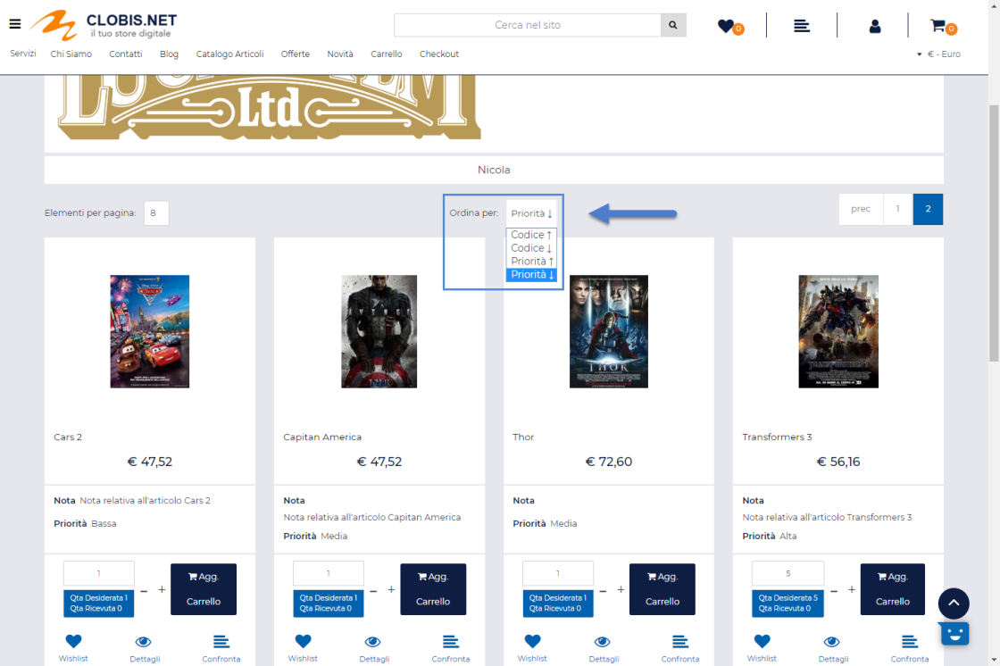{width="5.584722222222222in"
height="3.441666666666667in"}

Nel caso di sito in multilingua è possibile selezionare, tra quelle
attualmente gestite, la lingua in relazione alla quale dovranno essere
esportati i dati degli articoli (campo **Lingua**)

Il campo **Separatore** consente di indicare, selezionandolo,
dall'apposito menu a tendina, il carattere che dovrà essere utilizzato
all'interno del file di esportazione come separatore per i vari campi.

Il campo **Esplosione Taglie** consente invece di decidere se eventuali
articoli a taglie presenti nel file di esportazione dovranno produrre
all'interno di questo stesso file un unico record (parametro
**deselezionato**) o se dovranno invece essere esplosi (parametro
**selezionato**) generando un record diverso per ogni singola taglia
gestita.

In particolare nel momento in cui si dovesse decidere di attivare il
parametro in esame, all'interno del file di esportazione verrà inserito
anche il campo "**descrizioneTaglia**", campo questo che verrà poi
valorizzato con la descrizione di ogni singola taglia gestita per il
corrispondente articolo.

Il parametro "Esplosione Taglie" può essere quindi particolarmente utile
nel momento in cui l'esigenza dovesse essere, ad esempio, quella di
avere nel file di esportazione il dettaglio della disponibilità, o il
codice alias per ogni singola taglia di un determinato articolo.

In queste condizioni infatti, supponendo di gestire tra i campi di
esportazione il codice, il titolo e la disponibilità, nel caso in cui il
parametro "Esplora Taglie" dovesse essere deselezionato, per l'articolo
FAD02GRI (gestito nelle taglie XS,S,M,L,XL) otterremmo un file di
esportazione del tipo di quello di seguito indicato

*codice;titolo;unitaInStock*

*FAD02GRI;Lipstick Hoddy;145,000000*

dove, come si può facilmente osservare, l'articolo in esame produrrà un
unico record e la disponibilità indicata sarà quella relativa a tutte le
taglie gestite.

Nel momento in cui, invece, il parametro "Esplora Taglie" dovesse essere
selezionato, l'articolo a taglie verrà esploso, nel file di esportazione
verrà inserito il campo "descrizioneTaglia" e, per lo stesso articolo
FAD02GRI, otterremmo ora un file di esportazione in cui è presente un
record per ogni taglia gestita e, con esso, l'indicazione della relativa
disponibilità

*codice;**descrizioneTaglia**;titolo;unitaInStock*

*FAD02GRI;XS;Lipstick Hoddy;0,000000*

*FAD02GRI;S;Lipstick Hoddy;18,000000*

*FAD02GRI;M;Lipstick Hoddy;49,000000*

*FAD02GRI;L;Lipstick Hoddy;71,000000*

*FAD02GRI;XL;Lipstick Hoddy;7,000000*

La sezione "**Filtro**" consente di definire un filtro sulla base del
quale selezionare gli articoli che dovranno essere esportati.

{width="5.584722222222222in"
height="3.441666666666667in"}

Per maggiori informazioni relativamente alla creazione di un Filtro
Articoli si rimanda alla sezione "*Utenti -- Gruppi Utenti Sito --
Filtri Utente e Filtri Articolo -- Filtri Articolo*" di questo manuale.

La sezione "**Campi**" consente invece di indicare esattamente **quali
campi (e conseguentemente che tipo di informazioni) dovranno essere
esportati per ogni singolo articolo (sezione Campi)**.

In questo senso è sufficiente selezionare i campi desiderati tra quelli
presenti nel riquadro sinistro ed inserirli in quello destro cliccando
sul pulsante raffigurante una piccola freccia rivolta verso destra.

Nel riquadro di sinistra, assieme ai singoli campi sono presenti anche i
Set di Attributi attualmente gestiti (evidenziati in grigio)

{width="5.584722222222222in"
height="3.441666666666667in"}

Selezionando uno di questi Set e spostandolo nel riquadro di destra
verranno automaticamente inseriti nel file csv di esportazione tutti gli
attributi associati a quello stesso set

Allo stesso modo per eliminare uno specifico campo dal file di
esportazione, è sufficiente selezionarlo dal riquadro destro e cliccare
sul pulsante raffigurante una piccola freccia rivolta verso sinistra.

I pulsanti raffiguranti due piccole frecce rivolte verso l'alto e verso
il basso permettono infine di variare l'ordinamento dei campi e
conseguentemente delle informazioni che dovranno essere esportate

La sezione "**Configurazione Esportazioni**" consente, infine, di creare
dei modelli di esportazione da poter applicare, in un secondo momento,
senza dover ogni volta impostare i singoli parametri di configurazione
in maniera manuale.

Per creare un nuovo modello di esportazione è necessario, per prima
cosa, impostare i parametri di configurazione indispensabili per
definire il formato del file di esportazione (sezione "Generale") e i
dati che dovranno essere inseriti all'interno di questo stesso file
(sezioni "Filtro" e "Campi").

Fatto questo sarà necessario cliccare sul pulsante "**Salva Nuova
Configurazione**" (
{width="1.0583333333333333in"
height="0.1951388888888889in"} ), presente nella barra degli strumenti
della sezione "Configurazione Esportazioni", assegnando al modello che
si intende salvare un nome (campo "**Inserisci il nome della
configurazione**") ed eventuali note

{width="5.980555555555555in"
height="3.6104166666666666in"}

**ATTENZIONE!** per poter salvare un determinato modello è obbligatorio
assegnargli un nome. Il campo note è invece opzionale

I modelli di esportazione così creati verranno visualizzati all'interno
della sottostante tabella e potranno essere gestiti mediante i pulsanti
presenti nella relativa barra degli strumenti.

{width="5.584722222222222in"
height="3.441666666666667in"}

In questo senso, i pulsanti Elimina, Modifica e Applica Configurazione
consentono rispettivamente di:

**Elimina Configurazione** (
{width="0.8833333333333333in"
height="0.1951388888888889in"} ) : consente di eliminare il modello di
esportazione attualmente selezionato

**Applica Configurazione**: (
{width="0.8763888888888889in"
height="0.1951388888888889in"} ) : consente di applicare il modello di
esportazione selezionato, impostando dunque in maniera automatica (e
nello stesso modo in cui erano stati impostati in fase di creazione del
modello) tutti i parametri presenti all'interno delle sezioni Generale,
Filtro e Campi.

**ATTENZIONE!** **l'applicazione di un determinato modello di
esportazione NON comporta automaticamente anche la creazione del
relativo file**. Una volta applicato il modello, per ottenere i dati
sarà quindi necessario cliccare sempre sul pulsante "**Salva**"

**Modifica Configurazione** (
{width="0.9222222222222223in"
height="0.1951388888888889in"} ) : consente di modificare il modello di
esportazione attualmente in uso

Nello specifico, per modificare un dato modello di esportazione sarà
necessario per prima cosa applicarlo, andranno poi modificati i
parametri di configurazione secondo le specifiche esigenze del caso (ad
esempio aggiungendo o togliendo campi) e, infine, sarà necessario
cliccare sul pulsante "**Modifica Configurazione**" per salvare il
modello in esame con le nuove impostazioni e assegnarli anche, se
necessario, un nuovo nome e/o delle nuove note.

##### IMPORTAZIONE / ESPORTAZIONE DEI DATI CAMPIONARIO

Nel precedente capitolo di questo manuale sono state analizzate le
procedure di importazione ed esportazione massiva dei dati articolo.

Un discorso a parte, in questo senso, meritano gli articoli di tipo
Campionario e/o gli articoli composti dei gestionali Ho.Re.Ca. articoli
questi che potrebbero o meno essere configurabili e che, soprattutto,
hanno al loro interno altri articoli con determinate caratteristiche.

I due pulsanti **Importa Box / Esporta Box** disponibili all'interno del
menu "**Ulteriori operazioni**" (
{width="0.22083333333333333in"
height="0.175in"} )

{width="2.0388888888888888in"
height="2.129861111111111in"}

consentono quindi di avviare le procedure di importazione ed
esportazione massiva dei parametri di configurazione relativi ai vari
componenti di eventuali box configurabili.

Nello specifico cliccando sul pulsante **Importa Box** (
{width="0.46111111111111114in"
height="0.16875in"} ) verrà visualizzata la maschera "**Importazione
Articoli Box**"

{width="5.804861111111111in"
height="3.5256944444444445in"}

all'interno della quale poter configurare l'importazione dei dati in
oggetto. In particolare il campo

- **File (csv-txt)**: consente di indicare il file txt o csv contenente
  i parametri di configurazione relativi agli articoli del box

- **Separatore:** consente di indicare, selezionandolo, dall'apposito
  menu a tendina, il carattere che è stato utilizzato all'interno del
  file di importazione come separatore per i vari campi

Affinchè la procedura di import possa funzionare in maniera corretta,
consentendo a Passweb di configurare i vari componenti di un box, è
necessario che il file stesso soddisfi determinate condizioni. Nello
specifico:

- Il file da importare deve avere estensione .csv o .txt

- Il carattere separatore dei vari campi deve essere esattamente quello
  indicato all'interno del campo "**Separatore**" presente nel form di
  importazione.

- L'intestazione, ossia la prima riga del file, deve contenere i campi
  di seguito indicati:

> *codiceArticoloCampionario;codiceArticoloComponente;predefinito;configurabile;quantitaMinima;taglieFisse*

- Per ciascun record presente nel file di importazione, i vari campi
  dovranno essere compilati tenendo in considerazione quanto di seguito
  indicato:

  - **codiceArticoloCampionario**: codice del articolo campionario /
    composto

  - **codiceArticoloComponente**: codice dell\'articolo presente
    all'interno del box

  - **configurabile**: campo che indica se il corrispondente articolo
    del box è o meno configurabile.

> Valori ammessi: SI se l\'articolo è configurabile, NO se l'articolo
> non è configurabile

- **predefinito**: campo che indica se il corrispondente articolo del
  box è o meno predefinito.

> Valori ammessi: SI se l\'articolo è predefinito, NO se l\'articolo non
> è predefinito

- **quantitaMinima**: campo (decimale) che indica la quantità minima con
  cui il corrispondente articolo deve essere presente all'interno del
  box. Se vuoto non verrà considerata alcuna quantità minima

- **taglieFisse**: solo Ecommerce Mexal. Campo che consente di decidere
  se inserire all'interno del Box configurabile, le sole Taglie/Colori
  per le quali è stata effettivamente inserita, lato gestionale una
  specifica quantità.

> Valori ammessi: SI se vanno gestite solo le taglie con una specifica
> quantità, NO altrimenti

Per maggiori informazioni relativamente ai parametri di configurazione
di un Box e dei suoi componenti si veda anche quanto indicato
all'interno del capitolo "*Anagrafica Passweb -- Box*" di questo
manuale.

Il pulsante **Esporta Box** consente invece di accedere alla maschera
"**Esportazione Articoli Box**"

{width="5.804861111111111in"
height="3.5256944444444445in"}

all'interno della quale poter indicare il carattere separatore che dovrà
essere utilizzato nella creazione del file di esportazione. Il pulsante
Salva consente di avviare tale procedura.

I campi presenti all'interno del file di esportazione sono esattamente
quelli precedentemente indicati

##### ARTICOLI ABBINATI

Il pulsante **Abbinati**
({width="0.35694444444444445in"
height="0.175in"} ), visualizzato nella barra degli strumenti della
maschera Gestione Articoli dopo aver selezionato uno qualsiasi degli
articoli presenti in elenco, consente di visualizzare e/o gestire,
dipendentemente dalla tipologia di sito considerato, l'elenco degli
articoli ad esso abbinati.

Cliccando su questo pulsante si verrà infatti ricondotti alla maschera
"**Gestione Articoli Abbinati -- Nome Articolo**"

{width="5.804861111111111in"
height="3.5256944444444445in"}

all'interno della quale sarà possibile visualizzare tutti gli articoli
abbinati a quello precedentemente selezionato.

**ATTENZIONE! in queste condizioni verranno visualizzati solo ed
esclusivamente gli articoli abbinati a quello selezionato all'interno
della maschera "Gestione Articoli".**

**Per poter accedere all'elenco di tutti gli abbinati codificati e
gestiti all'interno del sito è necessario passare dalla voce di menu
"*Catalogo -- Gestione Articoli -- Abbinati*"** (per maggiori
informazioni in merito si veda anche la sezione "*Catalogo -- Gestione
Articoli -- Abbinati*" di questo manuale)

La maschera "**Gestione Articoli Abbinati -- Nome Articolo**" è
suddivisa in due distinte sezioni:

- Nella parte sinistra della maschera sono elencate tutte le Categorie
  di Abbinati attualmente codificate e gestite all'interno del sito.

> Il pulsante **Modifica**
> ({width="0.3958333333333333in"
> height="0.18819444444444444in"} ) presente nella corrispondente barra
> degli strumenti, consente di modificare e personalizzare la
> descrizione della Categoria Abbinati attualmente selezionata in
> elenco.
>
> Cliccando su questo pulsante verrà infatti visualizzata la maschera
> **Modifica Categoria**

{width="5.876388888888889in"
height="3.5652777777777778in"}

> all'interno della quale poter indicare, in ciascuna delle lingue
> gestite all'interno del sito, l'etichetta utilizzata per identificare,
> all'interno del componente "Abbinati", la categoria in esame.

- Nella parte destra della maschera vengono visualizzati, inizialmente,
  gli articoli abbinati a quello precedentemente selezionato all'interno
  della maschera "Gestione Articoli".

> Selezionando una delle categorie presenti sulla sinistra l'elenco
> verrà filtrato e verranno visualizzati i soli articoli appartenenti a
> quella specifica Categoria Abbinati
>
> Il pulsante **Esporta**
> ({width="0.3506944444444444in"
> height="0.18194444444444444in"} ) presente nella contestuale barra
> degli strumenti, consente invece di esportare l'elenco degli articoli
> abbinati a quello inizialmente selezionato all'interno della maschera
> "Gestione Articoli", nel seguente formato:
>
> **Codice_Articolo;Codice_Articolo_Abbinato;Codice_Categoria_Abbinamento**

**ATTENZIONE! Si ricorda che per siti Ecommerce collegati a Mexal la
gestione delle Categorie Abbinati (creazione ed eliminazione) e degli
abbinamenti tra i vari articoli è demandata interamente al gestionale.**

**Nel caso di siti Ecommerce collegati ad un gestionale Ho.Re.Ca.**, la
creazione e l'eliminazione delle varie Categorie Abbinati così come la
creazione e la gestione dei vari abbinamenti di articoli dovrà avvenire
invece direttamente all'interno del Wizard.

**NOTA BENE:** è possibile creare nuove categorie di abbinati e nuovi
abbinamenti operando direttamente dal Wizard di Passweb solo ed
esclusivamente nel caso di siti ecommerce collegati ad un gestionale
Ho.Re.Ca.

In queste condizioni dunque oltre a poter visualizzare l'elenco delle
Categorie e degli Abbinati, all'interno della maschera "**Gestione
Articoli Abbinati -- Nome Articolo**" sarà possibile anche codificare
nuove Categorie di Abbinati e nuovi Abbinamenti.

In questo senso i pulsanti presenti, solo per questa tipologia di siti,
in corrispondenza delle Categorie Abbinati, consentono rispettivamente
di:

{width="5.792361111111111in"
height="3.5131944444444443in"}

- **Elimina**
  ({width="0.3506944444444444in"
  height="0.18819444444444444in"} ): consente di eliminare la Categoria
  Abbinati attualmente selezionata in elenco.

- **Aggiungi**
  ({width="0.43472222222222223in"
  height="0.21458333333333332in"} ): consente di codificare una nuova
  Categoria Abbinati.

> Cliccando su questo pulsante verrà infatti visualizzata la maschera
> "**Nuova Categoria**"

{width="5.792361111111111in"
height="3.5131944444444443in"}

> all'interno della quale poter indicare, nei relativi campi, il
> **Codice** e la **Descrizione** (nelle diverse lingue di gestione del
> sito) della Categoria Abbinati che si intende realizzare.

- **Modifica**
  ({width="0.3958333333333333in"
  height="0.18819444444444444in"} ): consente di modificare la
  descrizione della Categoria Abbinati selezionata in elenco (una volta
  creata una Categoria sarà sempre possibile modificarne la descrizione
  ma mai il codice).

Allo stesso modo i pulsanti presenti, per questa tipologia di siti, in
corrispondenza dell'elenco di Abbinati, consentono rispettivamente di:

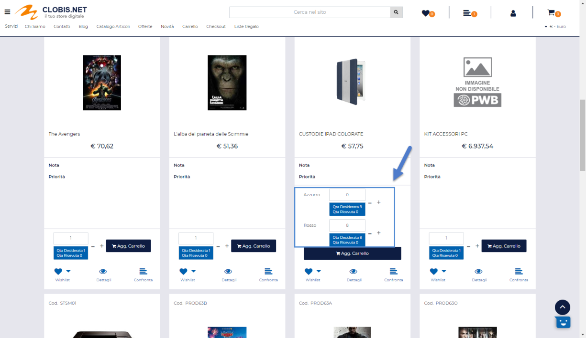{width="5.792361111111111in"
height="3.5131944444444443in"}

- **Aggiungi**
  ({width="0.43472222222222223in"
  height="0.21458333333333332in"} ): consente di abbinare un nuovo
  articolo a quello inizialmente selezionato nella maschera "Gestione
  Articoli".

> Cliccando su questo pulsante verrà infatti visualizzata la maschera
> "**Nuovo Abbinato**"

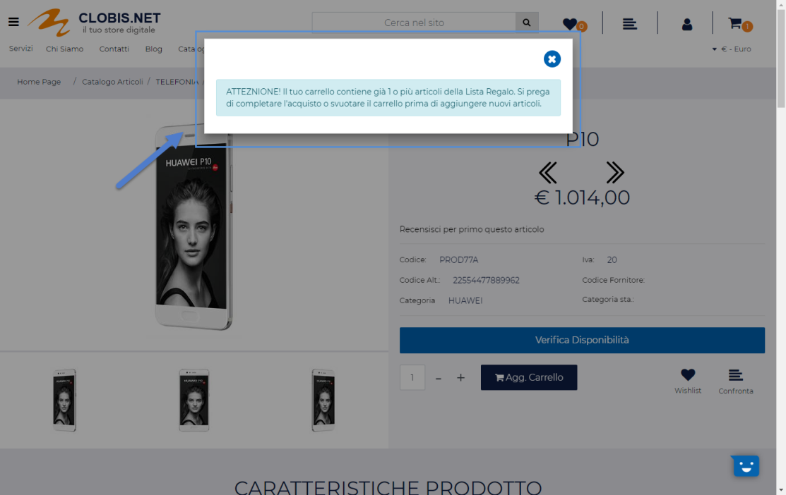{width="5.792361111111111in"
height="3.5131944444444443in"}

> all'interno della quale poter definire il nuovo abbinamento. Nello
> specifico il campo:

- **Categoria:** consente di indicare, selezionandola tra quelle
  presenti in elenco, la Categoria Abbinati cui associare l'abbinamento
  che si sta realizzando

- **Abbinato:** consente di indicare il codice dell'articolo che dovrà
  essere abbinato a quello in oggetto.

> Una volta inseriti almeno tre caratteri, verranno visualizzati, in un
> apposito menu a tendina, tutti gli articoli attualmente gestiti
> all'interno del sito il cui codice e/o la cui descrizione inizia con
> la sequenza di caratteri digitata (facilitando quindi l'individuazione
> l'inserimento del codice articolo desiderato).
>
> **ATTENZIONE!** Non è possibile abbinare un articolo a se stesso ne
> tanto meno creare un abbinamento già presente in elenco
>
> Una volta inseriti i valori richiesti, il pulsante **Salva**
> consentirà di salvare il nuovo abbinamento

- **Modifica**
  ({width="0.3958333333333333in"
  height="0.18819444444444444in"} ): consente di modificare
  l'abbinamento in esame.

> Cliccando su questo pulsante verrà infatti visualizzata la maschera
> "**Modifica Abbinato**"

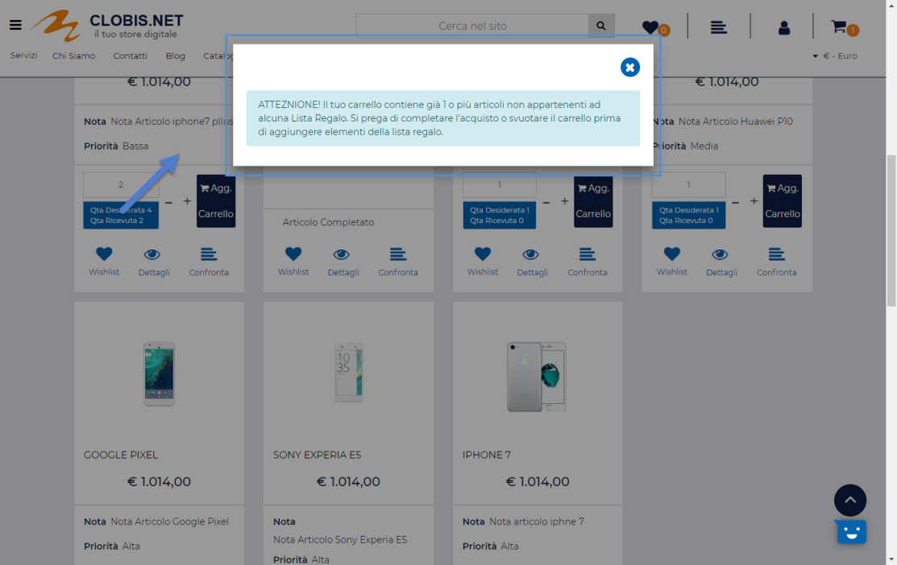{width="5.792361111111111in"
height="3.5131944444444443in"}

> all'interno della quale poter variare, nei rispettivi campi, la
> categoria di abbinamento e l'articolo abbinato.

- **Elimina**
  ({width="0.3506944444444444in"
  height="0.18819444444444444in"} ): consente di eliminare l'abbinamento
  attualmente selezionato in elenco.

> **ATTENZIONE!** il pulsante "Elimina Abbinato" consente di eliminare
> solo ed esclusivamente l'abbinamento in esame. Non verranno in alcun
> modo eliminati ne l'articolo oggetto dell'abbinamento ne tanto meno
> l'articolo abbinato

- **Importa**
  ({width="0.3506944444444444in"
  height="0.175in"} ): consente di creare nuovi abbinamenti in maniera
  massiva utilizzando per questo un file .csv o .txt appositamente
  realizzato.

> Nel file dovranno essere indicati, **nel seguente ordine, e separati
> da ;** il codice dell'articolo oggetto dell'abbinamento, il codice
> della categoria di abbinamento e il codice dell'articolo abbinato.
>
> **[Esempio]{.underline}**
>
> **Codice_Articolo;Codice_Categoria_Abbinamento;Codice_Articolo_Abbinato**
>
> Cliccando su questo pulsante verrà visualizzata la maschera "**File
> Abbinati**"

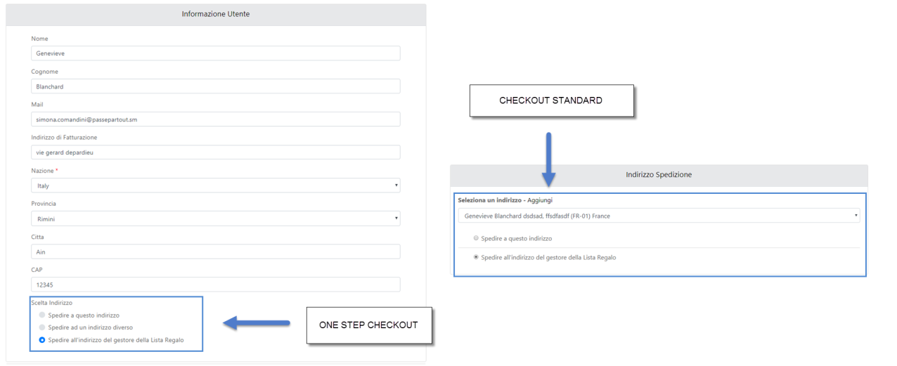{width="5.792361111111111in"
height="3.5131944444444443in"}

> all'interno della quale poter selezionare il file da importare (campo
> **File(csv-txt)**).
>
> **ATTENZIONE!** **Lanciando la funzione di importazione da questa
> sezione del Wizard, verranno presi in considerazione solo ed
> esclusivamente gli abbinamenti indicati all'interno del file che fanno
> riferimento all'articolo inizialmente selezionato all'interno della
> maschera "Gestione Articoli"**
>
> Nel caso in cui l'esigenza dovesse essere quella di importare in
> maniera massiva degli abbinamenti per tutti gli articoli gestiti
> all'interno del sito (e non solo per lo specifico articolo selezionato
> in "Gestione Articoli") sarà quindi necessario lanciare la procedura
> di Importazione dalla maschera *"Catalogo -- Gestione Articoli --
> Abbinati"*
>
> Il check "**Elimina abbinati non presenti nel file**" consente, se
> flaggato, di eliminare, per l'articolo inizialmente selezionato
> all'interno della maschera di "Gestione Articoli", tutti gli
> abbinamenti attualmente codificati ma non specificatamente indicati
> all'interno del file di importazione.
>
> Nel caso in cui invece il parametro in oggetto non venga selezionato,
> a seguito dell'importazione del file, gli abbinamenti già codificati e
> non specificatamente indicati all'interno del file di importazione
> verranno mantenuti inalterati.
>
> **ATTENZIONE!** Anche in questo caso verranno presi in considerazione
> solo ed esclusivamente gli abbinamenti che fanno riferimento
> all'articolo inizialmente selezionato all'interno della maschera di
> "Gestione Articoli"
>
> In ogni caso, abbinamenti già codificati e specificatamente inseriti
> anche nel file di importazione, verranno sovrascritti con i dati
> presenti all'interno del file stesso.

- **Esporta**
  ({width="0.3506944444444444in"
  height="0.18194444444444444in"} ): consente di esportare l'elenco
  degli articoli abbinati a quello inizialmente selezionato all'interno
  della maschera "Gestione Articoli" nel seguente formato:

> **codice_articolo; codice_abbinato; codice_categoria_abbinato**

##### CODICI ALIAS

Il pulsante **Alias**
(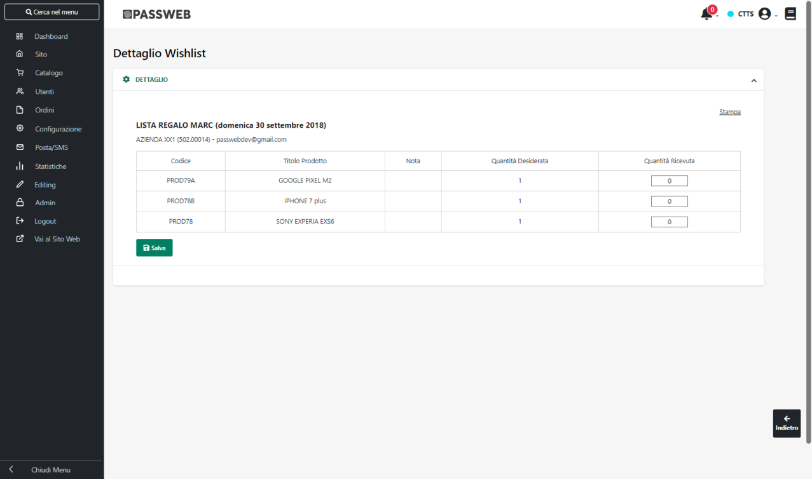{width="0.24027777777777778in"
height="0.16875in"} ), visualizzato nella barra degli strumenti della
maschera Gestione Articoli, consente di accedere all'elenco dei codici
Alias associati all'articolo attualmente selezionato in elenco.

Cliccando su questo pulsante verrà infatti visualizzata la maschera
"**Gestione Articoli -- Alias Cod. Articolo**"

{width="5.50625in"
height="3.5131944444444443in"}

all'interno della quale poter visualizzare tutti i codici Alias
associati all'articolo in esame.

**ATTENZIONE!** I dati presenti all'interno della maschera sopra
evidenziata sono dati in sola lettura.

Nel momento in cui l'esigenza dovesse essere dunque quella di creare,
per un determinato prodotto, nuovi codici Alias sarà necessario agire
direttamente all'interno del gestionale

##### COMMENTI

Il pulsante **Commenti**
({width="0.4222222222222222in"
height="0.175in"} ), visualizzato nella barra degli strumenti della
maschera Gestione Articoli, consente di accedere ai commenti relativi
all'articolo attualmente selezionato in elenco.

Cliccando su questo pulsante si verrà infatti ricondotti alla maschera
"**Gestione Articoli -- Commenti Cod. Articolo**"

{width="5.825in"
height="3.532638888888889in"}

all'interno della quale poter visualizzare l'elenco di tutti i commenti
attualmente associati all'articolo in esame.

L'icona raffigurante una piccola i presente in corrispondenza di ogni
singolo commento consente, se cliccata, di visualizzare alcune
informazioni relative al commento stesso (il contenuto, l'autore e la
data)

{width="5.825in"
height="3.532638888888889in"}

I pulsanti presenti nella contestuale barra degli strumenti consento
invece di:

**Modifica Commento**
({width="0.7145833333333333in"
height="0.175in"} ):consente di accedere al dettaglio del commento
selezionato in elenco e, eventualmente, di modificarne il contenuto

{width="5.876388888888889in"
height="3.558333333333333in"}

**Elimina Commento**
({width="0.6555555555555556in"
height="0.16875in"} ):consente di eliminare il commento selezionato in
elenco

**Pubblica Commento**
({width="0.7013888888888888in"
height="0.175in"} ): consente di pubblicare il commento selezionato in
elenco.

**ATTENZIONE!! In merito al pulsante "Pubblica Commento" è bene
ricordare che i commenti visualizzati all'interno di questa sezione del
Wizard non sono necessariamente visibili anche sulla parte pubblica del
sito.**

Il momento in cui un commento effettuato da un utente del sito verrà
effettivamente pubblicato e sarà quindi visibile a tutti dipende infatti
da come si è configurato il componente "**Commenti Associati**" e, nello
specifico, dal fatto che per la gestione dei commenti si sia deciso di
attivare o meno la funzione del "Moderatore". Più esattamente dunque:

- **Nel caso in cui si sia deciso di NON attivare la funzione del
  moderatore**, i nuovi commenti verranno visualizzati immediatamente
  nella parte pubblica del sito. In queste condizioni l'effettiva
  visualizzazione da parte di altri utenti del commento in oggetto
  dipenderà dunque unicamente dal tempo di refresh impostato per il
  componente.

- **Nel caso in cui si sia deciso di attivare la funzione del
  moderatore,** l'effettiva pubblicazione all'interno del sito di un
  nuovo commento non sarà immediata ma dovrà necessariamente essere
  validata ed approvata dal moderatore.

In presenza di un moderatore dunque, a seguito della creazione di un
nuovo commento da parte di un utente del sito, il moderatore verrà
avvisato via mail con un'apposita messaggio contenente anche il testo
del commento effettuato.

Sarà quindi compito del moderatore portarsi all'interno di questa
sezione del Wizard, selezionare dall'elenco il commento appena
effettuato e decidere di eliminarlo o pubblicarlo utilizzando i
rispettivi pulsanti presenti nella barra degli strumenti.

**NOTA BENE**: i commenti pubblicati possono essere visibili a tutti gli
utenti del sito o ai soli utenti autenticati dipendentemente dalle
impostazioni settate per il componente "Commenti Associati".

Per maggiori informazioni sulla gestione e sui parametri di
configurazione del componente "Commenti Associati" si veda anche
l'apposita sezione di questo manuale (*Live Editing -- Lista Componenti
Ecommerce -- Commenti Associati*)

**Ricarica Commenti**
(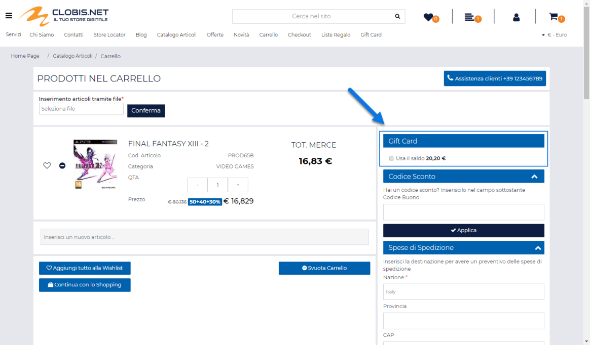{width="0.675in"
height="0.18194444444444444in"} ): consente di ricaricare i commenti
presenti in elenco in modo tale da poter visualizzare eventuali nuovi
commenti postati all'interno del sito.

Infine, nel caso in cui venissero effettuati nuovi commenti all'interno
del sito mentre il moderatore dovesse trovarsi in questa sezione del
Wizard, oltre ad essere avvisato via mail, il moderatore potrà
accorgersi del nuovo commento anche grazie alla comparsa di un'apposita
notifica.

##### ANAGRAFICA PASSWEB

Per accedere all'Anagrafica Passweb di uno specifico articolo/servizio è
sufficiente selezionare l'articolo desiderato all'interno della maschera
"Gestione Articoli" e cliccare poi sul pulsante **Modifica**
({width="0.3958333333333333in"
height="0.18819444444444444in"} ) presente nella contestuale barra degli
strumenti.

In questo modo verrà infatti visualizzata la maschera "**Dati Articolo
-- Nome Prodotto**" suddivisa in diverse sezioni.

{width="5.707638888888889in"
height="3.49375in"}

###### FUNZIONALITA' ARTICOLO

All'interno della sezione **"Informazioni generali"** è possibile
visualizzare e/o gestire le principali impostazioni di configurazione
dell'articolo in esame.

Sarà possibile, ad esempio, decidere di associare l'articolo in oggetto
ad ulteriori categorie merceologiche oltre a quella di appartenenza
definita all'interno del gestionale, verificare se l'articolo dovrà o
meno essere considerato tra gli articoli in offerta, se per esso è
gestita una quantità massima o minima di vendita, se è visualizzabile o
meno in catalogo ecc...

Dipendentemente dalla tipologia di gestionale collegato al sito
Ecommerce (Mexal oppure uno dei gestionali Ho.Re.Ca.) i parametri
presenti all'interno di questa maschera potranno essere:

- **in sola lettura** (tipicamente quelli collegati a campi delle
  anagrafiche standard del gestionale)

- **in modifica e collegati ad uno specifico campo gestionale** (quelli
  identificati dalla corrispondente icona di prodotto)

- **in modifica ed in uso esclusivo a Passweb** (non collegati cioè a
  nessun campo del gestionale)

{width="5.707638888888889in"
height="3.49375in"}

**ATTENZIONE!** Nel momento in cui l'esigenza dovesse quindi essere
quella di modificare uno qualsiasi dei campi in sola visualizzazione
sarà necessario agire direttamente all'interno del gestionale e lanciare
poi una sincronizzazione per riportare la variazione effettuata anche
all'interno del sito.

Nello specifico poi il campo

- **Pubblica:** consente di abilitare/disabilitare la pubblicazione
  dell'articolo in esame sul front-end del sito.

  - Ecommerce Mexal 🡪 Campo collegato alla relativa funzionalità
    gestionale. **Modificabile sia da Passweb che da Mexal**

  - Ecommerce Ho.Re.Ca. 🡪 campo gestibile unicamente da Passweb e
    **attivo a default.**

> Nel momento in cui si dovesse decidere di non abilitare il parametro
> in oggetto, l'articolo in esame continuerà ad essere presente sul
> database di Passweb (con le relative risorse) ma non verrà
> visualizzato sul front-end del sito.
>
> **ATTENZIONE!** tentando di visitare la pagina prodotto di un articolo
> non pubblicato Passweb effettuerà in automatico un redirect di tipo
> 301 sulla pagina di categoria di quello stesso prodotto. Nel caso in
> cui l'articolo non pubblicato non dovesse appartenere a nessuna
> categoria il redirect (sempre di tipo 301) verrà effettuato invece
> sulla home page del sito.

- **Visualizza in Catalogo:** consente di abilitare/disabilitare la
  visualizzazione dell'articolo in esame all'interno di componenti quali
  il "Catalogo E-Commerce" le "Offerte/Novità", gli "Articoli Abbinati"
  ecc...

  - Ecommerce Mexal 🡪 Campo collegato alla relativa funzionalità
    gestionale. **Modificabile sia da Passweb che da Mexal**

  - Ecommerce Ho.Re.Ca. 🡪 campo gestibile unicamente da Passweb e
    **attivo a default.**

> Nel caso in cui il parametro in oggetto non dovesse essere
> selezionato, l'articolo in esame non verrà più visualizzato
> all'interno dei componenti sopra indicati, continuerà comunque ad
> essere pubblicato sul front-end del sito e potrà quindi essere ancora
> acquistato, ma potrà essere raggiunto solo linkando direttamente la
> sua specifica Pagina Prodotto.

- **Offerta / Novità / Fine serie:** consente, se impostato a True, di
  marcare lo specifico articolo come articolo in Offerta / Novità / Fine
  Serie. Sarà poi possibile utilizzare il valore di questi campi per
  realizzare appositi filtri articolo da utilizzare, ad esempio,
  all'interno del componente "Offerte/Novità" in maniera tale da poter
  visualizzare al suo interno i soli articoli che sono stati
  effettivamente marcati come articoli in Offerta, come articoli Novità
  o come articoli in Fine Serie.

  - Ecommerce Mexal 🡪 Campo collegato alla relativa funzionalità
    gestionale. **Modificabile sia da Passweb che da Mexal**

  - Ecommerce Ho.Re.Ca. 🡪 Campo collegato alla relativa funzionalità
    gestionale. **Modificabile solamente dal gestionale Ho.Re.Ca.**

- **Decimali:** consente di impostare il numero di decimali che dovranno
  essere utilizzati per gestire le quantità dell'articolo in esame.

  - Ecommerce Mexal 🡪 Campo collegato alla relativa funzionalità
    gestionale. **Modificabile solamente da Mexal**

  - Ecommerce Ho.Re.Ca. 🡪 campo gestibile direttamente da Passweb.
    **Modificabile solamente dal gestionale Ho.Re.Ca.**

- **Minimo Vendibile:** consente di impostare per l'articolo in esame
  una specifica quantità minima al di fuori della quale l'articolo
  stesso non potrà mai essere acquistato.

  - Ecommerce Mexal 🡪 Campo collegato alla relativa funzionalità
    gestionale. **Modificabile solamente da Mexal**

  - Ecommerce Ho.Re.Ca. 🡪 campo gestibile solamente da Passweb

- **Massimo Vendibile:** consente di impostare per l'articolo in esame
  una specifica quantità massima al di fuori della quale l'articolo
  stesso non potrà mai essere acquistato.

  - Ecommerce Mexal 🡪 Campo collegato alla relativa funzionalità
    gestionale. **Modificabile sia da Passweb che da Mexal**

  - Ecommerce Ho.Re.Ca. 🡪 campo gestibile solamente da Passweb

> **ATTENZIONE!** il minimo ed il massimo vendibile impostati
> sull'articolo non verranno presi in considerazione nel caso in cui
> questo dovesse appartenere ad un Campionario.
>
> Nel momento in cui l'esigenza dovesse essere quella di definire delle
> quantità minime o massime di vendita per i componenti di un
> Campionario sarà necessario agire impostando la quantità desiderata
> per lo specifico articolo direttamente in fase di configurazione del
> Campionario stesso oppure, in alternativa, ricorrere all'utilizzo dei
> Campionari Configurabili

- **Prezzo a richiesta:** consente di abilitare o meno, per l'articolo
  in esame, la pubblicazione del suo Prezzo all'interno del sito.

  - Ecommerce Mexal 🡪 Campo collegato alla relativa funzionalità
    gestionale. **Modificabile sia da Passweb che da Mexal**

  - Ecommerce Ho.Re.Ca. 🡪 campo gestibile solamente da Passweb

> Nel caso in cui il parametro in esame dovesse essere deselezionato (o
> impostato a False) l'articolo avrà quindi pubblicato sul sito il suo
> prezzo e potrà tranquillamente essere acquistato.
>
> Nel caso in cui, invece, il parametro in esame dovesse essere
> selezionato (o impostato a True) il prezzo dell'articolo non verrà
> pubblicato sul sito (al suo posto comparirà l'etichetta "Prezzo a
> richiesta" personalizzabile da Test / Messaggi Sito) e in conseguenza
> di ciò questo stesso articolo non potrà più essere acquistato via web.
>
> **ATTENZIONE!** Gli articoli gestiti con prezzo a richiesta non
> verranno considerati nelle ricerche articolo per prezzo. Nel caso
> invece di ordinamento articoli per prezzo, gli articoli gestiti con
> questo tipo di funzionalità verranno posizionati sulla base del loro
> prezzo di listino (prezzo questo che non verrà comunque pubblicato
> all'interno del sito)

- **Unità di misura secondaria:** consente, se selezionato, di gestire
  l'articolo in esame con la sua unità di misura secondaria.

  - Ecommerce Mexal 🡪 Campo collegato alla relativa funzionalità
    gestionale. **Modificabile solo da Mexal**

  - Ecommerce Ho.Re.Ca. 🡪 campo gestibile direttamente da Passweb.
    **Modificabile solo da Passweb**

> Nel caso in cui per l'articolo in esame non sia stata impostata,
> all'interno del gestionale Ho.Re.Ca., un'unità di misura secondaria,
> al salvataggio della relativa anagrafica Passweb l'eventuale flag
> posto su questo campo verrà automaticamente eliminato.

- **Disponibilità Indicativa:** consente di indicare per l'articolo in
  esame una disponibilità indicativa (es. alta, media, bassa ecc...) da
  poter poi visualizzare all'interno del sito utilizzando per questo il
  componente "Dati Articolo" mappato sul Campo Articolo "Disponibilità
  Indicativa"

  - Ecommerce Mexal 🡪 Campo collegato alla relativa funzionalità
    gestionale. **Modificabile solo dal Gestionale**

  - Ecommerce Ho.Re.Ca. 🡪 campo gestibile direttamente da Passweb.
    **Modificabile solo da Passweb**

- **Misuratore Trasporto a Scaglioni:** consente di impostare, per
  l'articolo in esame, quello che dovrà essere il valore del suo
  misuratore da utilizzare poi nella gestione delle spese di trasporto a
  scaglioni con calcolo di questi stessi scaglioni sulla base del campo
  personalizzato.

  - Ecommerce Mexal 🡪 Campo collegato alla relativa funzionalità
    gestionale. **Modificabile sia da Passweb che da Mexal**

  - Ecommerce Ho.Re.Ca. 🡪 campo gestibile direttamente da Passweb.
    **Modificabile solo da Passweb**

> **ATTENZIONE!** per maggiori informazioni in merito alla gestione
> delle spese di trasporto a scaglioni si veda anche la sezione *"Ordini
> -- Configurazione Metodi di Trasporto -- Spese di trasporto a
> scaglioni"* di questo manuale.

- **Gestione Linee Articolo:** consente di associare l'articolo in esame
  ad una o più linee articolo.

  - Ecommerce Mexal 🡪 Campo collegato alla relativa funzionalità
    gestionale. **Modificabile solo da Mexal**

  - Ecommerce Ho.Re.Ca. 🡪 campo gestibile direttamente da Passweb.
    **Modificabile solo da Passweb**

> Per effettuare questa associazione da Passweb è sufficiente
> selezionare la linea desiderata tra quelle indicate nel box di
> sinistra (e precedentemente codificate all'interno dell'apposita
> sezione del Wizard" ed inserirla nel box di destra cliccando sul
> pulsante raffigurante una piccola freccia rivolta verso destra.
>
> Allo stesso modo per eliminare un'associazione articolo -- linea, è
> sufficiente selezionare la linea desiderata tra quelle attualmente
> presenti nel box di destra e cliccare poi sul pulsante raffigurante
> una piccola freccia rivolta verso sinistra.

- **Articolo Spesa (solo Ecommerce Ho.Re.Ca.):** consente, se
  selezionato, di trattare l'articolo in esame come un Articolo di tipo
  Spesa.

> **ATTENZIONE!** E' possibile marcare come articolo di tipo Spesa solo
> ed esclusivamente articoli "semplici", ossia articoli che, all'interno
> del gestionale, sono stati codificati con Tipologia = Articolo.
>
> Nel caso in cui si tenti di marcare come articolo di Tipo Spesa un
> Prototipo (utilizzato per la gestione delle Varianti Articolo e,
> dunque, per gli articoli strutturati) o un Trattamento al' salvataggio
> dell'Anagrafica Passweb verrà ritornato un errore
>
> Come per i siti Ecommerce collegati a Mexal, anche nel caso di siti
> collegati ad uno dei gestionali Ho.Re.Ca. **gli articoli di tipo Spesa
> non saranno mai venduti all'interno del sito**. Al salvataggio dell'
> Anagrafica Passweb di un articolo di tipo spesa , verrà infatti
> automaticamente deselezionato il precedente parametro "Visualizza in
> Catalogo"
>
> Tali articoli non saranno quindi visualizzabili in Catalogo ne avranno
> una loro specifica pagina Prodotto; verranno invece utilizzati nella
> gestione delle Spese Accessorie, dei Buoni Sconto, delle Promozioni
> ecc...
>
> **ATTENZIONE!** Una volta marcato un articolo come Articolo di Tipo
> Spesa, il flag potrà essere rimosso solo ed esclusivamente nel caso in
> cui l\'articolo non sia poi stato utilizzato per la gestione delle
> spese o degli sconti.

- **Gestisci Iva Ripartita (solo Ecommerce Ho.Re.Ca.):** consente di
  attivare per l'articolo in esame la gestione dell'Iva ripartita

> **ATTENZIONE!** Il parametro "Gestisci Iva Ripartita" potrà essere
> selezionato solo ed esclusivamente nel caso in cui l'articolo in esame
> sia stato marcato e venga quindi utilizzato come articolo di tipo
> Spesa
>
> Nel caso in cui si tenti di selezionare questo parametro per articoli
> non di tipo Spesa, al salvataggio dell'Anagrafica Passweb verrà
> ritornato un apposito messaggio di errore
>
> Tale parametro diventa di fondamentale importanza nel momento in cui
> si dovessero attivare sul proprio sito delle promozioni o dei buoni
> sconto che utilizzano articoli di tipo spesa e che possono quindi
> determinare l'inserimento nel corpo del documento di questi stessi
> articoli con quantità negativa pari a -1, cosa questa che potrebbe
> provocare dei problemi con le stampanti fiscali.
>
> Nello specifico occorre quindi ricordare che:

- Nel caso in cui in parametro in esame non dovesse essere selezionato,
  l'articolo utilizzato come articolo spesa verrà inserito nel corpo del
  documento indicando sulla riga la relativa aliquota. In queste
  condizioni lo sconto verrà caricato come storno del documento

- Nel caso in cui si dovesse invece decidere di selezionare il parametro
  in esame, indipendentemente dal fatto che l'articolo utilizzato come
  articolo spesa abbia o meno una specifica aliquota iva, verrà inserito
  nel corpo del documento senza indicare sulla riga nessuna aliquota (e
  verrà quindi gestito con iva ripartita)

> In queste condizioni il relativo sconto verrà caricato e gestito come
> sconto di testata.
>
> **ATTENZIONE! L'utilizzo del parametro "Gestisci Iva Ripartita"
> richiede una versione gestionale maggiore o uguale alla 2021A3**

Per maggiori informazioni in merito alle singole funzionalità articolo
gestibili, **nel caso di siti Ecommerce collegati ad uno dei gestionali
Ho.Re.Ca.**, direttamente da questa sezione del Wizard, si veda anche il
capitolo "*Configurazione -- Ho.Re.Ca. Configurazione Gestionale --
Funzionalità di gestione articoli*" di questo manuale

**ATTENZIONE!** **Relativamente ai parametri modificabili sia da Mexal
che da Passweb (es. Pubblica, Visualizza in catalogo, Offerta ...)
occorre ricordare che, al salvataggio dell'Anagrafica Prodotto
all'interno del Wizard, i dati presenti nella maschera verranno
riportati e salvati automaticamente anche nei corrispondenti campi
gestionali.**

In questo senso se, per una qualsiasi ragione, al salvataggio della
maschera non dovesse essere possibile riportare i dati anche nei
corrispondenti campi Mexal, verrà visualizzata un'apposita notifica.

{width="5.707638888888889in"
height="3.49375in"}

In queste condizioni i campi presenti solo su Passweb verranno
correttamente salvati mentre quelli gestiti anche da Mexal manterranno
il valore precedente e dovranno quindi essere modificati in un altro
momento oppure agendo direttamente da Mexal.

###### TITOLO ARTICOLO

Il campo **Titolo** presente all'interno della sezione "**Informazioni
Generali**" della maschera "**Dati Articolo**"

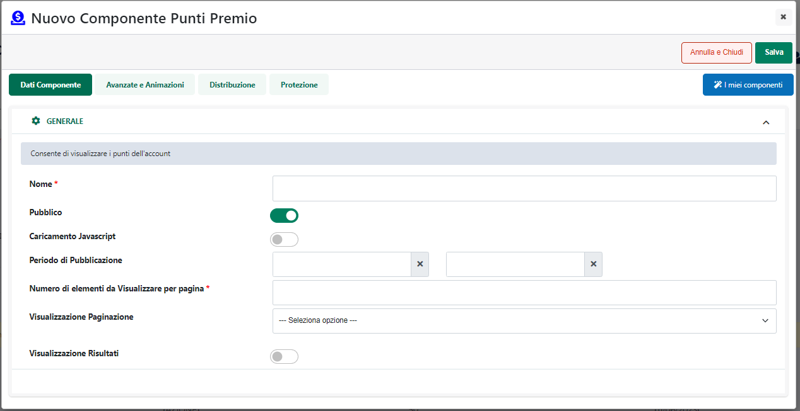{width="5.707638888888889in"
height="3.49375in"}

consente di visualizzare e, se necessario, modificare il **Titolo**
dell'articolo in esame, informazione questa che potrà poi essere
inserita all'interno del sito utilizzando il relativo componente
ecommerce "Titolo".

**ATTENZIONE**! Il campo Titolo è impostato (per la lingua italiana), a
default, con il valore della descrizione dell'articolo utilizzata
all'interno del gestionale

La possibilità di modificare o meno questo campo direttamente dal Wizard
di Passweb dipende dal fatto di considerare siti collegati a Mexal
piuttosto che ad uno dei gestionali Ho.Re.Ca. oltre che dalle
impostazioni settate per il parametro "Tipo di dato da Utilizzare"
presente all'interno della sezione "Titolo Permalink Articolo" alla
pagina "Preferenze Sito -- SEO" del Wizard (per maggiori informazioni in
merito si veda anche la sezione "*Sito -- Preferenze - SEO Titolo /
Permalink Articolo*" di questo manuale)

Nello specifico:

- nel caso di siti Ecommerce collegati a Mexal il campo in esame potrà
  essere gestito direttamente dal Wizard di Passweb solo se si è scelto
  di gestire il permalink delle pagine prodotto utilizzando come tipo di
  dato l'opzione "Passweb".

- nel caso di siti Ecommerce collegati ad uno dei gestionali Ho.Re.Ca.,
  al contrario sarà sempre possibile modificare il campo in esame
  operando direttamente dal Wizard di Passweb

**ATTENZIONE!** Modificando il valore presente all'interno di questo
campo potrebbero essere modificati anche i permalink delle relative
pagine prodotto.

**Prima di apportare delle modifiche in tal senso si consiglia dunque di
verificare il tipo di dato utilizzato per gestire il permalink delle
pagine prodotto ed, eventualmente, di aver abilitato la generazione
automatica degli Alias (in maniera tale da evitare eventuali errori di
tipo 404 -- pagina non trovata)**

###### ASSOCIAZIONE DI UN ARTICOLO A PIU' CATEGORIE MERCEOLOGICHE

Operando all'interno del Wizard di Passweb è possibile, tanto per i siti
Ecommerce collegati a Mexal quanto per quelli collegati ad uno dei
gestionali Ho.Re.Ca., associare ogni singolo articolo ad ulteriori
categorie merceologiche oltre alla specifica categoria di appartenenza
definita, per l'articolo stesso, direttamente all'interno del
gestionale.

**ATTENZIONE! L'associazione può avvenire solo ed esclusivamente con
Categorie Merceologiche già presenti all'interno del sito.**

**ATTENZIONE! L'associazione di un articolo a più categorie
merceologiche verrà utilizzata all'interno del sito:**

- **ai fini delle ricerche articolo**

- **laddove è possibile impostare specifici Filtri Articolo (es. Filtri
  Articoli su Gruppi Utente, su Spese Accessorie, sui componenti
  Catalogo Ecommerce, Popolarità Prodotto, Risultati Ricerca ecc...)**

La **categoria merceologica principale** rimarrà sempre quella associata
all'articolo direttamente all'interno del relativo gestionale
Passepartout, mentre tutte le categorie merceologiche associate
all'articolo all'interno del Wizard di Passweb verranno considerate come
**categorie merceologiche secondarie**.

In conseguenza di ciò nel momento in cui un determinato articolo dovesse
essere ricercato e trovato all'interno del sito sulla base di una delle
sue categorie merceologiche secondarie, vistando poi la sua scheda si
verrà comunque ricondotti alla pagina prodotto generata sulla base della
sua categoria merceologica principale.

**ATTENZIONE!** L' url delle pagine prodotto relative ad articoli
associati a più categorie merceologiche (così come il loro meta tag
rel="canonical") sarà definito sempre e soltanto sulla base della
categoria merceologica principale dell'articolo, vale a dire quella
associata all'articolo stesso all'interno del gestionale Passepartout.

Per poter associare un articolo a più categorie merceologiche è
necessario agire dalla scheda "**Informazioni Generali**" presente
all'interno della sua Anagrafica Passweb.

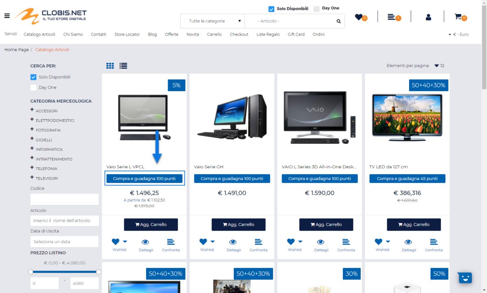{width="5.759722222222222in"
height="3.5194444444444444in"}

**Categorie Merceologiche Associate:** consente di visualizzare e
gestire l'associazione dell'articolo in esame a più categorie
merceologiche.

All'interno di questo campo verranno infatti visualizzate tutte le
categorie merceologiche attualmente associate all'articolo in esame.

Cliccando invece sullo spazio vuoto presente all'interno del campo verrà
visualizzato l'elenco delle categorie attualmente gestite all'interno
del sito

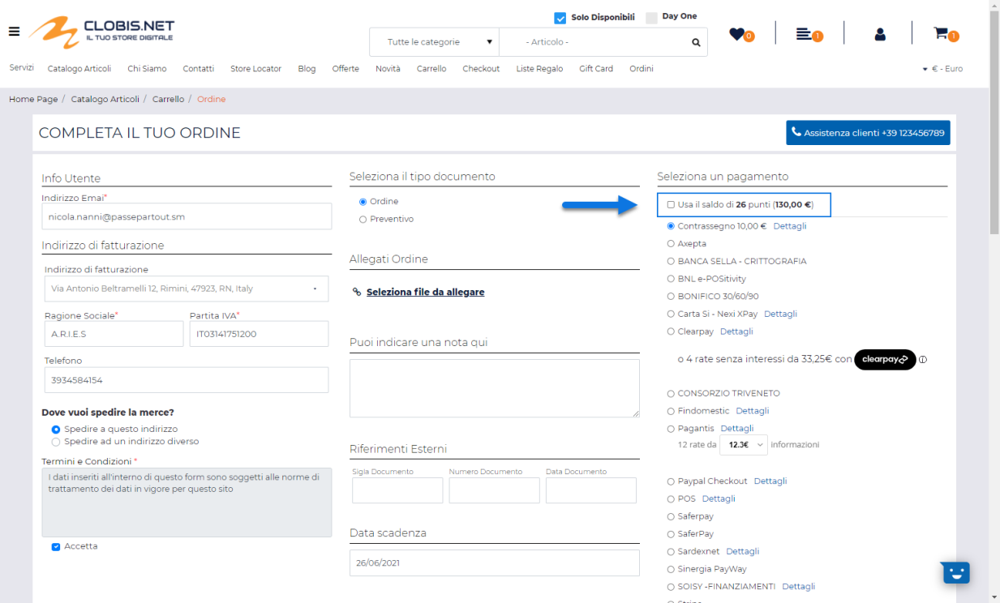{width="5.759722222222222in"
height="3.5131944444444443in"}

Per associare l'articolo ad una categoria merceologica è quindi
sufficiente selezionarla tra quelle presenti in elenco in modo tale da
aggiungerla all'interno del campo "Categorie Merceologiche Associate".

Allo stesso modo per eliminare l'associazione tra un articolo e una
specifica categoria merceologica è sufficiente premere sulla piccola x
posta immediatamente a fianco del nome della categoria stessa.

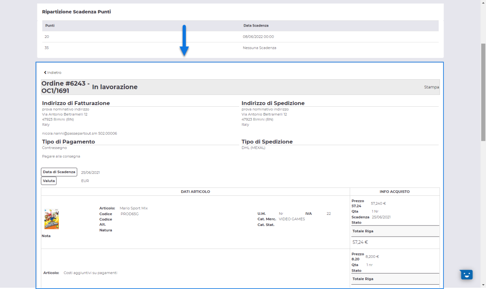{width="5.759722222222222in"
height="3.5131944444444443in"}

**ATTENZIONE**! **La categoria merceologica evidenziata in giallo è
quella principale, vale a dire quella associata all'articolo
direttamente all'interno del gestionale.**

Per eliminare e/o modificare questa associazione è quindi necessario
operare direttamente all'interno del relativo gestionale Passepartout.

**ATTENZIONE! Nel caso in cui si dovesse decidere di associare degli
articoli a più categorie merceologiche è consigliato impostare il
parametro "*Formato Permalink Scheda Articolo*", presente in
corrispondenza della sezione "*Permalink*" nella scheda SEO del menu
"*Sito -- Preferenze*" del Wizard, sul valore "Senza il percorso di
categoria" come evidenziato nella figura di seguito riportata.**

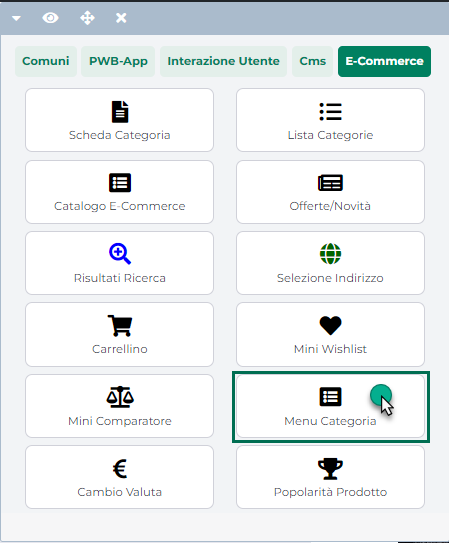{width="5.856944444444444in"
height="3.545138888888889in"}

Si ricorda inoltre che nel momento in cui si dovessero apportare delle
variazioni al parametro in oggetto (passando ad esempio da "Con il
percorso di categoria" a "Senza il percorso di categoria" o viceversa)
Passweb si preoccuperà di generare in automatico, oltre al corretto meta
tag **rel="canonical"** per la specifica pagina Prodotto, anche dei
redirect di tipo 301 in maniera tala da informare gli spider della
variazione effettuata e garantire la corretta indicizzazione delle
relative pagine prodotto evitando così errori di tipo 404 (pagina non
trovata) e contenuti duplicati.

Per maggiori informazioni in merito si veda anche la sezione "*Sito --
Preferenze -- Seo Keywords Description e Permalink Ar*ticoli" di questo
manuale.

Si ricorda anche che, nel caso di siti collegati a Mexal, l'associazione
a categorie merceologiche secondarie può essere gestita direttamente
anche all'interno del gestionale grazie alla corrispondente funzionalità
Passweb (per maggiori informazioni in merito si veda anche quanto
indicato all'interno del capitolo "*Configurazione -- Mexal
Configurazione Gestionale -- Mexal Attivazione Passweb -- Funzionalità
Mexal Articoli -- Gruppi Merceologici*" di questo manuale)

**In questo senso comunque è sempre bene gestire questo tipo di
associazioni in un punto unico (Wizard di Passweb o Gestionale) in modo
tale da evitare che, a seguito di una sincronizzazione, eventuali
associazioni definite all'interno di Passweb vengano eliminate o
sovrascritte a seguito di impostazioni differenti settate per lo stesso
articolo all'interno del gestionale.**

###### SCORTA MINIMA

Il campo **Scorta Minima** presente all'interno della sezione
"**Informazioni Generali**" della maschera "**Dati Articolo**"

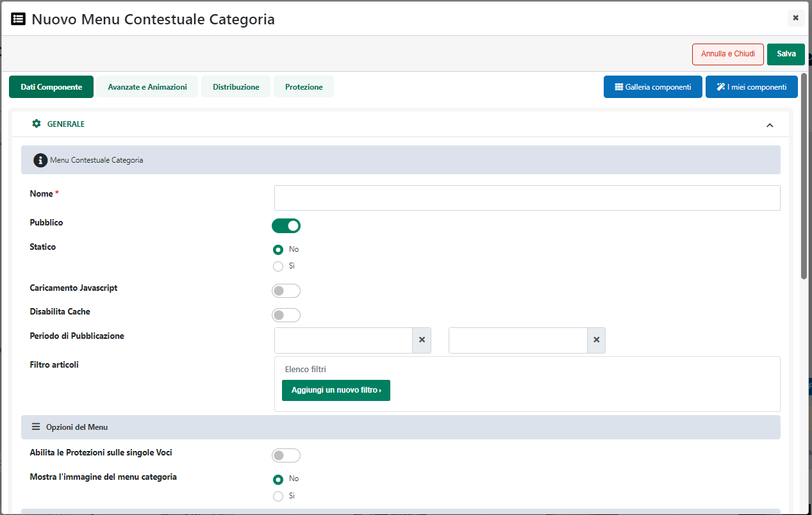{width="5.441666666666666in"
height="3.5in"}

consente di impostare il valore della scorta minima dello specifico
articolo, valore questo che verrà poi considerato, per il calcolo della
sua disponibilità effettiva.

E' possibile indicare un valore fisso (es. 10) oppure un valore in
percentuale (es. 10%). In quest'ultimo caso la percentuale indicata
verrà calcolata sul valore determinato in base alla formula impostata e
sarà, eventualmente, arrotondato per difetto.

Supponendo quindi di aver impostato come formula per il calcolo della
disponibilità l'Esistenza (Inventario + Carico -- Scarico) e come Scorta
minima il valore 10%, nel momento in cui per l' articolo in esame
dovessimo avere dal gestionale un' Esistenza pari a 38 unità, il valore
della scorta minima arrotondato per difetto sarà esattamente di (38 x
10)/100 = 3 unità.

In queste condizioni dunque l'effettiva disponibilità, su Passweb,
dell'articolo in esame sarà esattamente di 38-3=35 unità

**ATTENZIONE!** Nel caso in cui la Scorta Minima sia impostata a 0 il
valore della disponibilità calcolata e memorizzata all'interno di
Passweb coinciderà, ovviamente, con il valore della disponibilità
calcolata in quello stesso momento all'interno del gestionale.

**Nel momento in cui la "Scorta Minima" fosse impostata invece su di un
valore diverso da 0,** il valore effettivo della disponibilità
all'interno di Passweb sarà dato dalla differenza tra la disponibilità
gestionale e il valore della scorta minima.

**ATTENZIONE! La Scorta Minima indicata all'interno di questo campo si
intende definita per magazzino e per taglia**

Questo significa dunque che, nel momento in cui per il calcolo della
disponibilità dovessero essere considerati, ad esempio, due magazzini
(Mag1 e Mag2), supponendo di avere impostato una scorta minima di 2 per
l\'articolo X, si avrà una situazione di questo tipo

  ---------------------------------------------------------------------
  **MAGAZZINO**   **DISPONIBILITA'**   **DISPONIBILITA' EFFETIVA
                                       (DISPONIBILITA' -- SCORTA
                                       MINIMA)**
  --------------- -------------------- --------------------------------
  Mag1            10                   8

  Mag2            6                    4
  ---------------------------------------------------------------------

e la disponibilità risultante sarà quindi di 8 + 4 = 12 unità (contro
una disponibilità gestionale pari a 16).

Allo stesso modo se l\'articolo X fosse stato un articolo a taglie nelle
condizioni in tabella

+---------------+--------------------+--------------------------------+
| **MAGAZZINO** | **DISPONIBILITA'** | **DISPONIBILITA' EFFETIVA      |
|               |                    | (DISPONIBILITA' -- SCORTA      |
|               |                    | MINIMA)**                      |
+===============+====================+================================+
| Mag1          | T1 -- 3            | T1 -- 1                        |
|               |                    |                                |
|               | T2 - 5             | T2 -- 3                        |
+---------------+--------------------+--------------------------------+

si otterrebbe, lato Passweb, una disponibilità complessiva di 4 unità, 1
sulla taglia T1 e 3 sulla taglia T2 (contro una disponibilità gestionale
pari a 8 unità)

Il parametro "Scorta Minima", presente nell'Anagrafica Passweb di un
articolo, è strettamente legato a quanto impostato a livello generale,
tramite l'analogo parametro presente all'interno della maschera
"Configurazione Catalogo Mexal / Ho.Re.Ca."

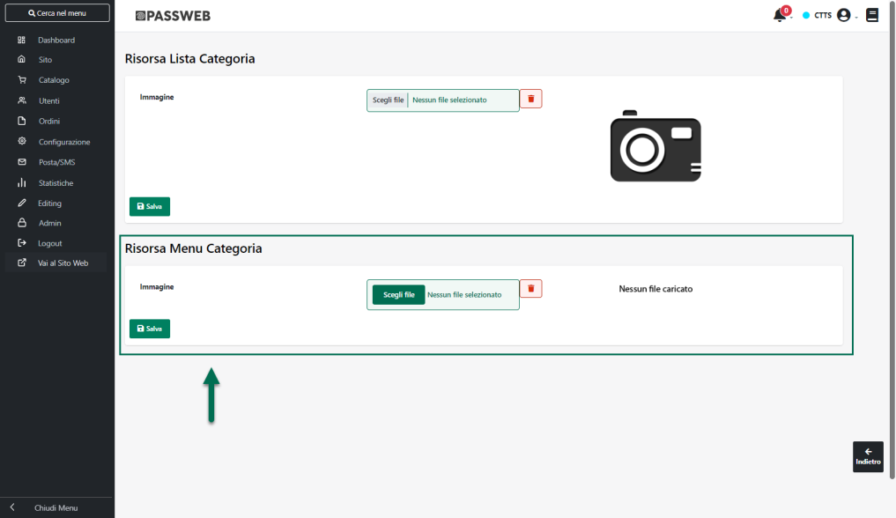{width="5.804861111111111in"
height="3.5256944444444445in"}

In questo senso dunque è bene sottolineare che:

- Il valore assunto, a default, dal parametro "Scorta Minima", presente
  nell'Anagrafica Passweb di ogni singolo articolo, dipende esattamente
  da quanto impostato per l'analogo campo presente nella maschera
  "Configurazione Catalogo Mexal / Ho.Re.Ca.".

- La Scorta minima impostata sul singolo articolo avrà priorità rispetto
  a quella impostata a livello generale all'interno della sezione
  "Configurazione Catalogo Mexal / Ho.Re.Ca" del Wizard.

- Eventuali variazioni del parametro "Scorta Minima" presente
  all'interno della maschera "Configurazione Catalogo Mexal /
  Ho.Re.Ca.", comporteranno il ricalcolo e l'aggiornamento delle scorte
  minime di tutti gli articoli gestiti sul sito andando quindi a
  sovrascrivere eventuali impostazioni precedentemente settate a livello
  di singolo prodotto"

###### SOGLIA DISPONIBILITA'

Il campo **Soglia Disponibilità** presente all'interno della sezione
"**Informazioni Generali**" della maschera "**Dati Articolo**"

{width="5.707638888888889in"
height="3.49375in"}

consente di settare un valore di soglia per la disponibilità dello
specifico prodotto, valore questo che potrà poi essere utilizzato in
fase di definizione degli scaglioni impostabili all'interno del
componente "Disponibilità Articolo".

Tale valore deve necessariamente essere **un valore intero** e può
rivelarsi particolarmente utile nel momento in cui l'esigenza dovesse
essere quella di gestire degli scaglioni di disponibilità del tipo:

- **Quantità articolo = 0** 🡪 Articolo non disponibile (pallino rosso)

- **Quantità articolo maggiore di 0 e minore del Valore di Soglia** 🡪
  Articolo a disponibilità bassa (pallino arancione)

- **Quantità articolo maggiore del Valore di Soglia** 🡪 Articolo a
  disponibilità elevata (pallino verde)

dove, ovviamente, il "Valore di Soglia" potrà essere un numero diverso
per i diversi prodotti gestiti all'interno del sito

**ATTENZIONE!** Per i nuovi articoli importati all'interno del sito il
campo in esame verrà impostato a default sul valore settato per
l'analogo parametro presente all'interno della maschera
"**Configurazione Catalogo**" del Wizard. Per maggiori informazioni in
merito si veda anche quanto indicato nel relativo capitolo di questo
manuale (*"Catalogo -- Configurazione Parametri Catalogo --
Disponibilità"*)

Nel momento in cui l'esigenza dovesse essere dunque quella di non
impostare un valore a default per la "Soglia Disponibilità", sarà
necessario accertarsi di non aver valorizzato il parametro presente
all'interno della maschera "Configurazione Catalogo" e di andare poi,
eventualmente, ad impostare il valore della soglia per i soli articoli
per cui è effettivamente richiesto operando direttamente dalla loro
Anagrafica Passweb.

Una volta impostato il Valore di Soglia, come detto, questo potrà poi
essere utilizzato in fase di definizione degli scaglioni di
disponibilità mediante il segnaposto **"x"**

Supponendo dunque di aver impostato per l'articolo in esame un valore di
soglia rispettivamente pari a 5 e che lo stesso prodotto sia presente
sul sito in quantità 4, andando poi ad impostare una disponibilità a
fasce del tipo:

- Da 0 A 1 🡪 Disponibilità Bassa

- Da 1 a x 🡪 Disponibilità Media

- Da x in poi 🡪 Disponibilità Alta

nel momento in cui l'utente dovesse richiedere la disponibilità
dell'articolo in esame otterrebbe come risultato una "Disponibilità
Media" (la quantità 4 di tale prodotto ricade infatti nella fascia "Da 1
A x" essendo per questo prodotto x=5).

###### DISPONIBILITA' DBA

Il campo "**Gestione Disponibilità DBA"** presente all'interno della
sezione "**Informazioni Generali**" della maschera "**Dati Articolo**"

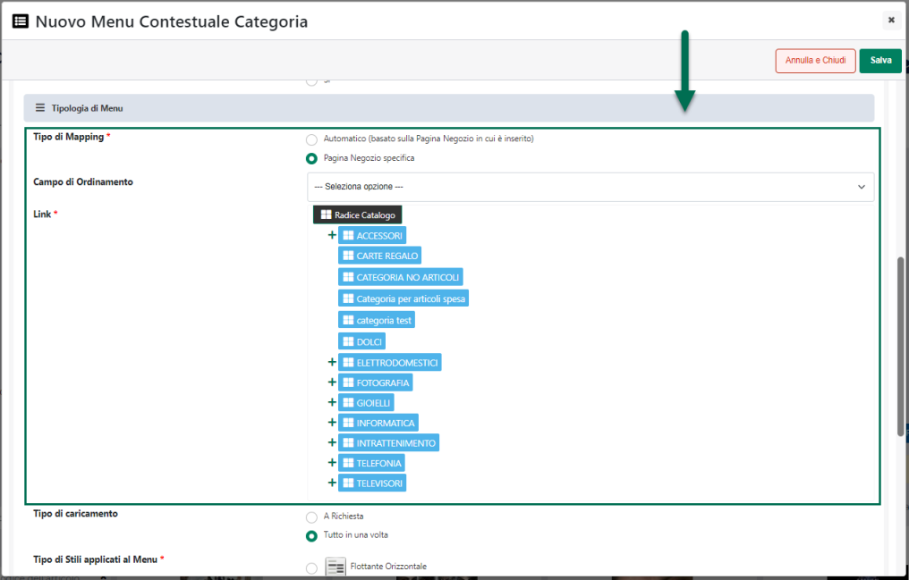{width="5.441666666666666in"
height="3.5in"}

consente di decidere come dovrà essere calcolata la disponibilità del
relativo articolo di tipo DBA.

**ATTENZIONE!** Il campo "**Gestione Disponibilità DBA**" è presente
unicamente nelle anagrafiche Passweb di articoli di tipo DBA

E' possibile selezionare uno dei seguenti valori

- **Gestisci la disponibilità della DBA** -- opzione di default: in
  queste condizioni la disponibilità dell'articolo in esame verrà
  valutata prendendo in considerazione i progressivi dell'articolo
  stesso

- **Calcola la disponibilità della DBA sulla base delle disponibilità
  dei componenti**: selezionando questa opzione la disponibilità
  dell'articolo in esame verrà valutata sulla base delle disponibilità
  dei singoli componenti della DBA stessa (esattamente allo stesso modo
  di quanto avviene per un articolo di tipo Campionario)

**ATTENZIONE!** Il parametro in esame ha effetto solo sullo specifico
prodotto e non agisce quindi a livello generale su tutti gli articoli di
tipo DBA presenti all'interno del sito

Nel momento in cui l'esigenza dovesse essere dunque quella di modificare
in blocco la modalità di calcolo della disponibilità per tutti gli
articoli di tipo DBA gestiti all'interno del sito, sarà necessario agire
mediante l'analogo parametro presente alla pagina "Configurazione
Catalogo" del Wizard

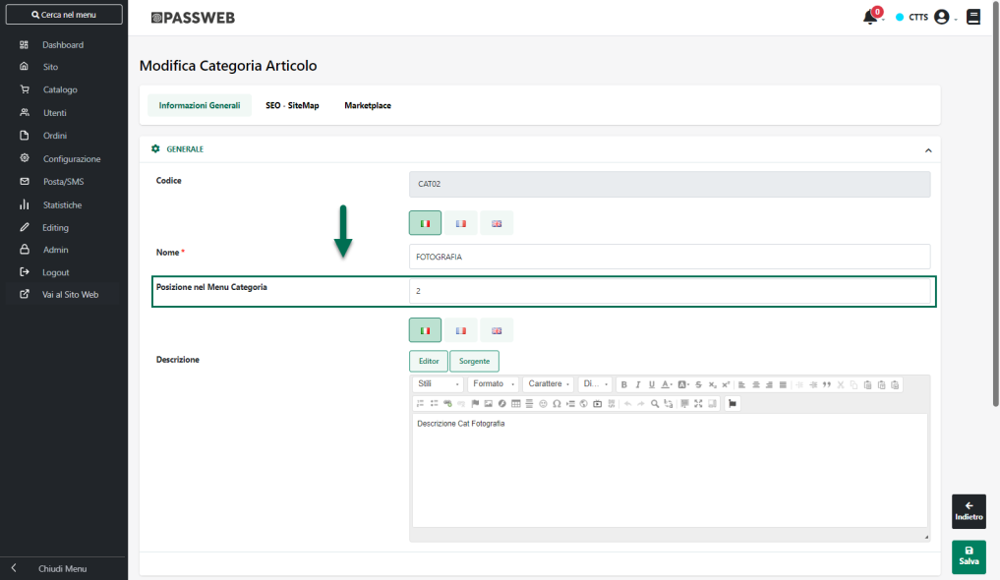{width="5.804861111111111in"
height="3.5256944444444445in"}

In questo senso occorre sempre tenere in considerazione che un'eventuale
variazione del parametro "**Gestione Disponibilità DBA"** presente
all'interno della maschera "Configurazione Catalogo" del Wizard,
comporterà il ricalcolo e l'aggiornamento delle impostazioni dello
stesso campo per tutti gli articoli gestiti sul sito **andando quindi a
sovrascrivere eventuali impostazioni precedentemente settate a livello
di singolo prodotto**.

###### GESTIONE ACQUISTO

Il campo **Gestione Acquisto** presente all'interno della sezione
"**Informazioni Generali**" della maschera "**Dati Articolo**"

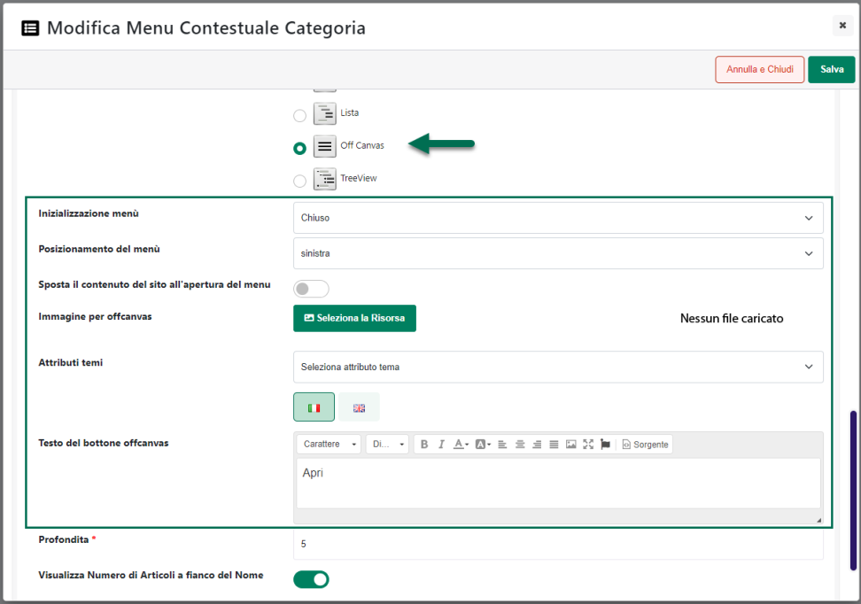{width="5.707638888888889in"
height="3.49375in"}

consente di impostare la modalità di acquisto dello specifico articolo.

E' possibile selezionare uno dei seguenti valori:

- **Acquista sempre:** selezionando questa opzione sarà sempre possibile
  acquistare l'articolo in esame (a meno ovviamente di ulteriori
  specifiche limitazioni) indipendentemente da quella che è la sua
  attuale disponibilità all'interno del database di Passweb.

- **Acquista solo se disponibile:** selezionando questa opzione,
  l'articolo in esame potrà essere acquistato solo ed esclusivamente nel
  caso in cui la sua attuale disponibilità (**calcolata al netto di un
  eventuale Scorta Minima**) sia maggiore di zero e comunque superiore
  alla quantità che l'utente desidera effettivamente acquistare.

> In particolare nel caso in cui la disponibilità dell'articolo
> memorizzata nel database di Passweb **sia minore o uguale a 0**, verrà
> visualizzato per questo stesso articolo, al posto del pulsante
> "Aggiungi in Carrello", l'etichetta "**Articolo Esaurito**"
> (personalizzabile all'interno della sezione "Gestione Testi/Messaggi
> del sito") impedendone di fatto l'acquisto.
>
> Nel caso in cui l'utente tenti di acquistare un articolo in quantità
> superiore a quella che è la sua attuale disponibilità all'interno di
> Passweb, l'articolo verrà effettivamente aggiunto in carrello ma **in
> quantità uguale a quella che è la sua attuale disponibilità** e
> l'utente verrà avvisato di ciò con un apposito messaggio
> (personalizzabile all'interno della sezione "Gestione Testi/Messaggi"
> del Wizard).

**ATTENZIONE! La disponibilità cui fa riferimento il parametro "Gestione
Acquisto" è esattamente quella impostata all'interno del campo
"Disponibilità" presente nella maschera "Configurazione Catalogo Mexal /
Ho.Re.Ca." ed è calcolata al netto di eventuali scorte minime**

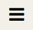{width="5.804861111111111in"
height="3.5256944444444445in"}

Il parametro "Gestione Acquisto", presente nell'Anagrafica Passweb di un
articolo, è strettamente legato a quanto impostato, a livello generale,
all'interno della maschera "Configurazione Catalogo Mexal / Ho.Re.Ca.".

In questo senso dunque è bene sottolineare che:

- Il valore assunto, a default, dal parametro "Gestione Acquisto",
  presente nell'Anagrafica Passweb di ogni singolo articolo, dipende
  esattamente da quanto impostato per i campi "**Gestione Acquisto**" ed
  "**Eccezioni**" presenti nella maschera "Configurazione Catalogo Mexal
  / Ho.Re.Ca.".

- In fase di sincronizzazione verrà valutato, per ogni articolo
  coinvolto nella sincronizzazione stessa, il filtro impostato
  all'interno del campo "Eccezioni" (maschera "Configurazione Catalogo
  Mexal / Ho.Re.Ca.") e, nel caso in cui alcuni di essi dovessero
  soddisfare tale filtro, verrà modificato di conseguenza il valore
  impostato, nella loro Anagrafica Passweb, per il campo "Gestione
  Acquisto"

**ATTENZIONE! Il valore del parametro "Gestione Acquisto" impostato per
un certo articolo direttamente nella sua Anagrafica Passweb, potrebbe
cambiare a seguito di una sincronizzazione sito -- gestionale.**

Per maggiori informazioni in merito si veda anche la sezione "*Catalogo
-- Configurazione Parametri Catalogo -- Catalogo Mexal / Ho.Re.Ca*." di
questo manuale

###### AGGIUNTA AL CARRELLO DI ARTICOLI A CONFEZIONE

I due parametri **Confezione -- Aggiungi al Carrello Privati** e
**Confezione -- Aggiungi al Carrello Aziende presenti** all'interno
della sezione "**Informazioni Generali**" della maschera "**Dati
Articolo**"

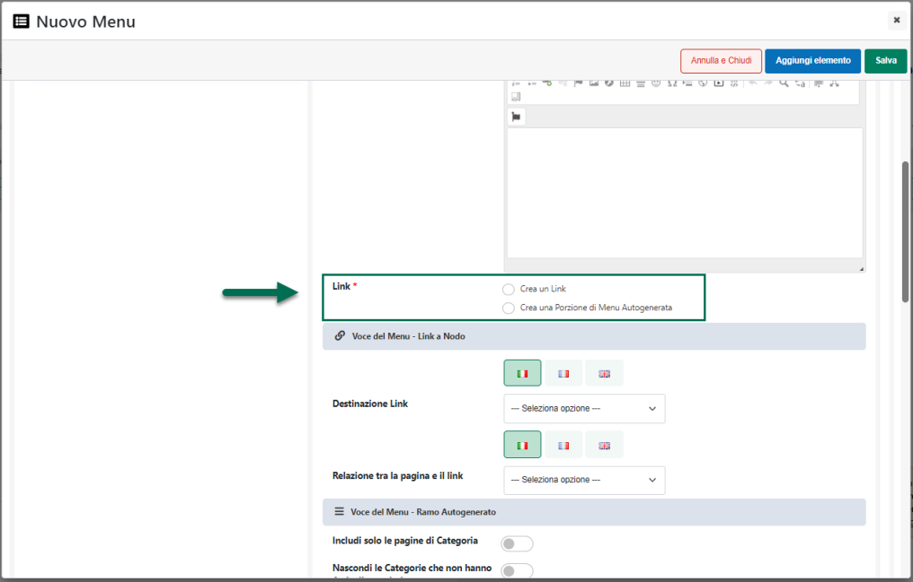{width="5.707638888888889in"
height="3.49375in"}

consentono di decidere come l'articolo in esame dovrà effettivamente
essere venduto all'interno del sito nel caso in cui l'acquisto dovesse
essere effettuato da un utente Privato piuttosto che da un utente di
tipo Azienda.

**ATTENZIONE!** i due parametri in esame sono disponibili solo per siti
collegati a Mexal.

In entrambi i casi è possibile selezionare uno dei seguenti valori:

- **Quantità Singola:** selezionando questa opzione, lato Passweb,
  l'articolo verrà gestito sempre e comunque come articolo singolo
  indipendentemente dunque dalle eventuali impostazioni settate lato
  gestionale per il campo "Confezione". In queste condizioni inoltre gli
  eventuali pulsanti incrementali (+/-) presenti ad esempio in
  corrispondenza del componente "Aggiungi in carrello" andranno ad
  aumentare / diminuire la quantità indicata sempre e soltanto di un
  unità alla volta

- **Quantità Singola incrementale:** selezionando questa opzione si avrà
  lo stesso comportamento del caso precedente (Quantità Singola) ma con
  una diversa gestione dei pulsanti incrementali (+/-). In questo caso
  infatti tali pulsanti andranno ad aumentare / diminuire la quantità
  del prodotto di un valore pari esattamente a quello indicato per la
  confezione presente sul gestionale

> Supponendo quindi di aver impostato, lato gestionale, nel campo
> relativo alla Confezione il valore 3, l'utente si troverà all'interno
> del sito il campo quantità, presente in corrispondenza del pulsante di
> aggiunta in carrello, impostato inizialmente sul valore 1.
>
> In questo caso però nel momento in cui dovesse cliccare sul pulsante +
> la quantità indicata aumenterà di 3 unità alla volta passando ad
> esempio da 1 a 3, a 6 a 9 ...

- **Quantità Propositiva:** in queste condizioni, lato Passweb,
  l'articolo verrà gestito esattamente come avviene all'interno del
  gestionale. Ciò significa dunque che la quantità indicata inizialmente
  sarà solo propositiva per cui l'utente potrà poi acquistare l'articolo
  desiderato nella quantità da lui scelta. In queste condizioni inoltre
  gli eventuali pulsanti incrementali (+/-) presenti ad esempio in
  corrispondenza del componente "Aggiungi in carrello" andranno ad
  aumentare / diminuire la quantità indicata sempre e soltanto di un
  unità alla volta

> Supponendo quindi di aver impostato, lato gestionale, nel campo
> relativo alla Confezione il valore 3, l'utente si troverà all'interno
> del sito il campo quantità, presente in corrispondenza del pulsante di
> aggiunta in carrello, anch'esso impostato inizialmente sullo stesso
> valore.
>
> L'utente avrà comunque la libertà di modificare tale valore secondo le
> sue specifiche esigenze e potrà quindi acquistare l'articolo in esame
> in quantità 1,2, 3,4, 5 ecc...
>
> Nel momento in cui dovesse cliccare sul pulsante + la quantità
> indicata aumenterà di un'unità alla volta passando ad esempio da 3 a 4
> a5 ...

- **Quantità propositiva incrementale:** selezionando questa opzione si
  avrà lo stesso comportamento del caso precedente (Quantità
  propositiva) ma con una diversa gestione dei pulsanti incrementali
  (+/-). In questo caso infatti tali pulsanti andranno ad aumentare /
  diminuire la quantità del prodotto di un valore pari esattamente a
  quello indicato per la confezione presente sul gestionale.

> Supponendo quindi di aver impostato, lato gestionale, nel campo
> relativo alla Confezione il valore 3, l'utente si troverà ancora una
> volta il campo quantità, presente in corrispondenza del pulsante di
> aggiunta in carrello, anch'esso impostato inizialmente sul valore 3 e
> come prima avrà comunque la libertà di modificare tale valore secondo
> le sue specifiche esigenze.
>
> In questo caso però nel momento in cui dovesse cliccare sul pulsante +
> la quantità indicata aumenterà di 3 unità alla volta passando ad
> esempio da 3 a 6 a 9 ...

- **Quantità Bloccata:** in queste condizioni lato Passweb, l'utente
  avrà l'obbligo di indicare all'interno del campo quantità, presente in
  corrispondenza del pulsante di aggiunta in carrello, una quantità
  multipla della confezione indicata all'interno del gestionale.

> Supponendo quindi di aver impostato, anche in questo caso lato Mexal,
> nel campo relativo alla Confezione il valore 3, all'interno del sito
> l'utente si troverà il campo quantità inizialmente valorizzato sullo
> stesso valore ma, a differenza del caso precedente in queste
> condizioni tale valore potrà essere modificato solo ed esclusivamente
> con un multiplo di 3.
>
> L'articolo potrà quindi essere acquistato solo ed esclusivamente in
> quantità 3, 6, 9, 12, ecc...
>
> Nel caso in cui l'utente dovesse inserire una quantità non ammessa
> (es. 4 o 5) verrà visualizzato un apposito messaggio di errore e
> l'articolo non verrà aggiunto in carrello.

{width="5.207638888888889in"
height="2.8569444444444443in"}

> E' possibile personalizzare il messaggio di errore alla sezione
> "Testi/Messaggi Sito" del Wizard selezionando il componente "Aggiunta
> al Carrello" e agendo sul campo "Confezione Bloccata".
>
> **ATTENZIONE!** In queste condizioni i pulsanti incrementali
> eventualmente presenti a fianco del campo quantità aumenteranno e/o
> diminuiranno la quantità dell'articolo di un valore pari alla
> confezione indicata per l'articolo in esame all'interno del gestionale

- **Quantità Bloccata con aggiornamento delle quantità:** anche in
  queste condizioni, come nel caso precedente , l'utente avrà l'obbligo
  di indicare all'interno del campo quantità, presente in corrispondenza
  del pulsante di aggiunta in carrello, una quantità multipla della
  confezione indicata all'interno del gestionale.

> A differenza del caso precedente però, nel momento in cui l'utente
> dovesse inserire una quantità non corretta tale quantità verrebbe
> automaticamente aggiornata **al valore superiore più prossimo a quello
> inserito**.
>
> Supponendo quindi, come nei casi precedenti, di aver impostato lato
> Mexal una confezioni pari a 3, nel momento in cui l'utente dovesse
> tentare di acquistare, sul sito, l'articolo in esame in quantità 4,
> tale quantità verrà automaticamente impostata sul valore 6.

Come per il parametro "Gestione Acquisto" anche in questo caso, i due
parametri appena analizzati sono strettamente legati a quanto impostato,
a livello generale, all'interno della maschera "Configurazione Catalogo"
del Wizard.

In questo senso dunque è bene sottolineare che:

- Il valore assunto, a default, dai parametri **Confezione -- Aggiungi
  al Carrello Privati** e **Confezione -- Aggiungi al Carrello
  Aziende**, presenti nell'Anagrafica Passweb di ogni singolo articolo,
  dipendono esattamente da quanto impostato per i corrispondenti campi
  presenti nella maschera "Configurazione Catalogo" del Wizard.

- Le variazioni apportate ai parametri in oggetto all'interno della
  sezione "Gestione Confezioni" della maschera "Configurazione Catalogo"
  andranno a sovrascrivere eventuali impostazioni precedentemente
  settate in maniera specifica per il singolo articolo (impostazioni
  queste che dovranno quindi essere, eventualmente ridefinite)

Per maggiori informazioni in merito si veda anche la sezione "*Catalogo
-- Configurazione Parametri Catalogo -- Catalogo Mexal / Ho.Re.Ca*." di
questo manuale

Relativamente agli articoli gestiti a Confezione è bene sottolineare poi
anche la presenza dei due campi (in sola lettura) "**Confezione
Multipla**" e "**Confezione**"

{width="5.727083333333334in"
height="3.5in"}

che consentono rispettivamente di:

- **Confezione Multipla:** campo in sola lettura. Consente di
  visualizzare, per articoli gestiti a multipli, quella che è l'unità di
  vendita dello specifico prodotto

- **Confezione:** campo in sola lettura. Consente di visualizzare, per
  articoli gestiti a confezioni, il numero di prodotti presenti dentro
  una singola confezione

Per maggiori informazioni relativamente alla gestione di articoli a
Multipli e / o a Confezioni si veda anche quanto indicato all'interno
del relativo capitolo di questo manuale ("*Configurazione -- Mexal
Configurazione Gestionale -- Attivazione Passweb -- Funzionalità Mexal
Articoli -- Gestione Multipli e Confezioni*")

###### SET DI OPZIONI

In Passweb è possibile gestire le cosiddette **custom option**, ossia
opzioni di personalizzazione dei singoli prodotti presenti all'interno
del proprio sito Ecommerce, opzioni queste che, volendo, potranno anche
andare ad incidere sul prezzo di vendita dello specifico articolo.

Per maggior informazioni relativamente a come poter creare nuovi set di
opzioni si veda quanto indicato all'interno del corrispondente capitolo
di questo manuale *("Catalogo -- Opzioni Articoli")*

Il campo **Set di Opzioni** presente all'interno della sezione
"**Informazioni Generali**" della maschera "**Dati Articolo**"

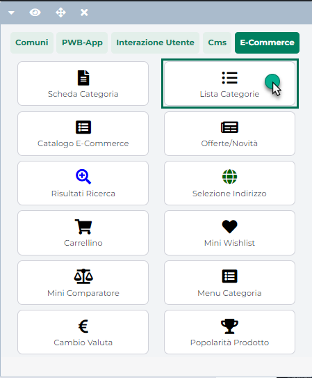{width="5.707638888888889in"
height="3.49375in"}

consente invece di associare all'articolo in esame uno specifico Set di
Opzioni di personalizzazione, selezionandolo tra quelli appositamente
codificati.

**ATTENZIONE!** l'effettiva associazione di un Set di Opzioni avviene a
livello di articolo per cui il Set impostato direttamente
sull'anagrafica del singolo prodotto avrà sempre priorità rispetto a
quanto indicato a livello di categoria merceologica a meno, ovviamente,
di non utilizzare il pulsante "**Applica il set agli articoli**" cosa
questa che potrebbe resettare eventuali impostazioni precedentemente
applicate a livello di singolo articolo

Per maggiori informazioni relativamente alle opzioni di
personalizzazione articolo si veda anche il corrispondente capitolo di
questo manuale ("*Catalogo -- Opzioni Articoli*")

###### GIFT CARD

In Passweb è possibile attivare e gestire due diverse tipologie di Gift
Card (Carte Regalo): **Fisiche** e **Virtuali.**

La tipologia scelta determinerà poi anche il modo in cui la Carta Regalo
verrà effettivamente gestita all'interno del sito.

Una prima cosa di fondamentale importanza da mettere in evidenza è che
le Gift Card vendute all'interno del proprio sito, Fisiche o Virtuali
non fa differenza, altro non sono se non semplici articoli di magazzino
marcati però in maniera tale che l'applicazione possa riconoscerli come
"articoli di tipo Gift Card" e possa quindi attivare, in relazione ad
essi, le relative modalità di gestione.

Considerando che all'interno del gestionale non esistono articoli di
tipo "Gift Card", tale marcatura dovrà essere effettuata direttamente
dal Wizard di Passweb.

Il campo **Gift Card** presente all'interno della sezione
"**Informazioni Generali**" della maschera "**Dati Articolo**"

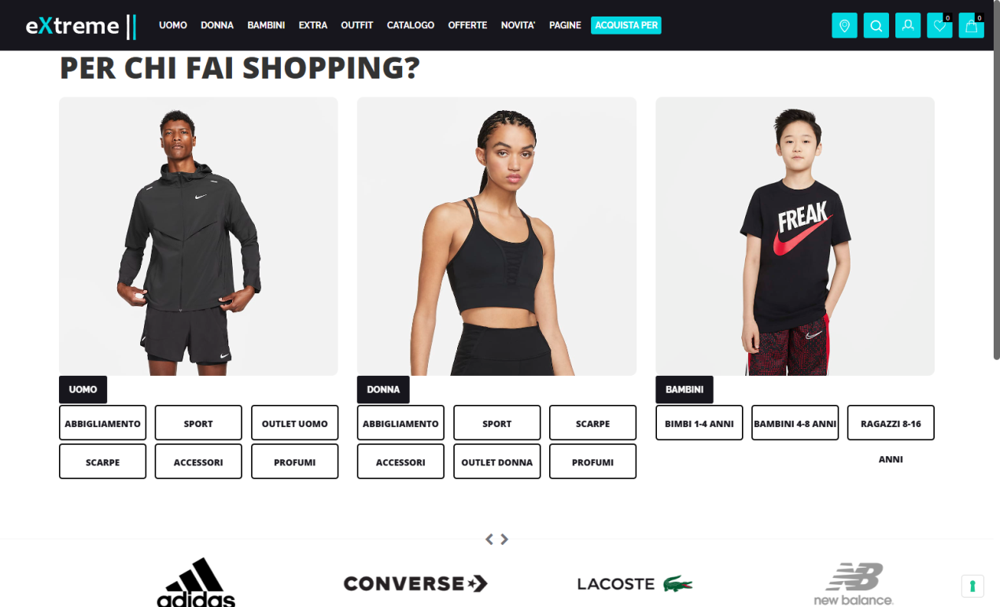{width="5.707638888888889in"
height="3.49375in"}

consente quindi di effettuare tale marcatura associando all'articolo in
esame una specifica Gift Card selezionata tra quelle codificate
all'interno della corrispondente sezione del Wizard.

Per maggiori informazioni in merito alla gestione delle Gift Card si
veda anche quanto indicato all'interno della sezione "*Utenti -- Gift
Card*" di questo manuale.

###### CLASSI CSS

I campi "**Classi Custom**" e "**Classi Regole**"

{width="5.707638888888889in"
height="3.49375in"}

presenti nell'Anagrafica Passweb di ogni singolo articolo, consentono di
assegnare all'articolo stesso una o più classi CSS che potranno poi
essere utilizzate, in fase di costruzione del layout del sito, per
stilizzare i relativi prodotti.

La differenza sostanziale tra i due campi evidenziati in figura è
rappresentata dal fatto che il campo "**Classi Custom**" è un campo in
lettura / scrittura e consente quindi di assegnare manualmente al
relativo articolo tutte le classi css desiderate

**ATTENZIONE!** il campo "Classi Custom" è disponibile anche nel
tracciato csv di importazione dei dati articolo (per maggiori
informazioni in merito si veda anche quanto indicato nel precedente
capitolo "*Importazione / Esportazione dei dati articolo tramite file*"
di questo manuale)

Il campo "**Classi Regole**" invece è un campo a sola lettura, non
modificabile in maniera diretta dall'utente e gestito esclusivamente da
Passweb mediante l'applicazione di apposite "Regole Articolo".

Per maggiori informazioni in merito a come poter gestire i valori
presenti in questo campo e come poter, di fatto, valorizzarlo per più
articoli contemporaneamente si veda anche quanto indicato nel successivo
capitolo "*Regole -- Regole di valorizzazione delle classi CSS*" di
questo manuale

Infine è bene ricordare anche che, oltre alle classi custom, Passweb
assegna già nativamente classi css ben precise a prodotti gestiti in
maniera "specifica" secondo quanto indicato dalla seguente tabella:

  --------------------------------------------------------------------
  **CLASSE CSS**                     **GESTIONE ARTICOLO**
  ---------------------------------- ---------------------------------
  structureproduct                   Articolo strutturato

  structurefather                    Articolo strutturato Padre (non
                                     configurato)

  structurechild                     Articolo strutturato Figlio
                                     (configurato)

  boxproduct                         Articolo campionario

  boxproductdba                      Articolo DBA

  boxproductgroup                    Articolo box configurabile

  sizeproduct                        Articolo a Taglie
  --------------------------------------------------------------------

**[ATTENZIONE!]{.underline}**

Le classi CSS indicate in corrispondenza dei campi "Classi Custom" e
"Classi Regole", così come quelle presenti nella tabella sopra riportata
verranno poi applicate, sul front end del sito:

- al componente "**Scheda Prodotto**"

- **alle celle dei relativi articoli** presenti all'interno di
  componenti quali:

  - **Catalogo Ecommerce**

  - **Abbinati**

  - **Offerte** / **Novità**

  - **Popolarità Prodotto**

  - **Risultati Ricerca**

  - **Lista Regalo**

  - **Selezione Regalo**

  - **Campionario Ecommerce**

- alle celle dei risultati del componente "**Autocompletamento**"
  inserito in **Carrello**

Supponendo dunque di aver impostato, per un determinato prodotto, il suo
campo "Classi Custom" con il valore "classePersonalizzata", andando poi
ad esaminare, ad esempio, il sorgente della pagina Catalogo in cui
compare l'articolo stesso avremo modo di verificare che a quella sola
cella articolo viene effettivamente assegnata la classe css
precedentemente indicata

{width="3.675in"
height="1.0194444444444444in"}

e potremo quindi utilizzare questa stessa classe per stilizzare quella
specifica cella articolo in maniera diversa da tutte le altre.

###### DESCRIZIONI

La sezione "**Descrizioni**" consente di gestire le diverse possibili
descrizioni aggiuntive che possono essere associate
all'articolo/servizio in esame.

{width="5.5in"
height="3.6166666666666667in"}

In particolare il campo

- **Descrizione:** consente di definire per l'articolo in esame, e in
  ciascuna delle lingue gestite all'interno del sito, una specifica
  descrizione testuale che potrà poi essere utilizzata all'interno di
  componenti quali ad esempio il **"Catalogo E-Commerce"** e/o la
  **"Scheda Prodotto"**.

> In particolare quanto presente all'interno di questo campo potrà
> essere inserito all'interno del Componente **"Catalogo E-Commerce"**
> e/o **"Scheda Prodotto"** utilizzando il componente ecommerce
> **"Descrizione"**
>
> **NOTA BENE:** per maggiori informazioni relative alla gestione dei
> componenti **"Catalogo E-Commerce"** e/o **"Scheda Prodotto"** si
> rimanda al relativo capitolo di questo manuale.
>
> Il contenuto di questo campo potrebbe anche essere valorizzato
> operando direttamente all'interno del gestionale. In particolare:

- **Nel caso di siti Ecommerce collegati a Mexal** all'interno di questo
  campo potrebbe infatti essere inserito il contenuto del file .txt
  allegato in Docuvision all'articolo in esame **come risorsa di tipo D
  (Descrizione Aggiuntiva).**

- **Nel caso di siti Ecommerce collegati ad un gestionale Ho.Re.Ca.**
  all'interno di questo potrebbe essere inserito il valore del parametro
  "Descrizione secondaria" presente all'interno del gestionale
  nell'anagrafica del relativo articolo/servizio

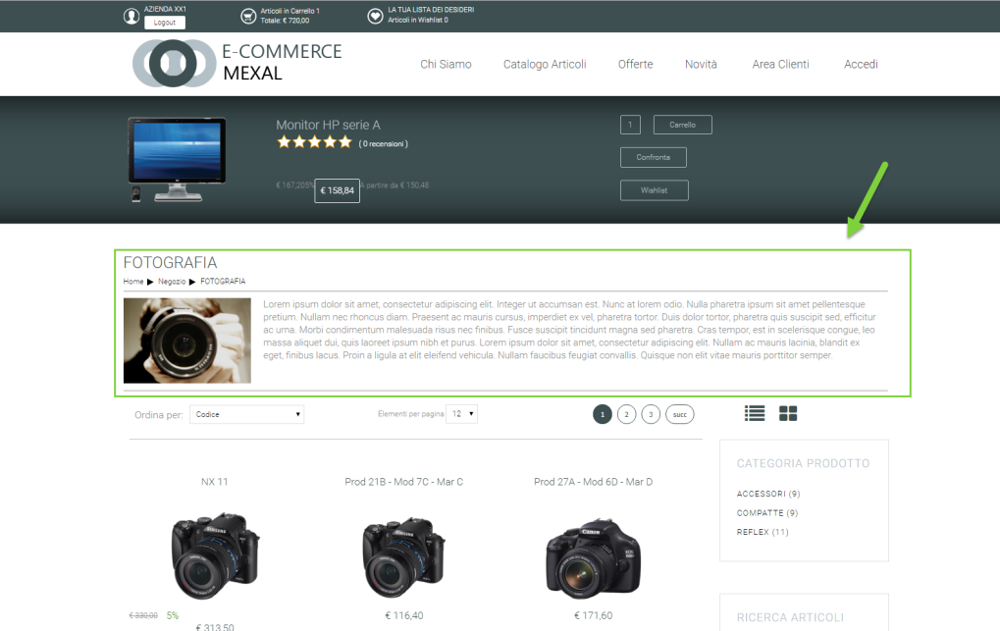{width="4.986805555555556in"
height="3.3048611111111112in"}

- **Descrizione Dettagliata:** consente di definire per l'articolo in
  esame, e in ciascuna delle lingue gestite all'interno del sito, una
  descrizione testuale estesa (NON formattabile) che potrà poi essere
  utilizzata all'interno di componenti quali ad esempio il **"Catalogo
  E-Commerce"** e/o la **"Scheda Prodotto"**.

> In particolare quanto presente all'interno di questo campo potrà
> essere inserito nel **"Catalogo E-Commerce"** e/o nella **"Scheda
> Prodotto"** utilizzando il componente ecommerce **"Dati Articolo"**
> mappato, ovviamente, sul corrispondente valore.
>
> **NOTA BENE:** per maggiori informazioni relativamente alla gestione
> del componente **"Dati Articolo"** si rimanda al relativo capitolo di
> questo manuale.
>
> Il contenuto di questo campo potrebbe anche essere valorizzato
> operando direttamente all'interno del gestionale.
>
> In particolare:

- **Nel caso di siti Ecommerce collegati a Mexal** all'interno di questo
  campo potrebbe infatti essere inserito il testo utilizzato per il
  campo "**Descrizione Dettagliata**" presente nell'anagrafica articolo
  di Mexal

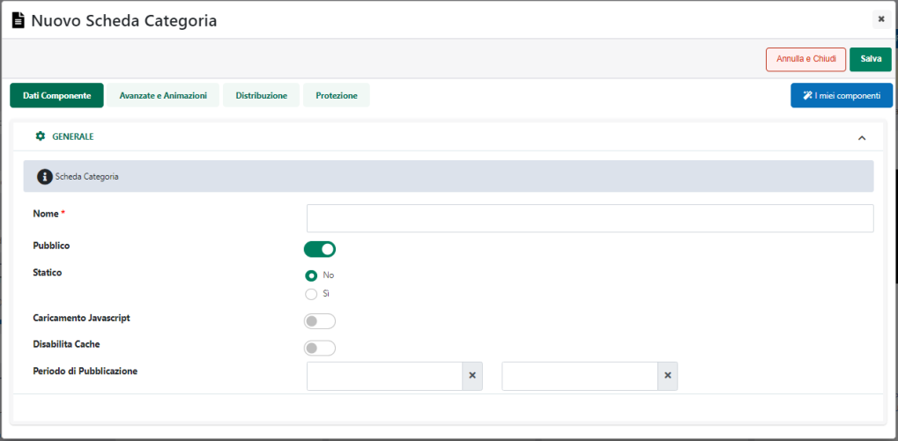{width="3.83125in"
height="1.3701388888888888in"}

> **ATTENZIONE!** l'aggiornamento, alla sincronizzazione, del valore (in
> italiano) presente all'interno di questo campo con quanto presente nel
> corrispondente campo Mexal, dipende dal fatto di aver selezionato o
> meno il parametro "**Descrizione Dettagliata Articolo**" presente
> all'interno della sezione "**Aggiornamento descrizioni in italiano dal
> Gestionale**" alla pagina "**Configurazione -- Sincronizzazione**" del
> Wizard

- **Nel caso di siti Ecommerce collegati ad un gestionale Ho.Re.Ca.** il
  campo "Descrizione Dettagliata" potrà invece essere gestito solo ed
  esclusivamente all'interno di Passweb.

<!-- -->

- **Descrizione HTML (1/2/3):** consente di definire per l'articolo in
  esame, e in ciascuna delle lingue gestite all'interno del sito, una
  descrizione HTML che potrà poi essere utilizzata, mediante il
  componente "Dati Articolo" all'interno di elementi quali il
  **"Catalogo E-Commerce"** la **"Scheda Prodotto"** ecc\...

> A differenza del precedente campo, è possibile inserire, in questo
> caso, all'interno della descrizione, del testo opportunamente
> formattato a livello di font, stili e colori, delle tabelle, dei link
> ecc ... sfruttando l'apposito Editor HTML.

**ATTENZIONE!** le descrizioni presenti all'interno di questa sezione
del Wizard oltre a poter essere inserite direttamente da gestionale
utilizzando gli appositi campi, volendo possono anche essere generate
utilizzando l'AI di Chat GPT. Per maggiori informazioni in merito si
rimanda a quanto indicato all'interno del capitolo "*Sito -- Passweb
AI*" di questo manuale

- **Full Text --** campo in sola visualizzazione.

> Consente di visualizzare la descrizione "Full Text" del relativo
> articolo. Per maggiori informazioni in merito a come poter valorizzare
> il campo in esame si veda anche quanto indicato all'interno del
> capitolo "*Catalogo -- Configurazione Parametri Catalogo -- Catalogo
> Mexal / Ho.Re.Ca. -- Ricerca*" di questo manuale

- **JsonLD Product --** campo in sola visualizzazione

> Consente di visualizzare il JSON-LD che verrà poi inserito sul front
> end del sito, nella corrispondente pagina prodotto, per gestire i dati
> strutturati relativi all'articolo in esame.
>
> **ATTENZIONE!** si ricorda che l'utilizzo dei JSON-LD richiede
> l'attivazione del corrispondente modulo su Passstore
>
> Per maggiori informazioni in merito alla creazione e alla gestione dei
> JSON-LD si rimanda a quanto indicato all'interno del capitolo "*Dati
> Strutturati*" di questo manuale

###### SEO -- SITE MAP

La sezione "**SEO** - **SiteMap**" consente di gestire tutti i parametri
necessari per una corretta indicizzazione dello specifico prodotto
compresi quelli mediante i quali poter decidere se la pagina prodotto
relativa all'articolo in esame dovrà o meno comparire all'interno della
SiteMap del sito, ed eventualmente, con che priorità e con che frequenza
di aggiornamento.

{width="5.4743055555555555in"
height="3.49375in"}

Nello specifico dunque il campo:

- **Title:** consente di indicare, in ciascuna delle lingue gestite
  all'interno del sito, il valore che potrà assumere il meta tag Title
  per la corrispondente pagina prodotto.

> E' possibile indicare esattamente (con una semplice stringa di testo)
> il Title da utilizzare oppure, volendo, è anche possibile costruire
> questo Title utilizzando i segnaposto messi a disposizione da Passweb
> e visualizzati cliccando sull'apposito pulsante presente
> immediatamente al di sotto del campo di input.
>
> **ATTENZIONE!** il valore inserito all'interno del campo in oggetto
> potrà essere preso in considerazione solo nel momento in cui il
> parametro "**Gestione Title**" (sezione "*Sito -- Preferenze -- SEO*"
> del Wizard) sia stato impostato sul valore "**Specifica**"
>
> Se poi, in queste stesse condizioni, il campo in oggetto non dovesse
> essere valorizzato allora il title della relativa pagina prodotto
> verrà costruito considerando il formato generico per esso indicato
> all'interno della sezione "Preferenze Sito" del Wizard.
>
> Per maggiori informazioni in merito si veda anche quanto indicato
> all'interno del capitolo "*Sito -- Preferenze -- SEO Nome del Sito e
> Configurazione Tag Title*" di questo manuale

- **Keywords Meta:** consente di specificare, per ciascuna delle lingue
  gestite all'interno del sito le parole chiave (corrispondenti al
  contenuto del Meta tag HTML KEYWORDS) relative all'articolo che si sta
  considerando.

> È possibile indicare esattamente le Keywords da utilizzare (mediante
> semplici stringhe di testo separate da ,) oppure, volendo, è possibile
> costruire queste Keyword utilizzando i segnaposto messi a disposizione
> da Passweb e visualizzati cliccando sull'apposito pulsante posto
> immediatamente al di sotto del campo di input.
>
> **ATTENZIONE!** dipendentemente dall'impostazione settata per il
> parametro "**Gestione Keywords**" (sezione "*Sito -- Preferenze --
> SEO*" del Wizard) i dati inseriti all'interno di questo campo potranno
> essere utilizzati come Keywords specifiche per la relativa pagina
> Prodotto, oppure potranno andare ad integrare quanto indicato in
> corrispondenza del campo "**Formato Keywords Pagina Prodotto**"
>
> Per maggiori informazioni in merito si veda anche quanto indicato
> all'interno del capitolo "*Sito -- Preferenze -- SEO Keywords
> Description*" di questo manuale

- **Descrizione Meta:** consente di specificare, per ciascuna delle
  lingue gestite all'interno del sito la descrizione (corrispondente al
  contenuto del Meta tag HTML DESCRIPTION) relativa al prodotto che si
  sta considerando e che verrà utilizzata per fornire informazioni
  relative a questa stessa pagina agli utenti o ai motori di ricerca.

> È possibile indicare esattamente la Description da utilizzare per la
> pagina prodotto in esame (mediante semplice stringa di testo) oppure,
> volendo, è possibile costruire queste Description utilizzando i
> segnaposto messi a disposizione da Passweb e visualizzati cliccando
> sull'apposito pulsante posto immediatamente al di sotto del campo di
> input.
>
> **ATTENZIONE!** dipendentemente dall'impostazione settata per il
> parametro "**Gestione Description**" (sezione "*Sito -- Preferenze --
> SEO*" del Wizard) quanto inserito all'interno di questo campo potrà
> essere utilizzato come Description specifica per la pagina prodotto in
> esame oppure potrà andare ad integrare quanto indicato in
> corrispondenza del campo "**Formato Description Pagina Prodotto**"
>
> Per maggiori informazioni in merito si veda anche quanto indicato
> all'interno del capitolo "*Sito -- Preferenze -- SEO Keywords
> Description*" di questo manuale

- **Meta Tags:** consente di inserire nella sezione \<head\> della
  pagina prodotto, e nel momento in cui all'interno di questa stessa
  pagina verrà visualizzato l'articolo in esame, dei Meta Tags
  aggiuntivi, non presenti nativamente in Passweb, e relativi quindi a
  specifiche esigenze dell'utente.

> **ATTENZIONE!** A differenza dei precedenti campi "Keywords" e
> "Description" in cui è necessario inserire solamente il contenuto del
> relativo meta tag (ossia le specifiche keywords e/o la specifica
> description) **all'interno di questo campo occorre inserire invece
> l'intero markup relativo al meta tag che si desidera utilizzare**.
>
> Il pulsante **"Aggiungi segnaposto"** consente di inserire, nella
> definizione del meta tag, dei segnaposto che verranno poi valorizzati
> automaticamente da Passweb.
>
> Per inserire un nuovo segnaposto è sufficiente posizionare il cursore
> nella posizione in cui questo dovrà essere effettivamente inserito,
> cliccare sul pulsante "Aggiungi segnaposto" e selezionare dal relativo
> menu contestuale la tipologia di segnaposto da inserire.
>
> **NOTA BENE:** oltre che a livello di specifico prodotto i Meta Tag
> possono essere aggiunti e gestiti anche a livello di Pagina web e di
> Layout Sito. Per maggiori informazioni in merito si vedano anche le
> sezioni "Live Editing -- Pagine" e "Live Editing -- Layout" di questo
> manuale

- **SiteMap:** consente di decidere se la pagina prodotto relativa
  all'articolo in esame dovrà o meno essere inclusa nella SiteMap del
  sito.

> **ATTENZIONE!** l'effettivo inserimento del prodotto in esame nella
> sitemap del sito dipende anche dalle impostazioni settate all'interno
> della sezione "**SiteMap Articoli**" presente alla pagina "**Sito --
> Preferenze**" del Wizard (tab **Seo**)

{width="5.792361111111111in"
height="3.5131944444444443in"}

> In questo senso infatti è bene ricordare che nel momento in cui, a
> seguito del filtro articoli definito all'interno di questa sezione, un
> determinato prodotto dovesse essere effettivamente inserito nella
> sitemap del sito, agendo poi dalla sua Anagrafica Passweb attraverso
> il campo "SiteMap" sarà comunque possibile sovrascrivere questa
> impostazione e decidere quindi di non inserirlo
>
> **Non vale invece il discorso inverso,** per cui se un determinato
> prodotto non dovesse soddisfare il filtro impostato nella sezione
> "SiteMap Articoli" allora non verrà mai inserito nella sitemap del
> sito indipendentemente dalle impostazioni settate per esso nella sua
> Anagrafica Passweb.

- **ChangeFrequency:** consente di impostare, per la pagina prodotto
  dell'articolo in esame, il valore del campo della SiteMap utilizzato
  per informare il motore di ricerca relativamente alla frequenza di
  aggiornamento dei contenuti della pagina stessa.

- **Priority:** consente di impostare, per la pagina prodotto
  dell'articolo in esame, il valore del campo della SiteMap utilizzato
  per informare il motore di ricerca relativamente alla priorità
  assegnata ai contenuti della pagina stessa.

> **ATTENZIONE!** Nel caso in cui per i tre parametri sopra indicati non
> sia stato specificato alcun valore, verrà considerato il valore
> assegnato, al corrispondente parametro presente nella sezione
> "**SiteMap Articoli**" del menu "**Sito -- Preferenze**" del Wizard
>
> **Nel caso in cui i parametri in esame non siano stati opportunamente
> valorizzati neppure all'interno del menu "Sito -- Preferenze" del
> Wizard, la pagina prodotto relativa all'articolo in oggetto sarà
> sempre inserita nella SiteMap con le seguenti impostazioni:
> "ChangeFrequency = Settimanale" e "Priority = 0.8"**
>
> **NOTA BENE:** per maggiori informazioni relativamente alla gestione
> della SiteMap del sito si veda anche la sezione "Sito -- Preferenze --
> SiteMap Pagine" di questo manuale.

###### ATTRIBUTI

La sezione **"Attributi"** consente di visualizzare e gestire tutti gli
Attributi Articolo, siano essi di tipo Mexal o di tipo Passweb, creati
all'interno dell'apposita sezione del Wizard ed utilizzati per estendere
le "tradizionali" informazioni anagrafiche.

{width="5.461111111111111in"
height="3.4743055555555555in"}

**ATTENZIONE! per poter gestire (visualizzare e valorizzare) da questa
sezione dell'Anagrafica Passweb gli Attributi Articolo addizionali è
indispensabile che l'articolo in questione appartenga ad una categoria
merceologica cui è stato assegnato uno specifico Set di Attributi.**

Nel caso in cui, dunque, l'articolo non appartenga a nessuna categoria
merceologica oppure nel caso in cui alla categoria merceologica di
appartenenza non sia stato assegnato nessun Set di Attributi questa
sezione risulterà essere vuota.

Facendo ora riferimento al processo di categorizzazione degli articoli
descritto nella sezione *"Catalogo -- Gestione Attributi Articoli"* di
questo manuale possiamo evidenziare come sarà esattamente all'interno di
questa sezione dell'applicazione che dovrà essere espletata, quantomeno
relativamente agli Attributi Articolo di tipo Passweb, la fase 5 di tale
processo andando quindi a valorizzare per ogni singolo articolo gli
attributi presenti nella loro Anagrafica Passweb

> **NOTA BENE:** per maggiori informazioni relativamente al processo di
> categorizzazione degli articoli si veda anche la sezione Catalogo --
> Gestione Attributi Articolo" di questo manuale.

Il tipo di controllo di input attraverso cui poter valorizzare gli
attributi presenti all'interno di questa anagrafica (campo di testo,
editor HTML, Drop Down, Selezione multipla ecc ...) dipenderà da quanto
impostato in fase di creazione dell'attributo stesso (per maggiori
informazioni si veda anche la sezione "Catalogo -- Gestione Attributi
Articolo -- Attributi" di questo manuale). Allo stesso modo nel caso in
cui per questi attributi dovesse essere stato impostato in fase di
creazione uno specifico valore di default, questo stesso valore verrà
inizialmente proposto all'interno del corrispondente attributo.

In questo senso poi occorre anche ricordare che **i valori di default
sono, per i vari attributi, soltanto dei valori propositivi** non ancora
memorizzati cioè nel database di Passweb.

Soltanto al salvataggio dell'anagrafica dell'articolo tutti i valori dei
suoi attributi verranno memorizzati nel database (e conseguentemente
visualizzati all'interno del sito) passando quindi da semplici valori
propositivi a valori di proprietà esclusiva di quello specifico
articolo. In queste condizioni inoltre se, al salvataggio
dell'anagrafica di un articolo, fosse stato mantenuto, per un certo
attributo, il suo valore di default nel caso in cui successivamente per
questo stesso attributo dovesse essere specificato un valore di default
differente, per gli articoli già memorizzati tale variazione non avrebbe
conseguenze e l'attributo in oggetto continuerebbe ad assumere i valori
attualmente presenti nel database.

**NOTA BENE:** quanto appena detto **NON** è valido per i controlli di
tipo "Drop Down" e "Selezione Multipla"

Per questo tipo di controlli infatti un'eventuale variazione e/o
eliminazione dei valori di default avvierà una procedura automatica che
eseguirà l'aggiornamento e/o l'eliminazione del valore in esame per
tutti gli articoli (compresi quelli per cui è già stata slavata
l'anagrafica Passweb) per i quali è stata selezionata l'opzione in
oggetto

**Generalmente all'interno di questa sezione, oltre agli Attributi
Articolo di tipo Passweb, potrebbero comparire anche degli Attributi
Articolo di tipo Mexal**, posto ovviamente di considerare un sito
Ecommerce collegato a Mexal e posto che questi stessi attributi siano
stati associati al Set assegnato alla categoria merceologica di
appartenenza dell'articolo.

A differenza però degli Attributi di tipo Passweb, quelli di tipo Mexal
saranno valorizzati alla sincronizzazione sulla base delle informazioni
inserite nei corrispondenti campi Mexal e si presenteranno quindi
all'interno di questa maschera come campi a sola lettura.

> **NOTA BENE:** non è possibile impostare da questa sezione
> dell'applicazione il valore di Attributi Articolo di tipo Mexal. Il
> valore di questi attributi può essere modificato solo ed
> esclusivamente all'interno del gestionale

Al salvataggio dell'anagrafica, infine, verranno effettuati controlli di
univocità e di obbligatorietà sugli attributi presenti all'interno
dell'anagrafica stessa. Verranno quindi visualizzati eventuali messaggi
di errore in relazione ad attributi definiti come obbligatori e non
valorizzati e/o in relazione ad attributi definiti come univoci e che
riportano invece lo stesso valore per articoli differenti.

###### BOX

La sezione **"Box", presente solo ed esclusivamente per articoli di tipo
Campionario (Ecommerce Mexal) o Composti (Ecommerce Ho.Re.Ca.),**
consente di definire se, ed eventualmente come, l'articolo in esame
possa essere configurato direttamente dall'utente in fase di acquisto
all'interno del sito.

Nel momento in cui si dovesse dunque decidere di rendere configurabile
un articolo di questo tipo, in fase di acquisto l'utente avrà poi la
possibilità di decidere come comporre il suo Box, con quali articoli e
in che quantità, ovviamente il tutto sempre entro i limiti impostati in
fase di configurazione dell'articolo stesso.

{width="5.461111111111111in"
height="3.4805555555555556in"}

In particolare dunque il campo:

- **Abilita Configurazione:** se selezionato, il Campionario / Composto
  in questione potrà essere configurato (nei limiti stabiliti)
  direttamente in fase di acquisto all'interno del sito.

> In queste condizioni dunque l'utente avrà la possibilità di
> selezionare quali prodotti inserire o non inserire all'interno del
> sito ed eventualmente in che quantità.
>
> In caso contrario (parametro non selezionato) l'articolo in questione
> continuerà ad essere gestito come un normale Campionario / Composto e
> l'utente non avrà quindi alcuna possibilità di variarne la
> composizione (che sarà quindi stabilita e definita esclusivamente
> all'interno del gestionale).

- **Numero Massimo Componenti:** consente di impostare il numero massimo
  (inteso come quantità complessive) di articoli che potranno essere
  inseriti all'interno del Box.

> **ATTENZIONE! Il valore di questo parametro dovrà essere, ovviamente,
> maggiore o uguale alla somma delle quantità minime dei singoli
> componenti presenti obbligatoriamente all'interno del box.**
>
> Nel caso di **siti Ecommerce collegati ad uno dei gestionali
> Ho.Re.Ca.** il valore in esame è in sola visualizzazione e può quindi
> essere variato solo ed esclusivamente all'interno del gestionale
> operando nella scheda di configurazione del Composto mediante il
> parametro "**N° massimo complessivo**"

{width="4.915277777777778in"
height="2.720833333333333in"}

> Nel caso invece di **siti Ecommerce collegati a Mexal**, il numero
> massimo di componenti andrà specificato direttamente nell'Anagrafica
> Passweb dell'articolo mediante il campo in oggetto.
>
> **ATTENZIONE! Nel momento in cui questo campo non dovesse essere
> valorizzato, il numero massimo di articoli che potranno essere
> inseriti all'interno di un Box configurabile sarà dato dalla somma
> delle quantità impostate per ogni singolo componente, direttamente su
> Mexal, in fase di configurazione del relativo articolo Campionario.**

- **Numero Minimo Componenti:** consente di specificare il numero minimo
  (inteso come quantità complessive) di articoli che dovranno
  necessariamente essere inseriti all'interno del Box prima di poterlo
  acquistare.

> **ATTENZIONE! Il valore di questo parametro dovrà essere, ovviamente,
> minore o uguale alla somma delle quantità massime dei singoli
> componenti del Campionario / Composto**
>
> Nel caso in cui, per il parametro in questione, non venga indicato
> nessun valore, verrà considerato automaticamente un Numero Minimo di
> Componenti pari a 1, in quanto per poter acquistare il Box è
> ovviamente necessaria la presenza al suo interno di almeno un
> componente.

La sezione **Componente** consente di visualizzare e gestire l'elenco di
articoli che potranno essere inserti all'interno del Box. Tale elenco
coincide esattamente con l'insieme dei componenti definiti in fase di
creazione del Campionario / Composto all'interno del gestionale.

**ATTENZIONE!** **nel caso in cui si volessero aggiungere o eliminare
articoli da questo elenco sarà necessario agire direttamente all'interno
del gestionale.**

Per ogni singolo componente del Box sarà possibile decidere se l'utente
potrà o meno variarne, in fase di acquisto, la quantità e, in caso
affermativo, sarà possibile impostare anche la quantità minima con cui
quello stesso articolo dovrà necessariamente essere presente all'interno
del box.

Selezionando quindi uno degli articoli presenti in elenco verrà
visualizzata nella parte destra della maschera la sezione "**Modifica
Componente**"

{width="5.461111111111111in"
height="3.4805555555555556in"}

all'interno della quale sarà possibile impostare un valore per i
seguenti parametri:

- **Abilita Configurazione:** selezionando questo parametro l'utente
  avrà poi la possibilità, in fase di configurazione del Box, di variare
  la quantità del relativo articolo.

> **ATETNZIONE!** Nel caso in cui si dovesse decidere di non selezionare
> il parametro "Abilita Configurazione" l'articolo in questione verrà
> sempre inserito all'interno del Box nella quantità indicata
> all'interno del gestionale in fase di creazione del corrispondente
> articolo Campionario / Composto

- **Quantità Minima:** consente di indicare la quantità minima con cui
  l' articolo in questione dovrà necessariamente essere presente
  all'interno del Box. Nel caso in cui non venga indicato alcun valore,
  per l'articolo in esame verrà considerata automaticamente una Quantità
  Minima pari a 0.

> **ATTENZIONE! Se l'esigenza dovesse essere quella di rendere un
> componente del Box non obbligatorio sarà sufficiente:**

- **selezionare per esso il parametro "Abilita Configurazione"**

- **impostare la sua "Quantità Minima" sul valore 0 (o al limite
  lasciare vuoto il campo)**

- **impostare il parametro "Predefinito" sul valore NO.**

> In queste condizioni l'articolo in esame comparirà all'interno del
> box, indipendentemente dalle impostazioni settate lato gestionale, con
> quantità pari a 0 (si veda anche la funzione del successivo parametro
> "Predefinito") e l'utente potrà, in fase di acquisto, lasciare
> invariata questa impostazione, decidendo, di fatto, di non inserirlo
> all'interno del Box.
>
> Supponendo dunque di aver inserito (lato gestionale) all'interno del
> Campionario Configurabile un articolo PROD03B in quantità pari a 10

{width="5.285416666666666in"
height="2.915277777777778in"}

> di aver selezionato (lato Passweb) per lo stesso articolo il parametro
> "Abilita Configurazione", di aver impostato per esso una "Quantità
> Minima" pari a 0 e di aver impostato anche il parametro "Predefinito"
> sul valore NO

{width="5.746527777777778in"
height="3.4805555555555556in"}

> l'utente in fase di configurazione del Box all'interno del sito si
> troverà inizialmente l'articolo in esame in quantità pari a 0 e potrà
> decidere di variare tale quantità tra 0 (**articolo non inserito**) e
> 10, come del resto indicato dalla relativa etichetta.

{width="4.597222222222222in"
height="3.415277777777778in"}

- **Predefinito:** consente di indicare se il componente in oggetto
  dovrà essere o meno visualizzato nel box con la quantità specificata
  sul gestionale.

{width="5.772916666666666in"
height="3.3895833333333334in"}

> E' possibile selezionare uno dei seguenti valori:

- **SI:** in queste condizioni il componente in oggetto verrà
  inizialmente visualizzato all'interno del box configurabile

  - con la stessa quantità indicata all'interno del gestionale nel caso
    in cui all'interno del campo "Quantità minima" sia stato impostato
    il valore 0

  - con la quantità indicata all'interno del campo "Quantità minima" nel
    caso in cui tale quantità sia maggiore di 0

> **ATTENZIONE!** In caso di articoli a taglie la quantità minima verrà
> distribuita a partire dalla prima taglia e a seguire sulle altre fino
> a che non viene raggiunto il minimo indicato, considerando comunque
> che il valore per taglia non deve mai superare il massimo impostato
> sul gestionale.
>
> Supponendo ad esempio di avere un articolo a taglie, con "quantità
> massima = 5", con taglia "S=2" e "M=3", impostando il campo "Quantità
> Minima = 3" la prima Taglia S verrà impostata inizialmente sul valore
> "S=2" e la seconda sul valore "M=1".

- **NO:** in queste condizioni il componente in oggetto verrà
  inizialmente visualizzato all'interno del box configurabile con
  quantità pari a 0 (indipendentemente da quella che è la quantità
  settata all'interno del gestionale in fase di configurazione del
  relativo Campionario)

> **ATENZONE! In queste condizioni, ovviamente, al salvataggio del
> componente il campo "Quantità minima" verrà automaticamente impostato
> sul valore 0**
>
> In caso contrario infatti ci sarebbe un' incongruenza dettata dal
> fatto di avere per il componente in oggetto, ad esempio, una quantità
> minima pari a 1 ed il campo quantità inizialmente valorizzato a 0 come
> se lo stesso articolo potesse anche non essere inserito all'interno
> del box.
>
> **ATTENZIONE!** Nel caso di siti Ecommerce collegati ad uno dei
> gestionali Ho.Re.Ca. il campo "**[Predefinito]{.underline}**" è in
> sola visualizzazione e può quindi essere variato solo ed
> esclusivamente all'interno del gestionale operando nella scheda di
> configurazione del Composto mediante il relativo check

{width="5.675in"
height="3.292361111111111in"}

- **Solo Taglie Indicate (solo Ecommerce Mexal e solo nel caso in cui
  l'articolo in esame sia un articolo gestito a Taglie/Colori):**
  consente, se selezionato, di visualizzare, e quindi di inserire
  all'interno del Box configurabile, le sole Taglie/Colori per le quali
  è stata effettivamente inserita, lato gestionale una specifica
  quantità.

{width="5.772916666666666in"
height="3.3895833333333334in"}

> In caso contrario (parametro non selezionato) verranno visualizzate
> tutte le taglie/colori gestiti e l'utente avrà quindi la possibilità
> di inserire nel del Box anche delle taglie/colori per i quali non è
> stata indicata, in fase di creazione del Campionario all'interno del
> gestionale, nessuna quantità.

Per maggiori informazioni relativamente alla gestione e alla
configurazione lato sito di un Articolo Campionario / Composto si veda
anche la sezione "*Live Editing -- Lista Componenti Ecommerce --
Componente Campionario*" di questo manuale.

###### SPEDIZIONE

La sezione "**Spedizione**" consente di gestire i dati relativi alle
dimensioni (**Larghezza**, **Altezza**, **Profondità** e **Peso**) dello
specifico prodotto.

{width="5.538888888888889in"
height="3.532638888888889in"}

**ATTENZIONE!** Nel momento in cui il sito dovesse essere integrato con
Qaplà (piattaforma di gestione delle spedizioni) il peso degli articoli
sarà una delle informazioni (assieme al cliente intestatario
dell'ordine, all'indirizzo mail, all'indirizzo di spedizione ...)
passate alla piattaforma terza. Per maggiori informazioni relativamente
all'integrazione tra Passweb e Qaplà si veda anche quanto indicato
all'interno del corrispondente capitolo di questo manuale ("*Sito --
Preferenze -- Integrazioni -- Logistica Qaplà*")

I dati presenti all'interno di questa pagina possono essere in sola
lettura oppure in lettura / scrittura dipendentemente dal fatto di
considerare un sito Ecommerce collegato a Mexal o a uno dei gestionali
Ho.Re.Ca. e dipendentemente anche dal fatto di aver attivato o meno in
Mexal l'App "**Invio Documenti a Passdelivery**" mediante la quale poter
gestire le consegne a domicilio sul relativo portale.

Occorre quindi considerare le seguenti casistiche:

**[SITI ECOMMERCE COLLEGATI A MEXAL E APP "INVIO DOCUMENTI A
PASSDELIVERY" ATTIVATA]{.underline}**

In queste condizioni le informazioni sulle dimensioni dei singoli
articoli dovranno essere gestite mediante gli appositi campi messi a
disposizione dalla relativa App Mexal.

In questo senso sarà quindi necessario:

- Accedere all'anagrafica dell'articolo per il quale si desidera
  impostare le dimensioni e/o il peso e cliccare sul pulsante "**Dati
  Aggiuntivi**"

{width="4.325in"
height="2.571527777777778in"}

- Selezionare la voce "**Delivery -- Dati spedizione Art**" e cliccare
  sul pulsante "**Seleziona**"

{width="2.779166666666667in"
height="2.6104166666666666in"}

- Una vota effettuato l'accesso alla maschera "**Delivery -- Dati
  Spedizioni Art**" inserire le dimensioni del prodotto all'interno dei
  relativi campi (**Altezza** -- **Larghezza** -- **Profondità** --
  **Peso** **Lordo**)

{width="5.052083333333333in"
height="1.7597222222222222in"}

> **ATTENZIONE!** il campo "**Peso**" dell'anagrafica Passweb
> corrisponde al campo "**Peso Lordo**" presente all'interno della
> maschera evidenziata in figura

Una volta impostate le dimensioni per i vari prodotti sarà poi
necessario effettuare una sincronizzazione per fare in modo che questi
dati vengano correttamente riportati anche all'interno del sito dove,
come detto, saranno in sola lettura.

**ATTENZIONE!** in queste condizioni se l'esigenza dovesse essere quella
di variare una di queste informazioni, sarà necessario agire, per forza
di cose, all'interno del gestionale ed effettuare poi una nuova
sincronizzazione per riportare la variazione anche all'interno del sito

**[SITI ECOMMERCE COLLEGATI A MEXAL E APP "INVIO DOCUMENTI A
PASSDELIVERY" DISATTIVA]{.underline}**

In queste condizioni le informazioni sulle dimensioni dei singoli
articoli dovranno essere gestite direttamente su Passweb

I campi presenti, nell'Anagrafica Passweb, all'interno della sezione
"Spedizione" saranno quindi abilitati anche in scrittura e potranno
essere valorizzati manualmente articolo per articolo oppure in blocco
mediante la procedura di importazione dei dati via csv (per maggiori
informazioni in merito a questa procedura si veda anche quanto indicato
all'interno del capitolo "*Catalogo -- Gestione Articoli -- Articoli --
Anagrafica Articolo / Servizio -- Importazione / Esportazione dei dati
articolo tramite file*" di questo manuale)

**[SITI ECOMMERCE COLLEGATI A GESTIONALI HO.RE.CA.]{.underline}**

In questo caso occorre considerare che sui gestionali Ho.Re.Ca. non
esistono campi appositi per impostare Altezza, Larghezza, Profondità e
Peso dei singoli articoli, per cui anche in queste condizioni questo
tipo di informazioni dovranno essere gestite direttamente su Passweb
manualmente, articolo per articolo, o mediante importazione massiva via
csv

**ATTENZIONE!** Una volta impostate le dimensioni degli articoli,
volendo, sarà poi possibile definire metodi di spedizione la cui
visibilità in fase di checkout potrà essere condizionata alle effettive
dimensioni dei prodotti in ordine, cosa questa che potrebbe tornare
particolarmente utile ad esempio nelle consegne a domicilio o comunque
con vettori che possono effettuare consegne solo nel caso in cui i
prodotti da consegnare siano al di sotto di certe dimensioni o di un
certo peso

In questo senso nel caso in cui uno dei campi in esame dovesse essere
vuoto verrà considerato come se il relativo valore fosse impostato a
zero.

Per maggiori informazioni in merito si veda anche quanto indicato
all'interno del relativo capitolo di questo manuale ("*Ordini -- Metodi
di Trasporto -- Trasporti di Tipo Passweb -- Parametri Generali*")

###### PREZZI

La sezione "**Prezzi**" consente di visualizzare i prezzi (**ivati** e
**non ivati**) del relativo articolo in ciascuno dei listini definiti
all'interno del gestionale.

{width="5.552083333333333in"
height="3.3569444444444443in"}

