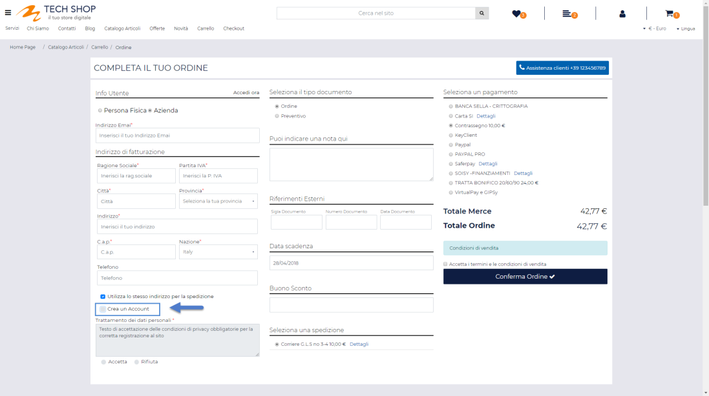
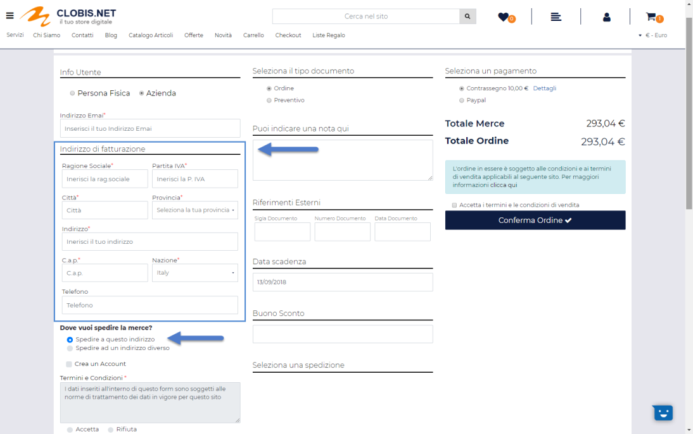
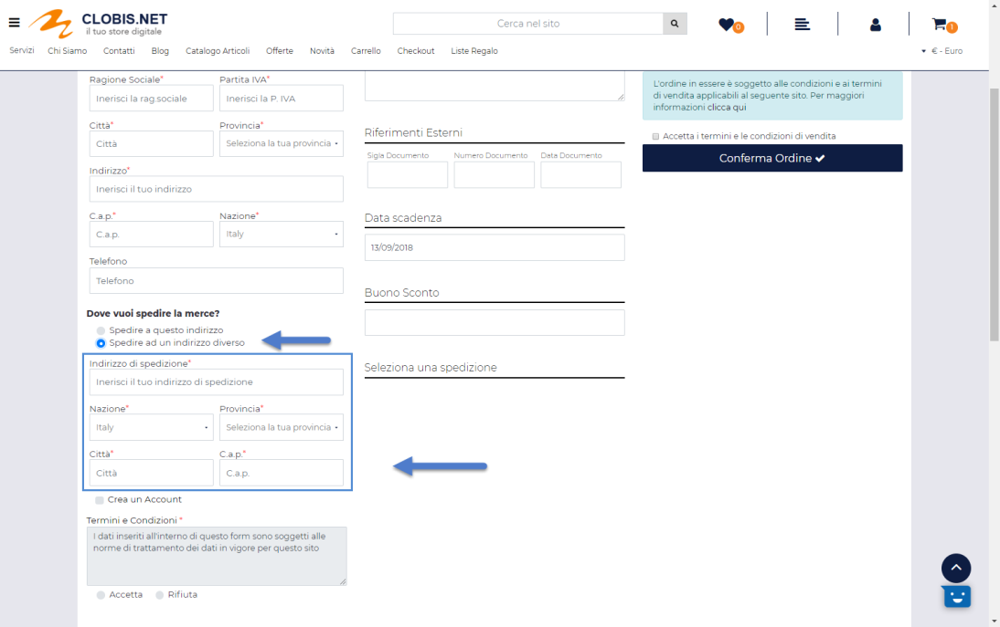

# AVVISI DISPONIBILITA'

All'interno di questa sezione è possibile visualizzare un elenco
completo di tutti i prodotti per cui sono state effettuate delle
richieste di notifica disponibilità, quali sono gli utenti che hanno
effettivamente fatto queste richieste, quando queste richieste sono
state effettuate, se sono già state inviate le notifiche di
disponibilità ecc...

**ATTENZIONE!** ogni giorno dopo la mezzanotte, **solo** **nel caso in
cui dovessero essere presenti, nell'elenco sopra evidenziato, dei
prodotti per cui non è ancora stata inviata la notifica di "Articolo
nuovamente disponibile**", Passweb provvederà ad inviare automaticamente
una mail, all'indirizzo impostato alla pagina "Posta / SMS" del Wizard
(campo Email), contenente l'elenco (codice e titolo) di tali prodotti.

Il campo di ricerca attivabile cliccando sulla lente di ingrandimento,
presente in testata di ogni singola colonna, consente di filtrare i dati
in griglia sulla base dei valori presenti all'interno della colonna
stessa.

Una volta impostato un filtro di ricerca, per poterlo poi eliminare sarà
sufficiente cliccare sull'icona raffigurante una piccola lente di
ingrandimento con un -- all'interno (
 ) che comparirà in testata alla colonna
in corrispondenza della quale è stato impostato il filtro stesso.

Infine è anche possibile ordinare, in maniera crescente e/o decrescente,
gli elementi in griglia cliccando semplicemente sull'icona raffigurante
due piccole frecce posta anch' essa in testata ad ogni singola colonna
della griglia (
 )

Per ciascuno dei prodotti presenti in elenco è possibile visualizzare:

- il suo "Titolo" -- campo **Articolo**

- la specifica taglia/colore dell'articolo per cui è stata richiesta la
  notifica di disponibilità -- campo **Taglia/Colore**

- il suo codice -- campo **Codice**

- il numero di utenti che hanno richiesto di essere avvisati nel momento
  in cui quello stesso articolo dovesse tornare ad essere disponibile --
  campo **Numero**

- le date in cui sono state effettuate rispettivamente la prima e
  l'ultima richiesta di notifica -- campi **Prima Iscrizione** e
  **Ultima Iscrizione**.

**ATTENZIONE!** Ogni giorno

Selezionando uno degli articoli presenti in elenco, e cliccando sul
pulsante "**Visualizza Notifiche Disponibilità**" (
 ) è possibile visualizzare l'elenco
dettagliato di tutti gli utenti che hanno effettivamente richiesto di
essere avvisati in merito alla disponibilità di quello specifico
articolo.

Per ogni utente è possibile visualizzare:

- il suo nominativo (**Guest** nel caso in cui la richiesta sia stata
  fatta da un utente non autenticato) -- campo **Nominativo**

- l'indirizzo mail cui verrà inviata la notifica di disponibilità --
  **campo Email**

- la data in cui è stata effettuata la richiesta di notifica -- campo
  **Data Iscrizione**

- la data in cui tale notifica è stata effettivamente inviata -- campo
  **Data Notifica**

**ATTENZIONE!** I dati presenti all'interno di questa sezione sono in
sola visualizzazione. Non è quindi possibile interagire in qualsiasi
modo con questi dati e/o gestire da questa sezione del Wizard le varie
notifiche

Il pulsante "**Esporta**" (
 ) presente nella barra degli strumenti consente invece
di esportare, all'interno di un apposito file csv, l'elenco di tutti gli
utenti che hanno effettuato una richiesta di notifica disponibilità.

Cliccando su questo pulsante verrà infatti visualizzata la maschera
"**Esporta Notifiche Disponibilità**"

all'interno della quale poter configurare l'esportazione dei dati.

Nel caso di sito in multilingua è possibile selezionare, tra quelle
attualmente gestite, la lingua in relazione alla quale dovranno essere
esportati i dati (campo **Lingua**)

Il campo **Separatore** consente invece di indicare, selezionandolo,
dall'apposito menu a tendina, il carattere che dovrà essere utilizzato
all'interno del file di esportazione come separatore per i vari campi.

All'interno del file di esportazione saranno presenti i seguenti campi:

- **nome**: nome dell'utente che ha effettuato l'iscrizione al sistema
  di notifiche (presente solo per utenti registrati)

- **cognome**: cognome dell'utente che ha effettuato l'iscrizione al
  sistema di notifiche (presente solo per utenti registrati)

- **email**: email con cui l'utente ha effettuato l'iscrizione al
  sistema di notifiche

- **dataRegistrazione**: data in cui l\'utente si è registrato per
  ricevere la notifica

- **dataNotifica**: data in cui è stata inviata la notifica

- **codice**: codice dell'articolo oggetto della notifica

- **titolo**: titolo dell'articolo oggetto della notifica

- **taglia**: eventuale taglia dell'articolo oggetto della notifica

Per maggiori informazioni in merito al sistema di notifiche sulle
disponibilità articolo si veda anche la sezione *"MailChimp -- Notifiche
Disponibilità -- Passweb e MailChimp"* di questo manuale

