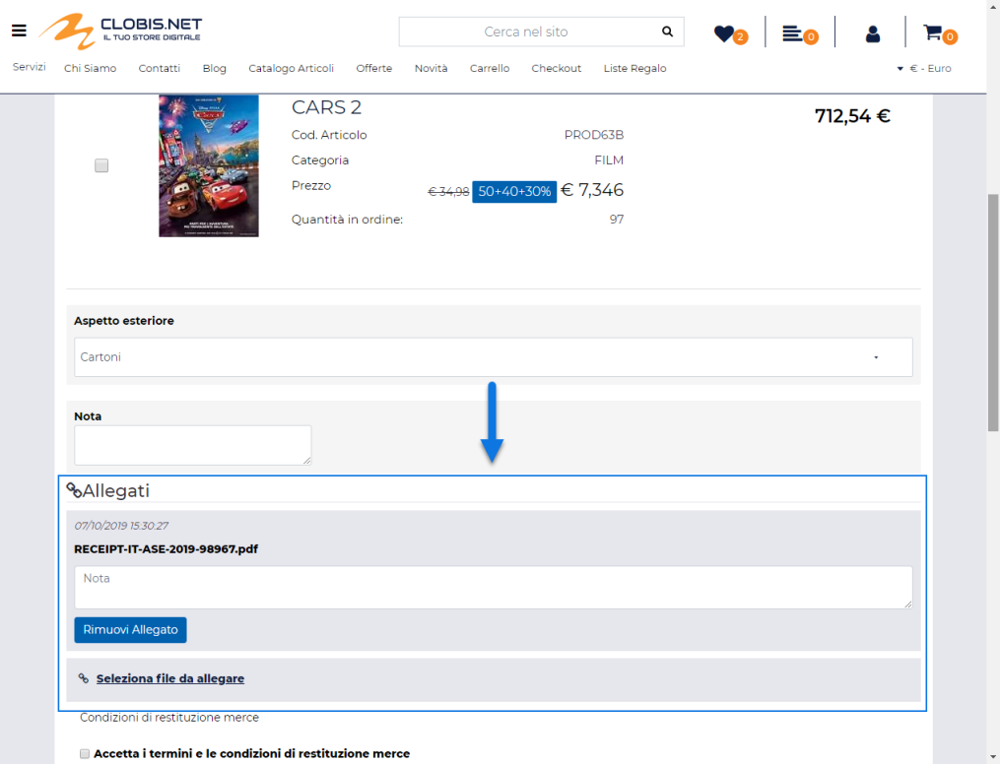
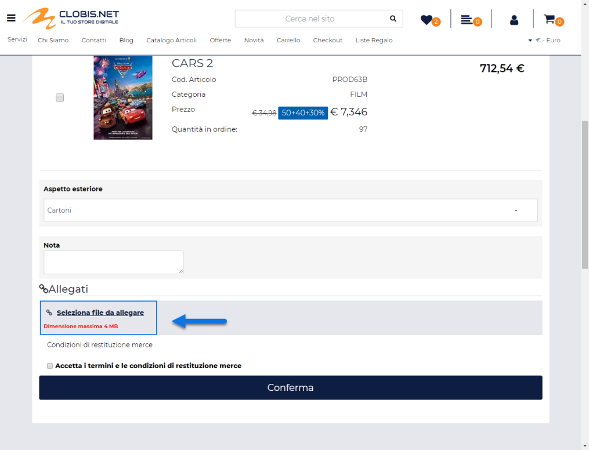
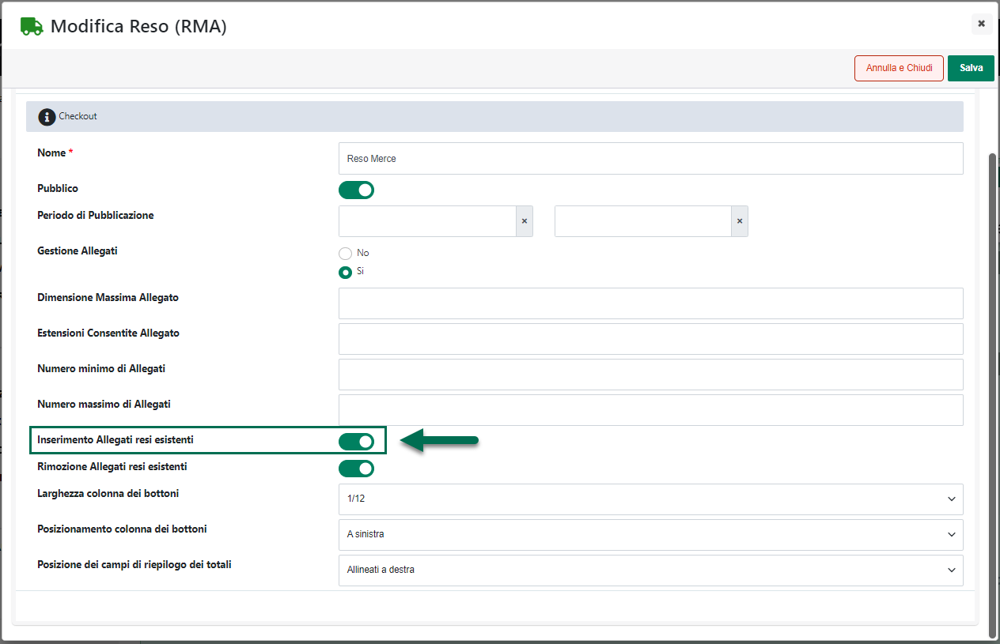
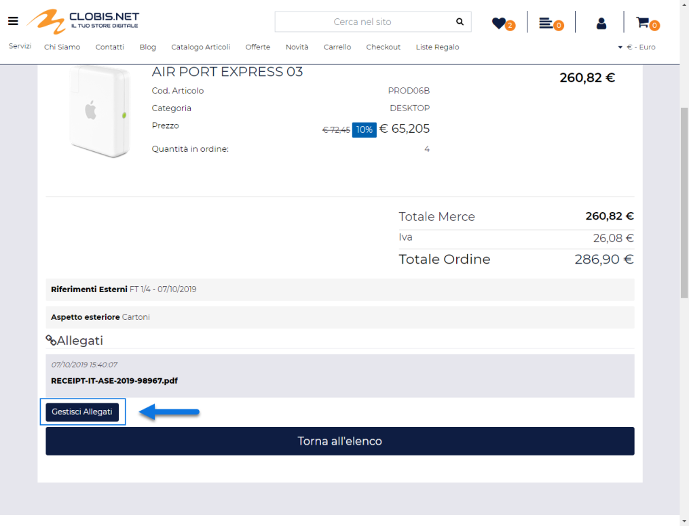
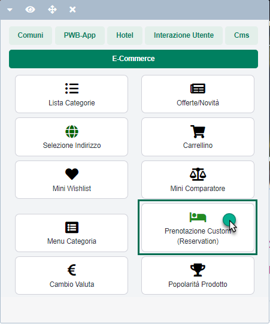
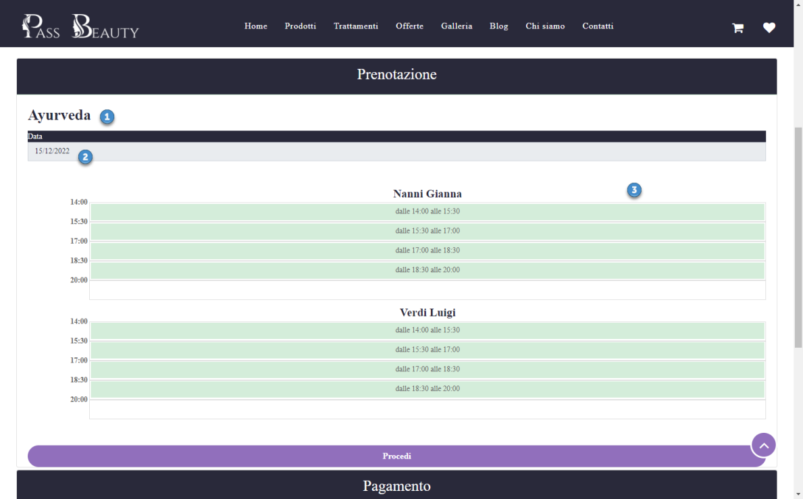
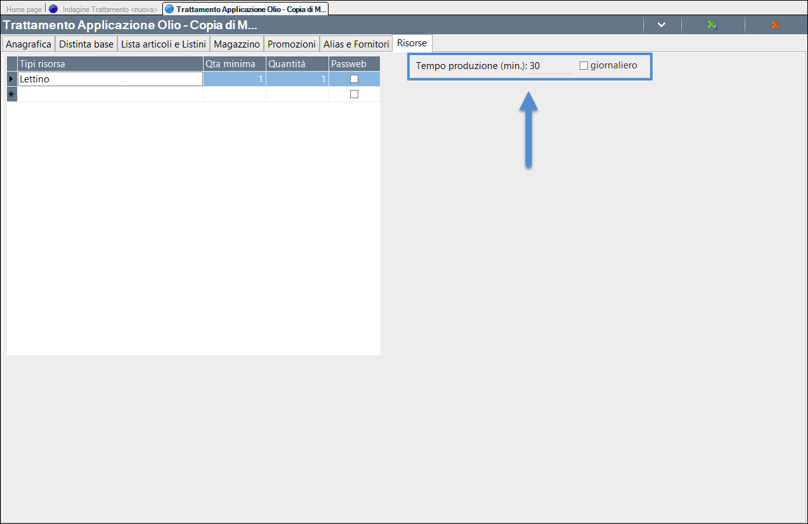
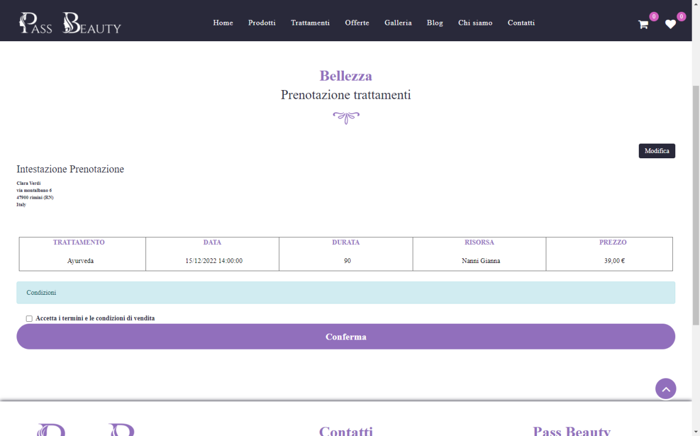

# CONFIGURAZIONE DI UNA SERIE DI TAGLIE / COLORI

Per accedere ai parametri di configurazione di una delle Serie di Taglie
/ Colori gestite all'interno del proprio sito è sufficiente selezionarla
tra quelle presenti all'interno della maschera **"Lista delle Serie"** e
cliccare poi sul pulsante "**Modifica Serie**"
( ) presente nella contestuale barra degli strumenti.

Cliccando su questo pulsante verrà infatti visualizzata la maschera
"**Modifica Serie**"

all'interno della quale poter impostare un valore per i seguenti campi:

**Codice --** campo in sola visualizzazione : consente di visualizzare
il codice gestionale della relativa serie

**Grafica Prodotto (Obbligatorio)**: consente di impostare la modalità
di visualizzazione del componente **"Aggiungi al Carello" per le pagine
Prodotto** degli articoli appartenenti alla serie attualmente
considerata. E' possibile selezionare una delle seguenti opzioni:

- **Select:** selezionando questa opzione, all'interno della scheda
  prodotto di articoli a taglie appartenenti alla serie in esame, ed in
  corrispondenza del componente "Aggiungi al Carrello", verrà
  visualizzato un menu a tendina contenente l'elenco di tutte le
  taglie/colori della serie.

> Nello specifico per ogni taglia / colore verrà visualizzato quanto per
> essa indicato, in fase di configurazione, all'interno dei campi
> "**Testo**", "**Colore**" o "**Immagine di background**" (per maggiori
> informazioni relativamente a come poter personalizzare i singoli
> elementi di una serie di taglie/colori si veda quanto indicato nel
> precedente capitolo di questo manuale)

> In questo caso quindi l'utente dovrebbe per prima cosa selezionare dal
> menu a tendina la taglia/colore dell'articolo che desidera inserire in
> carrello, impostare la quantità che desidera acquistare e cliccare poi
> sul pulsante "Aggiungi al Carrello".
>
> **ATTENZIONE!** Nel momento in cui il sito dovesse essere impostato
> sulla modalità "**Acquista solo se disponibile**" e per l'articolo in
> esame dovesse essere effettivamente disponibile un'unica
> taglia/colore, questa verrà automaticamente selezionata.

- **Estesa:** selezionando questa opzione, all'interno della scheda
  prodotto di articoli a taglie appartenenti alla serie in esame, ed in
  corrispondenza del componente "Aggiungi al Carrello", per ogni taglia
  della serie verrà visualizzato un campo di input preceduto
  dall'etichetta ed eventualmente dal colore/immagine di background
  indicato in fase di configurazione della specifico elemento.

> In questo caso quindi l'utente potrebbe inserire in carrello in un
> colpo solo, relativamente allo stesso articolo, quantità diverse di
> taglie diverse.

**NOTA BENE:** nel caso in cui sia stata impostata per il parametro in
oggetto l'opzione "Estesa", se l'utente tentasse di aggiungere
l'articolo in carrello senza aver indicato una quantità diversa da 0 per
almeno una delle taglie/colori gestiti sull'articolo, verrebbe avviata
un'animazione sui campi di input per avvisare l'utente relativamente
alla necessità di impostare almeno un valore diverso da 0 prima di poter
inserire l'articolo in carrello. Il colore

> Il colore di questa animazione sarà quello impostato nel parametro
> "**Colore sull'Animazione sulle Taglie/Colori**" presente tra i
> parametri di configurazione del componente "Aggiungi in Carrello"

- **Lista**: selezionando questa opzione all'interno della scheda
  prodotto di articoli a taglie appartenenti alla serie in esame, ed in
  corrispondenza del componente "Aggiungi al Carrello", verrà
  visualizzata una lista orizzontale, a selezione singola, di tutte le
  taglie/colori della serie.

> Anche in questo caso per ogni taglia / colore verrà visualizzato
> quanto per essa indicato, in fase di configurazione, all'interno dei
> campi "**Testo**", "**Colore**" o "**Immagine di background**" (per
> maggiori informazioni relativamente a come poter personalizzare i
> singoli elementi di una serie di taglie/colori si veda quanto indicato
> nel precedente capitolo di questo manuale)

> In questo caso quindi l'utente dovrebbe per prima cosa selezionare,
> cliccandoci sopra, la taglia/colore dell'articolo che desidera
> inserire in carrello, impostare la quantità che desidera acquistare e
> cliccare poi sul pulsante "Aggiungi al Carrello".

**Grafica Negozio (NON Obbligatorio)**: consente di impostare la
modalità di visualizzazione del componente **"Aggiungi al Carello"
presente nelle celle di componenti quali "Catalogo Ecommerce",
"Offerte/novità" ecc..,** in corrispondenza di articoli appartenenti
alla serie attualmente considerata.

E' possibile selezionare una delle seguenti opzioni:

- **Nessuna Opzione Selezionata:** nel caso in cui non venga specificata
  nessuna opzione per il parametro considerato, nelle celle di
  componenti quali "Catalogo Ecommerce" "Offerte/Novità" ecc..., in
  corrispondenza di articoli appartenenti alla serie attualmente
  considerata, verrà visualizzato **solo ed esclusivamente il pulsante
  "Aggiungi al Carrello" senza nessun campo di input per le quantità.**

> In queste condizioni non sarà possibile inserire l'articolo in
> carrello direttamene da questi stessi componenti, non potendo,
> ovviamente, definirne la specifica taglia/colore.
>
> Cliccando sul pulsante "Aggiungi al Carrello", in queste condizioni,
> l'utente verrà automaticamente ridiretto alla relativa pagina Prodotto
> da cui poter specificare la taglia/colore dell'articolo che gli
> interessa acquistare e da cui poterla dunque inserire effettivamente
> in Carrello.

- **Select:** selezionando questa opzione, nelle celle di componenti
  quali "Catalogo Ecommerce" "Offerte/Novità" ecc..., in corrispondenza
  di articoli appartenenti alla serie attualmente considerata, verrà
  visualizzato, per il componente "Aggiungi al Carrello", **oltre al
  relativo pulsante anche il campo di input delle quantità e un menu a
  tendina contenente l'elenco di tutte le taglie della sua serie di
  appartenenza.**

> In queste condizioni l'utente avrà quindi la possibilità di definire
> direttamente da questi componenti la specifica taglia/colore
> dell'articolo che intende acquistare e in che quantità desidera
> acquistarlo.
>
> Impostate queste informazioni il pulsante "Aggiungi al Carrello"
> permetterà all'utente di inserire l'articolo indicato in Carrello
> senza dover per forza di cose passare dalla sua scheda prodotto.
>
> **ATTENZIONE!** Nel momento in cui per l'articolo in esame dovesse
> essere effettivamente disponibile un'unica taglia, questa verrà
> automaticamente selezionata

- **Estesa:** selezionando questa opzione, nelle celle di componenti
  quali "Catalogo Ecommerce" "Offerte/Novità" ecc..., in corrispondenza
  di articoli appartenenti alla serie attualmente considerata, per il
  componente "Aggiungi al Carrello" verrà visualizzato, per ogni taglia
  della serie, un campo di input preceduto dall'etichetta, ed
  eventualmente dal colore/immagine di background impostato per la
  specifica taglia.

> Anche in questo caso l'utente avrà quindi la possibilità di definire
> direttamente da questi componenti la specifica taglia/colore
> dell'articolo che intende acquistare e in che quantità desidera
> acquistarlo. Inoltre a differenza del caso precedente questa volta
> potrebbe anche inserire in carrello in un colpo solo, relativamente
> allo stesso articolo, quantità diverse di taglie diverse
>
> **NOTA BENE:** nel caso in cui sia stata impostata per il parametro in
> oggetto l'opzione "Estesa", se l'utente tentasse di aggiungere
> l'articolo in carrello senza aver indicato una quantità diversa da 0
> per almeno una delle taglie/colori gestiti sull'articolo, verrebbe
> avviata un'animazione sui campi di input per avvisare l'utente
> relativamente alla necessità di impostare almeno un valore diverso da
> 0 prima di poter inserire l'articolo in carrello. Il colore
>
> Il colore di questa animazione sarà quello impostato nel parametro
> "**Colore sull'Animazione sulle Taglie/Colori**" presente tra i
> parametri di configurazione del componente "Aggiungi in Carrello"

- **Lista:** selezionando questa opzione, nelle celle di componenti
  quali "Catalogo Ecommerce" "Offerte/Novità" ecc..., in corrispondenza
  di articoli appartenenti alla serie attualmente considerata, verrà
  visualizzato, per il componente "Aggiungi al Carrello", **oltre al
  relativo pulsante anche una lista orizzontale a selezione singola di
  tutte le taglie/colori della serie.**

> Anche in questo caso l'utente avrà quindi la possibilità di definire
> direttamente da questi componenti la specifica taglia/colore
> dell'articolo che intende acquistare e in che quantità desidera
> acquistarlo.

**ATTENZIONE! all'interno del componente "Lista Regalo",
indipendentemente dal valore assegnato al parametro "Grafica Negozio",
per articolo a Taglie / Colori verrà utilizzata sempre l'opzione
"Estesa" con la possibilità di indicare il valore 0 nel corrispondente
campo di input per evitare di inserire in carrello una determinata
taglia\\colore dell'articolo in questione**

Acquistando più taglie di un medesimo articolo, in Carrello apparirà
comunque sempre e soltanto un'unica riga articolo con indicate per ogni
singola taglia le relative quantità acquistate (in questo modo potranno
essere applicati in maniera corretta eventuali "Sconti quantità"
impostati in Mexal per lo specifico articolo a taglie).

**Mostra solo le taglie disponibili:** consente di indicare se i
componenti "**Aggiungi al Carrello**" e "**Disponibilità**" dovranno
considerare o meno, nell'espletare le relative funzionalità, le sole
taglie / colori per cui si ha effettivamente una disponibilità maggiore
di zero.

Nel momento in cui il parametro in oggetto dovesse essere selezionato,
un'eventuale richiesta di Disponibilità su di un articolo a taglie /
colori, visualizzerà quindi risultati solo per quelle taglie / colori a
disponibilità maggiore di zero.

Allo stesso modo, in queste condizioni, sarà possibile acquistare solo
le taglie / colori effettivamente disponibili per un determinato
articolo (non verranno infatti visualizzati in corrispondenza del
componente "Aggiungi al carrello" opzioni di selezione relative a taglie
/ colori a disponibilità minore o uguale a 0).

Se invece il parametro in esame non dovesse essere selezionato eventuali
richieste di Disponibilità ritorneranno risultati anche per quelle
taglie / colori non attualmente disponibili e, allo stesso modo, sarà
sempre possibile acquistare anche questo tipo di elementi.

**ATTENZIONE!** In relazione alle richieste di disponibilità in tempo
reale va sempre considerato anche il parametro "**Visualizza solo le
taglie disponibili**" presente nella maschera di configurazione del
singolo componente "**Disponibilità**".

Nel momento in cui decidessimo infatti di non selezionare il parametro
"Mostra solo le taglie disponibili" (volendo quindi visualizzare
risultati anche per taglie / colori a disponibilità minore o uguale a 0)
ma poi sul singolo componente "Disponibilità" andassimo ad impostare il
parametro "Visualizza solo le taglie disponibili" sul valore SI, allora
le richieste di disponibilità effettuate mediante quello specifico
componente torneranno risultati sempre e soltanto relativamente a taglie
/ colori a disponibilità maggior di zero.

**ATTENZIONE!** In relazione alla possibilità di acquistare taglie /
colori a disponibilità minore o uguale a zero, va invece considerato
sempre anche il parametro "**Gestione Acquisto**" presente all'interno
della maschera "**Configurazione Catalogo**" del Wizard

Nel caso in cui la modalità di acquisto degli articoli a catalogo sia
stata impostata sul valore "**Solo se disponibile**" infatti, in
corrispondenza del componente "Aggiungi al carrello" sarà possibile
acquistare sempre e soltanto le taglie / colori a disponibilità maggiore
di 0 indipendentemente dal fatto di aver selezionato o meno il parametro
"Mostra solo le taglie disponibili"

**Descrizione:** consente di personalizzare, in ciascuna delle lingue
gestite all'interno del sito, l'etichetta identificativa della serie in
esame

**Abilita il Placeholder:** consente, se impostato sul valore SI, di
attivare all'interno del controllo di selezione della specifica taglia /
colore un'ulteriore opzione (che sarà poi quella presentata a default)
mediante la quale poter visualizzare tutte le immagini dell'articolo
indipendentemente dal fatto che queste siano state associate o meno ad
uno specifico elemento della serie.

Per maggiori informazioni relativamente a come poter associare ad uno
stesso articolo immagini diverse per taglie / colori diversi si veda
anche il successivo capitolo di questo manuale

**Placeholder:** consente di impostare in ciascuna delle lingue gestite
all'interno del sito, il testo dell'opzione da selezionare nel controllo
di selezione della taglia / colore per visualizzare tutte le immagini
articolo

**ATTENZIONE!** Ovviamente nel momento in cui il controllo di selezione
della taglia / colore dovesse essere impostato sul Placeholder attivato
mediante i due parametri appena analizzati, non sarà possibile
aggiungere l'articolo in carrello

**ATTENZIONE!** I parametri "**Abilita il Placeholder**" e
"**Placeholder**" hanno effetto solo all'interno della pagina prodotto e
solo nel caso in cui il campo "**Grafica Prodotto**" sia impostato sul
valore "Minimale"

**Tipologia Serie**: consente di indicare in maniera specifica se la
Serie in esame è utilizzata come Serie Taglie oppure come Serie Colori

Il valore impostato in corrispondenza di questo parametro andrà poi ad
impattare sui campi:

- Colori / Colori Disponibili

- Taglie / Taglie Disponibili

che possono essere inseriti all'interno di un Feed Articoli (per
maggiori informazioni in merito si veda anche quanto indicato
all'interno del capitolo "*Marketplace -- Altri Marketplace -- Feed
Articoli -- Contenuti di un Feed Articoli*" di questo manuale)

Infine, nel momento in cui l'esigenza dovesse essere quella di
modificare massivamente i parametri di configurazione di una o più serie
di Taglie / Colori sarà possibile sfruttare le relative procedure di
importazione / esportazione via csv attivabili cliccando sui relativi
pulsanti presenti nella barra degli strumenti della maschera "**Lista
delle Serie**".

Nello specifico dunque il pulsante:

**Esporta Serie** (
 ): consente di esportare in maniera massiva,
all'interno di appositi file .csv / .txt, i dati di configurazione delle
serie presenti in elenco.

Cliccando su questo pulsante verrà infatti visualizzata la maschera
"**Esportazione Serie**" all'interno della quale poter configurare
l'esportazione dei dati.

Nel caso di sito in multilingua è possibile selezionare, tra quelle
attualmente gestite, la lingua in relazione alla quale dovranno essere
esportati i dati (campo **Lingua**)

Il campo **Separatore** consente invece di indicare, selezionandolo,
dall'apposito menu a tendina, il carattere che dovrà essere utilizzato
all'interno del file di esportazione come separatore per i vari campi.

I campi presenti all'interno del file di esportazione saranno quelli di
seguito indicati:

- **codice**: codice della serie

- **graficaProdotto**: 0 / 1 / 2 dipendentemente dal fatto che il
  parametro "**Grafica Prodotto**" della relativa Serie sia stato
  impostato rispettivamente sulle opzioni Estesa / Select / Lista

- **graficaNegozio**: 0 / 1 /2 dipendentemente dal fatto che il
  parametro "**Grafica Negozio**" della relativa Serie sia stato
  impostato rispettivamente sulle opzioni Estesa / Select / Lista

- **taglieDisponibili**: SI se il parametro "**Mostra solo le taglie
  disponibili**" risulta abilitato, NO in caso contrario

- **abilitaPlaceholder**: SI se il parametro "**Abilita il
  Placeholder**" risulta abilitato, NO in caso contrario

- **descrizione**: descrizione della serie nella lingua indicata

- **placeholder**: placeholder della serie nella lingua indicata

- **tipologiaSerie**: 0 se il parametro "**Tipologia Serie**" della
  relativa Serie è stato impostato su "**Taglie**", 1 se lo stesso
  parametro è stato impostato su "**Colore**"

**Importa Serie** (
 ): consente di importare, ed eventualmente modificare,
in maniera massiva, utilizzando un apposito file .csv o .txt i parametri
di configurazione di una o più Serie tra quelle presenti in elenco.

Cliccando su questo pulsante verrà infatti visualizzata la maschera
"**Importazione Serie**"

all'interno della quale poter configurare l'importazione dei dati in
oggetto. In particolare il campo

- **File (csv-txt)**: consente di indicare il file txt o csv contenente
  il valore dei parametri di configurazione delle varie Serie da
  modificare

- **Lingua:** consente di indicare la lingua del sito a cui dovranno
  fare riferimento i dati presenti all'interno del file di importazione

- **Separatore:** consente di indicare, selezionandolo, dall'apposito
  menu a tendina, il carattere che è stato utilizzato all'interno del
  file di importazione come separatore per i vari campi

Affinchè la procedura di import possa funzionare in maniera corretta è
necessario che il file soddisfi determinate regole. Nello specifico:

- Il file da importare deve avere estensione .csv o .txt

- Il carattere separatore dei vari campi deve essere esattamente quello
  indicato all'interno del campo "**Separatore**" presente nel form di
  importazione.

- E' necessario creare file distinti per le diverse lingue gestite
  all'interno del sito. In fase di importazione sarà poi possibile, come
  visto, indicare la specifica lingua cui il file fa riferimento

<!-- -->

- L'intestazione, ossia la prima riga del file, può contenere i campi
  "**codice**" (obbligatorio), "**graficaProdotto**",
  "**graficaNegozio**", "**taglieDisponibili**",
  "**abilitaPlaceholder**", "**descrizione**" e "**placeholder**"

> Supponendo di aver scelto come carattere separatore il carattere ";"
> l'intestazione del file potrebbe quindi essere del tipo **codice;
> graficaProdotto; graficaNegozio; taglieDisponibili;
> abilitaPlaceholder; descrizione; placeholder**

- Per ogni singolo record del file in corrispondenza del campo:

  - "**codice**" -- **obbligatorio** -- sarà necessario indicare il
    codice della relativa Serie.

> La presenza di questo campo è ovviamente **indispensabile** in quanto
> è quella che assicurerà poi l'associazione dei dati alle relative
> Serie
>
> **NOTA BENE:** se all'interno del file da importare non è presente il
> Codice della Serie e/o se i codici inseriti all'interno di questo
> campo non coincidono con quelli effettivamente presenti all'interno
> del sito la procedura di import non valorizzerà, ovviamente, alcun
> campo dati

- **graficaProdotto:** 0 / 1 / 2 dipendentemente dal fatto di voler
  impostare il parametro "**Grafica Prodotto**" della relativa Serie
  rispettivamente sulle opzioni Estesa / Select / Lista

- **graficaNegozio:** 0 / 1 / 2 dipendentemente dal fatto di voler
  impostare il parametro "**Grafica Negozio**" della relativa Serie
  rispettivamente sulle opzioni Estesa / Select / Lista.

- **taglieDisponibili:** SI nel caso in cui si decida di attivare, per
  la relativa serie, il parametro "**Mostra solo le taglie
  disponibili",** NO in caso contrario

- **abilitaPlaceholder:** SI nel caso in cui si decida di attivare, per
  la relativa serie, il parametro "**Abilita il Placeholder",** NO in
  caso contrario

- **descrizione:** descrizione della serie nella lingua indicata

- **placeholder:** placeholder della serie nella lingua indicata

- **tipologiaSerie:** 0 nel momento in cui l'esigenza dovesse essere
  quella di impostare il parametro "**Tipologia Serie**" della relativa
  Serie sull'opzione "**Taglie**", 1 nel caso in cui lo stesso parametro
  dovesse essere impostato sull'opzione "**Colore**"

> **ATTENZIONE!** L'unico campo obbligatorio è il campo codice. Tutti
> gli altri campi, volendo, possono anche essere omessi.
>
> Ovviamente nel momento in cui si dovesse decidere di non inserire uno
> dei campi in esame, questo andrà tolto sia dai singoli record che
> dall'intestazione

- Il file di importazione deve soddisfare le specifiche del formato
  RFC4180.

> **ATTENZIONE!** In questo senso è quindi necessario che il valore dei
> campi contenenti interruzioni di riga, e/o lo stesso carattere
> utilizzato anche come separatore sia necessariamente racchiuso tra
> virgolette.

