# GESTIONE -- STRUTTURE

La sezione **"Strutture"** accessibile in Passweb dalla voce di menu
***"Catalogo -- Gestione Articoli"*** consente, per ogni singola
struttura gestita, di:

- personalizzare le descrizioni dei campi e degli elementi della
  Cartella Abbinamenti

- impostare il tipo di grafica e di controlli che verranno utilizzati
  all'interno del sito in corrispondenza del componente "Configuratore"

- definire se abilitare o meno, ed eventualmente su quali campi, la
  ricerca articoli

- gestire la codifica manuale delle "strutture fittizie"

- ...

All'interno di questa pagina verrà quindi visualizzata la maschera
**"Lista delle Strutture Articolo"**

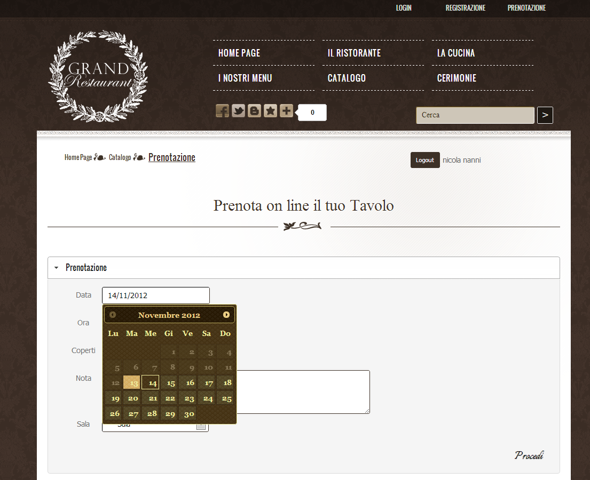

contenente l'elenco di tutte le strutture codificate in Mexal attraverso
l'apposito menu (*Magazzino -- Tabelle Aziendali -- Strutture
Articolo*).

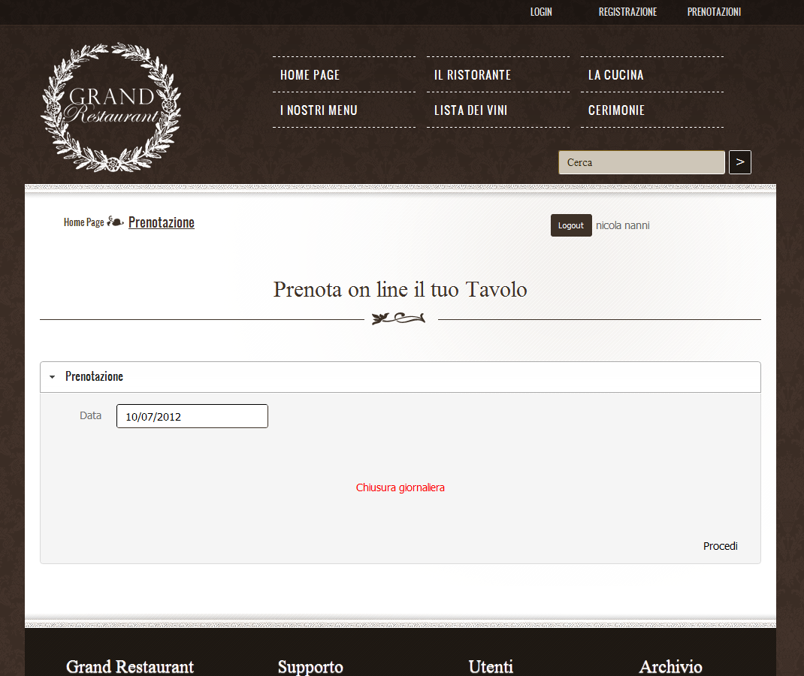

**NOTA BENE:** per maggiori informazioni relativamente alla gestione in
Mexal di articoli strutturati si rimanda allo specifico manuale.

Per ciascuna delle Strutture presenti in elenco è indicato:

- L'identificativo Passweb -- colonna **ID**

- Il codice gestionale -- colonna **Codice**

- La descrizione -- colonna **Descrizione**

- La tipologia di generazione degli elementi (figli di struttura) --
  colonna **Generazione Elementi**

Il campo di ricerca attivabile cliccando sulla lente di ingrandimento,
presente in testata di ogni singola colonna, consente di filtrare i dati
in griglia sulla base dei valori presenti all'interno della colonna
stessa.

Una volta impostato un filtro di ricerca, per poterlo poi eliminare sarà
sufficiente cliccare sull'icona raffigurante una piccola lente di
ingrandimento con un -- all'interno (
 ) che comparirà in testata alla colonna
in corrispondenza della quale è stato impostato il filtro stesso.

Infine è anche possibile ordinare, in maniera crescente e/o decrescente,
gli elementi in griglia cliccando semplicemente sull'icona raffigurante
due piccole frecce posta anch' essa in testata ad ogni singola colonna
della griglia (
 )

Selezionando una delle strutture presenti in elenco, compariranno nella
contestuale barra degli strumenti, dei nuovi pulsanti mediante i quali
poter personalizzare la struttura selezionata, e conseguentemente anche
il configuratore di prodotto disponibile poi sul front end del sito, in
vari modi sia dal punto di vista grafico che dal punto di vista
funzionale.

Per maggiori informazioni relativamente alle diverse possibili opzioni
di configurazione e personalizzazione delle strutture (e
conseguentemente anche del configuratore di prodotto) si vedano i
successivi capitoli di questo manuale.

##### MODIFICA STRUTTURA

Il pulsante **"Modifica Struttura"**
(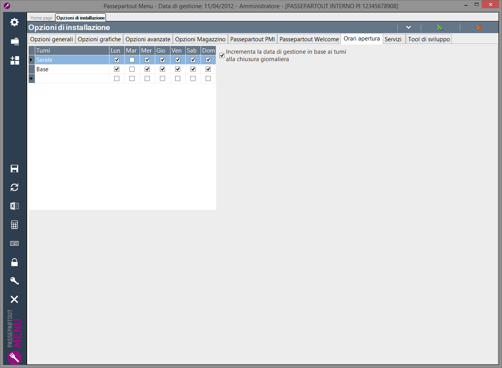 ), presente nella barra degli strumenti
della maschera "**Lista delle Strutture Articolo**" consente di
impostare i principali parametri di configurazione della struttura
selezionata.

Cliccando su questo pulsante verrà visualizzata la maschera "**Modifica
Struttura Articoli**"

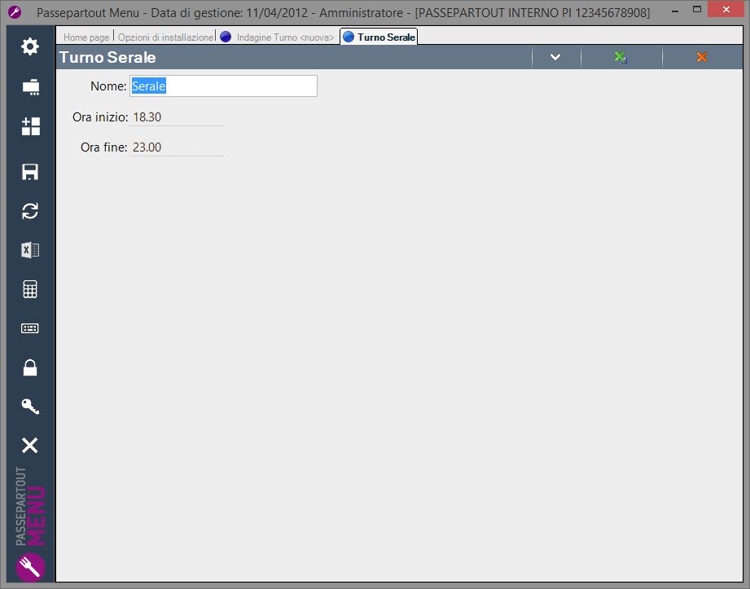

all'interno della quale il campo:

**Numero:** consente di visualizzare il numero identificativo della
struttura in esame all'interno della relativa tabella gestionale

**Descrizione:** consente di visualizzare la descrizione associata lato
gestionale alla struttura in esame

**Abilita Ricerca:** consente, se selezionato, di poter poi attivare e
gestire la ricerca articoli sui singoli campi della struttura

**ATTENZIONE!** per poter attivare e gestire correttamente la ricerca
sui singoli campi di una struttura è indispensabile aver selezionato per
prima cosa il parametro in esame

Nel momento in cui si dovesse infatti attivare la funzionalità di
ricerca sul singolo campo di una struttura senza aver prima attivato la
stessa funzionalità a livello dell'intera struttura, non si otterrà
nessun tipo di risultato.

**ATTENZIONE!** l' effettiva selezione di questo parametro, e la
conseguente attivazione della funzionalità di ricerca per la struttura
in esame, dipende da quelle che sono le impostazioni settate per la
struttura stessa e, conseguentemente, da quelle che saranno poi le
diverse possibili combinazioni di articoli figlio da dover gestire

Nel momento in cui si dovesse decidere di selezionare il parametro
"Abilita Ricerca", al salvataggio della maschera verrà infatti avviato
un controllo per determinare, in relazione a tutte le opzioni settate,
se possa o meno essere effettivamente gestita, per la struttura in
esame, la funzionalità di ricerca senza che questa vada a pregiudicare
eccessivamente le prestazioni del sito.

**Se tale controllo dovesse dare esito negativo verrà visualizzato un
apposito messaggio di errore ("*La ricerca non può essere abilitata
sulla struttura. Il numero di elementi è troppo elevato*") e, di fatto,
per la struttura in esame non sarà possibile abilitare la funzionalità
di ricerca**

**Mostra in catalogo il prezzo dell'articolo padre:** consente, se
selezionato, di visualizzare all'interno dei componenti "Catalogo
E-commerce" e "Offerte/Novità" il prezzo anche per gli articoli padri di
struttura.

Nel caso in cui vengano utilizzati articoli modificatori potrebbe
infatti non essere corretto visualizzare all'interno del catalogo il
prezzo dell'articolo padre in quanto questo non andrebbe comunque a
coincidere con il prezzo che verrebbe poi considerato e visualizzato a
fronte della selezione di una specifica configurazione di prodotto
finito.

**Mostra la disponibilità dell'articolo padre:** permette di decidere se
gli utenti del sito avranno o meno la possibilità di richiedere la
Disponibilità partendo direttamente dall'articolo padre di struttura. E'
possibile selezionare uno dei seguenti valori:

- **No:** in queste condizioni, per articoli padri di struttura, non
  verrà mai visualizzato ne **nel Catalogo E-Commerce** ne tanto meno
  nella relativa **Scheda Prodotto** il componente Disponibilità per cui
  non sarà mai possibile richiedere e/o visualizzare sul sito
  l'effettiva disponibilità di questi articoli.

> In queste stesse condizioni all'interno della Scheda Prodotto degli
> articoli padri di struttura il componente Disponibilità verrà
> visualizzato solo dopo aver completato la configurazione del prodotto
> stesso ed aver così individuato un ben preciso articolo figlio (in
> relazione al quale poter effettivamente visualizzare e/o richiedere la
> relativa Disponibilità).

- **SI:** in queste condizioni sarà possibile visualizzare anche per
  articoli padri di struttura il componente Disponibilità, sia in
  Catalogo che nella Scheda Prodotto (posto ovviamente che tale
  componente sia stato opportunamente inserito) in maniera tale da
  permettere agli utenti di visualizzare e/o richiedere l'effettiva
  disponibilità di questi articoli

> In queste condizioni verrà inoltre visualizzato un ulteriore parametro
> (Totale Disponibilità) mediante il quale poter indicare se dovrà
> essere visualizzata e/o richiesta la sola disponibilità dell'articolo
> padre di struttura oppure la somma della disponibilità relativa al
> padre di struttura più quella di tutti i suoi articoli figlio
> effettivamente esportati e gestiti anche all'interno del sito.

**Totale Disponibilità:** visibile solo nel caso in cui il precedente
parametro (Mostra la Disponibilità dell'articolo padre) sia stato
impostato sul valore SI. Consente di indicare se quella richiesta sugli
articoli padri di struttura dovrà essere esclusivamente la loro
effettiva disponibilità oppure la somma della disponibilità relativa al
padre di struttura più quella di tutti i suoi articoli figlio
effettivamente esportati e gestiti anche all'interno del sito. E'
possibile selezionare uno dei seguenti valori:

- **Solo Totale del Padre:** in questo caso il componente Disponibilità
  gestito sul padre di struttura permetterà di visualizzare e/o
  richiedere l'effettiva disponibilità del solo articolo padre di
  struttura.

- **Totale Padre + Figli:** in questo caso il componente Disponibilità
  gestito sul padre di struttura permetterà invece di visualizzare e/o
  richiedere la somma dell'effettiva disponibilità dell'articolo padre e
  di tutti i suoi figli correttamente esportati e gestiti all'interno
  del sito.

> **ATTENZIONE!** ad ogni variazione del valore impostato per il
> parametro in oggetto verrà avviata una procedura di ricalcolo delle
> disponibilità al termine della quale sarà possibile visualizzare sul
> sito i valori corretti in relazione a quanto impostato all'interno del
> Wizard.

**Formato Elementi Articolo:** consente di impostare il tipo di
informazione che dovrà essere utilizzata per indicare all'utente le
diverse possibili opzioni di scelta offerte dai livelli della struttura
corrispondenti a campi di tipo Variante (si ricorda infatti che
all'interno dei campi di tipo Variante di una struttura possono essere
inseriti unicamente articoli già codificati nelle anagrafiche Mexal). In
questo senso, cliccando sul pulsante "**Aggiungi Segnaposto**", sarà
possibile decidere di utilizzare come etichette identificative delle
diverse possibili opzioni di scelta il "Codice" e/o la "Descrizione"
Mexal dei relativi articoli.

Nel caso in cui il campo in oggetto venga lasciato vuoto come etichette
identificative delle possibili opzioni di scelta verranno utilizzate a
default le descrizioni gestionali dei relativi articoli.

**NOTA BENE:** per i livelli della Cartella Abbinamenti corrispondenti a
campi della struttura di tipo Statistico le etichette identificative
delle possibili scelte che l\'utente avrà a disposizione per la codifica
dell\'articolo, possono essere completamente personalizzate all'interno
dei corrispondenti campi Passweb. In questo caso dunque l'impostazione
del parametro "**Formato Elementi Articolo"** non avrà alcun effetto.

**Tipologia di visualizzazione:** consente di definire come dovrà
comportarsi il configuratore in relazione alle diverse possibili
configurazioni di prodotto finito cui potrà giungere l'utente in fase di
configurazione del prodotto all'interno del sito web.

In questo senso è possibile scegliere tra due diverse possibili opzioni;
impostando il campo **"Tipologia di Visualizzazione"** sul valore:

- **Esploso Completamente:** il configuratore visualizzerà sempre tutti
  i diversi livelli della struttura e in corrispondenza di ciascuno di
  essi verranno proposte tutte le diverse possibili opzioni di scelta
  determinate sulla base dei vari elementi presenti nel corrispondente
  livello della Cartella Abbinamenti Mexal dell\'articolo in esame.

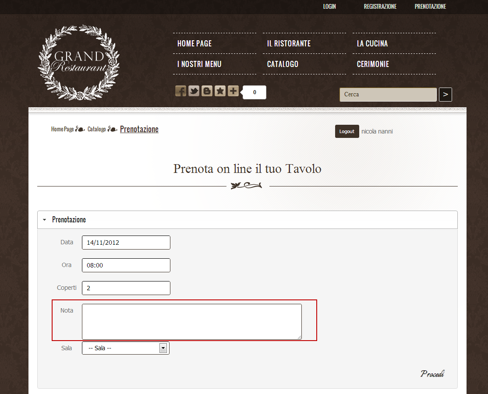

> **ATTENZIONE!** questo tipo di gestione offre all\'utente la
> possibilità di creare e conseguentemente di acquistare un qualsiasi
> articolo figlio ammesso sulla base degli elementi inseriti nei vari
> livelli della Cartella Abbinamenti di Mexal.
>
> Nel caso in cui il prodotto configurato dall\'utente non fosse già
> codificato nelle anagrafiche del gestionale, la codifica del nuovo
> articolo avverrà, in maniera del tutto automatica, contestualmente
> all\'inserimento dell\'ordine in Mexal e con le stesse esatte logiche
> gestionali (determinate in base agli specifici parametri di
> configurazione della struttura Mexal).

- **Vincolante al precedente livello:** inizialmente il configuratore
  visualizzerà solo il primo livello della struttura con le diverse
  possibili opzioni di scelta. Sulla base poi delle scelte effettuate
  dall'utente per questo primo livello della struttura verranno
  visualizzati i restanti campi con i valori ammessi sulla base delle
  indicazioni precedenti

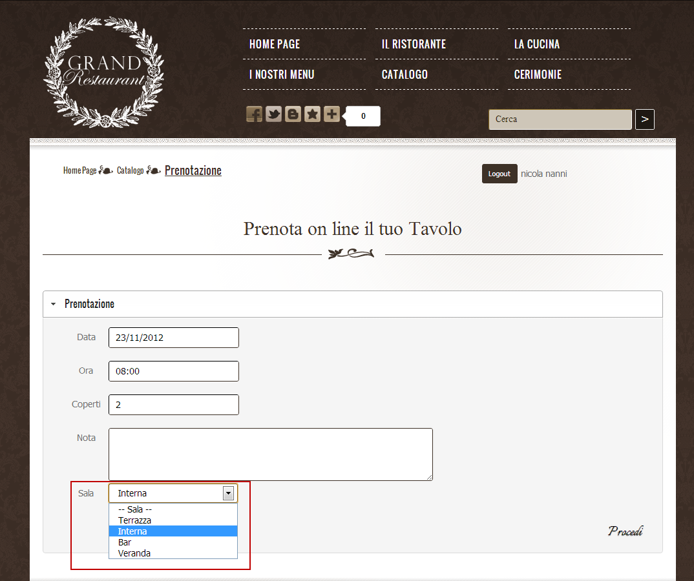

> **ATTENZIONE!** in questo tipo di gestione l\'utente ha la possibilità
> di arrivare a selezionare solamente determinate configurazioni di
> prodotto finito. **Tali configurazioni saranno stabilite sulla base
> degli articoli figli già codificati in Mexal e correttamente esportati
> all'interno del sito web, oppure sulla base di precise impostazioni
> stabilite dall'utente direttamente all'interno di Passweb.**
>
> Selezionando infatti per la Tipologia di Visualizzazione l'opzione
> "Vincolante al precedente livello", comparirà all'interno della
> maschera "Modifica Struttura" precedentemente evidenziata un ulteriore
> campo **"Generazione Elementi"**

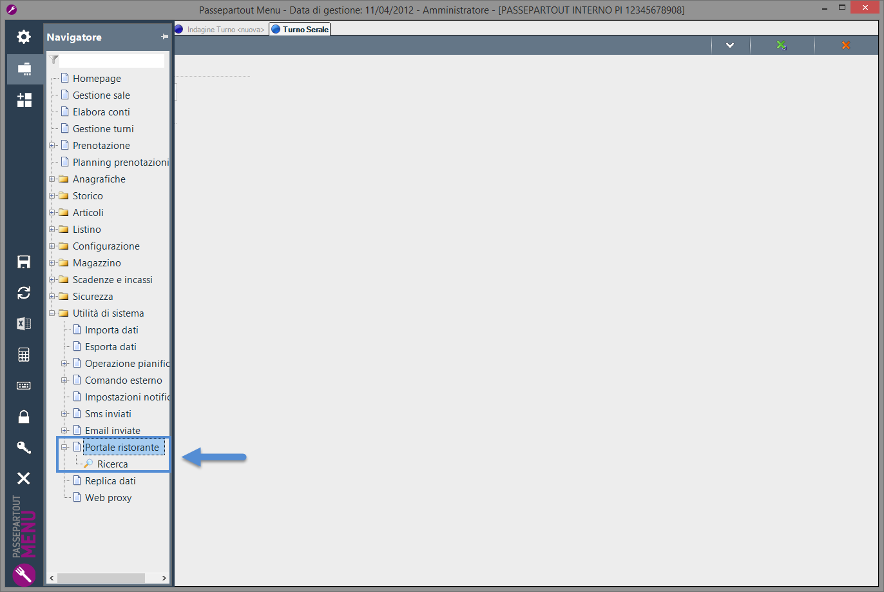

> attraverso il quale poter decidere sulla base di che cosa dovranno
> essere definite le diverse possibili configurazioni di prodotto finito
> cui potrà giungere l'utente.
>
> Le opzioni possibili sono due:

- **Automatico:** le diverse possibili configurazioni di prodotto finto
  a cui l'utente potrà arrivare utilizzando il configuratore, saranno
  determinate sulla base degli articoli figlio già codificati in Mexal e
  correttamente esportati all'interno del sito web. **Ad ogni prodotto
  finto corrisponderà uno specifico articolo già presente nelle
  anagrafiche Mexal e gestito anche sul sito.**

> **E' chiaro quindi che, in queste condizioni, per poter offrire agli
> utenti la possibilità di arrivare a configurarsi almeno un prodotto
> finito dovrà essere codificato in Mexal ed esportato all'interno del
> sito almeno un articolo figlio.**
>
> Nel caso in cui questi articoli figlio non debbano poi essere
> visualizzati, ad esempio, all'interno del catalogo E-commerce, sarà
> necessario ricorrere alla funzionalità Mexal "Visualizza articoli in
> Negozio" (per maggiori informazioni in merito a questa funzionalità
> Mexal si veda anche la sezione *\"Configurazione Gestionale -- Mexal
> Parametri Configurazione Gestionale --Mexal Attivazione Passweb --
> Funzionalità Mexal Articoli -- Visualizzazione Articoli in Negozio\"*
> di questo manuale).

- **Manuale:** le diverse possibili configurazioni di prodotto finto a
  cui l'utente potrà arrivare utilizzando il configuratore, saranno
  determinate sulla base di precise impostazioni stabilite
  dall'amministratore direttamente all'interno di Passweb. Per maggiori
  informazioni in merito si veda anche il successivo capitolo
  ("*Modifica Elementi Manuale*") di questo manuale

**Modalità di Visualizzazione:** consente di impostare la modalità di
visualizzazione grafica che dovrà essere adottata per il configuratore
di prodotti appartenenti alla struttura in esame nel caso in cui a
visitare il sito dovesse essere un utente non autenticato oppure un
utente di tipo "Cliente".

E' possibile selezionare una delle seguenti opzioni:

- **Lineare:** selezionando questa opzione i diversi livelli della
  struttura verranno visualizzati mediante i controlli grafici (Lista,
  Radio, Select) impostati per ogni singolo livello in fase di
  configurazione della struttura stessa.

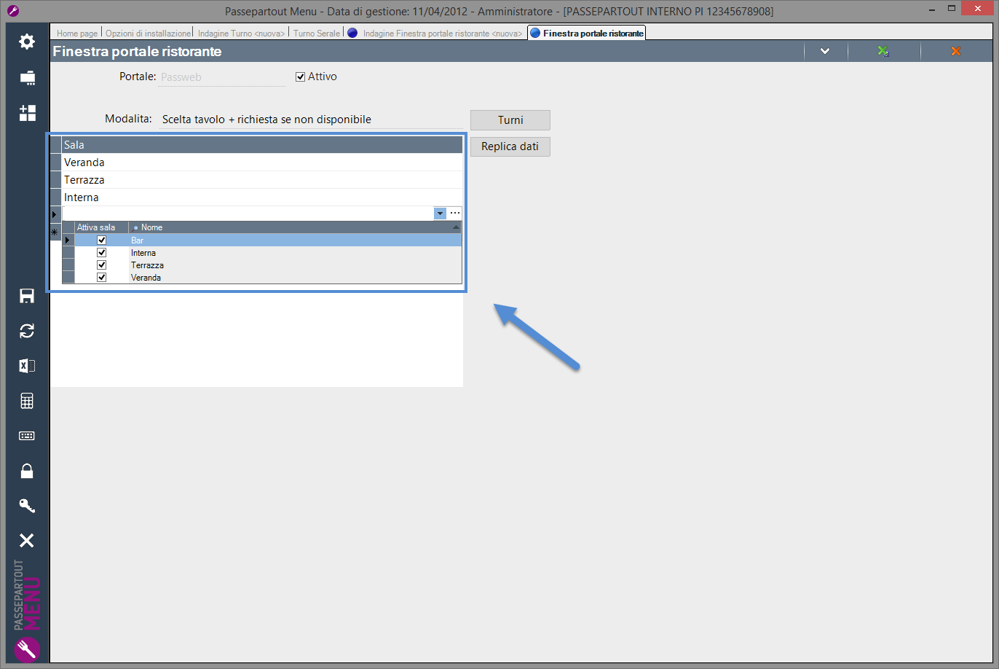

> Per maggiori informazioni in merito si veda anche il successivo
> capitolo "*Modifica Campi Struttura*" di questo manuale
>
> **ATTENZIONE!** La modalità di visualizzazione Lineare è quella
> adottata a default per ogni Configuratore di prodotto

- **Tabella Esplosa:** selezionando questa opzione sarà poi possibile
  decidere di visualizzare l'ultimo o gli ultimi due livelli di
  selezione all'interno di una tabella esplosa con in riga tutte le
  diverse possibili combinazioni del prodotto in esame (combinazioni
  queste che dipenderanno, ovviamente, dal fatto di aver impostato il
  parametro "Tipologia di Visualizzazione" sul valore "Esploso
  Completamente" o "Vincolante al precedente livello").

> In queste condizioni verrà infatti visualizzato un ulteriore parametro
> "**Livelli Tabella**" mediante il quale poter decidere se la tabella
> in questione dovrà essere esplosa considerando gli ultimi due livelli
> di selezione oppure solamente l'ultimo
>
> **[TABELLA ESPLOSA SULLA BASE DEGLI ULTIMI DUE LIVELLI DI
> SELEZIONE]{.underline}** (**Livelli Tabella = Due)**
>
> In queste condizioni la tabella verrà esplosa considerando gli ultimi
> due livelli della struttura oppure l'ultimo livello più la
> Taglia/Colore del prodotto (nel caso in cui ovviamente l'articolo
> strutturato sia gestito anche mediante la tabella Taglie/Colori di
> Mexal).

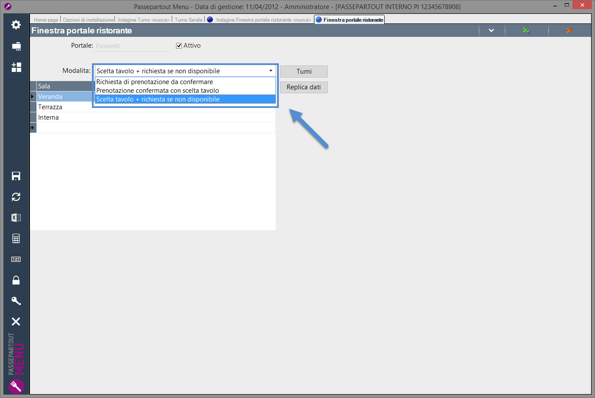

> Nelle prime due colonne della tabella verranno quindi inseriti i
> possibili valori degli ultimi due livelli della struttura o, nel caso
> di articoli a Taglie/Colori, i possibili valori dell'ultimo livello
> della struttura e le Taglie/Colori del prodotto stesso.
>
> Nella terza colonna verranno invece mostrati i dati del relativo
> articolo figlio, dati questi che dipenderanno esattamente da quelli
> che sono gli elementi inseriti all'interno del componente
> "Configuratore" in fase di creazione della Scheda Prodotto.
>
> Supponendo dunque di gestire un articolo strutturato a taglie per il
> quale l'ultimo livello della struttura definisce la selezione del
> colore (Bianco o Rosso) e supponendo anche che le uniche taglie
> ammesse per l'articolo in esame siano la taglia S e la taglia M, la
> tabella che otterremo sarà esattamente di questo tipo:

  --------------------------------------------------------------------
        **COLORE**          **TAGLIA**     **DATI ARTICOLO FIGLIO**
  ---------------------- ----------------- ---------------------------
          Bianco                 S         Dati articolo Bianco Taglia
                                           S (es. Codice, Descrizione,
                                           Categoria Merceologica)

          Bianco                 M         Dati articolo Bianco Taglia
                                           M (es. Codice, Descrizione,
                                           Categoria Merceologica)

          Rosso                  S         Dati articolo Rosso Taglia
                                           S (es. Codice, Descrizione,
                                           Categoria Merceologica)

          Rosso                  M         Dati articolo Rosso Taglia
                                           M (es. Codice, Descrizione,
                                           Categoria Merceologica)
  --------------------------------------------------------------------

> **[TABELLA ESPLOSA SULLA BASE DELL'ULTIMO LIVELLO DI
> SELEZIONE]{.underline}** (**Livelli Tabella = Uno)**
>
> In queste condizioni la tabella verrà esplosa considerando solamente
> l'ultimo livello della struttura o, in alternativa, le sole
> Taglie/Colori del prodotto (questo ovviamente nel momento in cui
> l'articolo strutturato dovesse essere gestito anche mediante la
> tabella Taglie/Colori di Mexal).

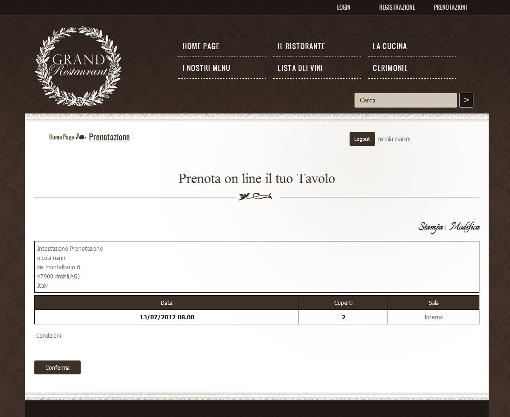

> Nelle prima colonna della tabella verranno quindi inseriti i possibili
> valori dell' ultimo livello della struttura o, nel caso di articoli a
> Taglie/Colori, le Taglie/Colori del prodotto stesso.
>
> Nella seconda colonna verranno invece mostrati i dati del relativo
> articolo figlio, dati questi che dipenderanno, anche questa volta, da
> quelli che sono gli elementi inseriti all'interno del componente
> "Configuratore" in fase di creazione della Scheda Prodotto.
>
> Facendo dunque riferimento all'esempio precedentemente considerato, in
> queste condizioni dovremo selezionare, innanzitutto, il colore del
> prodotto e solo a questo punto verrà effettivamente esplosa la tabella
> che, nel momento in cui dovessimo aver indicato il colore Bianco
> conterrà, ovviamente, le sole opzioni relative alle taglie disponibili
> per il colore Bianco del prodotto in questione

  ----------------------------------------------------------------
     **TAGLIA**     **DATI ARTICOLO FIGLIO**
  ----------------- ----------------------------------------------
          S         Dati articolo Bianco Taglia S (es. Codice,
                    Descrizione, Categoria Merceologica)

          M         Dati articolo Bianco Taglia M (es. Codice,
                    Descrizione, Categoria Merceologica)
  ----------------------------------------------------------------

- **Tabella Esplosa Divisa:** selezionando questa opzione sarà poi
  possibile, come nel caso precedente, decidere di visualizzare l'ultimo
  o gli ultimi due livelli di selezione all'interno di una tabella
  esplosa con in riga tutte le diverse possibili combinazioni del
  prodotto in esame. A differenza del caso precedente però, i dati degli
  articoli figli non saranno più raggruppati all'interno di un' unica
  colonna ma saranno inseriti in colonne distinte la cui intestazione
  coinciderà esattamente con la label dello specifico componente
  inserito all'interno del componente "Configuratore" in fase di
  creazione della Scheda Prodotto.

> Anche in questo caso dunque il parametro "**Livelli Tabella**"
> permetterà di decidere se la tabella in questione dovrà essere esplosa
> considerando gli ultimi due livelli di selezione oppure solamente
> l'ultimo
>
> **[TABELLA ESPLOSA SULLA BASE DEGLI ULTIMI DUE LIVELLI DI
> SELEZIONE]{.underline}** (**Livelli Tabella = Due)**
>
> In queste condizioni la tabella verrà esplosa considerando gli ultimi
> due livelli della struttura oppure l'ultimo livello più la
> Taglia/Colore del prodotto (nel caso in cui ovviamente l'articolo
> strutturato sia gestito anche mediante la tabella Taglie/Colori di
> Mexal).

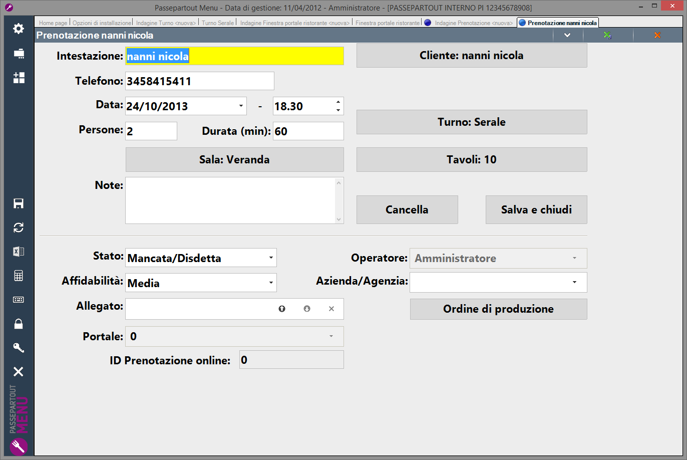

> I dati degli articoli figli, come detto, non saranno più raggruppati
> all'interno di un\'unica colonna ma saranno inseriti in colonne
> distinte
>
> Facendo riferimento quindi allo stesso esempio indicato al punto
> precedente la tabella che otterremo in questo caso sarà esattamente di
> questo tipo:

  -------------------------------------------------------------------------------------
   **COLORE**    **TAGLIA**  **CODICE**         **DESCRIZIONE**   **CAT.MERCEOLOGIA**
  ------------- ------------ ------------------ ----------------- ---------------------
     Bianco          S       Codice articolo    Descrizione       Cat.Merceologica
                             Bianco Taglia S    articolo Bianco   articolo Bianco
                                                Taglia S          Taglia S

     Bianco          M       Codice articolo    Descrizione       Cat.Merceologica
                             Bianco Taglia M    articolo Bianco   articolo Bianco
                                                Taglia M          Taglia M

      Rosso          S       Codice articolo    Descrizione       Cat.Merceologica
                             Rosso Taglia S     articolo Rosso    articolo Rosso Taglia
                                                Taglia S          S

      Rosso          M       Codice articolo    Descrizione       Cat.Merceologica
                             Rosso Taglia M     articolo Rosso    articolo Rosso Taglia
                                                Taglia M          M
  -------------------------------------------------------------------------------------

> **[TABELLA ESPLOSA SULLA BASE DELL'ULTIMO LIVELLO DI
> SELEZIONE]{.underline}** (**Livelli Tabella = Uno)**
>
> In queste condizioni la tabella verrà esplosa considerando solamente
> l'ultimo livello della struttura o, in alternativa, le sole
> Taglie/Colori del prodotto (questo ovviamente nel momento in cui
> l'articolo strutturato dovesse essere gestito anche mediante la
> tabella Taglie/Colori di Mexal).

> Facendo dunque riferimento all'esempio precedentemente considerato, in
> queste condizioni dovremo selezionare, innanzitutto, il colore del
> prodotto e solo a questo punto verrà effettivamente esplosa la tabella
> che, nel momento in cui dovessimo aver indicato il colore Bianco
> conterrà, ovviamente, le sole opzioni relative alle taglie disponibili
> per il colore Bianco del prodotto in questione
>
> Facendo riferimento quindi allo stesso esempio indicato al punto
> precedente la tabella che otterremo in questo caso sarà esattamente di
> questo tipo:

  ------------------------------------------------------------------------
   **TAGLIA**  **CODICE**       **DESCRIZIONE**    **CAT.MERCEOLOGIA**
  ------------ ---------------- ------------------ -----------------------
       S       Codice articolo  Descrizione        Cat.Merceologica
               Bianco Taglia S  articolo Bianco    articolo Bianco Taglia
                                Taglia S           S

       M       Codice articolo  Descrizione        Cat.Merceologica
               Bianco Taglia M  articolo Bianco    articolo Bianco Taglia
                                Taglia M           M
  ------------------------------------------------------------------------

- **Tabella Matrice:** selezionando questa opzione gli ultimi due
  livelli della struttura oppure l'ultimo livello più la Taglia/Colore
  del prodotto (nel caso in cui ovviamente l'articolo strutturato in
  esame sia gestito mediante la tabella Taglie/Colori di Mexal) verranno
  visualizzati all'interno di una tabella matriciale che ha in riga un
  livello della struttura e in colonna l'ultimo livello della struttura
  o l'elenco delle Taglie/Colori gestite per il prodotto in esame

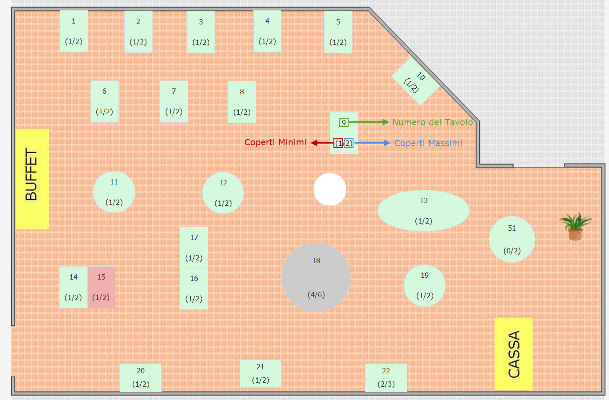

> In queste condizioni ogni cella della tabella, determinata
> dall'incrocio riga/colonna, individuerà un possibile articolo figlio i
> cui dati saranno quindi inseriti all'interno della cella stessa.
>
> Anche in questo caso le possibili combinazioni di articoli figli
> dipenderanno, ovviamente, dal fatto di aver impostato il parametro
> "Tipologia di Visualizzazione" sul valore "Esploso Completamente" o
> "Vincolante al precedente livello"
>
> Facendo riferimento ancora una volta allo stesso esempio indicato al
> punto precedente la tabella che otterremo nelle condizioni in esame
> sarà esattamente di questo tipo

  --------------------------------------------------------------------
      **COLORE**              **S**                    **M**
  ------------------ ----------------------- -------------------------
        Bianco        Dati articolo Bianco     Dati articolo Bianco
                      Taglia S (es. Codice,    Taglia M (es. Codice,
                     Descrizione, Categoria   Descrizione, Categoria
                          Merceologica)            Merceologica)

        Rosso          Dati articolo Rosso      Dati articolo Rosso
                      Taglia S (es. Codice,    Taglia M (es. Codice,
                     Descrizione, Categoria   Descrizione, Categoria
                          Merceologica)            Merceologica)
  --------------------------------------------------------------------

**Modalità di Visualizzazione Agente (solo Ecommerce Mexal):** consente
di impostare la modalità di visualizzazione grafica che dovrà essere
adottata per il configuratore di prodotti appartenenti alla struttura in
esame nel caso in cui a visitare il sito dovesse essere un utente di
tipo "Agente".

Anche in questo caso è possibile selezionare una delle seguenti opzioni:

- **Lineare**

- **Tabella Esplosa** (sulla base dell'ultimo o degli ultimi due livelli
  di selezione)

- **Tabella Esplosa Divisa** (sulla base dell'ultimo o degli ultimi due
  livelli di selezione)

- **Tabella Matrice**

**ATTENZIONE!** Relativamente alle modalità di visualizzazione tabellare
appena analizzate (Tabella Esplosa, Tabella Esplosa Divisa e Tabella
Matrice) vanno evidenziate poi alcune cose di fondamentale importanza.
Nello specifico:

- Nel caso in cui la struttura su cui si sta operando sia ad un solo
  livello e gli articoli di tale struttura NON siano gestiti a
  Taglie/Colori (mediante cioè la relativa Tabella Mexal),
  indipendentemente dal fatto di aver impostato il parametro "Modalità
  di Visualizzazione" sul valore Tabella Esplosa, Tabella Esplosa Divisa
  o Tabella Matrice verrà comunque mostrata, per ovvie ragioni, sempre e
  soltanto la Tabella Esplosa

- Le modalità di visualizzazione tabellare offrono all'utente la
  possibilità di inserire in carrello in un colpo solo diversi articoli
  figli e/o diverse taglie/colori dello stesso articolo. In questo senso
  va sottolineato che, ovviamente, verranno inseriti in carrello solo ed
  esclusivamente quegli articoli per i quali è stata indicata una
  quantità maggiore di zero.

> Inoltre nel momento in cui uno o più articoli per i quali è stata
> impostata una quantità maggiore di zero non possano, per determinate
> ragioni, essere inseriti in carrello, dopo aver cliccato sul pulsante
> di Aggiunta verrà visualizzato un apposito messaggio di errore e
> nessuno degli articoli indicati verrà messo in carrello.
>
> Infine la modalità di inserimento in carrello dei vari articoli figli
> dipenderà chiaramente da come è stato impostato il parametro
> "**Gestione articoli in carrello/wishlist**" presente nella maschera
> "*Configurazione Parametri Catalogo*" del Wizard

- La grafica tabellare è gestita solo sulle pagine prodotto. Nel caso in
  cui l'articolo strutturato sia inserito dunque all'interno di un
  campionario o di un composto configurabile, per esso verrà utilizzata
  sempre e soltanto la visualizzazione lineare

- Nel caso in cui il penultimo livello della struttura in esame sia la
  radice di una struttura annidata non verrà gestita la grafica
  tabellare. Anche in queste condizioni quindi verrà utilizzata sempre e
  soltanto la visualizzazione lineare

- Il configuratore tabellare verrà visualizzato anche all'interno del
  componente "Autocompletamento" che può essere inserito all'interno del
  "Carrello Custom". In questo caso però all'interno delle varie celle
  verrà visualizzato solo ed esclusivamente il campo di input per
  indicare la quantità che si desidera acquistare per il relativo
  elemento.

> Per maggiori informazioni in merito si veda anche il corrispondente
> capitolo di questo manuale ("*Lista Componenti Ecommerce -- Componenti
> Interni ai Componenti Ecommerce -- Autocompletamento*")

- Le modalità di visualizzazione con grafica tabellare possono essere
  più o meno onerose (portando dunque a tempi di caricamento della
  pagina più o meno elevati) dipendentemente dal numero complessivo
  delle possibili combinazioni di articoli figli (e conseguentemente
  dalle effettive dimensioni della tabella che si dovrà andare a
  disegnare all'interno della pagina web).

Per maggiori informazioni relativamente alla gestione del componente
"Configuratore" e degli articoli strutturati all'interno di Passweb, si
veda anche la sezione *"Lista Componenti E-Commerce -- Componente
Configuratore"* di questo manuale.

**SEO -- Canonical:** consente di impostare la gestione dell'attributo
"**rel=canonical**" relativamente alle pagine prodotto di articoli
figlio appartenenti alla struttura in esame. E' possibile selezionare
uno dei seguenti valori:

- **Figlio** (opzione di default): in queste condizioni nelle pagine
  prodotto di articoli figlio appartenenti alla struttura in esame
  l'attributo rel=canonical sarà valorizzato con l'indirizzo della
  pagina prodotto del figlio stesso

- **Padre**: in queste condizioni nelle pagine prodotto di articoli
  figlio appartenenti alla struttura in esame l'attributo rel=canonical
  sarà valorizzato con l'indirizzo della pagina dell'articolo padre in
  modo da evitare l'indicizzazione dei relativi figli con conseguenti
  possibili problemi a livello contenuti duplicati

##### MODIFICA CAMPI STRUTTURA

Il pulsante "**Modifica Campi Struttura**"
(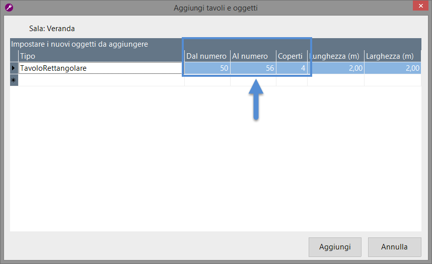 ) presente nella barra degli strumenti
della maschera "**Lista delle Strutture Articolo**" una vota selezionata
una delle strutture presenti in elenco, consente di accedere alla
maschera "**Modifica Campi della Struttura**"

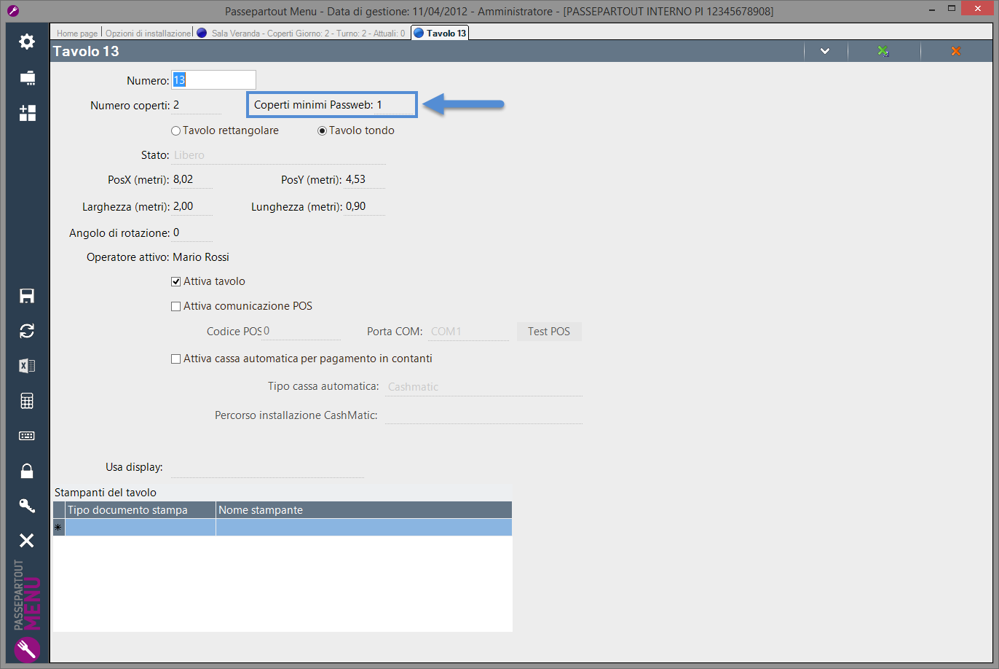

all'interno della quale poter configurare ogni singolo livello.

Nello specifico infatti per ogni singolo livello gestito dalla struttura
in esame sarà possibile impostare un valore per i seguenti parametri:

**Tipologia di Controllo**: consente di impostare il tipo di controllo
web che dovrà essere utilizzato, in corrispondenza del relativo livello
di selezione del configuratore. È possibile selezionare una delle
seguenti opzioni

- **Lista:** in questo caso le diverse possibili opzioni di scelta
  verranno stampate tutte all'interno della pagina web in un'apposita
  lista

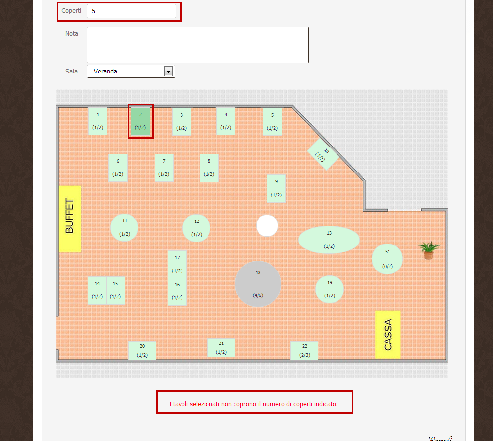

> In queste condizioni l'utente dovrà quindi selezionare, cliccandoci
> sopra, l'opzione desiderata tra quelle presenti in elenco

- **Radio:** in questo caso le diverse possibili opzioni di scelta
  verranno inserite all'interno di controlli di tipo Radio Button

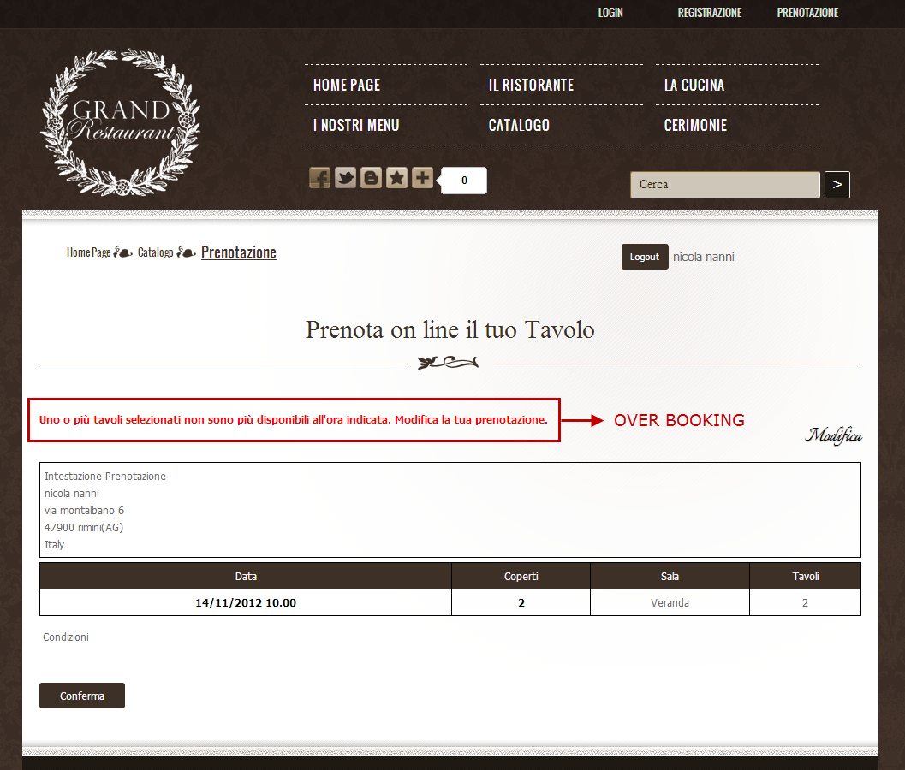

> Anche in questo caso sarà quindi sufficiente selezionare l'opzione
> desiderata semplicemente cliccandoci sopra

- **Select:** in questo caso l'utente potrà scegliere una delle diverse
  possibili opzioni semplicemente selezionandola tra quelle presenti
  all'interno di un apposito menu a tendina

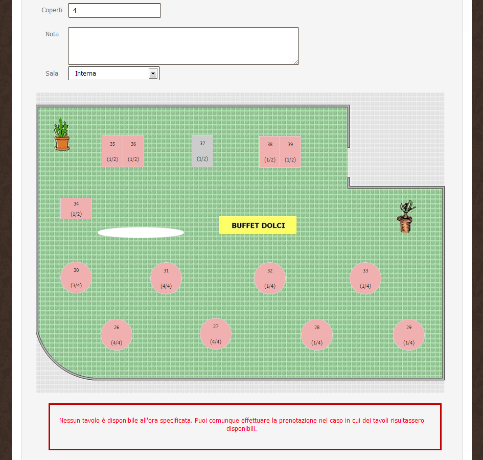

**Abilita Ricerca:** consente di decidere se abilitare o meno la ricerca
articoli in relazione alle opzioni presenti nel corrispondente livello
della struttura

**ATTENZIONE!** il parametro in questione ha effetto solo ed
esclusivamente nel momento in cui sia stata correttamente abilitata la
ricerca a livello dell'intera struttura (campo "**Abilita Ricerca**"
nella maschera "**Modifica Struttura Articoli**")

Per maggiori informazioni relativamente a come poter attivare e gestire
la ricerca articoli sulla base delle opzioni disponibili per un
determinato campo di una struttura si veda anche quanto indicato nel
successivo capitolo "*Ricerca Articoli su campi struttura*" di questo
manuale

**Tipologia Livello**: consente di marcare, eventualmente, il livello in
esame come livello utilizzato per gestire le taglie o i colori. È
possibile selezionare una delle seguenti opzioni:

- **Nessuna**: selezionando questa opzione il livello in esame non verrà
  marcato in alcun modo (opzione da selezionare nel momento in cui il
  livello in esame dovesse gestire dati diversi sia dalla taglia che dal
  colore)

- **Taglia**: consente di marcare il livello in esame come livello di
  gestione delle taglie

- **Colore**: consente di marcare il livello in esame come livello di
  gestione dei colori

**ATTENZIONE!** il fatto di marcare un determinato livello come livello
di gestione delle taglie o dei colori **è di fondamentale importanza nel
momento in cui si dovesse poi decidere di gestire i dati strutturati
presenti nelle pagine prodotto del proprio sito mediante Json-ld** (in
questo caso ovviamente il livello taglia o colore dovrà essere l'ultimo
livello della struttura)

Per maggiori informazioni in merito alla gestione dei dati strutturati
in formato Json-ld si rimanda a quanto indicato all'interno del relativo
capitolo di questo manuale ("*Dati Strutturati -- Json-ld -- Json-ld per
articoli a taglie/colori*")

**Testo**: consente di personalizzare, in tutte le lingue gestite
all'interno del sito, l'etichetta identificativa del corrispondente
livello della struttura.

Le etichette identificative dei vari livelli della struttura sono quelle
etichette che verranno poi utilizzate all'interno del componente
"**Configuratore**" per identificare i diversi possibili livelli di
selezione.

##### MODIFICA ELEMENTI STRUTTURA

Il pulsante **"Modifica Elementi Struttura"**
( ) presente nella barra degli strumenti
della maschera "**Lista delle Strutture Articolo"** consente di accedere
alla sezione **"Campi Struttura"** contenente l'elenco di tutti i campi
della struttura attualmente selezionata

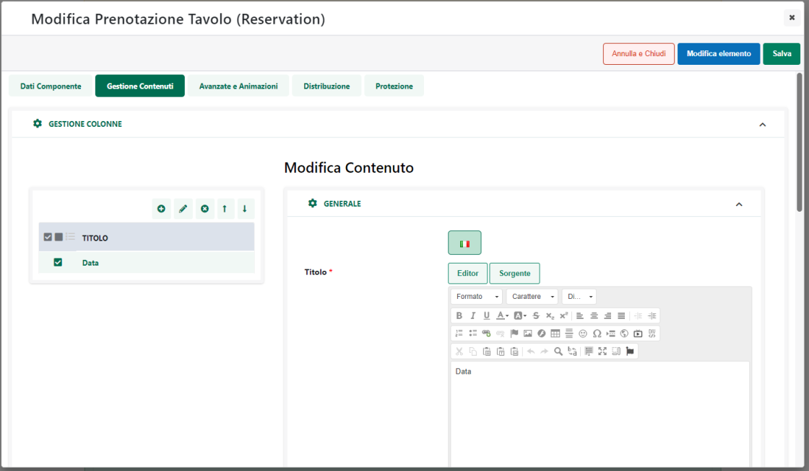

**ATTENZIONE!** all'interno di questa maschera sono visualizzati
solamente i campi strettamente appartenenti alla struttura in esame e
non quelli di eventuali strutture annidate

Selezionando uno dei campi presenti in elenco, compariranno, nella
contestuale barra degli strumenti altri tre pulsanti **Modifica Elementi
Campo, Importa File, Esporta** che consentono rispettivamente di:

**Modifica Elementi Campo**
(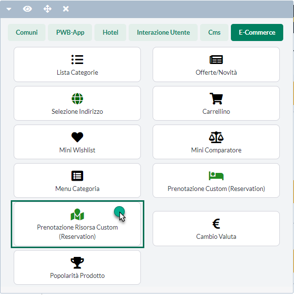 ): consente di accedere alla maschera
"**Modifica Elementi Campo Struttura**"

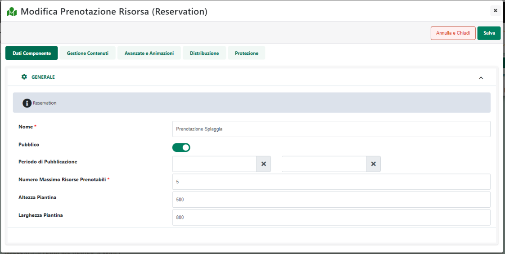

maschera questa all'interno della quale è possibile personalizzare il
contenuto e il posizionamento delle diverse possibili opzioni di scelta
che l'utente avrà a disposizione, nel configuratore, relativamente al
livello di selezione corrispondente al campo in esame.

Il parametro "**Lingua**" presente nella parte alta della maschera
consente di impostare, selezionandola dal relativo menu a tendina, la
lingua in cui effettuare tutte le modifiche del caso.

Le diverse possibili opzioni di scelta sono indicate invece all'interno
della sezione "**Elementi Campo Struttura**" e, relativamente alla
personalizzazione di tali opzioni, è possibile:

- Personalizzare **l'etichetta identificativa della corrispondente
  opzione di scelta** agendo per questo sul campo evidenziato in figura
  (campo "**Titolo**")

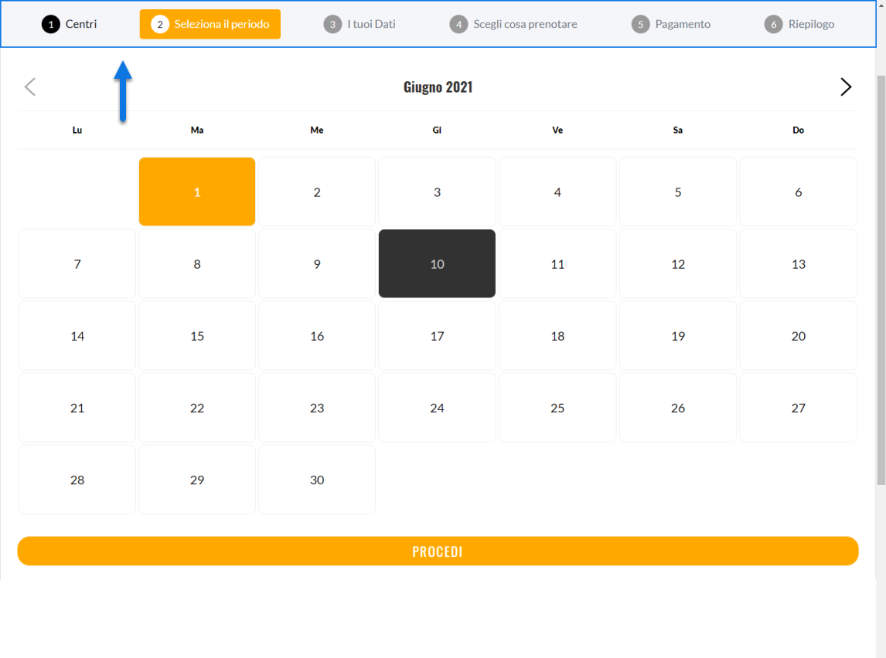

> In questo senso è bene sottolineare anche che, **a default, queste
> etichette corrispondono ai valori definiti nella Cartella Abbinamenti
> Mexal associata agli "articoli padre" della struttura in esame**.

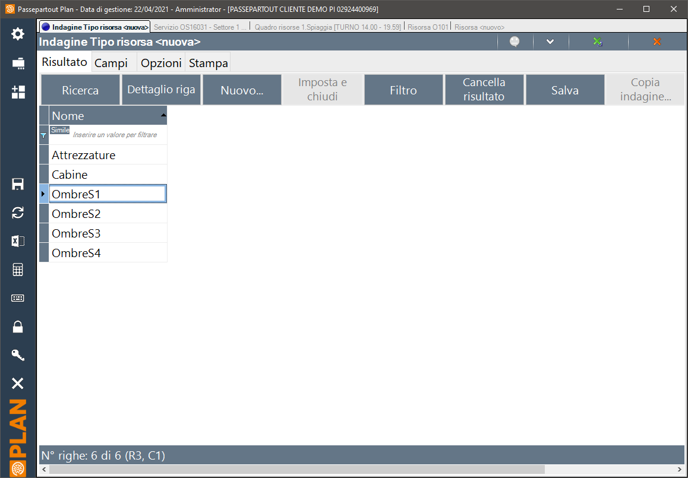

> Facendo quindi riferimento all'esempio riportato in figura, in
> relazione alle opzioni di scelta evidenziate, l'utente sul front end
> del sito si troverebbe, a default, a poter sceglier tra GRI, ROS e
> GIA.
>
> Se l'esigenza dovesse invece essere quella di fornire all'utente, in
> relazione alle diverse opzioni di scelta, delle etichette più
> comprensibili (rispetto a quelli che possono essere dei semplici
> codici gestionali) come ad esempio Grigio, Rosso e Giallo allora sarà
> necessario agire direttamente sul Wizard di Passweb operando, per
> l'appunto, dalla maschera "Modifica Elementi Campo Struttura" e
> facendo corrispondere, ad esempio, al codice GRI l'etichetta "Grigio"
>
> **ATTENZIONE!** **l'etichetta identificativa della corrispondente
> opzione di scelta può essere personalizzata all'interno di Passweb
> solo se tali opzioni fanno riferimento a campi della Struttura di tipo
> Statistico**
>
> Nel caso in cui le opzioni di scelta dovessero invece fare riferimento
> a campi della Struttura di tipo Variante, allora, per forza di cose,
> la personalizzazione delle etichette dovrà avvenire direttamente
> all'interno del gestionale. Si ricorda infatti che all'interno dei
> campi di tipo Variante di una struttura possono essere inseriti
> unicamente articoli già codificati all'interno dell'anagrafiche
> gestionali e, in queste condizioni, le etichette delle opzioni di
> scelta corrispondono alle descrizioni dei relativi articoli
>
> **ATTENZIONE!** In queste condizioni è ovviamente necessario che gli
> articoli di tipo Variante siano correttamente esportati e gestiti
> anche all'interno del sito

- Associare all'opzione in esame uno specifico **colore** agendo per
  questo mediante il color picker messo a disposizione dal campo
  evidenziato in figura (campo "**Colore**")

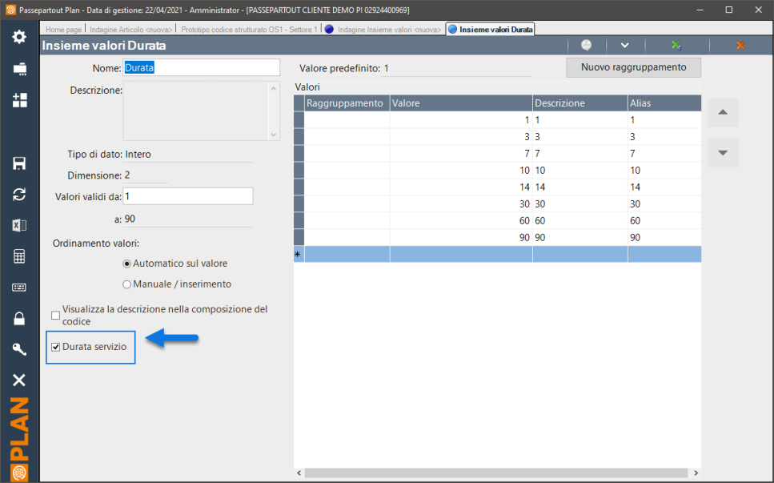

> Ovviamente il campo in esame non è obbligatorio ma si rivelerà
> particolarmente utile nel momento in cui il livello di selezione della
> struttura dovesse riguardare dei colori. In questo caso infatti viene
> offerta all'utente la possibilità di rappresentare graficamente tali
> colori indicando semplicemente il loro codice esadecimale o rgb senza,
> in ogni caso, dover gestire questi elementi mediante specifiche
> immagini.
>
> **ATTENZIONE!** il colore associato ad un'opzione di scelta non è
> multilingua per cui sarà esattamente lo stesso per tutte le lingue
> gestite all'interno del sito
>
> **ATTENZIONE!** solo per **Varianti Responsive** e solo per **Filtri
> Indice, Filtri Lista o Filtri Checkbox** i colori indicati, per le
> singole opzioni, in corrispondenza di questo campo saranno poi anche
> quelli che verranno mostrati sul front end del sito all'interno di
> eventuali campi di ricerca impostati per filtrare sul corrispondente
> livello della struttura in esame
>
> Per maggiori informazioni relativamente a come poter attivare e
> gestire la ricerca articoli sulla base delle opzioni disponibili per
> un determinato campo di una struttura si veda anche quanto indicato
> nel successivo capitolo "*Ricerca Articoli su campi struttura*" di
> questo manuale

- Associare all'opzione in esame **una specifica immagine** cliccando
  per questo sul pulsante "**Seleziona la Risorsa**" presente in
  corrispondenza del campo "**Immagine**" o "**Immagine Background**"

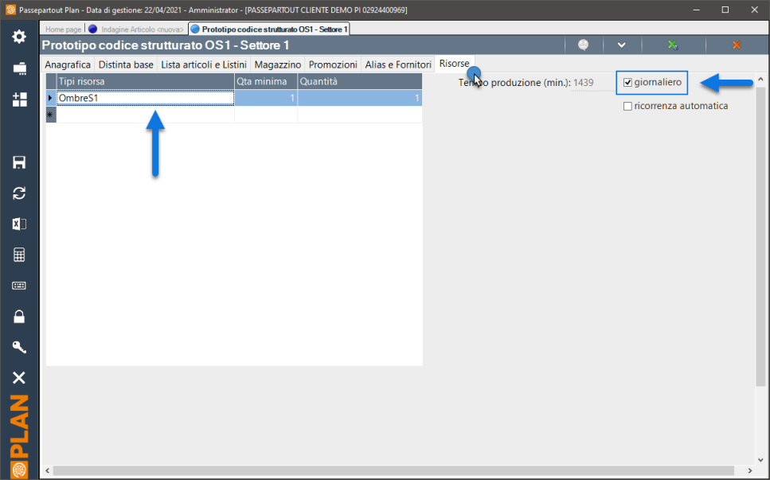

> In questo senso è bene sottolineare anche che nel caso in cui si
> dovesse decidere di associare una determinata immagine all'opzione in
> esame mediante il parametro "**Immagine**" la relativa risorsa verrà
> poi gestita mediante l'inserimento, nel codice HTML della pagina, di
> un apposito tag img.
>
> Nel momento in cui si dovesse invece decidere di utilizzare il
> parametro "**Immagine Background**" la relativa risorsa verrà gestita
> come immagine di background di un apposito tag div.
>
> In sostanza dunque se le immagini da associare ad una determinata
> opzione di scelta dovessero avere dimensioni differenti risulterebbe
> difficile gestirle come immagini di background per cui, in queste
> condizioni, sarebbe sicuramente più opportuno utilizzare il parametro
> "Immagine".
>
> Nel caso in cui invece le immagini da associare dovessero avere tutte
> la stessa dimensione (es. gestione in struttura di un livello "colore"
> non rappresentabile in rgb) potrebbe essere più semplice utilizzare il
> parametro "Immagine Background"
>
> **In ogni caso i campi "Colore", "Immagine" e "Immagine Background"
> sono campi alternativi uno all'altro** e sarebbe quindi opportuno
> utilizzarne uno soltanto.
>
> Nel caso in cui si dovesse decidere, per una qualsiasi ragione, di
> valorizzare contemporaneamente due o più di questi campi, sul front
> end del sito ne verrà comunque visualizzato soltanto uno definito
> dalla seguente regola di priorità:

- Se è stato valorizzato il campo "Immagine" questo avrà priorità su
  tutto il resto e verrà quindi utilizzato e visualizzato sul front end
  indipendentemente dal fatto di aver impostato o meno dei valori anche
  per gli altri parametri (Immagine Background e Colore)

- Se sono stati valorizzati il campo "Immagine Background" e "Colore",
  l'Immagine avrà sempre priorità e sarà quindi questa ad essere
  utilizzata e visualizzata sul front end del sito

> In definitiva, se l'esigenza dovesse essere quella di utilizzare sul
> front end del sito il "Colore" sarà necessario accertarsi di non aver
> impostato nulla ne per il campo Immagine ne tanto meno per il campo
> Immagine Background
>
> **ATTENZIONE!** Così come il Colore anche i parametri "Immagine" e
> "Immagine Background" non sono multilingua per cui l'immagine indicata
> sarà esattamente la stessa per tutte le lingue gestite all'interno del
> sito

- Associare all'opzione in esame una **descrizione estesa**, inserendo
  tale descrizione all'interno della text area evidenziata in figura
  (campo "**Testo**")

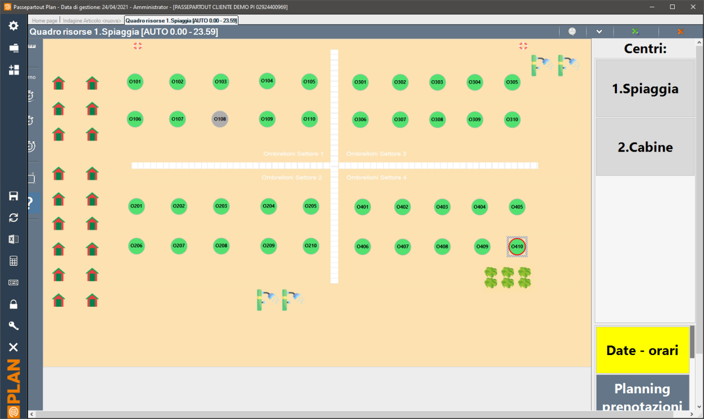

- Definire per l'opzione in esame la **posizione** che dovrà assumere,
  sul front end del sito, all'interno dell'elenco di selezione delle
  diverse possibili opzioni di scelta (campo "**Posizione**")

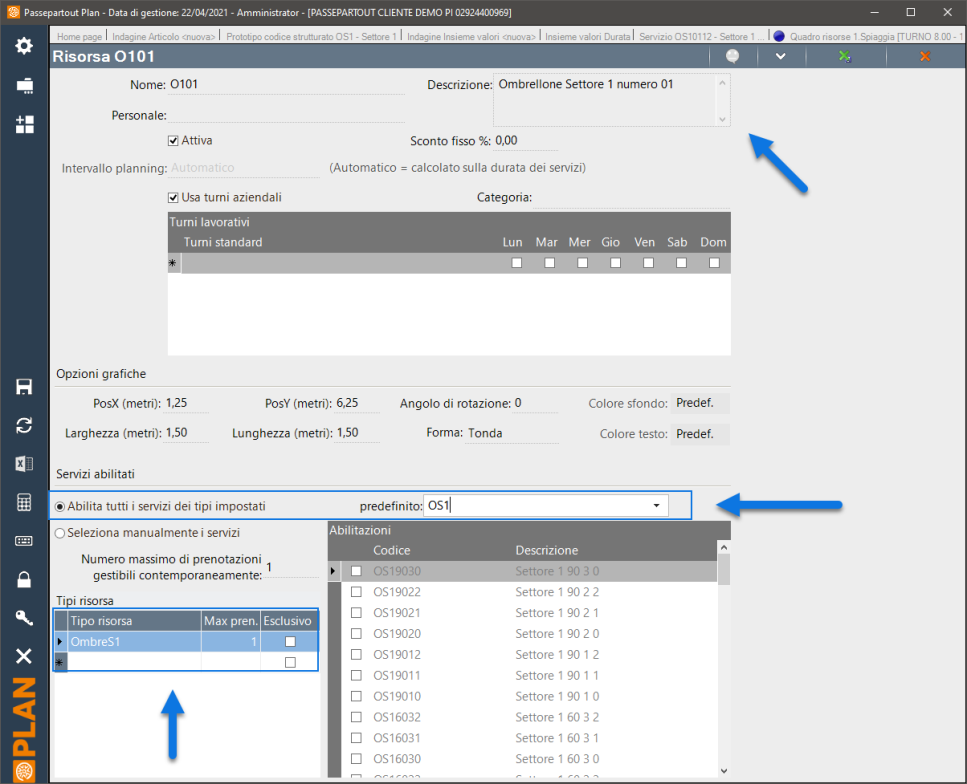

> Agendo sul campo "Posizione" è quindi possibile definire, per le
> opzioni di scelta visualizzate sul front end del sito, un ordinamento
> personalizzato.
>
> **ATTENZIONE!** Il campo Posizione accetta solo valori numerici e
> **consente di ordinare l'elenco delle diverse possibili opzioni di
> scelta in maniera** **crescente**
>
> In considerazione di ciò è bene sottolineare anche che:

- Valorizzando il campo "Posizione" per tutte le opzioni, queste
  verranno poi ordinate, sul front end del sito in maniera crescente

- Nel caso in cui dovesse essere indicato un valore per il campo
  "Posizione" solo in corrispondenza di alcune opzioni, sul front end
  del sito verranno visualizzate prima, con ordinamento crescente, le
  opzioni di selezione per cui è stato assegnato un valore e, a seguire,
  tutte le altre (secondo l'ordinamento definito per esse all'interno
  del gestionale)

- Nel caso in cui per alcune opzioni dovesse essere impostato lo stesso
  valore all'interno del campo "Posizione" queste verranno ordinate tra
  loro secondo quanto definito all'interno del gestionale

- Nel caso in cui non dovesse essere indicato alcun valore all'interno
  del campo "Posizione" per nessuna delle opzioni di scelta,
  l'ordinamento di queste stesse opzioni sul front end del sito sarà
  esattamente quello definito all'interno del gestionale

Supponendo dunque di personalizzare, per il livello della nostra
struttura corrispondente alla selezione della marca, le due diverse
possibili opzioni di scelta come evidenziato, associando cioè a ciascuna
di esse, oltre all'etichetta anche una specifica immagine ed una
descrizione estesa, il risultato che si potrà ottenere sul front end del
sito, in fase di configurazione del prodotto, sarà esattamente del tipo
di quello di quello di seguito riportato

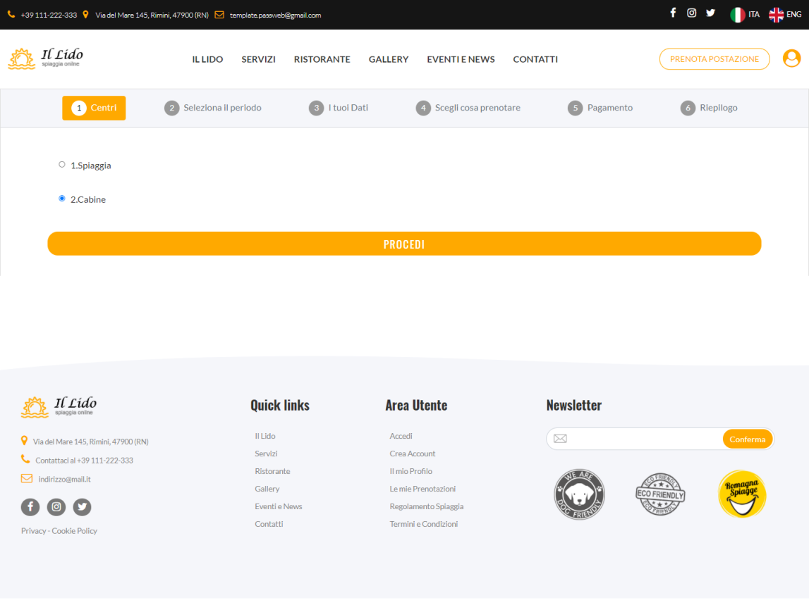

**ATTENZIONE!** in fase di sincronizzazione con il gestionale, qualora
sia stato inserito nella Cartella Abbinamenti di un nuovo padre di
struttura il codice di un elemento statistico già utilizzato e
soprattutto già personalizzato all'interno di Passweb, queste stesse
personalizzazioni (etichetta, immagine, colore, descrizione estesa)
possono essere riportate automaticamente anche sul nuovo elemento.

Affinchè questo accada è necessario verificare di **NON aver selezionato
il parametro** "**Tabella Cartella Abbinamenti Struttura**" presente
all'interno della maschera "**Parametri Sincronizzazione**" del Wizard.

Il parametro "**Elementi raggruppati per codice**" permette di decidere
se la personalizzazione delle possibili scelte che l'utente avrà a
disposizione all'interno del configuratore, dovrà essere la stessa per
tutti gli articoli padre con associata una cartella abbinamenti
contenente l'elemento in esame, oppure se tali personalizzazioni
dovranno essere diverse per ogni singolo articolo padre.

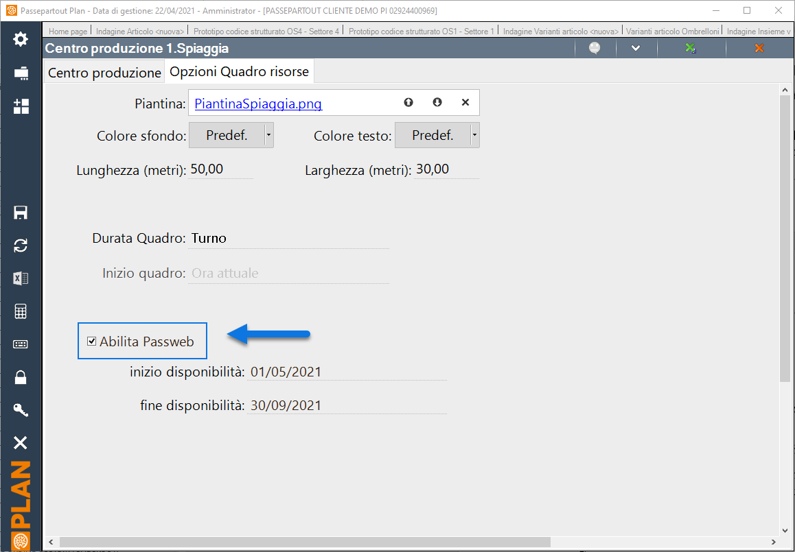

Per comprendere meglio il funzionamento di questo parametro supponiamo
di dover personalizzare il contenuto delle possibili opzioni di scelta
relativamente ad un campo della struttura utilizzato per gestire i
colori.

Supponiamo inoltre di avere all'interno di questo campo della cartella
abbinamenti (campo di tipo Statistico) un codice C02 corrispondente al
colore Grigio

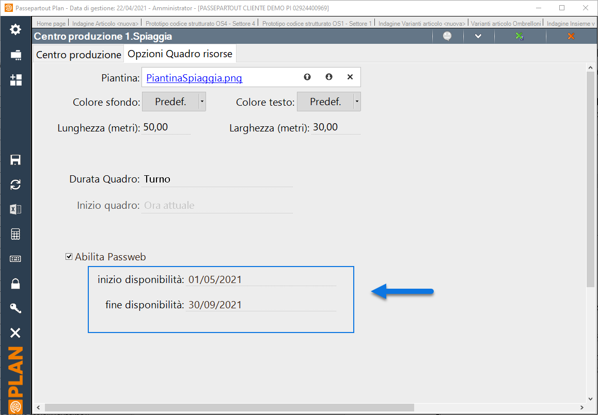

Supponiamo, infine, di avere diversi padri (es. SHPA, SHPB ecc...) con
associata una cartella abbinamenti contente, per il campo in esame, lo
stesso codice C02.

In queste condizioni selezionando il parametro **"Elementi raggruppati
per Codice**", all'interno della successiva sezione "**Elementi Campo
Struttura**" verranno poi elencati tutti gli elementi presenti per il
campo in esame, in ogni cartella abbinamenti associata ad articoli padre
esportati e gestiti sul sito.

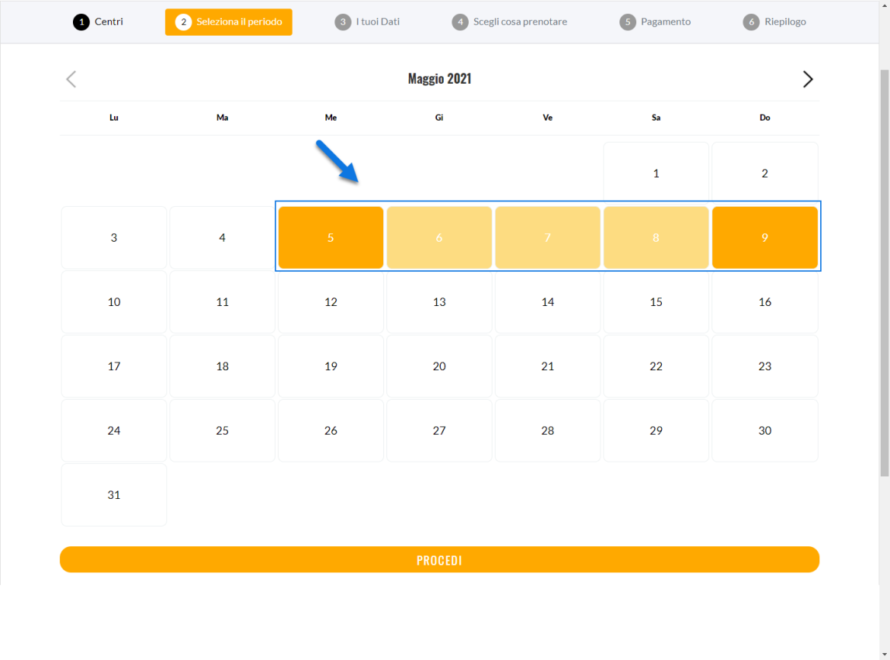

Come evidenziato nella figura sopra riportata, in queste condizioni, non
verrà però fatta alcuna distinzione in base allo specifico articolo
padre per cui personalizzando il codice C02 come "GRIGIO", e magari
associandogli anche colore e una descrizione estesa, l'utente in fase di
configurazione dell'articolo si troverà sempre, tra le possibili opzioni
di scelta l'etichetta "GRIGIO" (con il corrispondente colore e la
corrispondente descrizione) indipendentemente dal fatto di aver
inizialmente selezionato l'articolo padre SHPA o SHPB.

Nel caso in cui, invece, il parametro "**Elementi raggruppati per
codice**" NON venga selezionato gli elementi della successiva sezione
"**Elementi Campo Struttura**" non verranno più raggruppati in base al
loro codice ma, al contrario, saranno distinti per ogni singolo articolo
padre esportato e gestito all'interno del sito

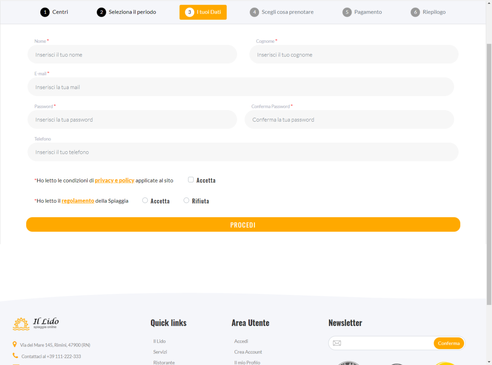

In queste condizioni sarà quindi possibile personalizzare l'opzione di
scelta relativa al codice C02 presente nella cartella abbinamenti dei
due articoli SHPA e SHPB in maniera diversa per ciascuno di questi
stessi articoli.

Per l'articolo SHPA potrebbe essere utilizzata, ad esempio, l'etichetta
"Grigio Lucido", una sua immagine e una sua specifica descrizioni
estesa.

Per l'articolo SHPB potrebbe invece essere utilizzata, l'etichetta
"Grigio Opaco", una sua immagine e una sua descrizioni estesa diverse da
quelle impostata per l'articolo SHPA.

Sul sito l'utente in fase di configurazione del prodotto, si troverà
quindi, tra le possibili opzioni di scelta l'elemento "Grigio Lucido"
(con la relativa immagine e descrizione) nel caso in cui abbia
inizialmente selezionato l'articolo padre SHPA, si troverà invece
l'elemento "Grigio Opaco" (con la relativa immagine e descrizione) nel
caso in cui abbia inizialmente selezionato l'articolo padre FAD02.

**Importa da File**
(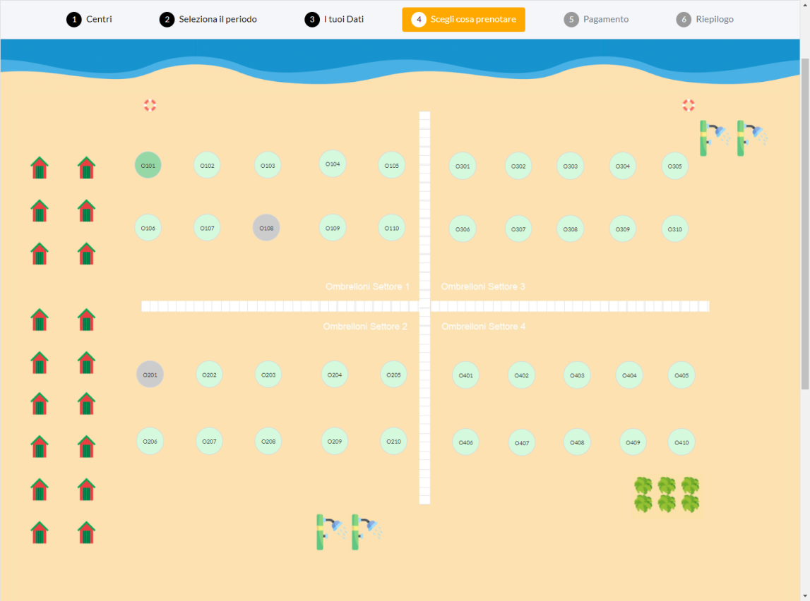 ): consente di impostare, per il campo
della struttura attualmente selezionato, gli elementi di
personalizzazione delle possibili opzioni di scelta, in maniera massiva
mediante l'upload di un file .csv o .txt.

Cliccando su questo pulsante verrà infatti aperta la maschera "**File
Elementi Campo Struttura**"

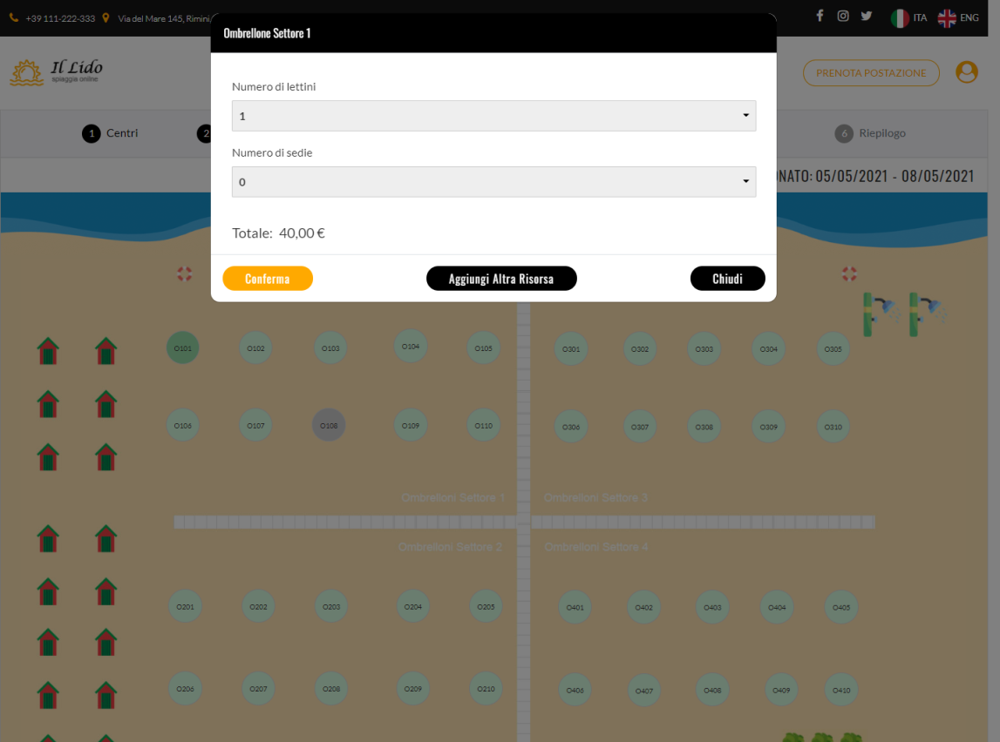

all'interno della quale poter indicare:

- **File (csv-txt)**: consente di selezionare il file txt o csv
  contenente l'elenco delle descrizioni delle possibili opzioni di
  scelta corrispondenti ai vari campi della struttura.

- **Lingua:** consente di indicare la lingua del sito a cui dovranno
  fare riferimento i dati indicati all'interno del file di importazione

- **Separatore:** consente di indicare, selezionandolo, dall'apposito
  menu a tendina, il carattere che è stato utilizzato all'interno del
  file di importazione come separatore per i vari campi

Il campo "**Elementi raggruppati per codice**" consente di indicare se
all'interno del file da uplodare gli elementi di personalizzazione sono
raggruppati per codice o distinti per singolo articolo padre

Nel primo caso (file contenente elementi di personalizzazione
raggruppati per codice) sarà necessario selezionare il parametro
"**Elementi raggruppati per codice**" e il file dovrà essere del tipo:

**\<codice elemento\>;\<descrizione elemento\>;\<codice colore
elemento\>;\<immagine\>;\<**
**immagineBackground\>;\<testo\>;\<posizione\>**

dove il campo:

- **codice**: è il codice del relativo elemento della cartella
  abbinamenti -- **campo obbligatorio** --

- **descrizione** **elemento**: è l'etichetta identificativa della
  relativa opzione di scelta

- **codice colore elemento**: è l'eventuale codice colore, esadecimale
  es. #ccff00) o rgba (es. rgb(164, 30, 86)), da associare alla
  corrispondente opzione di scelta

- **immagine**: è il percorso relativo dell'eventuale immagine da
  associare alla corrispondente opzione di scelta

- **immagineBackground**: è il percorso relativo dell'eventuale immagine
  di background da associare alla corrispondente opzione di scelta

- **testo**: è la descrizione estesa da associare alla corrispondente
  opzione di scelta

- **posizione**: è l'eventuale posizione che la relativa opzione dovrà
  assumere, sul front end del sito, nell'elenco di selezione delle
  diverse possibili opzioni di scelta

**ATTENZIONE!** In questo caso l'unico campo obbligatorio in fase di
importazione è, ovviamente, il campo "codice". Tutti gli altri campi,
volendo, possono anche essere omessi.

Ovviamente nel momento in cui si dovesse decidere di non inserire uno
dei campi in questione, questo andrà tolto sia dai singoli record che
dall'intestazione del file

Nel secondo caso (file contenente elementi di personalizzazione distinti
per ogni singolo articolo padre) sarà invece necessario deselezionare il
parametro "**Elementi raggruppati per codice**" e il file dovrà essere
del tipo:

**\<codice articolo padre\>;\<codice elemento\>;\<descrizione
elemento\>;\< codice colore elemento\>;\<immagine\>;\<**
**immagineBackground\>;\<testo\>;\<posizione\>**

dove ai campi già esaminati andrà aggiunto ora anche il campo

- **codice articolo padre:** è il codice gestionale dello specifico
  articolo padre di struttura in relazione al quale effettuare la
  personalizzazione delle diverse possibili opzioni di scelta -- **campo
  obbligatorio** --

**ATTENZIONE**! In questo caso i campi obbligatori in fase di
importazione saranno il campo "codice articolo padre" e "codice
elemento" Tutti gli altri campi, volendo, possono anche essere omessi.

Anche in questo caso ovviamente nel momento in cui si dovesse decidere
di non inserire uno dei campi in questione, questo andrà tolto sia dai
singoli record che dall'intestazione del file

**ATTENZIONE!** Nel caso in cui si dovesse decidere, per una qualsiasi
ragione, di inserire nell'intestazione del file di importazione uno dei
campi non obbligatori e tale campo non dovesse poi essere valorizzato
nei successivi record del file, questo comporterebbe, al termine
dell'importazione, l'eliminazione di eventuali valori già presenti sul
sito per quello stesso campo.

Infine è bene ricordare anche che:

- Nel caso in cui il sito utilizzi più lingue sarà necessario importare
  un file distinto per ogni singola lingua gestita.

- Il carattere separatore dei vari campi deve essere esattamente quello
  indicato all'interno del campo "**Separatore**" presente nel form di
  importazione.

- Il file di importazione deve soddisfare le specifiche del formato
  RFC4180.

> In questo senso è quindi necessario che il valore dei campi contenenti
> interruzioni di riga, doppi apici e/o lo stesso carattere utilizzato
> anche come separatore sia necessariamente racchiuso da virgolette

**Esporta**
(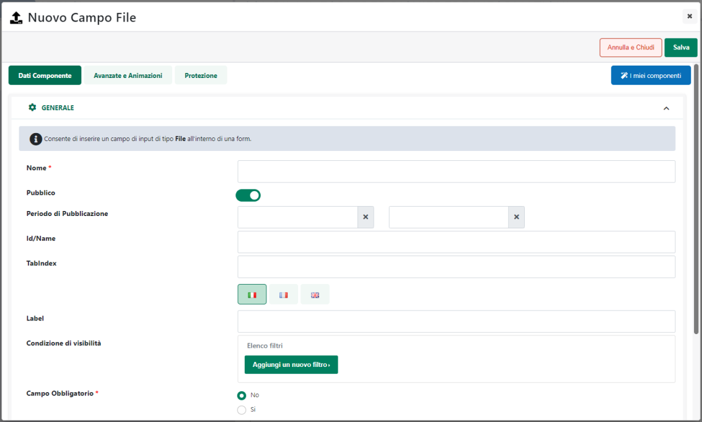 ): consente di esportare gli elementi di
personalizzazione delle possibili opzioni di scelta attualmente
utilizzate per il campo in esame all'interno di un file .csv.

Cliccando su questo pulsante verrà infatti aperta la maschera
"**Esportazione Elementi Campo Struttura**"

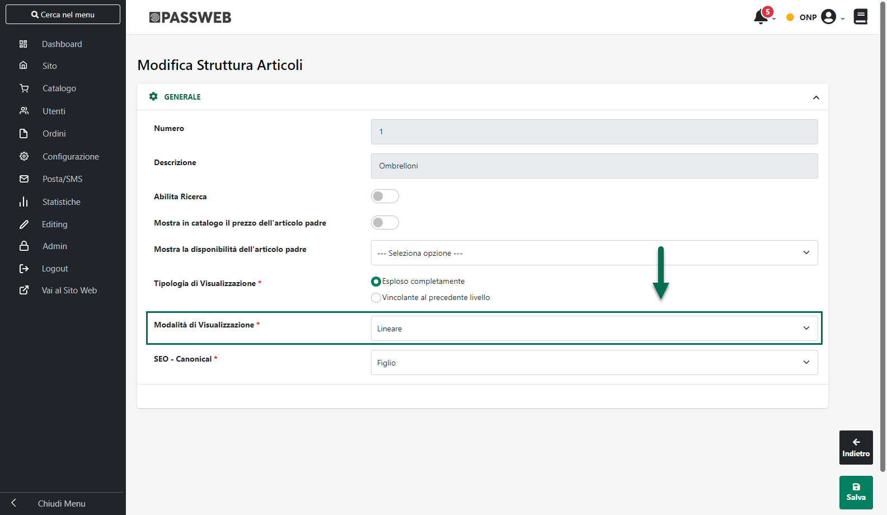

all'interno della quale poter selezionare la lingua in relazione alla
quale esportare le possibili opzioni di scelta (campo **Lingua**), il
carattere da utilizzare come separatore dei campi (campo **Separatore**)
e se il file dovrà contenere un elenco di elementi raggruppati per
codice (parametro "**Elementi raggruppati per codice" selezionato**) o
distinti per ogni singolo articolo padre (parametro "**Elementi
raggruppati per codice" deselezionato**)

##### MODIFICA ELEMENTI MANUALE

Come evidenziato nei precedenti capitoli di questo manuale, nel momento
in cui la struttura su cui si sta operando dovesse essere impostata con
una Tipologia di Visualizzazione **Vincolante al precedente livello** e
con una Generazione Elementi **Manuale**, le diverse possibili
configurazioni di prodotto finto cui l'utente potrà arrivare utilizzando
il configuratore, saranno determinate sulla base di precise impostazioni
stabilite dall'amministratore direttamente all'interno di Passweb.

In queste condizioni dunque sarà chi configura il sito a dover decidere,
direttamente all'interno di Passweb, le diverse possibili configurazioni
di prodotto finito, **senza che tali configurazioni debbano
necessariamente corrispondere ad articoli figlio già codificati
all'interno delle anagrafiche di Mexal ed eventualmente esportati anche
all'interno del sito**.

Per tutte quelle strutture per le quali è stata impostata una "Tipologia
di Visualizzazione" vincolante al precedente livello con "Generazione
Elementi" Manuale, sarà infatti attivo all'interno della maschera
"**Lista delle Strutture Articolo**" precedentemente esaminata, anche il
pulsante **"Modifica Elementi Manuale"** (
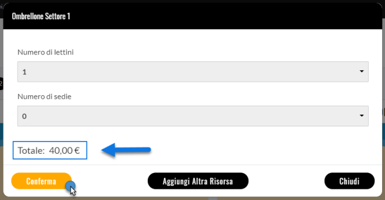 ).

Cliccando su questo pulsante verrà visualizzata la maschera **"Lista
degli Elementi dell'Articolo Strutturato"**

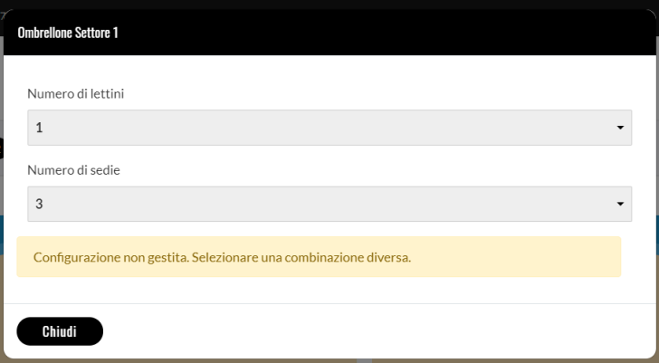

attraverso cui poter definire manualmente tutte le diverse possibili
configurazioni ed i relativi prodotti finiti cui potrà arrivare un
qualsiasi utente del sito utilizzando il corrispondente configuratore.

**NOTA BENE:** i prodotti finiti impostati all'interno della maschera
sopra evidenziata non devono necessariamente corrispondere ad articoli
figlio già codificati all'interno delle anagrafiche del gestionale.

Come già evidenziato, anche in queste condizioni infatti, nel caso in
cui alcune delle configurazioni sopra indicate corrispondano ad articoli
figli non ancora presenti nelle anagrafiche del gestionale l'effettiva
codifica del prodotto finito avverrà in maniera completamente automatica
(secondo le stesse logiche gestionali) contestualmente all'inserimento
in Mexal del primo ordine che contiene uno di tali articoli

In ogni caso, ovviamente, ogni codice articolo inserito all'interno di
questa maschera dovrà necessariamente riflettere una configurazione di
prodotto finito effettivamente gestibile.

Per aggiungere un nuovo elemento (articolo figlio) alla lista sarà
sufficiente cliccare sul pulsante **"Aggiungi Elemento"**
(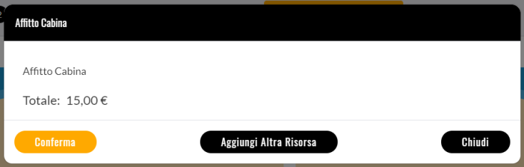) presente nella barra degli strumenti.

In questo modo verrà infatti visualizzata la maschera **"Elemento
Struttura"**

grazie al quale poter definire la nuova possibile configurazione di
prodotto e l'eventuale articolo (già presente in Passweb) da associare a
questa specifica configurazione di prodotto.

All'interno di questo form verrà visualizzato un campo per ogni livello
della struttura in esame. Le diverse possibili opzioni presenti
all'interno di questi campi dipenderanno invece:

- al primo livello, dagli articoli padri di struttura correttamente
  codificati ed esportati all'interno del sito

- ai restanti livelli dagli elementi inseriti in Mexal nel
  corrispondente livello della Cartella Abbinamenti associata al padre
  attualmente selezionato.

Una volta impostata la configurazione desiderata il campo "**Articolo
Alternativo**" consentirà poi, se necessario, di associare a questa
stessa configurazione uno specifico articolo già presente all'interno
delle anagrafiche di Passweb.

**Articolo Alternativo**: consente di indicare il codice di uno
specifico articolo che dovrà essere associato alla configurazione di
prodotto determinata dai valori impostati nei campi precedenti.

**NOTA BENE:** il codice inserito all'interno di questo campo deve
necessariamente corrispondere al codice di un articolo correttamente
esportato e gestito all'interno del sito. In questo senso verranno
validati solo ed esclusivamente codici di articoli di tipo A. Non sarà
quindi possibile inserire all'interno di questo campo articoli
campionario (tipo C) e/o articoli Spesa (tipo S).

Per agevolare l'utente nell'indicazione del codice dell'articolo
alternativo, dopo aver digitato il quarto carattere verrà effettuata
automaticamente una query sul database articoli presenti all'interno del
proprio sito e verranno proposti all'utente tutti i codici articoli che
iniziano con i caratteri precedentemente indicati.

**Come precedentemente evidenziato NON è però obbligatorio inserire uno
specifico codice articolo da associare alla configurazione di prodotto
impostata.**

In questo senso quindi è bene sottolineare che:

- Associando alla configurazione di prodotto impostata uno specifico
  articolo, nel momento in cui l'utente andrà poi a selezionare,
  all'interno del sito, attraverso il configuratore, quella specifica
  configurazione, verrà automaticamente caricata la scheda prodotto
  dell' "Articolo Alternativo" associato alla configurazione in esame.

- Nel caso in cui non venga associato alla configurazione di prodotto
  impostata nessun "Articolo Alternativo" andranno invece considerate le
  seguenti casistiche:

  - Se la configurazione impostata corrisponde ad un articolo finito,
    configurato in Mexal partendo dal relativo padre ed esportato anche
    all'interno del sito, nel momento in cui l'utente andrà a
    selezionare, attraverso il configuratore, questa specifica
    configurazione, verrà automaticamente caricata la scheda prodotto di
    questo specifico articolo

  - Se la configurazione impostata corrisponde ad un articolo finito che
    non risulta essere presente tra gli articoli attualmente gestiti
    all'interno del sito, ma che è comunque presente nelle anagrafiche
    del gestionale, nel momento in cui l'utente andrà a selezionare,
    attraverso il configuratore, questa specifica configurazione, il
    corrispondente articolo verrà comunque inserito in carrello e messo
    in ordine.

> In queste condizioni, lato gestionale, a seguito dell'inserimento del
> nuovo ordine, verranno conseguentemente movimentati i progressivi
> dell'articolo già esistente

- Se la configurazione impostata corrisponde ad un articolo finito che
  non risulta essere presente né tra gli articoli attualmente gestiti
  all'interno del sito né tanto meno nelle anagrafiche del gestionale,
  nel momento in cui l'utente andrà a selezionare, attraverso il
  configuratore, questa specifica configurazione, il corrispondente
  articolo verrà comunque inserito in carrello e messo in ordine.

> In queste condizioni, lato gestionale, contestualmente all'inserimento
> dell'ordine verrà poi codificato, in maniera del tutto automatica e
> secondo le impostazioni della relativa struttura di appartenenza,
> anche il nuovo articolo.

**In definitiva dunque grazie al campo "Articolo Alternativo" sarà
possibile utilizzare il configuratore di prodotto e le relative
funzionalità, anche su articoli non strutturati.**

Per far questo sarà necessario:

- Creare in Mexal la struttura che dovrà determinare i possibili livelli
  di scelta che verranno poi offerti all'utente attraverso il
  configuratore

- Codificare in Mexal, ed esportare all'interno del sito, gli articoli
  padre di questa struttura (con relativa Cartella Abbinamenti). Tali
  articoli verranno poi utilizzati come contenitori logici di tutta una
  serie di articoli non strutturati che potranno essere selezionati a
  partire proprio dal configuratore associato a questi stessi articoli
  padre

- Gestire manualmente (all'interno del Wizard di Passweb) tutte le
  associazioni tra le diverse possibili configurazioni di prodotto ed i
  relativi articoli non strutturati

Una volta impostata una specifica configurazione di prodotto e associato
ad essa, se necessario, un "Articolo Alternativo", il pulsante
**"Conferma",** presente nella parte bassa della maschera "Lista degli
Elementi dell'Articolo Strutturato" consentirà di salvare la
configurazione in oggetto inserendola quindi nell'elenco sottostante.

Gli ulteriori pulsanti presenti nella barra degli strumenti della
maschera "**Lista degli Elementi dell'Articolo Strutturato**" consentono
rispettivamente di:

- **Cancella Elemento**
  () **:** consente di eliminare la
  configurazione di prodotto attualmente selezionata in elenco.

- **Svuota**
  (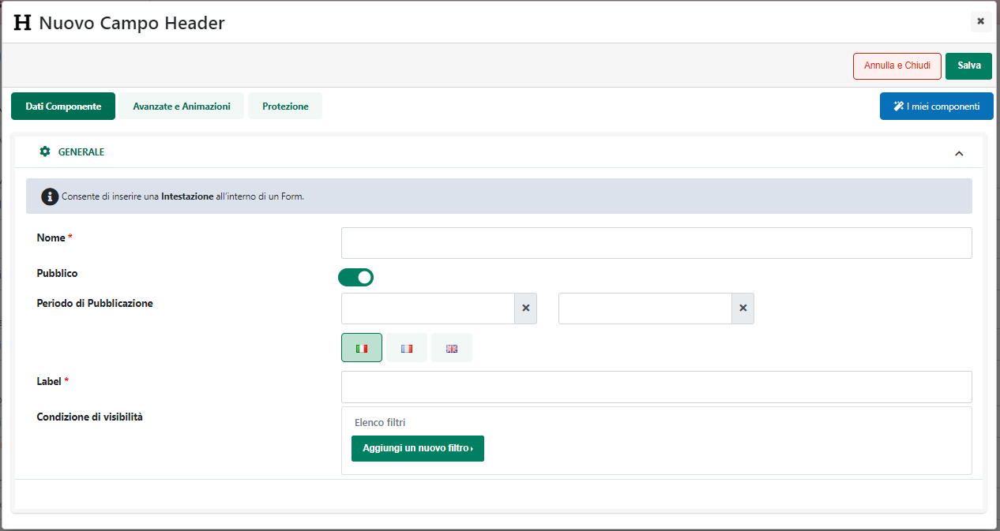) **:** consente di eliminare tutte le
  configurazioni di prodotto attualmente codificate, svuotando
  interamente l'elenco sottostante.

> **ATTENZIONE!** una volta eliminate delle configurazioni di prodotto,
> se poi si dovesse decidere di riportare la struttura con Generazione
> di elementi Automatica, potrebbe essere necessario effettuare una
> sincronizzazione per allineare la base dati del sito con quella del
> gestionale.

- **Modifica Elemento**
  () **:** consente di modificare la
  configurazione di prodotto attualmente selezionata in elenco. Nello
  specifico sarà però possibile modificare la sola associazione tra la
  configurazione di prodotto in esame e l'eventuale "Articolo
  Alternativo" ad essa associato.

> **NOTA BENE:** nel caso in cui si dovesse aggiungere una
> configurazione già presente tra quelle in elenco, i nuovi dati
> andranno a sovrascrivere quelli precedentemente impostati.

- **Esporta**
  (): consente di esportare all'interno di
  un apposito file csv le configurazioni di prodotto finito attualmente
  presenti in elenco e l'eventuale codice alternativo ad esse associato.

> Cliccando su questo pulsante verrà infatti visualizzata la maschera
> "**Esportazione Codici Articoli Figlio**"

> All'interno della quale poter selezionare il carattere da utilizzare
> come separatore dei vari campi nel file csv di esportazione
>
> Il formato del file csv di esportazione è il medesimo di quello
> utilizzato anche per l'analoga funzionalità di importazione

- **Importa da File**
  () **:** consente di importare un file
  all'interno del quale poter indicare una o più configurazioni di
  prodotto finito che dovranno poi essere inserite nell'elenco
  sottostante.

Grazie a quest'ultima opzione dunque non è più necessario codificare
manualmente, attraverso il form "Elemento Struttura", ogni singola
configurazione di prodotto finito. Le varie configurazioni potranno
essere inserite all'interno di un file che dovrà poi essere importato
all'interno di Passweb attraverso la funzione in oggetto e Passweb
stesso si preoccuperà di validare ed inserire in elenco tutte le
configurazioni di prodotto finito indicate all'interno del file.

Ovviamente affinché questa procedura possa andare a buon fine il file in
questione dovrà avere delle caratteristiche ben precise. Nello
specifico:

- Il file dovrà avere estensione **.txt** o **.csv**

- Ogni riga del file dovrà corrispondere a una possibile configurazione
  di prodotto finito da gestire all'interno del sito e dovrà essere del
  tipo:

> **codiceArticoloFiglio;codiceArticoloAlternativo**

- Nel caso in cui non siano gestiti gli articoli alternativi sarà
  sufficiente inserire in ogni riga del file il solo
  **codiceArticoloFiglio**

**[Esempio di file con la gestione degli articoli
alternativi:]{.underline}**

ARTICOLO1;ARTICOLOALTERNATIVO1

ARTICOLO2;ARTICOLOALTERNATIVO2

ARTICOLO3;ARTICOLOALTERNATIVO3

**[Esempio di file senza gestione degli articoli
alternativi:]{.underline}**

ARTICOLO1

ARTICOLO2

ARTICOLO3

**ATTENZIONE!** Il codice articolo deve coincidere, in lunghezza, con le
relative impostazioni settate all'interno del gestionale (dovranno
quindi essere aggiunti se necessario appositi spazi)

Nella maschera di importazione del file è presente inoltre, il check
"**Elimina combinazioni non presenti nel file**" attraverso il quale
poter decidere come dovrà comportarsi l'applicazione in relazione a
codici articolo già presenti in elenco ma non specificatamente indicati
all'interno del file.

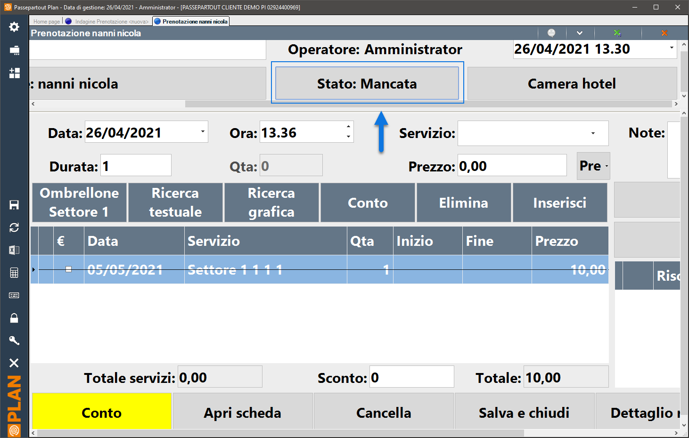

**Elimina combinazioni non presenti nel file**: se flaggato tutte le
combinazioni di codici articolo figlio già inserite in Passweb (e
presenti nell'elenco sottostante) ma non specificatamente indicate
all'interno del file, a seguito dell'importazione del file stesso,
verranno eliminate.

Nel caso in cui invece il parametro in oggetto non venga selezionato, a
seguito dell'importazione del file le combinazioni di codici articolo
figlio già presenti in Passweb verranno mantenute inalterate anche se
non specificatamente indicate all'interno del file.

In fase di importazione Passweb si preoccuperà di validare i dati
presenti all'interno del file verificando, ad esempio, che la lunghezza
dei codici articolo sia coerente con le impostazioni della struttura
definita all'interno del gestionale oppure che eventuali codici
alternativi corrispondano effettivamente ad articoli correttamente
esportati e gestiti all'interno del sito.

**ATTENZIONE!** Nel caso in cui, durante la scansione del file,
dovessero essere riscontrati dei problemi di questo tipo, la procedura
completerà comunque la lettura del file, importando i codici articolo
corretti, e al termine visualizzerà un messaggio relativo agli errori
riscontrati.

**NOTA BENE:** i codici articolo in relazione ai quali sono stati
riscontrati dei problemi così come quelli che corrispondono a
combinazioni di articoli figlio non ammesse dal gestionale, non verranno
mai importati.

Un'ultima cosa di fondamentale importanza da tenere in considerazione
riguarda la possibilità di attivare la funzionalità di ricerca articoli
sui campi di una struttura gestita come "Vincolata al precedente
livello" con "Generazione degli elementi manuale".

In queste condizioni infatti occorre sempre ricordare che la procedura
di aggiornamento della tabella di appoggio del database utilizzata per
gestire il filtro strutture, di base, dovrà essere effettuata in maniera
manuale, cliccando per questo sul pulsante "**Aggiorna Ricerca**"
presente nella barra degli strumenti della maschera "Lista delle
strutture articolo" nel momento in cui si dovesse selezionare, tra
quelle presenti in elenco, una struttura che si trova effettivamente
nelle condizioni indicate (vincolata al precedente livello, generazione
elementi manuali e almeno un campo della struttura abilitato per la
funzionalità di ricerca)

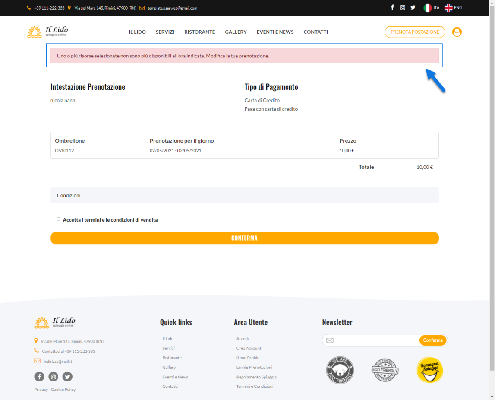

Questo per evitare che a seguito di una qualsiasi modifica sugli
elementi della struttura manuale (inserimenti, cancellazioni, modifiche
...) venga eseguita automaticamente, ogni volta, la procedura di
aggiornamento della tabella di appoggio, procedura questa che potrebbe
rivelarsi anche particolarmente onerosa.

**In queste condizioni dunque sarà compito di chi opera sul Wizard
lanciare manualmente la procedura di aggiornamento solo dopo aver
effettuato tutte le modifiche necessarie ai vari elementi della
struttura manuale.**

Per maggiori informazioni relativamente a come poter attivare e gestire
la ricerca articoli sulla base delle opzioni disponibili per un
determinato campo di una struttura si veda anche quanto indicato nel
successivo capitolo "*Ricerca Articoli su campi struttura*" di questo
manuale

