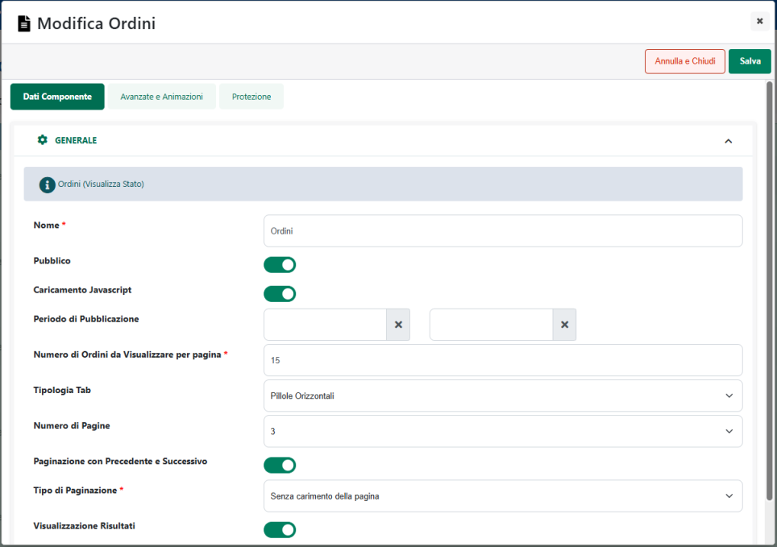

# STRUTTURE -- ECOMMERCE HO.RE.CA.

Nei siti Ecommerce collegati ad un gestionale Ho.Re.Ca. è possibile
gestire, esattamente allo stesso modo di quanto avviene sul gestionale
stesso, le cosiddette **Varianti Articolo**.

Le Varianti Articolo, in un gestionale Ho.Re.Ca. (Retail, Menu, Beauty),
sono l'equivalente delle Strutture Articolo di Mexal, consentono quindi
di realizzare codici articolo strutturati medianti i quali poter gestire
e risolvere problematiche relative, ad esempio, a taglie e colori , o
comunque, in generale, a tutte quelle categorie merceologiche in cui è
necessario categorizzare gli articoli con diverse classi distinguendo,
direttamente nel loro stesso codice, elementi quali la tipologia, la
regione, l'anno di produzione, la stagione ecc...

Come per gli articoli strutturati di Mexal dunque, anche per la Varianti
Articolo Ho.Re.Ca., o meglio ancora per i relativi Articoli Prototipo, è
possibile disporre sul sito Ecommerce di un Configuratore di Prodotto
che potrà essere utilizzato:

- per l'eventuale codifica di articoli figlio non ancora definiti
  all'interno del gestionale.

- per raggruppare all'interno di un unico contenitore logico
  (rappresentato da uno specifico Articolo Prototipo) tutta una serie di
  articoli non strutturati offrendo poi all'utente la possibilità di
  arrivare a selezionare questi stessi articoli secondo le stesse esatte
  modalità con cui si arriverebbe a configurare un figlio della Variante
  Articolo in esame.

**In ogni caso, per poter gestire correttamente all'interno del proprio
sito Ecommerce il configuratore di prodotto è obbligatorio creare almeno
un Articolo Prototipo per ciascuna delle Varianti Articolo che si è
deciso di gestire all'interno del sito.**

**ATTENZIONE!** Nei siti Ecommerce collegati ad un gestionale Ho.Re.Ca.
il configuratore di prodotto è associato unicamente ad articoli
prototipo che sono quindi utilizzati come fossero padri di struttura.

Partendo dal Prototipo e utilizzando il configuratore sarà poi possibile
configurare ed acquistare all'interno del sito uno qualsiasi dei
prodotti finiti ammessi dalla Variante Articolo considerata.

In definitiva dunque l'utilizzo delle Varianti Articolo in un sito
collegato ad un gestionale Ho.Re.Ca., è sostanzialmente analogo a quello
delle strutture in un sito Ecommerce collegato a Mexal.

L'unica differenza è data dall'assenza, nei gestionali Ho.Re.Ca., di
articoli modificatori che possano contribuire alla determinazione del
prezzo dell'articolo figlio sulla base delle scelte effettuate
dall'utente in fase di configurazione del prodotto.

In questo senso diventa quindi di fondamentale importanza **il livello
della Variante Articolo a partire dal quale verrà poi generato il
Prototipo**. Il prezzo del Prototipo verrà infatti applicato, a default,
anche a tutte le altre possibili configurazioni di prodotto finito e
l'unica possibilità di ottenere un articolo figlio con un prezzo diverso
dal prototipo sarà quella di codificarlo all'interno del gestionale,
assegnarli il suo specifico prezzo ed esportarlo all'interno del sito.

In queste condizioni quando l'utente, utilizzando il configuratore
presente all'interno del sito, arriverà a selezionare la configurazione
corrispondente a quello specifico articolo figlio verrà automaticamente
visualizzato ed applicato lo specifico prezzo per esso definito
all'intero del gestionale.

**ATTENZIONE! In tutti gli altri casi (articoli figlio non ancora
codificati o codificati ma non esportati all'interno del sito) il prezzo
di ogni prodotto finito sarà esattamente quello impostato sul gestionale
per l'articolo prototipo.**

Il livello della Variante Articolo a partire dal quale viene generato il
prototipo contribuisce poi a determinare anche quelli che sono i diversi
possibili livelli di selezione che avrà l'utente in fase di
configurazione del prodotto all'interno del sito.

Per comprendere meglio questi concetti consideriamo un semplice esempio
e facciamo quindi riferimento alla Variante Articolo rappresentata in
figura:

Tale Variante è costituita da 4 diversi livelli: **Tipo**, **Modello**,
**Colore** e **Taglia** e per ciascuno di essi sono stati definiti
diversi **Insiemi di Valori** che identificano le possibili opzioni di
scelta disponibili per ogni livello della Variante.

Nella figura di seguito riportata viene evidenziato, ad esempio,
l'Insieme di Valori definito per il livello Colore

In corrispondenza del Livello Colore avremo quindi la possibilità di
scegliere tra Bianco, Grigio o Nero.

Supponiamo ora che il Tipo (es. Maglia, Calzini ecc...) e il Modello
(Uomo, Donna, Bambino ...) dell'articolo possano contribuire a
determinare un prezzo diverso per il prodotto finito (una maglia uomo
può costare di più di una maglia donna e meno di un Calzino Uomo).

In queste condizioni per codificare un Prototipo, appartenente alla
Variante Articolo in esame, dovremo per prima cosa specificare,
selezionandolo tra le opzioni definite all'interno del corrispondente
Insieme di Valori, la sua Tipologia ed il suo Modello.

Definito ed esportato il Prototipo, all'utente resterà la possibilità di
selezione, all'interno del sito tramite configuratore di prodotto, solo
il Colore e la Taglia dell'articolo, elementi questi che, di base, non
dovrebbero contribuire a variare il prezzo dell'articolo finito, prezzo
questo che sarà esattamente lo stesso di quello impostato all'interno
del gestionale per il relativo prototipo.

Nel caso in cui anche il Colore dovesse contribuire a far variare il
prezzo dell'articolo finito avremo due possibilità:

- generare il Prototipo a partire dal livello "Colore" e definire, in
  fase di codifica, non solo il Tipo ed il Modello ma anche il Colore.

> In queste condizioni l'articolo prototipo, selezionabile in catalogo,
> non sarà più Maglia-Uomo (Tipo-Modello), ma potrebbe essere ad esempio
> Maglia-Uomo-Nera (Tipo-Modello-Colore) e l'utente avrà la possibilità
> di selezionare, tramite il configuratore presente all'interno della
> relativa pagina prodotto, solamente la taglia

- generare il Prototipo a partire dal livello "Modello", " definire, in
  fase di codifica solamente Tipo e Modello dell'articolo, codificare
  tutti i possibili figli di quel prototipo assegnandogli anche il
  prezzo corretto (diverso per colori diversi) ed esportarli all'interno
  del sito.

> In queste condizioni l'articolo prototipo selezionabile in catalogo
> sarà solo Maglia-Nera (Tipo-Modello) e l'utente avrà la possibilità di
> selezionare, tramite il configuratore presente all'interno della
> relativa pagina prodotto, il colore e la taglia. Una volta fissati
> anche questi due elementi verrà agganciata l'anagrafica del
> corrispondente articolo figlio (precedentemente esportato) e verrà
> quindi visualizzato ed applicato lo specifico prezzo per esso definito
> all'interno del gestionale.

