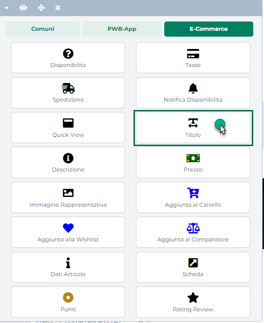
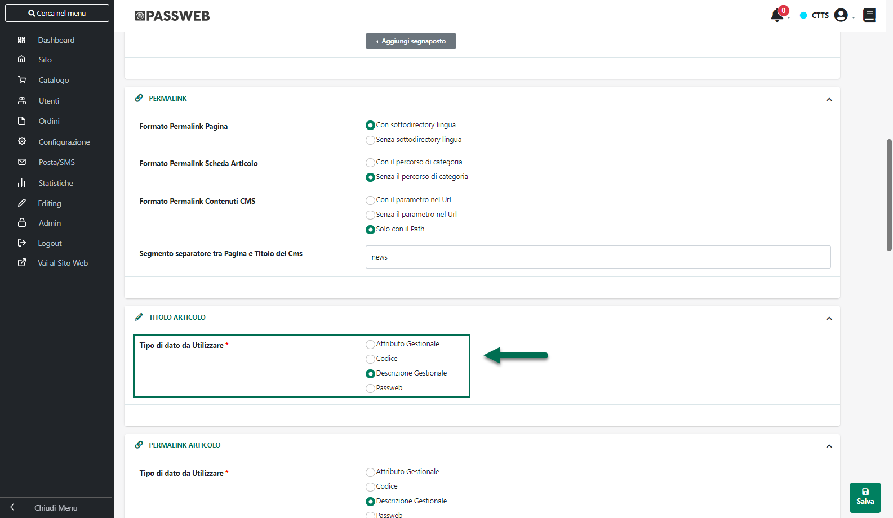
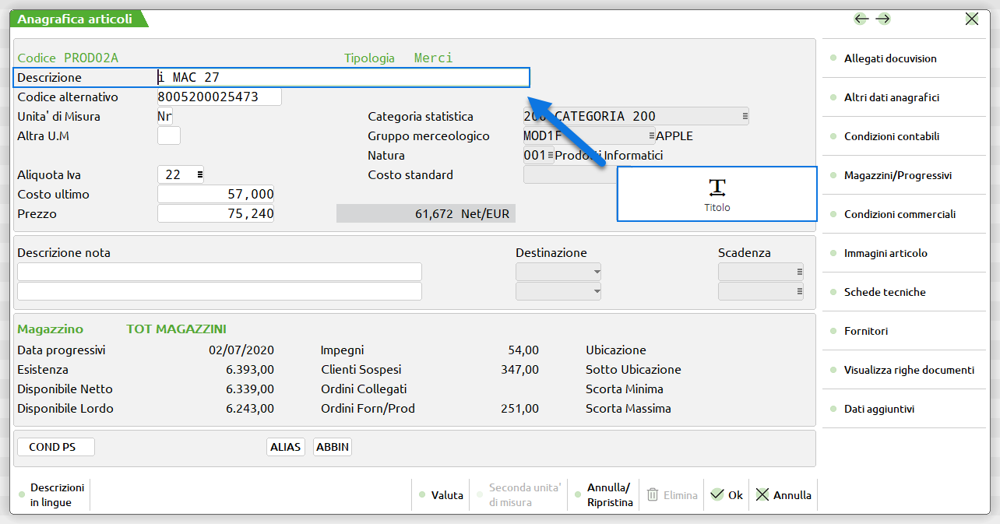
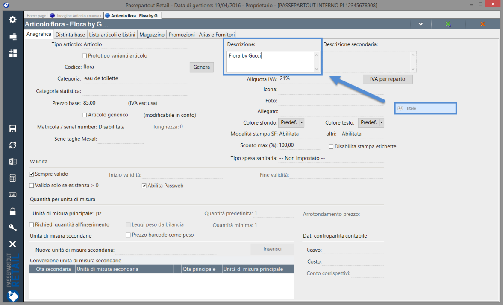
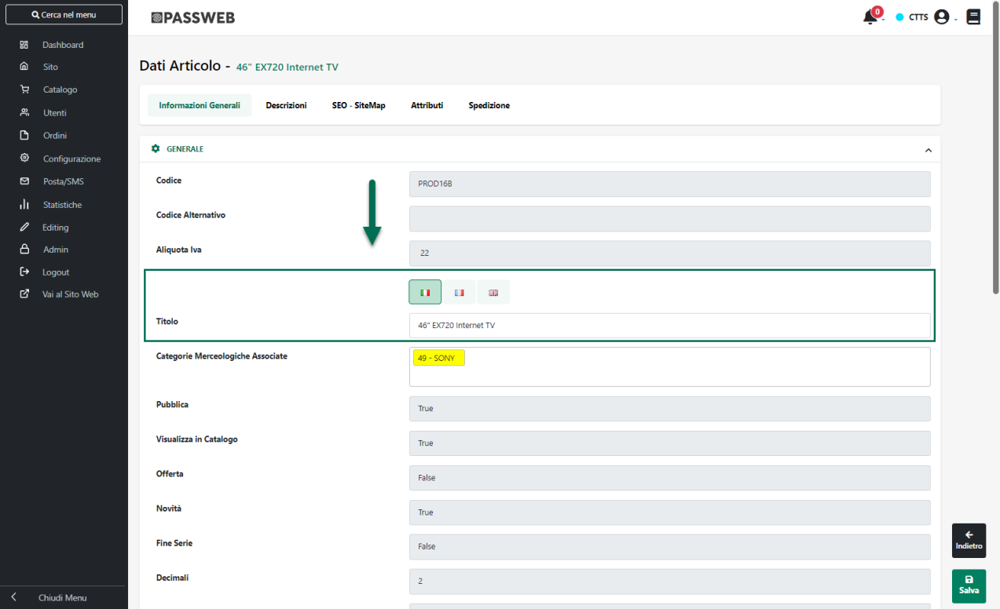
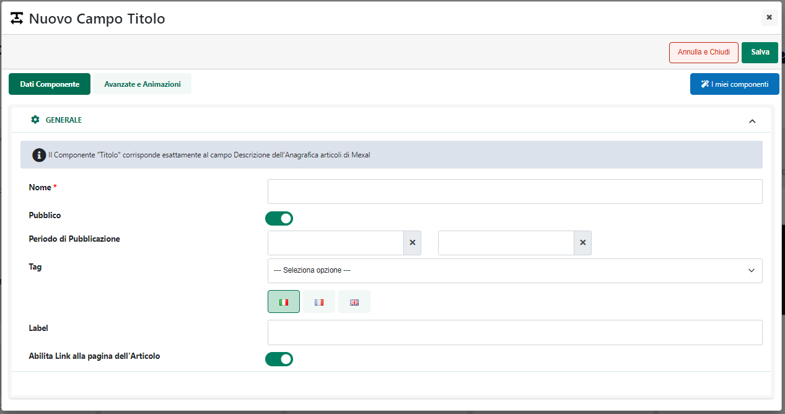
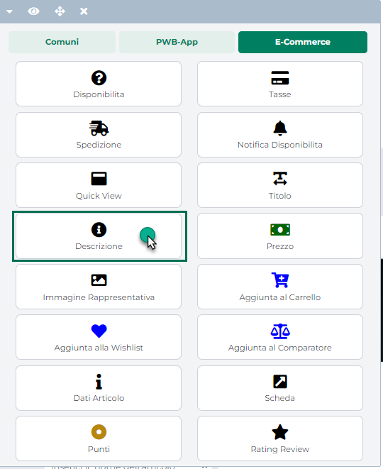

# GESTIONE -- STRUTTURE

La sezione **"Strutture"** accessibile in Passweb dalla voce di menu
***"Catalogo -- Gestione Articoli"*** consente, essenzialmente, di:

- personalizzare, per ogni singola Variante Articolo, le descrizioni
  impostate all'interno del gestionale per i livelli della Variante e
  per gli elementi dei rispettivi Insiemi di Valori

- impostare, per ogni singola Variante Articolo, il tipo di grafica e di
  controlli che verranno utilizzati all'interno del sito in
  corrispondenza del componente "Configuratore".

All'interno di questa pagina verrà quindi visualizzata la maschera
**"Lista delle Strutture Articolo"**

{width="5.856944444444444in"
height="3.545138888888889in"}

contenente l'elenco di tutte le Varianti Articolo codificate all'interno
del gestionale e **per le quali è stato definito ed esportato
all'interno del sito almeno un Prototipo**.

{width="4.49375in"
height="2.6430555555555557in"}

**ATTENZIONE!** Nel caso in cui una delle Varianti Articolo codificate
all'interno del gestionale non dovesse essere presente tra quelle
inserite in elenco è necessario verificare di aver creato ed esportate
sul sito almeno un Prototipo ad essa associato

**NOTA BENE:** per maggiori informazioni relativamente alla gestione
delle Varianti Articolo si rimanda allo specifico manuale di prodotto.

Il pannello di ricerca visualizzato nella parte alta della maschera
consentirà di ricercare una specifica Variante Articolo fra quelle
presenti in elenco indicando la sua descrizione e/o il suo codice (o
parte di essi)

Selezionando una delle Varianti Articolo presenti in elenco,
compariranno nella contestuale barra degli strumenti, dei nuovi pulsanti
mediante i quali poter personalizzare la Variante selezionata, e
conseguentemente anche il configuratore di prodotto disponibile poi sul
front end del sito, in vari modi sia dal punto di vista grafico che dal
punto di vista funzionale.

Per maggiori informazioni relativamente alle diverse possibili opzioni
di configurazione e personalizzazione delle Varianti Articolo (e
conseguentemente anche del configuratore di prodotto) si vedano i
successivi capitoli di questo manuale.

##### MODIFICA STRUTTURA

Il pulsante **"Modifica Struttura"** (
{width="0.7145833333333333in"
height="0.18819444444444444in"} ) presente nella barra degli strumenti
della maschera "Lista delle Strutture Articolo

{width="5.8375in"
height="3.532638888888889in"}

consente di impostare i principali parametri di configurazione della
struttura selezionata.

Cliccando su questo pulsante verrà visualizzata la maschera "**Modifica
Struttura Articoli**"

{width="5.856944444444444in"
height="3.545138888888889in"}

all'interno della quale il campo:

**Numero:** consente di visualizzare il numero identificativo della
struttura in esame all'interno della relativa tabella gestionale

**Descrizione:** consente di visualizzare la descrizione associata lato
gestionale alla struttura in esame

**Abilita Ricerca:** consente, se selezionato, di poter poi attivare e
gestire la ricerca articoli sui singoli campi della struttura

**ATTENZIONE!** per poter attivare e gestire correttamente la ricerca
sui singoli campi di una struttura è indispensabile aver selezionato per
prima cosa il parametro in esame

Nel momento in cui si dovesse infatti attivare la funzionalità di
ricerca sul singolo campo di una struttura senza aver prima attivato la
stessa funzionalità a livello dell'intera struttura, non si otterrà
nessun tipo di risultato.

**ATTENZIONE!** l' effettiva selezione di questo parametro, e la
conseguente attivazione della funzionalità di ricerca per la struttura
in esame, dipende da quelle che sono le impostazioni settate per la
struttura stessa e, conseguentemente, da quelle che saranno poi le
diverse possibili combinazioni di articoli figlio da dover gestire

Nel momento in cui si dovesse decidere di selezionare il parametro
"Abilita Ricerca", al salvataggio della maschera verrà infatti avviato
un controllo per determinare, in relazione a tutte le opzioni settate,
se possa o meno essere effettivamente gestita, per la struttura in
esame, la funzionalità di ricerca senza che questa vada a pregiudicare
eccessivamente le prestazioni del sito.

**Se tale controllo dovesse dare esito negativo verrà visualizzato un
apposito messaggio di errore ("*La ricerca non può essere abilitata
sulla struttura. Il numero di elementi è troppo elevato*") e, di fatto,
per la struttura in esame non sarà possibile abilitare la funzionalità
di ricerca**

**Mostra in catalogo il prezzo dell'articolo padre:** consente, se
selezionato, di visualizzare all'interno dei componenti "Catalogo
E-commerce" e "Offerte/Novità" il prezzo anche per gli articoli
prototipo.

Nel caso in cui il prezzo degli articoli figlio dovesse essere diverso
da quello dell'articolo prototipo potrebbe infatti non essere corretto
visualizzare all'interno del catalogo il suo prezzo in quanto questo non
andrebbe comunque a coincidere con il prezzo che verrebbe poi
considerato e visualizzato a fronte della selezione di una specifica
configurazione di prodotto finito.

**Mostra la disponibilità dell'articolo padre:** permette di decidere se
gli utenti del sito avranno o meno la possibilità di richiedere la
Disponibilità partendo direttamente dall'articolo padre di struttura

**ATTENZIONE!** Nel caso in cui il parametro venga impostato sul valore
NO la disponibilità visualizzata sull'articolo padre sarà quella
relativa al totale degli articoli figli (come avviene anche all'interno
del gestionale) attualmente esportati e gestiti all'interno del sito.

**Tipologia di visualizzazione:** consente di definire come dovrà
comportarsi il configuratore in relazione alle diverse possibili
configurazioni di prodotto finito cui potrà giungere l'utente in fase di
configurazione del prodotto all'interno del sito web.

In questo senso è possibile scegliere tra due diverse possibili opzioni;
impostando il campo **"Tipologia di Visualizzazione"** sul valore:

- **Esploso Completamente:** il configuratore visualizzerà sempre tutti
  i diversi livelli della struttura e in corrispondenza di ciascuno di
  essi verranno proposte tutte le diverse possibili opzioni di scelta
  determinate dagli elementi presenti all'interno del relativo Insieme
  di Valori.

{width="5.045138888888889in"
height="3.2270833333333333in"}

**NOTA BENE:** questo tipo di gestione offre quindi all\'utente la
possibilità di creare e conseguentemente di acquistare **un qualsiasi
articolo figlio ammesso sulla base degli elementi inseriti nei diversi
Insiemi di Valori utilizzati per la Variante Articolo in esame**. Nel
caso in cui l\'articolo figlio configurato dall\'utente non fosse già
codificato nelle anagrafiche del gestionale, la codifica sarebbe
contestuale all\'inserimento dell\'ordine sul gestionale stesso.

- **Vincolante al precedente livello:** inizialmente il configuratore
  visualizzerà solo il primo livello della Variante Articolo con le
  diverse possibili opzioni di scelta. Sulla base poi delle scelte
  effettuate dall'utente per questo primo livello verranno visualizzati
  i restanti campi con i valori ammessi sulla base delle indicazioni
  precedenti

{width="5.045138888888889in"
height="3.2597222222222224in"}

**NOTA BENE:** in questo tipo di gestione l\'utente ha la possibilità di
arrivare a selezionare solamente determinate configurazioni di prodotto
finito. **Tali configurazioni saranno stabilite sulla base degli
articoli figli già codificati sul gestionale e correttamente esportati
all'interno del sito web, oppure sulla base di precise impostazioni
stabilite dall'utente direttamente all'interno di Passweb.**

Selezionando infatti per la Tipologia di Visualizzazione l'opzione
"Vincolante al precedente livello", comparirà all'interno della maschera
"Modifica Struttura" precedentemente evidenziata un ulteriore campo
**"Generazione Elementi"** attraverso il quale poter decidere sulla base
di che cosa dovranno essere definite le diverse possibili configurazioni
di prodotto finito cui potrà giungere l'utente.

Le opzioni possibili sono due:

- **Automatico:** le diverse possibili configurazioni di prodotto finto
  a cui l'utente potrà arrivare utilizzando il configuratore, saranno
  determinate sulla base degli articoli figlio già codificati sul
  gestionale e correttamente esportati all'interno del sito web.

> **E' chiaro quindi che, in queste condizioni, per poter offrire agli
> utenti la possibilità di arrivare a configurarsi almeno un prodotto
> finito dovrà essere codificato sul gestionale e correttamente
> esportato all'interno del sito almeno un articolo figlio.**
>
> Nel caso in cui questi articoli figlio non debbano poi essere
> visualizzati, ad esempio, all'interno del catalogo E-commerce, sarà
> necessario ricorrere alla funzionalità "Visualizza Catalogo" (per
> maggiori informazioni in merito a questa funzionalità articolo si veda
> anche la sezione *\"Configurazione Gestionale -- Ho.Re.Ca Parametri
> Configurazione Gestionale -- Funzionalità di gestione Articoli -
> Visualizzazione in Catalogo\"* di questo manuale).

- **Manuale:** le diverse possibili configurazioni di prodotto finto a
  cui l'utente potrà arrivare utilizzando il configuratore, saranno
  determinate sulla base di precise impostazioni stabilite dall'utente
  direttamente all'interno di Passweb. Per maggiori informazioni in
  merito si veda anche il successivo capitolo ("*Modifica Elementi
  Manuale*") di questo manuale

**Modalità di Visualizzazione:** consente di impostare la modalità di
visualizzazione grafica che dovrà essere adottata per il configuratore
di prodotti appartenenti alla struttura in esame nel caso in cui a
visitare il sito dovesse essere un utente non autenticato oppure un
utente di tipo "Cliente".

E' possibile selezionare una delle seguenti opzioni:

- **Lineare:** selezionando questa opzione i diversi livelli della
  struttura verranno visualizzati mediante i controlli grafici (Lista,
  Radio, Select) impostati per ogni singolo livello in fase di
  configurazione della struttura stessa.

{width="5.045138888888889in"
height="3.415277777777778in"}

> Per maggiori informazioni in merito si veda anche il precedente
> capitolo "*Modifica Campi Struttura*" di questo manuale
>
> **ATTENZIONE!** La modalità di visualizzazione Lineare è quella
> adottata a default per ogni Configuratore di prodotto

- **Tabella Esplosa:** selezionando questa opzione gli ultimi due
  livelli della struttura, verranno visualizzati all'interno di una
  tabella esplosa che ha in riga tutte le diverse possibili combinazioni
  del prodotto in esame, combinazioni queste che dipenderanno,
  ovviamente, dal fatto di aver impostato il parametro "Tipologia di
  Visualizzazione" sul valore "Esploso Completamente" o "Vincolante al
  precedente livello".

{width="5.045138888888889in"
height="3.415277777777778in"}

> In queste condizioni dunque nelle prime due colonne della tabella
> saranno riportati i possibili valori degli ultimi due livelli della
> struttura.
>
> Nella terza colonna verranno invece mostrati i dati del relativo
> articolo figlio, dati questi che dipendono esattamente da quelli che
> sono gli elementi inseriti all'interno del componente "Configuratore"
> in fase di creazione della Scheda Prodotto.
>
> Supponendo dunque di gestire una Variante Articolo in cui gli ultimi
> due livelli della struttura sono relativi alla selezione del colore
> (Bianco o Rosso) e delle taglie (S o M) la tabella che otterremo sarà
> esattamente di questo tipo:

  --------------------------------------------------------------------
        **COLORE**          **TAGLIA**     **DATI ARTICOLO FIGLIO**
  ---------------------- ----------------- ---------------------------
          Bianco                 S         Dati articolo Bianco Taglia
                                           S (es. Codice, Descrizione,
                                           Categoria Merceologica)

          Bianco                 M         Dati articolo Bianco Taglia
                                           M (es. Codice, Descrizione,
                                           Categoria Merceologica)

          Rosso                  S         Dati articolo Rosso Taglia
                                           S (es. Codice, Descrizione,
                                           Categoria Merceologica)

          Rosso                  M         Dati articolo Rosso Taglia
                                           M (es. Codice, Descrizione,
                                           Categoria Merceologica)
  --------------------------------------------------------------------

- **Tabella Esplosa Divisa:** selezionando questa opzione gli ultimi due
  livelli della struttura, verranno visualizzati all'interno di una
  tabella esplosa che ha in riga tutte le diverse possibili combinazioni
  del prodotto in esame, combinazioni queste che dipenderanno,
  ovviamente, dal fatto di aver impostato il parametro "Tipologia di
  Visualizzazione" sul valore "Esploso Completamente" o "Vincolante al
  precedente livello"

{width="5.045138888888889in"
height="3.415277777777778in"}

> A differenza della configurazione precedente (Tabella Esplosa) in
> questo caso però i dati degli articoli figli non saranno più
> raggruppati all'interno di un\'unica colonna ma saranno inseriti in
> colonne distinte la cui intestazione coinciderà esattamente con la
> label dello specifico componente inserito all'interno del componente
> "Configuratore" in fase di creazione della Scheda Prodotto.
>
> Facendo riferimento quindi allo stesso esempio indicato al punto
> precedente la tabella che otterremo in questo caso sarà esattamente di
> questo tipo:

  -------------------------------------------------------------------------------------
   **COLORE**    **TAGLIA**  **CODICE**         **DESCRIZIONE**   **CAT.MERCEOLOGIA**
  ------------- ------------ ------------------ ----------------- ---------------------
     Bianco          S       Codice articolo    Descrizione       Cat.Merceologica
                             Bianco Taglia S    articolo Bianco   articolo Bianco
                                                Taglia S          Taglia S

     Bianco          M       Codice articolo    Descrizione       Cat.Merceologica
                             Bianco Taglia M    articolo Bianco   articolo Bianco
                                                Taglia M          Taglia M

      Rosso          S       Codice articolo    Descrizione       Cat.Merceologica
                             Rosso Taglia S     articolo Rosso    articolo Rosso Taglia
                                                Taglia S          S

      Rosso          M       Codice articolo    Descrizione       Cat.Merceologica
                             Rosso Taglia M     articolo Rosso    articolo Rosso Taglia
                                                Taglia M          M
  -------------------------------------------------------------------------------------

- **Tabella Matrice:** selezionando questa opzione gli ultimi due
  livelli della struttura verranno visualizzati all'interno di una
  tabella matriciale che ha in riga il penultimo livello e in colonna
  l'ultimo livello della struttura in esame

{width="5.045138888888889in"
height="3.415277777777778in"}

> In queste condizioni ogni cella della tabella, determinata
> dall'incrocio riga/colonna, individuerà un possibile articolo figlio i
> cui dati saranno quindi inseriti all'interno della cella stessa.
>
> Anche in questo caso le possibili combinazioni di articoli figli
> dipenderanno, ovviamente, dal fatto di aver impostato il parametro
> "Tipologia di Visualizzazione" sul valore "Esploso Completamente" o
> "Vincolante al precedente livello"
>
> Facendo riferimento ancora una volta allo stesso esempio indicato al
> punto precedente la tabella che otterremo nelle condizioni in esame
> sarà esattamente di questo tipo

  --------------------------------------------------------------------
      **COLORE**              **S**                    **M**
  ------------------ ----------------------- -------------------------
        Bianco        Dati articolo Bianco     Dati articolo Bianco
                      Taglia S (es. Codice,    Taglia M (es. Codice,
                     Descrizione, Categoria   Descrizione, Categoria
                          Merceologica)            Merceologica)

        Rosso          Dati articolo Rosso      Dati articolo Rosso
                      Taglia S (es. Codice,    Taglia M (es. Codice,
                     Descrizione, Categoria   Descrizione, Categoria
                          Merceologica)            Merceologica)
  --------------------------------------------------------------------

**ATTENZIONE!** Relativamente alle modalità di visualizzazione tabellare
appena analizzate (Tabella Esplosa, Tabella Esplosa Divisa e Tabella
Matrice) vanno evidenziate poi alcune cose di fondamentale importanza.
Nello specifico:

- Nel caso in cui la struttura su cui si sta operando sia ad un solo
  livello indipendentemente dal fatto di aver impostato il parametro
  "Modalità di Visualizzazione" sul valore Tabella Esplosa, Tabella
  Esplosa Divisa o Tabella Matrice verrà comunque mostrata, per ovvie
  ragioni, sempre e soltanto la Tabella Esplosa

- La grafica tabellare è gestita solo sulle pagine prodotto. Nel caso in
  cui l'articolo strutturato sia inserito dunque all'interno di un
  campionario o di un composto configurabile, per esso verrà utilizzata
  sempre e soltanto la visualizzazione lineare

- Il configuratore tabellare verrà visualizzato anche all'interno del
  componente "Autocompletamento" che può essere inserito all'interno del
  "Carrello Custom". In questo caso però all'interno delle varie celle
  verrà visualizzato solo ed esclusivamente il campo di input per
  indicare la quantità che si desidera acquistare per il relativo
  elemento.

> Per maggiori informazioni in merito si veda anche il corrispondente
> capitolo di questo manuale ("*Varianti Sito Responsive -- Lista
> Componenti Ecommerce -- Componenti Interni ai Componenti Ecommerce --
> Autocompletamento*")

- Le modalità di visualizzazione con grafica tabellare possono essere
  più o meno onerose (portando dunque a tempi di caricamento della
  pagina più o meno elevati) dipendentemente dal numero complessivo
  delle possibili combinazioni di articoli figli (e conseguentemente
  dalle effettive dimensioni della tabella che si dovrà andare a
  disegnare all'interno della pagina web).

Per maggiori informazioni relativamente alla gestione del componente
"Configuratore" e degli articoli strutturati all'interno di Passweb, si
veda anche la sezione *"Varianti Responsive -- Lista Componenti
E-Commerce -- Componente Configuratore"* di questo manuale.

**SEO -- Canonical:** consente di impostare la gestione dell'attributo
"**rel=canonical**" relativamente alle pagine prodotto di articoli
figlio appartenenti alla struttura in esame. E' possibile selezionare
uno dei seguenti valori:

- **Figlio** (opzione di default): in queste condizioni nelle pagine
  prodotto di articoli figlio appartenenti alla struttura in esame
  l'attributo rel=canonical sarà valorizzato con l'indirizzo della
  pagina prodotto del figlio stesso

- **Padre**: in queste condizioni nelle pagine prodotto di articoli
  figlio appartenenti alla struttura in esame l'attributo rel=canonical
  sarà valorizzato con l'indirizzo della pagina dell'articolo padre in
  modo da evitare l'indicizzazione dei relativi figli con conseguenti
  possibili problemi a livello contenuti duplicati

##### MODIFICA CAMPI STRUTTURA

Il pulsante "**Modifica Campi Struttura**" (
{width="0.9548611111111112in"
height="0.18819444444444444in"} ) presente nella barra degli strumenti
della maschera "Lista delle Strutture Articolo", una vota selezionata
una delle Varianti Articolo presenti in elenco consente invece di
accedere alla maschera "**Modifica Campi della Struttura**"

{width="5.8375in"
height="3.545138888888889in"}

maschera questa attraverso la quale poter:

- personalizzare, in tutte le lingue gestite all'interno del sito, le
  etichette identificative dei vari livelli di selezione del
  Configuratore -- campo **Testo**

- impostare il tipo di controllo web che dovrà essere utilizzato, in
  corrispondenza di ogni livello di selezione del configuratore, per
  consentire all'utente di selezionare una delle diverse possibili
  opzioni -- campo **Tipologia di Controllo**

Per quel che riguarda le etichette identificative dei vari livelli della
struttura, queste sono quelle etichette che verranno poi utilizzate
all'interno del componente "**Configuratore**" per identificare i
diversi possibili livelli di scelta.

Per quel che riguarda invece il tipo di controllo da utilizzare per
consentire all'utente di selezionare, in corrispondenza di ogni singolo
livello di selezione, una delle diverse possibili opzioni, è possibile
decidere di utilizzare uno dei seguenti controlli web:

- **Lista:** in questo caso le diverse possibili opzioni di scelta
  verranno stampate tutte all'interno della pagina web in un'apposita
  lista

{width="5.149305555555555in"
height="2.825in"}

> In queste condizioni l'utente dovrà quindi selezionare, cliccandoci
> sopra, l'opzione desiderata tra quelle presenti in elenco

- **Radio:** in questo caso le diverse possibili opzioni di scelta
  verranno inserite all'interno di controlli di tipo Radio Button

{width="5.149305555555555in"
height="2.9090277777777778in"}

> Anche in questo caso sarà quindi sufficiente selezionare l'opzione
> desiderata semplicemente cliccandoci sopra

- **Select:** in questo caso l'utente potrà scegliere una delle diverse
  possibili opzioni semplicemente selezionandola tra quelle presenti
  all'interno di un apposito menu a tendina

{width="5.149305555555555in"
height="2.9090277777777778in"}

Il parametro "**Abilita Ricerca**"

{width="5.610416666666667in"
height="3.4027777777777777in"}

consente invece, come precedentemente indicato, di decidere se abilitare
o meno la ricerca articoli in relazione alle opzioni presenti nel
corrispondente livello della struttura in esame

**ATTENZIONE!** il parametro in questione ha effetto solo ed
esclusivamente nel momento in cui sia stata correttamente abilitata la
ricerca a livello dell'intera struttura (campo "**Abilita Ricerca**"
nella maschera "**Modifica Struttura Articoli**")

Per maggiori informazioni relativamente a come poter attivare e gestire
la ricerca articoli sulla base delle opzioni disponibili per un
determinato campo di una struttura si veda anche quanto indicato nel
successivo capitolo "*Ricerca Articoli su campi struttura*" di questo
manuale

##### MODIFICA ELEMENTI STRUTTURA

Il pulsante **"Modifica Elementi Struttura"** (
{width="1.0256944444444445in"
height="0.1951388888888889in"} ) presente nella barra degli strumenti
della maschera "Lista delle Strutture Articolo" consentirà di accedere
alla maschera **"Campi Struttura"** contenente l'elenco di tutti i
livelli della Variante Articolo attualmente selezionata (ad eccezione
ovviamente del livello definito come Radice)

{width="5.856944444444444in"
height="3.545138888888889in"}

Selezionando uno degli elementi presenti in elenco, compariranno, nella
contestuale barra degli strumenti altri tre pulsanti **Modifica Elementi
Campo, Importa File, Esporta** che consentono rispettivamente di:

**Modifica Elementi Campo** (
{width="0.9611111111111111in"
height="0.1951388888888889in"} ): consente di accedere alla maschera
"**Modifica Elementi Campo Struttura**"

{width="5.850694444444445in"
height="3.545138888888889in"}

maschera questa all'interno della quale è possibile personalizzare, per
il campo attualmente selezionato il contenuto e la posizione delle
diverse possibili opzioni di scelta che l'utente avrà a disposizione,
nel configuratore, relativamente al livello di selezione corrispondente
al campo in esame.

Il parametro "**Lingua**" presente nella parte alta della maschera
consente di impostare, selezionandola dal relativo menu a tendina, la
lingua in cui effettuare tutte le modifiche del caso.

Le diverse possibili opzioni di scelta sono indicate invece all'interno
della sezione "**Elementi Campo Struttura**" e, relativamente alla
personalizzazione di tali opzioni, è possibile:

- personalizzare **l'etichetta identificativa della corrispondente
  opzione di scelta** agendo per questo sul campo evidenziato in figura
  (campo "**Titolo**")

{width="5.850694444444445in"
height="3.545138888888889in"}

- associare all'opzione in esame uno specifico **colore** agendo per
  questo mediante il color picker messo a disposizione dal campo
  evidenziato in figura (campo "**Colore**")

{width="5.8375in"
height="3.428472222222222in"}

> Ovviamente il campo in esame non è obbligatorio ma si rivelerà
> particolarmente utile nel momento in cui il livello di selezione della
> struttura dovesse riguardare dei colori. In questo caso infatti viene
> offerta all'utente la possibilità di rappresentare graficamente tali
> colori indicando semplicemente il loro codice esadecimale o rgb senza,
> in ogni caso, dover gestire questi elementi mediante specifiche
> immagini.
>
> **ATTENZIONE!** il colore associato ad un'opzione di scelta non è
> multilingua per cui sarà esattamente lo stesso per tutte le lingue
> gestite all'interno del sito
>
> **ATTENZIONE!** solo per **Varianti Responsive** e solo per **Filtri
> Indice, Filtri Lista o Filtri Checkbox** i colori indicati, per le
> singole opzioni, in corrispondenza di questo campo saranno poi anche
> quelli che verranno mostrati sul front end del sito all'interno di
> eventuali campi di ricerca impostati per filtrare sul corrispondente
> livello della struttura in esame

- Associare all'opzione in esame **una specifica immagine** cliccando
  per questo sul pulsante "**Seleziona la Risorsa**" presente in
  corrispondenza del campo "**Immagine**" o "**Immagine Background**"

{width="5.850694444444445in"
height="3.3506944444444446in"}

> In questo senso è bene sottolineare anche che nel caso in cui si
> dovesse decidere di associare una determinata immagine all'opzione in
> esame mediante il parametro "**Immagine**" la relativa risorsa verrà
> poi gestita mediante l'inserimento, nel codice HTML della pagina, di
> un apposito tag img.
>
> Nel momento in cui si dovesse invece decidere di utilizzare il
> parametro "**Immagine Background**" la relativa risorsa verrà gestita
> come immagine di background di un apposito tag div.
>
> In sostanza dunque se le immagini da associare ad una determinata
> opzione di scelta dovessero avere dimensioni differenti risulterebbe
> difficile gestirle come immagini di background per cui, in queste
> condizioni, sarebbe sicuramente più opportuno utilizzare il parametro
> "Immagine".
>
> Nel caso in cui invece le immagini da associare dovessero avere tutte
> la stessa dimensione (es. gestione in struttura di un livello "colore"
> non rappresentabile in rgb) potrebbe essere più semplice utilizzare il
> parametro "Immagine Background"
>
> **In ogni caso i campi "Colore", "Immagine" e "Immagine Background"
> sono campi alternativi uno all'altro** e sarebbe quindi opportuno
> utilizzarne uno soltanto.
>
> Nel caso in cui si dovesse decidere, per una qualsiasi ragione, di
> valorizzare contemporaneamente due o più di questi campi, sul front
> end del sito ne verrà comunque visualizzato soltanto uno definito
> dalla seguente regola di priorità:

- Se è stato valorizzato il campo "Immagine" questo avrà priorità su
  tutto il resto e verrà quindi utilizzato e visualizzato sul front end
  indipendentemente dal fatto di aver impostato o meno dei valori anche
  per gli altri parametri (Immagine Background e Colore)

- Se sono stati valorizzati il campo "Immagine Background" e "Colore",
  l'Immagine avrà sempre priorità e sarà quindi questa ad essere
  utilizzata e visualizzata sul front end del sito

> In definitiva, se l'esigenza dovesse essere quella di utilizzare sul
> front end del sito il "Colore" sarà necessario accertarsi di non aver
> impostato nulla né per il campo Immagine né tanto meno per il campo
> Immagine Background
>
> **ATTENZIONE!** Così come il Colore anche i parametri "Immagine" e
> "Immagine Background" non sono multilingua per cui l'immagine indicata
> sarà esattamente la stessa per tutte le lingue gestite all'interno del
> sito

- Associare all'opzione in esame una **descrizione estesa**, inserendo
  tale descrizione all'interno della text area evidenziata in figura
  (campo "**Testo**")

{width="5.850694444444445in"
height="3.545138888888889in"}

- Definire per l'opzione in esame la **posizione** che l'opzione stessa
  dovrà assumere sul front end del sito all'interno dell'elenco di
  selezione delle diverse possibili opzioni di scelta (campo
  "**Posizione**")

{width="5.850694444444445in"
height="3.545138888888889in"}

> Agendo sul campo "Posizione" è quindi possibile definire, per le
> opzioni di scelta visualizzate sul front end del sito, un ordinamento
> personalizzato.
>
> **ATTENZIONE!** Il campo Posizione accetta solo valori numerici e
> **consente di ordinare l'elenco delle diverse possibili opzioni di
> scelta in maniera** **crescente**
>
> In considerazione di ciò è bene sottolineare anche che:

- Valorizzando il campo "Posizione" per tutte le opzioni, queste
  verranno poi ordinate, sul front end del sito in maniera crescente

- Nel caso in cui dovesse essere indicato un valore per il campo
  "Posizione" solo in corrispondenza di alcune opzioni, sul front end
  del sito verranno visualizzate prima, con ordinamento crescente, le
  opzioni di selezione per cui è stato assegnato un valore e, a seguire,
  tutte le altre (secondo l'ordinamento definito per esse all'interno
  del gestionale)

- Nel caso in cui per alcune opzioni dovesse essere impostato lo stesso
  valore all'interno del campo "Posizione" queste verranno ordinate tra
  loro secondo quanto definito all'interno del gestionale

- Nel caso in cui non dovesse essere indicato alcun valore all'interno
  del campo "Posizione" per nessuna delle opzioni di scelta,
  l'ordinamento di queste stesse opzioni sul front end del sito sarà
  esattamente quello definito all'interno del gestionale

Supponendo dunque di personalizzare, per il livello della nostra
struttura corrispondente alla selezione della marca, le due diverse
possibili opzioni di scelta come evidenziato, associando cioè a ciascuna
di esse, oltre all'etichetta anche una specifica immagine ed una
descrizione estesa, il risultato che si potrà ottenere sul front end del
sito, in fase di configurazione del prodotto, sarà esattamente del tipo
di quello di quello di seguito riportato

{width="5.019444444444445in"
height="2.584722222222222in"}

Il parametro "**Elementi raggruppati per codice**" consente di decidere
se la personalizzazione delle etichette identificative delle possibili
scelte che l'utente avrà a disposizione all'interno di ogni livello di
selezione del configuratore, dovrà essere la stessa per tutti i
Prototipi oppure se tali personalizzazioni dovranno essere diverse per
ogni singolo Prototipo.

**ATTENZIONE!** il parametro "**Elementi raggruppati per codice**" sarà
visibile solo nel caso in cui il campo "**Gestione Lista Valori
Varianti**" presente all'interno della sezione "**Configurazione
Gestionale**" del Wizard sia stato impostato sul valore "**Per
Prototipo**". Nel momento in cui tale parametro non dovesse esser
disponibile, non sarà ovviamente possibile personalizzare le etichette
identificative delle diverse opzioni di scelta in maniera diversa per i
diversi prototipi gestiti all'interno del sito (per maggiori
informazioni in merito si veda anche quanto indicato all'interno della
sezione "*Configurazione -- Ho.Re.Ca. Configurazione Gestionale*" di
questo manuale).

Per comprendere meglio il funzionamento di questo parametro supponiamo
di dover personalizzare l il contenuto delle possibili opzioni di scelta
relativamente ad un livello della Variante Articolo utilizzato per
gestire i colori.

Supponiamo inoltre di avere inserito all'interno dell'Insieme di Valori
associato al livello della Variante Articolo in esame un elemento con
codice BIA e descrizione Bianco

{width="5.513194444444444in"
height="3.714583333333333in"}

Supponiamo, infine, di dover gestire, per questa Variante Articolo
diversi Prototipi (es. AMI UOM, BMI DON ecc...) per i quali poter
selezionare il colore.

In queste condizioni selezionando il parametro **"Elementi raggruppati
per Codice**", all'interno della successiva sezione "**Elementi Campo
Struttura**" verranno elencati tutti gli elementi presenti all'interno
dell'Insieme di Valori in esame indipendentemente da quelli che sono gli
Articoli Prototipo gestiti all'interno del sito.

{width="5.8180555555555555in"
height="3.5131944444444443in"}

Come detto non verrà fatta alcuna distinzione in base allo specifico
articolo prototipo per cui personalizzando il codice BIA con la
descrizione "Bianco" (che poi è la stessa prelevata dal gestionale),
l'utente in fase di configurazione dell'articolo si troverà sempre, tra
le possibili opzioni di scelta del livello Colore l'etichetta "Bianco"
indipendentemente dal fatto di aver inizialmente selezionato l'articolo
prototipo "AMI UOM" o "BMI DON".

Nel caso in cui, invece, il parametro "**Elementi raggruppati per
codice**" **NON venga selezionato** gli elementi della successiva
sezione "**Elementi Campo Struttura**" non verranno più raggruppati in
base al loro codice ma, al contrario, saranno distinti per ogni singolo
articolo prototipo esportato e gestito all'interno del sito

{width="5.8375in"
height="3.422222222222222in"}

In queste condizioni sarà quindi possibile personalizzare l'opzione di
scelta relativa al codice BIA singolarmente per i due articoli prototipo
"AMI UOM" o "BMI DON" (come mostrato in figura).

L'utente in fase di configurazione dell'articolo si troverà quindi, tra
le possibili opzioni di scelta del livello Colore l'etichetta
"**Bianco**" nel caso in cui abbia inizialmente selezionato l'articolo
prototipo "AMI UOM", si troverà invece l'etichetta "**Bianco Perla**"
nel caso in cui abbia inizialmente selezionato l'articolo prototipo "BMI
DON".

**Importa da File** (
{width="0.6298611111111111in"
height="0.2013888888888889in"} ): consente di impostare, per il
l'Insieme di Valori attualmente selezionato, gli elementi di
personalizzazione delle possibili opzioni di scelta, in maniera massiva
mediante l'upload di un file .csv o .txt.

Cliccando su questo pulsante verrà infatti aperta la maschera "**File
Elementi Campo Struttura**"

{width="5.856944444444444in"
height="3.428472222222222in"}

all'interno della quale poter indicare:

- **File (csv-txt)**: consente di selezionare il file txt o csv
  contenente l'elenco delle descrizioni delle possibili opzioni di
  scelta corrispondenti ai vari campi della struttura.

- **Lingua:** consente di indicare la lingua del sito a cui dovranno
  fare riferimento i dati indicati all'interno del file di importazione

- **Separatore:** consente di indicare, selezionandolo, dall'apposito
  menu a tendina, il carattere che è stato utilizzato all'interno del
  file di importazione come separatore per i vari campi

Il campo "**Elementi raggruppati per codice**" consente di indicare se
all'interno del file da uplodare gli elementi di personalizzazione sono
raggruppati per codice o distinti per singolo articolo padre

Nel primo caso (file contenente un elenco di descrizioni raggruppate per
codice) sarà necessario selezionare il parametro "**Elementi raggruppati
per codice**" e il file dovrà essere del tipo:

**\<codice elemento\>;\<descrizione elemento\>;\<codice colore
elemento\>;\<immagine\>;\<testo\>;\<posizione\>**

dove il campo:

- **codice**: è il codice del relativo elemento dell' Insieme di Valori

- **descrizione** **elemento**: è l'etichetta identificativa della
  relativa opzione di scelta

- **codice colore elemento**: è l'eventuale codice colore, esadecimale
  es. #ccff00) o rgba (es. rgb(164, 30, 86)), da associare alla
  corrispondente opzione di scelta

- **immagine**: è il percorso relativo dell'immagine da associare alla
  corrispondente opzione di scelta

- **testo**: è la descrizione estesa da associare alla corrispondente
  opzione di scelta

- **posizione**: è l'eventuale posizione che la relativa opzione dovrà
  assumere, sul front end del sito, nell'elenco di selezione delle
  diverse possibili opzioni di scelta

Nel secondo caso (file contenente un elenco di descrizioni distinte per
ogni singolo articolo prototipo) sarà invece necessario deselezionare il
parametro "**Elementi raggruppati per codice**" e il file dovrà essere
del tipo:

**\<codice articolo padre\>;\<codice elemento\>;\<descrizione
elemento\>;\<codice colore
elemento\>;\<immagine\>;\<testo\>;\<posizione\>**

dove, ovviamente, ai campi già esaminati andrà aggiunto ora anche il
campo

- **codice articolo padre:** è il codice gestionale dello specifico
  articolo prototipo in relazione al quale effettuare la
  personalizzazione delle diverse possibili opzioni di scelta

**ATTENZIONE!**

- Nel caso in cui il sito utilizzi più lingue sarà necessario importare
  un file distinto per ogni singola lingua gestita.

- Il carattere separatore dei vari campi deve essere esattamente quello
  indicato all'interno del campo "**Separatore**" presente nel form di
  importazione.

- Il file di importazione deve soddisfare le specifiche del formato
  RFC4180.

> In questo senso è quindi necessario che il valore dei campi contenenti
> interruzioni di riga, doppi apici e/o lo stesso carattere utilizzato
> anche come separatore sia necessariamente racchiuso da virgolette

**ATTENZIONE!** il parametro "**Elementi raggruppati per codice**" sarà
visibile solo nel caso in cui il campo "**Gestione Lista Valori
Varianti**" presente all'interno della sezione "**Configurazione
Gestionale**" del Wizard sia stato impostato sul valore "**Per
Prototipo**".

Nel momento in cui tale parametro non dovesse esser disponibile, non
sarà ovviamente possibile personalizzare le etichette identificative
delle diverse opzioni di scelta in maniera diversa per i diversi
prototipi gestiti all'interno del sito.

In queste condizioni dunque il file di importazione dovrà essere
necessariamente del tipo

**\<codice elemento\>;\<descrizione elemento\>;\<codice colore
elemento\>;\<immagine\>;\<testo\>;\<posizione\>**

Per maggiori informazioni in merito si veda anche quanto indicato
all'interno della sezione "*Configurazione -- Ho.Re.Ca. Configurazione
Gestionale*" di questo manuale.

**Esporta** (
{width="0.35694444444444445in"
height="0.18194444444444444in"} ): consente di esportare le descrizioni
degli elementi presenti all'interno dell'Insieme di Valori attualmente
selezionato in elenco, all'interno di un file .csv.

Cliccando su questo pulsante verrà infatti aperta la maschera
"**Esportazione Elementi Campo Struttura**"

{width="5.870138888888889in"
height="3.545138888888889in"}

all'interno della quale poter selezionare la lingua in relazione alla
quale esportare le possibili opzioni di scelta (campo **Lingua**) e se
il file dovrà contenere un elenco di descrizioni raggruppate per codice
(parametro "**Elementi raggruppati per codice" selezionato**) o distinte
per ogni singolo articolo padre (parametro "**Elementi raggruppati per
codice" deselezionato**).

**ATTENZIONE!** anche in questo caso, ovviamente, il parametro
"**Elementi raggruppati per codice**" sarà visibile solo nel caso in cui
il campo "**Gestione Lista Valori Varianti**" presente all'interno della
sezione "**Configurazione Gestionale**" del Wizard sia stato impostato
sul valore "**Per Prototipo**".

##### MODIFICA ELEMENTI MANUALE

Come evidenziato nei precedenti capitoli di questo manuale, nel momento
in cui la struttura su cui si sta operando dovesse essere impostata con
una Tipologia di Visualizzazione **Vincolante al precedente livello** e
con una Generazione Elementi **Manuale**, le diverse possibili
configurazioni di prodotto finto cui l'utente potrà arrivare utilizzando
il configuratore, saranno determinate sulla base di precise impostazioni
stabilite dall'amministratore direttamente all'interno di Passweb.

In queste condizioni dunque sarà chi configura il sito a dover decidere,
direttamente all'interno di Passweb, le diverse possibili configurazioni
di prodotto finito, **senza che tali configurazioni debbano
necessariamente corrispondere ad articoli figlio già codificati
all'interno delle anagrafiche gestionali ed eventualmente esportati
anche all'interno del sito**.

Per tutte quelle Varianti Articolo per le quali è stata impostata una
"Tipologia di Visualizzazione" vincolante al precedente livello con
"Generazione Elementi" Manuale, sarà infatti attivo all'interno della
maschera "Lista delle Strutture Articolo" precedentemente esaminata,
anche il pulsante **"Modifica Elementi Manuale"** (
{width="1.0in"
height="0.1951388888888889in"} ).

Cliccando su questo pulsante verrà visualizzata la maschera **"Lista
degli Elementi dell'Articolo Strutturato"**

{width="5.8180555555555555in"
height="3.5256944444444445in"}

attraverso cui poter definire manualmente tutte le diverse possibili
configurazioni ed i relativi prodotti finiti cui potrà arrivare un
qualsiasi utente del sito utilizzando il corrispondente configuratore.

**NOTA BENE:** i prodotti finiti impostati all'interno della maschera
sopra evidenziata non devono necessariamente corrispondere ad articoli
figlio già codificati all'interno delle anagrafiche del gestionale. In
ogni caso, ovviamente, ogni codice articolo inserito all'interno di
questa maschera dovrà necessariamente riflettere una configurazione di
prodotto finito effettivamente gestibile anche all'interno del
gestionale.

Per aggiungere un nuovo elemento (articolo figlio) alla lista sarà
sufficiente cliccare sul pulsante **"Aggiungi Elemento"** () presente
nella barra degli strumenti.

In questo modo verrà infatti visualizzato il form **"Elemento
Struttura"**

{width="5.8180555555555555in"
height="3.5256944444444445in"}

grazie al quale poter definire la nuova possibile configurazione di
prodotto e l'eventuale articolo (già presente in Passweb) da associare a
questa specifica configurazione di prodotto.

All'interno di questo form verrà visualizzato un campo per ogni livello
della Variante Articolo in esame. Le diverse possibili opzioni presenti
all'interno di questi campi dipenderanno invece:

- al primo livello (corrispondente al livello radice), dagli articoli
  prototipo correttamente codificati ed esportati all'interno del sito

- ai restanti livelli dagli elementi inseriti sul gestionale all'interno
  dell' Insieme di Valori associato al corrispondente livello della
  Variante Articolo in esame.

Una volta impostata la configurazione desiderata il campo "**Articolo
Alternativo**" consentirà poi, se necessario, di associare a questa
stessa configurazione uno specifico articolo già presente all'interno
delle anagrafiche di Passweb.

{width="5.7659722222222225in"
height="3.49375in"}

**Articolo Alternativo**: consente di indicare il codice di uno
specifico articolo che dovrà essere associato alla configurazione di
prodotto determinata dai valori impostati nei campi precedenti.

**NOTA BENE:** il codice inserito all'interno di questo campo deve
necessariamente corrispondere al codice di un articolo correttamente
esportato e gestito all'interno del sito.

Per agevolare l'utente nell'indicazione del codice dell'articolo
alternativo, dopo aver digitato il quarto carattere verrà effettuata
automaticamente una query sul database articoli presenti all'interno del
proprio sito e verranno proposti all'utente tutti i codici articoli che
iniziano con i caratteri precedentemente indicati.

**Come precedentemente evidenziato NON è però obbligatorio inserire uno
specifico codice articolo da associare alla configurazione di prodotto
impostata.**

In questo senso quindi è bene sottolineare che:

- Associando alla configurazione di prodotto impostata uno specifico
  articolo, nel momento in cui l'utente andrà poi a selezionare,
  all'interno del sito, attraverso il configuratore, quella specifica
  configurazione, verrà automaticamente caricata la scheda prodotto
  dell' "Articolo Alternativo" associato alla configurazione in esame.

- Nel caso in cui non venga associato alla configurazione di prodotto
  impostata nessun "Articolo Alternativo" andranno invece considerate le
  seguenti casistiche:

  - Se la configurazione impostata corrisponde ad un articolo finito,
    configurato nel gestionale partendo dal relativo articolo prototipo
    ed esportato anche all'interno del sito, nel momento in cui l'utente
    andrà a selezionare, attraverso il configuratore, questa specifica
    configurazione, verrà automaticamente caricata la scheda prodotto di
    questo specifico articolo

  - Se la configurazione impostata corrisponde ad un articolo finito che
    non risulta essere presente tra gli articoli attualmente gestiti
    all'interno del sito, ma che è comunque presente nelle anagrafiche
    del gestionale, nel momento in cui l'utente andrà a selezionare,
    attraverso il configuratore, questa specifica configurazione, il
    corrispondente articolo verrà comunque inserito in carrello e messo
    in ordine.

> In queste condizioni, lato gestionale, a seguito dell'inserimento del
> nuovo ordine, verranno conseguentemente movimentati i progressivi
> dell'articolo già esistente

- Se la configurazione impostata corrisponde ad un articolo finito che
  non risulta essere presente né tra gli articoli attualmente gestiti
  all'interno del sito né tanto meno nelle anagrafiche del gestionale,
  nel momento in cui l'utente andrà a selezionare, attraverso il
  configuratore, questa specifica configurazione, il corrispondente
  articolo verrà comunque inserito in carrello e messo in ordine.

> In queste condizioni, lato gestionale, contestualmente all'inserimento
> dell'ordine verrà poi codificato, in maniera del tutto automatica e
> secondo le impostazioni della specifica Variante Articolo di
> appartenenza, anche il nuovo articolo.

**In definitiva dunque grazie al campo "Articolo Alternativo" sarà
possibile utilizzare il configuratore di prodotto e le relative
funzionalità, anche su articoli non strutturati.**

Per far questo sarà necessario:

- Creare sul gestionale la Variante Articolo, e i relativi Insiemi di
  Valori, che dovranno determinare i possibili livelli di selezione, e
  le relative opzioni di scelta, che verranno poi offerti all'utente
  attraverso il configuratore

- Codificare sul gestionale, ed esportare all'interno del sito, gli
  articoli prototipo di questa Variante. Tali articoli verranno poi
  utilizzati come contenitori logici di tutta una serie di articoli non
  strutturati che potranno essere selezionati a partire proprio dal
  configuratore associato a questi stessi prototipi

- Gestire manualmente (all'interno del Wizard di Passweb) tutte le
  associazioni tra le diverse possibili configurazioni di prodotto ed i
  relativi articoli non strutturati

Una volta impostata una specifica configurazione di prodotto e associato
ad essa, se necessario, un "Articolo Alternativo", il pulsante
**"Conferma",** presente nella parte bassa della maschera "Lista degli
Elementi dell'Articolo Strutturato" consentirà di salvare la
configurazione in oggetto inserendola quindi nell'elenco sottostante.

Gli ulteriori pulsanti presenti nella barra degli strumenti della
maschera "Lista degli Elementi dell'Articolo Strutturato" consentono
rispettivamente di:

- **Cancella Elemento**
  ({width="0.7208333333333333in"
  height="0.2076388888888889in"} ) **:** consente di eliminare la
  configurazione di prodotto attualmente selezionata in elenco.

- **Svuota**
  ({width="0.3375in"
  height="0.21458333333333332in"}) **:** consente di eliminare tutte le
  configurazioni di prodotto attualmente codificate, svuotando
  interamente l'elenco sottostante.

- **Modifica Elemento**
  ({width="0.7208333333333333in"
  height="0.2013888888888889in"}) **:** consente di modificare la
  configurazione di prodotto attualmente selezionata in elenco. Nello
  specifico sarà però possibile modificare la sola associazione tra la
  configurazione di prodotto in esame e l'eventuale "Articolo
  Alternativo" ad essa associato.

> **NOTA BENE:** nel caso in cui si dovesse aggiungere una
> configurazione già presente tra quelle in elenco, i nuovi dati
> andranno a sovrascrivere quelli precedentemente impostati.

- **Importa da File**
  ({width="0.6166666666666667in"
  height="0.2013888888888889in"}) **:** consente di importare un file
  all'interno del quale poter indicare una o più configurazioni di
  prodotto finito che dovranno poi essere inserite nell'elenco
  sottostante.

Grazie a quest'ultima opzione dunque non è più necessario codificare
manualmente, attraverso il form "Elemento Struttura", ogni singola
configurazione di prodotto finito.

Le varie configurazioni potranno essere inserite all'interno di un file
che dovrà poi essere importato all'interno di Passweb attraverso la
funzione in oggetto e Passweb stesso si preoccuperà di validare ed
inserire in elenco tutte le configurazioni di prodotto finito indicate
all'interno del file.

Ovviamente affinché questa procedura possa andare a buon fine il file in
questione dovrà avere delle caratteristiche ben precise. Nello
specifico:

- Il file dovrà avere estensione **.txt** o **.csv**

- Ogni riga del file dovrà corrispondere a una possibile configurazione
  di prodotto finito da gestire all'interno del sito e dovrà essere del
  tipo:

> **codiceArticoloFiglio;codiceArticoloAlternativo**

- Nel caso in cui non siano gestiti gli articoli alternativi sarà
  sufficiente inserire in ogni riga del file il solo
  **codiceArticoloFiglio**

**[Esempio di file con la gestione degli articoli
alternativi:]{.underline}**

ARTICOLO1;ARTICOLOALTERNATIVO1

ARTICOLO2;ARTICOLOALTERNATIVO2

ARTICOLO3;ARTICOLOALTERNATIVO3

**[Esempio di file senza gestione degli articoli
alternativi:]{.underline}**

ARTICOLO1

ARTICOLO2

ARTICOLO3

**ATTENZIONE!** Il codice articolo deve coincidere, in lunghezza, con le
relative impostazioni settate all'interno del gestionale (dovranno
quindi essere aggiunti se necessario appositi spazi)

Nella maschera di importazione del file è presente inoltre, il check
"**Elimina combinazioni non presenti nel file**" attraverso il quale
poter decidere come dovrà comportarsi l'applicazione in relazione a
codici articolo già presenti in elenco ma non specificatamente indicati
all'interno del file.

{width="5.8180555555555555in"
height="3.5256944444444445in"}

**Elimina combinazioni non presenti nel file**: se flaggato tutte le
combinazioni di codici articolo figlio già inserite in Passweb (e
presenti nell'elenco sottostante) ma non specificatamente indicate
all'interno del file, a seguito dell'importazione del file stesso,
verranno eliminate.

Nel caso in cui invece il parametro in oggetto non venga selezionato, a
seguito dell'importazione del file le combinazioni di codici articolo
figlio già presenti in Passweb verranno mantenute inalterate anche se
non specificatamente indicate all'interno del file.

In fase di importazione Passweb si preoccuperà di validare i dati
presenti all'interno del file verificando, ad esempio, che la lunghezza
dei codici articolo sia coerente con le impostazioni della Variante
Articolo definita all'interno del gestionale oppure che eventuali codici
alternativi corrispondano effettivamente ad articoli correttamente
esportati e gestiti all'interno del sito.

**ATTENZIONE!** Nel caso in cui, durante la scansione del file,
dovessero essere riscontrati dei problemi di questo tipo, la procedura
completerà comunque la lettura del file, importando i codici articolo
corretti, e al termine visualizzerà un messaggio relativo agli errori
riscontrati.

**NOTA BENE:** i codici articolo in relazione ai quali sono stati
riscontrati dei problemi così come quelli che corrispondono a
combinazioni di articoli figlio non ammesse dal gestionale, non verranno
mai importati.

Per ulteriori informazioni relativamente alla gestione del componente
"Configuratore" e degli articoli strutturati all'interno di Passweb, si
veda anche la sezione *"Varianti Responsive -- Lista Componenti
E-Commerce -- Componente Configuratore"* di questo manuale.

