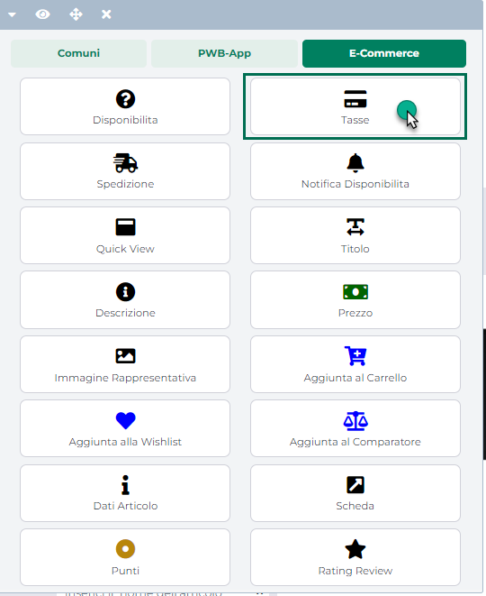
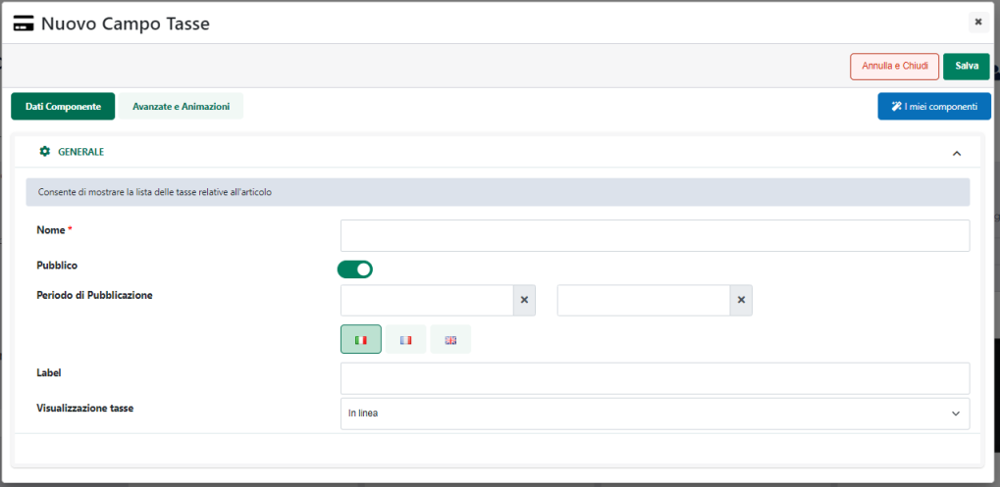
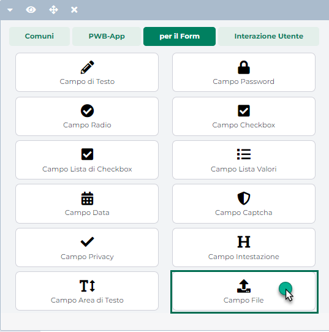

# NATURE

La sezione "**Nature**" accessibile dalla voce di menu ***"Catalogo --
Gestione Articoli"***, consente di visualizzare l'elenco delle "Nature
Articolo" codificate lato gestionale e correttamente gestite all'interno
del sito.

All'interno di questa sezione verrà quindi visualizzata la maschera
"**Lista delle Nature Articolo**"

{width="5.707638888888889in"
height="3.4805555555555556in"}

contenente l'elenco di tutte le Nature Articolo definite all'interno del
gestionale e gestite anche all'interno del proprio sito ecommerce.

Per ciascuna delle Nature presenti in elenco è indicato:

- L'identificativo Passweb -- colonna **ID**

- Il codice gestionale -- colonna **Codice**

- La descrizione -- colonna **Descrizione**

Il campo di ricerca attivabile cliccando sulla lente di ingrandimento,
presente in testata di ogni singola colonna, consente di filtrare i dati
in griglia sulla base dei valori presenti all'interno della colonna
stessa.

Una volta impostato un filtro di ricerca, per poterlo poi eliminare sarà
sufficiente cliccare sull'icona raffigurante una piccola lente di
ingrandimento con un -- all'interno (
{width="7.777777777777778e-2in"
height="9.722222222222222e-2in"} ) che comparirà in testata alla colonna
in corrispondenza della quale è stato impostato il filtro stesso.

Infine è anche possibile ordinare, in maniera crescente e/o decrescente,
gli elementi in griglia cliccando semplicemente sull'icona raffigurante
due piccole frecce posta anch' essa in testata ad ogni singola colonna
della griglia (
{width="0.12361111111111112in"
height="0.14930555555555555in"} )

I pulsanti presenti nella contestuale barra degli strumenti consentono
rispettivamente di:

**Modifica Natura** (
{width="0.5777777777777777in"
height="0.175in"} ): consente di gestire la descrizione in Italiano e in
Lingua associata alla Natura Articolo attualmente selezionata in elenco.

Cliccando su questo pulsante verrà infatti visualizzata la maschera
"**Modifica Natura Articolo**"

{width="5.961111111111111in"
height="3.5256944444444445in"}

attraverso cui poter gestire, nelle varie lingue, la descrizione della
relativa Natura Articolo.

In questo senso occorre ricordare anche che le descrizioni in italiano
delle Nature Articolo potranno essere o meno aggiornate automaticamente
alla sincronizzazione con i relativi valori presenti nel gestionale,
dipendentemente da come è stato impostato il parametro "**Aggiornamento
descrizioni in italiano dal Gestionale -- Tabella Nature Articolo**"
presente alla pagina "*Configurazione -- Parametri di Sincronizzazione*"
del Wizard.

**NOTA BENE:** per maggiori informazioni relativamente al parametro in
oggetto si veda anche la sezione "Configurazione -- Parametri di
Sincronizzazione" di questo manuale.

A differenza delle descrizioni in italiano, **quelle in lingua non
potranno invece essere prese direttamente dal gestionale e dovranno per
forza di cose essere gestite all'interno di questa sezione del Wizard.**

**Esporta** (
{width="0.33125in"
height="0.175in"} ): consente di esportare, all'interno di un apposito
file .csv, le descrizioni delle Nature attualmente presenti in elenco.
Cliccando su questo pulsante verrà infatti visualizzata la maschera
"**Esportazione Nature**" all'interno della quale poter configurare
l'esportazione dei dati.

{width="5.928472222222222in"
height="3.49375in"}

Nel caso di sito in multilingua è possibile selezionare, tra quelle
attualmente gestite, la lingua in relazione alla quale dovranno essere
esportati i dati (campo **Lingua**)

Il campo **Separatore** consente invece di indicare, selezionandolo,
dall'apposito menu a tendina, il carattere che dovrà essere utilizzato
all'interno del file di esportazione come separatore per i vari campi.

I campi presenti all'interno del file di esportazione saranno ovviamente
l'identificativo Passweb della relativa Natura, il codice gestionale e
la corrispondente descrizione nella lingua selezionata

**Importa** (
{width="0.3506944444444444in"
height="0.175in"} ): consente di importare in maniera massiva,
utilizzando un apposito file .csv o .txt, le descrizioni di tutte le
Nature attualmente presenti in elenco.

Cliccando su questo pulsante verrà infatti visualizzata la maschera
"**Importazione Nature**"

{width="5.928472222222222in"
height="3.49375in"}

all'interno della quale poter configurare l'importazione dei dati in
oggetto. In particolare il campo

- **File (csv-txt)**: consente di indicare il file txt o csv contenente
  le descrizioni che dovranno essere associate alle rispettive Nature

- **Lingua:** consente di indicare la lingua del sito a cui dovranno
  fare riferimento i dati presenti all'interno del file di importazione

- **Separatore:** consente di indicare, selezionandolo, dall'apposito
  menu a tendina, il carattere che è stato utilizzato all'interno del
  file di importazione come separatore per i vari campi

Affinchè la procedura di import possa funzionare in maniera corretta è
necessario che il file soddisfi determinate regole. Nello specifico:

- Il file da importare deve avere estensione .csv o .txt

- Il carattere separatore dei vari campi deve essere esattamente quello
  indicato all'interno del campo "**Separatore**" presente nel form di
  importazione.

- E' necessario creare file distinti per le diverse lingue gestite
  all'interno del sito. In fase di importazione sarà poi possibile, come
  visto, indicare la specifica lingua cui il file fa riferimento

- L'intestazione, ossia la prima riga del file, deve contenere i due
  record "codice" e "descrizione" separati dal carattere indicato in
  all'interno del campo "**Separatore**"

- Il primo campo del file dovrà essere obbligatoriamente il **Codice
  della Natura**. La presenza di questo campo è ovviamente
  **indispensabile** in quanto è quella che assicurerà poi
  l'associazione dei dati alle relative Nature.

> **NOTA BENE:** se all'interno del file da importare non è presente il
> Codice della Natura e/o se i codici inseriti all'interno di questo
> campo non coincidono con quelli effettivamente presenti all'interno
> del sito la procedura di import non valorizzerà, ovviamente, alcun
> campo dati

- **Il file di importazione deve soddisfare le specifiche del formato
  RFC4180.**

> **ATTENZIONE!** In questo senso è quindi necessario che il valore dei
> campi contenenti interruzioni di riga, e/o lo stesso carattere
> utilizzato anche come separatore sia necessariamente racchiuso da
> virgolette.
>
> Inoltre nel caso in cui il valore di un campo abbia al suo interno
> elementi racchiusi da doppi apici sarà necessario racchiudere tra
> virgolette oltre all'interno campo anche questi stessi elementi.

La Natura di appartenenza di uno specifico articolo potrà:

a)  essere pubblicata all'interno del sito in componenti quali il
    "Catalogo E-commerce", la "Scheda Prodotto", gli "Abbinati
    E-commerce" ecc..., utilizzando per questo il componente "Dati
    Articolo" opportunamente configurato. **In questo senso verrà
    pubblicata la Descrizione della Natura Articolo (e non il suo
    Codice)**

b)  essere utilizzata all'interno del componente "**Filtro/Ricerca
    Catalogo Ecommerce**" per realizzare appositi filtri di ricerca
    (che, anche in questo caso, prenderanno in considerazione la
    Descrizione della Natura e non il suo Codice).

