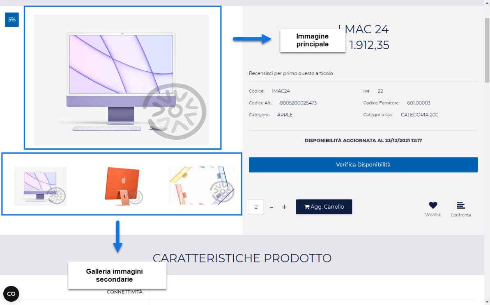

# LINEE ARTICOLO

La sezione **"Linee"** accessibile dalla voce di menu ***"Catalogo --
Gestione Articoli"*** consente di visualizzare e gestire,
dipendentemente dalla tipologia di sito considerato, le diverse linee
d'ordine.

**NOTA BENE:** nel caso di siti Ecommerce collegati a Mexal la sezione
"Gestione Linee" sarà visibile unicamente nel caso in cui sia stata
attivata la corrispondente funzionalità Mexal "Gestione Linee Articolo".

All'interno di questa pagina verrà quindi visualizzata la maschera
"**Lista delle Linee Articolo**" contenente l'elenco di tutte le linee
gestite per gli articoli presenti sul Web.

Il campo di ricerca attivabile cliccando sulla lente di ingrandimento,
presente in testata di ogni singola colonna, consente di filtrare i dati
in griglia sulla base dei valori presenti all'interno della colonna
stessa.

Una volta impostato un filtro di ricerca, per poterlo poi eliminare sarà
sufficiente cliccare sull'icona raffigurante una piccola lente di
ingrandimento con un -- all'interno (
 ) che comparirà in testata alla colonna
in corrispondenza della quale è stato impostato il filtro stesso.

Infine è anche possibile ordinare, in maniera crescente e/o decrescente,
gli elementi in griglia cliccando semplicemente sull'icona raffigurante
due piccole frecce posta anch' essa in testata ad ogni singola colonna
della griglia (
 )

I pulsanti presenti nella contestuale barra degli strumenti consentono
rispettivamente di:

**Modifica (**
 **) --** presente nella barra degli strumenti,
indipendentemente dal fatto di considerare un sito Ecommerce collegato a
Mexal oppure ad uno dei gestionali Horeca.

Consente di modificare, in ciascuna delle lingue attualmente gestite
all'interno del sito, la descrizione della linea attualmente selezionata
in elenco.

Cliccando su questo pulsante verrà infatti visualizzata la maschera
**"Modifica Linea Articolo"**

all'interno della quale poter appunto indicare, in ciascuna delle lingue
attualmente gestite all'interno del sito, una specifica descrizione.

**Tali descrizioni verranno poi utilizzate in fase di ordine come
identificativi delle varie linee.**

**ATTENZIONE!** **Nel caso di siti Ecommerce collegati a Mexal la
creazione e l'eliminazione delle varie linee articolo, così come
l'associazione di un articolo ad una linea piuttosto che ad un\'altra, è
demandata interamente al gestionale**.

In queste condizioni dunque per creare una nuova linea articolo, così
come per associare un articolo ad una linea, è necessario agire per
forza di cose da Mexal.

**NOTA BENE:** per maggiori informazioni relativamente alla funzionalità
"Gestione Linee Articolo" nei siti ecommerce collegati a Mexal, si veda
la corrispondente sezione "Configurazione Gestionale -- Mexal Parametri
Configurazione Gestionale -- Mexal Attivazione Passweb -- Funzionalità
Mexal Articoli -- Gestione Linee Articolo" di questo manuale.

Nel caso invece **di siti Ecommerce collegati ad uno dei gestionali
Ho.Re.Ca.** la gestione delle linee (creazione ed eliminazione) così
come l'associazione di un articolo ad una linea dovrà avvenire
interamente all'interno del Wizard di Passweb.

In questo senso gli ulteriori due pulsanti presenti, solo per siti
collegati ad un gestionale Ho.Re.Ca., nella barra degli strumenti
consentono rispettivamente di:

**Elimina (**
 **):** consente di eliminare la linea
attualmente selezionata in elenco.

**Nuova Linea** **(**
 **)**: consente di codificare una nuova
linea articolo

Cliccando su questo pulsante verrà quindi visualizzata la maschera Nuova
Linea Articolo

all'interno della quale poter indicare il Codice della linea che si sta
realizzando (campo **Codice**) e la sua descrizione (campo
**Descrizione**) descrizione questa che verrà poi visualizzata sul sito
in fase di checkout nel caso in cui dovessero essere presenti in ordine
articoli appartenenti a linee diverse.

**NOTA BENE:** per maggiori informazioni relativamente alla funzionalità
"Gestione Linee Articolo" nei siti ecommerce collegati ad un gestionale
Ho.Re.Ca., si veda la corrispondente sezione "Configurazione Gestionale
-- Ho.Re.Ca. Parametri Configurazione Gestionale -- Funzionalità di
gestione articoli -- Gestione Linee Articolo" di questo manuale.

**Esporta** (
 ): consente di esportare, all'interno di un apposito
file .csv, le descrizioni delle Linee Articolo attualmente presenti in
elenco. Cliccando su questo pulsante verrà infatti visualizzata la
maschera "**Esportazione Linee Articolo**" all'interno della quale poter
configurare l'esportazione dei dati.

Nel caso di sito in multilingua è possibile selezionare, tra quelle
attualmente gestite, la lingua in relazione alla quale dovranno essere
esportati i dati (campo **Lingua**)

Il campo **Separatore** consente invece di indicare, selezionandolo,
dall'apposito menu a tendina, il carattere che dovrà essere utilizzato
all'interno del file di esportazione come separatore per i vari campi.

I campi presenti all'interno del file di esportazione saranno ovviamente
il codice della Linea Articolo e la relativa descrizione nella lingua
selezionata

**Importa** (
 ): consente di importare in maniera massiva,
utilizzando un apposito file .csv o .txt, le descrizioni di tutte le
Linee Articolo attualmente presenti in elenco.

Cliccando su questo pulsante verrà infatti visualizzata la maschera
"**Importazione Linee Articolo**"

all'interno della quale poter configurare l'importazione dei dati in
oggetto. In particolare il campo

- **File (csv-txt)**: consente di indicare il file txt o csv contenente
  le descrizioni che dovranno essere associate alle rispettive Linee
  Articolo

- **Lingua:** consente di indicare la lingua del sito a cui dovranno
  fare riferimento i dati presenti all'interno del file di importazione

- **Separatore:** consente di indicare, selezionandolo, dall'apposito
  menu a tendina, il carattere che è stato utilizzato all'interno del
  file di importazione come separatore per i vari campi

Affinchè la procedura di import possa funzionare in maniera corretta è
necessario che il file soddisfi determinate regole. Nello specifico:

- Il file da importare deve avere estensione .csv o .txt

- Il carattere separatore dei vari campi deve essere esattamente quello
  indicato all'interno del campo "**Separatore**" presente nel form di
  importazione.

- E' necessario creare file distinti per le diverse lingue gestite
  all'interno del sito. In fase di importazione sarà poi possibile, come
  visto, indicare la specifica lingua cui il file fa riferimento

- L'intestazione, ossia la prima riga del file, deve contenere i due
  record "codice" e "descrizione" separati dal carattere indicato in
  all'interno del campo "**Separatore**"

- Il primo campo del file dovrà essere obbligatoriamente il **Codice
  della Linea Articolo**. La presenza di questo campo è ovviamente
  **indispensabile** in quanto è quella che assicurerà poi
  l'associazione dei dati alle relative Linee.

> **NOTA BENE:** se all'interno del file da importare non è presente il
> Codice della Linea Articolo e/o se i codici inseriti all'interno di
> questo campo non coincidono con quelli effettivamente presenti
> all'interno del sito la procedura di import non valorizzerà,
> ovviamente, alcun campo dati

- **Il file di importazione deve soddisfare le specifiche del formato
  RFC4180.**

> **ATTENZIONE!** In questo senso è quindi necessario che il valore dei
> campi contenenti interruzioni di riga, e/o lo stesso carattere
> utilizzato anche come separatore sia necessariamente racchiuso da
> virgolette.
