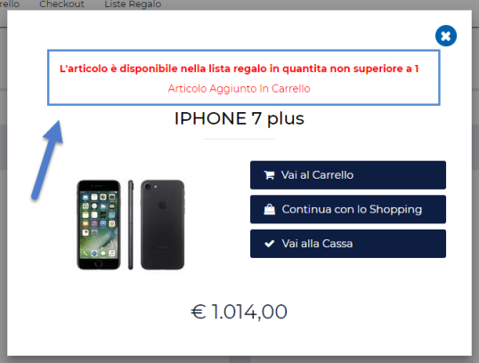
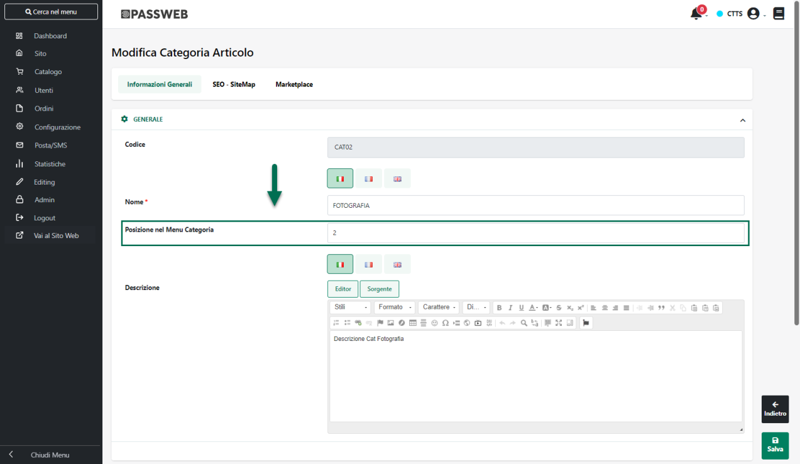
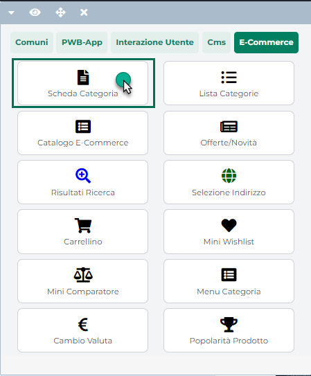

# RICERCA ARTICOLO SU AMAZON

Il pulsante **Ricerca Articolo su Amazon** (
 ) presente nella parte alta della
maschera "**Gestione Liste di Vendita"** accessibile dalla voce di menu
***"Catalogo -- Amazon"***, consente di effettuare, direttamente dal
Wizard del proprio sito Passweb, delle ricerche su uno dei Marketplace
Amazon gestiti, in maniera tale da ottenere informazioni che possono poi
rivelarsi particolarmente utili (es. codici ASIN) per facilitare la
messa in vendita dei prodotti, soprattutto nel momento in cui gli
articoli da pubblicare dovessero essere già presenti all'interno del
Marketplace rendendo quindi necessario, in fase di pubblicazione, il
fatto di dover agganciare la loro scheda prodotto.

I campi presenti all'interno del form "**Ricerca Articoli su Amazon**"
consento di impostare i parametri di ricerca

In particolare dunque il campo:

- **Identificativo:** consente di impostare il codice (EAN / ASIN / UPC)
  identificativo dell'articolo da ricercare all'interno del Marketplace
  Amazon

- **Tipo di Identificativo:** consente di impostare, selezionandolo dal
  relativo menu a tendina. la tipologia del codice articolo inserito
  all'interno del precedente campo

- **Testo:** consente di impostare un testo descrittivo dell'articolo da
  ricercare su Amazon

- **Marketplace:** consente di impostare, selezionandolo dal relativo
  menu a tendina, lo specifico Marketplace su cui dovrà essere
  effettuata, secondo i parametri impostati nei precedenti campi, la
  ricerca articoli

Il pulsante "**Ricerca**" presente nella parte bassa della maschera
consentirà di avviare, secondo i parametri impostati, la ricerca sul
Marketplace indicato.

Per ciascuno dei risultati ottenuti verranno prelevate dalla relativa
scheda Amazon e riportate all'interno del Wizard del proprio sito
Passweb le seguenti informazioni:

- Immagine principale dell'Articolo

- Titolo dell'articolo

- Codice ASIN

- Codice ASIN Parent (solo per articoli a taglie / colori e considerati
  quindi come figli di uno stesso articolo padre)

- Specifiche prodotto (es. Brand, Manufacturer, Model, Product Group
  ...)

- Prezzo dell'articolo

**ATTENZIONE!** **In merito alle funzionalità di ricerca attivabili da
questa sezione del Wizard Passweb, Amazon stessa ritorna un massimo di
soli 10 risultati.**

Nel momento in cui, dunque, dovessero essere effettuate delle ricerche
generiche, inserendo ad esempio un solo termine di ricerca (es. gomma)
all'interno del campo testo, tra i risultati ottenuti potrebbe non
essere presente l'articolo desiderato, sebbene questo sia effettivamente
presente sul Marketplace.

In questo senso è quindi consigliabile effettuare sempre ricerche il più
possibile mirate verso l'articolo o gli articoli per cui si desiderano
ottenere determinate informazioni.

