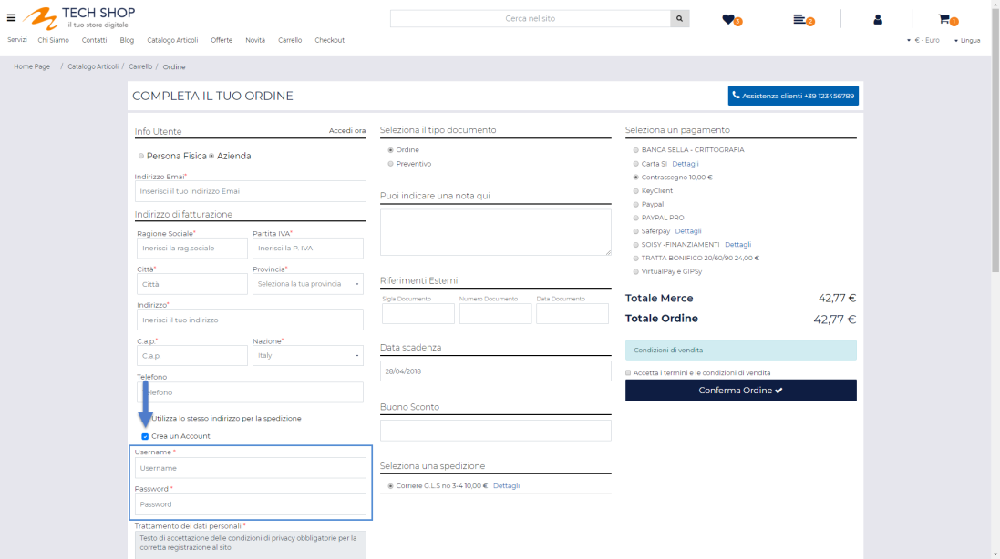
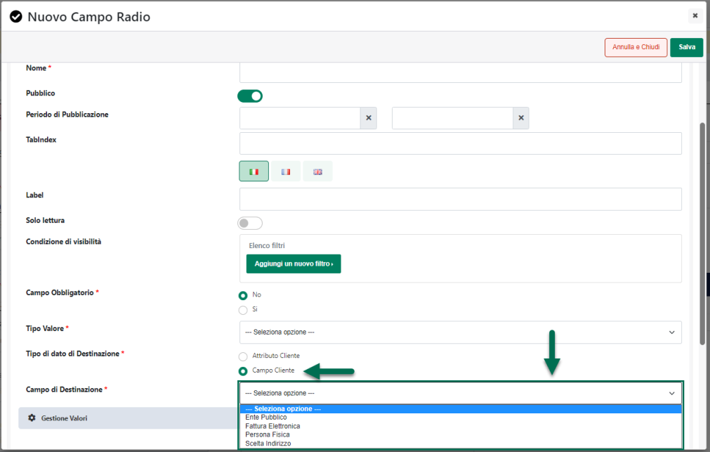

# CONFIGURAZIONE

Disponibile per le seguenti piattaforme:

- **Facebook Catalog**

- **Google Merchant**

- **Magento**

- **Prestashop**

All'interno di questa sezione è possibile selezionare la specifica
piattaforma da integrare e impostare i relativi parametri di connessione

{width="5.792361111111111in"
height="3.422222222222222in"}

In particolare i campi presenti all'interno di questa maschera
consentono rispettivamente di:

**Descrizione:** consente di assegnare un'etichetta identificativa
all'Account che si sta configurando. Utile per poter riconoscere
facilmente l'Account in questione nelle successive fasi di pubblicazione
degli articoli sulla relativa piattaforma

**Marketplace:** consente di indicare la specifica piattaforma da
integrare con il proprio sito Passweb. E' possibile selezionare uno dei
seguenti valori:

- **Facebook Catalog:** consente di integrare il proprio sito Passweb
  con Facebook in modo tale da poter esportare gli articoli presenti
  all'interno del proprio sito sul social network creando così un
  catalogo dinamico da poter pubblicare all'interno di una pagina
  Facebook e / o utilizzare per realizzare specifiche inserzioni
  pubblicitarie.

- **Google Merchant:** consente di integrare il proprio sito Passweb con
  Google Merchant in modo tale a poter esportare gli articoli presenti
  all'interno del proprio sito sulla relativa piattaforma creando un
  catalogo dinamico da poter utilizzare per realizzare specifiche
  inserzioni pubblicitarie

> **ATTENZIONE!** L'integrazione con Facebook e con Google Merchant
> consente di esportare gli articoli presenti all'interno del proprio
> sito (tutti o in parte) sulla relativa piattaforma decidendo che tipo
> di informazioni trasferire (prezzo, descrizioni, immagini, attributi
> ...) e di aggiornare automaticamente, alla sincronizzazione, i dati
> degli articoli presenti nel relativo catalogo. **La creazione di
> specifiche inserzioni pubblicitarie, tanto in Facebook quanto in
> Google, è un operazione a pagamento che dovrà essere effettuata,
> completando le relative configurazioni, direttamente sulla specifica
> piattaforma** (Facebook Business Manager / Google Merchant / AdWords).
>
> Ovviamente eventuali inserzioni pubblicitarie condurranno l'utente
> interessato al proprio sito Passweb dove potrà eventualmente
> completare l'acquisto del prodotto pubblicizzato.

- **Magento 2 / Prestashop:** consente di integrare il proprio sito
  Passweb con la relativa piattaforma CMS. Grazie a questa integrazione
  sarà possibile:

  - Esportare gli articoli presenti su Passweb in maniera tale da
    alimentare il catalogo dei prodotti gestiti su Magento / Prestashop,
    decidendo che tipo di informazioni trasferire (prezzo, immagini,
    descrizioni, attributi ...) e aggiornando automaticamente, in fase
    di sincronizzazione, queste stesse informazioni

  - Importare in Passweb (e conseguentemente nel gestionale Passepartout
    collegato) ordini effettuati direttamente sul sito Magento /
    Prestashop. L'inserimento di un ordine Magento / Prestashop sul
    gestionale Passepartout comporterà, eventualmente, la creazione
    automatica della relativa anagrafica cliente e di eventuali articoli
    non ancora presenti nella base dati del gestionale.

Una volta selezionata la piattaforma da integrare sarà poi necessario
compilare correttamente i parametri di connessione presenti all'interno
della sezione "**Credenziali**", parametri questi che, ovviamente,
varieranno in relazione alla piattaforma indicata.

{width="5.792361111111111in"
height="3.422222222222222in"}

I pulsanti presenti nella parte bassa della pagina consentono
rispettivamente di:

- **Salva**: consente di salvare le impostazioni di configurazione
  dell'Account in esame

- **Test Connessione**: consente di avviare un test di connessione tra
  Passweb e la piattaforma indicata nell' Account in esame

Ovviamente prima di effettuare il test di connessione sarà necessario
aver impostato correttamente, **e salvato**, tutti i parametri di
configurazione richiesti dallo specifico account.

Fatto questo il risultato del test connessione verrà visualizzato
attraverso un piccolo pop up presente nella parte bassa della pagina

**ATTENZIONE!** Nel caso in cui la piattaforma con cui realizzare
l'integrazione dovesse essere Prestashop o Magento, oltre al test di
connessione effettuabile mediante l'apposito pulsante sarà necessario
verificare anche che le API della relativa piattaforma siano
effettivamente contattabili e rispondano in maniera corretta

