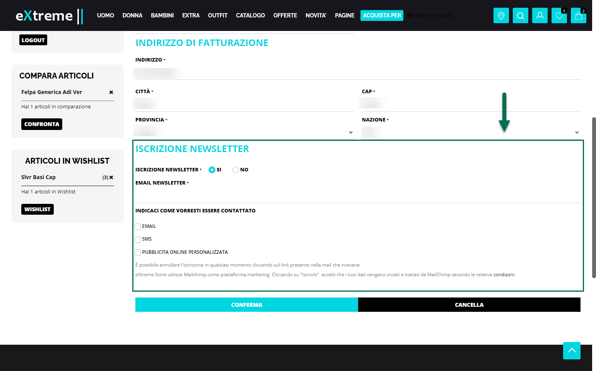
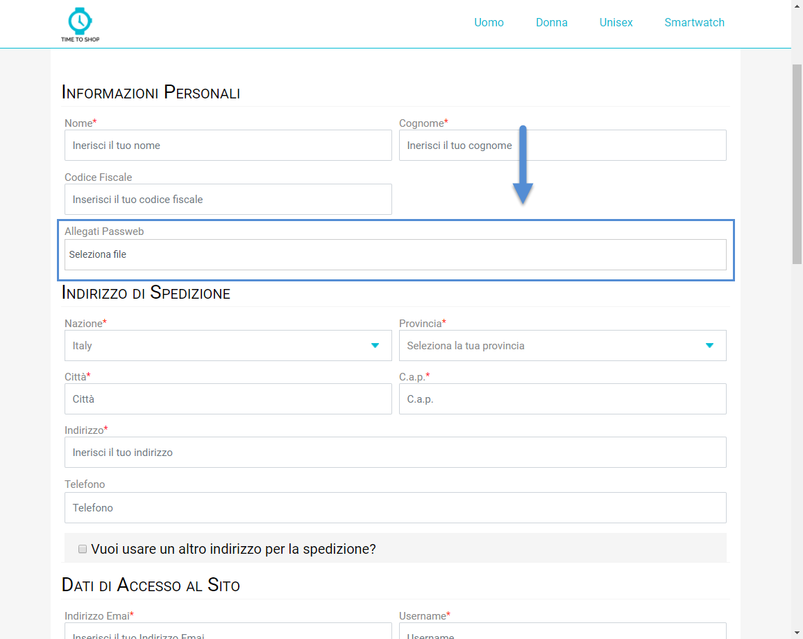
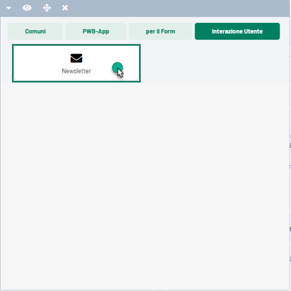
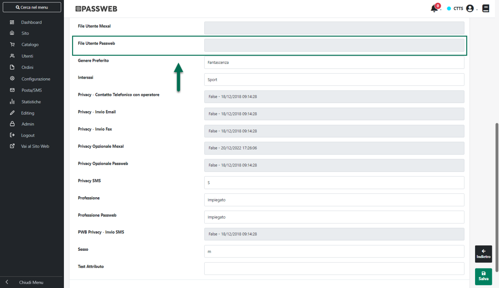
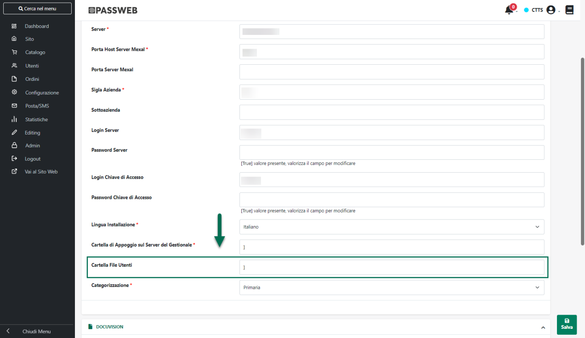

# LISTE DI VENDITA

Il pulsante **Liste di Vendita** (
 ) presente nella parte alta della
maschera "**Gestione Liste di Vendita"** consente di visualizzare e
gestire tutte le Liste di Vendita attualmente codificate, oltre che
ovviamente di crearne di nuove.

All'interno della tabella "**Elenco delle Liste di Vendita**" verranno
quindi visualizzate tutte le liste attualmente configurate.

Il campo di ricerca attivabile cliccando sulla lente di ingrandimento,
presente in testata alle varie colonne, consente di filtrare i dati in
griglia sulla base dei valori presenti all'interno della colonna stessa.

Una volta impostato un filtro di ricerca, per poterlo poi eliminare sarà
sufficiente cliccare sull'icona raffigurante una piccola lente di
ingrandimento con un -- all'interno (
 ) che comparirà in testata alla colonna
in corrispondenza della quale è stato impostato il filtro stesso.

L' icona raffigurante due piccole frecce posta in testata ad ogni
singola colonna (
 ) consente invece di ordinare in maniera
crescente e/o decrescente, sulla base dei dati presenti all'interno di
quella stessa colonna, i dati in tabella

Il pulsante "**Colonne**" (
 ), presente in testata, in
corrispondenza dell'ultima colonna della griglia, consente di decidere
quali informazioni dovranno essere visualizzate direttamente in tabella.
Cliccando su questo pulsante verrà infatti visualizzata la maschera
"**Colonne**"

mediante la quale poter decidere quale campo attivare / disattivare e
conseguentemente quale informazione mostrare / nascondere.

I dati non presenti direttamente in tabella potranno comunque essere
visualizzati tra le "**ulteriori informazioni**" della lista di vendita
disponibili cliccando sul pulsante raffigurante una piccola i (
 ) posto in corrispondenza di ogni
singola riga

In definitiva dunque, all'interno di questa maschera sarà possibile
visualizzare / nascondere per ogni singola lista le seguenti
informazioni:

- **Lista di vendita:** nome assegnato alla relativa Lista --
  visualizzato a default

- **ID:** identificativo della lista di vendita

- **Marketplace:** tipologia del marketplace associato alla Lista

- **Totale Articoli:** numero complessivo di articoli presenti in Lista

- **Articoli in vendita:** numero di articoli effettivamente messi in
  vendita

- **Quantità venduta:** numero di articoli venduti

- **Store:** identificativo dello store sul corrispondente marketplace

- **Inserzione:** nome dell'Inserzione collegata alla Lista in esame

Tra le "ulteriori informazioni" inoltre troveremo sempre anche un breve
riepilogo relativo all'ultima pubblicazione effettuata per la lista in
oggetto. Nello specifico la voce:

- **Azione**: indica la tipologia di operazione effettuata (Arresto,
  Pubblicazione ...)

- **Totale**: indica il numero complessivo di articoli coinvolti
  nell'operazione in esame

- **Successi**: indica il numero complessivo di articoli che sono stati
  pubblicati/arrestati/modificati con successo

- **Errori**: indica il numero complessivo di articoli che hanno
  generato errori e che non sono quini stati
  pubblicati/arrestati/modificati

- **Warning**: indica il numero complessivo di articoli che sono stati
  pubblicati/arrestati/modificati pur avendo generato dei Warning

- **Data Operazione**: indica la data in cui è stata effettuata
  l'operazione in esame

Selezionando una delle liste presenti in elenco verranno poi
visualizzati, nella barra degli strumenti, altri pulsanti grazie ai
quali poter effettuare diverse azioni.

Nello specifico il pulsante:

**Elimina Lista di Vendita** (
 ): consente di eliminare la lista di
vendita attualmente selezionata in elenco

**ATTENZIONE:** eliminando una lista di vendita gli articoli già
pubblicati sulla piattaforma terza continueranno comunque a vivere come
entità a se stanti all'interno della piattaforma stessa.

**Modifica Lista di Vendita** (
 ): consente di modificare le caratteristiche della
lista di vendita attualmente selezionata in elenco.

**ATTENZIONE!** E' possibile modificare il nome della lista di vendita
ma non l'inserzione cui la lista stessa è stata collegata

**Aggiungi Lista di Vendita** (
 ): consente di creare una nuova lista di vendita.

Per maggiori informazioni a come poter creare una nuova lista di vendita
si veda il successivo capitolo di questo manuale

**Elenco Lista Articoli** (
 ): consente di gestire l'elenco degli articoli da
associare alla lista e che potranno quindi essere pubblicati sulla
piattaforma terza

**Elenco Tutti Articoli** (
 ): consente di visualizzare un elenco di
tutti gli articoli presenti all'interno di tutte le liste di vendita
attualmente codificate

**ATTENZIONE!** gli articoli presenti all'interno di questo elenco
complessivo possono essere gestiti (modificati, eliminati dalla lista di
appartenenza, pubblicati ecc...) esattamente allo stesso modo di come
avverrebbe nel momento in cui dovessimo essere all'interno di una
specifica lista di vendita.

Per maggior informazioni in merito si vedano dunque i successivi
capitoli di questo manuale

**Lista Pubblicazioni** (
 ): consente di visualizzare un elenco
delle ultime operazioni di pubblicazione articoli relative alla Lista di
Vendita attualmente selezionata in elenco.

Cliccando su questo pulsante verrà infatti visualizzata la maschera
"**Pubblicazioni Lista di Vendita -- Nome Lista**"

contenete l'elenco delle ultime pubblicazioni effettuate. Per ogni
pubblicazione presente in elenco sono indicati.

- il numero di articoli coinvolti nella pubblicazione -- colonna
  "**Totale**"

- per quanti articoli tra quelli presenti in lista l'operazione di
  pubblicazione in esame ha avuto esito positivo (colonna
  "**Success**"), per quanti ha prodotto dei "Warning" (colonna
  "**Warning**" ), che non hanno comunque impedito di portare a termine
  l'operazione, e per quanti invece si è riscontrato un errore (colonna
  "**Error**") che, di fatto, ha impedito di portare a termine
  l'operazione

- il tipo di azione (Arresto, Pubblicazione...) relativo a quella
  specifica pubblicazione -- colonna "**Azione**"

- il metodo di pubblicazione utilizzato -- colonna "**Metodo
  Pubblicazione**"

**ATTENZIONE!** i dati presenti all'interno di questa griglia sono
limitati al periodo temporale definito in corrispondenza del parametro
"**Tempo di conservazione dei log del Web Server**" presente alla pagina
"**Sito -- Preferenze**" del Wizard (tab "**Configurazione**" sezione
"**Sistema**")

Il pulsante "**Visualizza Dettaglio**" (
 ), presente solo dopo aver selezionato
una delle pubblicazioni in elenco consente di accedere invece alla
maschera "**Dettaglio Pubblicazione Lista di Vendita -- Nome Lista**"

all'interno della quale sarà possibile visualizzare tutti gli articoli
presenti, al momento della pubblicazione, in quella specifica lista di
vendita e, per ciascuno di essi, cliccando sull'icona raffigurante una
piccola i sarà anche possibile visualizzare il dettaglio del relativo
log

##### NUOVA LISTA DI VENDITA

Per creare una nuova Lista di Vendita è necessario cliccare sul pulsante
**Aggiungi Lista di Vendita** (
 ) presente all'interno della maschera "**Elenco delle
Liste di Vendita**" esaminata nel precedente capitolo di questo manuale.

Cliccando su questo pulsante verrà infatti visualizzata la maschera
**"Dati Lista di Vendita"**

attraverso cui poter indicare un valore per i seguenti parametri:

**Nome:** consente di assegnare un nome alla Lista di Vendita che si sta
realizzando

**Inserzione:** consente di selezionare la specifica Inserzione (con il
relativo insieme di regole) che dovrà poi essere utilizzata per
pubblicare gli articoli presenti all'interno della lista in esame

**Regole di Vendita:** consente di associare alla Lista che si sta
realizzando una specifica Regola di Vendita.

E' possibile selezionare una delle Regole di Vendita precedentemente
codificate oppure definirne una nuova operando direttamente da questa
stessa maschera.

In quest'ultimo caso sarà necessario impostare il campo in esame sul
valore "**Custom**" e definire poi, mediante i successivi parametri, i
prodotti da aggiungere alla Lista in esame (e a tutte quelle che
utilizzeranno la stessa regola) oltre che, ovviamente, l'azione che
dovrà essere eseguita nel momento in cui nuovi articoli dovessero
soddisfare il filtro impostato.

Per maggiori informazioni relativamente alla gestione delle Regole di
Vendita si veda anche il successivo capitolo di questo manuale.

**Filtro articolo:** consente di impostare un Filtro Articoli mediante
il quale poter individuare i prodotti da aggiungere automaticamente alla
Lista di Vendita (per maggiori informazioni relativamente alla gestione
dei filtri articolo si veda anche quanto indicato all'interno del
capitolo "*Utenti -- Siti Ecommerce -- Gruppi Utente Sito -- Filtri
Utente e Filtri Articolo -- Filtri Articolo*" di questo manuale)

**ATTENZIONE!** L'aggiunta automatica, alla lista di vendita, degli
articoli che soddisfano il filtro potrà avvenire in due diversi momenti:

- al salvataggio della lista di vendita

- a seguito di una sincronizzazione sito -- gestionale in cui si
  dovessero individuare articoli nuovi e/o variati (lato gestionale o
  lato Passweb) che soddisfano il filtro impostato

Gli articoli aggiunti automaticamente potranno poi essere identificati,
rispetto a quelli aggiunti in maniera manuale, dal bordo grigio della
relativa riga (gli articoli aggiunti manualmente avranno invece un bordo
azzurro) oltre che dal valore presente nella corrispondente colonna
della tabella (quella identificata dall'icona
 )

**ATTENZIONE! Gli articoli aggiunti automaticamente ad un lista di
vendita non possono essere gestiti in maniera manuale.** **Ciò significa
dunque che questi stessi articoli potranno, eventualmente, essere
eliminati dalla lista di vendita solo nel momento in cui non dovessero
più soddisfare il filtro impostato**.

Un'ultima cosa di fondamentale importanza da tenere sempre in
considerazione è che se un articolo aggiunto, inizialmente, alla lista
di vendita in maniera manuale dovesse, ad un certo punto, soddisfare un
eventuale filtro di aggiunta da quel momento in avanti verrà trattato
esattamente come tutti gli altri articoli aggiunti in maniera
automatica.

**Aggiunta di un articolo alla Lista di Vendita:** consente di indicare
l'azione da eseguire nel momento in cui dovessero esserci nuovi articoli
e/o articoli variati (lato gestionale o lato Passweb) rispetto
all'ultima sincronizzazione, che soddisfano il filtro impostato e che
dovrebbero quindi essere aggiunti alla lista in esame

E' possibile selezionare uno dei seguenti valori:

- **Nessuna Azione:** in questo caso, se anche a seguito di una
  sincronizzazione sito -- gestionale dovessero esserci nuovi articoli
  e/o articoli variati (lato gestionale o lato Passweb), che soddisfano
  il filtro impostato mediante il precedente parametro, non verrà
  comunque eseguita nessuna azione e, di fatto, non verrà quindi
  aggiunto alla lista di vendita nessun nuovo prodotto

> Eventuali muovi articoli dovranno quindi essere inseriti nella Lista
> di Vendita in maniera manuale

- **Aggiungi nella Lista di Vendita:** selezionando questa opzione se, a
  seguito di una sincronizzazione sito -- gestionale, dovessero esserci
  nuovi articoli e/o articoli variati (lato gestionale o lato Passweb)
  che soddisfano il filtro impostato, questi stessi articoli verranno
  automaticamente aggiunti alla Lista di Vendita e, volendo, potrebbero
  anche essere automaticamente pubblicati all'interno della relativa
  piattaforma.

**Rimozione di un articolo:** consente di indicare l'azione da eseguire
nel momento in cui dovessero essere rimossi degli articoli da Passweb o
dovessero esserci articoli variati (lato gestionale o lato Passweb)
rispetto all'ultima sincronizzazione, che non soddisfano più il filtro
impostato e che dovrebbero quindi essere rimossi dalla lista in esame

E' possibile selezionare uno dei seguenti valori:

- **Nessuna Azione:** in questo caso, se a seguito di una
  sincronizzazione sito -- gestionale dovessero essere rimossi da
  Passweb determinati articoli che prima erano stati inseriti nelle
  lista di vendita, questi verranno ovviamente eliminati anche dalla
  lista stessa ma non verranno arrestati sul corrispondente marketplace.

> Se invece, a seguito di una sincronizzazione sito -- gestionale
> dovessero esserci articoli variati (lato gestionale o lato Passweb)
> inseriti in lista e che non rispettano più il filtro impostato
> mediante il precedente parametro, non verrà eseguita, in relazione a
> tali articoli, nessuna azione e, di fatto, questi non verranno quindi
> né eliminati dalla lista né tanto meno verranno arrestati sul
> corrispondente marketplace.

- **Arresto dell'articolo dal Marketplace:** in questo caso se a seguito
  di una sincronizzazione sito -- gestionale dovessero essere rimossi da
  Passweb determinati articoli che prima erano stati inseriti nella
  lista di vendita o se, allo stesso modo dovessero esserci articoli
  variati (lato gestionale o lato Passweb) che non rispettano più il
  filtro impostato, questi verranno prima arrestati sul corrispondente
  marketplace e poi rimossi dalla lista di vendita

**ATTENZIONE! in ogni caso indipendentemente da come si deciderà di
impostare il parametro "Rimozione di un articolo" Passweb non andrà mai
a eliminare articoli pubblicati sul corrispondente marketplace
limitandosi, al massimo, ad eseguire su di essi l'azione di "Arresto"**

**Aggiornamento di un articolo:** consente di indicare l'azione da
eseguire nel momento in cui, a seguito di una sincronizzazione sito --
gestionale, gli articoli pubblicati mediante la lista in esame,
dovessero risultare "variati".

E' possibile selezionare uno dei seguenti valori:

- **Nessuna Azione:** in questo caso, nel momento in cui a seguito di
  una sincronizzazione sito -- gestionale gli articoli pubblicati
  mediante la lista in esame dovessero risultare "variati", non verrà
  eseguito nessun tipo di azione.

> In queste condizioni dunque eventuali aggiornamenti sulla piattaforma
> terza delle informazioni relative a questi articoli dovranno essere
> effettuati mediante una pubblicazione manuale o, eventualmente
> mediante l'applicazione di una determinata regola di sincronizzazione.

- **Modifica dell'articolo sul Marketplace**: in questo caso, nel
  momento in cui a seguito di una sincronizzazione sito -- gestionale
  gli articoli pubblicati mediante la lista in esame dovessero risultare
  "variati", verrà eseguito automaticamente l'aggiornamento, sulla
  piattaforma terza, delle informazioni relative a questi stessi
  articoli.

> **ATTENZIONE!** Nelle condizioni indicate verrà eseguita una
> transazione di "Modifica" per cui verranno aggiornate, per gli
> articoli coinvolti, tutte le informazioni gestite nelle specifiche
> dell'inserzione collegata alla Lista in esame, oltre ovviamente a
> prezzo e quantità.
>
> A tale operazione potrebbe poi andare ad aggiungersi anche
> l'applicazione di eventuali regole di "Modifica in Vendita" **che
> potrebbero quindi portare, a seguito della stessa sincronizzazione, ad
> un ulteriore pubblicazione sulla piattaforma terza degli stessi
> articoli** (magari però solamente con transazioni mirate di tipo
> "Prezzo" o "Quantità" volte ad aggiornare solo questo tipo di
> informazioni). Per comprendere meglio questo fatto consideriamo il
> seguente esempio

**[ESEMPIO]{.underline}**

Supponiamo che a seguito di una certa sincronizzazione:

- Gli articoli A e B risultino variati a livello di Descrizione
  (informazione questa gestita tra le specifiche dell'Inserzione
  collegata alla Lista di vendita in esame)

- L'articolo C risulti variato a livello di Descrizione e Quantità

- L' articolo D non risulti variato rispetto all'ultima sincronizzazione
  utile ma risulti comunque avere una quantità diversa da quella
  attualmente pubblicata sul marketplace (ad esempio a seguito di un
  carico di lavorazione)

Supponiamo inoltre:

- Di aver impostato, in fase di configurazione della lista di vendita,
  il parametro "Aggiornamento di un articolo" sul valore "Modifica
  dell'articolo sul Marketplace"

- Di aver impostato una regola di "Modifica (parziale)" in vendita che
  riguarda la sola quantità degli articoli coinvolti nell'Inserzione

In queste condizioni a seguito della prossima sincronizzazione utile
verrà eseguita una prima transazione in "Modifica" degli articoli A, B e
C che verranno quindi "interamente" ripubblicati sulla piattaforma
terza. Verrà inoltre applicata la regola di "Modifica in vendita" per
cui verrà eseguita anche una transazione di tipo "Quantità" che
provvederà ad aggiornare nuovamente sulla piattaforma terza la sola
quantità dell' articoli C e anche quella dell'articolo D.

**Considera gli articoli come già in vendita:** consente, se abilitato,
di porre **tutti i nuovi articoli** aggiunti alla lista di vendita nello
stato di "**In attesa di aggancio**" rendendoli di fatto sensibili alle
regole di "Rimessa in vendita"

**ATTENZIONE!** Lo stato "**In attesa di aggancio**" può essere gestito
solo ed esclusivamente a livello di intera Lista di Vendita. Non sarà
quindi possibile trovare articoli in questo stato all'interno di una
lista per cui non sia stato attivato il parametro "**Considera gli
articoli come in vendita**"

Tipicamente il parametro in esame dovrà essere attivato nel momento in
cui si dovessero agganciare articoli già presenti sul marketplace (ma
non pubblicati tramite Passweb) mediante l'applicazione di una regola di
Modifica in Vendita.

E' chiaro dunque che se l'esigenza dovesse essere quella di agganciare
un articolo già presente sul marketplace ma non pubblicato da Passweb
mediante una regola di modifica in vendita, questo stesso articolo
dovrebbe prima di tutto essere pubblicato tramite Passweb tramite
l'applicazione di una regola di pubblicazione o tramite una
pubblicazione manuale. Solo a questo punto infatti il prodotto potrebbe
poi essere modificato mediante una regola di rimessa in vendita.

Lo stato "In attesa di aggancio" consente di saltare tutti questi
passaggi considerando, da subito, l'articolo come già presente sul
marketplace (anche se non pubblicato inizialmente da Passweb) e quindi
immediatamente sensibile all'applicazione di una eventuale regola di
modifica in vendita

**ATTENZIONE!** nel momento in cui si dovesse decidere di associare ad
una Lista di Vendita una delle Regole già codificate (e magari
utilizzata anche per altre Liste), eventuali variazioni apportate ai
parametri appena analizzati verranno salvate a livello di Regola e si
ripercuoteranno quindi anche su eventuali altre Liste collegate alla
Regola stessa.

Una volta creata una Lista di Vendita sarà poi necessario definire
l'insieme degli articoli che andranno a comporre la lista stessa.

##### ASSOCIAZIONE DEGLI ARTICOLI AD UNA LISTA DI VENDITA

Per definire l'insieme degli articoli che andranno a comporre una
determinata Lista di Vendita è possibile procedere in due modi diversi:

- In maniera **automatica** mediante l'applicazione di un filtro
  articoli definito in fase di configurazione della lista stessa

- In maniera **manuale** andando quindi a selezionare direttamente i
  vari prodotti da aggiungere

Gli articoli aggiunti automaticamente potranno poi essere identificati,
rispetto a quelli aggiunti in maniera manuale, dal bordo grigio della
relativa riga (gli articoli aggiunti manualmente avranno invece un bordo
azzurro) oltre che dal valore presente nella corrispondente colonna
della tabella (quella identificata dall'icona
 )

**ATTENZIONE! Gli articoli aggiunti automaticamente ad un lista di
vendita non possono essere gestiti in maniera manuale. Ciò significa
dunque che questi stessi articoli potranno, eventualmente, essere
eliminati dalla lista di vendita solo nel momento in cui non dovessero
più soddisfare il filtro impostato**.

Per maggiori informazioni relativamente a come poter aggiungere
automaticamente articoli ad una lista di vendita si rimanda a quanto
indicato nel precedente capitolo di questo manuale.

Per quel che riguarda invece l'aggiunta manuale sarà necessario,
innanzitutto, selezionare la lista desiderata tra quelle presenti in
elenco e cliccare poi sul pulsante "**Elenco Lista Articoli**",
accedendo così alla maschera "**Elenco Articoli della Lista di Vendita
-- Nome Lista**" evidenziata in figura.

I pulsanti presenti nella barra degli strumenti consentono
rispettivamente di:

- **Elimina Articolo** (
   ): consente di eliminare gli articoli
  attualmente selezionati dalla relativa lista di vendita. Tale pulsante
  sarà quindi visibile solo ed esclusivamente nel momento in cui gli
  articoli attualmente selezionati siano tutti a gestione manuale.

> **ATTENZIONE!** come precedentemente indicato, gli articoli aggiunti
> alla lista in maniera automatica potranno essere eliminati solo nel
> momento in cui non dovessero più soddisfare il filtro che ne ha
> determinato l'aggiunta (e quindi solo a seguito di una
> sincronizzazione sito -- gestionale)
>
> **In ogni caso l'eliminazione manuale di un articolo da una lista di
> vendita non esegue l'azione di Arresto né tanto meno lo rimuove
> fisicamente dal relativo marketplace**

- **Modifica Articolo** (
   ): visualizzato unicamente nel caso in cui sia
  selezionato un solo articolo tra quelli presenti in elenco.

> Permette di variare alcune impostazioni di pubblicazione dell'articolo
> selezionato.
>
> Cliccando su questo pulsante verrà infatti visualizzata la maschera
> "**Dati Articolo nella Lista di Vendita**"

> **ATTENZIONE!** I dati presenti all'interno della maschera "Dati
> Articolo nella Lista di Vendita" possono variare in relazione alla
> specifica piattaforma integrata

- **Aggiungi Articoli** (
   ): consente di accedere all'elenco degli articoli
  attualmente gestiti all'interno del proprio sito Passweb

> e di poter quindi selezionare tra di essi quelli da inserire
> all'interno della lista in oggetto.
>
> **ATTENZIONE! articoli di tipo campionario così come articoli con DBA
> potranno essere aggiunti ad una lista di vendita ma verranno
> considerati come articoli singoli e non verranno quindi esplosi i
> relativi componenti**.
>
> Nel caso in cui debbano essere pubblicati anche i singoli elementi di
> un campionario e/o di una DBA sarà quindi necessario esportare sulla
> piattaforma terza non solo l'articolo campionario ma anche i singoli
> componenti.
>
> Anche in questo la griglia in esame è a selezione multipla e il
> pulsante raffigurante una piccola lente di ingrandimento, presente in
> testata alle varie colonne, consente di filtrare i dati sulla base dei
> valori presenti all'interno della colonna stessa.
>
> Dopo aver selezionato uno o più articoli sarà quindi sufficiente
> cliccare sul pulsante "**Aggiungi**" presente nella contestuale barra
> degli strumenti per aggiungerli effettivamente alla lista in esame.
>
> **ATTENZIONE! Nel momento in cui un articolo inizialmente non
> pubblicato da Passweb dovesse essere ripubblicato a seguito, ad
> esempio, dell'applicazione di una regola automatica di pubblicazione,
> il suo prezzo verrà determinato sulla base delle impostazioni settate
> per l'inserzione collegata alla lista di vendita in cui si sta
> operando**

- **Filtri Avanzati** (
   ): consente di aprire una sezione di ricerca
  contenete un query builder utilizzabile per creare e customizzare
  filtri di ricerca per gli articoli presenti in lista.

> Per maggiori informazioni in merito a come poter costruire il proprio
> filtro di ricerca si rimanda a quanto indicato all'interno del
> capitolo "*Catalogo -- Gestione Articoli -- Articoli -- Anagrafica
> Articolo / Servizio*" di questo manuale

- **Log Articolo** (
   ): visualizzato unicamente nel caso in cui sia
  selezionato un solo articolo tra quelli presenti in elenco.

> Permette di accedere ai dettagli relativi alle operazioni di
> pubblicazione/arresto/modifica effettuate sul prodotto in esame.

- **Marketplace** (
   ): consente di accedere alla sezione di
  pubblicazione degli articoli sul relativo marketplace

Per maggiori informazioni relativamente alle azioni collegate a questi
ultimi due pulsanti si rimanda a quanto indicato nel successivo capitolo
di questo manuale.

##### GESTIONE LISTA DI VENDITA E PUBBLICAZIONE SULLA PIATTAFORMA TERZA

Come precedentemente evidenziato la maschera "**Elenco Articoli della
Lista di Vendita -- Nome Lista**" consente di visualizzare l'elenco
completo degli articoli attualmente presenti all'interno di quella
specifica lista di vendita.

Il campo di ricerca attivabile cliccando sulla lente di ingrandimento,
presente in testata alle varie colonne, consente di filtrare i dati in
griglia sulla base dei valori presenti all'interno della colonna stessa.

Una volta impostato un filtro di ricerca, per poterlo poi eliminare sarà
sufficiente cliccare sull'icona raffigurante una piccola lente di
ingrandimento con un -- all'interno (
 ) che comparirà in testata alla colonna
in corrispondenza della quale è stato impostato il filtro stesso.

**ATTENZIONE!** Il campo "**Titolo / Codice**" ammette anche
l'inserimento di valori multipli separati da ,

L' icona raffigurante due piccole frecce posta in testata ad ogni
singola colonna (
 ) consente invece di ordinare in maniera
crescente e/o decrescente, sulla base dei dati presenti all'interno di
quella stessa colonna, i dati in tabella

La griglia visualizzata in questa fase è a selezione multipla per cui è
possibile selezionare contemporaneamente più articoli, premere il
pulsante relativo all'azione che si vuole eseguire, ed eseguire quindi
tale azione su tutti gli articoli indicati.

In questo senso le prime tre icone presenti nell'intestazione della
griglia consentono di attivare e gestire la selezione multipla dei vari
elementi. Nello specifico l'icona:

- : consente di attivare / disattivare
  la selezione multipla

- : consente di selezionare in blocco
  tutti gli elementi attualmente presenti in elenco

- : consente di deselezionare il blocco
  tutti gli elementi presenti in elenco

**ATTENZIONE!** la selezione multipla è attiva solo ed esclusivamente in
relazione alla funzionalità di "**Elimina Articolo**" e consente quindi
di eliminare in blocco, dalla lista in esame, tutti gli articoli
attualmente selezionati (posto che siano articoli inseriti in lista in
maniera manuale).

Il pulsante "**Colonne**" (
 ), presente in testata, in
corrispondenza dell'ultima colonna della griglia, consente di decidere
quali informazioni dovranno essere visualizzate direttamente in tabella.
Cliccando su questo pulsante verrà infatti visualizzata la maschera
"**Colonne**"

mediante la quale poter decidere quale campo attivare / disattivare e
conseguentemente quale informazione mostrare / nascondere.

I dati non presenti direttamente in tabella potranno comunque essere
visualizzati tra le "**ulteriori informazioni**" dell'articolo
disponibili cliccando sul pulsante raffigurante una piccola i (
 ) posto in corrispondenza di ogni
singola riga

In definitiva dunque, all'interno di questa maschera sarà possibile
visualizzare / nascondere per ogni singolo articolo presente in lista:

- Il Titolo / Codice del relativo prodotto -- **colonna Titolo /
  Codice** (visualizzata a default)

- La specifica Taglia/Colore (o il valore dell'elemento variante)
  esportata e gestita all'interno della piattaforma terza (Ecommerce
  Mexal) -- **colonna Var** (visualizzata a default)

- L'identificativo assegnato all'articolo sulla piattaforma terza --
  **colonna id** (visualizzata a default)

- La quantità disponibile su Passweb -- **colonna Q.tà Passweb**

> **ATTENZIONE!** Nel valutare quella che per Passweb è la quantità
> effettiva di un certo articolo su di un determinato magazzino occorre
> sempre tener conto:

- di quanto impostato alla pagina "**Catalogo -- Configurazione
  Parametri Catalogo**" all'interno della sezione "Disponibilità", sia
  in termini di **formula utilizzata** per il calcolo della
  disponibilità che in termini di **Scorta Minima**

- del fatto che la quantità disponibile su Passweb **potrebbe essere
  determinata anche dall'attivazione, per lo specifico articolo, della
  gestione della sua unità di misura secondaria** e, conseguentemente,
  dal relativo fattore di conversione impostato direttamente sul
  gestionale.

> Per maggiori informazioni in merito alla gestione dell'unità di misura
> secondaria si veda anche quanto indicato nel relativo capitolo di
> questo manuale (*Configurazione -- Mexal Configurazione Gestionale --
> Attivazione Passweb -- Funzionalità Mexal Articoli -- Gestione unità
> di misura principale / secondaria*)

- La quantità disponibile nei magazzini impostati in fase di
  configurazione dell'integrazione con la relativa piattaforma terza --
  **colonna Qtà Magazzino**

> **Nel caso in cui non sia stato impostato uno specifico magazzino per
> gli ordini prelevati dalla piattaforma terza la colonna in esame sarà
> vuota**

- La quantità disponibile sulla piattaforma terza (assegnata ovviamente
  solo dopo che l'articolo stesso è stato pubblicato) -- **colonna Q.tà.
  Marketplace.**

- La quantità venduta sulla piattaforma terza -- **colonna** **Q.tà.
  vend.**

- Il prezzo con cui l'articolo è stato pubblicato -- **colonna Prezzo**

- Lo stato di pubblicazione dell'articolo sulla piattaforma terza --
  **colonna Stato (disponibile solo per pubblicazioni via API)**
  (visualizzata a default)

> Nello specifico lo stato:

- **Azzurro:** identifica un articolo che non è ancora stato pubblicato
  sulla piattaforma terza

- **Giallo:** identifica un articolo per cui è stata fatta una
  pubblicazione in relazione alla quale ci sono stati però dei problemi.
  L'articolo non è ancora presente sulla piattaforma terza

- **Arancione:** identifica un articolo per cui è stata fatta una
  pubblicazione che è andata a buon fine ma l'articolo è ancora in
  attesa di essere effettivamente pubblicato sulla piattaforma terza

- **Verde:** identifica un articolo che è stato correttamente pubblicato
  sulla piattaforma terza

- **Rosso:** identifica un articolo che è ancora presente sulla
  piattaforma terza e che ha subito un azione di Arresto (o che comunque
  presenta un qualche tipo di problema). La sua pubblicazione è stata
  quindi interrotta manualmente (pulsante "Rimuovi da Marketplace") o
  automaticamente a seguito, ad esempio, del verificarsi di una delle
  condizioni impostate in fase di configurazione dell'Inserzione
  (sezione "Sincronizzazione")

- **Grigio:** indentifica un articolo la cui ultima pubblicazione è
  avvenuta via CSV (e che non ha quindi ancora uno stato di
  pubblicazione via API ben definito)

<!-- -->

- La data di pubblicazione -- **colonna "Pubblicato il" (disponibile
  solo per pubblicazione via CSV)**

- Il fatto che l'articolo sia stato aggiunto alla lista in maniera
  manuale o automatica (con tutto ciò che ne consegue) -- colonna
  

> Il valore:

- **No:** identifica articoli aggiunti alla lista in maniera manuale

- **Si:** identifica articoli aggiunti alla lista in maniera automatica

Una volta definiti gli articoli che dovranno far parte della lista di
vendita (si veda anche il precedente capitolo di questo manuale), sarà
poi possibile passare alla pubblicazione di questi stessi articoli
all'interno del marketplace.

In questo senso sarà necessario, per prima cosa, cliccare sul pulsante
**"Marketplace"** (
 ) presente nella barra degli strumenti della maschera
"**Elenco Articoli della Lista di Vendita-- Nome Lista**".

In questo modo nella stessa barra degli strumenti compariranno ora dei
nuovi pulsanti

mediante i quali poter rispettivamente:

- **Gestione Lista** (
   ): consente di tornare alla precedente
  maschera di gestione degli articoli associati alla lista, potendo
  quindi decidere di rimuoverne alcuni e/o di aggiungerne altri.

- **Log Articolo** (
   ): visualizzato unicamente nel caso in cui sia
  selezionato un solo articolo tra quelli presenti in elenco.

> Permette di accedere ai dettagli relativi alle operazioni di
> pubblicazione/arresto/modifica effettuate sul prodotto in esame.
> Cliccando su questo pulsante verrà quindi visualizzata la maschera
> "**Lista Log Articolo: \<nome prodotto\>**"

> contenente il dettaglio dei log di ogni operazione di
> pubblicazione/arresto/modifica cui è stato sottoposto il prodotto in
> esame
>
> **ATTENZIONE**! i dati presenti all'interno di questa maschera sono
> relativi al periodo temporale indicato in corrispondenza del parametro
> "**Tempo di Conservazione dei Log del Web Server**" presente alla
> pagina "**Sito -- Preferenze**" del Wizard (tab "**Configurazione**"
> -- sezione "**Sistema**")

- **Filtri Avanzati** (
   ): consente di aprire una sezione di ricerca
  contenete un query builder utilizzabile per creare e customizzare
  filtri di ricerca per gli articoli presenti in lista.

> Per maggiori informazioni in merito a come poter costruire il proprio
> filtro di ricerca si rimanda a quanto indicato all'interno del
> capitolo "*Catalogo -- Gestione Articoli -- Articoli -- Anagrafica
> Articolo / Servizio*" di questo manuale

- **Pubblica sul Marketplace** (
   ): consente eseguire la pubblicazione
  degli articoli attualmente selezionati in elenco.

- **Arresta sul Marketplace** (
   ): consente di arrestare la
  pubblicazione all'interno della piattaforma in esame degli articoli
  attualmente selezionati in elenco.

> **ATTENZIONE! La pubblicazione di determinati articoli può anche
> terminare in maniera automatica** a seguito di una sincronizzazione
> Sito -- Gestionale in base alle impostazioni settate per i parametri
> presenti nella sezione "Sincronizzazione" dell' Inserzione collegata
> alla Lista in esame. Per maggiori informazioni in merito si vedano
> anche i precedenti capitoli di questo manuale
>
> In ogni caso la funzione **"Arresta sul Marketplace"** lanciata
> manualmente attraverso l'apposito pulsante o eseguita in automatico a
> seguito di una sincronizzazione Sito -- Gestionale, di base **non
> elimina fisicamente i relativi articoli dalla piattaforma terza ma
> semplicemente ne inibisce la pubblicazione**.
>
> L'unica eccezione in questo senso è rappresentata da Google Merchant,
> dove il parametro "**Elimina l'articolo in fase di arresto**" (tab
> "Articoli" nella maschera di configurazione dell'account) consente di
> decidere se limitarsi ad arrestare l'articolo lasciandolo comunque
> disponibile all'interno del marketplace oppure se eliminarlo
> definitivamente.
>
> Nello specifico dunque nel caso di integrazione con:

- **Il Business Manager di Facebook**: l'operazione di "Arresta sul
  Marketplace" imposterà per gli articoli coinvolti la specifica
  "***visibility***" sul valore "**hidden**" ponendo di fatto questi
  stessi articoli nello stato di "**Disattivo**"

> Gli articoli in questo stato continueranno ad essere presenti sul
> Business Manager ma verranno spostati all'interno del tab
> "**Disattivati**"

- **Il Merchant Center di Google:** l'operazione di "Arresta sul
  Marketplace" si comporterà in maniera diversa a seconda di come è
  stato impostato il parametro "**Elimina l'articolo in fase di
  arresto**" (tab "Articoli" nella maschera di configurazione
  dell'account).

> Nel caso in cui il parametro in questione dovesse rimanere
> deselezionato (opzione di default) l'operazione di "Arresta sul
> marketplace" imposterà, di fatto, per tutti gli articoli coinvolti una
> quantità pari a 0 ponendoli quindi nello stato di "Non Disponibile"
> (Out of Stock)
>
> Gli articoli in questo stato continueranno ad essere presenti sul
> Merchant Center ma visualizzando la loro scheda di dettaglio troveremo
> il campo "**disponibilità**" impostato sul valore "**Non
> Disponibile**" (Out of Stock)

> Nel caso in cui invece il parametro in esame dovesse essere
> selezionato, l'operazione di "Arresta sul marketplace" **andrà ad
> eliminare in maniera definitiva** dal relativo marketplace tutti i
> prodotti coinvolti in questo tipo di operazione
>
> **ATTENZIONE!** in questo caso, a seguito di un arresto, i prodotti
> eliminati dal marketplace dovranno eventualmente essere ripubblicati
> da zero

- **Magento**: l'operazione di "Arresta sul Marketplace" imposterà per
  gli articoli coinvolti la specifica "**Enable Product**" sul valore
  No, disabilitandone di fatto la visualizzazione sul front end del sito
  (ma lasciandoli comunque disponibili e gestibili sul back end)

- **Prestashop**: l'operazione di "Arresta sul Marketplace" imposterà
  per gli articoli una quantità pari a 0 (lasciandoli comunque
  disponibili e gestibili sul back end)

La griglia visualizzata in questa fase è a selezione multipla per cui è
possibile selezionare e pubblicare / arrestare contemporaneamente più
articoli.

Una volta avviato il processo di pubblicazione (pulsante "Pubblica su
Marketplace") nella parte bassa della pagina verrà visualizzato un
apposito messaggio di avviso e l'esito della pubblicazione verrà
comunicato via mail all'indirizzo indicato all'interno di questo stesso
messaggio

Per maggiori informazioni relativamente a dover poter trovare,
all'interno della piattaforma terza, i prodotti esportati si vedano i
successivi capitoli di questo manuale.

