# CREARE UN ACCOUNT BUSINESS MANAGER

Considerando che lo scopo di questo manuale non è, ovviamente, quello di
spiegare l'utilizzo di Facebook Business Manager (per questo si rimanda
all'apposita documentazione presente in rete es.
<https://business.facebook.com/>) quello che faremo all'interno di
questo capitolo sarà semplicemente spiegare come attivare un Account su
questa piattaforma e come configurarlo per poter poi creare al suo
interno un catalogo prodotti alimentato con i dati prelevati
direttamente dal nostro sito Ecommerce.

Per creare un Account Business Manager è possibile seguire la procedura
di seguito indicata:

7.  Accedere all'indirizzo <https://business.facebook.com/> e cliccare
    sul pulsante "**Crea Account**" presente nella parte alta della
    pagina

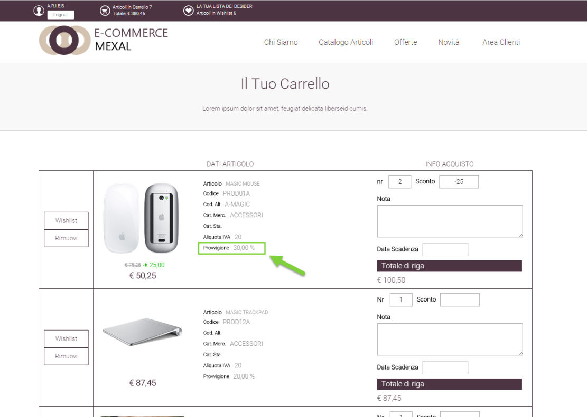{width="5.370138888888889in"
height="3.285416666666667in"}

8.  Nel caso in cui non sia già stato effettuato l'accesso a Facebook
    verrà richiesto di farlo in questo momento

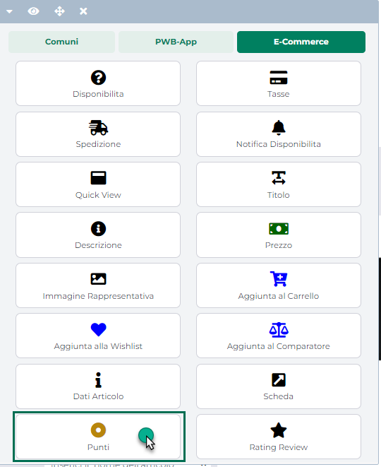{width="5.370138888888889in"
height="3.285416666666667in"}

> Inserire quindi le credenziali del proprio Account Facebook e cliccare
> su Accedi e, successivamente, cliccare di nuovo sul pulsante "**Crea
> Account**"
>
> **ATTENZIONE!** Nel caso in cui fosse già stato effettuato l'accesso a
> Facebook questo passaggio verrà saltato e cliccando sul pulsante "Crea
> Account" si passerà immediatamente alla creazione dell'Account

9.  Per completare la creazione dell'Account Business Manager sarà
    necessario inserire il nome della propria Azienda (deve
    corrispondere al nome pubblico dell'azienda considerando che il nome
    indicato in questa fase sarà poi quello visibile anche su Facebook),
    l'indirizzo e-mail e altri dati aziendali

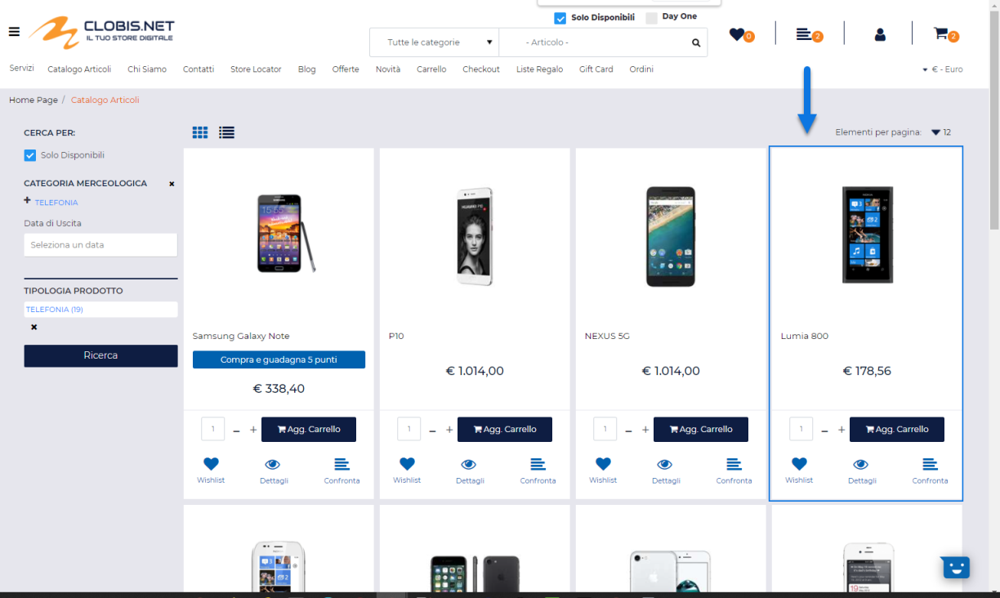{width="5.370138888888889in"
height="3.285416666666667in"}

> Una volta completata la creazione dell'Account verremo automaticamente
> ridiretti nella sezione relativa alle impostazioni di configurazione

{width="5.395833333333333in"
height="3.532638888888889in"}

> Da qui dovremo ora andare ad aggiungere l'App creata tramite il nostro
> profilo Facebook aziendale (per maggiori informazioni in merito si
> veda anche quanto indicato nel precedente capitolo di questo manuale)
> e, successivamente dovremo andare a creare anche un utente di sistema
> dal quale poter generare il token di accesso che dovrà essere inserito
> nell'apposito campo Passweb per poter attivare l'integrazione con il
> nostro sito Ecommerce.

10. All'interno del Business Manager selezionare la voce "**App**"
    presente all'interno del menu "**Account**" sulla sinistra della
    pagina.

{width="5.395833333333333in"
height="3.532638888888889in"}

> Una volta effettuato l'accesso alla sezione, cliccare sul pulsante
> "**Aggiungi**" e selezionare quindi l'opzione "**Collega un ID app**"

{width="5.395833333333333in"
height="3.532638888888889in"}

11. Nella successiva schermata inserire, all'interno del campo "**ID
    app**" l'identificativo dell'App precedentemente creata all'interno
    del nostro account Facebook Developer

{width="5.395833333333333in"
height="3.532638888888889in"}

> e cliccare quindi sul pulsante "**Aggiungi app**" (essendo l'App
> creata all'interno dello stesso Account Facebook non verranno
> richieste ulteriori autorizzazioni).
>
> Volendo sarebbe stato possibile aggiungere l'App al Business Center
> anche partendo direttamente dal nostro account Facebook Developer
> agendo in questo senso dalla sezione "**Impostazioni**" dell'App sul
> pulsante "**Seleziona un Business Manager**"

{width="5.058333333333334in"
height="3.363888888888889in"}

12. Una volta aggiunta l'App, all'interno del menu "**Utenti**"
    comparirà la voce "**Utenti del sistema**"

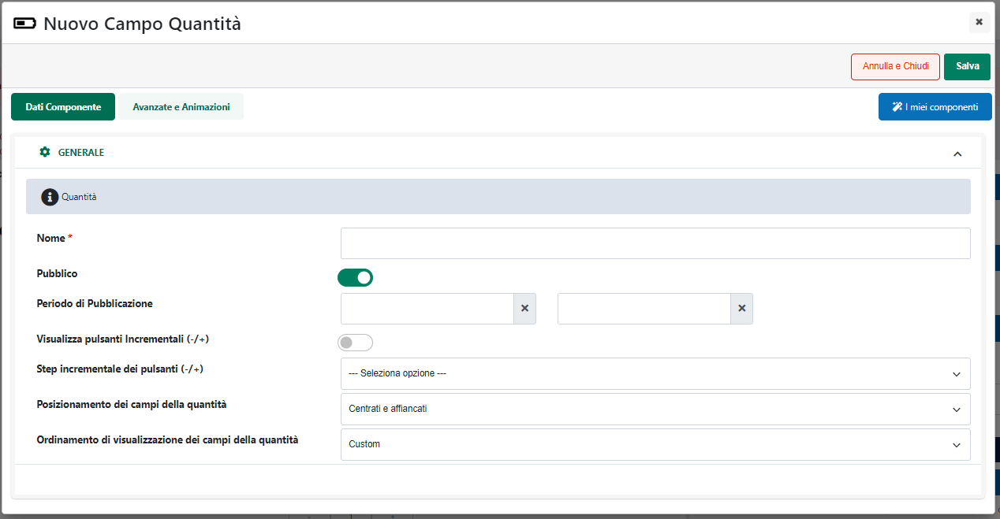{width="5.395833333333333in"
height="3.532638888888889in"}

> Portarsi quindi all'interno di questa sezione e cliccare sul pulsante
> "**Aggiungi**" per creare un nuovo utente di sistema
>
> Gli utenti di sistema rappresentano i software che effettuano chiamate
> API alle risorse gestite dal Business Manager. Questo passaggio è
> dunque di fondamentale importanza in quanto è proprio a partire
> dall'utente di sistema che sarà poi possibile generare il token
> necessario per garantire la comunicazione tra il Business Manager ed
> il nostro sito Ecommerce.
>
> **ATTENZIONE!** Per poter creare utenti di sistema è di fondamentale
> importanza aver associato almeno un' App al proprio account Business
> Manager. Nel caso in cui non si sia stata associate nessuna App la
> voce "Utenti del Sistema" non sarà infatti disponibile

13. All'interno della maschera di creazione, assegnare un nome
    all'utente e selezionare per esso il ruolo di **Amministratore**

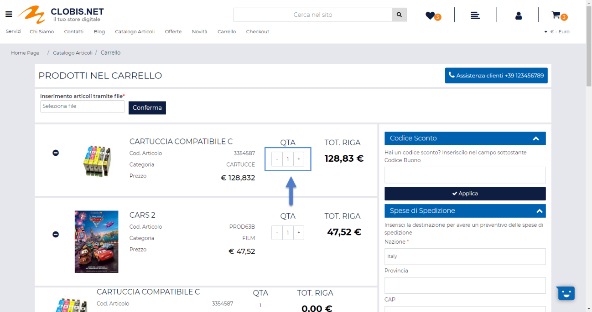{width="5.395833333333333in"
height="3.532638888888889in"}

14. Dopo aver creato l'utente di sistema sarà necessario concedergli
    l'accesso all'App precedentemente caricata all'interno del nostro
    Business Manager. Portarsi quindi all'interno della sezione "Utenti
    del Sistema", selezionare l'utente appena creato e cliccare sul
    pulsante **"Aggiungi Risorse"** evidenziato in figura

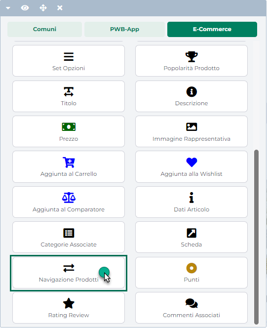{width="5.395833333333333in"
height="3.532638888888889in"}

15. Nella schermata successiva selezionare l'App precedentemente
    caricata sul Business Manager e, all'interno della colonna "**App**"
    attivare la voce "**Controllo completo -- Gestisci l'app**"

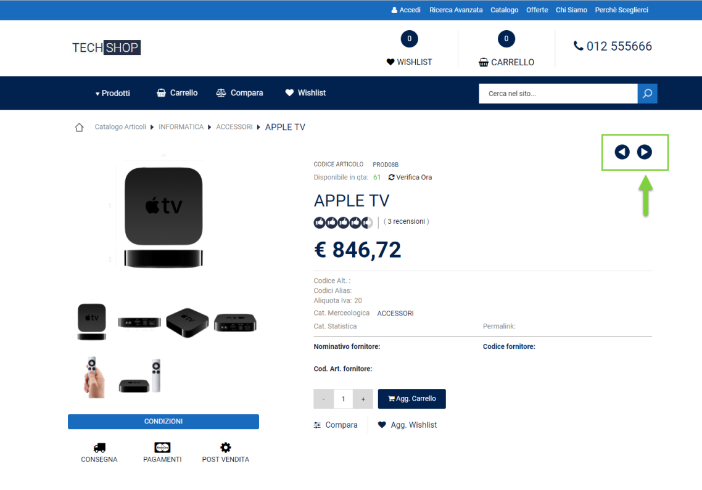{width="5.395833333333333in"
height="3.532638888888889in"}

> Cliccare quindi sul pulsante "**Salva le modifiche**"

16. A questo punto possiamo passare alla generazione del token
    necessario per attivare l'integrazione tra Passweb ed il Business
    Manager.

> Per far questo, sempre all'interno della sezione relativa all'utente
> di sistema cliccare sul pulsante "**Genera un nuovo token**"

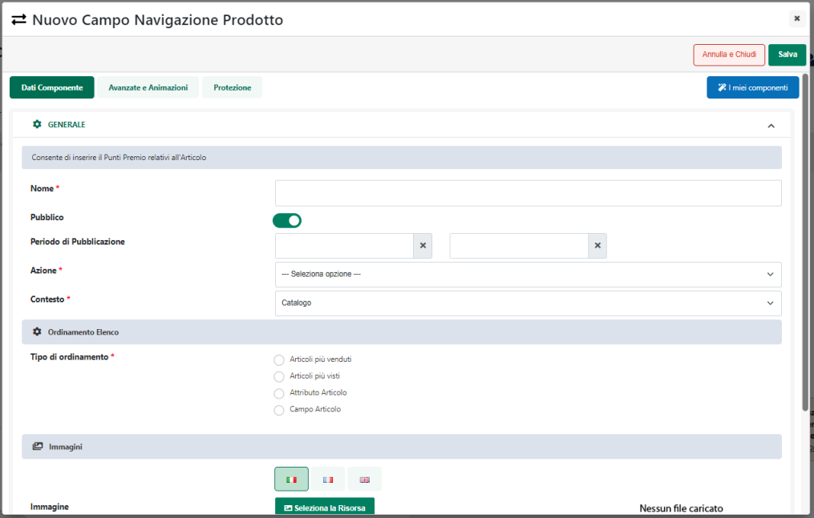{width="5.395833333333333in"
height="3.532638888888889in"}

> Selezionare l'App in questione e attivare, abilitando i relativi
> check, gli ambiti indicati in figura, vale a dire:

- business_management

- page_showlist

- ads_read

- pages_manage_ads

- pages_manage_metadata

- pages_read_engagement

- pages_read_user_content

- ads_management

- catalog_management

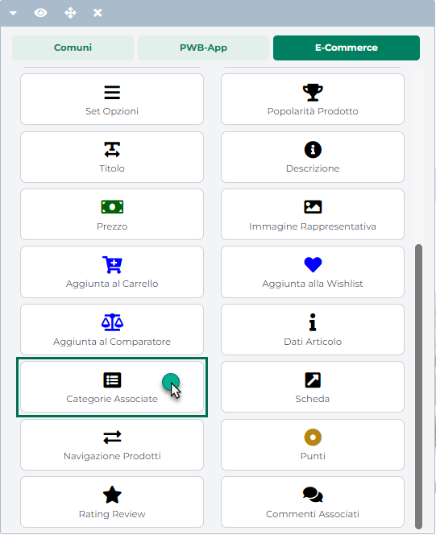{width="5.370138888888889in"
height="3.285416666666667in"}

> **ATTENZIONE!** E' di fondamentale importanza selezionare tutti gli
> ambiti sopra indicati in quanto da questi dipende poi la generazione
> di un token sempre valido e che non dovrà quindi essere rigenerato e
> reinserito periodicamente nei parametri di configurazione del proprio
> sito

17. Selezionati gli ambiti indicati, cliccando sul pulsante "**Genera
    Token**" verrà generato e visualizzato il token di accesso collegato
    al nostro utente di sistema che dovremo inserire nei parametri di
    configurazione del sito Passweb

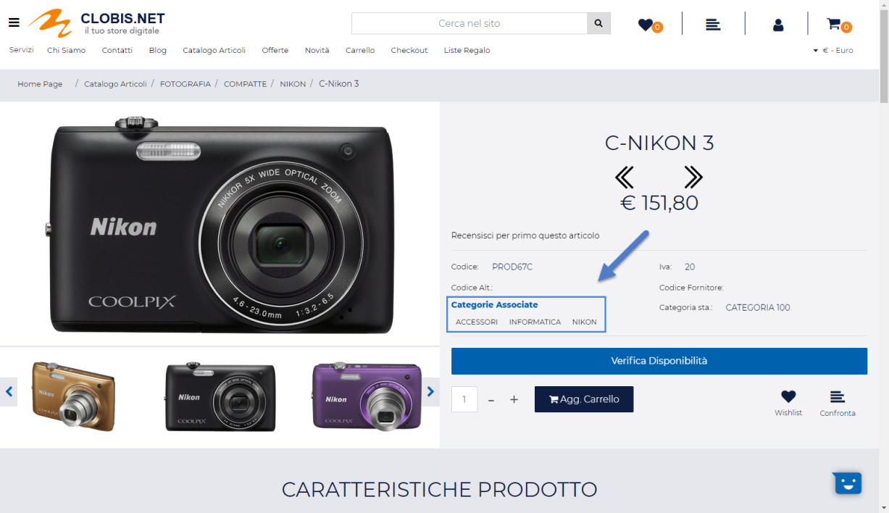{width="5.395833333333333in"
height="3.532638888888889in"}

> **ATTENZIONE!** Come indicato nella maschera di generazione del token,
> questo non verrà memorizzato su Facebook per cui è di fondamentale
> importanza copiarlo all'interno di un file facilmente accessibile nel
> caso in cui dovessimo poi averne bisogno.
>
> **Una volta chiusa la maschera evidenziata in figura non sarà più
> possibile accedere al token generato per cui nel caso in cui dovessimo
> averne bisogno, non potendo accedere alla copia salvata autonomamente,
> sarà necessario generarne uno nuovo**

Arrivati a questo punto abbiamo tutti i dati necessari da inserire in
Passweb per configurare l'integrazione tra il nostro sito Ecommerce e
Facebook Business Manager.

Nel successivo capitolo di questo manuale vedremo quindi come poter
attivare questa integrazione.

Prima di far questo però è consigliabile aggiungere al Business Manager
di Facebook anche la pagina aziendale in maniera tale da poter poi
gestire tutto all'interno di questo unico strumento (considerando che
sempre qui andrà poi aggiunto anche l'account pubblicitario da
utilizzare per chiudere il cerchio e creare le inserzioni pubblicitarie
da pubblicare sul social network).

A titolo esemplificativo la procedura da seguire per aggiungere la
pagina aziendale al Business Manager è del tutto analoga a quella
precedentemente analizzata per aggiungere l'App.

Sarà quindi sufficiente selezionare la voce "**Pagine**" presente
all'interno del menu "**Account**", cliccare sul pulsante "Aggiungi" e
selezionare l'opzione "**Aggiungi una pagina**"

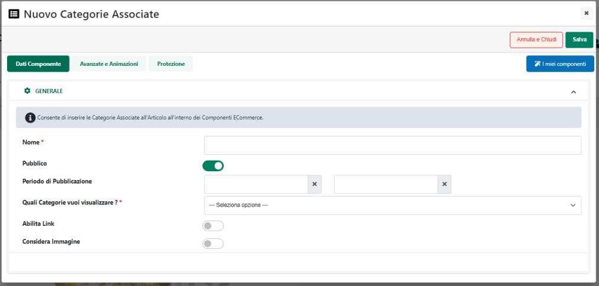{width="5.395833333333333in"
height="3.532638888888889in"}

Indicare quindi l' url o il nome della propria pagina Facebook e
cliccare sul pulsante "**Aggiungi Pagina**"

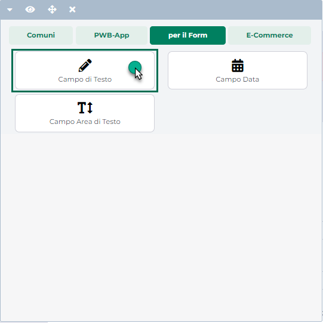{width="5.395833333333333in"
height="3.532638888888889in"}

