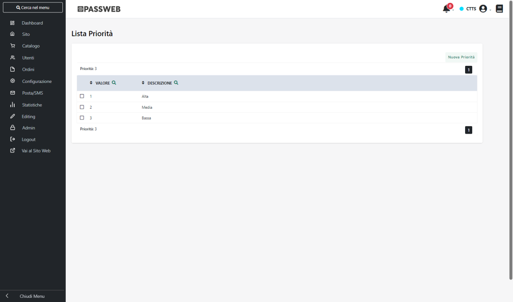
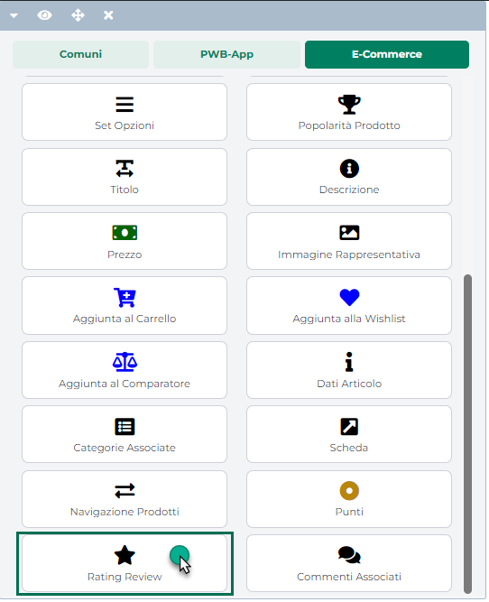
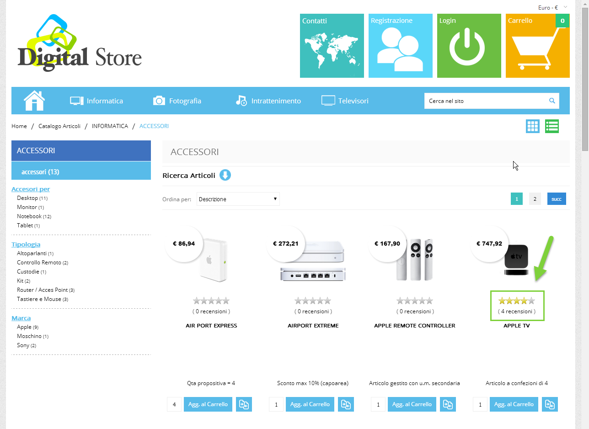
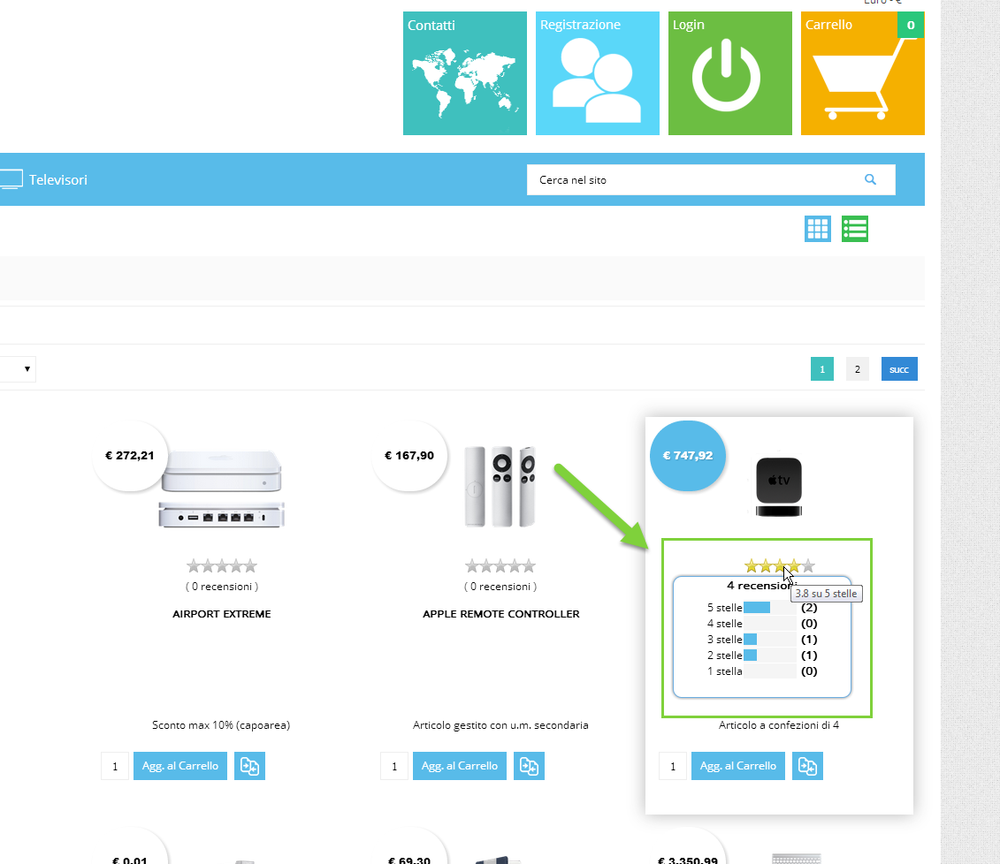

# CONFIGURAZIONE ACCOUNT PASSWEB

Una volta completati tutti i passaggi descritti nei due precedenti
capitoli di questo manuale per connettere il sito Ecommerce a Facebook
Business Manager sarà necessario:

18. Portarsi, nel Wizard di Passweb, all'interno della sezione
    "**Catalogo -- Altri Marketplace -- Gestione Account**" e cliccare
    sul pulsante "**Aggiungi Account**" presente nella parte alta della
    pagina

19. All'interno della maschera "Dati Account" assegnare un nome
    all'Account che si sta configurando (campo **Descrizione**) e
    selezionare, all'interno del campo "**Marketplace**" l'opzione
    "**Facebook Catalog**"

20. Compilare i campi presenti all'interno della sezione
    "**Credenziali**" con i dati di seguito indicati:

    - **ID Business Manager**: codice identificativo del proprio Account
      Business Manager.

> Per ottenere questa informazione è necessario accedere al proprio
> Account Business Manager e portarsi nella sezione "**Informazioni sul
> Business Manager**"

> Copiare quindi il codice presente in corrispondenza del campo "ID
> Business Manager" e inserirlo nel corrispondente campo Passweb

- **Token**: token associato all'utente di sistema (Amministratore)
  generato all'interno del Business Manager a cui è stata anche
  associata l'App con il prodotto "API Marketing"

> Per maggiori informazioni relativamente alla procedura da seguire per
> ottenere questo token si faccia riferimento a quanto indicato nel
> precedente capitolo di questo manuale.

Il pulsante "**Salva**" presente nella parte bassa della pagina,
consente di salvare i dati immessi attivando di fatto la connessione tra
Passweb ed il Business Manager di Facebook.

Una volta effettuato il salvataggio dei dati compariranno nuove sezioni
(Metodi di pubblicazione, Articoli, Schedulazione, Download CSV)
all'interno delle quali poter configurare in maniera più dettagliata
altri aspetti dell'integrazione.

Per maggiori informazioni in merito a ciascuna di queste sezioni si
vedano i successivi capitoli di questo manuale.

##### METODI DI PUBBLICAZIONE

All'interno di questa sezione è possibile decidere quale dovrà essere il
metodo adottato per la pubblicazione dei dati articolo sulla piattaforma
terza.

In questo senso Passweb offre due diverse modalità di esportazione dei
dati selezionabili attraverso l'apposito menu a tendina (parametro
"**Modalità pubblicazione articoli**"):

21. **via API**: i dati articolo verranno trasferiti ed inseriti sulla
    piattaforma terza in maniera automatica sfruttando, appunto, le API
    messe a disposizione dalla piattaforma stessa

> **ATTENZIONE!** il processo di pubblicazione via API dipende
> ovviamente, oltre che dalle elaborazioni interne a Passweb, anche dai
> tempi di risposta e dai limiti imposti delle relative API. Per
> maggiori informazioni in merito a tali limiti si consiglia di fare
> riferimento alla documentazione ufficiale di Facebook (
> <https://developers.facebook.com/docs/graph-api/overview/rate-limiting#buc-rate-limits>
> )

22. **via CSV**: i dati articolo verranno pubblicati all'interno di
    appositi file csv. Tali file potranno poi essere:

    - scaricati direttamente dal Wizard di Passweb e uplodati
      manualmente sulla piattaforma terza

    - accessibili ad uno specifico url (sotto il dominio assegnato al
      proprio sito Passweb)

    - copiati automaticamente all'interno di un'area condivisa (Ftp,
      Google Drive ...) stabilita in fase di configurazione del proprio
      Account di integrazione

> Dipendentemente dalla destinazione scelta per la pubblicazione dei
> file csv, andrà poi configurata correttamente anche la piattaforma
> terza affinché possa recuperare i dati in maniera adeguata
>
> **ATTENZIONE!** anche la pubblicazione via CSV è sottoposta a
> determinati limiti dettati sempre dalla piattaforma terza. Tali limiti
> sono comunque meno stringenti rispetto a quelli che regolano la
> pubblicazione via API. La dimensione massima accettata per il file csv
> può variare ad esempio tra i 100 MB e gli 8 GB a seconda del fatto di
> caricare il file manualmente oppure rendendolo disponibile ad un
> apposito url. Per maggiori informazioni in merito si consiglia
> comunque di fare sempre riferimento alla documentazione ufficiale di
> Facebook (
> <https://www.facebook.com/business/help/125074381480892?id=725943027795860>
> )

Come avremo modo di vedere nei successivi capitoli di questo manuale, la
pubblicazione via API utilizza determinate regole che assicurano
l'aggiornamento e quindi la ripubblicazione dei vari articoli solo nel
caso in cui i dati di questi stessi articoli dovessero effettivamente
risultare variati (ad esempio a livello di prezzi o di quantità
disponibili) rispetto all'ultima pubblicazione effettuata.

Utilizzando invece la pubblicazione via CSV, sarà poi possibile
configurare il Business Manager di Facebook in maniera tale che questo
vada a rileggere, ad intervalli di tempo regolari (ad esempio anche ogni
ora), i file CSV prodotti da Passweb. Considerando poi che tali file
potranno contenere sempre tutti gli articoli coinvolti nella
pubblicazione (indipendentemente dal fatto che risultino o meno variati
rispetto all'ultima pubblicazione effettuata) è semplice comprendere
che, operando in questo modo, potremo di fatto andare a ripubblicare, ad
intervalli di tempo regolari, tutta la base dati dei prodotti presenti
nel Business Manager.

###### PUBBLICAZIONE VIA API

Per attivare questo tipo di pubblicazione è sufficiente impostare il
parametro "**Modalità pubblicazione articoli**" presente nella sezione
"**Metodi di pubblicazione**" della maschera "**Dati Account**"
sull'opzione **API**, come evidenziato nella figura di seguito riportata

In queste condizioni, come evidenziato anche nel precedente capitolo di
questo manuale, la pubblicazione dei dati articolo sulla piattaforma
terza avverrà sfruttando completamente le API messe a disposizione dalla
piattaforma stessa. Di base non saranno quindi richiesti altri parametri
configurazione.

###### PUBBLICAZIONE VIA CSV

Per attivare questo tipo di pubblicazione è sufficiente impostare il
parametro "**Modalità pubblicazione articoli**" presente nella sezione
"**Metodi di pubblicazione**" della maschera "**Dati Account**"
sull'opzione **CSV**, come evidenziato nella figura di seguito riportata

In questo caso occorrerà poi impostare anche tutta una serie di altri
parametri necessari per configurare in maniera corretta la creazione dei
file csv e il repository in cui andarli ad inserire.

Nello specifico dunque il campo

**Pubblica tutti gli articoli:** consente di decidere come dovrà
comportarsi l'applicativo nel momento in cui si dovessero effettuare
delle pubblicazioni manuali degli articoli coinvolti nelle diverse liste
di vendita.

In questo senso è di fondamentale importanza evidenziare che Passweb
potrà comportarsi in maniere diversa a seconda del fatto che si parli di
pubblicazioni automatiche, e quindi schedulate, oppure di pubblicazioni
manuali.

In particolare:

23. nel caso di **pubblicazioni automatiche** verranno presi in
    considerazione, ed inseriti quindi nei relativi file csv, **sempre
    tutti gli articoli di tutte le liste di vendita legate all'account
    in esame** indipendentemente dal fatto che risultino o meno variati
    rispetto all'ultima pubblicazione effettuata

24. nel caso di **pubblicazione manuali** invece il comportamento
    dell'applicativo dipenderà da come è stato impostato il parametro
    "Pubblica tutti gli articoli".

> **Nel momento in cui tale parametro dovesse essere selezionato** le
> pubblicazioni manuali si comporteranno esattamente come quelle
> automatiche. Anche in questo caso dunque verranno sempre presi in
> considerazione, ed inseriti nei relativi file csv, tutti gli articoli
> di tutte le liste vendita collegate all'account in esame,
> indipendentemente da quelli che sono o non sono stati selezionati
> manualmente prima di avviare la relativa pubblicazione.
>
> **Nel momento in cui invece il parametro "Pubblica tutti gli articoli"
> dovesse essere deselezionato**, a seguito di una pubblicazione manuale
> verranno inseriti nel relativo file csv solo ed esclusivamente quei
> prodotti che sono stati effettivamente selezionati nella lista di
> vendita prima di avviare la relativa pubblicazione

**Separatore File CSV:** consente di impostare, selezionandolo da un
apposito menu a tendina, il carattere da utilizzare, in fase di
creazione del file csv, come separatore dei campi

**Modalità scrittura file:** consente di decidere quale dovrà essere il
metodo utilizzato per gestire i contenuti dei file csv a seguito di
pubblicazioni successive.

Considerando che, come precedentemente evidenziato, le pubblicazioni
automatiche via CSV coinvolgono sempre tutti gli articoli di tutte le
liste collegate all'account in esame, e considerando anche la necessità
di non modificare ad ogni pubblicazione il nome del file csv prodotto
(cosa questa che comporterebbe poi la riconfigurazione delle
impostazioni del feed anche sulla piattaforma terza) l'unica opzione
possibile per il parametro in esame sarà "**Sovrascrivi**"

- **Sovrascrivi**: in queste condizioni i file generati a seguito di una
  determinata pubblicazione andranno sempre e comunque a sovrascrivere
  quelli attualmente presenti nel repository utilizzato (e relativi
  ovviamente alla stessa lista di vendita) mantenendo, generalmente,
  anche lo stesso nome. Nel momento in cui nel repository non dovesse
  essere presente un determinato file (perché ad esempio è stata
  aggiunta, rispetto all'ultima pubblicazione una nuova lista di
  vendita) questo verrà creato da zero.

> **In ogni caso, in queste condizioni, i file csv all'interno del
> repository conterranno sempre e soltanto i dati relativi all'ultima
> pubblicazione effettuata**

**Nome file CSV:** consente di personalizzare parte del nome dei file
csv prodotti da Passweb aggiungendogli una specifica stringa.

**ATTENZIONE!** Il campo "Nome file CSV" consente di personalizzare solo
parte del nome dei file prodotti da Passweb

In generale occorre infatti considerare che Passweb genererà un file csv
distinto per ogni singola lista di vendita con un nome del tipo:

**Articoli_idListaVendita_NomeFileCSV.csv**

dove

- **Articoli\_** è una parte non modificabile del nome file

- **idListaVendita\_** è una parte non modificabile del nome file che
  indica l'**id** della lista di vendita cui appartengono gli articoli
  presenti nel file csv.

- **NomeFileCSV** è la parte variante del nome file determinata sulla
  base della stringa impostata per il campo "Nome File CSV"

**ATTENZIONE!** una volta impostato un determinato valore all'interno
del campo "Nome file CSV" si consiglia di non andare poi a modificarlo.

In caso contrario infatti il nome dei file CSV prodotti da Passweb
cambierà e, tipicamente, sarà poi necessario andare a riconfigurare
anche le impostazioni del relativo Feed Articoli sulla piattaforma terza
per fare in modo che possa effettivamente essere recuperato il file
corretto.

In questo senso infatti è bene sottolineare che in fase di salvataggio
sul repository esterno dei file prodotti a seguito della pubblicazione
di una determinata lista articoli, Passweb controllerà, per prima cosa,
se nella cartella indicata sono già presenti file dello stesso tipo
inseriti a seguito di pubblicazioni precedenti (**il controllo verrà
effettuato analizzando le parti invarianti del nome file**) e:

- in caso positivo eliminerà questi file sostituendoli con quelli
  prodotti dalla pubblicazione in corso. Il nome dei nuovi file resterà
  dunque invariato a patto di non andare a modificare tra una
  pubblicazione e l'altra la sua parte invariante ossia quanto inserito
  all'interno del campo "Nome file CSV"

- in caso negativo Passweb provvederà semplicemente a creare da zero il
  nuovo file senza preoccuparsi di cancellare eventuali altri file
  presenti nella stessa cartella di appoggio

In queste condizioni dunque, nel momento in cui si dovesse modificare,
tra una pubblicazione e l'altra, per una qualsiasi ragione, uno degli
elementi invarianti del nome file, a seguito di una nuova pubblicazione
verranno creati sempre e comunque dei nuovi file seguendo le specifiche
indicate all'interno di questo capitolo.

**ATTENZIONE!** Il pulsante "**Scarica File CSV di esempio**" consente
di scaricare uno zip contenente degli esempi di file csv che possono
essere prodotti da Passweb a seguito di una pubblicazione articoli

Una volta compreso come impostare Passweb per creare i file CSV, resta
ora da capire come gestirne il contenuto e come renderli effettivamente
disponibili alla piattaforma terza.

In questo senso, per quel che riguarda la gestione dei contenuti il
tutto dipende, essenzialmente, da come verrà poi impostata l'Inserzione
utilizzata per la pubblicazione e da quelli che saranno i campi per essa
gestiti.

**E' con l'Inserzione che andremo a definire esattamente quali
informazioni dovranno essere passate alla piattaforma terza e quali
campi del file CSV dovranno quindi essere valorizzati per ogni singolo
prodotto coinvolto.**

Dal punto di vista strutturale infatti, i file csv prodotti da Passweb
per la pubblicazione verso Google Merchant avranno, in testata, tutti i
campi richiesti dalla piattaforma terza

Per quel che riguarda invece le singole entry dei file csv, i valori
presenti per ogni riga (e quindi per ogni articolo) in corrispondenza
della relativa colonna dipenderanno dal fatto di aver inserito o meno la
corrispondente specifica nell'Inserzione utilizzata per la pubblicazione
e, ovviamente, da come questa stessa specifica è stata mappata e
valorizzata.

In virtù di ciò, nel momento in cui nell'Inserzione utilizzata per la
pubblicazione dovesse essere gestita, ad esempio, la specifica
"**materiale (material)**" allora le righe del file csv relative agli
articoli pubblicati mediante l'Inserzione in esame avranno la
corrispondente colonna "**Material**" valorizzata con il "materiale" dei
corrispondenti prodotti, informazione questa che verrà prelevata
esattamente dal campo impostato in fase di mapping della relativa
specifica.

Se invece la specifiche "**materiale (material)**" non dovesse essere
gestita nell'Inserzione, il file csv manterrà comunque a livello di
intestazione la relativa colonna ma, in questo caso, per ogni articolo
coinvolto nell'Inserzione, e quindi per ogni singola riga del file csv,
il campo corrispondente a questa colonna sarà, ovviamente, privo di
valori.

Infine, occorre anche considerare che:

- determinati campi del file csv, per ovvie ragioni, saranno sempre
  valorizzati indipendentemente da quelle che sono le specifiche
  effettivamente gestite nella corrispondente Inserzione. E' il caso ad
  esempio:

  - del **codice articolo** che verrà sempre inserito in corrispondenza
    della colonna "**Id**"

  - del **prezzo articolo** che verrà sempre inserito in corrispondenza
    della colonna "**Price**"

  - ...

- Per i campi che accettano valori multipli e che sono gestiti in
  automatico da Passweb come carattere di separazione dei singoli valori
  verrà utilizzata sempre la ","

> Ovviamente nel momento in cui il campo che accetta valori multipli
> dovesse essere gestito con una specifica mappata, ad esempio, con un
> Attributo Passweb, la valorizzazione del relativo attributo dovrà
> essere gestita manualmente utilizzando anche come separatore dei
> singoli valori un carattere adeguato.

**ATTENZIONE!** Così come è indispensabile non modificare manualmente il
nome dei file prodotti da Passweb **allo stesso modo e per ovvie ragioni
è di fondamentale importanza non alterare in nessun modo neppure la
struttura di questi stessi file**

E' ovviamente possibile prelevare i file dal Repository in cui Passweb
andrà a salvarli per poi modificarli ed elaborarli secondo le specifiche
esigenze del caso ma fintantoché verranno lasciati all'interno di questo
repository, la loro struttura non dovrà essere modificata in alcun modo.
Andando infatti a eliminare, rinominare o aggiungere manualmente campi
alla struttura di base si correrà il rischio di compromettere le
successive pubblicazioni creando dei tracciati non più gestibili in
maniera corretta.

Per quel che riguarda infine la modalità attraverso cui rendere
disponibili i file prodotti da Passweb e come caricare effettivamente i
dati contenuti in questi file sulla piattaforma terza, il tutto
dipenderà essenzialmente da come verranno impostati i campi presenti
nella sezione "**Repository**" dal tab "Metodi di pubblicazione"

In questo senso infatti il campo:

**Repository CSV:** consente di impostare, selezionandola da un apposito
menu a tendina, la particolare tipologia di Repository in cui Passweb
dovrà andare a salvare i file csv prodotti a seguito di ogni
pubblicazione articoli. E' possibile selezionare uno dei seguenti
valori:

- **Non gestito**: selezionando questa opzione non verrà utilizzato
  nessun Repository per cui i file csv prodotti da Passweb a seguito di
  ogni pubblicazione dovranno essere poi scaricati manualmente operando
  all'interno del tab "**Download CSV**" presente nella maschera di
  configurazione dell'Account

- **FTP:** in questo caso, al termine di ogni pubblicazione, i file
  prodotti da Passweb verranno copiati in un' apposita cartella
  all'interno di un' area FTP

- **Google Drive:** in questo caso, al termine di ogni pubblicazione, i
  file prodotti da Passweb verranno copiati in una specifica cartella
  Google Drive

- **URL Passweb:** selezionando questa opzione i file prodotti da
  Passweb al termine di ogni pubblicazione non verranno copiati in
  nessun repository ma saranno accessibili direttamente via web a
  specifici indirizzi sotto il dominio assegnato al proprio connettore
  Passweb

Ovviamente a seconda della particolare tipologia selezionata andranno
poi settati altri parametri di configurazione necessari a Passweb per
potersi effettivamente connettere con quello specifico repository.

Per maggiori informazioni relativamente a come poter configurare il
collegamento con ciascuno dei repository sopra riportati si veda quanto
indicato nei successivi capitoli di questo manuale

####### **DOWNLOAD MANUALE**

Nel momento in cui l'esigenza dovesse essere quella di gestire i file
csv prodotti da Passweb in maniera completamente manuale, e senza quindi
ricorrere a nessun Repository, sarà sufficiente impostare il parametro
"**Repository CSV**" sull'opzione "**Non gestito**"

In queste condizioni dunque a seguito di ogni operazione di
pubblicazione articoli (indipendentemente dal fatto che sia una
pubblicazione lanciata manualmente o eseguita in automatico) i file CSV
prodotti da Passweb non verranno copiati in nessun Repository e dovranno
quindi essere scaricati in maniera manuale operando all'interno del tab
"**Download CSV**" presente anch'esso nella maschera di configurazione
del relativo Account

All'interno di questa sezione, visibile solo nel momento in cui per
l'Account in esame si stia utilizzando un metodo di pubblicazione
articoli via CSV, è infatti presente l'elenco dei vari file prodotti da
Passweb a seguito delle ultime pubblicazioni effettuate.

**ATTENZIONE! Passweb conserva uno storico dei file relativo alle ultime
10 pubblicazioni**

Per ciascuno degli elementi presenti in elenco è indicata (colonna
"**Data Ora Creazione**") data e ora in cui è stata effettuata la
pubblicazione articoli che ha prodotto poi i relativi file.

I pulsanti presenti in corrispondenza delle colonne "**Elimina**" e
"**Scarica**" consentono invece di:

**Elimina** (
 ): consente di eliminare definitivamente
i file csv prodotti dalla corrispondente pubblicazione.

**Scarica** (
 ): consente di effettuare il download
dei relativi file csv.

**ATTENZIONE!** In queste condizioni Passweb si preoccuperà solamente di
creare, a seguito di ogni pubblicazione, i relativi file CSV. Tali file
non saranno quindi disponibili attraverso nessuna area comune per cui
l'unica possibilità sarà poi quella di scaricarli dal Wizard e caricarli
manualmente all'interno del Business Manager.

Per far questo sarà necessario:

- Accedere, sul Business Manager, al "**Gestore delle vendite**"
  collegato al proprio catalogo prodotti

- Accedere alla sezione "**Catalogo -- Origini dei dati**" presente nel
  menu sulla sinistra della pagina

> selezionare, come modalità di creazione del feed l'opzione "**Elenco
> di dati**" come evidenziato in figura

> e cliccare sul pulsante "**Avanti**" in maniera tale da avviare la
> procedura di upload del relativo file

- Nella successiva maschera selezionare "**Si**" in corrispondenza del
  campo "**Vuoi caricare il tuo foglio di calcolo o file?**"

> e cliccare sul pulsante "**Avanti**"

- A questo punto sarà possibile decidere di uplodare manualmente il file
  csv prodotto da Passweb, oppure di settare l'elenco dati in maniera
  tale che venga effettuato un recupero automatico di questo stesso
  file.

> Nel primo caso sarà necessario, ovviamente, aver scaricato
> preventivamente il file csv prodotto da Passweb operando per questo
> dalla relativa sezione del Wizard.
>
> Nel secondo caso sarà invece necessario rendere disponibile il file
> prodotto da Passweb ad un determinato url (per maggiori informazioni
> in merito a questa casistica si rimanda a quanto indicato nel
> successivo capitolo di questo manuale "*Recupero programmato dei file
> dal Business Manager*")
>
> Supponendo ora di voler procedere con l'upload manuale del file e
> supponendo anche, ovviamente, di averlo già scaricato dal backend di
> Passweb quello che dovremo fare sarà semplicemente accertarci di
> essere posizionati nella sezione "**Carica dal computer**" della
> maschera Facebook e trascinare quindi il nostro file csv all'interno
> dell'apposita area di drop

> **ATTENZIONE!** come indicato anche all'interno della maschera sopra
> riportata, nel caso di caricamenti manuali, le dimensioni del file non
> devono superare i 100 MB

- Cliccando sul pulsante "**Avanti**" dovremo ora impostare alcune
  informazioni relativamente all' "Elenco dati" che andremo a creare
  come ad esempio un nome (campo "**Nome dell'elenco dati**"), e la
  valuta predefinita da utilizzare (campo "**Valuta predefinita**")

> **ATTENZIONE!** considerando che abbiamo optato per il caricamento
> manuale del file, non sarà possibile ovviamente automatizzare questa
> operazione associando all'Elenco dati una specifica programmazione

- Una volta inseriti i dati richiesti cliccando sul pulsante "**Salva
  elenco e carica**" verrà avviata la procedura di upload del file

- Al termine della procedura i prodotti caricati saranno visibili
  all'interno della sezione "**Catalogo -- Articoli**"

####### **PUBBLICAZIONE VIA FTP**

La pubblicazione via FTP consente di inserire, in maniera completamente
automatica, i file prodotti da Passweb a seguito di ogni operazione di
pubblicazione articoli (indipendentemente dal fatto che sia una
pubblicazione lanciata manualmente o eseguita in automatico a seguito ad
esempio di una sincronizzazione e/o dell'applicazione di una determinata
regola) all'interno di un'apposita area FTP rendendoli così disponibili
anche alla piattaforma terza deputata alla loro elaborazione.

Per attivare questo tipo di repository è necessario, per prima cosa,
impostare il parametro "**Repository CSV**" sull'opzione "**FTP**"

Fatto questo sarà poi necessario impostare anche tutta una serie di
altri parametri necessari per consentire a Passweb di accedere all'area
FTP in esame.

Nello specifico dunque il campo:

- **Username:** consente di impostare lo username di accesso all'area
  FTP in cui dovranno essere copiati i file prodotti da Passweb

- **Password:** consente di impostare la password di accesso all'area
  FTP in cui dovranno essere copiati i file prodotti da Passweb

- **Host:** consente di indicare il percorso della cartella all'interno
  dell'area FTP in cui dovranno poi essere copiati i file prodotti da
  Passweb.

- **ATTENZIONE! E' necessario indicare il percorso completo della
  cartella (comprensivo quindi del nome della cartella stessa). La
  cartella deve inoltre essere già presente all'interno dell'area ftp**

- **Porta:** consente di indicare la porta di accesso su cui è attivo il
  servizio ftp

Nel momento in cui i parametri di accesso impostati non dovessero essere
corretti e/o la cartella di destinazione non dovesse essere già presente
nell'area ftp, in fase di pubblicazione verrà ritornato un apposito
messaggio di errore

Infine, per quel che riguarda la copia dei file prodotti da Passweb
all'interno di quest'area FTP occorre ricordare che:

- **Passweb produrrà file csv distinti per ogni singola lista di
  vendita**

- **Passweb non effettuerà operazioni di cancellazione di file
  eventualmente presenti all'interno della cartella**. Un'eventuale
  eliminazione dei file prodotti da Passweb dopo che il loro contenuto è
  stato correttamente processato ed importato all'interno del Merchant
  Center rimane dunque un' operazione in carico a chi gestisce la
  relativa area FTP

- Il metodo di scrittura dei file all'interno della cartella FTP è
  regolato dal parametro "**Modalità scrittura file**" precedentemente
  esaminato

- Per garantire un funzionamento corretto della procedura è necessario,
  ovviamente, non alterare in alcun modo né il nome dei file prodotti da
  Passweb né tanto meno la loro struttura. Nel momento in cui tale
  vincolo non dovesse essere rispettato si potrebbero riscontrare
  problemi relativi al fatto che ad ogni pubblicazione Passweb andrà a
  riscrivere un nuovo file indipendentemente da quanto impostato per il
  parametro "Modalità scrittura file" o, cosa peggiore, i dati
  all'interno del file potrebbero risultare corrotti causando poi
  problemi in fase di upload all'interno della piattaforma terza.

####### **PUBBLICAZIONE VIA GOOGLE DRIVE**

La pubblicazione via Google Drive consente di inserire, in maniera
completamente automatica, i file prodotti da Passweb a seguito di ogni
operazione di pubblicazione articoli (indipendentemente dal fatto che
sia una pubblicazione lanciata manualmente o eseguita in automatico a
seguito di una sincronizzazione e/o dell'applicazione di una determinata
regola) all'interno di un'apposita cartella in uno spazio Google Drive
rendendoli così disponibili al modulo o alla procedura Prestashop
deputata alla loro elaborazione.

Per attivare questo tipo di repository è necessario, per prima cosa,
impostare il parametro "**Repository CSV**" sull'opzione "**Google
Drive**"

Fatto questo sarà poi necessario impostare anche tutta una serie di
altri parametri necessari per consentire a Passweb di connettersi
correttamente al relativo spazio di Google Drive.

Per maggiori informazioni relativamente a come poter creare in maniera
corretta una cartella Google Drive e a come reperire tutti i parametri
di configurazione necessari per consentire a Passweb di connettersi con
tale cartella si rimanda a quanto indicato nell'analogo capitolo di
questo manuale relativo all'integrazione con Google Merchant
(*Marketplace -- Altri Marketplace -- Google Merchant -- Configurazione
Account -- Metodi di Pubblicazione - Pubblicazione articoli via CSV --
Pubblicazione via Google Drive*)

####### **PUBBLICAZIONE VIA URL PASSWEB**

La pubblicazione via Url Passweb consente di rendere disponibili i file
prodotti da Passweb a seguito di ogni operazione di pubblicazione
articoli (indipendentemente dal fatto che sia una pubblicazione lanciata
manualmente o eseguita in automatico a seguito di una sincronizzazione
e/o dell'applicazione di una determinata regola) via web a specifici
indirizzi sotto il dominio assegnato al proprio sito Passweb.

Per attivare questo tipo di repository è necessario impostare il
parametro "**Repository CSV**" sull'opzione "**URL Passweb**"

In queste condizioni non sarà necessario impostare nessun'altro
parametro di configurazione essendo i file in esame disponibili
direttamente via web a specifici indirizzi.

In questo senso per ottenere l' url dei singoli file prodotti da Passweb
sarà necessario concatenare l'indirizzo indicato all'interno del campo
"**URL**" con il nome dello specifico file che si vuole ottenere. Per
maggiori informazioni relativamente al nome assegnato da Passweb ai file
prodotti a seguito di ogni operazione di pubblicazione si veda anche
quanto indicato nel precedente capitolo "*Metodi di Pubblicazione*" di
questo manuale

Supponendo dunque di fare riferimento alla figura sopra riportata (e
all'indirizzo indicato all'interno del campo URL) e di voler accedere al
file prodotto a seguito della pubblicazione di articoli semplici
appartenenti alla lista di vendita con id 16, l' url da considerare sarà
esattamente il seguente

**https://www.clobis.net/MarketplaceFeed/2/Articoli_16_clobis.csv**

**ATTENZIONE!** anche in questo caso i dati dell'ultima pubblicazione
saranno gli unici presenti all'interno del file

###### RECUPERO PROGRAMMATO DEI FILE DA BUSINESS MANAGER

Come evidenziato nei precedenti capitoli di questo manuale abilitando la
pubblicazione via CSV e impostando come Repository una delle opzioni
FTP, Google Drive o URL Passweb sarà poi possibile configurare il Feed
Prodotti sul Business Manager di Facebook in maniera tale che questo
vada a rileggere, ad intervalli di tempo regolari, il file CSV prodotto
da Passweb.

Considerando poi che i file prodotti da Passweb, di base, potranno
contenere sempre tutti gli articoli coinvolti nella pubblicazione
(indipendentemente dal fatto che risultino o meno variati rispetto
all'ultima pubblicazione effettuata) è semplice comprendere che,
operando in questo modo, potremo di fatto andare a ripubblicare, ad
intervalli di tempo regolari (ad esempio anche ogni ora), tutta la base
dati dei prodotti presenti nel Business Manager

Nel momento in cui l'esigenza dovesse essere quindi quella di creare sul
Business Manager di Facebook un Elenco Prodotti con recupero programmato
dei dati da uno dei file prodotti dalla pubblicazione CSV di Passweb
sarà necessario:

- Accedere, sul Business Manager, al "**Gestore delle vendite**"
  collegato al proprio catalogo prodotti

- Accedere alla sezione "**Catalogo -- Origini dei dati**" presente nel
  menu sulla sinistra della pagina

> selezionare, come modalità di creazione del feed l'opzione "**Elenco
> di dati**" come evidenziato in figura

> e cliccare sul pulsante "**Avanti**" in maniera tale da avviare la
> procedura di upload del relativo file

- Nella successiva maschera selezionare "**Si**" in corrispondenza del
  campo "**Vuoi caricare il tuo foglio di calcolo o file?**"

- Come già visto nel caso di upload manuale del file, arrivati a questo
  punto sarà possibile decidere di uplodare manualmente il file csv
  prodotto da Passweb, oppure di settare l'elenco dati in maniera tale
  che venga effettuato un recupero automatico delle informazioni

> Dovendo quindi gestire il recupero automatico del file sarà necessario
> portarsi all'interno della sezione "**Usa un URL**" e inserire in
> corrispondenza del campo "**Inserisci l'url in cui è ospitato il tuo
> file**" l'url di accesso al file prodotto da Passweb (url questo che
> varierà ovviamente in relazione al tipo di repository utilizzato per
> la pubblicazione)

> **ATTENZIONE!** E' richiesto l'url completo del file nella forma
> https://www.moidominio.it/fileprodotti.csv. L' url della posizione del
> file deve iniziare con http://, https://, ftp:// o sftp://.
>
> I campi **Nome Utente / Password** (opzionali) consentono infine di
> inserire le eventuali credenziali di accesso al file nel momento in
> cui questo dovesse effettivamente essere disponibile solo dietro
> autenticazione
>
> **ATTENZIONE!** Come indicato nella documentazione ufficiale di
> Facebook
> (<https://www.facebook.com/business/help/2284463181837648?id=725943027795860>)
> nel caso di recupero automatico dei dati , le dimensioni del file non
> devono superare gli 8 GB anche se il consiglio è quello di stare
> sempre al di sotto di 4 GB

- Dopo aver inserito l'url del file csv prodotto da Passweb e le
  eventuali credenziali di accesso, cliccando sul pulsante "**Avanti**"
  ci verrà presentata un'ulteriore maschera in cui poter indicare
  esattamente la frequenza e l'orario con cui effettuare il recupero
  automatico del file

> Impostare quindi la frequenza desiderata e cliccare sul pulsante
> "**Avanti**"

- A questo punto se nel catalogo presente sul Business Manager dovessero
  essere già presenti dei prodotti ci verrà chiesto come si dovrà
  comportare l'import automatico in relazione a questi stessi prodotti

> Tipicamente sarà possibile decidere di sostituire interamente i dati
> presenti nel Catalogo oppure di aggiornarli (per maggiori informazioni
> in merito si consiglia di fare riferimento alla documentazione
> ufficiale di Facebook
> <https://www.facebook.com/business/help/2284463181837648?id=725943027795860>
> )

- Nell'momento in cui l'elenco dati su cui lavoriamo dovesse invece
  essere vuoto, dopo aver impostato la frequenza del recupero ci verrà
  presentata una maschera di riepilogo dati in cui potremo specificare
  anche nome per l'elenco dati su cui stiamo lavorando (campo "**Nome
  dell'elenco dati**") e la valuta predefinita da utilizzare (campo
  "**Valuta predefinita**")

> Una volta impostati anche questi dati il pulsante "Salva elenco e
> carica" consentirà di salvare tutte le impostazioni settate e di
> avviare automaticamente il primo caricamento del file, caricamento
> questo che d'ora in avanti avverrà in maniera completamente automatica
> con la frequenza precedentemente indicata

- Anche in questo caso al termine della procedura i prodotti caricati
  saranno visibili all'interno della sezione "**Catalogo -- Articoli**"

**ARTICOLI**

All'interno di questa sezione sarà necessario indicare, selezionandoli
tra quelli presenti in corrispondenza del parametro "**Magazzino degli
articoli**" i Magazzini da collegare all'Account in esame

**ATTENZIONE!** Per poter salvare correttamente l'Account è necessario
indicare almeno un Magazzino. **Inoltre i magazzini indicati all'interno
di questa sezione saranno poi quelli che verranno presi in
considerazione per valutare la disponibilità degli articoli in fase di
applicazione di una regola per la pubblicazione automatica di questi
stessi prodotti sulla piattaforma terza**

Il check "**Invia email articoli**", presente anch'esso all'interno
della sezione "Generale" consente invece di abilitare / disabilitare
l'invio delle email relative alle operazioni di pubblicazione articoli
sul relativo marketplace.

**ATTENZIONE!** Nel momento in cui tale check dovesse essere
disabilitato, al termine di una qualsiasi operazione di pubblicazione
articoli (comprese quelle relative a regole di "Messa / Modifica /
Rimessa in Vendita" e a regole di Blocco) non verrà più inviata alcuna
mail. In queste condizioni dunque per controllare l'esito di queste
operazioni sarà necessario utilizzare gli strumenti disponibili
all'interno del Wizard (Log Articolo e Log Liste di Vendita)

**SCHEDULAZIONE**

All'interno di questa sezione, **visibile solo nel momento in cui sia
stata impostata la pubblicazione via CSV**, è possibile schedulare le
operazioni di creazione dei vari file che dovranno poi essere dati in
pasto alla piattaforma terza

Relativamente alle operazioni di pubblicazione automatica dei file CSV
occorre poi tenere in considerazione alcune cose di fondamentale
importanza.

Nello specifico:

- Indipendentemente dal fatto che la pubblicazione automatica sia stata
  originata dalla pianificazione impostata all'interno di questa sezione
  del Wizard e/o dall'applicazione di una determinata regola di
  pubblicazione (es. regola di blocco, regola di messa in vendita ...)
  definita per la corrispondente inserzione e scattata a seguito di una
  sincronizzazione Sito -- Gestionale, **verranno sempre e comunque
  pubblicati tutti gli articoli di tutte le liste associate all'Account
  Facebook in questione**

- Nel caso di pubblicazioni manuali invece, il fatto di pubblicare o
  meno tutti gli articoli presenti in tutte le liste associate
  all'Account Facebook in esame dipenderà da come è stato impostato il
  parametro "**Pubblica tutti gli articoli**" presente nella sezione
  "**Metodi di pubblicazione**" della maschera "Dati Account"

- Non è ovviamente possibile eseguire, contemporaneamente, due diverse
  pubblicazioni. Ciò significa dunque che se la pubblicazione automatica
  schedulata, ad esempio, all'interno di questa sezione del Wizard
  dovesse partire mentre è già in corso un'altra pubblicazione (generata
  ad esempio a seguito di una precedente sincronizzazione sito --
  gestionale con conseguente applicazione di una regola di
  pubblicazione) questa non verrà eseguita.

- La schedulazione delle operazioni di pubblicazione automatica dei file
  CSV dovrà essere, ovviamente, coerente con il recupero programmato
  impostato nel relativo Feed del Business Manager. Occorre quindi
  prestare particolare attenzione a non modificare il file CSV proprio
  nel momento in cui questo verrà recuperato ed elaborato da Facebook.

##### DOWNLOAD CSV

All'interno di questa sezione, **visibile solo nel momento in cui si
dovesse decidere di adottare come metodo di pubblicazione dei prodotti
la pubblicazione via CSV** (indipendentemente dal tipo di repository
utilizzato), sarà possibile visualizzare e gestire in maniera manuale i
vari file prodotti da Passweb a seguito di una qualsiasi operazione
(automatica o manuale) di pubblicazione / arresto articoli

**ATTENZIONE! Passweb conserva uno storico dei file relativo alle ultime
10 pubblicazioni effettuate**

Si ricorda inoltre che anche eventuali operazioni di "Arresto Articoli"
indipendentemente dal fatto di essere effettuate manualmente o
automaticamente a seguito dell'applicazione di una determinata regola,
verranno ovviamente considerate come delle "pubblicazioni" e produrranno
quindi, all'interno della sezione in esame, i relativi file CSV.

