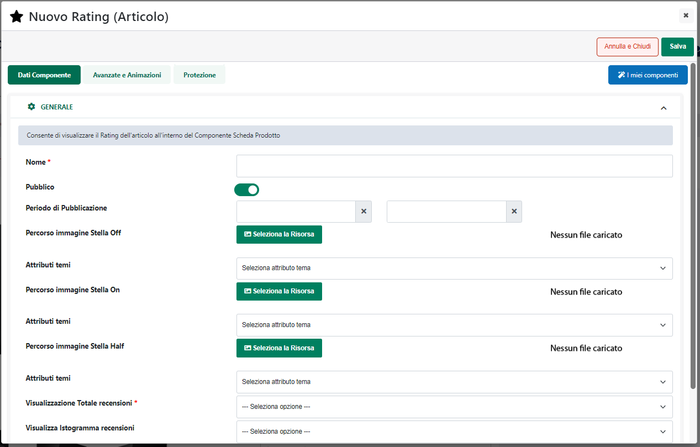
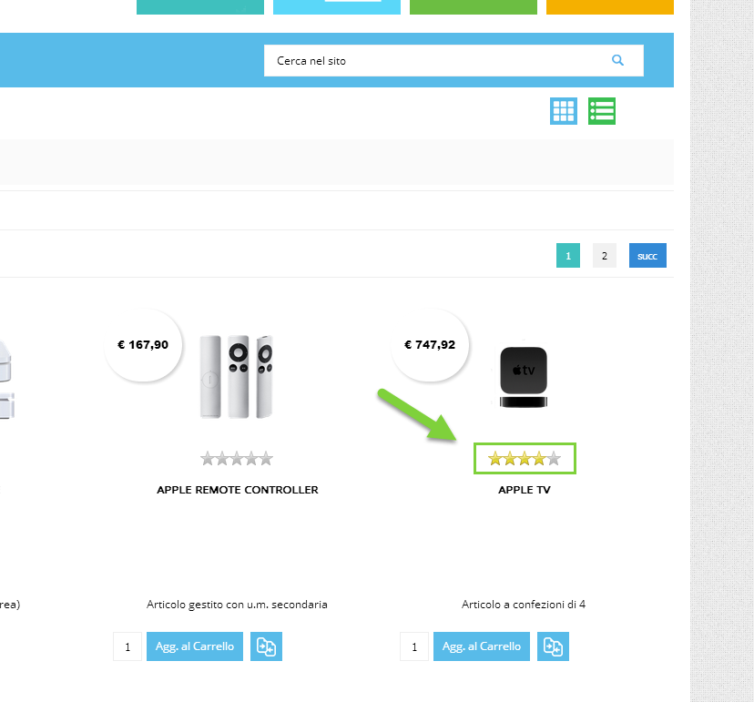
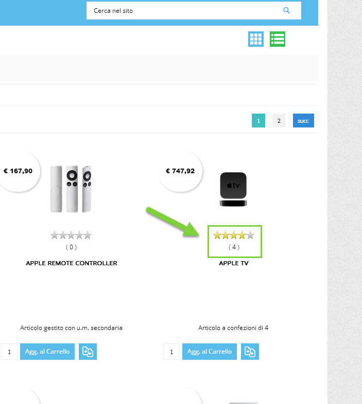
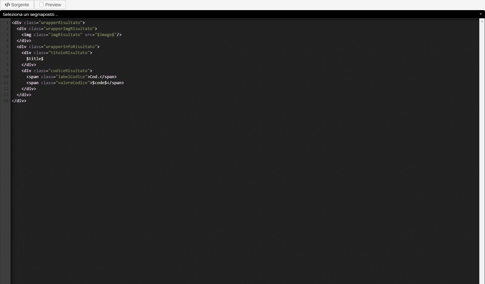
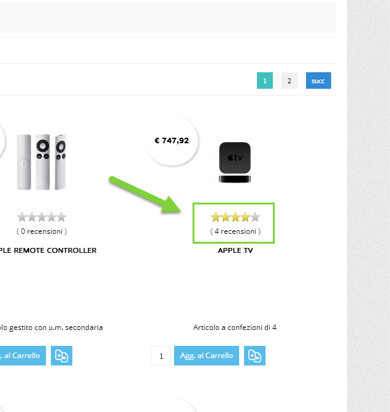
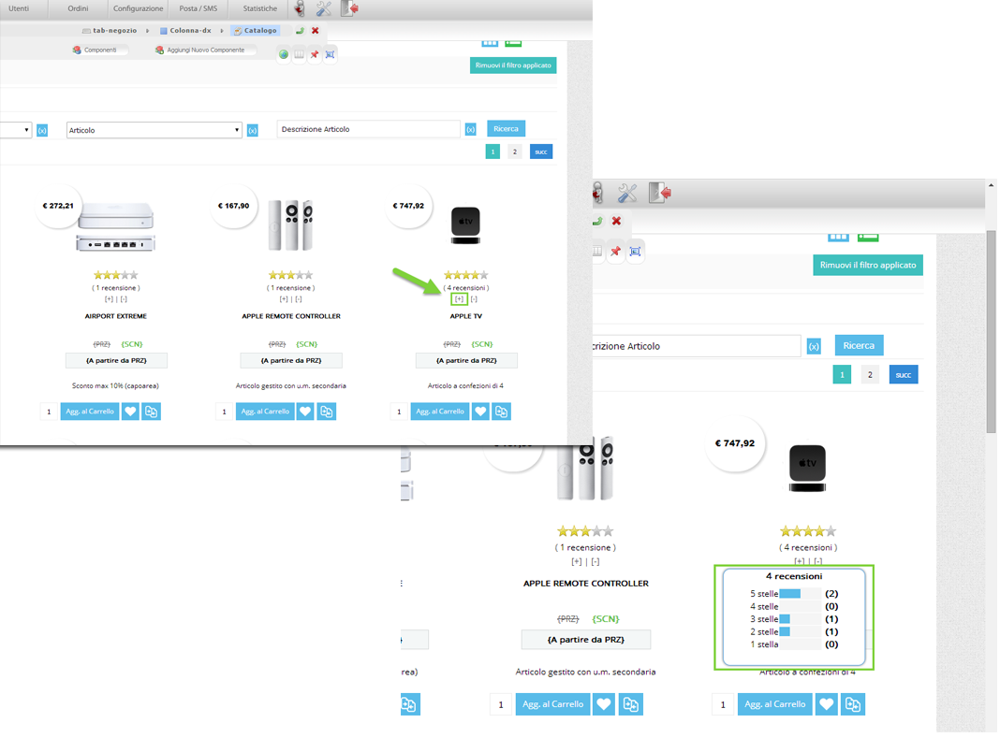
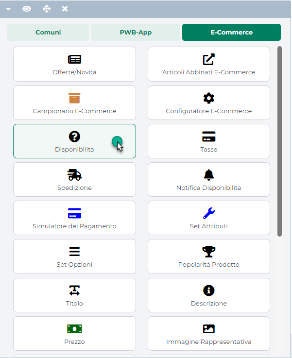

# INSERZIONI

Una volta terminata correttamente la configurazione dell'Account, il
passo successivo sarà quello di creare le Inserzioni mediante cui poter
definire esattamente quali dovranno essere i dati articolo (Titolo,
Categoria Merceologia, Immagini ...) da trasferire sulla piattaforma
terza e quelle che dovranno essere le regole di pubblicazione da
applicare in fase di esportazione dati.

**ATTENZIONE! Il metodo scelto per la pubblicazione degli articoli (Api
o Pubblicazione via csv) non influenza in alcun modo la creazione e la
gestione delle Inserzioni.**

In altri termini dunque con l'Inserzione andremo a definire esattamente
quali informazioni dovranno essere passate alla piattaforma terza per
ogni singolo prodotto, in quale lingua e quali dovranno essere le regole
di pubblicazione / arresto automatico.

Il metodo di pubblicazione scelto definisce invece il modo in cui i dati
articolo, stabiliti all'interno delle Inserzioni, verranno
effettivamente passati alla piattaforma terza.

In particolare dunque nel momento in cui si dovesse decidere di
pubblicare gli articoli:

- **via Api**: i dati impostati nelle Inserzioni verranno trasferiti ed
  inseriti sulla piattaforma terza in maniera automatica sfruttando,
  appunto, le API messe a disposizione dalla piattaforma stessa

- **via CSV**: i dati impostati nelle Inserzioni verranno pubblicati
  all'interno di appositi file csv. Tali file potranno poi essere
  scaricati direttamente dal Wizard di Passweb e uplodati manualmente
  sulla piattaforma terza oppure, al termine della pubblicazione,
  potranno essere copiati automaticamente all'interno di un'area
  condivisa (Ftp, Google Drive ...) stabilita in fase di configurazione
  dell'Account.

La colonna "**Destinazione**" presente nella maschera di configurazione
delle singole Inserzioni (tab "**Specifiche**") consente di
visualizzare, per ogni specifica gestita, quella che è la sua
destinazione e quindi se questa stessa specifica verrà poi presa in
considerazione nella pubblicazione via API, nella pubblicazione via CSV
o in entrambi i casi

Per maggiori informazioni in merito a come poter creare o gestire
un'Inserzione si veda invece quanto indicato all'interno del capitolo
"*Altri Marketplace -- Gestione Inserzioni*".

Per maggiori informazioni relativamente ai due diversi possibili metodi
di pubblicazione articoli si veda invece quanto indicato nel capitolo di
"*Marketplace -- Altri Marketplace - Google Merchant -- Configurazione
Account -- Metodi di pubblicazione articoli*" di questo manuale

**ATTENZIONE!** in ogni caso nel momento in cui gli articoli da gestire
dovessero essere dell'ordine delle migliaia, è sempre preferibile
utilizzare una pubblicazione via csv inquanto i tempi pubblicazione via
API, in queste condizioni, potrebbero essere particolarmente elevati
(senza considerare eventuali limiti imposti dalla piattaforma terza in
merito al numero di chiamate API giornaliere effettivamente gestibili).

Di seguito vengono elencate le Specifiche Standard, obbligatorie e
opzionali, di cui tener conto in fase di creazione di una nuova
Inserzione

##### SPECIFICHE OBBLIGATORIE

Di seguito vengono riportate le Specifiche obbligatorie necessarie per
poter creare in maniera corretta Inserzioni mediante le quali poter
pubblicare articoli all'interno del Business Manager di Facebook.

###### CATEGORIA

Categoria merceologica cui associare l'articolo all'interno della
piattaforma terza

**Modalità ammesse:** Attributo Marketplace / Attributo Articolo /
Attributo Passweb

**ATTENZIONE!** Nell' integrazione tra Passweb e il Business Manager di
Facebook lo schema delle categorie merceologiche cui fare riferimento è
lo stesso di quello adottato nell'integrazione tra Passweb e Google
Merchant ( per maggiori informazioni in merito si faccia quindi
riferimento a quanto indicato nel precedente capitolo di questo manuale)

###### CONDIZIONE

Condizione (es. nuovo, usato ....) dell'articolo pubblicato sulla
piattaforma terza

**Modalità ammesse:** Attributo Marketplace / Attributo Passweb

**ATTENZIONE!** Per non ottenere errori in fase di pubblicazione degli
articoli, tale specifica deve assumere per forza di cose uno dei valori
proposti direttamente dalla piattaforma terza.

Nel momento in cui tale specifica dovesse essere mappata sulla modalità
"**Attributo Marketplace**" portandosi poi nel campo valore verranno
immediatamente proposti tutti i possibili valori che la specifica in
esame può assumere.

In queste condizioni selezionando uno dei valori proposti, poi tutti gli
articoli pubblicati sulla piattaforma terza mediante l'inserzione in
esame, assumeranno come valore per la specifica "Condizione" quello
impostato all'interno di questo campo.

Nel caso in cui l'esigenza dovesse essere quella di gestire
un'Inserzione più dinamica facendo in modo di pubblicare mediante essa
articoli che presentino valori diversi per la specifica in esame, sarà
necessario mapparla sulla modalità "**Attributo Passweb**" selezionando
poi dal relativo menu a tendina l'attributo deputato a gestire questo
tipo di informazione.

L'attributo indicato dovrà quindi essere valorizzato articolo per
articolo prestando comunque particolare attenzione al fatto di inserire
sempre uno dei valori effettivamente accettati dalla piattaforma terza
(fare riferimento in questo senso all'elenco di opzioni visualizzate nel
momento in cui la specifica fosse mappata sulla modalità "Attributo
Marketplace")

###### DESCRZIONE

Descrizione estesa dell'articolo pubblicato sulla piattaforma terza

**Modalità ammesse:** Attributo Articolo / Attributo Passweb / Attributo
personalizzato

Mappando la specifica in esame sulla modalità "**Attributo Articolo**"
il campo valore potrà poi essere impostato su una delle seguenti
opzioni:

- **Descrizione:** in questo caso il valore della descrizione estesa da
  passare alla piattaforma terza sarà esattamente lo stesso di quello
  visualizzato in Passweb all'interno del componente "Descrizione" (e
  quindi la descrizione inserita per l'articolo in Docuvision o
  direttamente nell'apposito campo dell'Anagrafica Passweb)

- **Titolo**: in questo caso il valore della descrizione estesa da
  passare alla piattaforma terza sarà esattamente lo stesso di quello
  visualizzato in Passweb all'interno del componente "Titolo". In questo
  senso l'effettivo valore (descrizione presente nell'anagrafica
  gestionale, valore di un attributo o valore personalizzato) dipendono
  direttamente da come si è deciso di gestire il "Titolo" dell'articolo

**ATTENZIONE!** Per evitare errori in fase di pubblicazione è necessario
verificare di non gestire descrizioni composte unicamente da caratteri
maiuscoli (condizione questa non accettata da Facebook)

###### MPN

Codice assegnato dal produttore all'articolo pubblicato sulla
piattaforma terza

**Modalità ammesse:** Attributo Articolo / Attributo Passweb

Mappando la specifica in esame sulla modalità "**Attributo Articolo**"
il campo valore potrà poi essere impostato su una delle seguenti
opzioni:

- **Codice:** in questo caso il codice passato alla piattaforma terza
  sarà esattamente il codice gestionale del relativo articolo

- **Codice Alternativo:** in questo caso il codice passato alla
  piattaforma terza coinciderà esattamente con il codice alternativo
  impostato per l'articolo stesso all'interno del gestionale

###### TITOLO

Nome dell'articolo pubblicato sulla piattaforma terza

**Modalità ammesse:** Attributo Articolo / Attributo Passweb

Mappando la specifica in esame sulla modalità "**Attributo Articolo**"
il campo valore potrà poi essere impostato unicamente sulla seguente
opzione:

- **Titolo**: in questo caso il nome dell'articolo da passare alla
  piattaforma terza sarà esattamente lo stesso di quello visualizzato in
  Passweb all'interno del componente "Titolo". In questo senso
  l'effettivo valore (descrizione presente nell'anagrafica gestionale,
  valore di un attributo o valore personalizzato) dipendono direttamente
  da come si è deciso di gestire il "Titolo" dell'articolo

**ATTENZIONE!** Oltre alle specifiche appena analizzate, in fase di
pubblicazione verrà passata alla piattaforma terza, per ciascuno degli
articoli coinvolti nell'Inserzione, anche l'immagine principale della
scheda prodotto.

Nel momento in cui l'esigenza dovesse essere quella di inviare alla
piattaforma terza altre immagini, sarà necessario utilizzare la
specifica addizionale "**link_immagine_aggiuntivo
(additional_image_urls)**"

###### MARCA

**ATTENZIONE**! La specifica Marca è obbligatoria solo nel caso di
pubblicazione via CSV

Marca del prodotto pubblicato sulla piattaforma terza

**Modalità ammesse:** Attributo Articolo / Attributo Passweb /
Personalizzato

Mappando la specifica in esame sulla modalità "**Attributo Articolo**"
il campo valore potrà poi essere impostato su una delle seguenti
opzioni:

- **Natura:** in questo caso il valore della marca passato alla
  piattaforma terza sarà esattamente quello indicato, per il relativo
  articolo, all'interno della sua anagrafica gestionale in
  corrispondenza del campo "Natura"

- **Categoria Statistica:** in questo caso il valore della marca passato
  alla piattaforma terza sarà esattamente quello indicato, per il
  relativo articolo, all'interno della sua anagrafica gestionale in
  corrispondenza del campo relativo alla "Categoria Statistica"

- **Nominativo Fornitore:** in questo caso il valore della marca passato
  alla piattaforma terza corrisponderà con la Ragione Sociale del
  fornitore principale (Fornitore 1) dell'articolo in questione

> **ATTENZIONE!** Nel caso di siti Ecommerce collegati ad uno dei
> gestionali Ho.Re.Ca. è necessario abilitare, in "**Replica Dati**" il
> canale relativo ai fornitori. In caso contrario infatti non verranno
> esportate sul sito le informazioni dei fornitori

Nel momento in cui la marca dovesse essere gestita all'interno di un
campo differente da quelli appena considerati e si voglia comune creare
un'Inserzione dinamica mediante cui poter pubblicare sulla piattaforma
terza articoli diversi appartenenti a marche diverse sarà necessario
mappare la specifica in esame sulla modalità "Attributo Passweb"
selezionando poi dal relativo menu a tendina l'Attributo Passweb
deputato a gestire questo tipo di informazione

##### SPECIFCHE ADDIZIONALI

Di seguito vengono riportate le principali Specifiche addizionali da
gestire nell'integrazione tra Passweb e il Business Manager di Facebook

###### LINK_IMMAGINE_AGGIUNTIVO (ADDITIONAL_IMAGE_URLS)

Consente di indicare il numero di immagini aggiuntive da inviare alla
piattaforma terza oltre all'immagine principale della scheda prodotto.

**Modalità ammesse:** Attributo Passweb / Personalizzato

**ATTENZIONE!** La specifica **link_immagine_aggiuntivo
(additional_image_urls)** è gestita come campo numerico

Nel caso in cui l'esigenza dovesse essere quella di inviare alla
piattaforma terza, per tutti per tutti gli articoli coinvolti
nell'Inserzione, lo stesso numero di immagini aggiuntive, sarà
necessario:

- mappare la specifica in oggetto sulla modalità "Personalizzato"

- inserire all'interno del campo Valore il numero di immagini aggiuntive
  da utilizzare

Nel caso in cui l'esigenza dovesse invece essere quella di passare per
diversi articoli coinvolti nell'inserzione un diverso numero di immagini
addizionali, sarà necessario:

- mappare la specifica in oggetto sulla modalità "Attributo Passweb"

- impostare il campo "Valore" sull'Attributo Passweb deputato a gestire
  per ogni singolo articolo questo tipo di informazione, prestando
  particolare attenzione al fatto che tale attributo sia di tipo
  numerico.

###### ID

Codice identificativo assegnato all'articolo direttamente dalla
piattaforma terza su cui l'articolo stesso è stato pubblicato

**Modalità ammesse:** Attributo Passweb / Personalizzato

Questa specifica è di fondamentale importanza, in quanto verrà
utilizzata come campo chiave nel momento in cui si vogliano agganciare,
in fase di pubblicazione articoli, dei prodotti già presenti sulla
piattaforma terza che, generalmente, non sono stati inseriti mediante
l'integrazione con Passweb

###### GTIN

Global Trade Item Number è un codice (UPC, EAN, ISBN) utilizzato per
identificare univocamente il prodotto pubblicato sulla piattaforma terza

**Modalità ammesse:** Attributo Articolo / Attributo Passweb /
Personalizzato

Mappando la specifica in esame sulla modalità "**Attributo Articolo**"
il campo valore potrà poi essere impostato su una delle seguenti
opzioni:

- **Codice:** in questo caso il codice passato alla piattaforma terza
  sarà esattamente il codice gestionale del relativo articolo

- **Codice Alternativo:** in questo caso il codice passato alla
  piattaforma terza coinciderà esattamente con il codice alternativo
  impostato per l'articolo stesso all'interno del gestionale

- **Codice Alias GTIN:** in questo caso il codice passato alla
  piattaforma terza coinciderà esattamente con il codice alias impostato
  per l'articolo stesso all'interno del gestionale e opportunamente
  marcato come codice GTIN.

> **ATTENZIONE!** a differenza del codice e del codice alternativo,
> all'interno del gestionale possono essere definiti anche più codici
> alias per lo stesso prodotto.
>
> In queste condizioni l'applicazione si comporterà poi in maniera
> diversa a seconda del fatto che il gestionale collegato al sito
> Ecommerce sia Mexal oppure uno dei gestionali Ho.Re.Ca.
>
> **[SITI ECOMMERCE COLLEGATI A MEXAL]{.underline}**
>
> In questo caso è possibile marcare uno degli N codici alias in uso
> all'interno del gestionale in maniera tale da identificarlo
> esattamente come quello che dovrà poi essere passato a Facebook in
> fase di pubblicazione dell'articolo.
>
> Per far questo è sufficiente accedere alla maschera di creazione del
> codice Alias

> e compilare i vari campi come di seguito indicato:

- **Codice**: inserire il valore del codice GTIN che dovrà essere
  passato alla piattaforma terza in fase di pubblicazione del prodotto

- **Descrizione:** per marcare lo specifico Codice Alias, tra gli N
  presenti, come il codice GTIN da passare alla piattaforma terza in
  fase di pubblicazione, sarà necessario indicare all'interno di questo
  campo la stringa **GTIN**

- **Elemento TG -- solo per articoli a Taglia:** indicare,
  selezionandola dall'apposito menu a tendina, la specifica Taglia cui
  il codice in esame dovrà essere riferita

> Supponendo dunque di aver utilizzato all'interno del gestionale N
> codici alias per un determinato articolo e di aver marcato in maniera
> corretta solo uno di essi come codice GTIN (secondo quanto sopra
> indicato) il corrispondente campo dell'Inserzione andrà poi impostato
> sul valore "**Codice Alias GTIN**" come evidenziato in figura

> In queste condizioni in fase di pubblicazione verrà passato alla
> piattaforma terza il codice alias marcato sul gestionale in maniera
> specifica come codice GTIN.
>
> **[SITI ECOMMERCE COLLEGATI AD UNO DEI GESTIONALI
> HO.RE.CA.]{.underline}**
>
> In questo caso sarà possibile mappare il campo GTIN con il codice
> alias di una determinata tipologia (es. Codice EAN13, Codice EAN8
> ecc...) selezionandola tra quelle in uso all'interno del gestionale.
>
> A differenza di Mexal in questo caso però, non è possibile marcare uno
> degli N codici alias o EAN in uso all'interno del gestionale come
> quello che identifica in maniera specifica il codice da passare alla
> piattaforma terza in fase di pubblicazione pertanto, nel momento in
> cui un determinato articolo dovesse avere più valori per la stessa
> tipologia di Alias verrà considerato, ai fini dell'inserzione, solo il
> primo valore utile.

###### CUSTOM LABEL 0/1/2/3/4

Etichette personalizzate mediante cui poter associare agli articoli
pubblicati sulla piattaforma terza informazioni di diverso tipo

**Modalità ammesse:** Attributo Articolo / Attributo Passweb /
Personalizzato

Mappando la specifica in esame sulla modalità "**Attributo Articolo**"
il campo valore potrà poi essere impostato su una delle seguenti
opzioni:

- **Passweb Categoria Prodotto**: in questo caso il valore da passare
  alla piattaforma terza, e che verrà poi memorizzato nella
  corrispondente etichetta personalizzata, coinciderà esattamente con il
  nome della categoria merceologica principale cui risulterà essere
  associato su Passweb (e quindi anche sul gestionale Passepartout) il
  relativo articolo

- **Articolo in offerta**: in questo caso il valore da passare alla
  piattaforma terza, e che verrà poi memorizzato nella corrispondente
  etichetta personalizzata, varierà in relazione al fatto che l'articolo
  coinvolto nell'inserzione abbia o meno un sconto. Nello specifico:

  - Nel caso in cui l'articolo coinvolto nell'inserzione dovesse avere
    uno sconto la custom label verrà valorizzata con l'etichetta
    "OFFERTA"

  - Nel caso in cui l'articolo coinvolto nell'inserzione non dovesse
    avere sconti di alcun tipo non verrà passato alla piattaforma terza
    alcun valore e, di conseguenza, la corrispondente custom label
    risulterà vuota

###### VISIBILITA' (VISIBILITY)

Consente di definire lo stato che dovranno assumere all'interno del
Business Manager di Facebook gli articoli pubblicati

**Modalità ammesse:** Attributo Marketplace / Attributo Passweb

Mappando la specifica in esame con la modalità Attributo Marketplace le
opzioni disponibili saranno:

- **published**: in queste condizioni gli articoli pubblicati nel
  Business Manager saranno nello stato di "**Attivo**"

- **staging**: in queste condizioni gli articoli pubblicato nel Business
  Manager saranno nello stato di "**Staging**" e, tipicamente, potranno
  essere utilizzati in operazioni di test ma non potranno, ad esempio,
  essere collegati ad inserzioni a pagamento

Nel caso in cui si voglia ottenere qualcosa di più dinamico, in maniera
tale da poter sfruttare una stessa Inserzione per pubblicare sulla
piattaforma terza articoli in stato diverso sarà necessario mappare la
Specifica in esame sulla modalità "**Attributo Articolo**" facendo però
attenzione a valorizzare, articolo per articolo, l'attributo deputato a
gestire questa informazione con uno dei due valori ammessi (published
oppure staging)

**ATTENZIONE!** Nel caso in cui la specifica in esame non dovesse essere
gestita tutti gli articoli pubblicati mediante l'Inserzione in esame
verranno posti nelle stato di "published"

###### DECORRENZA_PREZZO_SCONTATO (SALE_PRICE_EFFECTIVE_DATE)

Consente di impostare l'intervallo di date di inizio / fine di una
promozione.

**Modalità ammesse:** Attributo Passweb / Personalizzato

**ATTENZIONE!** nel caso in cui la specifica in questione non dovesse
essere utilizzata, qualsiasi articolo con un **sale_price** rimarrà in
promozione (sul catalogo Facebook) fino a quando non verrà rimosso il
prezzo scontato

La specifica **decorrenza_prezzo_scontato (sale_price_effective_date)**
richiede una stringa per cui, se mappata con "Attributo Passweb", dovrà
essere utilizzato un attributo di tipo "Testo" o "Testo HTML"

Inoltre data e ora di inizio e fine della promozione dovranno essere
indicati nel seguente formato:

**AAAA-MM-GGT23:59+00:00/AAAA-MM-GGT23:59+00:00**

Nello specifico sarà quindi necessario:

- Inserire la data di inizio della promozione nel formato AAAA-MM-GG
  seguita da una "T"

- Inserire l'ora di inizio nel formato 24 ore (da 00:00 alle 23:59)
  seguita dal fuso orario UTC (da -12:00 a +14:00

- Inserire una "/", seguita da data e ora di fine della promozione con
  lo stesso formato e la stessa notazione utilizzata per data e ora di
  inizio

**ATTENZIONE!** **la specifica in oggetto è gestita solo ed
esclusivamente per pubblicazioni via CSV**. Nel caso di pubblicazioni
via API sono gestite invece le singole specifiche

- inizio_prezzo_scontato (offer_price_start_date)

- fine_prezzo_scontato (offer_price_end_date)

- inizio_prezzo_scontato (sale_price_start_date)

- fine_prezzo_scontato (sale_price_end_date)

###### SPECIFCHE PER ARTICOLI VARIANTI

- colore (color)

- motivo (pattern)

- materiale (material)

- taglia (size)

- sesso (gender)

- età (age_group)

Per maggiori informazioni relativamente a come gestire inserzioni con
articoli che presentano un massimo di due elementi varianti (es. Taglie
e Colori) si veda anche quanto indicato all'interno del capitolo
"*Marketplace -- Altri Marketplace -- Articoli a Taglie / Colori"* di
questo manuale.

##### SPECIFICHE CUSTOM

Come già evidenziato nei precedenti capitoli di questo manuale
all'interno di Inserzioni per la pubblicazione di prodotti su Facebook
Business Manager, è possibile utilizzare, oltre alle Specifiche Standard
(obbligatorie e addizionali) anche delle Specifiche Custom

Tali specifiche dovranno prima essere codificate all'interno della
corrispondente sezione del Wizard (*Catalogo -- Altri Marketplace --
Specifiche*)

Una volta codificate sarà poi possibile gestirle, per ogni singola
Inserzione, esattamente allo stesso modo in cui si gestiscono le
specifiche standard precedentemente analizzate.

Per maggiori informazioni in merito a come poter codificare delle nuove
specifiche custom per Google Merchant si veda anche quanto indicato
all'interno del capitolo "*Marketplace -- Altri Marketplace -- Gestione
Specifiche -- Specifiche Custom Google / Facebook per pubblicazioni via
API / CSV"* di questo manuale.

**ATTENZIONE!** ogni Specifica Custom potrà essere utilizzata solo in
relazione al Marketplace e al tipo di pubblicazione per cui è stata
definita.

##### GESTIONE QUANTITA'

Come evidenziato nei precedenti capitoli di questo manuale la quantità
con cui un determinato articolo verrà pubblicato sulla piattaforma terza
dipende esattamente dalle impostazioni settate all'interno della sezione
"**Quantità**" presente nella maschera di configurazione della specifica
Inserzione (tab "Prezzo, quantità e formato") utilizzata per pubblicare
i prodotti.

Per maggiori informazioni in merito ai parametri di configurazione
presenti all'interno di questa sezione si rimanda a quanto indicato
all'interno del capitolo "*Altri Marketplace -- Gestione Inserzioni --
Creazione di una nuova inserzione -- Prezzo Quantità Formato --
Quantità*" di questo manuale

**ATTENZIONE!** Nel valutare quella che per Passweb è la quantità
effettiva di un certo articolo su di un determinato magazzino occorre
sempre tener conto:

- di quanto impostato alla pagina "**Catalogo -- Configurazione
  Parametri Catalogo**" all'interno della sezione "Disponibilità", sia
  in termini di **formula utilizzata** per il calcolo della
  disponibilità che in termini di **Scorta Minima**

- del fatto che la quantità disponibile su Passweb e, conseguentemente,
  la quantità con cui un determinato articolo potrebbe poi essere
  pubblicato sulla piattaforma terza, **potrebbe essere determinata
  anche dall'attivazione, per l' articolo stesso, della sua unità di
  misura secondaria** e dal relativo fattore di conversione impostato
  direttamente sul gestionale.

> Per maggiori informazioni in merito alla gestione dell'unità di misura
> secondaria si veda anche quanto indicato nel relativo capitolo di
> questo manuale (*Configurazione -- Mexal Configurazione Gestionale --
> Attivazione Passweb -- Funzionalità Mexal Articoli -- Gestione unità
> di misura principale / secondaria*)

##### GESTIONE PREZZI

**ATTENZIONE! Considerando che l'integrazione con Facebook prevede che
l'acquisto venga effettuato sempre all'interno del sito Ecommerce, il
prezzo pubblicato sul Business Manager dovrà essere esattamente lo
stesso di quello utilizzato sul sito.**

Nel momento in cui i due prezzi, quello utilizzato per l'inserzione
pubblicitaria e quello effettivamente applicato sul sito non siano
esattamente gli stessi, i relativi annunci potrebbero anche essere
sospesi o non validati dalla piattaforma terza.

In questo tipo di integrazioni è quindi consigliabile:

- Utilizzare per l'inserzione lo stesso listino impostato come listino
  di default per il sito

- Lasciare invariato il campo "**Modifica del prezzo**"

- Applicare l'eventuale sconto che verrebbe visualizzato sul sito anche
  ad utenti non autenticati

Fatta questa osservazione di fondamentale importanza è bene sottolineare
anche che, nel caso di integrazione con il **Business Manager di
Facebook:**

- il prezzo di listino dei prodotti pubblicati sulla piattaforma sarà
  inserito all'interno del campo "**Prezzo**" della corrispondente
  anagrafica articolo

- nel caso di articoli gestiti a confezione sul Business Manager di
  Facebook verrà pubblicato il prezzo della confezione

- nel caso in cui dovesse essere applicata anche una particolare
  categoria sconto (campo "Sconto Cliente" dell'Inserzione) il prezzo
  finale di vendita sulla piattaforma terza, risultato dello sconto
  applicato al prezzo di listino, verrà invece inserito all'interno del
  campo "**Prezzo scontato**" della corrispondente anagrafica articolo

**LISTE DI VENDITA**

Una volta definite le varie Inserzioni e con esse le regole da applicare
in fase di pubblicazione degli articoli, l'ultimo passo da fare sarà ora
quello di creare le "Liste di vendita" all'interno delle quali andare
poi adi inserire i prodotti che dovranno effettivamente essere esportare
sulla piattaforma terza

Per maggiori informazioni in merito a questo tipo di operazione si
rimanda a quanto indicato all'interno del capitolo "*Altri Marketplace
-- Gestione Liste di Vendita*" di questo manuale.

