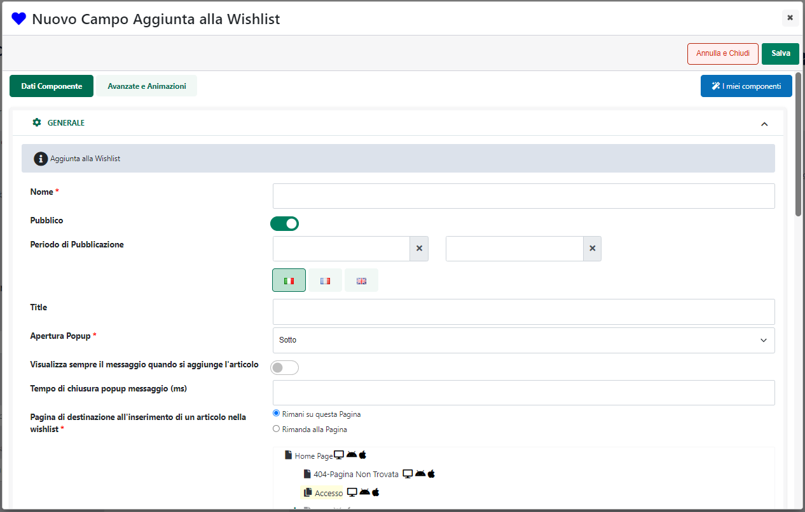
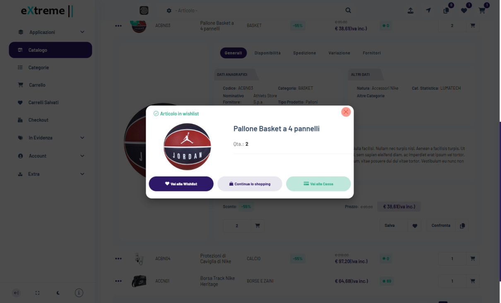
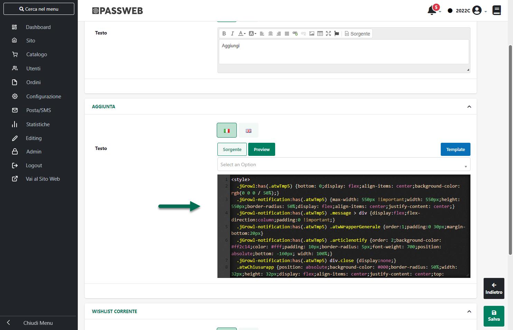
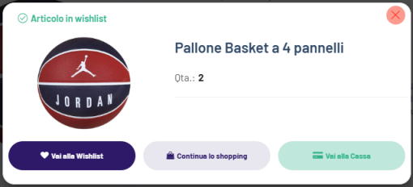
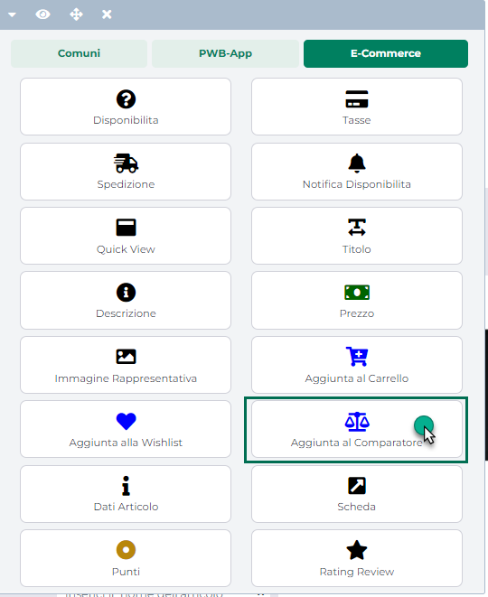
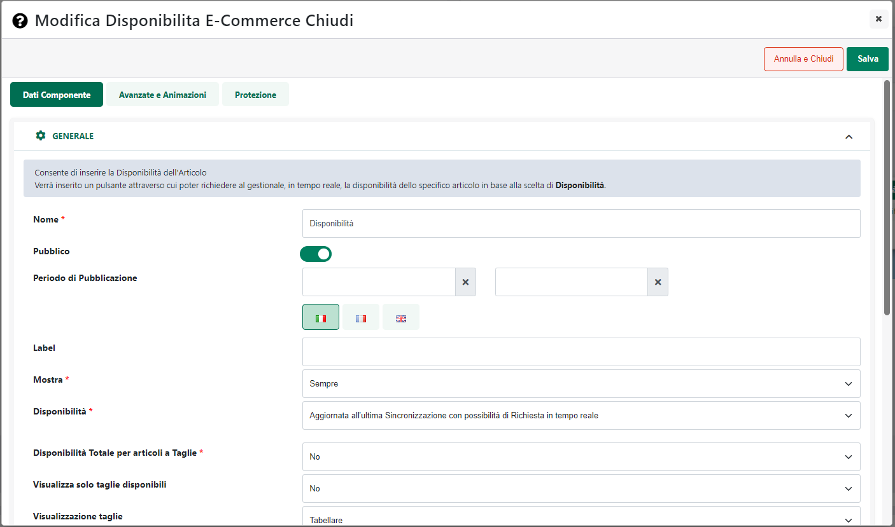
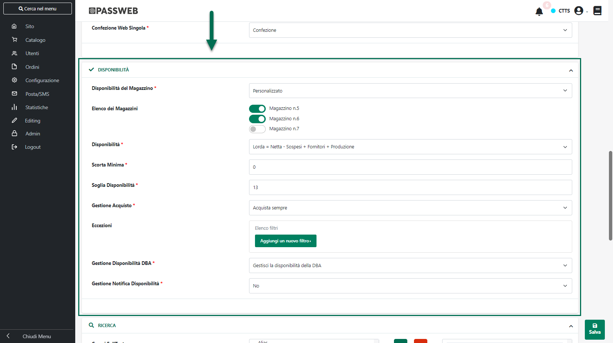
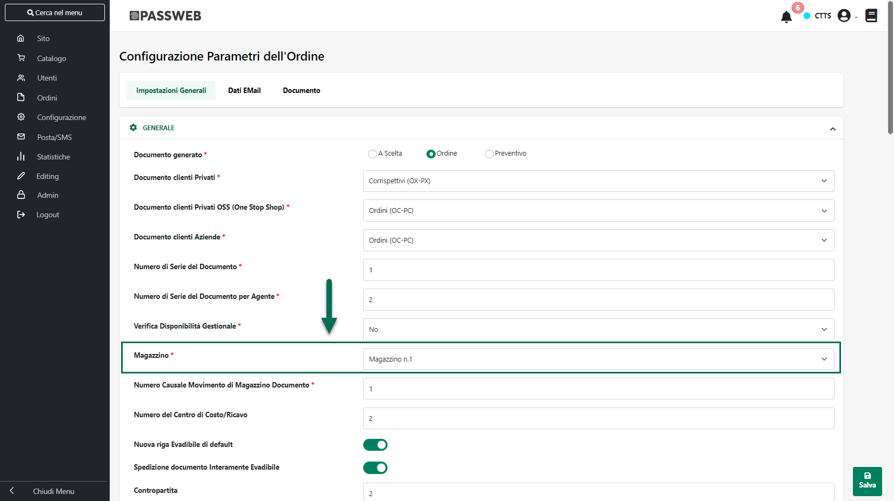

# PUBBLICAZIONE DI ARTICOLI A TAGLIE E COLORI

Come evidenziato nei precedenti capitoli di questo manuale, per
pubblicare articoli a Taglie / Colori, o comunque con elementi varianti,
è necessario innanzitutto predisporre apposite Inserzioni in cui
dovranno essere gestiti i relativi elementi di variazione

A tali Inserzioni andranno poi collegate liste di vendita in cui
potranno essere inseriti solamente Articoli a Taglie / Colori o Articoli
padri di struttura (per maggiori informazioni in merito a queste due
operazioni si veda anche quanto indicato all'interno del capitolo
"*Marketplace -- Altri Marketplace -- Articoli a Taglie / Colori*" di
questo manuale).

Una volta creata anche la lista di vendita l'ultimo passo sarà
ovviamente quello di pubblicare sulla piattaforma terza gli articoli
presenti all'interno della lista stessa

In questo senso il processo di pubblicazione di articoli a taglie /
colori o comunque con un massimo di due elementi varianti, è
sostanzialmente analogo a quello utilizzato per la creazione di una
normale lista di vendita utilizzata per la pubblicazione di semplici
articoli di magazzino.

Ci sono però alcune considerazione di fondamentale importanza da fare
che riguardano essenzialmente il modo in cui i vari articoli verranno
poi raggruppati sulla piattaforma terza sotto uno stesso articolo padre
e come viene determinato il "Nome" di questo stesso articolo.

**Dipendentemente da come è stata configurata l'Inserzione utilizzata
per la pubblicazione, l'elemento che consentirà di raggruppare, nella
piattaforma terza, gli articoli figlio sotto uno stesso padre sarà il
penultimo o il terzultimo livello della struttura.**

Nello specifico:

- Se i due elementi di variazione nell' Inserzione sono stati impostati
  su "Ultimo Campo Struttura" e "Tabella Taglie" l'elemento che
  consentirà di raggruppare gli articoli figlio sotto uno stesso padre
  sarà il penultimo campo della struttura

- Se i due elementi di variazione nell' Inserzione sono stati impostati
  su "Penultimo Campo Struttura" e "Ultimo Campo Struttura" l'elemento
  che consentirà di raggruppare gli articoli figlio sotto uno stesso
  padre sarà il terzultimo campo della struttura

Per quel che riguarda invece il nome assegnato all'articolo padre sulla
piattaforma terza, questo sarà determinato dal Titolo utilizzato per
quello che in Passweb è l'articolo padre di tutta la struttura cui verrà
aggiunta la descrizione associata, a seconda dei casi, all'elemento del
penultimo o del terzultimo campo della struttura

**[ESEMPIO]{.underline}**

Per comprendere meglio questo aspetto supponiamo di fare riferimento ad
una situazione in cui sia necessario trattare articoli a taglie e colori
configurati su Mexal con una struttura in cui gli ultimi due livelli
sono rappresentati rispettivamente dalla "Marca" e dal "Colore".

Le taglie sono invece gestite mediante la relativa tabella Mexal.

Supponiamo inoltre di aver codificato ed esportato all'interno del sito
Passweb, in relazione al padre di struttura FNU04 i seguenti articoli
figlio

- FNU04NIKNER

- FNU04NIKROS

- FNU04ADIGRI

Supponiamo infine di aver personalizzato, in Passweb, i possibili valori
assunti dal penultimo livello della struttura (NIK e ADI)
rispettivamente con le stringhe "Nike" e "Adidas"

In queste condizioni, posto di aver configurato correttamente (secondo
quanto indicato nei precedenti capitoli) l'Inserzione da utilizzare per
la pubblicazione dei prodotti , tentando di aggiungere articoli alla
Lista di Vendita troveremo ora tra le possibili scelte l'articolo padre
FNU04

Selezionando questo articolo e inserendolo nella Lista di Vendita
Passweb prenderà in considerazione i soli articoli figlio ad esso
relativi effettivamente esportati e gestiti all'interno del sito (quindi
i tre precedentemente indicati) e, in relazione ad ognuno di essi, andrà
ad inserire in lista un elemento per ogni taglia indicata nella
corrispondente tabella Mexal.

Ora, tenendo conto di quanto precedentemente indicato, in fase di
pubblicazione l'elemento che consentirà di raggruppare gli articoli
figlio sotto uno stesso padre sarà il penultimo campo della struttura
(quindi la "Marca") per cui tutti i prodotti che, in Passweb,
risulteranno avere lo stesso valore in corrispondenza di questo campo,
verranno raggruppati, nella piattaforma terza, sotto uno stesso articolo
padre il cui nome sarà costruito prendendo il Titolo di quello che in
Passweb è l'articolo padre (FNU04) cui verrà aggiunta la descrizione
associata, per i relativi figli, al penultimo campo della struttura

In definitiva dunque, nelle condizioni indicate, sulla piattaforma terza
verranno pubblicati i seguenti articoli:

- **Felpa Elite Performance -- NIKE**

- **Felpa Elite Performance -- ADIDAS**

Il primo dei due prodotti sopra evidenziati (Felpa Elite Performance --
NIKE) raggrupperà tutte le possibili combinazione dei due articoli
Passweb FNU04NIKNER e FNU04NIKROS

Il secondo (Felpa Elite Performance -- ADIDAS) raggrupperà invece tutte
le possibili combinazione dell' articolo Passweb FNU04ADIGRI

Coerentemente con le impostazioni dell'Inserzione dunque, sulla
piattaforma terza l'utente avrà la possibilità di scegliere al massimo
tra due elementi di variazione (colore e taglia) mentre per ogni valore
dell'elemento "Marca" verrà creato un articolo distinto

