# INSERZIONI

Una volta terminata correttamente la configurazione dell'Account, il
passo successivo sarà quello di creare le Inserzioni mediante cui poter
definire esattamente quali dovranno essere i dati articolo (Titolo,
Categoria Merceologia, Immagini, Condizioni, Attributi ...) da
trasferire sulla piattaforma terza e quelle che dovranno essere le
regole di pubblicazione da applicare in fase di esportazione dati.

**ATTENZIONE! Il metodo scelto per la pubblicazione degli articoli (Api
o Pubblicazione via csv) non influenza in alcun modo la creazione e la
gestione delle Inserzioni.**

In altri termini dunque con l'Inserzione andremo a definire esattamente
quali informazioni dovranno essere passate alla piattaforma terza per
ogni singolo prodotto e quali dovranno essere le regole di pubblicazione
/ arresto automatico.

Il metodo di pubblicazione scelto definisce invece il modo in cui i dati
articolo, stabiliti all'interno delle Inserzioni, verranno
effettivamente passati alla piattaforma terza.

In particolare dunque nel momento in cui si dovesse decidere di
pubblicare gli articoli:

- **via Api**: i dati impostati nelle Inserzioni verranno trasferiti ed
  inseriti sulla piattaforma terza in maniera automatica sfruttando,
  appunto, le API messe a disposizione dalla piattaforma stessa

- **via CSV**: i dati impostati nelle Inserzioni verranno pubblicati
  all'interno di appositi file csv. Tali file potranno poi essere
  scaricati direttamente dal Wizard di Passweb e uplodati manualmente
  sulla piattaforma terza oppure, al termine della pubblicazione,
  potranno essere copiati automaticamente all'interno di un'area
  condivisa (Ftp, Google Drive ...) stabilita in fase di configurazione
  dell'Account.

> In ogni caso, in questa configurazione un' eventuale elaborazione dei
> file csv prodotti da Passweb così come l'effettivo upload dei relativi
> dati nella piattaforma terza restano operazioni in carico a chi
> gestisce effettivamente lo specifico sito Prestashop

La colonna "**Destinazione**" presente nella maschera di configurazione
delle singole Inserzioni (tab "**Specifiche**") consente di
visualizzare, per ogni specifica gestita, quella che è la sua
destinazione e quindi se questa stessa specifica verrà poi presa in
considerazione nella pubblicazione via API, nella pubblicazione via CSV
o in entrambi i casi

**ATTENZIONE!** **Eventuali specifiche custom verranno prese in
considerazione, per ovvie ragioni, solo ed esclusivamente nel momento in
cui il metodo di pubblicazione scelto sia via csv**

Per maggiori informazioni in merito a come poter creare o gestire
un'Inserzione si veda invece quanto indicato all'interno del capitolo
"*Altri Marketplace -- Gestione Inserzioni*".

Per maggiori informazioni relativamente ai due diversi possibili metodi
di pubblicazione articoli si veda invece quanto indicato nel capitolo di
"*Prestashop -- Configurazione Account -- Metodi di pubblicazione
articoli*" di questo manuale

**ATTENZIONE!** in ogni caso nel momento in cui gli articoli da gestire
dovessero essere dell'ordine delle decine di migliaia, è sempre
preferibile utilizzare una pubblicazione via csv inquanto i tempi
pubblicazione via API, in queste condizioni, potrebbero essere
particolarmente elevati.

Di seguito vengono elencate le Specifiche Standard, obbligatorie e
opzionali, di cui tener conto in fase di creazione di una nuova
Inserzione.

##### SPECIFICHE STANDARD OBBLIGATORIE

Come già evidenziato all'interno dei precedenti capitoli di questo
manuale, le specifiche obbligatorie altro non sono se non campi
dell'anagrafica articolo presente sulla piattaforma terza che devono
essere necessariamente valorizzati per poter codificare correttamente il
relativo prodotto.

**ATTENZIONE!** Indipendentemente dal fatto che la specifica considerata
sia una di quelle obbligatorie o una di quelle addizionali la cosa
importante da tenere sempre in considerazione è che **nel momento in cui
tali specifiche vengano mappate con "Attributi Passweb" il valore che
esse andranno ad assumere articolo per articolo, all'interno di Passweb,
dovrà essere necessariamente uno dei valori effettivamente accettati e/o
presenti anche sulla piattaforma terza**.

In conseguenza di ciò se, per determinati articoli, il valore assunto
per una specifica mappata con un Attributo Passweb dovesse non
combaciare con uno dei valori ammessi per la specifica stessa lato
Prestashop, la pubblicazione degli articoli coinvolti in un inserzione
che fa uso di quella stessa specifica potrebbe dare degli errori o
andare a buon fine lasciando comunque su Prestashop il corrispondente
attributo non valorizzato.

**Si ricorda inoltre che l'integrazione Passweb -- Prestashop lavora a
livello di singolo Negozio, per cui ogni singola Inserzione farà sempre
riferimento allo Store Id associato all'Account definito per
l'Inserzione stessa**

Di seguito vengono riportate le Specifiche Standard obbligatorie da
gestire nell'integrazione tra Passweb e Prestashop.

###### NAME

Consente di mappare il **Nome** dell'articolo pubblicato sulla
piattaforma terza

**Modalità ammesse:** Attributo Articolo / Attributo Passweb

Mappando la specifica in esame sulla modalità "**Attributo Articolo**"
il campo valore potrà poi essere impostato unicamente sulla seguente
opzione:

- **Titolo**: in questo caso il nome dell'articolo da passare alla
  piattaforma terza sarà esattamente lo stesso di quello visualizzato in
  Passweb all'interno del componente "Titolo". In questo senso
  l'effettivo valore (descrizione presente nell'anagrafica gestionale,
  valore di un attributo o valore personalizzato) dipendono direttamente
  da come si è deciso di gestire il "Titolo" dell'articolo

**ATTENZIONE!** la specifica Name potrebbe anche definire su Prestashop
il permalink dell'articolo. In conseguenza di ciò, nel momento in cui si
dovesse decidere di apportare delle modifiche a questo valore sarà
necessario prestare particolare attenzione al fatto di non creare poi
degli errori 404 indesiderati.

In ogni caso se, in fase di modifica dei dati un articolo, dovesse
essere già presente su Prestashop un determinato valore per il permalink
della scheda prodotto questo non verrà modificato

Infine, considerando che la specifica "Name" è una delle specifiche
obbligatorie e che come tale andrà necessariamente gestita
nell'Inserzione utilizzata per pubblicare i prodotti, **il Nome
dell'articolo su Prestashop, di base, sarà controllato da Passweb**.

Nel momento in cui l'esigenza dovesse essere quindi quella di **non
modificare il nome del prodotto su Prestashop** (ad esempio perché
l'articolo era già presente sulla piattaforma terza o perché dopo essere
stato pubblicato sono state fatte delle modifiche in tal senso
direttamente su Prestashop), sarà necessario accedere alla maschera di
configurazione del proprio Account, portarsi all'interno della sezione
"**Articoli**" e verificare **di NON aver selezionato il parametro
"Sovrascrivere il titolo sul Marketplace"**

Per maggiori informazioni in merito si veda anche quanto indicato nel
precedente capitolo "*Prestashop -- Configurazione Account -- Articoli*"
di questo manuale

**ATTENZIONE!** Per maggiori informazioni relativamente a come vengono
costruiti su Prestashop i Titoli di articoli padre si veda anche quanto
indicato all'interno del capitolo "*Marketplace -- Altri Marketplace --
Prestashop -- Pubblicazione di Articoli a Taglie / Colori*" di questo
manuale.

###### CATEGORY DEFAULT

Consente di mappare la **Categoria merceologica principale** cui
associare l'articolo all'interno di Prestashop

**Modalità ammesse:** Attributo Marketplace / Attributo Articolo /
Attributo Passweb

**ATTENZIONE! Lo schema delle categorie merceologiche cui fare
riferimento** è quello definito direttamente all'interno di Prestashop
in relazione allo Store Id associato all'Account definito
sull'Inserzione

Mappando la specifica in esame sulla modalità "**Attributo
Marketplace**" il campo "**Valore**" verrà gestito come un campo ad
autocompletamento per cui iniziando a digitare alcuni caratteri
(relativamente a quella che dovrà essere la categoria merceologica degli
articoli coinvolti nell'Inserzione) verrà visualizzato automaticamente
lo schema delle categorie merceologiche create e gestite sulla
piattaforma terza (e coerenti ovviamente con quanto digitato
dall'utente)

Sarà quindi sufficiente selezionare, tra quelle proposte, l'opzione
desiderata in maniera tale da inserire all'interno del campo
"**Valore**" il percorso completo della categoria merceologica cui
dovranno appartenere tutti gli articoli pubblicati mediante l'Inserzione
in esame.

**ATTENZIONE!** Nel caso in cui l'esigenza dovesse essere quella di
legare un articolo a più categorie merceologiche sarà necessario
utilizzare la specifica addizionale "**Categories**" oppure operare
direttamente all'interno di Prestashop

Come al solito, lavorando in questo modo tutti gli articoli pubblicati
mediante l'Inserzione in esame verranno associati, ovviamente, alla
stessa categoria merceologica (quella indicata, appunto, all'interno del
campo Valore)

Nel caso in cui si voglia ottenere qualcosa di più dinamico, in maniera
tale da poter sfruttare una stessa Inserzione per pubblicare sulla
piattaforma terza articoli appartenenti a diverse categorie
merceologiche sarà necessario configurare la specifica in esame
impostandola, questa volta, sulla modalità "**Attributo Articolo**"

In queste condizioni il campo "**Valore**" verrà gestito come una combo
box e l'unica opzione di scelta disponibile sarà "**Prestashop Categoria
Prodotto**"

Ciò significa che per ogni articolo pubblicato mediante l'Inserzione in
esame il valore relativo alla categoria merceologica principale sarà
esattamente quello impostato in corrispondenza del campo "**Prestashop
Product Category Default**" presente all'interno della sezione
"**Marketplace**" nell' Anagrafica Passweb della categoria merceologica
di appartenenza dell'articolo.

Il campo **"Prestashop Product Category Default"** è infatti un campo ad
autocompletamento e, come nel caso precedente per il campo Valore, anche
questa volta iniziando a digitare alcuni caratteri verrà visualizzato
automaticamente lo schema delle categorie merceologiche create e gestite
sulla piattaforma terza.

Lavorando in questo modo potrebbe quindi essere possibile assegnare due
articoli appartenenti, su Passweb, a due categorie merceologiche
completamente diverse (es. Smartphone e Televisori) a due altrettanto
diversi insiemi di categorie gestite sulla piattaforma terza.

Lo stesso risultato, infine, potrebbe essere ottenuto anche nel momento
in cui la specifica in oggetto dovesse essere configurata sulla modalità
"**Attributo Passweb**".

In questo caso però sarà necessario inserire manualmente, all'interno
dell'attributo deputato a gestire questo tipo di informazione, la
categoria merceologica principale cui l'articolo in esame dovrà essere
associato all'interno di Prestashop facendo attenzione, ovviamente, al
fatto di inserire esattamente uno dei valori ammessi (è richiesto
l'interno path della categoria), in caso contrario infatti l'articolo
non risulterà associato a nessuna categoria merceologica.

Infine, considerando che la specifica "Category Default" è una delle
specifiche obbligatorie e che come tale andrà necessariamente gestita
nell'Inserzione utilizzata per pubblicare i prodotti, **la Categoria
principale dell'articolo su Prestashop, di base, sarà controllata da
Passweb**.

Nel momento in cui l'esigenza dovesse essere quindi quella di **non
modificare, su Prestashop, la categoria principale del prodotto** (ad
esempio perché l'articolo era già presente sulla piattaforma terza o
perché dopo essere stato pubblicato sono state fatte delle modifiche in
tal senso direttamente su Prestashop), sarà necessario accedere alla
maschera di configurazione del proprio Account, portarsi all'interno
della sezione "**Articoli**" e verificare **di NON aver selezionato il
parametro "Sovrascrivere la categoria di default sul Marketplace"**

Per maggiori informazioni in merito si veda anche quanto indicato nel
precedente capitolo "*Prestashop -- Configurazione Account -- Articoli*"
di questo manuale

###### TAX RULES GROUP

Consente di mappare la regola definita all'interno di Prestashop per
gestire **l'assoggettamento IVA** degli articoli coinvolti nella
specifica inserzione

**Modalità ammesse:** Attributo Articolo / Attributo Marketplace /
Attributo Passweb

Mappando la specifica in esame sulla modalità "**Attributo
Marketplace**" il campo "**Valore**" verrà gestito come un campo ad
autocompletamento e i valori ammessi al suo interno saranno esattamente
quelli relativi alle regole di assoggettamento IVA definite su
Prestashop all'interno della sezione "**Internazionale -- Tasse --
Aliquote Iva**"

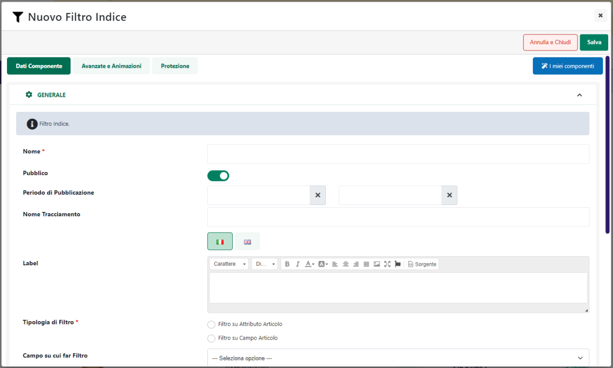

Sarà quindi sufficiente selezionare, tra quelle proposte, l'opzione
desiderata in maniera tale da inserirla all'interno del campo
"**Valore**"

Ovviamente in queste condizioni selezionando uno dei valori proposti,
poi tutti gli articoli pubblicati sulla piattaforma terza mediante
l'inserzione in esame verranno assoggettati alla stessa aliquota.

Nel caso in cui si voglia ottenere qualcosa di più dinamico, in maniera
tale da poter sfruttare una stessa Inserzione per pubblicare sulla
piattaforma terza articoli con aliquote IVA differenti sarà necessario
configurare la specifica in esame impostandola, questa volta, sulla
modalità "**Attributo Articolo**"

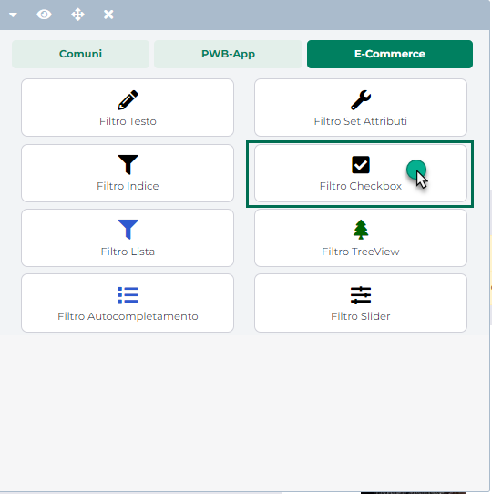

In queste condizioni il campo "**Valore**" verrà gestito come una combo
box e l'unica opzione di scelta disponibile sarà "**IVA**"

Ciò significa che per ogni articolo pubblicato mediante l'Inserzione in
esame verrà valutata l'iva per esso definita nel corrispondente campo
dell'anagrafica gestionale e, sulla base di tale valore, verrà poi
associato in Prestashop alla corrispondente regola di assoggettamento,
regola questa che, ovviamente, dovrà essere stata creata,
preventivamente, in maniera corretta all'interno della piattaforma
terza.

Supponendo quindi di pubblicare con la stessa inserzione due articoli A
e B che all'interno del gestionale sono gestiti rispettivamente con iva
al 22% e al 4%, su Prestashop questi verranno poi associati
rispettivamente:

- Articolo A (iva gestionale = 22%): verrà associato all' aliquota iva
  di prestashop definita per il paese Italia con percentuale al 22

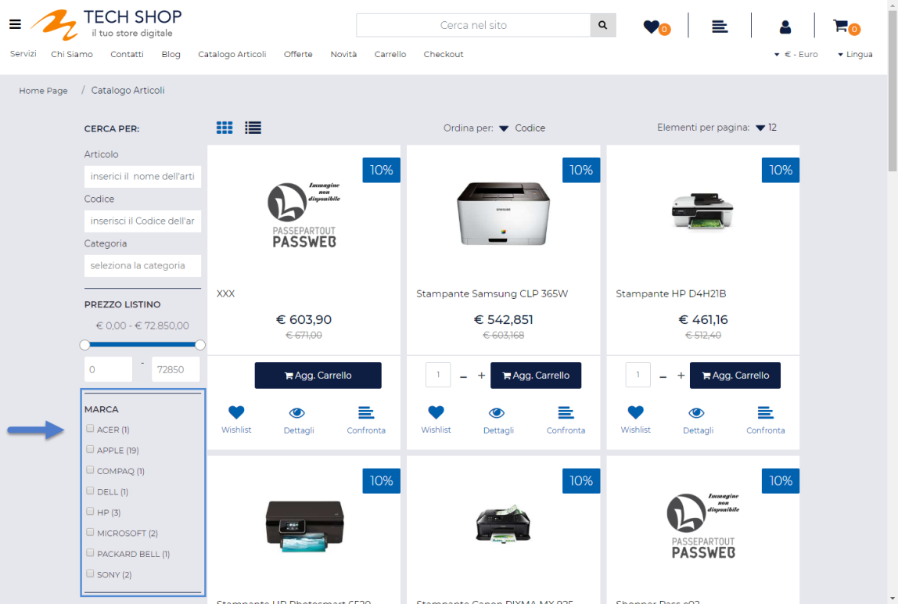

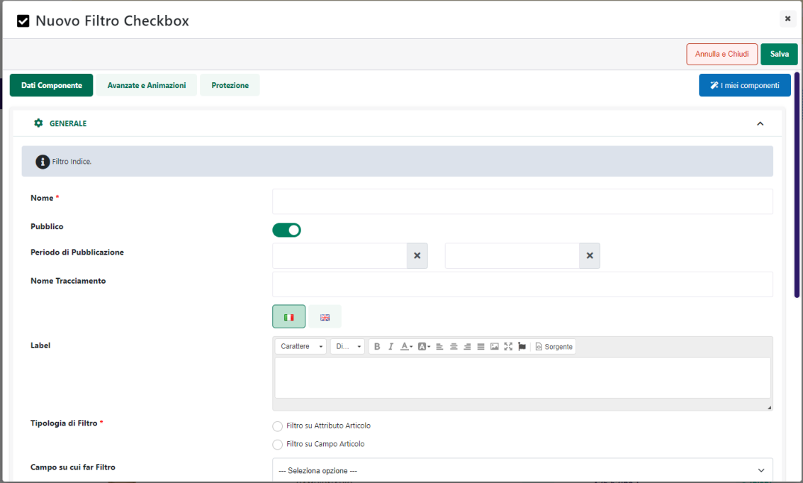

- Articolo B (iva gestionale = 4%): verrà associato all' aliquota iva di
  prestashop definita per il paese Italia con percentuale al 4

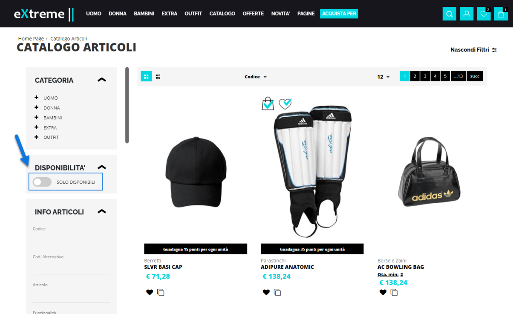

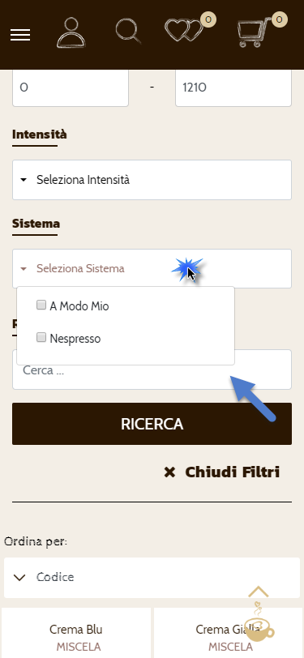

**ATTENZIONE!** Nel caso in cui siano presenti, lato Prestashop, più
regole di assoggettamento IVA che utilizzano, per lo stesso paese
Italia, la stessa aliquota, in fase di pubblicazione all'articolo verrà
assegnata la prima regola restituita dalle API di Prestashop

Volendo, infine, la stessa esigenza di pubblicare sulla piattaforma
terza, con una stessa Inserzione, articoli gestiti con diverse aliquote
iva, potrebbe essere soddisfatta anche seguendo due strade differenti
che prevedono rispettivamente di:

- Creare diverse inserzioni cui collare le diverse regole di
  assoggettamento iva e gestire poi liste di pubblicazione diverse per
  le categorie merceologiche relative agli articoli con diverse aliquote
  iva

- Utilizzare una stessa inserzione mappando però la specifica "Tax Rules
  Group" sul valore "**Attributo Passweb,** e selezionando poi dal
  relativo menu a tendina l'attributo deputato a gestire questo tipo di
  informazione

In quest'ultimo caso l'attributo indicato dovrà essere valorizzato
articolo per articolo con il nome della relativa regola di
assoggettamento definita in Prestashop (fare riferimento in questo senso
all'elenco di opzioni visualizzate nel momento in cui la specifica fosse
mappata sulla modalità "Attributo Marketplace")

**ATTENZIONE!** Nel caso in cui per un articolo dovesse essere impostato
il nome di una regola di assoggettamento IVA non presente in Prestashop
l'articolo in esame potrebbe non essere pubblicato correttamente

###### ULTERIORI INFORMAZIONI

Oltre alle specifiche obbligatorie appena analizzate (Name, Category
Default, Tax Rules Group), in fase di pubblicazione dei prodotti via API
verranno sempre passate alla piattaforma terza, anche se non
esplicitamente inserite nell'Inserzione, le seguenti informazioni:

- **codice gestionale** dell'articolo mappato con il campo
  **Riferimento** di Prestashop

- **immagine principale della scheda prodotto**

- **prezzo dell'articolo**

Per maggiori informazioni sulla gestione dei prezzi si rimanda a quanto
indicato nel successivo capitolo "*Prestashop -- Gestione Prezzi*" di
questo manuale.

Per quel che riguarda invece la gestione delle immagini articolo è bene
sottolineare che:

- Se l'esigenza dovesse essere quella di inviare alla piattaforma terza,
  prelevandole sempre dal gestionale, altre immagini, oltre a quella
  principale, sarà necessario utilizzare la specifica addizionale
  "**Number Additional Images (number_additional_images)**"

<!-- -->

- L'associazione e l'aggiornamento delle immagini articolo da Passweb a
  Prestashop funziona in maniera posizionale. In altri termini dunque
  l'immagine prodotto prelevata dal gestionale sarà la prima immagine
  associata in Prestashop al relativo articolo; la prima immagine
  secondaria eventualmente prelevata da gestionale sarà la seconda
  immagine associata su Prestashop e via di seguito.

> In considerazione di ciò **si consiglia di non adottare mai una
> gestione mista** (alcune immagini sul gestionale e altre caricate
> direttamente da Prestashop).
>
> Allo stesso modo una volta importate le immagini dal gestionale queste
> non dovrebbero poi essere cambiate di posizione operando direttamente
> all'interno di Prestashop
>
> **ATTENZIONE! Nel momento in cui non dovesse essere rispettato quanto
> sopra indicato in fase di pubblicazione delle immagini articolo si
> potrebbero verificare sovrascritture e / o eliminazioni indesiderate
> delle risorse attualmente presenti su Prestashop**
>
> Se la logica adottata da Passweb non dovesse essere adatta a
> soddisfare le esigenze del caso, e si dovesse quindi decidere di
> gestire le immagini articolo dalla piattaforma terza sarà allora
> necessario verificare di non avere inserito le immagini lato
> gestionale o, in alternativa, di aver correttamente selezionato, in
> fase di configurazione dell'Account di integrazione, il parametro
> "**Escludi Feed Immagini**" (sezione "**Articoli**") in maniera tale
> da inibire completamente la trasmissione di questo tipo di risorse dal
> gestionale Passepartout verso la piattaforma terza
>
> **ATTENZIONE!** La gestione delle immagini articolo direttamente sul
> gestionale potrebbe, per ovvie ragioni, rallentare il processo di
> pubblicazione degli articoli. **Laddove possibile è auspicabile quindi
> gestire queste immagini direttamente sulla piattaforma terza**

Un' ultima considerazione di fondamentale importanza da fare, infine, è
quella che riguarda il campo "**Visibilità**". In tale senso è bene
sottolineare che:

- In fase di pubblicazione di un nuovo articolo **il campo Visibilità**
  presente nell'anagrafica articolo di Prestashop verrà automaticamente
  impostato sul valore "**Ovunque**"

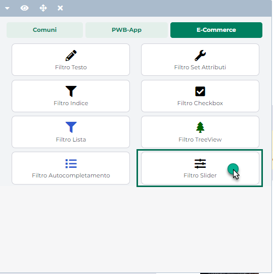

- In fase di aggiornamento di un articolo già presente sulla piattaforma
  terza, il **campo Visibilità** non verrà mai modificato. Eventuali
  variazioni in questo senso dovranno quindi essere fatte operando
  direttamente sulla piattaforma terza.

##### SPECIFCHE STANDARD ADDIZIONALI

Di seguito vengono riportate le principali Specifiche addizionali da
gestire nell'integrazione tra Passweb e Prestashop

###### ID

Consente di mappare il **Codice identificativo** assegnato all'articolo
direttamente dalla piattaforma terza su cui l'articolo stesso è stato
pubblicato

**Modalità ammesse:** Attributo Passweb / Personalizzato

Questa specifica è di fondamentale importanza, in quanto verrà
utilizzata come campo chiave nel momento in cui si vogliano agganciare,
in fase di pubblicazione articoli, dei prodotti già presenti sulla
piattaforma terza e che, generalmente, non sono stati inseriti mediante
l'integrazione con Passweb

###### NUMBER ADDITIONAL IMAGES

**ATTENZIONE!** La specifica in oggetto verrà effettivamente presa in
considerazione solo nel momento in cui non sia stato selezionato, in
fase di configurazione dell'Account, il parametro "**Escludi Feed
Immagini**" (per maggiori informazioni in merito si veda anche quanto
indicato all'interno del capitolo "*Marketplace -- Altri Marketplace --
Prestashop -- Configurazione Account -- Articoli*" di questo manuale)

Consente di indicare il numero di immagini aggiuntive da inviare alla
piattaforma terza oltre all'immagine principale della scheda prodotto.

**Modalità ammesse:** Attributo Passweb / Personalizzato

**ATTENZIONE!** La specifica **number_additional_images** è gestita come
campo numerico

Nel caso in cui l'esigenza dovesse essere quella di inviare alla
piattaforma terza, per tutti per tutti gli articoli coinvolti
nell'Inserzione, lo stesso numero di immagini aggiuntive, sarà
necessario:

- mappare la specifica in oggetto sulla modalità "Personalizzato"

- inserire all'interno del campo Valore il numero di immagini aggiuntive
  da utilizzare

Nel caso in cui l'esigenza dovesse invece essere quella di passare per
diversi articoli coinvolti nell'inserzione un diverso numero di immagini
addizionali, sarà necessario:

- mappare la specifica in oggetto sulla modalità "Attributo Passweb"

- impostare il campo "Valore" sull'Attributo Passweb deputato a gestire
  per ogni singolo articolo questo tipo di informazione, prestando
  particolare attenzione al fatto che tale attributo sia di tipo
  numerico.

**ATTENZIONE!** Le immagini degli articoli verranno inviate a Prestashop
mediante un processo separato che partirà, in maniera automatica, al
termine del processo di pubblicazione / aggiornamento degli articoli
sulla piattaforma esterna.

In conseguenza di ciò terminato il processo di pubblicazione degli
articoli (e ricevuta l'apposita mail), per poter visualizzare le
immagini prodotto sulla piattaforma esterna occorrerà attendere anche la
fine del relativo processo di pubblicazione

**Per quel che riguarda invece gli articoli gestiti a colori e taglie
mediante la relativa tabella Mexal**, considerando che a quello che in
Prestashop viene considerato come un articolo padre possono fare capo
diversi articoli figlio di Passweb / Mexal (e che quindi l'articolo
padre di Prestashop potrebbe non corrispondere ad un prodotto
fisicamente presente su Passweb) non sarà possibile associare in fase di
pubblicazione su Prestashop specifiche immagini a determinati colori /
taglie.

In conseguenza di ciò è consigliabile, in queste condizioni, gestire la
pubblicazione delle immagini articolo direttamente dalla piattaforma
terza (per maggiori informazioni in merito si veda anche il successivo
capitolo "*Pubblicazione di articoli a Taglie e Colori -- Immagini
Articolo*")

Infine è bene ricordare ancora una volta che:

- Nel momento in cui si dovesse decidere di gestire le immagini dei
  prodotti dal relativo gestionale Passepartout queste potrebbero andare
  a sostituire eventuali immagini già presenti su Prestashop.

- **In tal senso si consiglia di non adottare mai una gestione mista**
  (alcune immagini sul gestione e altre caricate direttamente da
  Prestashop) e di demandare, laddove possibile, la gestione delle
  immagini articolo interamente alla piattaforma terza anche in
  considerazione del fatto che la presenza di queste immagini sul
  gestionale potrebbe, per ovvie ragioni, rallentare il processo di
  pubblicazione degli articoli

###### CATEGORIES

Consente di mappare le **Categorie merceologiche** **secondarie** cui
associare l'articolo all'interno di Prestashop

**Modalità ammesse:** Attributo Marketplace / Attributo Articolo /
Attributo Passweb

**ATTENZIONE**! Come per la categoria principale, anche in questo caso
lo schema delle categorie merceologiche cui fare riferimento è quello
definito direttamente all'interno di Prestashop in relazione allo Store
Id associato all'Account definito sull'Inserzione

Mappando la specifica in esame sulla modalità "**Attributo
Marketplace**" il campo "**Valore**" verrà gestito come un campo ad
autocompletamento per cui iniziando a digitare alcuni caratteri
(relativamente a quella che dovrà essere la categoria merceologica
secondaria cui associare gli articoli coinvolti nell'Inserzione) verrà
visualizzato automaticamente lo schema delle categorie merceologiche
create e gestite sulla piattaforma terza (e coerenti ovviamente con
quanto digitato dall'utente)

Sarà quindi sufficiente selezionare, tra quelle proposte, l'opzione
desiderata in maniera tale da inserire all'interno del campo
"**Valore**" il percorso completo della categoria secondaria cui
dovranno appartenere tutti gli articoli pubblicati mediante l'Inserzione
in esame.

Una volta individuata e selezionata la prima categoria merceologica
comparirà quindi un nuovo campo ad autocompletamento mediante il quale
poter selezionare ulteriori categorie.

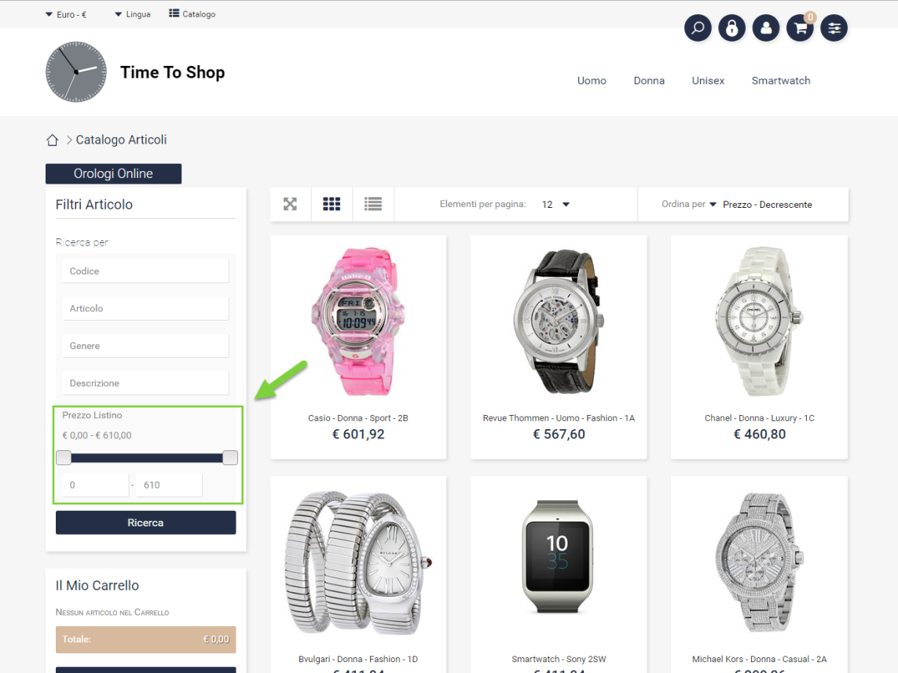

Come al solito, lavorando in questo modo tutti gli articoli pubblicati
mediante l'Inserzione in esame verranno associati, ovviamente, alle
stesse categorie merceologiche (quelle indicate, appunto, all'interno
del campo Valore)

Nel caso in cui si voglia ottenere qualcosa di più dinamico, in maniera
tale da poter sfruttare una stessa Inserzione per associare più articoli
a diverse categorie secondarie, sarà necessario configurare la Specifica
impostandola, questa volta, sulla modalità "**Attributo Articolo**"

In queste condizioni il campo "**Valore**" verrà gestito come una combo
box e l'unica opzione di scelta disponibile sarà "**Prestashop Categoria
Prodotto**"

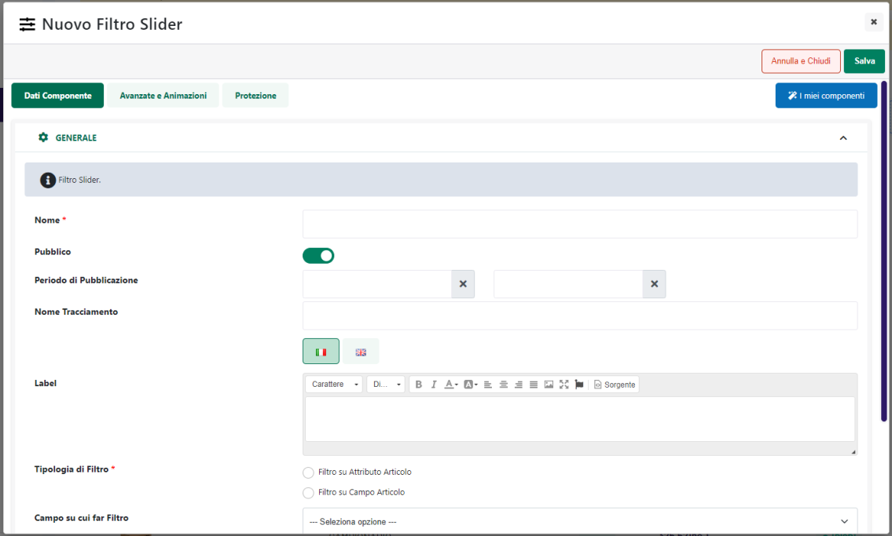

Ciò significa che per ogni articolo pubblicato mediante l'Inserzione in
esame il valore relativo alle categorie secondarie coinciderà
esattamente con quanto impostato in corrispondenza del campo
"**Prestashop Product Category**" presente all'interno della sezione
"**Marketplace**" nell' Anagrafica Passweb della categoria merceologica
di appartenenza dell'articolo.

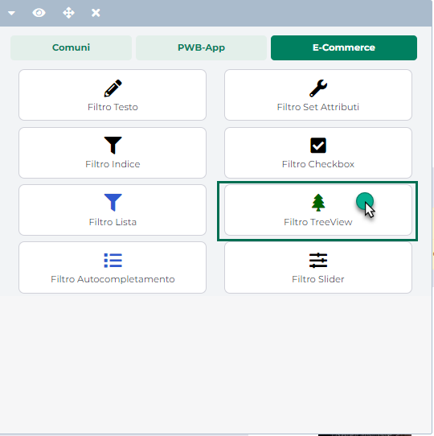

Il campo **"Prestashop Product Category"** è un campo ad
autocompletamento che accetta valori multipli. Anche in questo caso
dunque iniziando a digitare alcuni caratteri verrà visualizzato
automaticamente lo schema delle categorie merceologiche create e gestite
sulla piattaforma terza.

Lavorando in questo modo potrebbe quindi essere possibile assegnare due
articoli appartenenti, su Passweb, a due categorie merceologiche
completamente diverse (es. Smartphone e Televisori) a due altrettanto
diversi insiemi di categorie secondarie gestite su Prestashop.

Lo stesso risultato, infine, potrebbe essere ottenuto anche nel momento
in cui la specifica in oggetto dovesse essere configurata sulla modalità
"**Attributo Passweb**".

In questo caso però sarà necessario inserire manualmente, all'interno
dell'attributo deputato a gestire questo tipo di informazione, le
categorie secondarie cui associare l'articolo all'interno della
piattaforma terza facendo attenzione al fatto di inserire esattamente
uno dei valori ammessi (**è richiesto l'intero path della categoria**).

**ATTENZIONE!** Se l'esigenza dovesse essere quella di gestire le
categorie merceologiche secondarie direttamente da Prestashop la
specifica "Categories" NON dovrà essere gestita nell'Inserzione

###### DESCRIPTION

Consente di mappare la **Descrizione estesa** di Prestashop (tab
"**Descrizione**" presente all'interno della scheda "**Impostazioni di
base**" dell'anagrafica articolo di Prestashop)

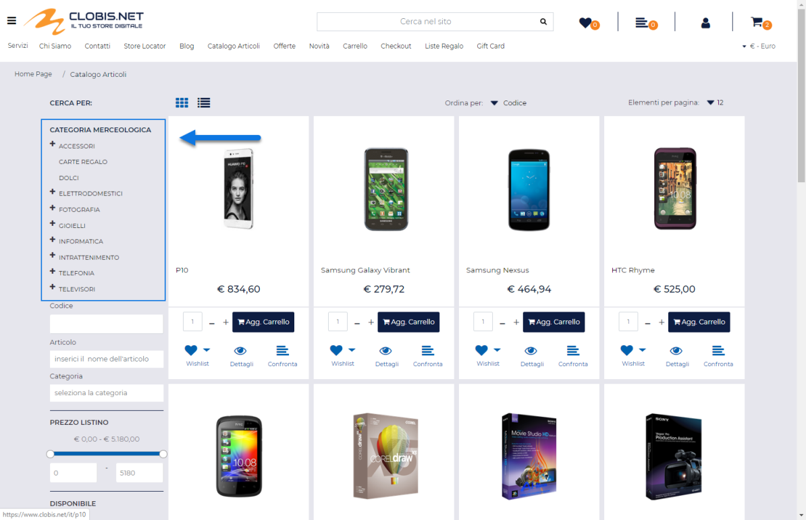

**Modalità ammesse:** Attributo Articolo / Attributo Passweb /
Personalizzato

Mappando la specifica in esame sulla modalità "**Attributo Articolo**"
il campo valore potrà poi essere impostato su una delle seguenti
opzioni:

- **Descrizione:** in questo caso il valore della descrizione estesa da
  passare alla piattaforma terza sarà esattamente lo stesso di quello
  visualizzato in Passweb all'interno del componente "Descrizione" (e
  quindi la descrizione inserita per l'articolo in Docuvision o
  direttamente nell'apposito campo dell'Anagrafica Passweb)

- **Titolo**: in questo caso il valore della descrizione estesa da
  passare alla piattaforma terza sarà esattamente lo stesso di quello
  visualizzato in Passweb all'interno del componente "Titolo". In questo
  senso l'effettivo valore (descrizione presente nell'anagrafica
  gestionale, valore di un attributo o valore personalizzato) dipendono
  direttamente da come si è deciso di gestire il "Titolo" dell'articolo

###### DESCRIPTION SHORT

Consente di mappare la **Descrizione breve** di Prestashop (tab
"**Riepilogo**" presente all'interno della scheda "**Impostazioni di
base**" dell'anagrafica articolo di Prestashop)

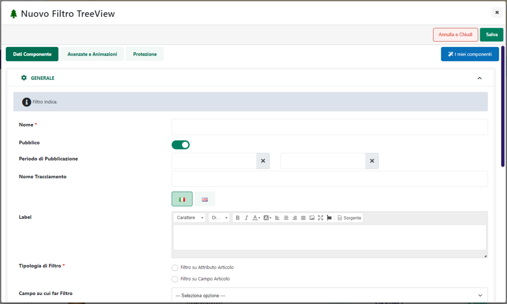

**Modalità ammesse:** Attributo Articolo / Attributo Passweb /
Personalizzato

Mappando la specifica in esame sulla modalità "**Attributo Articolo**"
il campo valore potrà poi essere impostato su una delle seguenti
opzioni:

- **Descrizione:** in questo caso il valore della descrizione estesa da
  passare alla piattaforma terza sarà esattamente lo stesso di quello
  visualizzato in Passweb all'interno del componente "Descrizione" (e
  quindi la descrizione inserita per l'articolo in Docuvision o
  direttamente nell'apposito campo dell'Anagrafica Passweb)

- **Titolo**: in questo caso il valore della descrizione estesa da
  passare alla piattaforma terza sarà esattamente lo stesso di quello
  visualizzato in Passweb all'interno del componente "Titolo". In questo
  senso l'effettivo valore (descrizione presente nell'anagrafica
  gestionale, valore di un attributo o valore personalizzato) dipendono
  direttamente da come si è deciso di gestire il "Titolo" dell'articolo

###### ACTIVE

Consente di mappare il parametro che determina l'effettiva pubblicazione
dell'articolo sulla piattaforma terza.

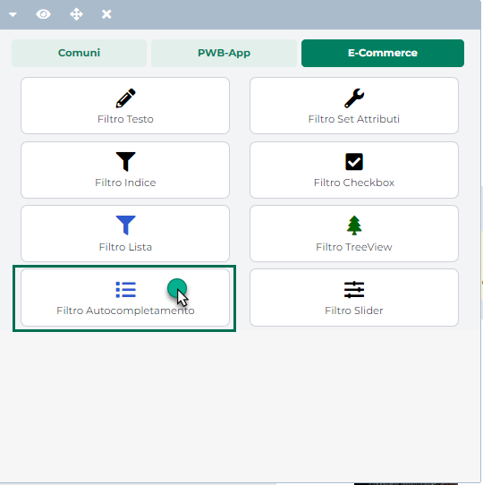

Grazie a questa specifica sarà quindi possibile decidere **se l'articolo
in esame, pur essendo presente nel Back end di Prestashop, dovrà essere
o meno pubblicato anche sul Front end**.

**Modalità ammesse:** Attributo Articolo / Attributo Passweb / Attributo
Marketplace

Mappando la specifica in esame sulla modalità "**Attributo
Marketplace**" il campo "**Valore**" verrà gestito come un campo ad
autocompletamento e gli unici due valori ammessi saranno quelli
prelevati direttamente dalla piattaforma terza ossia:

- **Yes**

- **No**

**ATTENZIONE!** Lavorando in questo modo tutti gli articoli pubblicati
mediante l'Inserzione in esame avranno per questo attributo uno dei due
valori sopra indicati

Nel caso in cui si voglia ottenere qualcosa di più dinamico decidendo,
all'interno della stessa inserzione, quale valore dovrà assumere,
articolo per articolo, la specifica in oggetto, sarà necessario
configurarla impostandola sulla modalità "**Attributo Articolo**".

In queste condizioni l'unica opzione selezionabile all'interno del campo
Valore sarà "**Pubblicato**" e la specifica in esame verrà
automaticamente mappata sulla funzionalità Mexal **"Pubblica"** (per
maggiori informazioni in merito si veda anche il capitolo
"*Configurazione Gestionale -- Mexal -- Attivazione Passweb --
Funzionalità Mexal Articoli -- Pubblicare / Nascondere articoli
all'interno del negozio web*").

**ATTENZIONE! In queste condizioni dunque lo stato degli articoli
pubblicati sulla piattaforma terza potrà essere controllato direttamente
da Mexal.**

**ATTENZIONE!** Nel caso in cui la specifica in esame non dovesse essere
inserita nell'Inserzione e/o non dovesse essere valorizzata in maniera
puntuale l'articolo sarà sempre pubblicato anche sul front end del sito

###### ONLINE ONLY

Consente di mappare il parametro (**Solo sul web**) che determina se gli
articoli coinvolti nell' Inserzione dovranno essere impostati come
vendibili solo online oppure anche all'interno del negozio al dettaglio.

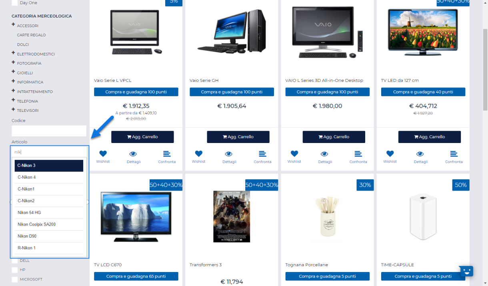

**Modalità ammesse:** Attributo Passweb / Attributo Marketplace

Mappando la specifica in esame sulla modalità "**Attributo
Marketplace**" il campo "**Valore**" verrà gestito come un campo ad
autocompletamento e gli unici due valori ammessi saranno quelli
prelevati direttamente dalla piattaforma terza ossia:

- **Yes:** parametro selezionato

- **No:** parametro deselezionato

**ATTENZIONE!** Lavorando in questo modo tutti gli articoli pubblicati
mediante l'Inserzione in esame avranno per questo attributo uno dei due
valori sopra indicati

Nel caso in cui si voglia ottenere qualcosa di più dinamico decidendo,
all'interno della stessa inserzione, quale valore dovrà assumere,
articolo per articolo, la specifica in oggetto, sarà necessario
configurarla impostandola sulla modalità "**Attributo Passweb**".

In queste condizioni sarà poi necessario selezionare dal relativo menu a
tendina l'attributo deputato a gestire questo tipo di informazione,
attributo questo che dovrà essere valorizzato articolo per articolo con
uno dei due valori ammessi dalla specifica in esame.

**ATTENZIONE!** Nel caso in cui la specifica in esame non dovesse essere
inserita nell'Inserzione e/o non dovesse essere valorizzata in maniera
puntuale l'articolo verrà codificato con il parametro "Solo sul web" NON
selezionato

###### RELATED PRODUCTS

Parametro di gestione degli articoli abbinati. Consente di decidere **se
gestire o meno gli abbinati (Prodotti collegati) su Prestashop mediante
le associazioni definite direttamente in Mexal.**

**Modalità ammesse:** Attributo Marketplace / Attributo Passweb

Mappando la specifica in esame sulla modalità "**Attributo
Marketplace**" il campo "**Valore**" verrà gestito come un campo ad
autocompletamento e gli unici due valori ammessi saranno:

- **Si:** selezionando questa opzione sarà possibile gestire, su
  Prestashop, i "**Prodotti collegati**" mediante le relative
  associazioni definite direttamente in Mexal.

> In queste condizioni infatti, in fase di pubblicazione articoli verrà
> passato alla piattaforma terza, per ciascuno dei prodotti coinvolti
> nell'Inserzione, anche l'elenco di tutti i codici abbinati definiti
> direttamente in Mexal e, nel momento in cui tali codici dovessero
> corrispondere ad articoli già pubblicati su Prestashop, verranno
> automaticamente inseriti nella sezione "**Prodotti Correlati**"
> presente nell'Anagrafica Prestashop del singolo articolo

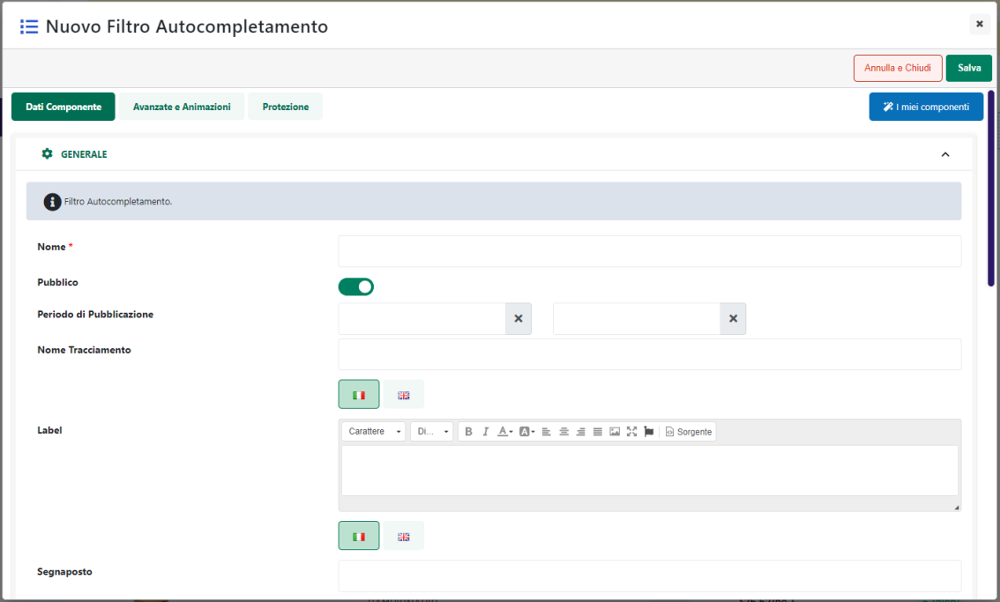

> **ATTENZIONE! In queste condizioni, eventuali associazioni create
> direttamente in Prestashop verranno sovrascritte dalle informazioni
> passate in fase di pubblicazione**
>
> Nel caso in cui l'esigenza dovesse quindi essere quella di gestire gli
> abbinati direttamente da Magento si consiglia di non gestire la
> specifica in esame o, al limite, di impostarla sul valore "No"

- **No:** selezionando questa opzione in fase di pubblicazione articoli
  non verrà passata a Prestashop nessun tipo di informazione
  relativamente agli abbinamenti definiti in Mexal per gli articoli
  coinvolti nell'Inserzione

> In queste condizioni i prodotti collegati potranno quindi essere
> gestiti e definiti liberamente all'interno della piattaforma terza.

Come per tutte le altre specifiche, anche in questo caso, nel momento in
cui l'esigenza dovesse essere quella di ottenere qualcosa di più
dinamico decidendo, all'interno della stessa inserzione, articolo per
articolo se passare o meno l'elenco dei codici abbinati, sarà necessario
mappare la specifica in esame sulla modalità **"Attributo Passweb"**

In queste condizioni, all'interno del campo "**Valore**" andrà poi
indicato l'Attributo Passweb preposto alla gestione di questa specifica
informazione, attributo questo che dovrà essere valorizzato articolo per
articolo con il valore "Si" o "No" a seconda del fatto di voler gestire,
per quello specifico prodotto, gli abbinati direttamente da Mexal oppure
su Prestashop

**ATTENZIONE!** Non sono ammesse modalità ibride in cui gli abbinati
definiti su Mexal si vadano ad aggiungere a quelli impostati manualmente
su Prestashop

###### MANUFACTURER (id_manufacturer)

Consente di mappare i Marchi attualmente codificati e gestiti
all'interno di Prestashop (sezione "**Catalogo -- Marchi & Fornitori -
Marchi**")

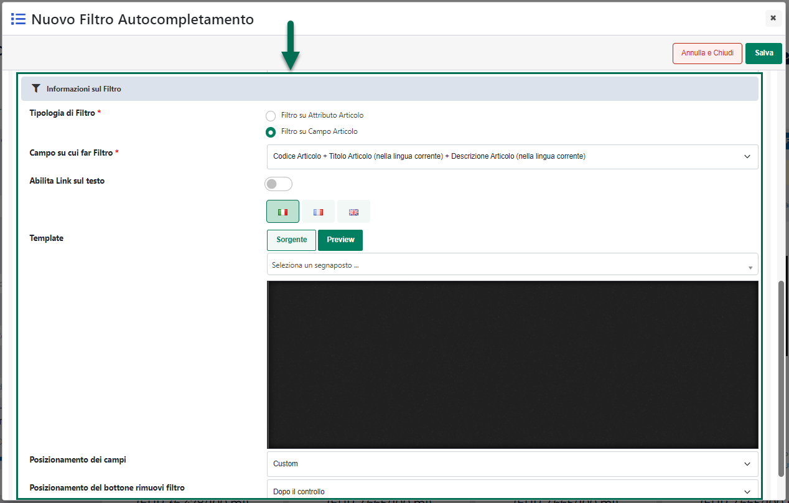

Grazie a questa specifica è quindi possibile valorizzare il campo
"**Marca**" presente all'interno della sezione "**Impostazioni di
base**" dell'anagrafica articolo Prestashop

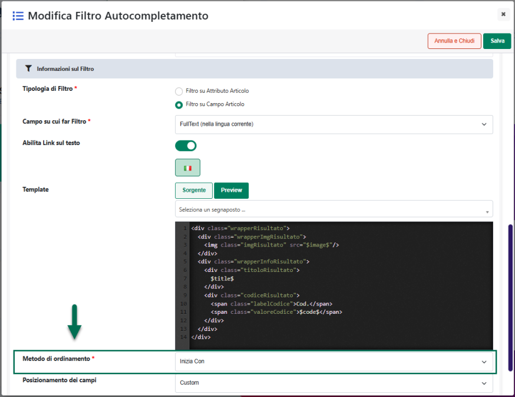

**Modalità ammesse:** Attributo Passweb / Attributo Marketplace

Mappando la specifica in esame sulla modalità "**Attributo
Marketplace**" il campo "**Valore**" verrà gestito come un campo ad
autocompletamento e i valori accettati saranno esattamente i **Nomi**
dei marchi codificati su Prestashop:

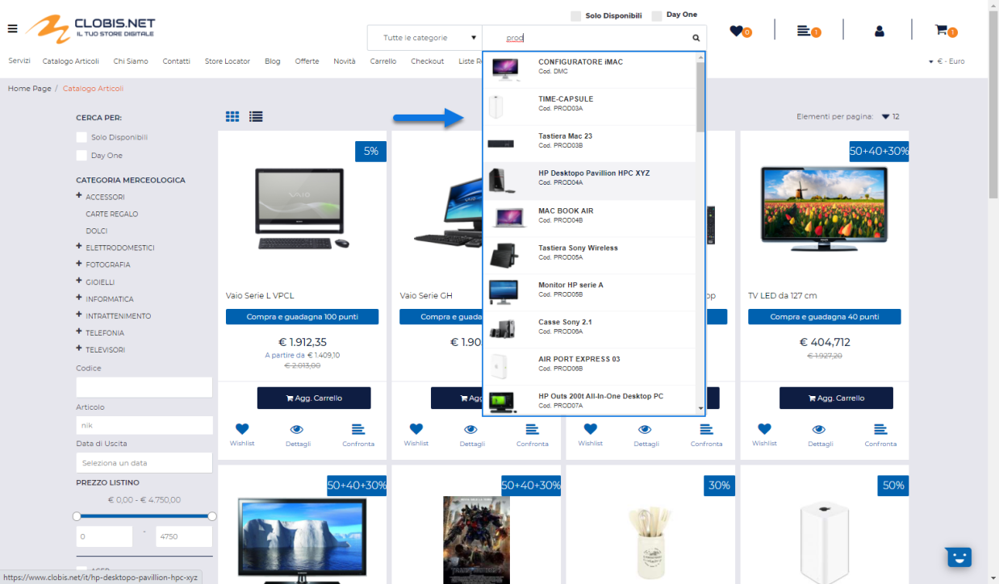

**La cosa importante da tenere in considerazione è che la specifica in
esame corrisponde, in particolare, all'id delle varie marche gestite su
Prestashop**.

Nel momento in cui tale specifica dovesse essere mappata su "Attributo
Marketplace" sarà poi Passweb a preoccuparsi di passare alla piattaforma
terza (nella pubblicazione via API) o di inserire nel relativo file di
pubblicazione (nella pubblicazione via csv) l'identificativo
corrispondente alla marca effettivamente scelta in fase di mapping

**ATTENZIONE!** Lavorando in questo modo tutti gli articoli pubblicati
mediante l'Inserzione in esame verranno associati al marchio indicato
all'interno del campo in oggetto

Nel caso in cui si voglia ottenere qualcosa di più dinamico decidendo,
all'interno della stessa inserzione, quale valore dovrà assumere,
articolo per articolo, il campo Marca, sarà necessario configurare la
specifica impostandola sulla modalità "**Attributo Passweb**"

In queste condizioni sarà poi necessario selezionare all'interno del
campo "**Valore**" l'attributo Passweb deputato a gestire questo tipo di
informazione, ricordando ancora una volta che il dato da passare alla
piattaforma terza dovrà essere l'id della corrispondente marca
Prestashop.

###### MANUFACTURER NAME (manufacturer_name)

Anche la specifica "Manufacturer Name" consente di mappare i Marchi
attualmente codificati e gestiti all'interno di Prestashop; a differenza
però della specifica analizzata nel precedente capitolo di questo
manuale che, come evidenziato lavora sull'id delle marche prestashop,
**la specifica manufacturer_name lavora invece sul nome di queste stesse
marche**.

**Modalità ammesse:** Attributo Articolo / Attributo Passweb /
Personalizzato

Mappando la specifica in esame sulla modalità "**Personalizzato**" il
dato da passare alla piattaforma terza dovrà essere inserito
direttamente nell'Inserzione stessa all'interno del corrispondente campo
"**Valore**"

**ATTENZIONE!** Lavorando in questo modo tutti gli articoli pubblicati
mediante l'Inserzione in esame verranno associati allo stesso marchio
indicato all'interno del campo "Valore"

Nel caso in cui si voglia ottenere qualcosa di più dinamico decidendo,
all'interno della stessa inserzione, quale valore dovrà assumere,
articolo per articolo, il campo Marca, sarà necessario configurare la
specifica impostandola sulla modalità "**Attributo Articolo**".

In queste condizioni il campo "**Valore**" verrà gestito come una combo
box e le possibili opzioni di scelta saranno:

- **Categoria Statistica:** selezionando questa opzione la specifica
  "Manufacturer Name" verrà mappata direttamente con il campo "Categoria
  Statistica" presente nell' anagrafica articolo del gestionale.

> In queste condizioni dunque, per ogni singolo articolo coinvolto
> nell'Inserzione il campo "Marca" dell'anagrafica Prestashop verrà
> valorizzato esattamente con quanto indicato, per l'articolo stesso, in
> corrispondenza del campo "Categoria Statistica" dell'anagrafica
> gestionale

- **Natura:** selezionando questa opzione la specifica "Manufacturer
  Name" verrà mappata direttamente con il campo "Natura" presente nell'
  anagrafica articolo del gestionale.

> In queste condizioni dunque, per ogni singolo articolo coinvolto
> nell'Inserzione il campo "Marca" dell'anagrafica Prestashop verrà
> valorizzato esattamente con quanto indicato, per l'articolo stesso, in
> corrispondenza del campo "Natura" dell'anagrafica gestionale

Volendo, infine, la stessa esigenza di pubblicare sulla piattaforma
terza, mediante una stessa Inserzione, articoli con un valore diverso
per la specifica in esame, potrebbe essere soddisfatta anche impostando
il campo "**Modalità**" sul valore "**Attributo Passweb**"

In queste condizioni sarà poi necessario selezionare all'interno del
campo "**Valore**" l'attributo Passweb deputato a gestire questo tipo di
informazione, ricordando ancora una volta che, in questo caso, il dato
da passare alla piattaforma terza dovrà essere il nome della
corrispondente marca Prestashop.

In ogni caso nel momento in cui si dovesse decidere di impostare il
campo "Modalità" su "Attributo Articolo" oppure "Attributo Passweb",
occorrerà poi considerare che:

- nel caso in cui la "Categoria Statistica" dell'articolo, piuttosto che
  la sua "Natura" o il valore dell'Attributo Passweb utilizzato per
  gestire questa informazione dovessero avere uno dei valori già
  presenti tra le marche di Prestashop, in fase di pubblicazione verrà
  agganciato tale valore

- nel caso in cui invece la "Categoria Statistica" dell'articolo,
  piuttosto che la sua "Natura" o il valore dell'Attributo Passweb
  utilizzato per gestire questa informazione dovessero avere un valore
  non ancora presente tra le marche effettivamente gestite su
  Prestashop, in fase di pubblicazione verrà creata la nuova marca e
  verrà poi associata all'articolo appena pubblicato

**ATTENZIONE!** in fase di pubblicazione via API potranno essere create
solo ed esclusivamente marche relative alla lingua italiana

###### SUPLLIER

Consente di impostare il Fornitore predefinito selezionandolo tra uno di
quelli attualmente codificati su Prestashop (sezione "**Catalogo --
Marchi & Fornitori - Fornitori**")

**Modalità ammesse:** Attributo Passweb / Attributo Marketplace

Mappando la specifica in esame sulla modalità "**Attributo
Marketplace**" il campo "**Valore**" verrà gestito come un campo ad
autocompletamento e i valori accettati saranno esattamente i **Nomi**
dei fornitori codificati su Prestashop:

Il fornitore selezionato verrà impostato come predefinito all'interno
della sezione "**Fornitori**" nel tab "**Opzioni**" dell'anagrafica
articolo di Prestashop)

**ATTENZIONE!** Lavorando in questo modo a tutti gli articoli pubblicati
mediante l'Inserzione in esame verrà associato lo stesso fornitore
predefinito

Nel caso in cui si voglia ottenere qualcosa di più dinamico decidendo,
all'interno della stessa inserzione, quale dovrà essere il fornitore
predefinito per il singolo articolo, sarà necessario configurare la
specifica impostandola sulla modalità "**Attributo Passweb**".

In queste condizioni sarà poi necessario selezionare dal relativo menu a
tendina l'attributo deputato a gestire questo tipo di informazione,
attributo questo che dovrà essere valorizzato articolo per articolo con
il **Nome** di uno dei Fornitori gestiti su Prestashop.

###### EAN13 / ISBN / UPC

Le specifiche EAN13 / ISBN / UPC consentono di mappare i relativi campi
presenti all'interno della sezione "**Condizioni & Riferimenti**" nel
tab "**Opzioni**" dell'anagrafica articolo di Prestashop

**Modalità ammesse:** Attributo Articolo / Attributo Passweb /
Personalizzato

Mappando la specifica in esame sulla modalità "**Attributo Articolo**"
il campo valore potrà poi essere impostato su una delle seguenti
opzioni:

- **Codice:** selezionando questa opzione il codice EAN13 / ISBN / UPC
  da memorizzare nei relativi campi Prestashop, coinciderà per tutti gli
  articoli coinvolti nell'Inserzione, con il loro Codice gestionale

- **Codice Alternativo:** selezionando questa opzione il codice EAN13 /
  ISBN / UPC da memorizzare nei relativi campi Prestashop, coinciderà,
  per tutti gli articoli coinvolti nell'Inserzione, con il Codice
  Alternativo per essi in uso all'interno del gestionale

- **Codice Alias GTIN:** selezionando questa opzione il codice EAN13 /
  ISBN / UPC da memorizzare nei relativi campi Prestashop, coinciderà
  per tutti gli articoli coinvolti nell'Inserzione con il Codice Alias
  per essi in uso all'interno del gestionale

> **ATTENZIONE!** A differenza del codice e del codice alternativo,
> all'interno del gestionale possono essere definiti anche più codici
> alias per lo stesso prodotto.
>
> In questo caso dunque l'applicazione si comporterà in maniera diversa
> a seconda del fatto che il gestionale collegato al sito Ecommerce sia
> Mexal oppure uno dei gestionali Ho.Re.Ca.
>
> **[SITI ECOMMERCE COLLEGATI A MEXAL]{.underline}**
>
> In questo caso è possibile marcare uno degli N codici alias in uso
> all'interno del gestionale in maniera tale da identificarlo
> esattamente come quello che dovrà poi essere passato a Prestashop in
> fase di pubblicazione dell'articolo.
>
> Per far questo è sufficiente accedere alla maschera di creazione del
> codice Alias

> e compilare i vari campi come di seguito indicato:

- **Codice**: inserire il valore del codice (UPC / EAN13 / ISBN) che
  dovrà essere passato a Prestashop in fase di pubblicazione del
  prodotto

- **Descrizione:** consente di marcare l'Alias in questione come quello
  relativo al codice UPC / EAN13 / ISBN da passare poi a Prestashop.\
  Nello specifico dunque all'interno di questo campo andrà
  necessariamente inserito il valore **GTIN**

- **Elemento TG -- solo per articoli a Taglia:** indicare,
  selezionandola dall'apposito menu a tendina, la specifica Taglia cui
  il codice in esame dovrà essere riferita

> In queste condizioni in fase di pubblicazione sul marketplace verrà
> passato a Prestashop tra gli N codici Alias presenti sul gestionale
> solo quello effettivamente marcato con la Descrizione GTIN
>
> **ATTENZIONE!** Nel caso in cui per determinate ragioni dovessero
> essere marcati, per lo stesso articolo, più codici alias come codici
> GTIN da passare a Prestashop, in fase di pubblicazione verrà
> considerato, ai fini dell'inserzione sul marketplace, solo il primo
> valore utile.
>
> **[SITI ECOMMERCE COLLEGATI AD UNO DEI GESTIONALI
> HO.RE.CA.]{.underline}**
>
> In questo caso sarà possibile mappare la specifica relativa al codice
> UPC / EAN13 / ISBN con il codice alias di una determinata tipologia
> (es. Codice EAN13, Codice EAN8 ecc...) selezionandola tra quelle in
> uso all'interno del gestionale.
>
> A differenza di Mexal in questo caso però, non è possibile marcare uno
> degli N codici alias o EAN in uso all'interno del gestionale come
> quello che identifica in maniera specifica il codice da passare a
> Prestashop in fase di pubblicazione pertanto, nel momento in cui un
> determinato articolo dovesse avere più valori per la stessa tipologia
> di Alias verrà considerato, ai fini dell'inserzione sul marketplace,
> solo il primo valore utile.

Mappando invece la specifica in esame sulla modalità "**Attributo
Passweb**" sarà poi necessario selezionare dal relativo menu a tendina
l'attributo deputato a gestire questo tipo di informazione, attributo
questo che dovrà essere valorizzato articolo per articolo con il
relativo codice (EAN13, ISBN, UPC).

In ogni caso occorre sempre fare attenzione al fatto di inserire dei
codici EAN13, ISBN o UPC sintatticamente corretti. In caso contrario
infatti si potrebbero poi avere dei problemi in fase di importazione
dati sulla piattaforma terza.

###### WIDTH / HEIGHT / DEPT / WEIGHT

Le specifiche Width / Height / Dept / Weight consentono di mappare
rispettivamente i campi **Larghezza, Altezza, Profondità e Peso**
presenti all'interno della sezione "Spedizione" dell'anagrafica articolo
di Prestashop

**Modalità ammesse:** Attributo Passweb / Personalizzato

Mappando la specifica in esame sulla modalità "**Personalizzato**" il
campo "**Valore**" verrà gestito come un semplice campo di testo
all'interno del quale poter indicare esattamente il valore che dovrà
assumere, su Prestashop, la relativa dimensione

**ATTENZIONE!** Lavorando in questo modo, tutti gli articoli pubblicati
mediante l'Inserzione in esame, assumeranno per i campi indicati le
stesse dimensioni

Nel caso in cui si voglia ottenere qualcosa di più dinamico decidendo,
all'interno della stessa inserzione, articolo per articolo, il valore
che dovranno assumere queste misure, sarà necessario configurare la
relativa specifica impostandola sulla modalità "**Attributo Passweb**".

In queste condizioni sarà poi necessario selezionare dal relativo menu a
tendina l'attributo deputato a gestire questo tipo di informazione,
attributo questo che dovrà essere valorizzato articolo per articolo con
l'esatto valore del campo "Ubicazione Magazzino" da passare a Prestashop

###### ADDITIONA DELIVERY TIME

Consente di mappare il campo "**Tempi di consegna**" presente
all'interno tab "**Spedizione**" dell'anagrafica articolo di Prestashop

**Modalità ammesse:** Attributo Passweb / Attributo Marketplace

Mappando la specifica in esame sulla modalità "**Attributo
Marketplace**" il campo "**Valore**" verrà gestito come un menu a
tendina all'interno del quale poter selezionare una delle opzioni
presenti su Prestashop per il campo "Tempi di Consegna"

**ATTENZIONE!** Lavorando in questo modo tutti gli articoli pubblicati
mediante l'Inserzione in esame avranno, per il campo "Tempi di Consegna"
lo stesso valore.

Nel caso in cui si voglia ottenere qualcosa di più dinamico decidendo,
all'interno della stessa inserzione, quale valore dovrà assumere,
articolo per articolo, il relativo campo Prestashop, sarà necessario
configurare la specifica impostandola sulla modalità "**Attributo
Passweb**".

In queste condizioni sarà poi necessario selezionare dal relativo menu a
tendina l'attributo deputato a gestire questo tipo di informazione,
attributo questo che dovrà essere valorizzato articolo per articolo con
uno dei seguenti valori:

- 0 : in questo caso il campo Prestashop "Tempi di Consegna" verrà
  impostato sull'opzione "**Nessuno**"

- 1 : in questo caso il campo Prestashop "Tempi di Consegna" verrà
  impostato sull'opzione "**Tempo di consegna predefinito**"

- 2 : in questo caso il campo Prestashop "Tempi di Consegna" verrà
  impostato sull'opzione "**Specifica i tempi di consegna per questo
  prodotto**"

###### DELIVERY IN / OUT STOCK

Consentono di mappare rispettivamente il campo:

- **Tempi di spedizione per i prodotti disponibili** (Delivery in Stock)

- **Tempi di spedizione per i prodotti non disponibili** (Delivery out
  Stock)

presenti all'interno tab "**Spedizione**" dell'anagrafica articolo di
Prestashop

**Modalità ammesse:** Attributo Passweb / Personalizzato

Mappando la specifica in esame sulla modalità "**Personalizzato**" il
campo "**Valore**" verrà gestito come un semplice campo di testo
all'interno del quale poter indicare esattamente il valore che dovrà
assumere, per tutti gli articoli coinvolti nell'Inserzione, il
corrispondente campo Prestashop

**ATTENZIONE!** Lavorando in questo modo, tutti gli articoli pubblicati
mediante l'Inserzione in esame assumeranno, per il campo indicato, lo
stesso valore.

Nel caso in cui si voglia ottenere qualcosa di più dinamico decidendo,
all'interno della stessa inserzione, articolo per articolo, il valore
che dovrà assumere il campo in questione, sarà necessario configurare la
specifica impostandola sulla modalità "**Attributo Passweb**".

In queste condizioni sarà poi necessario selezionare dal relativo menu a
tendina l'attributo deputato a gestire questo tipo di informazione,
attributo questo che dovrà essere valorizzato articolo per articolo con
l'esatto valore che dovrà assumere per esso il corrispondente campo
Prestashop

###### FUNZIONALITA'

Oltre ai campi indicati nei precedenti capitoli di questo manuale, è
possibile mappare anche tutte le Funzioni gestite in Prestashop e
definite all'interno della corrispondente sezione "**Attributi e
Funzionalità** **-- Funzioni**"

Nel momento in cui dovessimo quindi aver codificato, lato Prestashop,
una Funzione denominata ad esempio "**Paper Type**" che può assumere i
valori indicati in figura ("Ruled", "Plain", "Squarred" e "Doted")

tra le specifiche addizionali da poter gestire all'interno delle nostre
inserzioni, troveremo poi anche il corrispondente campo "Paper Type"

Tale specifica (come del resto tutte le altre che corrispondono ad
apposite Funzioni codificate in Prestashop) potrà essere mappata sui
valori **Attributo Marketplace** o **Personalizzato**

Nel primo caso il campo "**Valore**" verrà gestito come un campo ad
autocompletamento e i valori ammessi corrisponderanno esattamente alle
opzioni codificate per la stessa specifica all'interno di Prestashop

Come al solito lavorando in questo modo tutti gli articoli coinvolti
nell'Inserzione avranno per la specifica in questione lo stesso valore.

Nel caso in cui si voglia ottenere qualcosa di più dinamico decidendo,
all'interno della stessa inserzione, quale valore dovrà assumere,
articolo per articolo, la specifica in esame, sarà necessario
configurarla impostandola sulla modalità "**Attributo Passweb**".

In queste condizioni sarà poi necessario selezionare dal relativo menu a
tendina l'attributo deputato a gestire questo tipo di informazione,
attributo questo che dovrà poi essere valorizzato articolo per articolo,
utilizzando la notazione effettivamente richiesta da Prestashop, con il
valore che la specifica in esame dovrà assumere all'interno della
piattaforma terza.

###### SPECIFCHE PER ARTICOLI VARIANTI

Nel caso in cui l'esigenza dovesse essere quella di pubblicare su
Prestashop articoli Varianti, ossia articoli a Taglie/Colori e/o
articoli strutturati, sarà necessario, anche in questo caso, gestire
sull'Inserzione determinate specifiche indispensabili per abilitare
l'Inserzione stessa a trattare questo tipo di prodotti.

In particolare, nel caso di integrazione con Prestashop, le specifiche
necessarie per poter abilitare un' inserzione a trattare articoli
varianti saranno tutte quelle corrispondenti ad attributi prodotto
definiti all'interno della sezione "**Attributi e Funzionalità --
Attributi**" di Prestashop.

Tali attributi possono essere di tipo:

- **Menu a tendina**

- **Bottoni Radio**

- **Colore o texture**

e, come tali, ammettono la selezione di un solo valore tra N
disponibili,

Tali specifiche, una volta inserite nell'Inserzione, dovranno poi essere
impostate, come per tutte le altre integrazioni, sulla modalità
**"Elemento di Variazione".**

**ATTENZIONE!** Nel caso in cui si desideri agganciare attributi
Prestashop di tipo Menu a Tendina, Bottoni Radio, Colore / Texture per i
quali sono già stati definiti (lato Prestashop) i diversi possibili
valori che tali attributi potranno assumere, è necessario accertarsi che
anche in Passweb gli attributi coinvolti abbiano esattamente uno dei
valori impostati su Prestashop.

Supponendo dunque di aver inserito, lato Prestashop, il valore "Black"
tra le possibili opzioni di un Attributo articolo utilizzato per gestire
il colore, occorrerà poi fare attenzione ad utilizzare esattamente la
stessa descrizione "Black" anche lato Passweb / gestionale.

In caso contrario pubblicando un articolo per cui, in Passweb,
l'attributo utilizzato per il colore riporti ad esempio il valore "Nero"
verrà creata per il corrispondente attributo Prestashop, una nuova
opzione di scelta corrispondente, appunto, al valore fornito da Passweb.

Inoltre, in relazione agli Attributi Prestashop di tipo "**Colore /
Texture**" è necessario sottolineare che Passweb potrà inserire, a
seguito di una pubblicazione articoli, **solo ed esclusivamente i valori
testuali delle opzioni di selezione presenti in questo tipo di attributi
(quello riportato all'interno della colonna Valore). L'eventuale codice
esadecimale del relativo colore, così come le eventuali descrizioni in
lingua, andranno quindi definite direttamente all'interno di
Prestashop**

Lo stesso discorso vale, ovviamente, anche per gli attributi di tipo
"**Menu a Tendina**" o "**Bottoni Radio**". Supponendo infatti di far
riferimento ad un Attributo Prestashop "Dimensione", utilizzato per
gestire le taglie di un articolo, nel momento in cui la descrizione di
una Taglia presente in Passweb non dovesse coincidere esattamente con
una delle descrizioni impostate, lato Prestashop, per le opzioni di
selezione di questo particolare attributo, in fase di pubblicazione
articoli verrà creata una nuova opzione con il valore inserito da
Passweb, valore questo che, come nel caso precedente, verrà inserito
all'interno della corrispondente colonna Valore

Per maggiori informazioni relativamente a come gestire inserzioni con
articoli che presentano un massimo di due elementi varianti (es. Taglie
e Colori) si veda il relativo capitolo (*Marketplace -- Altri*
*Marketplace -- Articoli a Taglie / Colori*) di questo manuale.

##### SPECIFICHE CUSTOM

Come già evidenziato nei precedenti capitoli di questo manuale nelle
integrazioni Passweb -- Prestashop che utilizzano la pubblicazione
articoli via csv, oltre alle Specifiche Standard (obbligatorie e
addizionali) è possibile gestire anche delle Specifiche Custom

Tali specifiche dovranno prima essere codificate all'interno della
corrispondente sezione del Wizard (*Catalogo -- Altri Marketplace --
Specifiche*)

Una volta codificate sarà poi possibile gestirle, per ogni singola
Inserzione, esattamente allo stesso modo in cui si gestiscono le
specifiche standard precedentemente analizzate.

Tali specifiche potranno essere facilmente individuate tra tutte quelle
effettivamente gestibili per una data Inserzione, in base al fatto che
ciascuna di esse avrà un nome del tipo "**custom_tagSpecifica**" dove
**tagSpecifica** è esattamente il valore inserito in fase di codifica
della specifica stessa in corrispondenza del campo **Tag**

Per maggiori informazioni in merito a come poter codificare delle nuove
specifiche custom si veda anche quanto indicato all'interno del capitolo
"*Marketplace -- Altri Marketplace -- Gestione Specifiche -- Specifiche
Custom Prestashop / Magento"* di questo manuale.

Relativamente alle opzioni di mapping disponibili per questo tipo di
specifiche è semplice comprendere come le uniche possibilità previste
siano ovviamente "**Attributo Passweb**" e "**Personalizzato**".

**ATTENZIONE!** Come più volte ricordato le specifiche custom potranno
essere utilizzate e verranno prese effettivamente in considerazione solo
nelle integrazioni Passweb -- Prestashop che utilizzano come metodo di
pubblicazione articoli la pubblicazione via csv.

##### GESTIONE QUANTITA'

Come evidenziato nei precedenti capitoli di questo manuale la quantità
con cui un determinato articolo verrà pubblicato sulla piattaforma terza
dipende esattamente dalle impostazioni settate all'interno della sezione
"**Quantità**" presente nella maschera di configurazione della specifica
Inserzione (tab "Prezzo, quantità e formato") utilizzata per pubblicare
i prodotti.

Per maggiori informazioni in merito ai parametri di configurazione
presenti all'interno di questa sezione si rimanda a quanto indicato
all'interno del capitolo "*Altri Marketplace -- Gestione Inserzioni --
Creazione di una nuova inserzione -- Prezzo Quantità Formato --
Quantità*" di questo manuale

**ATTENZIONE!** Nel valutare quella che per Passweb è la quantità
effettiva di un certo articolo su di un determinato magazzino occorre
sempre tener conto:

- di quanto impostato alla pagina "**Catalogo -- Configurazione
  Parametri Catalogo**" all'interno della sezione "Disponibilità", sia
  in termini di **formula utilizzata** per il calcolo della
  disponibilità che in termini di **Scorta Minima**

- del fatto che la quantità disponibile su Passweb e, conseguentemente,
  la quantità con cui un determinato articolo potrebbe poi essere
  pubblicato sulla piattaforma terza, **potrebbe essere determinata
  anche dall'attivazione, per l' articolo stesso, della sua unità di
  misura secondaria** e dal relativo fattore di conversione impostato
  direttamente sul gestionale.

> Per maggiori informazioni in merito alla gestione dell'unità di misura
> secondaria si veda anche quanto indicato nel relativo capitolo di
> questo manuale (*Configurazione -- Mexal Configurazione Gestionale --
> Attivazione Passweb -- Funzionalità Mexal Articoli -- Gestione unità
> di misura principale / secondaria*)

##### GESTIONE PREZZI

A differenza delle integrazioni con Google e Facebook, nel caso di
integrazione con Prestashop il campo "**Modifica del Prezzo**", presente
nella sezione "Prezzo quantità e formato" dell'Inserzione, può essere
usato, senza particolari problemi, anche per aumentare o diminuire il
prezzo di listino definito all'interno del gestionale.

Per questo tipo di integrazione inoltre, è anche possibile associare ai
Gruppi Utente presenti sulla piattaforma terza specifici listini
gestionali agendo per questo all'interno della sezione "Listini"
presente nella maschera di configurazione di ogni singola Inserzione
(sezione "Prezzo, quantità e formato)

Di seguito vengono indicati gli aspetti fondamentali di cui tener conto
nella determinazione del prezzo applicato agli articoli pubblicati sulla
piattaforma terza:

- Il **prezzo base** dell'articolo sarà sempre quello determinato dal
  Listino indicato all'interno del campo "Prezzo" presente nella
  maschera di configurazione delle singola Inserzione (tab "Prezzo,
  quantità e formato")

- il **prezzo base** dei prodotti pubblicati sulla piattaforma verrà
  inserito all'interno dei relativi campi presenti nella scheda
  "**Prezzo**" dell'anagrafica articolo Prestashop ("Prezzo (tasse
  escl.)" e "Prezzo (tasse incl.)")

- nel caso di prodotti gestiti a confezione i prezzi dei due articoli
  creati su Prestashop (articolo semplice e articolo bundle) verranno
  determinati secondo quanto indicato nel successivo capitolo
  "*Pubblicazione articoli con quantità multiple*" di questo manuale

- nel caso in cui, in fase di configurazione dell'Inserzione dovesse
  essere indicata anche una particolare Categoria Sconto (campo
  "**Sconto Cliente**" dell'Inserzione), verrà creata un'apposita entry
  nella sezione "**Prezzi Specifici**" presente nell'anagrafica
  Prestashop del relativo articolo

> Lo sconto creato non avrà particolari limitazioni e sarà quindi
> valido:

- per la singola unità di prodotto

- per tutti i Clienti, i Negozi, le nazioni e le valute attualmente
  gestite sulla piattaforma terza

- per un periodo temporale privo di limitazioni

<!-- -->

- Oltre al campo "Sconto Cliente", verranno sempre prese in
  considerazione anche:

  - Eventuali particolarità sconto / prezzo definite per l'articolo e
    **valide per tutti i clienti** -- **Ecommerce Mexal**

  - Eventuali promozioni relative al prezzo / sconto dell'articolo e
    **valide per tutti i clienti** -- **Ecommerce Ho.Re.Ca.**

> Nel momento in cui la particolarità / promozione prezzo / sconto
> dovesse essere impostata sulla quantità dell'articolo e dovesse quindi
> essere definita su diversi scaglioni**, verrà presa in considerazione
> sempre e solamente la condizione associata al primo scaglione
> disponibile.**
>
> **ATTENZIONE!** Nel caso in cui per un determinato articolo dovessero
> essere valide delle particolarità sconto e /o degli sconti quantità
> (oltre alla Categoria Sconto Cliente) lo sconto effettivamente creato
> all'interno di Prestashop sarà determinato sulla base delle priorità
> definite per le diverse tipologie di sconto dal gestionale in uso.
>
> **ATTENZIONE!** L'utilizzo di sconti in cascata e/o di maggiorazioni
> presenti all'interno del gestionale (Mexal) potrebbero causare
> problemi in fase di pubblicazione degli articoli sulla piattaforma
> terza.
>
> **Si consiglia quindi di utilizzare sempre una scontistica che possa
> essere correttamente gestita anche sulla piattaforma terza**

- nel caso in cui si dovesse decidere di utilizzare il campo "**Modifica
  del Prezzo**" per aumentare il prezzo di vendita degli articoli
  coinvolti nell'Inserzione, e fosse applicata anche una certa Categoria
  Sconto, sarà poi necessario valutare sempre se il risultato della
  maggiorazione sia o meno superiore al prezzo di listino dell'articolo
  (quello inserito nel campo "Price").

- nel momento in cui in fase di configurazione della singola Inserzione
  dovessero essere stati associati ai Gruppi Utente presenti sulla
  piattaforma terza specifici Listini Gestionali, tali associazioni
  **determineranno la creazione su Prestashop di prezzi specifici che
  verranno poi associati e applicati solo ai relativi gruppi utente**

> Supponendo dunque di aver associato al Gruppo Utenti "Rivenditori" il
> Listino gestionale "Aziende", per ciascuno degli articoli pubblicati
> sulla piattaforma terza mediante l'Inserzione in esame verrà creata
> una specifica entry all'interno della sezione "**Prezzi Specifici**"
>
> 
>
> **valida solo per il gruppo "Rivenditori", dove il prezzo
> dell'articolo sarà esattamente quello definito in Mexal per il listino
> "Aziende".**
>
> Come evidenziato nella figura sopra riportata inoltre, il prezzo
> specifico così creato, risulterà essere valido:

- per la singola unità di prodotto

- per tutti i Negozi, le nazioni e le valute attualmente gestite sulla
  piattaforma terza

- per un periodo temporale privo di limitazioni

> Per maggiori informazioni relativamente a come poter associare
> specifici listini gestionali ai gruppi utente definiti sulla
> piattaforma terza si veda anche quanto indicato all'interno del
> capitolo "*Altri Marketplace -- Gestione Inserzioni -- Creazione di
> una nuova Inserzione -- Prezzo Quantità Formato -- Prezzo*" di questo
> manuale

- nel caso di articoli gestiti a taglie e/o colori o comunque con un
  massimo di due elementi di variazione:

  - All'articolo padre in Prestashop verrà assegnato un prezzo pari a 0

  - Ad ogni singola combinazione verrà assegnato il prezzo presente sul
    gestionale per il relativo articolo figlio oppure, nel caso di
    utilizzo della tabella Taglie di Mexal, il prezzo dell'articolo
    padre da cui la combinazione in esame deriva.

> Tale prezzo verrà inserito all'interno del campo "**Impatto sul
> prezzo**" presente in corrispondenza della singola combinazione e
> (essendo il prezzo del padre a 0) coinciderà esattamente con il prezzo
> finale della combinazione stessa
>
> Per maggiori informazioni in merito alla gestione dei prezzi nel caso
> di articoli a taglie / colori si veda anche quanto indicato
> all'interno del capitolo "*Marketplace -- Altri Marketplace --
> Prestashop -- Pubblicazione di articoli a taglie e colori -- Prezzi
> delle singole combinazioni*" di questo manuale.

