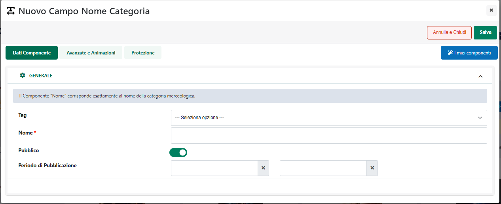

# PUBBLICAZIONE DI ARTICOLI A TAGLIE E COLORI

Come evidenziato nei precedenti capitoli di questo manuale, per
pubblicare su Prestashop articoli a Taglie / Colori, o comunque con
elementi varianti, è necessario innanzitutto predisporre apposite
Inserzioni in cui dovranno essere gestiti i relativi elementi di
variazione

A tali Inserzioni andranno poi collegate liste di vendita in cui
potranno essere inseriti solamente Articoli a Taglie / Colori, Articoli
padri di struttura o articoli figli di apposite strutture correttamente
esportati e gestiti anche all'interno del sito Passweb(per maggiori
informazioni in merito a queste due operazioni si veda anche quanto
indicato all'interno del capitolo "*Marketplace -- Altri Marketplace --
Articoli a Taglie / Colori*" di questo manuale).

Una volta creata anche la lista di vendita l'ultimo passo sarà
ovviamente quello di pubblicare sulla piattaforma terza gli articoli
presenti all'interno della lista stessa

In questo senso il processo di pubblicazione di articoli a taglie /
colori o comunque con un massimo di due elementi varianti, è
sostanzialmente analogo a quello utilizzato per la creazione di una
normale lista di vendita utilizzata per la pubblicazione di semplici
articoli di magazzino.

Ci sono però alcune considerazione di fondamentale importanza da fare
che riguardano essenzialmente:

- il modo in cui i vari articoli verranno poi raggruppati sulla
  piattaforma terza sotto uno stesso articolo padre

- come verrà determinato il "Nome" sulla piattaforma terza dell'
  articolo padre

- la definizione dei prezzi delle singole combinazioni

- la gestione delle immagini articolo

**Dipendentemente da come è stata configurata l'Inserzione utilizzata
per la pubblicazione, l'elemento che consentirà di raggruppare, nella
piattaforma terza, gli articoli figlio sotto uno stesso padre sarà il
penultimo o il terzultimo livello della struttura.**

Nello specifico:

- Se i due elementi di variazione nell' Inserzione sono stati impostati
  su "Ultimo Campo Struttura" e "Tabella Taglie" l'elemento che
  consentirà di raggruppare gli articoli figlio sotto uno stesso padre
  sarà il penultimo campo della struttura

> **ATTENZIONE!** Si ricorda che in questo caso nella lista di vendita
> andranno inserti i relativi padri Mexal. Passweb prenderà poi in
> considerazione solo ed esclusivamente **articoli figli effettivamente
> esportati e gestiti all'interno del sito** e, in relazione ad ognuno
> di essi, inserirà in lista un elemento per ogni taglia indicata nella
> corrispondente tabella Mexal

- Se i due elementi di variazione nell' Inserzione sono stati impostati
  su "Penultimo Campo Struttura" e "Ultimo Campo Struttura" l'elemento
  che consentirà di raggruppare gli articoli figlio sotto uno stesso
  padre sarà il terzultimo campo della struttura

> **ATTENZIONE!** Si ricorda che in questo caso nella lista di vendita
> andranno inseriti direttamente tutti i figli già codificati e
> correttamente esportati e gestiti all'interno del sito Passweb

Per quel che riguarda invece il nome assegnato all'articolo padre sulla
piattaforma terza, questo sarà determinato dal Titolo utilizzato per
quello che in Passweb è l'articolo padre di tutta la struttura, cui
verrà aggiunta la descrizione associata, a seconda dei casi,
all'elemento del penultimo o del terzultimo campo della struttura stessa

**[ESEMPIO 1]{.underline}**

Per comprendere meglio questo aspetto supponiamo di fare riferimento, in
questo primo esempio, ad una situazione in cui sia necessario trattare
articoli a taglie e colori configurati su Mexal con una struttura in cui
gli ultimi due livelli sono rappresentati rispettivamente dalla "Marca"
e dal "Colore".

Le taglie sono invece gestite mediante la relativa tabella Mexal.

Supponiamo inoltre di aver codificato ed esportato all'interno del sito
Passweb, in relazione al padre di struttura FNU04 i seguenti articoli
figlio

- FNU04NIKNER

- FNU04NIKROS

- FNU04ADIGRI

Supponiamo infine di aver personalizzato, in Passweb, i possibili valori
assunti dal penultimo livello della struttura (NIK e ADI)
rispettivamente con le stringhe "Nike" e "Adidas"

In queste condizioni, posto di aver configurato correttamente (secondo
quanto indicato nei precedenti capitoli) l'Inserzione da utilizzare per
la pubblicazione dei prodotti , tentando di aggiungere articoli alla
Lista di Vendita troveremo ora tra le possibili scelte l'articolo padre
FNU04

Selezionando questo articolo e inserendolo nella Lista di Vendita
Passweb prenderà in considerazione i soli articoli figlio ad esso
relativi effettivamente esportati e gestiti all'interno del sito (quindi
i tre precedentemente indicati) e, in relazione ad ognuno di essi, andrà
ad inserire in lista un elemento per ogni taglia indicata nella
corrispondente tabella Mexal.

Ora, tenendo conto di quanto precedentemente indicato, in fase di
pubblicazione l'elemento che consentirà di raggruppare gli articoli
figlio sotto uno stesso padre sarà il penultimo campo della struttura
(quindi la "Marca") per cui tutti i prodotti che, in Passweb,
risulteranno avere lo stesso valore in corrispondenza di questo campo,
verranno raggruppati, nella piattaforma terza, sotto uno stesso articolo
padre il cui nome sarà costruito prendendo il Titolo di quello che in
Passweb è l'articolo padre (FNU04) cui verrà aggiunta la descrizione
associata, per i relativi figli, al penultimo campo della struttura

In definitiva dunque, nelle condizioni indicate, sulla piattaforma terza
verranno pubblicati i seguenti articoli:

- **Felpa Elite Performance -- NIKE**

- **Felpa Elite Performance -- ADIDAS**

Il primo dei due prodotti sopra evidenziati (Felpa Elite Performance --
NIKE) raggrupperà tutte le possibili combinazione dei due articoli
Passweb FNU04NIKNER e FNU04NIKROS

Il secondo (Felpa Elite Performance -- ADIDAS) raggrupperà invece tutte
le possibili combinazione dell' articolo Passweb FNU04ADIGRI

Coerentemente con le impostazioni dell'Inserzione dunque, sulla
piattaforma terza l'utente avrà la possibilità di scegliere al massimo
tra due elementi di variazione (colore e taglia) mentre per ogni valore
dell'elemento "Marca" verrà creato un articolo distinto

**ATTENZIONE!**

Nel momento in cui l'esigenza dovesse essere quella di modificare
direttamente da Mexal / Passweb il Titolo di uno degli articoli padre
creati su Prestashop sarà necessario:

- Verificare di aver selezionato il parametro "**Sovrascrivere il titolo
  sul Marketplace**" presente nella maschera di configurazione
  dell'Account (sezione "Articoli")

- Effettuare la pubblicazione di almeno un articolo figlio

Se invece l'esigenza dovesse essere quella di NON modificare
direttamente da Mexal / Passweb il Titolo degli articoli (perché si è
scelto di gestire questa informazione direttamente da Prestashop) sarà
necessario:

- Verificare di NON aver selezionato il parametro "**Sovrascrivere il
  titolo sul Marketplace**" presente nella maschera di configurazione
  dell'Account (sezione "Articoli")

**[ESEMPIO 2]{.underline}**

In questo secondo esempio supponiamo sempre di fare riferimento ad una
situazione in cui sia necessario trattare articoli a taglie e colori
configurati questa volta però interamente all'interno di una struttura
in cui taglia e colore sono rispettivamente l'ultimo e il penultimo
campo

La marca sarà invece indicata sempre in struttura come terzultimo campo.

In queste condizioni, come evidenziato nei precedenti capitoli di questo
manuale, dovremo andare ad inserire in Lista di vendita direttamente
tutti gli articoli figli già codificati ed esportati anche su Passweb

Supponiamo quindi di aver codificato, in relazione alla struttura
evidenziata in figura, il padre HNU01 e anche i seguenti articoli figlio

- HNU01NIKNERXS

- HNU01NIKNERS

- HNU01NIKNERM

- HNU01NIKNERL

- HNU01NIKNERXL

- HNU01NIKROSXS

- HNU01NIKROSS

- HNU01NIKROSM

- HNU01NIKROSL

- HNU01NIKROSXL

- HNU01ADIGRIXS

- HNU01ADIGRIS

- HNU01ADIGRIM

- HNU01ADIGRIL

- HNU01ADIGRIXL

Tutti questi articoli dovranno essere anche esportati all'interno del
sito Passweb

Supponiamo infine di aver personalizzato, in Passweb, i possibili valori
assunti dal terzultimo livello della struttura (NIK e ADI)
rispettivamente con le stringhe "Nike" e "Adidas"

In queste condizioni, non essendo gestita la tabella taglie, Passweb non
potrà esplodere nulla, avremo già un articolo figlio distinto per ogni
singola taglia, e saranno direttamente questi articoli (**NON il
padre**) a dover essere inseriti in lista di vendita

Ora, tenendo conto di quanto precedentemente indicato, in fase di
pubblicazione l'elemento che consentirà di raggruppare gli articoli
figlio sotto uno stesso padre sarà il terzultimo campo della struttura
(quindi la "Marca") per cui tutti i prodotti che, in Passweb,
risulteranno avere lo stesso valore in corrispondenza di questo campo,
verranno raggruppati, nella piattaforma terza, sotto uno stesso articolo
padre il cui nome sarà costruito prendendo il Titolo di quello che in
Passweb è l'articolo padre (HNU04) cui verrà aggiunta la descrizione
associata, per i relativi figli, al terzultimo campo della struttura

In definitiva dunque, nelle condizioni indicate, sulla piattaforma terza
verranno pubblicati i seguenti articoli:

- **Felpa Taglie Struttura -- NIKE**

- **Felpa Taglie Struttura -- ADIDAS**

Il primo dei due prodotti sopra evidenziati (Felpa Taglie Struttura --
NIKE) raggrupperà sotto di se tutte le taglie delle felpe di marca Nike
e colori Nero e Rosso e ciascuna di queste combinazioni corrisponderà
ora ad un ben preciso articolo figlio presente anche in Passweb / Mexal

Allo stesso modo il secondo articolo (Felpa Taglie Struttura -- NIKE
raggrupperà sotto di se tutte le taglie della felpa di marca Adidas e
colore Grigio e, anche in questo caso, ogni singola combinazione
corrisponderà ad un ben preciso articolo figlio presente in Passweb /
Mexal

Anche in questo caso quindi, coerentemente con le impostazioni
dell'Inserzione dunque, sulla piattaforma terza l'utente avrà la
possibilità di scegliere al massimo tra due elementi di variazione
(colore e taglia) mentre per ogni valore dell'elemento "Marca" verrà
creato un articolo distinto

**ATTENZIONE!**

Nel momento in cui l'esigenza dovesse essere quella di modificare
direttamente da Mexal / Passweb il Titolo di uno degli articoli padre
creati su Prestashop sarà necessario:

- Verificare di aver selezionato il parametro "**Sovrascrivere il titolo
  sul Marketplace**" presente nella maschera di configurazione
  dell'Account (sezione "Articoli")

- Effettuare la pubblicazione di almeno un articolo figlio

Se invece l'esigenza dovesse essere quella di NON modificare
direttamente da Mexal / Passweb il Titolo degli articoli (perché si è
scelto di gestire questa informazione direttamente da Prestashop) sarà
necessario:

- Verificare di NON aver selezionato il parametro "**Sovrascrivere il
  titolo sul Marketplace**" presente nella maschera di configurazione
  dell'Account (sezione "Articoli")

##### PREZZI DELLE SINGOLE COMBINAZIONI

Relativamente alla definizione dei prezzi, nel caso di prodotti gestiti
a taglie e colori, o comunque con due elementi di variazione, una prima
cosa di fondamentale importanza da tenere sempre in considerazione è
che, come evidenziato anche negli esempi indicati nel precedente
capitolo di questo manuale, **ad un stesso articolo padre in Prestashop
possono fare capo più articoli figli di Passweb / Mexal**

In considerazione di ciò l'applicazione si comporterà come di seguito
indicato:

- All'articolo padre in Prestashop verrà assegnato un prezzo pari a 0

- Ad ogni singola combinazione verrà assegnato il prezzo presente sul
  gestionale per il relativo articolo figlio

> **ATTENZIONE!** Nel caso di utilizzo della tabelle taglie di Mexal il
> prezzo sarà ovviamente lo stesso per ogni singola taglia
>
> Tale prezzo verrà inserito all'interno del campo "**Impatto sul
> prezzo**" presente in corrispondenza della singola combinazione e
> (essendo il prezzo del padre a 0) coinciderà esattamente con il prezzo
> finale della combinazione stessa

Facendo riferimento all' "Esempio 1" riportato nel precedente capitolo
di questo manuale e supponendo che i due articoli FNU04NIKNER e
FNU04NIKROS presenti in Mexal abbiano rispettivamente i seguenti prezzi:

- FNU04NIKNER -- Prezzo 286€

- FNU04NIKROS -- Prezzo 132€

a seguito della pubblicazione sulla piattaforma terza, in Prestashop si
otterrà:

- un articolo padre FNU04NIK con prezzo 0

- Le combinazioni (nel caso specifico quindi le singole taglie) relative
  all'articolo FNU04NIKNER avranno tutte prezzo pari a 286€ e tale
  prezzo sarà impostato come indicato nella figura di seguito riportata

- Le combinazioni (nel caso specifico quindi le singole taglie) relative
  all'articolo FNU04NIKROS avranno tutte prezzo pari a 132€ e tale
  prezzo sarà impostato come indicato nella figura di seguito riportata

**ATTENZIONE! In queste condizioni si presuppone, ovviamente, che il
prezzo degli articoli e delle relative combinazioni sia definito e
gestito completamente dal gestionale Passepartout.**

Nel momento in cui dovessero essere apportate modifiche manuali,
operando direttamente sulla piattaforma terza, al prezzo dell'articolo
padre e/o ai valori presenti, per le singole combinazioni, all'interno
del campo "Impatto sul prezzo", i prezzi in uso all'interno di
Prestashop potrebbero non riflettere più quelli effettivamente presenti
sul gestionale.

Tali variazioni inoltre verranno sovrascritte a seguito di una nuova
ripubblicazione degli stessi articoli.

**ATTENZIONE!** Nell' esempio considerato è stata utilizzata la tabella
taglie di Mexal e, in conseguenza di ciò, tutte le taglie di uno stesso
articolo avranno ovviamente lo stesso prezzo.

Nel momento in cui dovessimo invece partire da un' Inserzione
configurata con due elementi di variazione impostati sull'ultimo e sul
penultimo campo di una struttura, dovremmo allora (come indicato nell'
"Esempio 2" del precedente capitolo) inserire in Lista di Vendita tutti
gli articoli figli già codificati ed esportati anche su Passweb.

Tali articoli verranno poi raggruppati all'interno della piattaforma
terza sotto i relativi articoli padre ma a differenza del caso
precedente ,ora, ad ogni singola combinazione in Prestashop,
corrisponderà un ben determinato articolo in Passweb / Mexal e quindi,
volendo ogni singola combinazione potrebbe anche avere un prezzo diverso
da tutte le altre.

##### IMMAGINI ARTICOLO

Relativamente alla pubblicazione delle immagini articolo nel caso di
prodotti gestiti a taglie e colori, o comunque con due elementi di
variazione, **una prima cosa di fondamentale importanza da tenere sempre
in considerazione è che ad un stesso articolo padre in Prestashop
possono fare capo più articoli figlio di Passweb / Mexal**. L'articolo
padre di Prestashop potrebbe quindi non corrispondere ad un articolo
fisicamente presente in Passweb.

Detto questo occorre distinguere due diverse situazioni legate a come è
stata configurata l'Inserzione utilizzata per pubblicare gli articoli

**[CASO1: Inserzione con due elementi di variazione configurati uno
sulla Tabella taglie di Mexal e l'altro sull'ultimo campo di una
struttura]{.underline}**

In questo caso l'applicazione si comporterà come di seguito indicato:

- Tutte le immagini associate agli articoli figli di Passweb / Mexal
  verranno riportate sul corrispondente padre Prestashop e l'immagine
  prodotto del primo figlio pubblicato verrà utilizzata come immagine di
  copertina

- Le immagini associate lato gestionale ai singoli articoli figli
  verranno assegnate su Prestashop a tutte le combinazioni relative a
  quello stesso articolo

Facendo riferimento, ad esempio, a quanto riportato nei precedenti
capitoli di questo manuale (Pubblicazione di articoli a Taglie e Colori
-- Esempio 1), tutte le immagini associate in Mexal ai due articoli
figli FNU04NIKNER e FNU04NIKROS verranno riportate sul corrispondente
prodotto padre di Prestashop "Felpa Elite Performance -- Nike" (cod.
FNU04NIK), che di fatto non è un prodotto fisicamente presente in
Passweb / Mexal.

Inoltre tutte le immagini associate su Mexal all'articolo FNU04NIKNER
verranno automaticamente assegnate, su Prestashop, anche a tutte le
combinazioni (nel caso specifico a tutte le taglie) generate a partire
da questo stesso articolo e, allo stesso modo, tutte le immagini
associate su Mexal all'articolo FNU04NIROS verranno assegnate, su
Prestashop, a tutte le combinazioni ad esso relative.

Questa configurazione potrebbe quindi tornare utile per ottimizzare la
gestione delle risorse nel caso in cui l'esigenza da coprire sia quella
di utilizzare per tutte le combinazioni (quindi per tutte le taglie)
generate a partire da uno stesso articolo Mexal le stesse immagini.

**Nel momento in cui le immagini dovessero invece essere diverse per
ogni singola combinazione** **si dovrebbe optare per una gestione di
queste risorse direttamente sulla piattaforma terza,** oppure, laddove
possibile, su di una configurazione come quella indicata nel "Caso 2"
facendo però molta attenzione al fatto che questo potrebbe portare ad
aumento piuttosto consistente degli articoli effettivamente gestiti e
conseguentemente dei tempi di sincronizzazione.

**[CASO2: Inserzione con due elementi di variazione configurati
rispettivamente sul penultimo e sull'ultimo campo di una
struttura]{.underline}**

A differenza del caso precedente, non essendo gestita in queste
condizioni la Tabella Taglie, ad ogni singola combinazione di un
articolo padre in Prestashop corrisponderà un ben preciso articolo
figlio fisicamente presente anche in Passweb / Mexal

In questo caso l'applicazione si comporterà come di seguito indicato:

- Tutte le immagini associate agli articoli figli di Passweb / Mexal
  verranno riportate sul corrispondente padre Prestashop e l'immagine
  prodotto del primo figlio pubblicato verrà utilizzata come immagine di
  copertina

- Le immagini associate lato gestionale ad ogni singolo articolo figlio
  verranno assegnate su Prestashop solo alla specifica combinazione cui
  il figlio in esame corrisponde

Facendo riferimento, ancora una volta, a quanto riportato nei precedenti
capitoli di questo manuale (Pubblicazione di articoli a Taglie e Colori
-- Esempio 2), tutte le immagini associate in Mexal agli articoli
HNU01NIKNERXS, HNU01NIKNERS, HNU01NIKNERM, HNU01NIKNERL, HNU01NIKNERXL,
HNU01NIKROSXS, HNU01NIKROSS, HNU01NIKROSM, HNU01NIKROSL, HNU01NIKROSXL,
verranno riportate sul corrispondente prodotto padre di Prestashop
"Felpa Taglie Struttura -- NIKE" (cod. HNU04NIK) che di fatto non è un
prodotto fisicamente presente in Passweb /Mexal.

Inoltre, le immagini associate sul Mexal all'articolo HNU01NIKNERXS
verranno automaticamente associate sul Prestashop alla sola combinazione
dell'articolo padre HNU04NIK corrispondente al colore nero e alla taglia
XS, le immagini associate su Mexal all'articolo HNU01NIKNERS verranno
associate solo alla combinazione corrispondente al colore nero e alla
taglia S ... e via di seguito

Questa configurazione potrebbe quindi tornare utile nel momento in cui
l'esigenza da coprire sia quella di associare immagini diverse ad ogni
singola combinazione (e quindi ad ogni singola taglia e colore) presente
su Prestashop (ovviamente il lato negativo in questo caso è
rappresentato da un numero molto maggiore di articoli effettivamente
gestiti e quindi da tempi di sincronizzazione che possono essere molto
più lunghi)

Nel momento in cui l'esigenza dovesse essere invece quella di associare,
ad esempio, a tutte le combinazioni (quindi a tutte le taglie) della
felpa Nike di colore nero le stesse immagini allora queste andrebbero
caricate singolarmente su ogni singolo articolo figlio presente in Mexal
portando poi, su Prestashop, a duplicazioni delle stesse risorse (che
sarebbero però associate ciascuna a combinazioni differenti) e ad un
utilizzo non ottimale dello spazio a disposizione

**In queste condizioni quindi si dovrebbe optare per una gestione delle
risorse direttamente dalla piattaforma terza** oppure, laddove possibile
su di una configurazione come quella indicata nel "Caso 1"
precedentemente analizzato

In ogni caso, indipendentemente dal fatto di considerare configurazioni
come quelle del "Caso 1" o come quelle del "Caso 2", una cosa di
fondamentale importanza da tenere sempre in considerazione è che:

**ATTENZIONE!!! Condizione fondamentale per gestire le immagini
articolo, di prodotti con due elementi di variazione, direttamente da
Mexal è quella di lasciare invariato tutto quanto indicato all'interno
di questo capitolo.**

In altri termini dunque:

- Non deve essere mai attivata una gestione mista delle immagini (parte
  da gestionale e parte da Prestashop)

- Non devono essere mai modificate da Prestashop le associazioni delle
  singole immagini alle relative combinazioni

- Non deve essere mai modificata, sul padre, la posizione delle immagini
  pubblicate da Passweb

**ATTENZIONE!!! Se le condizioni sopra indicate non dovessero essere
soddisfatte, in fase di pubblicazione si potrebbe incorrere in
duplicazioni indesiderate della stessa immagine, in associazioni non
corrette e / o in eliminazioni indesiderate di risorse presenti sulla
piattaforma terza.**

**In considerazione di ciò nel momento in cui le esigenze dovessero
essere diverse da quanto indicato all'interno di questo capitolo, per
questa tipologia di prodotti, sarà necessario gestire le immagini
direttamente dalla piattaforma terza.**

Detto ciò, nel momento in cui si dovesse comunque decidere di pubblicare
le immagini dal gestionale, rispettando sempre i vincoli sopra indicati,
andrebbe considerato anche che:

- Se tra una pubblicazione e l'altra dovesse essere diminuito il numero
  complessivo di immagini gestite (passando ad esempio da 2 immagini
  secondarie ad una sola o alla sola immagine principale), quelle in
  eccesso su Prestashop **non verranno eliminate ma risulteranno non
  essere più associate alle relative combinazioni**

- Se tra una pubblicazione e l'altra dovesse essere aumentato il numero
  complessivo di immagini gestite (passando ad esempio dalla sola
  immagine principale anche ad una o due immagini secondarie), le nuove
  immagini verranno aggiunte su Prestashop e saranno automaticamente
  associate a tutte le relative combinazioni (ovviamente questo
  presuppone che non siano state aggiunte prima della nuova
  pubblicazione ulteriori risorse direttamente da Prestashop)

- Se in due pubblicazioni successive prima si diminuisce il numero
  complessivo di immagini gestite poi lo si riaumenta senza aver prima
  eliminato manualmente da Prestashop le immagini precedentemente
  rimaste, a seguito della seconda pubblicazione potremmo chiaramente
  trovare sullo stesso articolo determinate immagini doppie

**ATTENZIONE!** Nel caso in cui si dovesse comunque decidere di gestire
queste risorse direttamente da Passweb / Mexal occorre prestare
particolare attenzione a come vengono settate le varie impostazioni e al
fatto di verificare nella pratica l'effettivo comportamento
dell'applicazione al fine di non incorrere, come detto, in situazioni
che potrebbero portare ad una sovrascrittura o ad un eliminazione
indesiderata di alcune risorse.

