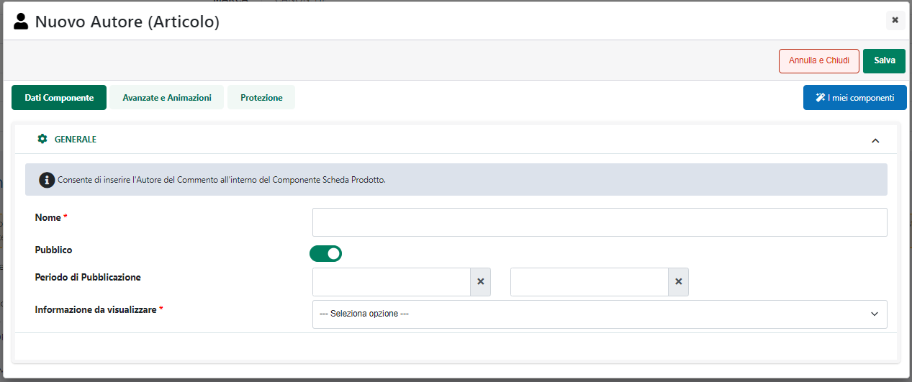
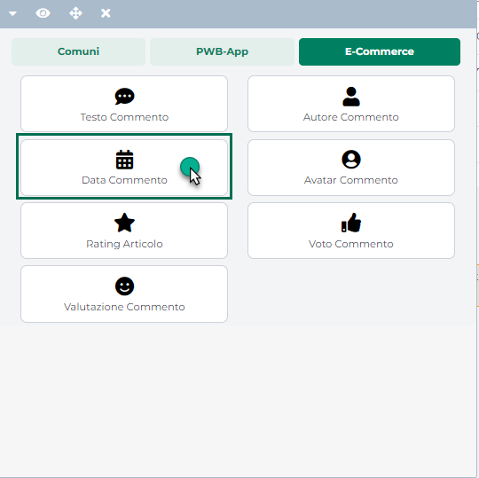

# CONFIGURAZIONE ORDINI

Come evidenziato nei precedenti capitoli di questo manuale
l'integrazione tra Passweb e Prestashop consente di importare in Passweb
(e conseguentemente nel gestionale Passepartout) ordini effettuati
direttamente sul sito Prestashop.

**ATTENZIONE!** A differenza della pubblicazione articoli,
l'importazione ordini da Prestashop può avvenire unicamente via API

**ATTENZIONE!** L'inserimento di un ordine Prestashop nel gestionale
Passepartout comporterà, eventualmente, la creazione automatica della
relativa anagrafica cliente e di eventuali anagrafiche articolo relative
a prodotti non ancora presenti nella base dati del gestionale

Affinchè questo tipo di integrazione possa funzionare in maniera
corretta è necessario configurare adeguatamente la sezione "**Ordini**"
presente all'interno della maschera "**Dati Account**" del relativo
account Prestashop

Nello specifico dunque i campi presenti all'interno di questa maschera
consentono rispettivamente di:

**Creare ordini in Passweb:** consente di decidere se l'Account in esame
dovrà o meno interagire con la piattaforma terza a livello di ordini. E'
possibile selezionare uno dei seguenti valori:

- **No:** selezionando questa opzione l'Account in esame potrà
  interagire con la piattaforma terza **solo ed esclusivamente a livello
  di esportazione articoli**.

- **Si:** selezionando questa opzione sarà invece possibile integrarsi
  con la piattaforma terza non solo a livello di esportazione articoli
  **ma anche importando all'interno del proprio sito Passweb, e da qui
  all'interno del gestionale, eventuali nuovi ordini (e relativi
  clienti) acquisiti direttamente sulla piattaforma esterna**

**Data Ultima Sincronizzazione Ordini:** consente di impostare la data
da prendere in considerazione in fase di sincronizzazione ordini con il
marketplace esterno. In fase di sincronizzazione verranno quindi
valutati tutti gli ordini con data successiva a quella impostata
all'interno di questo campo

**Creare nuovi articoli nel gestionale**: consente di decidere come
dovranno essere tratti eventuali ordini provenienti dalla piattaforma
terza nel caso in cui all'interno di questi stessi documenti dovessero
essere presenti articoli non ancora inseriti tra le anagrafiche del
gestionale. E' possibile selezionare uno dei seguenti valori:

- **No (l'ordine non viene importato nel gestionale):** selezionando
  questa opzione eventuali ordini provenienti dalla piattaforma terza e
  con all'interno articoli non ancora codificati nella base dati del
  gestionale non verranno importati

> In queste condizioni sarà quindi necessario, per prima cosa,
> codificare gli articoli in questione all'interno del gestionale e,
> eventualmente, gestirli anche all'interno di un' apposita Inserzione
> facendo in modo di agganciarli ai relativi articoli sulla piattaforma
> terza mediante il corrispondente identificativo di prodotto.

- **SI (l'ordine viene sempre importato nel gestionale):** selezionando
  questa opzione eventuali ordini provenienti dalla piattaforma terza e
  con all'interno articoli non ancora codificati nella base dati del
  gestionale verranno comunque importati ed inseriti anche all'interno
  del gestionale Passepartout.

> In queste condizioni, infatti, contestualmente all'inserimento
> dell'ordine verranno anche create, in maniera totalmente automatica le
> nuove anagrafiche articolo. Per maggiori informazioni in merito si
> veda anche quanto indicato all'interno del successivo capitolo
> "*Codifica Automatica di nuove anagrafiche articolo*" di questo
> manuale

**Magazzino Ordini degli Articoli Gestiti:** consente di indicare lo
specifico magazzino che dovrà essere utilizzato e quindi movimentato a
seguito di ordini acquisiti direttamente sulla piattaforma esterna

**Sezionale degli Ordini:** consente di indicare uno specifico
sezionale, tra quelli codificati all'interno del gestionale, in cui
verranno memorizzati gli ordini acquisiti direttamente sulla piattaforma
esterna

Ovviamente è consigliabile definire uno specifico sezionale per gli
ordini provenienti da Prestashop in maniera tale da poterli poi
distinguere facilmente da quelli caricati direttamente sul gestionale
piuttosto che da quelli provenienti da altri Marketplace come ad esempio
eBay o Amazon.

**Numero Causale Movimento di Magazzino Documento**: consente di
indicare il numero della Causale che dovrà essere utilizzata,
all'interno del gestionale, per indicare che l'ordine corrispondente è
stato originato sul sito Prestashop

**ATTENZIONE!** Nel momento in cui per il campo in esame non dovesse
essere indicato uno specifico valore, come Numero della Causale del
Movimento di Magazzino verrà utilizzato quello impostato in
corrispondenza dello stesso parametro presente alla pagina "**Ordini --
Configurazione Ordini**" del Wizard

**Numero del centro di Costo/Ricavo**: consente di indicare il numero da
attribuire al campo "**Costi/ricavi",** presente nella testata del
relativo documento gestionale, nel caso in cui l'ordine provenga da un
sito Prestashop

**ATTENZIONE!** Nel momento in cui per il campo in esame non dovesse
essere indicato uno specifico valore, come Numero del Centro di
Costo/Ricavo verrà utilizzato quello impostato in corrispondenza dello
stesso parametro presente alla pagina "**Ordini -- Configurazione
Ordini**" del Wizard

**Sconto -- Articolo utilizzato:** consente di indicare, selezionandolo
dall'apposito menu a tendina, l'articolo spesa che dovrà essere
utilizzato per gestire eventuali sconti (a valore o in percentuale)
presenti sulle righe del documento prelevato da Prestashop.

**ATTENZIONE!** eventuali sconti, **siano essi fissi o percentuali**,
presenti sul documento acquisito da Prestashop verranno gestiti nel
corrispondente documento gestionale mediante l'inserimento dell'articolo
spesa indicato in corrispondenza del parametro "Sconto -- Articolo
Utilizzo".

Tale articolo sarà inserito nel documento con quantità unitaria negativa
e importo pari allo sconto in essere.

**Confezione Regalo -- Articolo utilizzato:** consente di indicare,
selezionandolo dall'apposito menu a tendina, l'articolo spesa che dovrà
essere utilizzato per gestire eventuali costi legati all'attivazione, su
Prestashop, delle "**Opzioni Regalo**".

**ATTENZIONE!** L'aliquota / esenzione iva assegnata, sul gestionale,
all'articolo spesa utilizzato per gestire questo tipo di costi dovrà
essere, ovviamente, la stessa utilizzata in Prestashop per l'opzione
regalo e indicata quindi all'interno del campo "**Tassa della carta
regalo**" sopra evidenziato.

Nel momento in cui l'aliquota / esenzione dichiarata in Prestashop
dovesse non corrispondere a quella dell'articolo Spesa utilizzato lato
gestionale, i totali del documento potrebbero anche non combaciare.

Per maggiori informazioni relativamente alla gestione delle opzioni
regalo si veda anche quanto indicato all'interno del successivo capitolo
"*Ordini Prestashop*" di questo manuale

**Vettore del Documento:** consente di impostare il Vettore che dovrà
essere inserito a default nel piede del documento gestionale generato a
seguito di ordini acquisiti direttamente da Prestashop.

E' possibile selezionare solo ed esclusivamente Vettori codificati
all'interno del gestionale ed esportati all'interno del proprio sito
Passweb.

**ATTENZIONE!** Il vettore indicato in questo campo verrà utilizzato
solo ed esclusivamente nel caso in cui l'ordine proveniente da
Prestashop dovesse essere privo di vettori o dovesse avere un vettore
non ancora correttamente mappato tra quelli presenti all'interno della
successiva sezione "Vettori". In quest'ultimo caso verrà anche inserita
un'apposita nota d'ordine con l'indicazione del vettore effettivamente
presente nell'ordine in arrivo da Prestashop

**Esenzione IVAUE:** consente di indicare, selezionandola tra quelle
codificate all'interno del gestionale la specifica esenzione che dovrà
essere utilizzata nel momento in cui, lato Prestashop, si dovesse
decidere, per qualche ragione, di utilizzare delle spese di trasporto
IVA esente e l'indirizzo di spedizione, presente sull'ordine, dovesse
essere relativo ad un paese UE.

**ATTENZIONE!** l'esenzione impostata all'interno di questo campo verrà
utilizzata anche sulle righe di eventuali articoli presenti nell'ordine
prelevato dal marketplace e gestiti, anch'essi, in esenzione iva

**Esenzione IVA Extra UE:** consente di indicare, selezionandola tra
quelle codificate all'interno del gestionale la specifica esenzione che
dovrà essere utilizzata nel momento in cui, lato Prestashop, si dovesse
decidere, per qualche ragione, di utilizzare delle spese di trasporto
IVA esente e l'indirizzo di spedizione, presente sull'ordine, dovesse
essere relativo ad un paese Extra UE.

**ATTENZIONE!** l'esenzione impostata all'interno di questo campo verrà
utilizzata anche sulle righe di eventuali articoli presenti nell'ordine
prelevato dal marketplace e gestiti, anch'essi, in esenzione iva

Per quel che riguarda le spese di trasporto è bene sottolineare anche
che queste verranno gestite mediante appositi articoli di tipo Spesa
inseriti nel corpo del documento e codificati automaticamente da Passweb
in fase di inserimento del relativo ordine.

In sostanza dunque nel momento in cui dovesse essere importato un ordine
Prestashop in cui è stato utilizzato un metodo di spedizione per cui non
è ancora presente in Mexal / Ho.Re.Ca. il corrispondente articolo di
tipo Spesa, Passweb provvederà a crearlo in maniera del tutto automatica
secondo le seguenti regole:

- **Il codice e la descrizione** dell'articolo Spesa coincideranno
  esattamente con il codice e la descrizione del metodo di spedizione
  presente sul documento Prestashop (informazioni queste che vengono
  passate direttamente dalla piattaforma terza)

- **L'unità di misura** dell'articolo Spesa verrà impostata
  automaticamente su "pz"

- **L'aliquota iva** dell'articolo Spesa sarà esattamente quella
  definita per gestire le spese di trasporto in Prestashop mediante il
  parametro "**Imposta**" presente nella maschera di configurazione
  della specifica modalità di spedizione (*Spedizione -- Mezzi di
  Spedizione -- Destinazioni spedizioni e costi*)

> Se poi per qualche ragione in Prestashop si dovesse decidere di
> gestire delle spese di trasporto IVA esenti, impostando quindi il
> parametro in figura sul valore "Nessuna Tassa", al corrispondente
> articolo Mexal / Ho.Re.Ca, verrà assegnata, in base anche
> all'indirizzo di spedizione merce, l'esenzione IVA indicata in
> corrispondenza del parametro **Esenzione UE / Extra UE**

Per maggiori informazioni relativamente ai parametri presenti
all'interno delle sezioni "Stati Ordine", "Parametri Clienti", "Metodi
di Pagamento" e "Vettori" si vedano i successivi capitoli di questo
manuale.

##### STATI ORDINE

La sezione "**Stati Ordine**", presente all'interno della maschera
"**Dati Account / Ordini**", consente di definire, da una parte gli
stati degli ordini Prestashop che dovranno essere utilizzati come filtro
di importazione sul Gestionale e dall'altra parte gli stati in cui
dovranno essere portati gli ordini di Prestashop nel momento in cui,
lato gestionale, dovesse essere emessa una bolla, una fattura o,
eventualmente, nel momento in cui lato gestionale si dovesse decidere di
annullare l'ordine

Nel box di sinistra, presente in corrispondenza del parametro "**Stati
Ordine Gestiti**", sono elencati quindi tutti i diversi possibili stati
in cui può trovarsi, all'interno di Prestashop, un determinato ordine.

Per fare in modo che gli ordini che si trovano, in Prestashop, in un
determinato stato possano essere importati in Passweb (e quindi nel
gestionale Passepartout) sarà sufficiente selezionare lo stato in
questione tra quelli presenti in elenco e inserirlo nel box di destra
cliccando sul pulsante raffigurante una piccola freccia rivolta verso
destra.

**ATTENZIONE! In fase di sincronizzazione verranno prelevati da
Prestashop ed inseriti, tramite Passweb, nel gestionale Passepartout,
solo ed esclusivamente quegli ordini che si trovano in uno degli stati
indicati all'interno del box di destra**

Indipendentemente dagli stati gestiti, nel momento in cui un determinato
documento dovesse essere importato in Passweb e conseguentemente nel
gestionale Passepartout, questo verrà ovviamente considerato come un
normale ordine.

In altri termini dunque se si dovesse decidere, ad esempio, di importare
anche ordini in stato "Spedito" (ossia ordini che per Prestashop sono
già stati spediti) questi verranno poi inseriti nel gestionale
Passepartout allo stesso modo degli ordini in stato "Non spedito". **Non
verranno quindi create automaticamente bolle / fatture o altri tipi di
documento ne tanto meno questi ordini verranno posti automaticamente in
uno stato particolare.**

Nel corpo del documento verrà comunque inserita una nota con
l'indicazione dello stato in cui si trovava l'ordine Prestashop nel
momento in cui quello stesso ordine è stato effettivamente importato

**ATTENZIONE!** **In ogni caso occorre sempre prestare particolare
attenzione alle operazioni e ad eventuali cambi di stato che verranno
poi effettuati lato gestionale sugli ordini importati. Al fine di
evitare problemi tali operazioni dovranno infatti essere sempre coerenti
con quello che è lo stato in cui si trovano gli stessi documenti
all'interno della piattaforma terza**

Tornando all'esempio precedente, se si dovesse decidere di importare
anche gli ordini già spediti questi, una volta inseriti nel gestionale,
potrebbero anche essere trasformati in bolla o fattura (se necessario)
ma prestando particolare attenzione a non scatenare poi, a seguito di
questa trasformazione, eventuali cambi di stato anche sull'ordine
Prestashop che, a questo punto, potrebbero anche non essere corretti.

Gli ulteriori campi presenti all'interno di questa sezione consentono
invece di:

- **Stato Ordine Annullato:** consente di impostare, selezionandolo dal
  relativo menu a tendina, lo stato in cui dovrà essere passato l'ordine
  Prestashop nel momento in cui, lato gestionale, si dovesse decidere di
  annullare il relativo documento

- **Stato Ordine Spedito:** consente di impostare, selezionandolo dal
  relativo menu a tendina, lo stato in cui dovrà essere passato l'ordine
  Prestashop nel momento in cui, lato gestionale, dovesse essere emessa,
  in relazione a questo stesso ordine, una bolla

- **Stato Ordine Evaso:** consente di impostare, selezionandolo dal
  relativo menu a tendina, lo stato in cui dovrà essere passato l'ordine
  Prestashop nel momento in cui, lato gestionale, dovesse essere emesso,
  in relazione a questo stesso ordine, un documento di evasione (fattura
  / corrispettivo)

In queste condizioni una qualsiasi trasformazione / variazione al
documento Mexal che venga poi riportata anche in Passweb (a seguito di
una sincronizzazione sito -- gestionale e/o di una sincronizzazione
schedulata sito -- prestashop) provocherà il relativo cambio di stato
anche sul documento Prestashop.

Tecnicamente questo avverrà andando ad inserire nella storia del
documento Prestashop lo stato impostato in Passweb all'interno di uno
dei parametri sopra indicati e andando poi ad eliminare eventuali stati
dello stesso tipo già presenti sullo stesso documento Prestashop

**ATTENZIONE!** eventuali stati già presenti sul documento Prestashop
**ma diversi** da quelli impostati in Passweb non verranno toccati

In considerazione di ciò occorre prestare particolare attenzione:

- al fatto di non aver inserito manualmente sul documento Prestashop gli
  stessi stati impostati in corrispondenza dei parametri "Stato Ordine
  Annullato, Stato Ordine Sospeso, Stato Ordine Evaso".

> Tali stati potrebbero infatti essere poi eliminati dalla procedura di
> aggiornamento gestita da Passweb

- al fatto di aver correttamente selezionato, in fase di configurazione
  delle API Prestashop, il metodo **DELETE** per la voce
  **order_histories**.

> In caso contrario infatti la procedura di aggiornamento degli stati
> ordine gestita da Passweb andrà in errore e verrà ritornato un
> messaggio del tipo "... **Method DELETE is not allowed for the
> resource order_histories** ...".
>
> Nello specifico Passweb riuscirà ad inserire il nuovo stato sul
> documento Prestashop ma non riuscirà invece ad eliminare stati dello
> stesso tipo eventualmente presenti su questo stesso documento.
>
> In queste condizioni il documento su Passweb resterà in uno stato
> incompleto e ad ogni nuova sincronizzazione Passweb tenterà di
> eseguire nuovamente l'aggiornamento degli stati andando di fatto ad
> inserire continuamente stati dello stesso tipo sul documento
> Prestashop senza mai poter eliminare quelli vecchi

Per quel che riguarda l'evasione degli ordini e la contestuale emissione
di eventuali fatture, una cosa molto importante da tenere assolutamente
in considerazione è che **l'integrazione Passweb -- Prestashop prevede,
ovviamente, che la fatturazione sia gestita direttamente dai gestionali
Passepartout.**

Per evitare dunque di comunicare al cliente eventuali numeri di fatture
non valide ai fini fiscali, oltre ad allineare i relativi numeratori e a
riservare un' apposito sezionale per gli ordini acquisti direttamente da
Prestashop, si consiglia anche di disabilitare, laddove possibile,
eventuali opzioni di fatturazione presenti sulla piattaforma esterna (e
relativo invio di mail al cliente).

Nel momento in cui ciò non fosse possibile si consiglia di inserire
nelle mail, e nel dettaglio di eventuali fatture generate dalla
piattaforma esterna, un apposito testo per indicare al cliente che il
documento ricevuto potrebbe non essere quello fiscalmente valido,
documento questo che gli verrà invece inviato tramite mail (ad esempio
da Mexal) e che potrà essere scaricato in forma elettronica mediante
Sistema di Interscambio (SdI).

**ATTENZIONE!** Il connettore non prevede l'invio di mail direttamente
da Passweb

Infine, nel momento in cui l'esigenza dovesse essere quella di gestire i
cambi di stato dei documenti Prestashop direttamente dalla piattaforma
terza, sarà allora necessario:

- abilitare, in fase di configurazione delle API Prestashop, per tutte
  le voci relative agli ordini, il solo metodo GET

- operare in Mexal mediante apposite personalizzazioni Sprix o Collage,
  in maniera tale da far si che gli ordini acquisiti da Prestashop
  vengano poi impostati, in fase di variazione e/o di trasformazione, in
  maniera tale da non essere più esportati su Passweb (parametro
  "**Attivo**" nella maschera "**Stato Anagrafiche**" del documento
  Passweb impostato su **N**)

In queste condizioni infatti il primo punto consentirà comunque a
Passweb di prelevare, in fase di sincronizzazione, nuovi ordini da
Prestashop e di inserirli così in Mexal.

Il secondo punto eviterà invece di esportare su Passweb eventuali
variazioni apportate ai documenti all'interno di Mexal e di scatenare
quindi eventuali cambi di stato sui corrispondenti documenti Prestashop.

##### PARAMETRI CLIENTI

La sezione "**Parametri Clienti**", presente all'interno della maschera
"**Dati Account / Ordini**", consente di impostare i principali
parametri di configurazione relativi ad eventuali nuovi clienti
acquisiti a seguito di ordini effettuati sulla piattaforma terza.

**ATTENZIONE!** I nuovi clienti verranno inseriti su Passweb, e
conseguentemente sul gestionale Passepartout, contestualmente
all'inserimento del loro primo ordine

Nello specifico poi il campo

- **Codici Mastro dei Clienti (solo Ecommerce Mexal)**: consente di
  indicare lo specifico codice Mastro del gestionale in cui verranno
  create le nuove anagrafiche relative ai clienti acquisiti a seguito di
  ordini effettuati sulla piattaforma terza

- **Campo Clienti 'Codice Fiscale'**: consente di indicare,
  selezionandolo dall'apposito menu a tendina, il campo Prestashop dal
  quale prelevare il codice fiscale che dovrà poi essere inserito nel
  corrispondente campo dell'anagrafica utente all'interno del gestionale

- **Campo Clienti 'PEC':** consente di indicare, selezionandolo
  dall'apposito menu a tendina, il campo Prestashop dal quale prelevare
  l'indirizzo PEC che dovrà poi essere inserito nel corrispondente campo
  dell'anagrafica utente all'interno del gestionale.

- **Campo Clienti 'SDI'**: consente di indicare, selezionandolo
  dall'apposito menu a tendina, il campo Prestashop dal quale prelevare
  il "Codice destinatario SDI" che dovrà poi essere inserito nel
  corrispondente campo dell'anagrafica utente all'interno del
  gestionale.

I due parametri "**Campo Clienti PEC**" e "**Campo Clienti SDI**" sono
di fondamentale importanza per poter attivare tutte le funzioni e gli
automatismi messi a disposizione dai gestionali Passepartout in merito
alla fatturazione elettronica. Nel caso in cui i due campi in oggetto
non dovessero essere configurati infatti, le anagrafiche utente create
all'interno del gestionale saranno prive tanto del "Codice Destinatario
SDI" quanto dell'indirizzo di posta certificata per cui diventerà
particolarmente difficile poter poi emettere, verso questi clienti, la
fattura elettronica

Il problema di fondo, in questo senso, è rappresentato dal fatto che
mentre per la PEC potrebbe essere usato anche uno dei campi standard di
Prestashop il campo relativo allo **SDI non è uno di questi campi
standard per cui per poter gestire questo tipo di informazione è
necessario ricorrere a dei moduli aggiuntivi o sviluppare soluzioni ad
hoc**

In questo senso, nella scelta del modulo da acquistare o della procedura
da seguire per gestire questo tipo di informazioni (attributi aggiuntivi
sugli utenti) è di fondamentale importanza ricordarsi che l'integrazione
Passweb -- Prestashop si basa sulle API standard messe a disposizione da
Prestashop stesso per cui **è assolutamente indispensabile che il campo
aggiuntivo utilizzato, ad esempio, per lo SDI possa poi essere
accessibile in lettura / scrittura mediante queste stesse API e, nello
specifico, mediante una delle seguenti Risorse**

- addresses

- customers

Tali dati dovranno quindi essere correttamente salvati o nell'anagrafica
dell'utente o nell'anagrafica del suo indirizzo di fatturazione

**ATTENZIONE! Nel caso in cui i campi Prestashop utilizzati per gestire
SDI e PEC non siano accessibili tramite API Standard, Passweb non avrà
modo di accedere a queste informazioni.**

Nel caso in cui il modulo o la personalizzazione Prestashop che si è
scelto di adottare dovesse utilizzare uno stesso campo (es. Codice SDI /
PEC) per gestire queste informazioni, i due parametri "Campo Clienti
PEC" e "Campo Clienti SDI" dovranno essere entrambi impostati, sullo
stesso valore (es. "**Codice SDI / PEC**")

Sarà poi Passweb sulla base dell'effettivo valore inserito all'interno
di questo campo a smistare il dato sul campo gestionale corretto. Nello
specifico:

- se il valore inserito, lato Prestashop, dovesse essere un indirizzo
  mail questo verrà inserito, nell'anagrafica utente del gestionale,
  all'interno del campo PEC

- se il valore inserito, lato Prestashop, non dovesse avere il formato
  di un indirizzo mail, il dato verrà inserito, nell'anagrafica utente
  del gestionale, all'interno del campo "Codice destinatario SDI"

##### METODI DI PAGAMENTO

La sezione "**Metodi di Pagamento**", presente all'interno della
maschera "Dati Account / Ordini", consente di mappare i pagamenti
indicati sugli ordini acquisiti dalla piattaforma terza associandoli ad
uno dei pagamenti appositamente codificati all'interno del gestionale
Passepartout

Per mappare un nuovo pagamento è necessario, per prima cosa cliccare sul
pulsante "**Aggiungi**" evidenziato in figura in maniera tale da far
comparire i due nuovi campi "**Titolo Pagamento Marketplace**" e
"**Pagamento gestionale**"

A questo punto all'interno del campo

- **Titolo Pagamento Marketplace**: sarà necessario inserire esattamente
  il titolo utilizzato in Prestashop per identificare il pagamento che
  si intende mappare. Per ottenere questo dato è sufficiente, ad
  esempio, accedere alla sezione "**Impostazioni**" del menu
  "**Pagamento**" di Prestashop

> Le intestazioni delle colonne presenti nelle tabelle all'interno di
> questa maschera (vedi figura) rappresentano i titoli dei pagamenti da
> inserire all'interno del campo "Titolo Pagamento Marketplace"
>
> **ATTENZIONE!** Nel caso in cui il valore inserito all'interno del
> campo "**Titolo Pagamento Marketplace**" non coincida esattamente con
> il nome di uno dei pagamenti gestiti in Prestashop, il corrispondente
> documento verrà inserito nel gestionale con il campo relativo al
> pagamento non valorizzato.

- **Pagamento gestionale**: consente di indicare, selezionandolo
  dall'apposito menu a tendina il pagamento Mexal / Ho.Re.Ca con cui
  mappare il corrispondente pagamento Prestashop

Ovviamente affinché l'operazione di mapping possa funzionare in maniera
corretta sarà necessario per prima cosa codificare, per ciascuno dei
pagamenti gestiti su Prestashop, il corrispondente pagamento Mexal /
Ho.Re.Ca in maniera tale da poterselo poi ritrovare tra quelli
effettivamente selezionabili all'interno del campo "**Pagamento
Gestionale**"

##### VETTORI

La sezione **"Vettori"** presente all'interno della maschera "Dati
Account / Ordini", consente di mappare i corrieri utilizzati in
Prestashop per gestire i diversi metodi di spedizione associandoli ad
uno dei vettori utilizzati all'interno del gestionale Passepartout.

**ATTENZIONE!**: mappare i corrieri utilizzati in Prestashop con i
vettori utilizzati all'interno del gestionale Passepartout, è un'
operazione di fondamentale importanza. Nel momento in cui si dovesse
tentare infatti di evadere un ordine acquisito da Prestashop senza
indicare nel piede del documento gestionale nessun vettore o indicando
comunque un vettore che non è tra quelli mappati, in fase di
sincronizzazione verrà restituito un errore e non sarà possibile
effettuare, sull'ordine Prestashop il relativo cambio di stato.

Per mappare un nuovo corriere è necessario, per prima cosa, cliccare sul
pulsante "**Aggiungi**" evidenziato in figura, in maniera tale da far
comparire i due nuovi campi "**Codice Corriere Marketplace**" e
"**Vettore Gestionale**"

A questo punto all'interno del campo

- **Codice Corriere Marketplace:** sarà necessario indicare,
  selezionandolo dall'apposito menu a tendina, il mezzo di spedizione
  Prestashop che si intende mappare

- **Vettore Gestionale:** consente di indicare, selezionandolo
  dall'apposito menu a tendina, il vettore gestionale da associare al
  mezzo di spedizione Prestashop indicato all'interno del precedente
  parametro

**ATTENZIONE!** All'interno del campo "Vettore Gestionale" verranno
visualizzati solo ed esclusivamente i vettori a cui è stato associato
uno specifico "Codice Gestionale" (Ecommerce Mexal) o uno specifico
"Nome Vettore" (Ecommerce Horeca)

Questo significa dunque che prima di poter mappare i corrieri Prestashop
con i vettori utilizzati all'interno del gestionale sarà necessario:

- **Nel caso di collegamento con Mexal**: attivare, nel back end di
  Passweb, dei vettori di tipo "Gestionale" o di tipo "Passweb" con
  associato uno specifico codice conto

- **Nel caso di collegamento con uno dei gestionali Ho.Re.Ca**:
  attivare, nel back end di Passweb, dei vettori di tipo "Passweb" con
  associato uno specifico "Nome Vettore"

Per maggiori informazioni in merito si veda anche la sezione "*Ordini --
Metodi di Trasporto -- Integrazione Passweb -- Magento / Prestashop*" di
questo manuale

