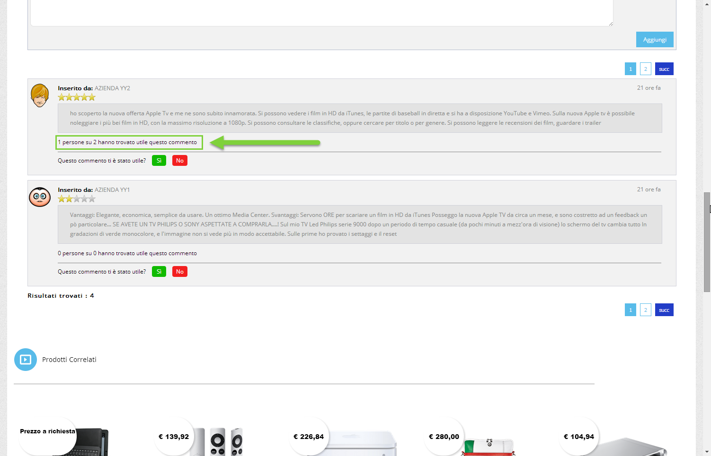

# CODIFICA AUTOMATICA DI NUOVE ANAGRFICHE UTENTE

Come indicato nei precedenti capitoli di questo manuale, contestualmente
all' inserimento di un nuovo ordine Prestashop verranno create anche, in
maniera completamente automatica, le anagrafiche di eventuali nuovi
clienti non ancora codificati nella base dati gestionale.

In questo senso, la prima cosa da considerare è che **il campo mail
verrà utilizzato come campo chiave**. In conseguenza di ciò

- nel caso in cui **l'utente che ha effettuato l'ordine su Prestashop
  abbia utilizzato un indirizzo mail già presente nel database di
  Passweb** (perché magari aveva già effettuato, in precedenza, un primo
  acquisto) in fase di importazione ordine possono verificarsi due
  diverse situazioni:

  - l'utente presente nell'ordine in arrivo da Prestashop **è un utente
    registrato** sulla piattaforma terza. In questo caso verrà
    agganciata l'Anagrafica dell'utente che utilizza questa stessa mail
    e, eventualmente, ne verranno anche aggiornati i dati con quelli
    presenti nell'ordine che si sta acquisendo

  - l'utente presente nell'ordine in arrivo da Prestashop **è un utente
    Guest (Ospite)** che non si è quindi registrato sulla piattaforma
    terza. In questo caso verranno valutati Nome e Cognome presenti nei
    dati dell'ordine che si sta acquisendo; se questi coincidono con
    quelli dell'anagrafica già presente in Passweb verrà agganciata
    questa stessa anagrafica. Se invece Nome e Cognome presenti
    sull'ordine non dovessero coincidere con quelli dell'anagrafica già
    presente in Passweb, verrà creata una nuova Anagrafica. In queste
    condizioni potremmo quindi ritrovarci tanto in Passweb, quanto
    ovviamente nel gestionale Passepartout, più anagrafiche utente con
    la stessa mail ma con Nome e Cognome diversi

- nel caso in cui invece **l'utente che ha effettuato l'ordine su
  Prestashop abbia utilizzato un indirizzo mail non ancora presente nel
  database di Passweb**, in fase di importazione ordine verrà creata,
  sul gestionale, una nuova Anagrafica Utente **[prelevando i dati
  necessari dall'indirizzo di fatturazione / spedizione presenti
  sull'ordine acquisito]{.underline}**. Nello specifico:

  - l'**Email** coinciderà con quella inserita dall'utente su Prestashop

  - **Nome / Cognome / Ragione Sociale / Partita IVA** saranno
    esattamente quelli presenti sull'ordine acquisito da Prestashop in
    corrispondenza dei relativi campi dell' **indirizzo di
    fatturazione**

  - **La distinzione tra Utente Privato e Utente Azienda avverrà sulla
    base del campo Prestashop presente nell' indirizzo di fatturazione e
    utilizzato per gestire la partita IVA (campo "Numero IVA")** .

> Nel caso in cui tale campo dovesse essere valorizzato l'utente creato
> in Passweb (e conseguentemente nel gestionale Passepartout) sarà un
> utente di tipo Azienda. Inoltre:

- se dovesse essere valorizzato anche il campo "**Azienda**" presente
  sull'indirizzo di fatturazione di Prestashop, allora l'anagrafica
  creata sul gestionale sarà quella di una "normale" azienda (campo
  **"Soggetto Privato" e "Persona Fisica" non selezionati**) con
  **Ragione Sociale** impostata sul valore inserito dall'utente nel
  campo Azienda di Prestashop

{width="4.0in"
height="2.2729166666666667in"}

- se il campo "Azienda" presente sull'indirizzo di fatturazione di
  Prestashop non dovesse essere valorizzato, allora l'anagrafica creata
  sul gestionale sarà quella di un' **azienda individuale** (**campo
  "Soggetto privato" non selezionato e campo "Persona Fisica"
  selezionato**) con i campi Nome e Cognome impostati sui valori
  inseriti dall'utente nei relativi campi dell'indirizzo di fatturazione
  di Prestashop.

{width="4.0in"
height="2.2729166666666667in"}

> Al contrario, nel momento in cui il campo relativo alla partita IVA
> non fosse valorizzato l'utente creato in Passweb (e conseguentemente
> nel gestionale Passepartout) sarà invece un utente Privato (campi
> "Soggetto Privato" e "Persona Fisica" entrambi selezionati)

{width="4.0in"
height="2.2729166666666667in"}

- **I campi SDI e PEC necessari per la fatturazione elettronica**
  verranno valorizzati con i dati inseriti dall'utente nei relativi
  campi Prestashop e secondo la mappatura impostata su Passweb, in fase
  di configurazione dell'Account, per i parametri **"Campo Clienti
  PEC"** e **"Campo Clienti SDI"** (per maggiori informazioni in merito
  a questa mappatura si veda anche quanto indicato nel precedente
  capitolo di questo manuale)

- **Il campo relativo al Codice Fiscale** verrà valorizzato con i dati
  inseriti dall'utente nel relativo campo Prestashop e secondo la
  mappatura impostata su Passweb, in fase di configurazione
  dell'Account, per il parametro **"Campo Clienti Codice Fiscale"**

- **I campi Indirizzo / Nazione / CAP / Località / Provincia /
  Telefono** presenti nell'anagrafica utente gestionale verranno
  valorizzati con i dati inseriti, su Prestashop, in corrispondenza dei
  relativi campi dell' **indirizzo di fatturazione**

##### FATTURARE A

Prestashop, di base, consente di indicare direttamente in fase di ordine
indirizzi di fatturazione e di spedizione diversi da quello che può
essere l'indirizzo inserito dall'utente in fase di registrazione al
sito.

In questo caso la prima cosa da prendere in considerazione è che **per
determinare se un certo indirizzo presente nell'ordine acquisto da
Prestashop è relativo o meno al cliente che ha registrato l'account
sulla piattaforma terza, Passweb farà riferimento a quanto presente nei
campi Nome, Cognome e Azienda assegnati a quello stesso indirizzo**.

Nello specifico dunque:

- Se Nome, Cognome e Azienda, presenti nell'indirizzo di fatturazione /
  spedizione coincidono con gli analoghi dati dell'utente proprietario
  dell'account allora l'indirizzo in esame verrà considerato come
  appartenente a quello stesso utente

- Se nell'indirizzo di fatturazione / spedizione per i campi Nome,
  Cognome e Azienda non viene indicato nessun valore allora l'indirizzo
  in esame verrà considerato come appartenente a quello stesso utente

- Se Nome, Cognome e Azienda presenti nell'indirizzo di fatturazione /
  spedizione **NON** coincidono con gli analoghi dati dell'utente
  proprietario dell'account allora l'indirizzo in esame verrà
  considerato come appartenente ad un utente diverso

Detto ciò, considerando che le anagrafiche cliente verranno poi create,
all'interno del gestionale, sulla base dei dati presenti nell'ordine
Prestashop, si possono configurare diverse situazioni:

**[CASO 1]{.underline}**

**Il Cliente X effettua un ordine in cui imposta come indirizzo di
spedizione uno dei suoi indirizzi e come indirizzo di fatturazione
quello di un Cliente Y.**

Supponendo quindi che l'utente registrato al sito sia l'utente "**Mario
-- ClienteXA**" come indicato in figura

{width="5.246527777777778in"
height="3.363888888888889in"}

in fase di ordine avremo, per il caso in esame, una situazione del tipo
di quella qui di seguito evidenziata

{width="2.798611111111111in"
height="2.8958333333333335in"}

- Indirizzo di **spedizione** relativo al cliente "Mario -- ClienteXA"
  (proprietario dell'account)

- Indirizzo di **fatturazione** relativo al cliente "Giovanni --
  ClienteYA"

In queste condizioni:

- Sul gestionale verranno create le anagrafiche di entrambi gli utenti

{width="5.720833333333333in"
height="1.707638888888889in"}

- L'ordine acquisito da Prestashop sarà intestato all'anagrafica cliente
  relativa a quanto indicato sull'indirizzo di fatturazione (Giovanni --
  ClienteYA)

{width="5.3375in"
height="2.941666666666667in"}

- L'indirizzo di spedizione presente nel piede del documento gestionale
  sarà quello relativo all'anagrafica indicata nell'indirizzo di
  spedizione acquisito da Prestashop (Mario -- ClienteXA)

{width="4.6819444444444445in"
height="2.2270833333333333in"}

- Ovviamente, lato Prestashop, il documento, anche dopo eventuali
  spedizioni / evasioni rimarrà sempre legato all'anagrafica del cliente
  che ha effettuato l'ordine (Mario -- ClienteXA)

{width="5.2340277777777775in"
height="3.3506944444444446in"}

**[CASO 2]{.underline}**

**Il Cliente X effettua un ordine in cui imposta come indirizzo sia di
spedizione che di fatturazione quello di un Cliente Y.**

Supponendo quindi che l'utente registrato al sito sia l'utente "**Mario
-- ClienteXA**" come indicato in figura

{width="5.246527777777778in"
height="3.363888888888889in"}

in fase di ordine avremo, per il caso in esame, una situazione del tipo
di quella qui di seguito evidenziata

{width="2.825in"
height="2.876388888888889in"}

- Indirizzo di **spedizione** relativo al cliente "Giovanni --
  ClienteYA"

- Indirizzo di **fatturazione** relativo al cliente "Giovanni --
  ClienteYA"

In queste condizioni:

- Sul gestionale verrà creata solamente l'anagrafica del cliente
  indicato negli indirizzi di fatturazione e spedizione (Giovanni --
  ClienteYA)

{width="5.915277777777778in"
height="3.0194444444444444in"}

> Passweb effettuerà anche un controllo per verificare se l'anagrafica
> del cliente indicato nell'ordine acquisto da Prestashop sia
> eventualmente già presente nel suo database. In caso positivo non
> verrà creata nessuna nuova anagrafica ma verrà semplicemente
> agganciata quella già esistente. In caso negativo verrà invece creata
> la nuova anagrafica
>
> **ATTENZIONE! Il controllo in esame è basato sul fatto che
> l'anagrafica in esame sia stata generata a partire dall'utenza
> registrata su Prestashop che ha effettivamente generato l'ordine.**
>
> In conseguenza di ciò se successivamente un altro utente Prestashop
> diverso da "Mario -- Cliente XA" dovesse generare un ordine indicando
> come indirizzo di fatturazione lo stesso dell'esempio indicato (quindi
> un indirizzo intestato a "Giovanni -- Cliente YA") allora, in queste
> condizioni, verrebbe effettivamente generata una nuova anagrafica.
>
> La stessa cosa avverrebbe ovviamente nel caso in cui l'indirizzo su
> Prestashop venisse prima eliminato e successivamente ricreato (in
> questo caso cambierebbe infatti l'identificativo dell'indirizzo
> stesso)

- L'ordine acquisito da Prestashop sarà intestato all'anagrafica cliente
  relativa a quanto indicato sull'indirizzo di fatturazione (Giovanni --
  ClienteYA)

{width="5.3375in"
height="2.941666666666667in"}

> **ATTENZIONE! In queste condizioni non sarà possibile creare sul
> gestionale l'anagrafica dell'utente "Mario -- Cliente XA"**
>
> In conseguenza di ciò, come evidenziato anche nella figura sopra
> riportata, **verrà aggiunta all'ordine un'ulteriore nota con il
> riferimento all'utente che ha effettivamente generato l'ordine su
> Prestashop. In particolare nella nota in questione verrà inserito
> Nome, Cognome e ID dell'utente che su Prestashop ha generato
> l'ordine** (Mario Cliente XA -- 26)

- Considerando che, in queste condizioni, viene utilizzato lo stesso
  indirizzo per fatturazione e spedizione, secondo quelle che sono le
  normali logiche di Passweb in merito alla gestione degli ordini, nel
  piede del documento gestionale, all'interno della sezione
  "**Riferimenti di Trasporto**" non verrà inserito nessun indirizzo

{width="6.058333333333334in"
height="2.454861111111111in"}

- Ovviamente, lato Prestashop, il documento, anche dopo eventuali
  spedizioni / evasioni rimarrà sempre legato all'anagrafica del cliente
  che ha effettuato l'ordine (Mario -- ClienteXA). Come detto i
  riferimenti di questo utente Prestashop saranno presenti nella nota
  dell'ordine trasmesso al gestionale

**[CASO 3]{.underline}**

**Il Cliente X effettua un ordine in cui imposta come indirizzo di
fatturazione quello di un Cliente Y e come indirizzo di spedizione
quello di un Cliente Z**

Supponendo quindi che l'utente registrato al sito sia l'utente "**Mario
-- ClienteXA**" come indicato in figura

{width="5.246527777777778in"
height="3.363888888888889in"}

in fase di ordine avremo, per il caso in esame, una situazione del tipo
di quella qui di seguito evidenziata

{width="2.4868055555555557in"
height="2.5652777777777778in"}

- Indirizzo di **spedizione** relativo al cliente "Luca -- ClienteZA"

- Indirizzo di **fatturazione** relativo al cliente "Giovanni --
  ClienteYA"

In queste condizioni:

- Sul gestionale verrà creata l'anagrafica del cliente indicato nell'
  indirizzo di fatturazione (Giovanni -- ClienteYA)

{width="5.915277777777778in"
height="3.0194444444444444in"}

> Come nel caso precedente Passweb effettuerà anche un controllo per
> verificare se l'anagrafica del cliente corrispondente all'indirizzo di
> fatturazione sia eventualmente già presente nel suo database. In caso
> positivo non verrà creata nessuna nuova anagrafica ma verrà
> semplicemente agganciata quella già esistente. In caso negativo verrà
> invece creata la nuova anagrafica
>
> **ATTENZIONE! Il controllo in esame è basato sul fatto che
> l'anagrafica in esame sia stata generata a partire dall'utenza
> registrata su Prestashop che ha effettivamente generato l'ordine.**
>
> In conseguenza di ciò se successivamente un altro utente Prestashop
> diverso da "Mario -- Cliente XA" dovesse generare un ordine indicando
> come indirizzo di fatturazione lo stesso dell'esempio indicato (quindi
> un indirizzo intestato a "Giovanni -- Cliente YA") allora, in queste
> condizioni, verrebbe effettivamente generata una nuova anagrafica.

Da qui in avanti poi l'applicazione potrà comportarsi in due modi
diversi a seconda del fatto che l'utente che ha generato l'ordine su
Prestashop (Mario -- ClienteXA) sia o meno già presente tra le
anagrafiche di Passweb **(in questo caso la chiave utilizzata sarà
l'identificativo del cliente su Prestashop e se questo non dovesse
essere presente l'indirizzo mail)**

In particolare:

**Nel caso in cui l'utente che ha generato l'ordine su Prestashop (Mario
-- ClienteXA) NON dovesse essere già presente tra le anagrafiche del
gestionale**

- verrà creata sul gestionale anche l' anagrafica del cliente indicato
  nell' indirizzo di spedizione (Luca -- ClienteZA)

{width="4.571527777777778in"
height="2.7402777777777776in"}

- L'ordine acquisito da Prestashop sarà intestato all'anagrafica cliente
  relativa a quanto indicato sull'indirizzo di fatturazione (Giovanni --
  ClienteYA)

{width="5.3375in"
height="2.941666666666667in"}

> **ATTENZIONE!** In queste condizioni non sarà possibile creare sul
> gestionale l'anagrafica dell'utente "Mario -- Cliente XA"
>
> In conseguenza di ciò, come evidenziato anche nella figura sopra
> riportata, verrà aggiunta all'ordine un'ulteriore nota con il
> riferimento all'utente che ha effettivamente generato l'ordine su
> Prestashop. In particolare nella nota in questione verrà inserito
> Nome, Cognome e ID dell'utente che su Prestashop ha generato l'ordine
> (Mario Cliente XA -- 26)

- L'indirizzo di spedizione presente nel piede del documento gestionale
  sarà quello relativo all'anagrafica indicata nell'indirizzo di
  spedizione acquisito da Prestashop (Luca -- ClienteZA)

{width="4.6819444444444445in"
height="2.2270833333333333in"}

**Nel caso in cui l'utente che ha generato l'ordine su Prestashop (Mario
-- ClienteXA) dovesse già essere presente tra le anagrafiche del
gestionale**

- L'indirizzo di spedizione presente nel documento acquisito da
  Prestashop (Luca -- ClienteZA) verrà aggiunto come indirizzo
  secondario (utilizzando l'apposita tabella degli indirizzi di
  spedizione) collegato all'anagrafica dell'utente che ha generato
  l'ordine su Prestashop (Mario -- ClienteXA)

{width="5.5in"
height="3.2402777777777776in"}

- L'ordine acquisito da Prestashop sarà intestato all'anagrafica cliente
  relativa a quanto indicato sull'indirizzo di fatturazione (Giovanni --
  ClienteYA)

{width="5.3375in"
height="2.941666666666667in"}

- L'indirizzo di spedizione presente nel piede del documento gestionale
  sarà quello relativo all'anagrafica indicata nell'indirizzo di
  spedizione acquisito da Prestashop (Luca -- ClienteZA) e verrà
  riportato anche il nominativo del cliente Mexal (Mario -- Cliente XA)
  cui tale indirizzo è stato associato come indirizzo secondario

{width="4.6819444444444445in"
height="2.2270833333333333in"}

Anche in queste condizioni ovviamente, lato Prestashop, il documento,
anche dopo eventuali spedizioni / evasioni rimarrà sempre legato
all'anagrafica del cliente che ha effettuato l'ordine (Mario --
ClienteXA).

