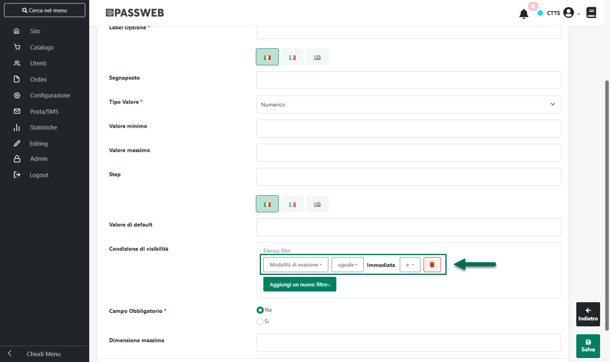
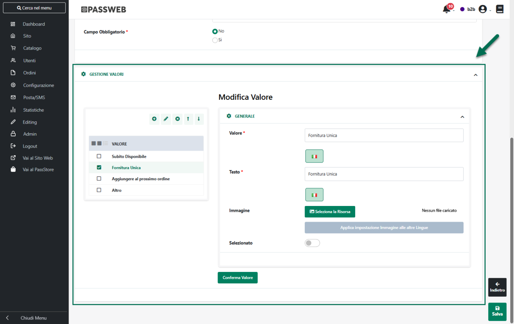

# AGGIORNAMENTO ANAGRFICHE UTENTE

Nel precedente capitolo di questo manuale abbiamo visto che,
contestualmente all'acquisizione di un nuovo ordine effettuato su
Prestashop da un utente che non è ancora presente tra le anagrafiche di
Passweb, verrà creata automaticamente anche la sua anagrafica.

Nel momento in cui l'esigenza dovesse invece essere quella di andare ad
aggiornare i dati anagrafici di utenti che sono già presenti tra le
anagrafiche di Passweb (perché è già stato importato il loro primo
ordine) sarà possibile procedere in tre modi diversi:

- **Attendere che il cliente in esame effettui un nuovo ordine e che
  questo venga importato su Passweb**

> In questo caso, in realtà possono verificarsi due diverse situazioni
> dipendentemente dal fatto che l'utente presente sull'documento che si
> sta acquisendo sia o meno un utente registrato sulla piattaforma
> terza.
>
> Nello specifico:

- se l'utente presente nell'ordine in arrivo da Prestashop **è un utente
  registrato** sulla piattaforma terza verrà agganciata l'Anagrafica
  dell'utente che utilizza questa stessa mail e, eventualmente, ne
  verranno anche aggiornati i dati con quelli presenti nell'ordine che
  si sta acquisendo

- se l'utente presente nell'ordine in arrivo da Prestashop **è un utente
  Guest (Ospite)** che non si è quindi registrato sulla piattaforma
  terza verranno valutati Nome e Cognome presenti nei dati dell'ordine;
  se questi coincidono con quelli dell'anagrafica già presente in
  Passweb verrà agganciata questa stessa anagrafica e, se necessario
  verrà aggiornata. Se invece Nome e Cognome presenti sull'ordine non
  dovessero coincidere con quelli dell'anagrafica già presente in
  Passweb, verrà creata una nuova Anagrafica. In queste condizioni
  potremmo quindi ritrovarci tanto in Passweb, quanto ovviamente nel
  gestionale Passepartout, più anagrafiche utente con la stessa mail ma
  con Nome e Cognome diversi

<!-- -->

- **Effettuare una sincronizzazione manuale dei clienti tra Passweb e
  Prestashop**

> Per effettuare questo tipo di operazione sarà necessario, per prima
> cosa, accertarsi di aver impostato il parametro "**Aggiorna Clienti in
> Passweb**", presente all'interno della sezione "**Clienti**" nella
> maschera di configurazione dell'Account Prestashop, sul valore **SI**

> **ATTENZIONE!** Nel momento in cui il parametro "**Aggiorna clienti in
> Passweb**" dovesse essere impostato su No, l'unica possibilità che
> avremo per aggiornare le anagrafiche dei clienti sarà quella di
> attendere l'acquisizione del loro prossimo ordine
>
> Fatto questo sarà poi necessario accedere alla maschera di gestione
> dei vari Account di integrazione, selezionare tra quelli presenti in
> elenco l'Account Prestashop che ci interessa e cliccare poi sul
> pulsante "**Sincro Clienti**" presente nella contestuale barra degli
> strumenti

> **ATTENZIONE! l'operazione di sincronizzazione dei clienti NON importa
> su Passweb, e conseguentemente sul gestionale, nuovi clienti dalla
> piattaforma esterna ma andrà solamente ad aggiornare le anagrafiche di
> quei clienti che sono già presenti in Passweb**.
>
> Eventuali nuovi clienti potranno quindi essere inseriti solo
> contestualmente all'acquisizione del loro primo ordine

- **Attendere la prossima sincronizzazione schedulata tra Passweb e
  Prestashop**

> Nel caso in cui non si voglia lanciare un sincronizzazione clienti
> manuale sarà sufficiente attendere la prossima sincronizzazione
> Passweb -- Prestashop schedulata secondo i parametri impostati
> all'interno della sezione "**Schedulazione**" nella maschera di
> configurazione dell'Account Prestashop

> **ATTENZIONE!** Anche in questo caso affinché la sincronizzazione
> schedulata possa andare ad aggiornare anche le anagrafiche dei clienti
> già su Passweb è indispensabile accertarsi di aver impostato il
> parametro "**Aggiorna clienti in Passweb"** sul valori SI
>
> Per maggiori informazioni relativamente alle operazioni effettuate
> dalla sincronizzazione schedulata si veda anche quanto indicato
> all'interno dei successivi capitoli di questo manuale

