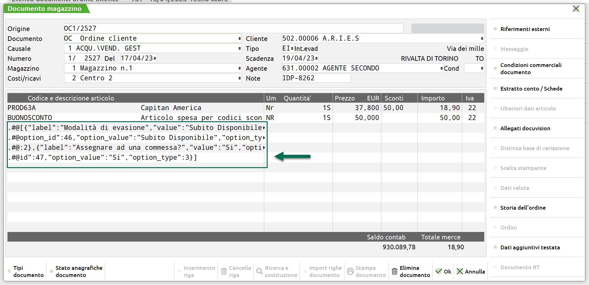
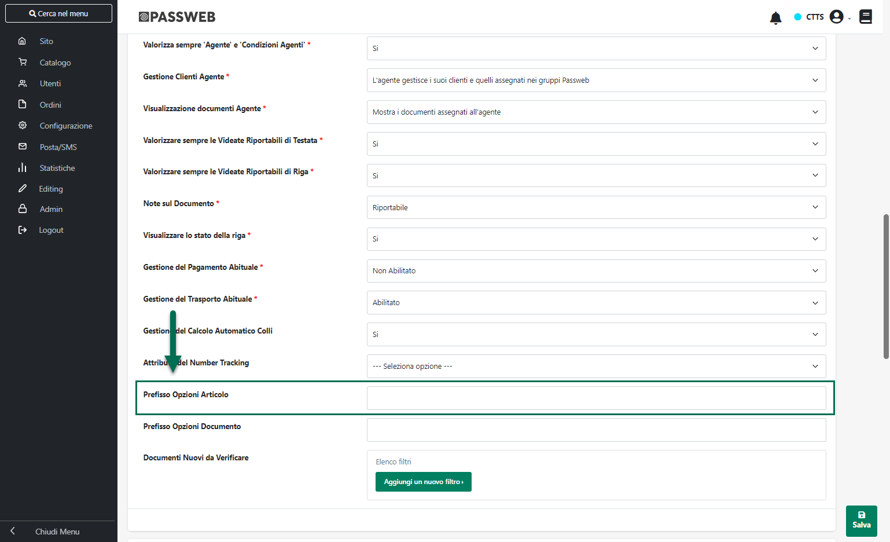
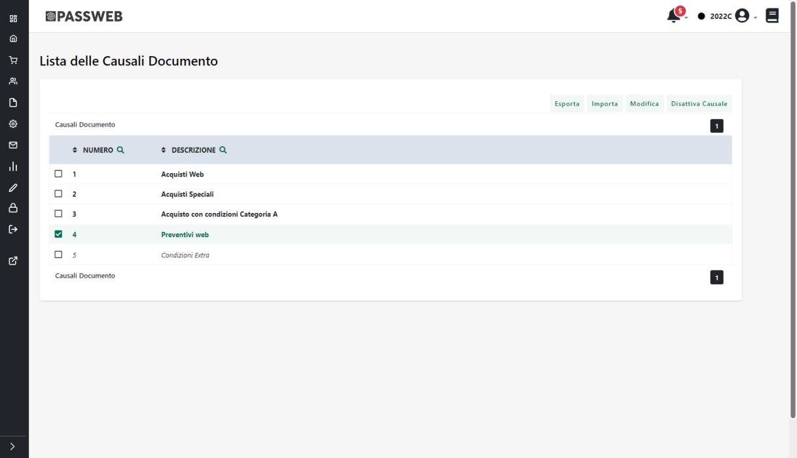
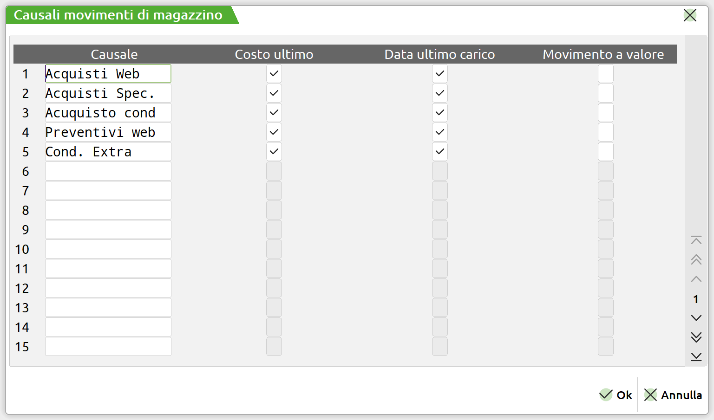
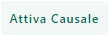
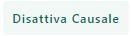

# ORDINI PRESTASHOP

Di seguito vengono indicate le principali caratteristiche dei documenti
inseriti all'interno del gestionali Passepartout a seguito di ordini
acquisiti direttamente da Prestashop.

- Il numero di decimali e le tipologie di arrotondamento in uso sulla
  piattaforma esterna potrebbero non coincidere con i decimali e gli
  arrotondamenti utilizzati dai gestionali Passepartout (il calcolo
  dell'IVA, ad esempio, è gestito direttamente da Mexal e non è
  possibile modificare o personalizzare questo tipo di algoritmo). In
  conseguenza di ciò potrebbero verificarsi situazioni in cui i totali
  del documento Prestashop differiscano di un centesimo rispetto a
  quelli del documento gestionale

<!-- -->

- Nel momento in cui si volesse utilizzare la stessa numerazione per gli
  Ordini Passepartout e Prestashop sarà necessario utilizzare, in
  relazione agli ordini acquisiti dalla piattaforma esterna, uno
  specifico sezionale oltre al fatto, ovviamente, di allineare in fase
  iniziale i relativi numeratori

- In tutti gli ordini importati da Prestashop verrà inserita
  automaticamente **una nota di corpo contenente la data e
  l'identificativo assegnati all'ordine stesso su Prestashop**

{width="5.220833333333333in"
height="2.6041666666666665in"}

- Nel momento in cui, lato Prestashop, dovessero essere state attivate
  le opzioni native del CMS per la gestione delle confezioni regalo
  (sezione "**Parametri Negozio -- Impostazioni Ordine**")

{width="5.590972222222222in"
height="3.3895833333333334in"}

> eventuali messaggi inseriti, in tal senso, in fase di acquisto
> dall'utente direttamente sul front end del sito Prestashop

{width="5.590972222222222in"
height="3.3895833333333334in"}

> verranno riportati anche all'interno del relativo documento gestionale
> mediante un'apposita nota di corpo

{width="4.825in"
height="2.441666666666667in"}

> Inoltre nel caso in cui si sia deciso, lato Prestashop, di assegnare
> anche un prezzo a queste confezioni regalo (campo "**Prezzo della
> confezione regalo**") questo verrà gestito, sul corrispondente
> documento gestionale, mediante l'inserimento dell'articolo spesa
> dichiarato in corrispondenza del parametro di configurazione
> "**Confezione Regalo -- Articolo utilizzato**" (sezione "*Dati Account
> -- Ordini*")

{width="4.825in"
height="2.441666666666667in"}

> **ATTENZIONE!** L'aliquota / esenzione iva assegnata, sul gestionale,
> all'articolo spesa utilizzato per gestire questo tipo di costi dovrà
> essere la stessa utilizzata in Prestashop per l'opzione regalo e
> indicata quindi all'interno del campo "**Tassa della carta regalo**".
> In caso contrario, i totali del documento potrebbero anche non
> combaciare.

- Eventuali messaggi inseriti dagli utenti in fase di acquisto sul front
  end del sito Prestashop mediante il campo nativo evidenziato in figura

{width="5.590972222222222in"
height="3.3895833333333334in"}

> verranno riportati come note di corpo nel corrispondente documento
> gestionale

{width="4.825in"
height="2.441666666666667in"}

- Nel momento in cui nell'ordine Prestashop dovessero essere presenti
  articoli con Custom Option i valori impostati dall'utente
  relativamente a queste opzioni di personalizzazione dell'articolo
  verranno inseriti nel corpo del documento esattamente come se
  arrivassero da un ordine Passweb

{width="5.220833333333333in"
height="2.6041666666666665in"}

> Per maggiori informazioni relativamente a come Passweb tratta le
> Custom Option si veda anche quanto indicato all'interno del capitolo
> "*Varianti Sito Responsive -- Lista Componenti Ecommerce -- Componenti
> interni ai Componenti Ecommerce -- Set Opzioni -- Ordini con opzioni
> di personalizzazione articolo*"

- Le spese di trasporto relative ad ordini provenienti da Prestashop
  sono gestite mediante appositi articoli di tipo Spesa inserti nel
  corpo del documento e codificati automaticamente da Passweb secondo
  quanto descritto nei relativi capitoli di questo manuale.

- Nel piede del documento verrà inserito uno dei Vettori mappati
  all'interno della relativa sezione presente nella maschera di
  configurazione degli Ordini o, in alternativa, il Vettore impostato in
  corrispondenza del parametro "**Vettore del Documento**" presente
  anch'esso all'interno della sezione "Ordini" nella maschera di
  configurazione dell'Account Prestashop

- Nel caso in cui siano attive in Prestashop delle promozioni, questo
  comporterà l'inserimento nel documento gestionale di un' apposito
  articolo spesa (quello indicato in corrispondenza del parametro
  "Sconto -- Articolo Utilizzo") a quantità unitaria negativa ed importo
  pari allo sconto in essere.

- Condizione indispensabile per mantenere i due documenti (quello
  gestionale e quello Prestashop) perfettamente allineati dovrà essere
  quella di non apportare modifiche, sul gestionale, al documento
  acquisito dalla piattaforma esterna aggiungendo o togliendo, ad
  esempio, delle righe articolo. Eventuali modifiche apportate in questo
  senso non potranno essere replicate sul documento di Prestashop.

> **ATTENZIONE!** **Considerata l'impossibilità di agire via API sulle
> singole righe del documento Prestashop, l'evasione parziale di un
> singolo ordine non è attualmente gestita**

- **L'integrazione Passweb -- Prestashop prevede, ovviamente, che la
  fatturazione sia gestita direttamente dai gestionali Passepartout.**
  Per evitare dunque di comunicare al cliente eventuali numeri di
  fatture non valide ai fini fiscali, oltra ad allineare i relativi
  numeratori e a riservare un' apposito sezionale per gli ordini
  acquisti direttamente da Prestashop, si consiglia anche di
  disabilitare, laddove possibile, eventuali opzioni di fatturazione
  presenti sulla piattaforma esterna (e relativo invio di mail al
  cliente).

> Nel momento in cui ciò non fosse possibile si consiglia di inserire
> nelle mail, e nel dettaglio di eventuali fatture generate dalla
> piattaforma esterna, un apposito testo per indicare al cliente che il
> documento ricevuto non è quello fiscalmente valido, documento questo
> che gli verrà invece inviato tramite mail (da Mexal) e che potrà
> essere scaricato in forma elettronica mediante Sistema di Interscambio
> (SdI)
>
> Nel caso specifico di Prestashop è possibile disabilitare la
> fatturazione mediante il parametro "**Attiva Fatturazione**" presente
> all'interno della sezione **"Ordini -- Fatture"**

{width="5.0777777777777775in"
height="3.532638888888889in"}

