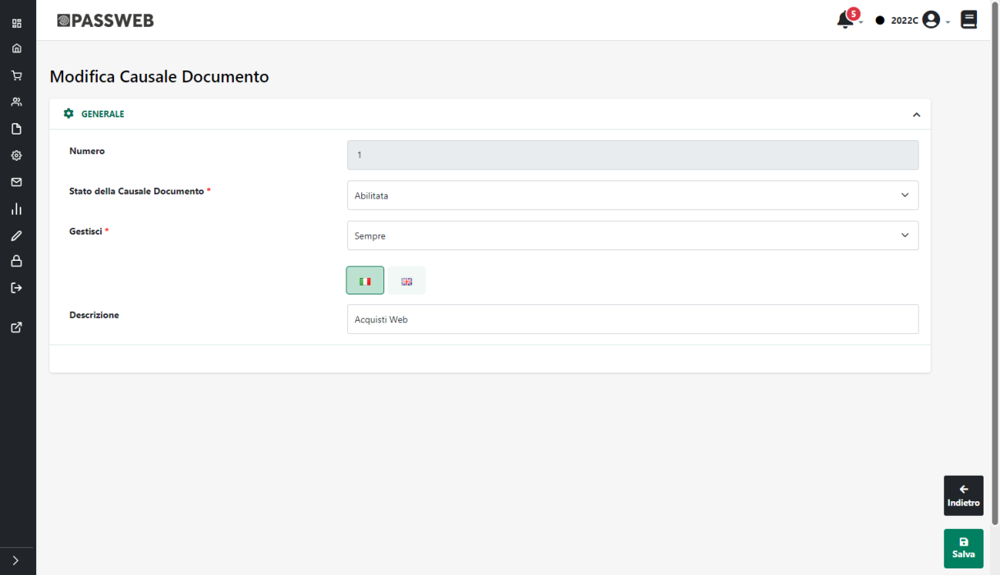
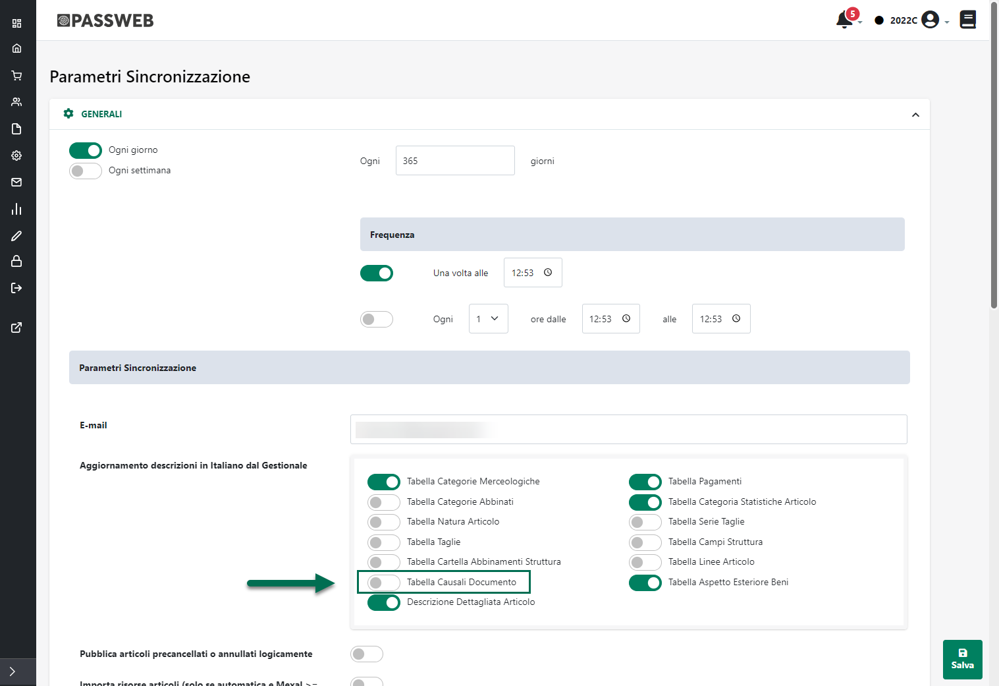
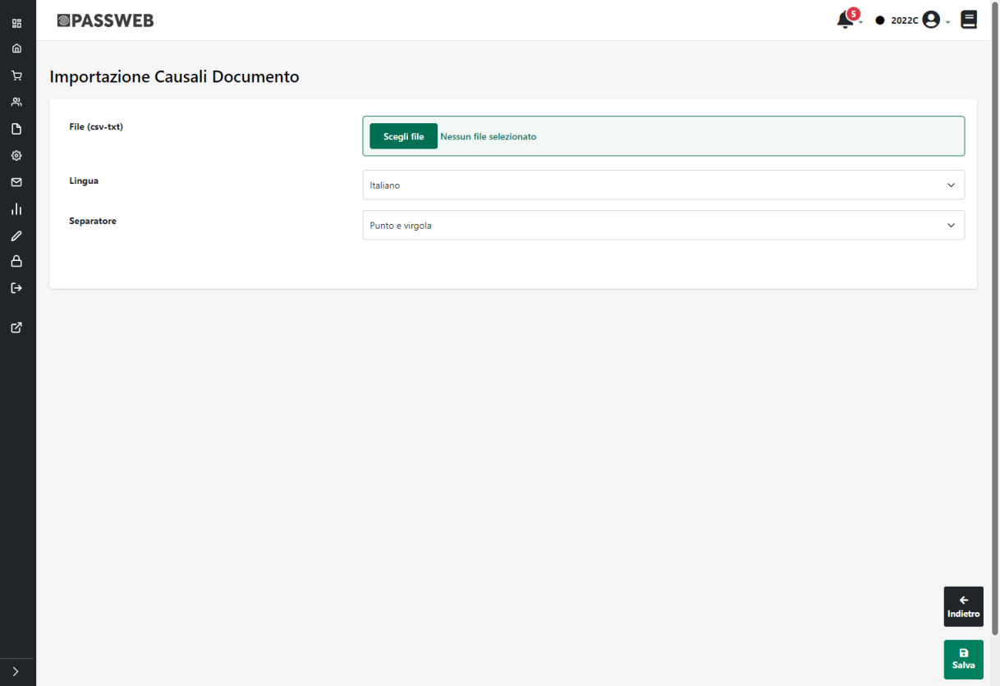

# OPERAZIONI SULL'ORDINE

Una volta acquisito l'ordine dalla piattaforma esterna sarà poi
possibile operare direttamente all'interno del gestionale Passepartout
per effettuare su esso diverse operazioni.

**In ogni caso la condizione indispensabile per mantenere sempre i due
documenti (quello gestionale e quello Prestashop) allineati è quella di
non apportare modifiche, sul gestionale, al documento acquisito dalla
piattaforma esterna in termini, ad esempio, di aggiunta o eliminazione /
variazione di righe articolo. Eventuali modifiche apportate in questo
senso non potranno essere replicate sul documento di Prestashop**

Nello specifico sarà quindi possibile:

- Annullare l'ordine ponendo il corrispondente documento Prestashop
  nello stato indicato in corrispondenza del parametro "**Stato Ordine
  Annullato**" (sezione "Ordini" della maschera di configurazione
  dell'Account)

- Trasformare l'ordine in Bolla ponendo il corrispondente documento
  Prestashop nello stato indicato in corrispondenza del parametro
  "**Stato Ordine Spedito**" (sezione "Ordini" della maschera di
  configurazione dell'Account)

- Trasformare l'ordine / bolla in fattura ponendo il corrispondente
  documento Prestashop nello stato indicato in corrispondenza del
  parametro "**Stato Ordine Fatturato**" (sezione "Ordini" della
  maschera di configurazione dell'Account)

**ATTENZIONE!** Nel momento in cui l'esigenza dovesse essere quella di
non gestire in automatico il cambio di stato degli ordini, effettuando
dunque questo tipo di operazione direttamente all'interno di Prestashop,
sarà necessario accertarsi che i documenti acquisiti dalla piattaforma
terza siano poi configurati all'interno del gestionale in maniera tale
da non essere più esportati su Passweb.

Nei successivi capitoli di questo manuale verranno descritte le
procedure da seguire per effettuare ciascuna delle operazioni sopra
indicate

##### ANNULLARE UN ORDINE

Per annullare un' ordine Prestashop operando direttamente all'interno
del gestionale Passepartout sarà necessario:

- Aprire l'ordine all'interno del gestionale

- Annullare tutte le righe del documento

- Effettuare una sincronizzazione tra Passweb ed il gestionale

Al termine di questa sincronizzazione Passweb verificherà che l'ordine
in esame è stato posto nello stato di "Annullato" e provvederà quindi a
porre il corrispondente ordine Prestashop nello stato indicato in
corrispondenza del parametro "**Stato Ordine Annullato**" presente nella
sezione "Ordini" della maschera di configurazione dell'Account

{width="5.616666666666666in"
height="3.577777777777778in"}

##### CREARE UNA SPEDIZIONE

Per poter generare una spedizione su Prestashop partendo dal documento
acquisito all'interno del gestionale Passepartout, la prima cosa da fare
sarà quella di verificare di aver mappato correttamente tutti i corrieri
in uso su Prestashop con altrettanti vettori gestionali (per maggiori
informazioni in merito a come poter effettuare questo mapping si vedano
i precedenti capitoli di questo manuale).

Fatto questo sarà poi necessario aprire l'ordine all'interno del
gestionale e trasformarlo in bolla facendo attenzione ad inserire le
seguenti informazioni:

- Uno dei vettori utilizzati per mappare i corrieri in uso su Prestashop

> **ATTENZIONE!** L'informazione del corriere è un dato obbligatorio per
> creare una spedizione su Prestashop per cui se, in fase di creazione
> della bolla / fattura, non dovesse essere indicato, nel piede del
> documento gestionale, nessun vettore o comunque un vettore non
> correttamente mappato con i corrieri di Prestashop, in fase di
> sincronizzazione verrà ritornato un errore.

- Una data e un orario di spedizione

- Un Tracking Number

Nello specifico poi nel momento in cui il gestionale in uso dovesse
essere **Mexal, Vettore Data di Inizio Trasporto** e N**umber Tracking**
dovranno essere inseriti nei relativi campi del piede del documento

{width="5.058333333333334in"
height="2.1951388888888888in"}

**ATTENZIONE!** Affinchè data e ora di inizio trasporto possano essere
correttamente visibili nel piede di tutti i documenti Mexal, è
necessario che il parametro di magazzino "**Memorizza data e ora inizio
trasporto**" sia stato correttamente selezionato

{width="5.052083333333333in"
height="4.019444444444445in"}

Nel caso in cui il parametro in oggetto non fosse stato selezionato Data
e ora di inizio trasporto potranno essere visibili all'interno di bolle
e/o fatture ma non all'interno di ordini.

**ATTENZIONE!** Nel caso in cui si sia scelto di gestire il **Number
Tracking** mediante un apposito attributo Passweb, il codice di
spedizione dovrà ovviamente essere inserito nell'apposito campo della
**videata riportabile utente** utilizzato per gestire questo tipo di
informazione (per maggiori dettagli relativamente alla gestione del
Number Tracking in Mexal si veda anche quanto indicato all'interno della
sezione "*Ordini -- Configurazione Ordini -- Impostazioni generali*" di
questo manuale).

Nel caso in cui il gestionale in uso dovesse invece essere **uno dei
gestionali Ho.Re.Ca.** ,**Vettore e Data di Inizio Trasporto** dovranno
essere inseriti nei relativi campi del piede del documento

{width="5.480555555555555in"
height="2.8180555555555555in"}

**ATTENZIONE!** Nel caso in cui si sia scelto di gestire il **Number
Tracking** mediante un apposito attributo Passweb, il codice di
spedizione dovrà essere inserito direttamente su Passweb all'interno di
un apposito Attributo Ordine.

Una volta impostate le informazioni sopra indicate a seguito della
prossima sincronizzazione verrà esportata su Passweb la Bolla appena
creata e, contestualmente, verrà anche portato il corrispondente
documento Prestashop nello stato indicato in corrispondenza del
parametro "**Stato Ordine Spedito**" presente nella sezione "Ordini"
della maschera di configurazione dell'Account

{width="6.097222222222222in"
height="3.8833333333333333in"}

##### CREARE UNA FATTURA

Per concludere un ordine Prestashop (marcandolo generalmente come
"Pagato") sarà necessario:

- Aprire l'ordine / bolla all'interno del gestionale

- Trasformare il documento in Fattura

- Effettuare una sincronizzazione tra Passweb ed il gestionale

Al termine della sincronizzazione Passweb verificherà che per l'ordine /
bolla in esame è stata emessa fattura e provvederà quindi a e provvederà
quindi a porre il corrispondente ordine Prestashop nello stato indicato
in corrispondenza del parametro "**Stato Ordine Fatturato**" presente
nella sezione "Ordini" della maschera di configurazione dell'Account

{width="6.097222222222222in"
height="3.8833333333333333in"}

In questo senso è bene sottolineare poi che se la trasformazione
effettuata nel gestionale dovesse essere **direttamente da ordine a
fattura** e nel piede del documento fossero inserite anche le seguenti
informazioni:

- Uno dei vettori utilizzati per mappare i corrieri in uso su Prestashop

- Una data e un orario di spedizione

- Un Tracking Number

allora oltre a portare l'ordine nello stato indicato in corrispondenza
del parametro "Stato Ordine Fatturato", allo stesso documento verrà
assegnato anche lo stato indicato in corrispondenza del parametro "Stato
Ordine Spedito"

Infine è sempre bene ricordare che **l'integrazione Passweb --
Prestashop prevede, ovviamente, che la fatturazione sia gestita
direttamente dai gestionali Passepartout.**

Per evitare dunque di comunicare al cliente eventuali numeri di fatture
non valide ai fini fiscali, oltra ad allineare i relativi numeratori e a
riservare un' apposito sezionale per gli ordini acquisti direttamente da
Prestashop, si consiglia anche di disabilitare, laddove possibile,
eventuali opzioni di fatturazione presenti sulla piattaforma esterna (e
relativo invio di mail al cliente).

Nel momento in cui ciò non fosse possibile si consiglia di inserire
nelle mail, e nel dettaglio di eventuali fatture generate dalla
piattaforma esterna, un apposito testo per indicare al cliente che il
documento ricevuto non è quello fiscalmente valido, documento questo che
gli verrà invece inviato tramite mail (da Mexal o da Passweb) e che
potrà essere scaricato in forma elettronica mediante Sistema di
Interscambio (SdI)

Nel caso specifico di Prestashop è possibile disabilitare la
fatturazione mediante il parametro "**Attiva Fatturazione**" presente
all'interno della sezione **"Ordini -- Fatture"**

{width="5.0777777777777775in"
height="3.532638888888889in"}

